# BeFive: Architecture

Draft 4, October 1, 2026 (draft 1: September 27; drafts 2 and 3: September 28). Stage 3 (architecture). Draft 3 named the product (now **BeFive**, see the rename note below) and added anomaly detection and scripted response with ServiceNow and LLM integrations (section 14, a new MVP must-have; sections 14 to 22 of draft 2 are now 15 to 23). Draft 2 added optional access-log sampling and moved CloudWatch metrics and usage accounting to per-node summary lines (12.3). Builds on `01-mvp-scope-and-stack.md` (the approved MVP scope and stack); where this document and doc 1 seem to differ, doc 1 wins and this document has a bug. The companion UI design is `03-ui-design.md`.

**Rename note (September 28, 2026):** the product was renamed from Emissary to BeFive after Draft 3; all derived names were changed mechanically (CLI `b5ctl`, key prefixes `b5k_`/`b5a_`, headers `X-BeFive-*`, namespaces `befive.*`, variables `BEFIVE_*`). Draft 3 content was otherwise unchanged by the rename.

**Draft 4 changelog (October 1, 2026).** Incorporates the customer requirements (`00-customer-requirements.md`) as scoped by `01-mvp-scope-and-stack.md` **Draft 4.1** and listed in `04-requirements-traceability.md` section 5. New subsections inside existing chapters: 5.6 and 5.7 (APIs, versions, operations, organizations, applications, subscriptions and their tables), 6.9 and 6.10 (compiling operations onto routes; promoted bundles), 8.9 to 8.11 (SSE, per-level size limits, stream metrics; AWS Lambda upstreams; service discovery), 9.9 to 9.12 (inbound stripping order, gateway-signed internal JWT and JWKS, upstream mTLS, IdP outage resilience and the Okta outage runbook), 10.5 (claims expression language), and 11.6 (new rate-limit dimensions and plan precedence). New chapters 23 to 34: policy hierarchy and effective policy (23), classification and access requests with ServiceNow, generic webhooks, and optional Okta app creation (24), developer portal (25), OpenAPI pipeline, lifecycle, mocks, and data dictionary (26), versioning and deprecation (27), composite endpoints (28), encrypted response caching (29), asynchronous endpoints and jobs (30), telemetry sinks and the Datadog recipe (31), reporting (32), InfoSec retention and evidence export (33), and linked environments and promotion (34). The former chapter 23 (open questions and risks) is now **35**; chapters 1 to 22 keep their numbers so that references from `03-ui-design.md` stay valid. Changed existing sections: 1, 2.1, 2.4, 2.5, 3.1, 3.2, 4.1, 4.2, 5.2, 5.4, 6.4, 6.8, 7.3, 7.4 (phase order now has 21 slots), 7.6, 8.1, 8.2, 8.8, 9.3, 9.4, 9.8, 10.1, 11.1, 11.2, 11.5 (IETF `RateLimit` headers are now the default), 12.2 to 12.6, 12.8, 13.2, 13.4, 13.5, 14 (Draft 4.1 scope labels: LLM analysis, Event Management, and Teams and email anomaly notifications are **1.1**; consumer block and route disable are **1.1 or later**; designs kept), 15.2, 15.6 (Automation Manager, API Owner, portal Developer), 15.7, 16.1 to 16.3, 18.1, 18.4, 18.5, 20.1, 20.5, 21.3, 22, 35, and Appendix A (decisions 41 to 60).

Default identity header names change from the Draft 3 `X-Gateway-*` prefix to `X-BeFive-*` (9.8), matching the other BeFive headers; names stay configurable.

**Update (October 1, 2026).** Applies four owner answers: Okta apps that BeFive creates use `private_key_jwt` only (24.8; key custody refined in Update 2 below); the 0.x portal preview may be reached by partners from outside, with strengthened internet-exposure measures (25.1, 25.3, 18.1); the IETF `RateLimit` headers stay the default while BeFive tracks the final RFC wording (11.5); and deprecation emails to developers are in 1.0 (new 27.5). Questions 16 to 19 in 35.1 are resolved; Appendix A adds decision 61.

**Update 3 (October 1, 2026).** Generated-key retention (owner decision): a BeFive-generated Okta client private key is deleted from the secrets store immediately after the one-time download, or after 24 hours if it is never downloaded; a sweeper job enforces the 24-hour limit and the deletion is audited (24.8, 35.2, Appendix A 50).

**Update 2 (October 1, 2026).** Key custody for Okta apps that BeFive creates: by default the developer generates the key pair and uploads only the public key, and BeFive never holds the private key; BeFive-generated keys are an opt-in, Administrator-only install setting, excluded for Restricted APIs (24.8, 35.2, Appendix A 50).

**Release labels.** Unless a section says otherwise, everything in this document is in 1.0. Sections or items marked **(0.x)** are already in the design-partner build, **(1.1)** arrive in the first update, and **(1.1 or later)** are designed but not scheduled. Doc 1, 4.1 is authoritative for the split.

**Status of numbers in this document.** Every latency, throughput, size, or cost figure is either a *target* (labeled as such), a *default* (a configuration value we ship), or a *budget* (an allocation of a target across components). Nothing here is a measurement; no code exists yet.

**Naming.** The product is **BeFive**. "The gateway" in this document means BeFive's data plane (and, loosely, the product). The short form B5 is used only inside identifiers. Names derived from the product: Clojure namespace root and qualified-keyword prefix `befive` (`befive.gateway.*`, `:befive/format`), CLI binary `b5ctl`, credential prefixes `b5k_` (consumer API keys) and `b5a_` (admin API tokens), environment variables `BEFIVE_*`, HTTP headers `X-BeFive-*`, schema names `befive.<stream>/<version>` (for example `befive.access/1`), Docker image `befive`, CloudWatch namespace `BeFive`, Datadog and other metric prefixes `befive.`, log groups `/befive/*`, and console title "BeFive Console". The logo is concept 3, "transit" (usage in doc 3, 7.9); the logo files are being reworked for the new name in parallel, and the path `/workspace/befive-logo/concept-3/` used here is the expected post-rename location.

---

## Contents

1. [Architecture summary](#1-architecture-summary)
2. [System context and deployment topologies](#2-system-context-and-deployment-topologies)
3. [Repository and module layout, build outputs](#3-repository-and-module-layout-build-outputs)
4. [Runtime composition: Integrant system per role](#4-runtime-composition-integrant-system-per-role)
5. [Core domain model and database design](#5-core-domain-model-and-database-design)
6. [Configuration lifecycle](#6-configuration-lifecycle)
7. [Request lifecycle through the data plane](#7-request-lifecycle-through-the-data-plane)
8. [Proxying](#8-proxying)
9. [Authentication](#9-authentication)
10. [Authorization policies](#10-authorization-policies)
11. [Rate limiting and quotas](#11-rate-limiting-and-quotas)
12. [Observability](#12-observability)
13. [AWS dashboard and report recipe](#13-aws-dashboard-and-report-recipe)
14. [Anomaly detection and scripted response](#14-anomaly-detection-and-scripted-response)
15. [Admin API](#15-admin-api)
16. [CLI and configuration as code](#16-cli-and-configuration-as-code)
17. [Custom plugin SPI](#17-custom-plugin-spi)
18. [Security architecture](#18-security-architecture)
19. [Licensing](#19-licensing)
20. [Performance approach](#20-performance-approach)
21. [Upgrades, migrations, and compatibility](#21-upgrades-migrations-and-compatibility)
22. [Testing strategy](#22-testing-strategy)
23. [Policy hierarchy and effective policy resolution (Draft 4)](#23-policy-hierarchy-and-effective-policy-resolution-draft-4)
24. [Classification and the access-request workflow (Draft 4)](#24-classification-and-the-access-request-workflow-draft-4)
25. [Developer portal (Draft 4)](#25-developer-portal-draft-4)
26. [OpenAPI pipeline, lifecycle, sandbox and mocks, and the data dictionary (Draft 4)](#26-openapi-pipeline-lifecycle-sandbox-and-mocks-and-the-data-dictionary-draft-4)
27. [Versioning and deprecation (Draft 4)](#27-versioning-and-deprecation-draft-4)
28. [Composite endpoints (Draft 4)](#28-composite-endpoints-draft-4)
29. [Encrypted response caching (Draft 4)](#29-encrypted-response-caching-draft-4)
30. [Asynchronous endpoints and the job subsystem (Draft 4)](#30-asynchronous-endpoints-and-the-job-subsystem-draft-4)
31. [Telemetry sinks and the Datadog recipe (Draft 4)](#31-telemetry-sinks-and-the-datadog-recipe-draft-4)
32. [Reporting: rollups, report builder, schedules, and exports (Draft 4)](#32-reporting-rollups-report-builder-schedules-and-exports-draft-4)
33. [InfoSec: retention, audit coverage, and evidence export (Draft 4)](#33-infosec-retention-audit-coverage-and-evidence-export-draft-4)
34. [Linked environments, signed bundles, overlays, and promotion (Draft 4)](#34-linked-environments-signed-bundles-overlays-and-promotion-draft-4)
35. [Open questions and risks](#35-open-questions-and-risks)

Appendix A lists the decisions this document adds beyond doc 1, for the user to confirm.

---

## 1. Architecture summary

The gateway is one Clojure 1.12 application on Java 21, packaged as one uberjar inside one Docker image. At startup a *role* setting selects which Integrant components run:

| Role | What it runs | Scales |
|---|---|---|
| `gateway` | Data plane: Aleph/Netty listeners, compiled route table, interceptor pipeline, upstream pools, health checkers, rate limiter, access-log writer, metrics and usage aggregators (EMF summary lines), signal shipper (per-minute summaries to PostgreSQL for anomaly detection), heartbeat, enforcement of expiring runtime overrides; Draft 4: encrypted response cache (29), composite engine (28), Lambda invocation (8.10), service discovery (8.11), internal JWT minting (9.10), async job submit (30), telemetry sink adapters (31). | Horizontally, stateless (N nodes). |
| `control-plane` | Admin API (`/admin/v1`), web console assets, OpenID Connect (OIDC) console sign-in, audit log, database migrations, cluster status aggregation, route tester, anomaly detection and response rules (on the leader node), script runner pool, action outbox, integrations (ServiceNow, email, chat, webhooks; LLM from 1.1). Draft 4: developer portal surface (25, separate listener), access-request workflow (24), job dispatcher and callback listener (30), report rollups and scheduler (32), evidence export (33), link listener for promotion and catalog federation (34). | 1 to 2 nodes (active-active, both serve the API); optional portal-only tasks (25.2). |
| `all` | Both, in one JVM. | Evaluation and small installs. |

Five rules shape everything below:

1. **PostgreSQL is the single source of truth** for configuration, consumers, credentials (hashes only), admin users, audit events, and cluster status. Nothing else is authoritative.
2. **The hot path never touches PostgreSQL or blocks a Netty event-loop thread.** Gateway nodes compile configuration into an immutable in-memory `RouteTable` value and swap it atomically. All blocking work (JDBC, disk, AWS SDK calls) runs on virtual threads.
3. **One global, monotonically increasing configuration revision.** Every committed configuration change bumps it exactly once. A gateway node's state is fully described by "which revision have I applied", which makes propagation, diagnosis, and rollback simple.
4. **Configuration is plain data with one schema.** Malli schemas in a `.cljc` module validate the same documents in the Admin API, the gateway compiler, the CLI, and the ClojureScript console. JSON, EDN, and Transit are encodings of the same documents with the same key names.
5. **Fail static, never fail closed on the data plane because of the control plane.** Database, control plane, or Redis outages degrade freshness or accuracy, never availability of already-configured traffic. (Security checks themselves still fail closed: an unverifiable token is rejected.)

Draft 4 keeps the five rules with one bounded, documented exception to rule 2: asynchronous endpoints write one job row per submit on a virtual thread with a dedicated pool, and fail with `503` when PostgreSQL is down without affecting synchronous routes (30.2). Draft 4 also adds a domain layer above routes: **APIs** with **versions** and **operations** (5.6) compile onto ordinary routes (6.9), and their policies are resolved through a six-level hierarchy with locks at compile time (23), so the request path stays a precompiled chain.

---

## 2. System context and deployment topologies

### 2.1 System context

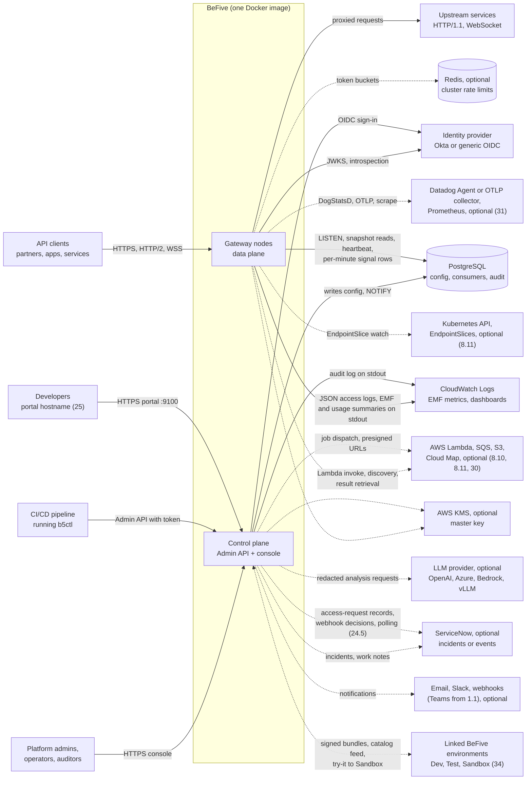

External dependencies and what happens when each is unavailable:

| Dependency | Required? | If unavailable |
|---|---|---|
| PostgreSQL 14+ | Yes | Gateways keep serving the last applied revision (from memory, or from the local last-known-good file after a restart). Admin API writes return `503`. Console shows a banner. |
| Identity provider (JWKS, introspection) | Only for routes that use it | JWT validation continues with cached keys up to a stale limit (default 24 h). Introspection routes return `503` after the result cache expires. |
| Redis 6.2+ | Optional | Per rate-limit policy: fail-open to per-node local buckets (default) or fail-closed with `503`. |
| CloudWatch | No (logs go to stdout) | No effect on the gateway; the log shipper buffers. |
| AWS KMS | Only if the master key is KMS-wrapped | Needed once at startup to unwrap data keys. Running nodes are unaffected. New nodes cannot start (see risks). |
| ServiceNow, LLM provider (1.1), SMTP relay, Slack, Teams (1.1), webhook targets | Only if configured as integrations (14) | No effect on traffic or detection. Actions wait in the durable outbox and retry for up to 24 h (14.11); incidents are created without the AI section if the LLM is unavailable. Access requests routed to ServiceNow or a webhook stay pending and are picked up by polling or retries (24.5). |
| Datadog Agent, OTLP collector | Only if the sink is enabled (31) | Metrics, logs, and traces for that sink are dropped after a bounded queue; EMF and other sinks are unaffected; readiness reports the sink as degraded. |
| AWS Lambda, SQS, S3, Cloud Map, Kubernetes API | Only for routes or features that use them (8.10, 8.11, 30) | Lambda routes return `502`/`503`/`504` per 8.10; discovery keeps the last target set (8.11); async submits keep working while dispatch retries; result retrieval fails with `502` while storage is down. |
| Okta Management API | Only if optional Okta app creation is enabled (24.8) | Provisioning of affected access requests waits in `provisioning-failed` and retries; nothing else is affected. |
| Linked environments | Only for promotion and catalog federation (34, 25.6) | Proposals queue in the source; the portal shows the last federated availability with its age. |

### 2.2 Topology A: single container evaluation

One container with `BEFIVE_ROLE=all`, plus PostgreSQL. The reference `docker-compose.yml` starts the gateway, PostgreSQL 16, and an optional mock upstream (`httpbin`-style echo). No Redis, in-memory rate limits.

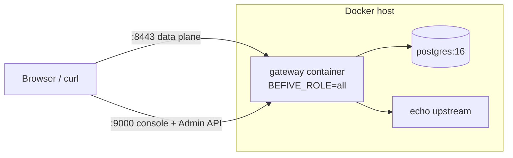

Ports (defaults, all configurable):

| Port | Role | Purpose |
|---|---|---|
| 8080 | gateway | Plain HTTP data plane (typically behind a TLS-terminating load balancer). |
| 8443 | gateway | TLS data plane (SNI, mTLS, HTTP/2 via ALPN). |
| 9000 | control-plane | Admin API, console, OIDC callback. |
| 9901 | both | Operations port: `/healthz`, `/readyz`, `/internal/metrics`, `/internal/info`, `/internal/prometheus` (31.5), and the BeFive JWKS when enabled (9.10). Never exposed publicly. |
| 9100 | control-plane | Developer portal (25), off until configured. |
| 9200 | control-plane | Job callback listener for backends (30.4), off unless async endpoints are used. |
| 9300 | control-plane | Link listener for linked environments (34.2), off until a link exists. |

### 2.3 Topology B: clustered install

N gateway containers (stateless, identical), one or two control-plane containers, a shared PostgreSQL (with its own HA, e.g. Amazon RDS Multi-AZ), and optional Redis (e.g. Amazon ElastiCache, cluster mode disabled, one primary plus replica). Gateway nodes need network access to PostgreSQL, Redis, IdPs, and upstreams; they do **not** need to reach the control plane, and the control plane does not need to reach them. All cluster coordination goes through PostgreSQL. This matters in segmented networks: the data plane can live in a DMZ-like subnet that can only reach the database port. Anomaly detection keeps this property: gateways deliver their per-minute summaries by writing to PostgreSQL (14.3). The control plane needs outbound HTTPS only to the integrations a customer configures (ServiceNow, an LLM endpoint, chat webhooks, an SMTP relay).

### 2.4 Topology C: AWS reference layout (ECS on Fargate; EKS is analogous)

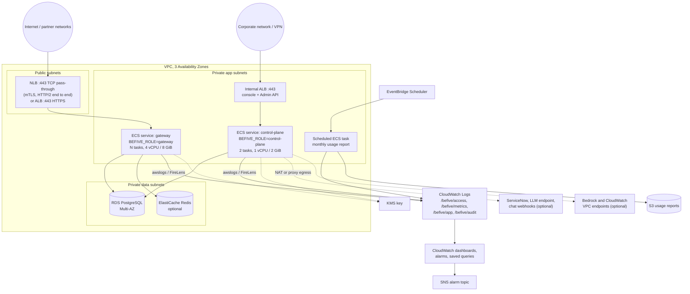

Decisions for the AWS layout:

- **Load balancer.** Use an **NLB with TCP pass-through** when any route uses client certificates (mTLS) or when end-to-end HTTP/2 matters; the gateway terminates TLS and reads the client address from Proxy Protocol v2. Use an **ALB** when TLS termination at AWS (ACM certificates, AWS WAF) is preferred; the gateway then listens on 8080 and trusts `X-Forwarded-For` from the ALB subnets only. ALB mTLS in "passthrough" mode is supported by reading `X-Amzn-Mtls-Clientcert` from trusted proxies.
- **Health checks.** Target groups health-check `GET /readyz` on port 9901 (target group health-check port override).
- **Deregistration.** Target group deregistration delay 30 s; the gateway's shutdown sequence (section 4.4) is tuned to it.
- **Logs.** Four log groups, separated by container log routing on the `type` field: `/befive/access` (access lines), `/befive/metrics` (EMF route summaries, node metric lines, and usage summaries; must use the Standard log class because the Infrequent Access class does not extract EMF), `/befive/app` (application logs), `/befive/audit` (audit events). With the plain `awslogs` driver all lines land in one Standard group; the recipe then points every query at that group and filters on `type`. FireLens (Fluent Bit) routing is recommended: audit logs can have longer retention, and `/befive/access` can use the cheaper Infrequent Access class when Logs Insights is enough for access-line analysis (12.3.8).
- **Integration egress.** Only the control-plane service needs outbound internet access, and only for configured integrations (ServiceNow, OpenAI or Azure OpenAI, Slack or Teams webhooks), through a NAT gateway or the customer's egress proxy. Amazon Bedrock and CloudWatch alarm polling (14.8) can use VPC interface endpoints so that traffic stays on the AWS network; the control-plane task role then needs `bedrock:InvokeModel` and `cloudwatch:DescribeAlarms`. Gateways need no new egress.
- **Secrets.** Database password and master key come from AWS Secrets Manager via ECS `secrets` (injected as environment variables) or the master key is a KMS key ARN (preferred).
- **Draft 4 additions to the layout.** The portal hostname (for example `developer.example.com`) is a listener rule on a public ALB that targets port 9100 of the production control-plane service, or of a separate portal-only ECS service (`BEFIVE_CP_SURFACES=portal`) in a public-facing subnet (25.2). The job callback listener (9200) and the link listener (9300) are exposed only on internal load balancers. Gateway tasks may need egress to Lambda, SQS, S3, and Cloud Map (VPC interface or gateway endpoints recommended), with task-role permissions listed in 8.10, 8.11, and 30.5. The Datadog Agent runs as a sidecar on ECS (DogStatsD over a shared Unix socket volume) or as a DaemonSet on EKS (31.3). Each environment (Dev, Test, Prod, Sandbox) is a separate copy of this layout (34).
- **EKS.** Same layout with Deployments, a Service of type LoadBalancer (NLB via AWS Load Balancer Controller), Fluent Bit DaemonSet, and a Kubernetes CronJob instead of EventBridge for the usage report. The Helm chart is post-MVP; the docs ship plain manifests.

### 2.5 Component view

```mermaid
flowchart TB
    subgraph gwrole["Gateway role"]
        lsn["Listeners<br/>Aleph + Netty<br/>TLS, SNI, ALPN, PROXY v2"]
        pipe["Pipeline executor<br/>interceptor chains"]
        rt["RouteTable atom<br/>reitit routers, chains, upstream refs"]
        comp["Snapshot compiler"]
        sync["Config sync<br/>LISTEN + poll + LKG file"]
        pools["Upstream pools<br/>Aleph client"]
        hc["Health checker<br/>active + passive"]
        authn["AuthN services<br/>JWKS cache, introspection cache,<br/>credential index"]
        rl["Rate limiter<br/>Bucket4j local / Redis"]
        alog["Access log writer<br/>async queue, optional sampling"]
        agg["Metrics + usage aggregators<br/>EMF and usage summary lines"]
        ctr["Live counters"]
        hb["Heartbeat + metrics flush"]
        ship["Signal shipper<br/>per-minute rows"]
        cache["Response cache<br/>Caffeine + optional Redis, AES-GCM"]
        compe["Composite engine<br/>Manifold step graphs"]
        disc["Service discovery<br/>DNS, Cloud Map, EndpointSlices"]
        sinks["Telemetry sinks<br/>DogStatsD, OTLP, Prometheus"]
    end
    subgraph cprole["Control-plane role"]
        api["Admin API<br/>reitit + Ring + Muuntaja + malli"]
        con["Console static assets"]
        sess["Sessions + OIDC login"]
        svc["Config service<br/>validate, diff, apply, revision bump"]
        aud["Audit service"]
        clus["Cluster view<br/>nodes, applied revisions, metrics"]
        tester["Route tester"]
        mig["Migrations<br/>Migratus"]
        anom["Anomaly engine (leader)<br/>signal store, detectors,<br/>lifecycle, grouping"]
        resp["Response engine<br/>rules, safety rails"]
        runner["Script runner pool<br/>SCI in native processes"]
        exe["Action executor<br/>outbox, integrations"]
        portal["Portal surface<br/>/portal/v1, SPA, try-it proxy"]
        wf["Access workflow<br/>approvals, ServiceNow, webhooks, Okta apps"]
        jobs["Job dispatcher<br/>callback listener, retention"]
        rep["Rollups + report scheduler"]
        link["Link service<br/>bundles, promotion, catalog feed"]
    end
    subgraph shared["Shared by both roles"]
        schema["befive.schema (cljc)<br/>malli registry"]
        keyring["Keyring<br/>envelope encryption"]
        lic["License verifier"]
        db["DB pool<br/>HikariCP + next.jdbc"]
        plug["Plugin loader"]
    end
    lsn --> pipe
    pipe --> rt
    sync --> comp --> rt
    pipe --> authn
    pipe --> rl
    pipe --> pools
    pools --> hc
    pipe --> alog
    pipe --> agg
    pipe --> ctr --> hb
    sync --> db
    hb --> db
    api --> svc --> db
    svc --> aud
    api --> clus --> db
    api --> tester --> comp
    sess --> db
    comp --> schema
    svc --> schema
    comp --> plug
    comp --> keyring
    agg --> ship --> db
    anom --> db
    anom --> resp
    resp --> runner
    resp --> exe
    exe --> svc
    exe --> keyring
    pipe --> cache
    pipe --> compe
    pools --> disc
    agg --> sinks
    portal --> db
    portal --> wf --> exe
    jobs --> db
    rep --> db
    link --> svc
```

The action executor writes runtime overrides (temporary IP blocks, rate-limit tightening) through the config service like any other configuration change (14.12), so they reach gateways through the normal revision flow.

Draft 4 components: the portal surface (25) runs in the control-plane role, or alone in a portal-only task; the access workflow (24) reuses the action outbox for every external effect; the job dispatcher (30) claims jobs with `SKIP LOCKED` like outbox workers; rollups and report schedules (32) run on the leader; the link service (34) turns approved promotions into ordinary config-service writes. On gateways, the cache, composite engine, discovery, and sinks are long-lived registries like upstream pools, so revision swaps do not rebuild them.

---

## 3. Repository and module layout, build outputs

### 3.1 Monorepo layout

One Git repository, one root `deps.edn` with `:local/root` dependencies between modules, one `build.clj` (tools.build).

```
befive/
├── deps.edn                    ; aliases: :dev :test :build :console :cli :recipe :bench
├── build.clj                   ; tools.build: uberjar, console release, native CLI, SBOM, recipe
├── modules/
│   ├── schema/                 ; befive.schema.*  .cljc only. Malli registry, domain schemas,
│   │                           ;   defaults, cross-entity validation, diff engine, DSL fns,
│   │                           ;   access-log field catalog, error codes. No JVM-only deps.
│   ├── core/                   ; befive.core.*    settings (Aero), db (next.jdbc, HoneySQL,
│   │                           ;   HikariCP), keyring (envelope crypto, KMS), license verify,
│   │                           ;   logging setup, JSON (jsonista), SSRF-safe HTTP client, ids
│   ├── plugin-api/             ; befive.plugin.api  the public, versioned SPI (tiny, stable)
│   ├── gateway/                ; befive.gateway.* listeners, pipeline executor, built-in
│   │                           ;   interceptors, compiler, sync, upstreams, health, authn,
│   │                           ;   authz, ratelimit, access log/EMF, heartbeat, signal shipper,
│   │                           ;   runtime override enforcement; Draft 4: befive.cache,
│   │                           ;   befive.composite, befive.gateway.lambda, befive.gateway.discovery,
│   │                           ;   befive.telemetry.{dogstatsd,otlp,prometheus,tracing}
│   ├── control-plane/          ; befive.cp.*      Admin API, sessions/OIDC, RBAC, config service,
│   │                           ;   audit, cluster view, route tester, migrations (resources/
│   │                           ;   migrations/*.sql), console asset serving, signal store,
│   │                           ;   anomaly engine, response engine, outbox, integrations, hooks;
│   │                           ;   Draft 4: befive.cp.portal, befive.access (workflow), befive.jobs,
│   │                           ;   befive.reports, befive.promotion, befive.evidence
│   ├── anomaly/                ; befive.anomaly.* .cljc only. Signal math (EWMA, median/MAD,
│   │                           ;   Space-Saving merge), detectors, lifecycle, grouping, rule
│   │                           ;   matching, replay harness. Used by control plane, CLI, console.
│   ├── script-runner/          ; befive.runner.*  native-image sandbox process for response
│   │                           ;   scripts (SCI, allow-listed namespaces, no I/O)
│   ├── app/                    ; befive.main      entry point, Integrant system per role,
│   │                           ;   `report` subcommand (usage report task)
│   ├── policy/                 ; befive.policy.*  .cljc. Hierarchy resolution, strength order,
│   │                           ;   lock validation, claims language compiler (10.5, 23)
│   ├── openapi/                ; befive.openapi.* swagger-parser wrapper, mapping, diff,
│   │                           ;   lint, export, mock generation, dictionary walker (26)
│   ├── console/                ; ClojureScript: shadow-cljs.edn, re-frame app; builds :console
│   │                           ;   and :portal (25) from shared component namespaces
│   ├── cli/                    ; befive.cli.*     b5ctl: validate/diff/apply/export, SCI-based
│   │                           ;   DSL evaluation, Admin API client
│   ├── aws-recipe/             ; befive.recipe.*  Terraform JSON + CloudFormation JSON generator
│   └── datadog-recipe/         ; befive.recipe.datadog  Terraform JSON for the datadog provider (31.6)
├── plugins/examples/           ; example plugins (JAR and source-dir forms)
├── docker/                     ; Dockerfile, docker-compose.yml, ECS task definition example
├── docs/                       ; MkDocs Material site; Redoc page embeds generated OpenAPI
├── test/e2e/                   ; cross-module end-to-end tests (Testcontainers)
└── perf/k6/                    ; k6 scripts, upstream echo server, result templates
```

Module dependency rules (enforced by a CI check that parses `deps.edn` files):

- `schema` depends on nothing but malli (and is the only module the console and the plugin API share with the server).
- `plugin-api` depends only on `schema`. Plugins compile against `plugin-api` alone.
- `gateway` and `control-plane` never depend on each other. The route tester in `control-plane` uses the pipeline through a narrow `befive.gateway.embed` namespace exposed by `gateway` (see 15.8); that dependency is one-way and allowed.
- `cli` depends on `schema` and `core` pieces that are native-image safe (no Netty, no HikariCP), plus `anomaly` for offline replay and script tests.
- `policy` and `openapi` depend only on `schema` (and `openapi` on swagger-parser, so it is JVM-only and used by the control plane and the JVM CLI; the native `b5ctl` calls the server for OpenAPI import). Gateways use `policy` for compile-time resolution.
- `anomaly` depends only on `schema` (it is `.cljc`, so the console can preview detectors on recorded data). `script-runner` depends only on SCI and a small `befive.script` helper namespace that lives in `anomaly`; it never depends on `core`, so it contains no database, HTTP, or file code at all.

### 3.2 Build outputs

| Output | Built by | Contents |
|---|---|---|
| `befive-<ver>.jar` (uberjar) | `clj -T:build uber` | `app` + `gateway` + `control-plane` + `core` + `schema` + `plugin-api`, AOT-compiled; console release bundle under `resources/public/console/`; migrations; OpenAPI JSON; build manifest (`version`, `git-sha`, `build-date`). |
| Docker image `befive:<ver>` | Multi-stage Dockerfile | Stage 1 builds the uberjar and console (Clojure CLI + Node for shadow-cljs). Stage 2 runs `jlink` to produce a trimmed Temurin 21 runtime. Stage 3 is a minimal glibc base (Ubuntu Chiseled or Distroless `base`), UID 10001, read-only root filesystem compatible (writes only to `/var/lib/befive` and `/tmp`). Entrypoint `java ... -jar /opt/befive/befive.jar`. |
| `befive-script-runner` native binaries | GraalVM `native-image` in CI | linux-amd64 and linux-arm64; copied into the Docker image at `/opt/befive/bin/`. The sandbox process for response scripts (14.10). |
| `b5ctl` native binaries | GraalVM `native-image` in CI | linux-amd64, linux-arm64, macOS arm64, Windows amd64. Same version as the image. Also published as `b5ctl.jar` for JVM use. |
| `plugin-api-<ver>.jar` | `clj -T:build plugin-api` | Published to the customer-accessible Maven repository (and bundled in the offline docs kit). |
| AWS recipe | `clj -T:build recipe` | `dist/aws/terraform/befive-observability/*.tf.json` and `dist/aws/cloudformation/befive-observability.json`. |
| Datadog recipe | `clj -T:build recipe` | `dist/datadog/terraform/befive-datadog/*.tf.json` plus README with facets (31.6). |
| Portal bundle | shadow-cljs `:portal` release, inside the uberjar | `resources/public/portal/` with content-hashed assets; served by the portal listener (25.2). |
| ServiceNow and workflow examples | docs build | Flow Designer and business-rule scripts for the request webhook (24.5), Jira Service Management example (24.6). |
| SBOMs, signatures | CI | CycloneDX SBOM for the uberjar and the image, cosign signature and SLSA provenance attestation for the image, SHA-256 checksums for all artifacts. |
| Offline kit | CI | Tarball: image (`docker save`), CLI binaries, docs site, OpenAPI, recipe, SBOMs, public signing keys. For air-gapped customers. |

The uberjar is AOT-compiled for startup time and to catch reflection early (`*warn-on-reflection*` is an error in CI for `gateway` and `core`). Direct linking is enabled for the uberjar build but not for dev.

### 3.3 Versioning

Product versions use `MAJOR.MINOR.PATCH`. The image, uberjar, CLI, recipe, and plugin API all share the product version, except that the plugin API additionally carries an SPI version (`1`) that changes only on breaking SPI changes. The build manifest's `build-date` is what the license check compares against (section 19).

---
## 4. Runtime composition: Integrant system per role

### 4.1 Settings (Aero)

Node-local settings (things that cannot come from the database because they are needed to reach it, or that are per-node by nature) live in one Aero EDN file baked into the image, overridable by environment variables and mounted secret files. Everything else is database configuration.

```clojure
;; resources/befive/settings.edn (abridged)
{:role        #keyword #or [#env BEFIVE_ROLE "all"]           ; :gateway | :control-plane | :all
 :node-id     #or [#env BEFIVE_NODE_ID nil]                   ; default: hostname + random suffix
 :environment #or [#env BEFIVE_ENVIRONMENT "default"]         ; CloudWatch "Environment" dimension
 :db {:jdbc-url #env BEFIVE_DB_URL
      :username #env BEFIVE_DB_USER
      :password #or [#env BEFIVE_DB_PASSWORD #befive/file #env BEFIVE_DB_PASSWORD_FILE]
      :pool     {:gateway 4 :control-plane 16}}           ; HikariCP max size by role
 :master-key  {:source #keyword #or [#env BEFIVE_MASTER_KEY_SOURCE "env"] ; :env | :file | :aws-kms
               :value  #or [#env BEFIVE_MASTER_KEY nil]
               :file   #or [#env BEFIVE_MASTER_KEY_FILE "/run/secrets/befive-master-key"]
               :kms-key-arn #or [#env BEFIVE_KMS_KEY_ARN nil]}
 :license-file #or [#env BEFIVE_LICENSE_FILE "/etc/befive/license.json"]
 :listeners {:http  {:port 8080 :enabled? true  :proxy-protocol? false}
             :https {:port 8443 :enabled? true  :proxy-protocol? false}
             :ops   {:port 9901}
             :admin {:port 9000}}
 :trusted-proxies #befive/cidrs #or [#env BEFIVE_TRUSTED_PROXIES "10.0.0.0/8"]
 :redis {:uri #or [#env BEFIVE_REDIS_URI nil]}
 :lkg   {:path "/var/lib/befive/lkg" :enabled? true}
 :plugins {:dir #or [#env BEFIVE_PLUGINS_DIR "/opt/befive/plugins"]}
 :script-runner {:path "/opt/befive/bin/befive-script-runner"
                 :pool 2 :heap-mb 128}                    ; control plane only (14.10)
 :hooks {:enabled? #boolean #or [#env BEFIVE_HOOKS_ENABLED "false"]} ; /hooks/v1 (14.8)
 :cp-surfaces #befive/keywords #or [#env BEFIVE_CP_SURFACES "admin,portal"] ; 25.2
 :portal-listener {:port 9100 :enabled? false}                 ; 25.2
 :jobs {:callback-listener {:port 9200 :enabled? false} :db-pool-size 4}  ; 30.2, 30.4
 :link-listener {:port 9300 :enabled? false}                   ; 34.2
 :cache {:memory-mb 256 :redis-uri #or [#env BEFIVE_CACHE_REDIS_URI nil]}  ; 29.5
 :aws {:async-http-client :netty :region #or [#env AWS_REGION nil]}    ; 8.10 (:crt fallback)
 :log {:access {:queue-size 65536}}}                     ; metrics, usage, sampling: database settings (5.3, 12.3)
```

Custom Aero tags: `#befive/file` (read and trim a file), `#befive/cidrs` (parse a comma-separated CIDR list), `#befive/keywords` (comma-separated keywords). Telemetry sinks, classification, retention, portal, and access-workflow settings are database settings documents (31.1, 24.1, 33.1, 25.3, 24.7), not node settings. The settings map is validated with a malli schema at startup; an invalid setting prints a humanized error and exits with code 78.

### 4.2 System map

`befive.main` builds the Integrant config from settings by merging role fragments. Keys are namespaced by module. Arrows in the table mean "refs".

**Shared keys (both roles):**

| Key | Depends on | Start | Stop |
|---|---|---|---|
| `:befive/settings` | none | Load and validate Aero settings. | none |
| `:befive/logging` | settings | Configure Logback JSON encoder, install the async access-log appender. | Flush and close appenders (last to stop). |
| `:befive/license` | settings | Read and verify the license file (section 19). Exits if the build is not covered. | none |
| `:befive/db` | settings | Create HikariCP pool. Does **not** fail startup if the DB is down on a gateway node (retries in background); fails startup on a control-plane node after 60 s. | Close pool. |
| `:befive/keyring` | settings, db | Resolve the master key (env, file, or KMS), load and unwrap data keys from `keyring` table (or from LKG header on a gateway without DB). | Zero key material arrays. |
| `:befive/plugins` | settings | Scan plugin dir, create classloaders, load manifests, register config schemas into the malli registry. | Close classloaders. |
| `:befive/schema-registry` | plugins | Final malli registry: built-ins plus plugin schemas. | none |
| `:befive/ops-server` | settings, health | Aleph server on 9901 for health, readiness, internal metrics. | Stop last among servers. |
| `:befive/health` | none | Registry of readiness checks (components add themselves). | none |

**Gateway keys:**

| Key | Depends on | Start | Stop |
|---|---|---|---|
| `:befive.gateway/lkg-store` | settings | Open LKG directory; read newest valid snapshot file if present. | none |
| `:befive.gateway/runtime` | none | Create the `RouteTable` atom (initially `nil`). | none |
| `:befive.gateway/system-http` | settings | Aleph client pool for IdP and health-check traffic, with SSRF guard. | Close pool. |
| `:befive.gateway/upstream-pools` | settings | Registry of per-upstream Aleph connection pools, keyed by pool-settings hash. | Close all pools after drain. |
| `:befive.gateway/jwks-cache` | system-http | Caffeine async cache of JWK sets per identity provider. | Invalidate. |
| `:befive.gateway/introspection-cache` | system-http, keyring | Caffeine cache of introspection results. | Invalidate. |
| `:befive.gateway/rate-limiter` | settings | Local Bucket4j proxy manager; plus Lettuce Redis client and `LettuceBasedProxyManager` if `:redis :uri` is set. | Close Redis connection. |
| `:befive.gateway/quota-store` | db, rate-limiter | Monthly quota counters (section 11.4), background flush every 5 s. | Final flush (best effort, 2 s budget). |
| `:befive.gateway/access-log` | logging, settings | Bounded MPSC queue plus one writer thread emitting JSON lines to stdout, with a never-dropped priority path for summary lines. | Drain queue (up to 2 s), close. |
| `:befive.gateway/aggregators` | settings, access-log | Route and usage aggregators (12.3.4), two generations each; flusher virtual thread aligned to interval boundaries. | Close the current partial interval and flush it (runs after the HTTP drain). |
| `:befive.gateway/signal-shipper` | db, settings, aggregators | Receives each closed minute from the aggregator flusher (status-code arrays, error codes, IP sketches, exemplars, consumer totals), inserts one `summary_inbox` row per minute on a virtual thread, buffers up to 15 minutes if the database is unreachable, prunes its own old rows (14.3). | Insert the final partial minute (best effort, 2 s). |
| `:befive.gateway/counters` | none | Live counters (section 12.6). | none |
| `:befive.gateway/compiler` | schema-registry, keyring, plugins, upstream-pools, jwks-cache, introspection-cache, rate-limiter, quota-store, counters, access-log, aggregators | Pure-ish function holder: `snapshot -> RouteTable`. | none |
| `:befive.gateway/config-sync` | db, lkg-store, compiler, runtime, health | Load initial snapshot (DB, else LKG), compile, `reset!` runtime, start LISTEN loop and poller on virtual threads. Registers readiness check "config-loaded". | Stop loops, release LISTEN connection. |
| `:befive.gateway/health-checker` | runtime, system-http | Active probes per target, driven by current RouteTable; passive state per target. | Cancel probes. |
| `:befive.gateway/http-server` | runtime, settings, counters, access-log, aggregators, health | Aleph servers on 8080/8443 with the pipeline handler; SNI mapping reads current RouteTable certificates. | Graceful drain (section 4.4). |
| `:befive.gateway/heartbeat` | db, runtime, counters, settings, license | Upsert `gateway_node` row every 5 s; flush counters to `node_metrics` every 10 s. | Mark node `stopping`, final upsert. |
| `:befive.gateway/response-cache` | settings, keyring, rate-limiter (Redis client) | Caffeine L1 with weigher, optional Redis L2, purge-generation listener (29). | Invalidate. |
| `:befive.gateway/discovery` | settings, system-http, runtime | DNS, Cloud Map, and EndpointSlice sources per discovered upstream (8.11). | Stop watches and pollers. |
| `:befive.gateway/aws-clients` | settings | Lambda, SQS, Cloud Map async clients on a dedicated SDK event loop group (8.10). | Close clients. |
| `:befive.gateway/composite-runners` | settings | Gateway script-runner pool, started only if composites use expressions (28.4). | Terminate processes. |
| `:befive.gateway/jobs` | db, settings | Small Hikari pool and virtual-thread submitter for async endpoints (30.2). | Close pool. |
| `:befive.gateway/telemetry-sinks` | settings, aggregators | DogStatsD, OTLP metric, Prometheus adapters fed by closed generations; OTel tracer provider (31). | Flush (2 s), close. |

**Control-plane keys:**

| Key | Depends on | Start | Stop |
|---|---|---|---|
| `:befive.cp/migrations` | db | Acquire `pg_advisory_lock`, run pending Migratus migrations (if `:migrate-on-start?`, default true), release lock. | none |
| `:befive.cp/repo` | db, migrations, schema-registry | Data access functions (HoneySQL). | none |
| `:befive.cp/keyring-admin` | keyring, repo | First-run data-key creation, rotation jobs. | none |
| `:befive.cp/audit` | repo, logging | Append audit events (DB + stdout audit stream). | none |
| `:befive.cp/config-service` | repo, audit, schema-registry, keyring | Validate, diff, apply, revision bump, NOTIFY. | none |
| `:befive.cp/cluster` | repo | Node registry reader, metrics aggregator (reads `node_metrics`), retention job. | Stop job. |
| `:befive.cp/events` | cluster, repo | Server-Sent Events hub for the console (section 15.9). | Close streams. |
| `:befive.cp/sessions` | repo, settings | Session store, OIDC client (Nimbus OAuth2 SDK is not used; OIDC login uses Nimbus JOSE for ID token validation plus plain HTTP calls). | none |
| `:befive.cp/tester` | compiler (embedded), config-service | Route tester (section 15.8). | none |
| `:befive.cp/leader` | db | Holds the `befive.anomaly` advisory lock on a dedicated connection when it can; exposes `leader?` to the components below. | Release lock. |
| `:befive.cp/signal-store` | repo, leader | On the leader: per-minute merge of `summary_inbox` into `signal_*` tables, rollups, retention (14.4). | Stop job. |
| `:befive.cp/external-sources` | repo, leader, keyring, settings | CloudWatch alarm poller on the leader; verification and intake for `/hooks/v1` deliveries on every node (14.8). | Stop poller. |
| `:befive.cp/anomaly-engine` | signal-store, external-sources, repo, config-service | On the leader: detectors, lifecycle, grouping, silences, config-change correlation; emits incident events (14.6, 14.7). | Persist state, stop. |
| `:befive.cp/script-runners` | settings | Pool of `befive-script-runner` processes; kills and respawns on timeout (14.10). | Terminate processes. |
| `:befive.cp/integrations` | keyring, repo, settings | Clients for ServiceNow, LLM providers, SMTP, Slack, Teams, and webhooks over the SSRF-guarded HTTP client; token caches; connection tests (14.13, 14.14). | Close clients. |
| `:befive.cp/response-engine` | anomaly-engine, script-runners, repo, audit | Matches response rules, runs scripts, applies safety rails, writes the outbox (14.9 to 14.12). | Drain queue (5 s). |
| `:befive.cp/action-executor` | repo, integrations, config-service, audit | Outbox workers on every node (`SKIP LOCKED`), approvals expiry, runtime-override creation and cleanup (14.11, 14.12). | Finish in-flight actions (10 s), stop. |
| `:befive.cp/access-workflow` | repo, action-executor, integrations, audit | Access-request state machine, approval steps, ServiceNow and webhook adapters, Okta app provisioning, expiry and polling jobs (24). | Stop jobs. |
| `:befive.cp/portal-server` | repo, sessions, access-workflow, settings | Portal handler and listener on 9100, try-it proxy, catalog index maintenance (25). Started when `:cp-surfaces` contains `portal`. | Graceful stop (10 s). |
| `:befive.cp/job-dispatcher` | repo, keyring, settings | Job claims, dispatch, callback listener on 9200, client callbacks, retention (30). | Finish in-flight dispatches (10 s). |
| `:befive.cp/report-scheduler` | repo, leader, signal-store | Rollups from merged minutes, schedule evaluation, report runs and delivery (32). | Stop jobs. |
| `:befive.cp/bundle-signer` | keyring, repo | Link keys, evidence key, bundle signing and verification (33.3, 34.3). | none |
| `:befive.cp/link-service` | bundle-signer, config-service, repo, settings | Link listener on 9300, proposals, promotion apply, catalog feed (34, 25.6). | Stop listener. |
| `:befive.cp/admin-handler` | all cp services above, license | reitit Ring handler for `/admin/v1`, `/hooks/v1` (when enabled), console assets, OIDC callback. | none |
| `:befive.cp/admin-server` | admin-handler, settings | Aleph server on 9000; handlers run on a virtual-thread executor. | Graceful stop (10 s). |

In role `all`, both sets start in one JVM, sharing `:befive/db` (pool size is the sum), `:befive/keyring`, `:befive/plugins`, and the schema registry.

Integrant config sketch for the gateway role:

```clojure
{:befive/settings {}
 :befive/db {:settings #ig/ref :befive/settings}
 :befive/keyring {:settings #ig/ref :befive/settings :db #ig/ref :befive/db}
 :befive.gateway/compiler {:registry #ig/ref :befive/schema-registry
                       :keyring  #ig/ref :befive/keyring
                       :pools    #ig/ref :befive.gateway/upstream-pools
                       :rate-limiter #ig/ref :befive.gateway/rate-limiter
                       ...}
 :befive.gateway/config-sync {:db #ig/ref :befive/db
                          :lkg #ig/ref :befive.gateway/lkg-store
                          :compiler #ig/ref :befive.gateway/compiler
                          :runtime #ig/ref :befive.gateway/runtime
                          :poll-interval-ms 10000
                          :debounce-ms 250}
 :befive.gateway/http-server {:runtime #ig/ref :befive.gateway/runtime
                          :listeners (:listeners settings)
                          :drain {:delay-ms 10000 :timeout-ms 30000}}}
```

### 4.3 Startup order and readiness (gateway role)

1. Settings, logging, license (fail fast on invalid settings or an uncovered build).
2. DB pool created; connection attempts retry with backoff in the background.
3. Keyring: unwrap data keys from the DB, or from the LKG header if the DB is unreachable (requires master key access).
4. Plugins loaded.
5. Config sync loads a snapshot: DB first (up to 10 s), then LKG file. Compiles. Stores the RouteTable.
6. Listeners bind. `/readyz` turns `200` only when a RouteTable exists and listeners are bound.
7. Heartbeat starts.

A gateway with neither DB nor LKG stays not-ready (listens on 9901 only, keeps retrying) rather than exiting, so orchestrators do not crash-loop it during a database outage.

### 4.4 Graceful shutdown (SIGTERM)

1. `/readyz` returns `503` immediately; heartbeat marks the node `draining`.
2. Keep accepting and serving for `drain.delay-ms` (default 10 s) so the load balancer observes deregistration.
3. Stop accepting new connections. Send `Connection: close` on HTTP/1.1 responses and GOAWAY on HTTP/2.
4. Wait for in-flight requests up to `drain.timeout-ms` (default 30 s); WebSockets receive a close frame (1001 Going Away).
5. Stop remaining components in reverse dependency order: close and flush the current metrics and usage interval (12.3.4) and hand it to the signal shipper, drain the access log, and flush quota counters.

The ECS task `stopTimeout` should be at least 45 s (drain delay + timeout + margin); the ECS example sets 60 s.

---

## 5. Core domain model and database design

### 5.1 Principles

- **Natural, human-chosen identifiers.** Every configuration entity has an `id` that is a slug (`[a-z0-9][a-z0-9-]{0,62}`), chosen by the user and immutable. No UUIDs appear in configuration. This is what makes export from staging and apply to production work without ID mapping. Server-generated IDs are used only for things that are never promoted across environments: credentials (`cred_` + ULID), audit events (UUIDv7), admin API tokens, sessions.
- **One document shape everywhere.** The malli schema defines the document. The database stores the document as `jsonb` plus a few extracted columns for foreign keys, uniqueness, and filtering. JSON, EDN, and Transit encodings use identical key names (kebab-case, unqualified). Server-managed metadata lives under a separate `:meta` key that the diff engine ignores.
- **Open for reading, closed for writing.** Write schemas are closed maps (unknown keys are errors, catching typos in config files). The gateway compiler reads with the same schemas but tolerates unknown keys under `:x-` prefixes (reserved for customer annotations).
- **Secrets are references.** A document never contains a secret value. It contains a secret reference `{:secret "okta-introspection-secret"}` pointing at the `secret` table, whose values are encrypted (section 18.2).

### 5.2 Entity overview

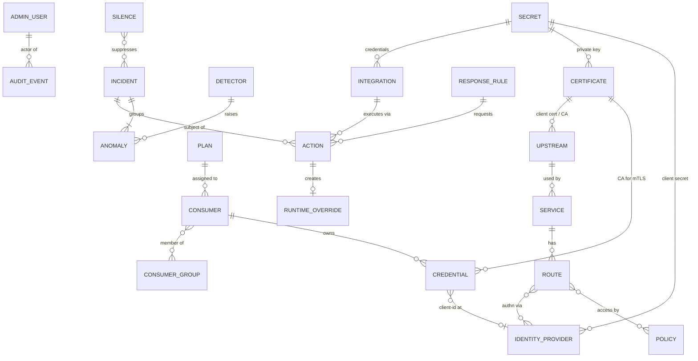

| Entity | Purpose | Promoted by config-as-code? |
|---|---|---|
| Upstream | A pool of targets with load balancing, health checks, upstream TLS, pool limits. | Yes |
| Service | A logical backend API: references one upstream, holds defaults for routes (timeouts, retries, path prefix, identity forwarding). | Yes |
| Route | Match rules plus the per-route pipeline: authn, access policy, rate limits, transforms, plugins. Belongs to a service. | Yes |
| Policy | Named, reusable access rule tree. | Yes |
| Consumer group | Named list of consumers, referenced by policies. | Yes |
| Plan | Rate limits and quotas assigned to consumers. | Yes |
| Consumer | An application or partner. Has a plan, groups, metadata. | Yes (optional; `--include consumers`) |
| Credential | API key hash, OAuth client ID mapping, or client-certificate mapping. Belongs to a consumer. | Metadata only; secrets never exported |
| Identity provider | OIDC/OAuth2 issuer configuration (Okta preset or generic). | Yes (secret refs only) |
| Certificate | Server certificates (SNI), CA bundles (mTLS trust), upstream client certificates. | Yes (PEM chain; private key by secret ref) |
| Secret | Encrypted value referenced by name. | Names only; values per environment |
| Plugin instance | Not an entity; lives inside a route's `:plugins` vector. | Yes |
| Admin user, API token | Console and API principals. | No |
| Audit event | Append-only administrative history. | No |
| Setting | Global settings documents (SSO, logging/EMF, trusted headers, default route settings). | Selected keys |
| License | Installed license files. | No |
| Detector | Watches signals and decides when a value is anomalous (14.6). | Yes |
| Response rule | Maps incident events to actions, declaratively or through a sandboxed script (14.9, 14.10). | Yes (scripts as source) |
| Silence | Suppresses actions for matching anomalies for a time window; maintenance windows (14.7). | Recurring ones yes; one-off ones usually created per environment |
| Integration | ServiceNow, LLM provider, SMTP, Slack, Teams, webhook, or external anomaly source (14.13, 14.14, 14.8). | Yes (secret refs only) |
| Runtime override | Temporary, expiring traffic change created by automation or a user: IP block, consumer block, rate-limit factor, disabled route (14.12). | No (environment-specific and temporary) |
| Anomaly, incident, action | Detection results, their grouping, and executed or pending actions (14.15). | No |

Draft 4 adds APIs, versions, operations, organizations, applications, subscriptions, access requests, policy attachments, and the other Draft 4 entities; they are described in 5.6 with their tables in 5.7.

### 5.3 Schema sketches (malli, in `modules/schema/src/befive/schema/*.cljc`)

Schemas for detectors, response rules, silences, integrations, runtime overrides, and the `:anomaly` settings document are in 14.15.

Common building blocks:

```clojure
(def Id       [:re {:error/message "lowercase letters, digits, dashes; max 63"}
               #"^[a-z0-9][a-z0-9-]{0,62}$"])
(def Tags     [:set {:max 32} [:re #"^[a-z0-9][a-z0-9-_.:/]{0,62}$"]])
(def Duration [:int {:min 0 :max 3600000}])            ; milliseconds
(def SecretRef [:map {:closed true} [:secret Id]])
(def HeaderName [:re #"^[A-Za-z0-9!#$%&'*+.^_`|~-]{1,128}$"])
(def Cidr     [:fn {:error/message "must be an IPv4 or IPv6 CIDR"} valid-cidr?])
(def Method   [:enum :get :head :post :put :patch :delete :options])
(def Meta     [:map                                     ; server-managed, read-only
               [:version pos-int?] [:revision pos-int?]
               [:created-at inst?] [:updated-at inst?]
               [:created-by :string] [:updated-by :string]])
```

Upstream and service:

```clojure
(def Target
  [:map {:closed true}
   [:host [:string {:min 1 :max 253}]]
   [:port [:int {:min 1 :max 65535}]]
   [:weight {:default 100} [:int {:min 0 :max 1000}]]   ; 0 = drained
   [:tags {:optional true} Tags]])

(def Upstream
  [:map {:closed true}
   [:id Id]
   [:description {:optional true} [:string {:max 1024}]]
   [:scheme {:default :http} [:enum :http :https]]
   [:targets [:vector {:min 1 :max 256} Target]]
   [:load-balancing {:default :round-robin} [:enum :round-robin :least-connections]]
   [:health-checks {:optional true}
    [:map {:closed true}
     [:active {:optional true}
      [:map [:path {:default "/health"} :string]
            [:interval-ms {:default 10000} [:int {:min 1000}]]
            [:timeout-ms {:default 2000} [:int {:min 100}]]
            [:healthy-statuses {:default #{200}} [:set [:int {:min 100 :max 599}]]]
            [:healthy-threshold {:default 2} [:int {:min 1 :max 10}]]
            [:unhealthy-threshold {:default 3} [:int {:min 1 :max 10}]]]]
     [:passive {:optional true}
      [:map [:consecutive-failures {:default 5} [:int {:min 1 :max 100}]]
            [:ejection-ms {:default 30000} [:int {:min 1000}]]
            [:max-ejection-ms {:default 300000} [:int {:min 1000}]]]]]]
   [:panic-routing {:default true} :boolean]              ; all unhealthy -> use all
   [:tls {:optional true}
    [:map [:verify {:default true} :boolean]
          [:ca-certificate {:optional true} Id]           ; certificate id, kind :ca
          [:client-certificate {:optional true} Id]       ; certificate id, kind :client
          [:sni {:optional true} :string]]]
   [:pool {:optional true}
    [:map [:max-connections-per-target {:default 256} [:int {:min 1 :max 10000}]]
          [:max-pending {:default 1024} [:int {:min 0}]]
          [:idle-timeout-ms {:default 60000} Duration]]]
   [:tags {:optional true} Tags]
   [:meta {:optional true} Meta]])

(def Service
  [:map {:closed true}
   [:id Id]
   [:name [:string {:min 1 :max 128}]]
   [:upstream Id]
   [:base-path {:optional true} [:re #"^/.*"]]           ; prepended to upstream path
   [:timeouts {:optional true} Timeouts]                 ; defaults for its routes
   [:retries {:optional true} Retries]
   [:identity-forwarding {:optional true} IdentityForwarding]
   [:owner {:optional true} [:string {:max 128}]]
   [:tags {:optional true} Tags]
   [:meta {:optional true} Meta]])

(def Timeouts [:map {:closed true}
               [:connect-ms {:default 2000} Duration]
               [:read-ms {:default 30000} Duration]      ; to first byte, and max idle gap
               [:total-ms {:default 60000} Duration]])   ; to complete response headers
(def Retries  [:map {:closed true}
               [:attempts {:default 1} [:int {:min 0 :max 5}]]   ; extra attempts
               [:on {:default #{:connect-error :reset :503}}
                [:set [:enum :connect-error :reset :timeout :502 :503 :504]]]])
```

Route:

```clojure
(def PathPattern
  ;; "/orders"      exact
  ;; "/orders/:id"  path parameter (one segment)
  ;; "/orders/*"    prefix: matches /orders and everything under /orders/
  [:re {:error/message "must start with /, params as :name, optional trailing /*"}
   #"^/([A-Za-z0-9._~!$&'()+,;=@-]|:[a-z][a-z0-9-]*|/)*(/\*)?$"])

(def HeaderMatch [:or :string                           ; exact value
                  [:map [:regex :string]]               ; RE2J-compatible regex, anchored
                  [:map [:present :boolean]]])

(def AuthnRef [:map {:closed true}
               [:type [:enum :jwt :introspection :api-key :mtls]]
               [:identity-provider {:optional true} Id] ; for :jwt / :introspection
               [:audiences {:optional true} [:set :string]]
               [:key-location {:optional true}          ; for :api-key
                [:map [:header {:default "X-API-Key"} HeaderName]
                      [:query {:optional true} :string]]]
               [:forward-token {:optional true} :boolean]])

(def Access
  [:or
   [:map {:closed true} [:public [:= true]]]
   [:map {:closed true}
    [:policy Id]                                         ; default for all methods
    [:methods {:optional true} [:map-of Method [:or Id [:= :deny] [:= :public]]]]]])

(def HeaderTransform
  [:map {:closed true}
   [:remove {:optional true} [:vector HeaderName]]
   [:rename {:optional true} [:map-of HeaderName HeaderName]]
   [:set    {:optional true} [:map-of HeaderName TemplateString]]   ; replace or create
   [:append {:optional true} [:map-of HeaderName TemplateString]]]) ; add another value

(def Route
  [:map {:closed true}
   [:id Id]
   [:name {:optional true} [:string {:max 128}]]
   [:service Id]
   [:enabled {:default true} :boolean]
   [:match [:map {:closed true}
            [:hosts {:optional true} [:vector {:max 32} HostPattern]] ; "api.x.com", "*.x.com"
            [:paths [:vector {:min 1 :max 32} PathPattern]]
            [:methods {:optional true} [:set Method]]                ; absent = all
            [:headers {:optional true} [:map-of HeaderName HeaderMatch]]]]
   [:priority {:default 0} [:int {:min -1000 :max 1000}]]
   [:upstream-path {:optional true}
    [:map [:strip-prefix {:default false} :boolean]
          [:rewrite {:optional true} TemplateString]]]  ; e.g. "/v2/orders/{id}"
   [:authn {:optional true}
    [:map {:closed true}
     [:mode {:default :any} [:enum :any :all]]
     [:methods [:vector {:min 1 :max 4} AuthnRef]]]]
   [:access Access]                                      ; required: default deny
   [:rate-limits {:optional true} [:vector {:max 8} RateLimit]]
   [:request-headers {:optional true} HeaderTransform]
   [:response-headers {:optional true} HeaderTransform]
   [:cors {:optional true} Cors]
   [:ip-filter {:optional true}
    [:map [:allow {:optional true} [:vector Cidr]]
          [:deny {:optional true} [:vector Cidr]]]]
   [:limits {:optional true}
    [:map [:max-request-body-bytes {:default 10485760} [:int {:min 0}]]
          [:max-header-bytes {:default 16384} [:int {:min 1024 :max 65536}]]]]
   [:timeouts {:optional true} Timeouts]
   [:retries {:optional true} Retries]
   [:websocket {:default false} :boolean]
   [:logging {:optional true}                            ; used only while sampling is enabled (12.3.5)
    [:map {:closed true}
     [:sample-rate {:optional true} [:double {:min 0.0 :max 1.0}]] ; e.g. 0.0 for health checks
     [:slow-ms {:optional true} [:int {:min 1 :max 3600000}]]]]    ; always-keep latency threshold
   [:plugins {:optional true} [:vector {:max 16} PluginInstance]]
   [:tags {:optional true} Tags]
   [:meta {:optional true} Meta]])

(def PluginInstance
  [:map {:closed true}
   [:plugin :qualified-keyword]                          ; :acme/header-signer
   [:phase {:optional true} [:enum :pre-auth :post-auth :pre-proxy :response]]
   [:order {:default 0} [:int {:min -1000 :max 1000}]]
   [:config :map]])                                       ; validated by the plugin's schema
```

Policy, consumer group, plan, consumer, credential:

```clojure
(def Policy
  [:map {:closed true}
   [:id Id]
   [:description {:optional true} :string]
   [:rule Rule]                                          ; see section 10
   [:tags {:optional true} Tags]
   [:meta {:optional true} Meta]])

(def ConsumerGroup [:map {:closed true} [:id Id] [:description {:optional true} :string]
                    [:meta {:optional true} Meta]])

(def RateLimit
  [:map {:closed true}
   [:id Id]                                              ; unique within its owner
   [:limit [:int {:min 1}]]
   [:per [:enum :second :minute :hour :day :month]]      ; :month = calendar quota (11.4)
   [:burst {:optional true} [:int {:min 1}]]             ; bucket capacity; default = limit
   [:key {:default :consumer} [:enum :consumer :client-ip :route :consumer-and-route]]
   [:on-backend-failure {:default :fail-open} [:enum :fail-open :fail-closed]]])

(def Plan
  [:map {:closed true}
   [:id Id] [:name [:string {:min 1 :max 128}]]
   [:description {:optional true} :string]
   [:rate-limits [:vector {:max 8} RateLimit]]           ; apply across all routes
   [:route-overrides {:optional true} [:map-of Id [:vector RateLimit]]]
   [:meta {:optional true} Meta]])

(def Consumer
  [:map {:closed true}
   [:id Id]
   [:name [:string {:min 1 :max 128}]]
   [:status {:default :active} [:enum :active :suspended]]
   [:plan {:optional true} Id]
   [:groups {:optional true} [:set Id]]
   [:contact {:optional true} [:map [:name :string] [:email :string]]]
   [:metadata {:optional true} [:map-of :keyword [:string {:max 256}]]]  ; forwarded optionally
   [:tags {:optional true} Tags]
   [:meta {:optional true} Meta]])

(def Credential                                          ; server-generated id
  [:multi {:dispatch :type}
   [:api-key [:map [:id :string] [:consumer Id] [:type [:= :api-key]]
              [:prefix [:re #"^[a-z2-7]{8}$"]]           ; public lookup part
              [:status [:enum :active :revoked]]
              [:expires-at {:optional true} inst?]
              [:label {:optional true} :string]]]
   [:oauth-client [:map [:id :string] [:consumer Id] [:type [:= :oauth-client]]
                   [:identity-provider Id] [:client-id [:string {:min 1 :max 256}]]
                   [:status [:enum :active :revoked]]]]
   [:mtls [:map [:id :string] [:consumer Id] [:type [:= :mtls]]
           [:match [:or [:map [:sha256-fingerprint [:re #"^[0-9a-f]{64}$"]]]
                        [:map [:subject-dn :string] [:issuer-ca Id]]
                        [:map [:san-uri :string] [:issuer-ca Id]]]]
           [:status [:enum :active :revoked]]]]])
```

Identity provider, certificate, secret, admin:

```clojure
(def IdentityProvider
  [:map {:closed true}
   [:id Id]
   [:name :string]
   [:kind [:enum :okta :oidc]]
   [:okta {:optional true}                               ; required when :kind :okta
    [:map [:domain [:re #"^[a-z0-9.-]+$"]]               ; "acme.okta.com" or custom domain
          [:authorization-server [:string {:min 1}]]]]   ; "default" or "aus1a2b3c..."
   [:issuer {:optional true} [:re #"^https://"]]         ; derived for :okta
   [:discovery-url {:optional true} [:re #"^https://"]]  ; derived when absent
   [:jwks-url {:optional true} [:re #"^https://"]]       ; from discovery when absent
   [:introspection {:optional true}
    [:map [:url {:optional true} [:re #"^https://"]]
          [:client-id :string]
          [:client-secret SecretRef]
          [:auth-method {:default :client-secret-basic}
           [:enum :client-secret-basic :client-secret-post]]
          [:cache-ttl-ms {:default 60000} [:int {:min 0 :max 300000}]]
          [:negative-cache-ttl-ms {:default 10000} [:int {:min 0 :max 30000}]]]]
   [:jwt {:optional true}
    [:map [:audiences [:set {:min 1} :string]]           ; Okta default "api://default"
          [:algorithms {:default #{"RS256" "PS256" "ES256"}}
           [:set [:enum "RS256" "RS384" "RS512" "PS256" "PS384" "PS512"
                        "ES256" "ES384" "ES512" "EdDSA"]]]
          [:clock-skew-ms {:default 60000} [:int {:min 0 :max 300000}]]
          [:required-claims {:default #{"exp" "iss" "aud"}} [:set :string]]
          [:typ {:optional true} [:set :string]]]]       ; e.g. #{"at+jwt" "JWT"}
   [:claims                                              ; how to read identity
    [:map [:subject {:default "sub"} ClaimPath]
          [:client-id {:default "cid"} ClaimPath]        ; generic OIDC default "azp"
          [:scopes {:default "scp"} ClaimPath]           ; array or space-delimited string
          [:groups {:default "groups"} ClaimPath]]]
   [:meta {:optional true} Meta]])

(def Certificate
  [:map {:closed true}
   [:id Id]
   [:kind [:enum :server :ca :client]]
   [:certificate-pem :string]                            ; leaf + chain, or CA bundle
   [:private-key {:optional true} SecretRef]             ; required for :server and :client
   [:snis {:optional true} [:vector HostPattern]]        ; :server only; default from SANs
   [:client-auth {:optional true}                        ; :server only
    [:map [:mode [:enum :none :optional :require]] [:trusted-cas [:vector Id]]]]
   [:meta {:optional true} Meta]])
;; Derived, read-only fields in :meta: :subject, :sans, :not-before, :not-after, :sha256

(def AdminUser
  [:map [:id :string] [:email :string] [:display-name :string]
        [:source [:enum :local :oidc]]
        [:roles [:set [:enum :administrator :operator :consumer-manager :auditor]]]
        [:status [:enum :active :disabled]]])

(def LoggingSettings                                     ; settings document :logging (12.3)
  [:map {:closed true}
   [:access-log
    [:map {:closed true}
     [:fields {:default :full} [:enum :full :compact]]
     [:subject {:default :plain} [:enum :plain :hash]]
     [:sensitive-headers {:default []} [:vector HeaderName]]
     [:sampling                                          ; off by default: one line per request
      [:map {:closed true}
       [:enabled {:default false} :boolean]
       [:rate {:default 0.1} [:double {:min 0.0 :max 1.0}]] ; routes override with :logging :sample-rate
       [:randomness {:default :trace-id} [:enum :trace-id :keyed]]
       [:keep-budget-per-second {:default 1000} [:int {:min 1 :max 1000000}]] ; per node
       [:always-keep
        [:map {:closed true}
         [:status-5xx {:default true} :boolean]
         [:denials {:default true} :boolean]            ; authn failures, authz denials, rate-limit rejections
         [:upstream-errors {:default true} :boolean]    ; upstream errors and timeouts, retries, client aborts
         [:status-4xx {:default :all}
          [:or [:enum :all :none] [:set {:min 1} [:int {:min 400 :max 499}]]]]
         [:slow-ms {:default 1000} [:maybe [:int {:min 1 :max 3600000}]]] ; nil turns the rule off
         [:consumers {:default #{}} [:set {:max 1000} Id]]
         [:websocket {:default true} :boolean]
         [:trace-sampled-flag {:default false} :boolean]
         [:force-log-header                             ; off unless an administrator enables it
          [:map {:closed true}
           [:enabled {:default false} :boolean]
           [:header {:default "X-BeFive-Force-Log"} HeaderName]
           [:allowed-cidrs {:default []} [:vector Cidr]]
           [:allowed-consumers {:default #{}} [:set Id]]
           [:max-per-second {:default 50} [:int {:min 1 :max 10000}]]]]]]]]]]
   [:emf
    [:map {:closed true}
     [:namespace {:default "BeFive"} [:re #"^(?!AWS/)[A-Za-z0-9 ._#:/-]{1,255}$"]]
     [:route-metrics {:default true} :boolean]
     [:interval-s {:default 60} [:enum 10 20 30 60]]
     [:latency-values-max {:default 10000} [:int {:min 100 :max 100000}]]]]
   [:usage
    [:map {:closed true}
     [:max-keys {:default 100000} [:int {:min 1000 :max 1000000}]]]]])
;; Cross-field rule: an enabled force-log header needs at least one allowed CIDR or consumer.
```

### 5.4 PostgreSQL schema

All configuration entity tables share a common shape; extracted columns exist only where the database must enforce something or filter efficiently.

```sql
-- Common shape for config entities (upstream, service, route, policy, consumer_group,
-- plan, identity_provider, certificate, detector, response_rule, silence, integration,
-- runtime_override)
CREATE TABLE route (
  id           text PRIMARY KEY CHECK (id ~ '^[a-z0-9][a-z0-9-]{0,62}$'),
  doc          jsonb       NOT NULL,             -- full malli-validated document, no :meta
  service_id   text        NOT NULL REFERENCES service(id) ON DELETE RESTRICT,
  tags         text[]      NOT NULL DEFAULT '{}',
  version      integer     NOT NULL DEFAULT 1,   -- per-row counter; ETag; optimistic lock
  revision     bigint      NOT NULL,             -- global config revision of last change
  created_at   timestamptz NOT NULL DEFAULT now(),
  updated_at   timestamptz NOT NULL DEFAULT now(),
  created_by   text        NOT NULL,
  updated_by   text        NOT NULL
);
CREATE INDEX route_service_idx  ON route (service_id);
CREATE INDEX route_tags_idx     ON route USING gin (tags);
CREATE INDEX route_revision_idx ON route (revision);
```

| Table | Extracted columns and constraints |
|---|---|
| `upstream` | common shape |
| `service` | `upstream_id` FK (RESTRICT) |
| `route` | `service_id` FK (RESTRICT); route-to-policy and route-to-IdP references live in `route_ref(route_id, ref_kind, ref_id)` so deletes of referenced policies/IdPs are blocked with a clear error |
| `policy`, `consumer_group`, `plan` | common shape |
| `identity_provider` | `kind` |
| `certificate` | `kind`, `not_after` (indexed, for expiry warnings), `sha256` unique |
| `consumer` | `plan_id` FK, `status`, `deleted_at` (soft delete), `name` with `pg_trgm` GIN index for search |
| `consumer_group_member` | `(group_id, consumer_id)` PK |
| `credential` | `id` text PK, `consumer_id` FK, `type`, `status`, `lookup` (API-key prefix, client ID, or cert fingerprint), `idp_id` (nullable), `secret_hash` bytea (API keys only), `pepper_id`, `expires_at`, `revoked_at`, `last_used_at` (approximate, from node flushes); unique partial index on `(type, coalesce(idp_id, ''), lookup) WHERE status = 'active'` |
| `secret` | `name` PK, `ciphertext` bytea, `dek_id`, `version`, `revision`, timestamps. Values never returned by the API. |
| `keyring` | `dek_id` PK, `wrapped_dek` bytea, `kek_ref` (e.g. `env:v1`, `kms:arn...`), `state` (`active`/`decrypt-only`/`retired`), `created_at` |
| `config_state` | single row: `revision bigint`, `updated_at`, `feature_level int` |
| `config_change` | `revision` bigint, `seq` int, `kind`, `entity_id`, `op` (`upsert`/`delete`), `doc` jsonb (after state, null on delete), `before` jsonb, PK `(revision, seq)`; retention 30 days and at least the last 10,000 revisions |
| `config_revision` | `revision` PK, `committed_at`, `actor`, `source` (`api`/`console`/`cli-apply`/`import`), `summary` jsonb (counts), `request_id` |
| `audit_event` | `id` uuid PK (UUIDv7), `ts`, `actor_type`, `actor_id`, `action`, `resource_kind`, `resource_id`, `revision`, `result`, `event` jsonb, `prev_hash` bytea, `hash` bytea; indexes on `ts`, `(resource_kind, resource_id)`, `actor_id` |
| `admin_user` | `id`, `email` unique (citext), `source`, `password_hash` (Argon2id, local only), `roles` text[], `status`, `failed_logins`, `locked_until`, `last_login_at` |
| `admin_api_token` | `id`, `prefix` unique, `hash`, `name`, `roles`, `created_by`, `expires_at`, `last_used_at`, `revoked_at` |
| `admin_session` | `id_hash` PK (SHA-256 of the cookie value), `user_id`, `created_at`, `last_seen_at`, `expires_at`, `ip`, `user_agent`, `csrf_token_hash` |
| `setting` | `key` PK, `doc` jsonb, `version`, `revision` (settings that affect gateways are part of the config revision) |
| `gateway_node` | `node_id` PK, `role`, `hostname`, `address`, `product_version`, `feature_level`, `started_at`, `last_seen_at`, `status` (`starting`/`ready`/`degraded`/`draining`/`stopped`), `applied_revision`, `applied_at`, `apply_error` jsonb, `config_source` (`db`/`lkg`), `plugins` jsonb, `license_status` |
| `node_metrics`, `node_metrics_1m` (UNLOGGED) | `node_id`, `bucket_start` timestamptz, `payload` jsonb (per-route counter deltas and latency histograms); PK `(node_id, bucket_start)`; 10-second rows kept 2 h, 1-minute rollups kept 24 h |
| `quota_usage` | `(consumer_id, limit_key, period)` PK, `used bigint`, `updated_at` |
| `license` | `id`, `raw` text, `payload` jsonb, `installed_at`, `installed_by`, `active` boolean |
| `detector`, `response_rule`, `silence`, `integration` | common shape; `integration` adds `kind` |
| `runtime_override` | common shape plus `kind`, `expires_at` (indexed; cleanup job) |
| Anomaly tables | `summary_inbox`, `signal_minute`, `signal_5m`, `signal_topk_minute`, `signal_exemplar`, `baseline_state`, `anomaly`, `incident`, `incident_event`, `action_outbox`, `approval`, `script_run`, `llm_analysis`, `llm_usage`, `external_event` (14.15) |
| `schema_migrations` | Migratus bookkeeping |
| Draft 4 tables | See 5.7 (APIs and tenancy), 23.2, 24.2, 25.5, 26.8, 29.6, 30.3, 32.2, 33.3, 34.2, 9.10, 9.12 |

**Why JSONB documents instead of fully normalized tables.** The malli schema is the contract, it evolves every release, and the gateway always loads whole documents. Storing the document keeps migrations rare (new optional fields need no DDL) and makes export and diff trivial, while extracted columns keep referential integrity and indexes where the database must enforce them. Normalizing route matchers or header transforms into tables would buy nothing: nothing queries them relationally.

**Soft delete.** Only consumers use soft delete (`deleted_at`), because usage reports and audit views must still resolve a deleted consumer's name, and their credentials must stay revoked rather than vanish. A soft-deleted consumer's ID is reserved for 30 days, then a purge job hard-deletes it. Credentials are never deleted: they are revoked. All other configuration entities are hard-deleted; their history lives in `config_change` and `audit_event`.

### 5.5 Revisions and optimistic concurrency

Two counters, two purposes:

- **`version`** (per row) protects a single object against lost updates between two editors. It is exposed as the HTTP `ETag` (`"route:orders-get:7"`); `PUT`, `PATCH`, and `DELETE` require `If-Match`.
- **`revision`** (global) orders all configuration changes. `config_state.revision` is the current revision. Every write transaction that changes anything the gateways consume does:

```sql
BEGIN;                                        -- READ COMMITTED
SELECT revision FROM config_state WHERE id = 1 FOR UPDATE;   -- serializes config writers
-- ... validate references against current rows, apply INSERT/UPDATE/DELETE with
--     `WHERE id = ? AND version = ?` (0 rows => 412 Precondition Failed) ...
UPDATE config_state SET revision = revision + 1, updated_at = now() WHERE id = 1;
INSERT INTO config_revision (...);  INSERT INTO config_change (...);  INSERT INTO audit_event (...);
SELECT pg_notify('befive_config', '{"revision": 1843}');
COMMIT;                                       -- NOTIFY is delivered only on commit
```

Taking the `config_state` row lock serializes configuration writers. That is deliberate: admin write rates are low (a busy install might see a few writes per minute), and serialization guarantees revisions commit in increasing order with no gaps, so a gateway that has applied revision *r* can always ask for "everything after *r*". A bulk `apply` from the CLI changes many objects in one transaction and one revision, so gateways never observe half of a change set.

Writes that do not affect the data plane (admin users, sessions, audit reads, license display names) do not bump the revision.

### 5.6 API domain entities (Draft 4)

Draft 3 configured services and routes. Draft 4 adds first-class **APIs** with **versions** and **operations**, and groups consumers into **organizations** whose **applications** hold credentials (doc 1, 2.1). The new entities follow the principles in 5.1: slug IDs chosen by people, JSONB documents with a few extracted columns, secrets as references, and one malli schema used by the Admin API, compiler, CLI, console, and portal. Operations compile onto routes (6.9), so the proven data plane stays unchanged underneath.

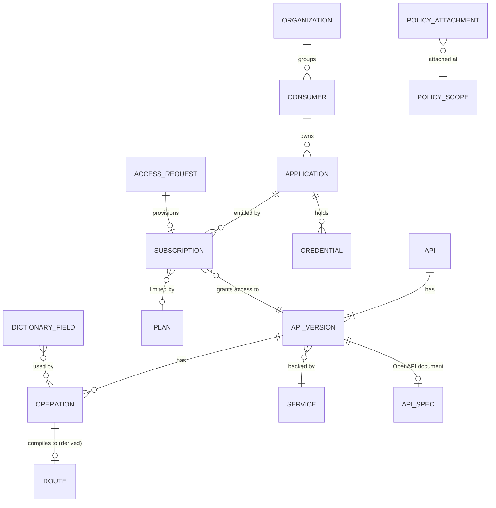

| Entity | Purpose | Promoted by bundles and config as code? |
|---|---|---|
| API | Name, domain, owners, tags, classification (24.1), lifecycle summary, documentation links, visibility (25.4), versioning rule (27.1). | Yes |
| API version | One published contract: version label, lifecycle state (26.5), backing service, OpenAPI document reference, deprecation dates (27.3), visibility narrowing. | Yes |
| Operation | Method plus path template within a version, usually imported from OpenAPI; carries operation-level overrides and the backend kind (proxy, Lambda through the service's upstream, composite, async, mock). | Yes |
| API spec | The stored OpenAPI document of a version: original bytes, normalized JSON, hash (26.2). | Yes (as files in bundles) |
| Organization | A tenant: partner company or internal business unit. Holds an optional plan and portal membership rules. | Optional (`--include consumers`), never across linked environments by default |
| Consumer | Unchanged meaning (a partner or team), now belongs to an organization. | As before |
| Application | Belongs to a consumer; holds API keys, bound OAuth client IDs, and certificate mappings; the unit that subscriptions, rate limits, and reports attach to. | Metadata only (like consumers) |
| Subscription (entitlement) | Application × API version (× plan), with status and expiry; created by approval (24.3) or by an administrator. | No (environment-specific) |
| Policy attachment | A policy kind attached at one hierarchy level, possibly locked (23.2). | Yes (except environment-level attachments, which live in overlays, 34.4) |
| Dictionary field and term | Index entries derived from specs plus curated terms and tags (26.8). | Terms and tags yes; derived entries are rebuilt |

Existing credentials keep their table; a credential now references an **application** (and through it a consumer and organization). Draft 3 installs have no applications, so migration creates one default application per consumer (`<consumer-id>-default`) and moves its credentials there; the consumer-level API stays valid and addresses that default application.

Schemas (additions to `befive.schema.api`, `befive.schema.tenancy`):

```clojure
(def Owner [:or [:map {:closed true} [:group [:string {:min 1 :max 256}]]]   ; Okta group name
                [:map {:closed true} [:user [:string {:min 1 :max 256}]]]])  ; Okta user login or sub

(def Api
  [:map {:closed true}
   [:id Id]                                              ; "orders"
   [:name [:string {:min 1 :max 128}]]
   [:domain {:optional true} [:re #"^[a-z0-9][a-z0-9-]{0,62}$"]]   ; "commerce"; a catalog facet
   [:owners [:vector {:min 1 :max 16} Owner]]            ; API Owner role scope (15.6)
   [:description {:optional true} [:string {:max 8192}]] ; Markdown, sanitized on render (25.3)
   [:classification {:optional true} Id]                 ; level id from the :classification settings (24.1)
   [:versioning {:optional true} VersioningRule]         ; 27.1
   [:default-version {:optional true} Id]
   [:visibility {:optional true} Visibility]             ; 25.4
   [:docs {:optional true} [:vector {:max 16} [:map [:title :string] [:url HttpsUrl]]]]
   [:try-it {:optional true} [:map {:closed true}
                              [:sandbox {:default true} :boolean]
                              [:production {:default false} :boolean]]]   ; 25.7
   [:tags {:optional true} Tags]
   [:meta {:optional true} Meta]])

(def LifecycleState [:enum :design :published :deprecated :retired])

(def ApiVersion
  [:map {:closed true}
   [:api Id]
   [:id Id]                                              ; "v2" or "2026-09-01"
   [:label {:optional true} [:string {:max 64}]]         ; shown in the portal, e.g. "2.0"
   [:state {:default :design} LifecycleState]
   [:service Id]                                         ; backend (upstream via service)
   [:spec {:optional true} [:map [:sha256 [:re #"^[0-9a-f]{64}$"]]]]   ; api_spec row (26.2)
   [:match {:optional true} VersionMatch]                ; derived from the API's versioning rule unless set
   [:deprecation {:optional true} Deprecation]           ; 27.3
   [:classification {:optional true} Id]                 ; may raise, never lower, the API's level (24.1)
   [:visibility {:optional true} Visibility]             ; may narrow the API's visibility
   [:mock {:optional true} MockSettings]                 ; 26.7
   [:tags {:optional true} Tags]
   [:meta {:optional true} Meta]])

(def Operation
  [:map {:closed true}
   [:api Id] [:version Id]
   [:id Id]                                              ; slug of operationId, or derived (26.3)
   [:method Method]
   [:path PathPattern]                                   ; "/orders/:id" (OpenAPI {id} converted)
   [:summary {:optional true} [:string {:max 256}]]
   [:backend {:default {:kind :proxy}}
    [:multi {:dispatch :kind}
     [:proxy     [:map [:kind [:= :proxy]] [:upstream-path {:optional true} UpstreamPath]]]
     [:composite [:map [:kind [:= :composite]] [:composite CompositeSpec]]]   ; 28
     [:async     [:map [:kind [:= :async]] [:async AsyncSpec]]]              ; 30
     [:mock      [:map [:kind [:= :mock]]]]]]                                ; 26.7
   [:authn {:optional true} AuthnSpec]                   ; operation-level security (23.3)
   [:access {:optional true} Access]                     ; required after resolution, see 23.4
   [:validation {:optional true} [:map [:request {:default false} :boolean]]] ; 26.4
   [:classification {:optional true} Id]
   [:deprecation {:optional true} Deprecation]
   [:visibility {:optional true} Visibility]
   [:websocket {:default false} :boolean]
   [:plugins {:optional true} [:vector {:max 16} PluginInstance]]
   [:tags {:optional true} Tags]
   [:meta {:optional true} Meta]])

(def Organization
  [:map {:closed true}
   [:id Id] [:name [:string {:min 1 :max 128}]]
   [:kind {:default :partner} [:enum :partner :internal]]
   [:plan {:optional true} Id]                           ; lowest-precedence plan (11.6)
   [:portal {:optional true}
    [:map {:closed true}
     [:okta-groups {:default #{}} [:set [:string {:max 256}]]]   ; members may create applications for it
     [:email-domains {:default #{}} [:set [:string {:max 253}]]]]]
   [:status {:default :active} [:enum :active :suspended]]
   [:tags {:optional true} Tags]
   [:meta {:optional true} Meta]])

(def Application
  [:map {:closed true}
   [:id Id]
   [:consumer Id]
   [:name [:string {:min 1 :max 128}]]
   [:kind {:default :service} [:enum :service :user-facing]]   ; service = machine identity
   [:environment-scope {:default :production} [:enum :production :sandbox]]  ; 25.7
   [:plan {:optional true} Id]                           ; highest-precedence plan (11.6)
   [:owners [:vector {:min 1 :max 8} Owner]]             ; portal developers who manage it
   [:callbacks {:optional true} [:vector {:max 8} CallbackRegistration]]      ; 30.6
   [:status {:default :active} [:enum :active :suspended]]
   [:metadata {:optional true} [:map-of :keyword [:string {:max 256}]]]
   [:tags {:optional true} Tags]
   [:meta {:optional true} Meta]])

(def Subscription                                        ; server-generated id "sub_" + ULID
  [:map
   [:id :string] [:application Id]
   [:api Id] [:version Id] [:plan {:optional true} Id]
   [:status [:enum :active :suspended :revoked]]
   [:source [:enum :access-request :admin :import]]
   [:access-request {:optional true} :string]
   [:expires-at {:optional true} inst?]])
```

The `Consumer` schema (5.3) gains `[:organization Id]` (required for new consumers; migration assigns a default organization per install named `default`). The `Credential` schema gains `[:application Id]`, keeps `[:consumer Id]` as a derived, read-only field for compatibility, and the two-active-keys rule (9.5) now applies per application.

**Validation rules** (in `befive.schema.validate`, shared with the CLI): version IDs are unique within an API; `(method, path)` is unique within a version after template normalization (`/orders/{id}` and `/orders/{orderId}` collide); an operation's `:access` or an inherited security policy must exist after hierarchy resolution (23.4), which keeps default deny explicit; a version's classification can only raise the API's level; a version in `:design` cannot be referenced by a published composite; an application's plan must exist; a subscription's version must not be `:retired`.

### 5.7 PostgreSQL tables for the Draft 4 entities

All configuration kinds use the common entity shape of 5.4 (document plus extracted columns plus `version` and `revision`). Tables and their extracted columns:

| Table | Extracted columns and constraints |
|---|---|
| `api` | `id` PK, `domain`, `classification`, `state_summary` (highest state across versions, for facets), `owners` text[] (GIN), `tags` |
| `api_version` | PK `(api_id, version_id)`, `api_id` FK (CASCADE on delete only when the API is deleted as a whole), `state`, `service_id` FK (RESTRICT), `spec_sha256` FK to `api_spec`, `deprecated_at`, `sunset_at` |
| `operation` | PK `(api_id, version_id, operation_id)`, FK to `api_version`, `method`, `path_template` (normalized), unique `(api_id, version_id, method, path_template)`, `backend_kind` |
| `api_spec` | `sha256` PK, `format` (`yaml`/`json`), `openapi_version`, `original` bytea (compressed), `normalized` jsonb, `imported_at`, `imported_by`, `source` (`upload`, `url`, `cli`, `bundle`), `lint` jsonb. Immutable; referenced by versions; garbage-collected 30 days after the last reference disappears. |
| `organization` | `id` PK, `status`, `plan_id` FK, `name` with `pg_trgm` index |
| `consumer` | adds `organization_id` FK (RESTRICT) |
| `application` | `id` PK, `consumer_id` FK, `status`, `environment_scope`, `plan_id` FK, `owners` text[] (GIN), soft delete like consumers (5.4) |
| `credential` | adds `application_id` FK; `consumer_id` stays for existing indexes and is kept in sync by the repository layer |
| `subscription` | `id` text PK, `application_id` FK, `(api_id, version_id)` FK, `plan_id`, `status`, `source`, `access_request_id`, `expires_at`; unique partial index `(application_id, api_id, version_id) WHERE status = 'active'` |
| `policy_attachment` | 23.2 |
| `access_request`, `access_request_event`, `approval_step` | 24.3 |
| `catalog_entry`, `catalog_visibility`, `catalog_env_availability`, `catalog_federated_version` | 25.5, 25.6 |
| `dictionary_field`, `dictionary_usage`, `dictionary_term` | 26.8 |
| `async_job`, `stored_object`, `object_access`, `job_callback_delivery` | 30.3 |
| `cache_purge` | 29.6 |
| `rollup_1m`, `rollup_1h`, `rollup_events_1h`, `report_definition`, `report_schedule`, `report_run` | 32.2 to 32.5 |
| `linked_environment`, `env_overlay`, `bundle`, `promotion`, `promotion_event` | 34.2 to 34.5 |
| `idp_jwks_cache` | 9.12 |
| `jwt_signing_key` | 9.10 |
| `portal_user`, `portal_session` | 25.3 |
| `evidence_export` | 33.3 |

Subscriptions and access requests are not configuration in the promotion sense: they are environment-specific, do not bump the configuration revision by themselves, and reach gateways through the **entitlement index**, a compact snapshot section rebuilt when subscriptions change (each subscription change is a small revision of kind `subscription`, like credential changes in Draft 3, so the existing delta propagation carries them). The snapshot shape (6.3) gains:

```clojure
{:apis              {"orders" {...}}
 :api-versions      {["orders" "v2"] {...}}
 :operations        {["orders" "v2" "get-order"] {...}}
 :organizations     {"acme" {...}}
 :applications      {"acme-billing" {...}}
 :subscriptions     {"sub_01J9..." {...}}                ; active only
 :policy-attachments {"pa_01J9..." {...}}
 :classification    {...}                                ; settings document (24.1)
 :env-overlay       {...}}                               ; 34.4
```

The compiler's working set grows by roughly the number of operations and active subscriptions; the compile target in 6.4 is restated for 2,000 operations (which produce about 2,000 routes) plus 100,000 credentials and 50,000 active subscriptions (20.1).

---
## 6. Configuration lifecycle

### 6.1 Overview

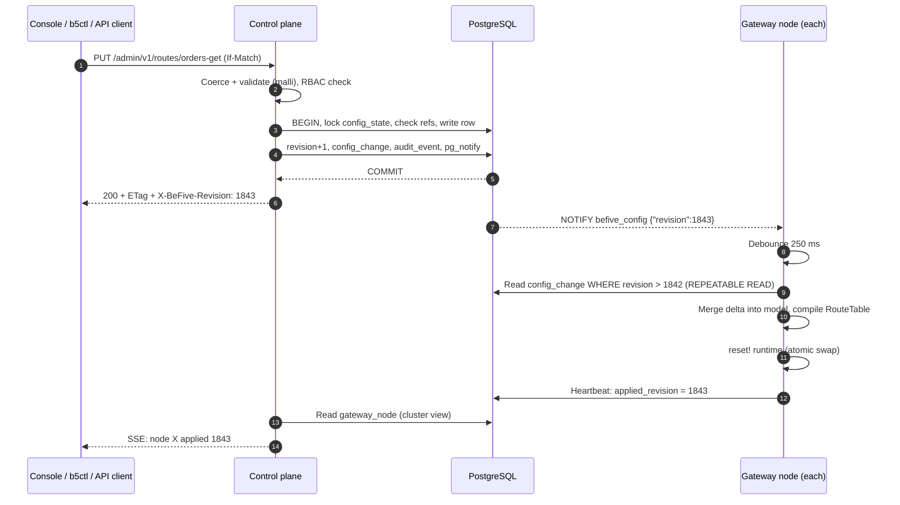

### 6.2 Write path (control plane)

1. **Authenticate and authorize** the caller (session or API token; RBAC in 15.6).
2. **Coerce** the body with malli (`json-transformer` for JSON, identity for EDN/Transit) and apply defaults with `default-value-transformer`, so stored documents are explicit and diffs are stable.
3. **Validate** the single document against its schema (closed map, humanized errors with paths).
4. **Validate cross-entity rules** in `befive.schema.validate` (shared with the CLI): referenced IDs exist; plugin configs validate against the plugin's registered schema; route match conflicts (same host, path, methods, and priority) are errors; shadowed routes are warnings; a route with neither `:access {:public true}` nor a policy is an error (default deny is explicit in data); IdP required for `:jwt`/`:introspection` authn; certificate private key parses and matches the certificate.
5. **Check cluster feature level** (section 21.3): a document using a feature newer than the oldest live gateway node is rejected with `409 cluster-upgrade-in-progress`.
6. **Transaction** as in 5.5, which writes the row, bumps the revision, records `config_change` (before/after), writes the audit event, and issues `NOTIFY`.
7. **Respond** with the stored document, `ETag`, and `X-BeFive-Revision`.

Every write path (single-object REST, CLI `apply`, console import) ends in the same `config-service/commit!` function with a list of changes, so there is exactly one place where revisions are bumped.

### 6.3 Propagation to gateway nodes

**LISTEN.** Each gateway node holds one dedicated PostgreSQL connection (outside the Hikari pool) on a virtual thread, running `LISTEN befive_config` and blocking on `PGConnection.getNotifications(timeoutMs)`. On notification it records the highest announced revision and schedules a fetch after a 250 ms debounce (coalescing bursts such as a large apply followed by a follow-up edit).

**Polling fallback.** Independently, every 10 s (default) the node runs `SELECT revision FROM config_state`. If that is higher than the applied revision, it fetches. This covers dropped LISTEN connections, connection poolers that do not support LISTEN (PgBouncer in transaction mode), and missed notifications. With the defaults, the worst-case propagation is about 10.5 s when notifications are broken and about 1 s when they work, which meets the 5 s target (doc 1) in the normal case. Installs behind a LISTEN-incompatible pooler should set the poll interval to 2 s.

**Fetch.** In one `REPEATABLE READ, READ ONLY` transaction:

- If `applied_revision` is known and `config_change` still contains every revision after it: `SELECT * FROM config_change WHERE revision > ? ORDER BY revision, seq` (a delta).
- Otherwise (fresh start, or a gap after retention pruning): a full snapshot, reading every config table plus active credentials and relevant settings, and `config_state.revision` in the same transaction.

**Merge.** The node keeps the *config model* (plain maps of documents by kind and ID) alongside the compiled RouteTable. A delta is applied to the model with `assoc`/`dissoc`; the result is the same value a full snapshot would have produced. A property test asserts exactly that (delta-merge equals full-load for random change sequences).

**Snapshot shape (the config model):**

```clojure
{:snapshot/format 1
 :revision 1843
 :loaded-at #inst "2026-09-28T03:04:05.123Z"
 :upstreams          {"orders-backend" {...}}
 :services           {"orders" {...}}
 :routes             {"orders-get" {...} "orders-create" {...}}
 :policies           {"orders-read" {...}}
 :consumer-groups    {"tier-1-partners" {...}}
 :plans              {"gold" {...}}
 :consumers          {"acme-corp" {...}}
 :credentials        {"cred_01J8..." {...}}          ; hashes only
 :identity-providers {"okta-prod" {...}}
 :certificates       {"api-example-com" {...}}
 :secrets            {"okta-introspection-secret" {:ciphertext #bytes "..." :dek-id "dek-3"}}
 :settings           {:logging {...} :forwarding {...} :cors-defaults {...}}}
```

### 6.4 Compile

`befive.gateway.compile/compile-snapshot : model -> RouteTable` is a pure function of the model plus long-lived services (pools, caches, rate limiter), and it runs on a virtual thread. Output:

```clojure
#befive.gateway/RouteTable
{:revision   1843
 :hosts      {:exact    {"api.example.com" <HostRouter>}
              :wildcard [["example.com" <HostRouter>]]   ; "*.example.com", longest suffix first
              :default  <HostRouter>}                    ; routes without :hosts
 :sni        <DomainWildcardMapping of SslContext>       ; server certificates
 :credentials {:api-key-by-prefix {"k3j9x2ab" <Cred>} :client-id {["okta-prod" "0oa1..."] <Cred>}
               :mtls-by-fingerprint {...} :mtls-by-subject {...}}
 :consumers  {"acme-corp" <Consumer with resolved plan, groups>}
 :upstreams  {"orders-backend" <UpstreamRuntime: balancer, pool ref, health state ref>}}
```

Where a `HostRouter` is a reitit router (`reitit.core/router` with `:conflicts nil`) whose route data holds, per path template, an ordered vector of *candidates*. Each candidate is a compiled route: method set, header predicates, priority, and one pre-built interceptor chain per distinct access policy (usually one chain per route; per-method policy overrides produce up to one chain per method).

Matching algorithm, per request:

1. Host: exact map lookup, then wildcard suffixes (longest first), then default. Host comparison is case-insensitive with the port stripped.
2. Path: `reitit.core/match-by-path` on the host's router. Route templates are sorted by specificity before building (exact before parameterized before prefix; longer before shorter; then `:priority`), so reitit's linear quarantine for conflicting templates respects that order.
3. Candidates at that template: first whose method set and header predicates match, in descending `:priority`, then by route ID for determinism.
4. No path match: `404` with reason `route.not_found`. Path match but no method match: `405` with an `Allow` header.

Compilation also: resolves secrets into in-memory key material (decrypted once per revision, held only in the RouteTable); builds `SslContext`s for server certificates (cached by certificate SHA-256 so unchanged certificates are not rebuilt); compiles policies into predicate functions (section 10); instantiates plugin interceptors through each plugin's `:compile` function; builds rate-limit bucket configurations; creates or reuses upstream pools (reused when the pool-relevant settings hash is unchanged).

**Compile is all-or-nothing.** If any part fails (for example, a plugin present on the control plane is missing on this node), the node keeps serving its current revision, sets `apply_error` in its heartbeat (revision, entity, message), logs an `ERROR`, and retries on the next revision or every 60 s. The console shows the node as "behind" with the error.

Compile time budget (target): under 200 ms for 2,000 routes and 100,000 credentials on 4 vCPUs.

**Draft 4 compile steps.** Before building host routers, the compiler expands operations into derived routes (6.9) and resolves each operation's effective policy through the hierarchy (23.4), clamping any field that would weaken a lock (defense in depth behind write-time lock validation). It also compiles claims expressions (10.5), cache policies and key material (29), validation schemas (26.4), mock bodies (26.7), composite graphs (28), deprecation header strings (27.3), and the entitlement index (5.7). The budget is restated for 2,000 operations plus 100,000 credentials and 50,000 active subscriptions, with 50 ms allocated to policy resolution.

### 6.5 Atomic swap and in-flight requests

The RouteTable is a single immutable value in an atom. The HTTP handler dereferences the atom **once per request** at the start of the pipeline and uses that value for the whole request, so a request never sees two revisions. `reset!` is the swap. In-flight requests finish on the old table; the old value becomes garbage when the last of them completes. Long-lived WebSocket connections keep the route they were established with.

Resources that outlive a table (upstream pools, SSL contexts, health-check state, rate-limit buckets) are owned by long-lived registries keyed by stable identity, not by the table. After a swap, a reaper marks resources unused by the new table and closes them after a grace period (pools: 60 s after last use; health checks: stopped immediately).

### 6.6 Last-known-good (LKG) snapshot

After every successful compile, the node writes the config model to `/var/lib/befive/lkg/snapshot-<revision>.edn.gz` on a virtual thread (write to temp file, `fsync`, atomic rename; keep the newest 3). The file header carries format version, revision, product version, a SHA-256 of the body, and the wrapped data keys needed to decrypt secrets. The body contains secret *ciphertexts* only; the node still needs the master key to start from it. File mode `0600`, owned by the gateway user.

On startup with the database unreachable for 10 s, the node loads the newest LKG file whose checksum verifies and whose format it understands, compiles it, and becomes ready with `config_source = lkg` and status `degraded`. It keeps trying the database and switches to the database state as soon as it can. `lkg.max-age` (default: unlimited) can make very old snapshots unacceptable.

On ECS Fargate the task's ephemeral storage survives container restarts within a task but not task replacement; for LKG across task replacement, mount an EFS access point per service (documented as optional). The main protection remains "running nodes keep serving from memory".

### 6.7 Applied-revision reporting

Every 5 s each node upserts its `gateway_node` row: `applied_revision`, `applied_at`, `status`, `config_source`, `apply_error`, `product_version`, `feature_level`, `plugins`, and `last_seen_at`. The control plane derives:

| Node state in console | Rule |
|---|---|
| In sync | `applied_revision = config_state.revision` |
| Applying | behind, and the revision is less than 10 s old |
| Behind | behind for more than 10 s, or `apply_error` set |
| Stale | `last_seen_at` older than 15 s |
| Gone | `last_seen_at` older than 5 min (hidden after 24 h, row purged after 7 days) |

The Admin API exposes `GET /admin/v1/cluster/nodes` and `GET /admin/v1/config/revisions/{rev}/status` (how many live nodes have applied a revision), which `b5ctl apply --wait` polls to block until the change is live everywhere.

### 6.8 Rollback

Every revision's full before/after is in `config_change`, so "roll back to revision *r*" is a new forward change: the control plane computes the model at *r* (current model minus the inverse of changes after *r*), diffs it against current, and commits that as a new revision after the same confirmation flow as import. Rollback never rewrites history. Rollback is available while the target revision is within `config_change` retention. Rolling back a revision that applied a promoted bundle is handled the same way and marks the promotion `rolled-back` (6.10, 34.5).


### 6.9 Compiling APIs and operations onto routes (Draft 4)

Operations are the source of truth for API traffic; the routes they produce are **derived** and never stored. The compiler expands each operation into one compiled route before building host routers, so the matching algorithm, interceptor chains, pools, and reporting keys of 6.4 stay as they are. Hand-written routes (5.3) keep working next to APIs, for example for health endpoints or legacy paths.

**Expansion, per operation** (a pure function in `befive.gateway.compile.api`, shared with the control plane for previews and the route tester):

1. Skip operations whose version is `:retired` (they compile to a retirement route, below) and versions in `:design` unless the version has mocks enabled (26.7) or the environment setting `:allow-design-routes` is true (the Sandbox environment enables it by default).
2. **Route ID.** `op-<api>-<version>-<operation>`; if longer than 63 characters, the first 54 characters plus `-` plus 8 hex characters of SHA-256 over the full name. The `op-` prefix is reserved: hand-written route IDs starting with `op-` are rejected, so derived and hand-written IDs never collide. Access-log lines carry both `route_id` and the operation triple (12.2).
3. **Match.** The version's match (27.1) supplies hosts, a path prefix, and optional candidate predicates (header, media type, or query parameter); the operation supplies the method and the path template. For a path-prefix rule `/v2`, the operation `/orders/:id` matches `/v2/orders/:id`; the upstream path is the operation path unless the version's service sets a base path or the operation sets `:upstream-path`.
4. **Pipeline.** The effective policy for the operation (23.4) supplies authentication, access rule, IP rules, rate limits, logging, caching, size limits, and deprecation; operation fields that are not policy kinds (backend kind, validation, WebSocket, plugins) are copied. The result is a normal compiled route with a `:befive/operation` back-reference.
5. **Backend.** `:proxy` uses the version's service and upstream as a Draft 3 route does, including Lambda upstreams (8.10) and discovered targets (8.11); `:composite`, `:async`, and `:mock` select the terminal handler (7.4, slot 21).

**Retired versions and operations** compile into a single low-cost route per version that answers `410 Gone` (26.5) without authentication, so clients learn quickly that the contract is gone. Retirement routes have the lowest priority among candidates at the same template, so a newer version that reuses the path is never shadowed.

**Conflicts.** After expansion, the existing conflict validation (6.2, step 4) runs over derived and hand-written routes together: two candidates with the same host, template, methods, predicates, and priority are an error that names both sources (`operation orders/v2/get-order` and `route legacy-orders`). Header, media-type, and query version predicates make candidates at the same template distinct (27.2). The default-version candidate is placed last.

**Hand-written routes in the hierarchy.** A hand-written route is treated as an operation without API, version, or path levels: its effective policy is global, then environment, then the route's own settings (23.2). This keeps a single resolution algorithm.

**Cost.** Expansion is linear in the number of operations. At 2,000 operations the added compile work is dominated by policy resolution (23.4), budgeted at 50 ms of the 200 ms compile target (6.4). Incremental recompilation is not needed at this scale; the whole table is rebuilt per revision as before.

### 6.10 Promoted bundles, overlays, and rollback

Promotion (34) applies a signed bundle to the target environment as one ordinary revision with `source = promotion`, so propagation, compile, LKG, and applied-revision reporting are unchanged. Overlay values (34.4) are resolved in the control plane before commit: gateways never see unresolved variables. Rollback (6.8) of a revision that applied a promotion restores the previous configuration like any other rollback and marks the promotion `rolled-back` (34.5); it does not touch the source environment. Re-applying the same bundle later is idempotent, because the diff against current state is empty except for what the rollback undid.

---

## 7. Request lifecycle through the data plane

### 7.1 Connection handling

- **Transport.** Netty epoll transport on Linux, one event-loop group sized to available processors (from the container CPU quota). Aleph servers on 8080 and 8443 share the group.
- **Proxy Protocol v2** (optional per listener) decoded first, via Aleph's `:pipeline-transform` hook installing Netty's `HAProxyMessageDecoder`; accepted only from `trusted-proxies`.
- **TLS.** A Netty `SniHandler` installed via `:pipeline-transform` selects an `SslContext` from the current RouteTable's SNI mapping: exact host, then wildcard, then the default certificate. Unknown SNI with no default fails the handshake. Per-certificate `client-auth` sets `ClientAuth.OPTIONAL` or `REQUIRE` with that certificate's trusted CAs, so mTLS is requested only on hostnames that need it. TLS 1.2 and 1.3 only (18.3).
- **ALPN** negotiates `h2` or `http/1.1`. HTTP/2 streams map to independent requests in the pipeline. Cleartext HTTP/2 (h2c) is off by default (enabled per listener for gRPC-style internal use later).
- **Header and URI limits.** Max initial line 8 KiB, max header block 16 KiB (per-route `:max-header-bytes` can lower but not raise the listener limit), max 100 headers. Violations return `431` or `414` before any interceptor runs.
- **Idle timeouts.** Client keep-alive idle 75 s (above the ALB's default 60 s idle timeout, so the load balancer, not the gateway, closes idle connections), HTTP/2 max concurrent streams 250.
- **Request bodies** arrive as a Manifold stream of `ByteBuf`s (`:raw-stream? true`); nothing is buffered unless a component explicitly needs it (retries with a small body, section 8.4).

### 7.2 The pipeline executor

We implement a small interceptor executor (`befive.gateway.pipeline`, a few hundred lines) that follows the Sieppari contract (`:enter`, `:leave`, `:error`, context map, `:queue`/`:stack` semantics) with three additions the gateway needs: a synchronous fast path (an interceptor returning a plain map continues without allocating a deferred; returning a Manifold deferred suspends without blocking the event loop), per-interceptor timing into the context (for the tester and debug logs), and phase metadata used by the compiler to order chains. Sieppari itself is not a dependency; its semantics are the documented contract for plugins.

Rules:
- Setting `:response` in `:enter` short-circuits: remaining `:enter`s are skipped and `:leave` runs for the interceptors already entered, in reverse.
- An exception or error deferred switches to `:error` handling in reverse order; the outermost interceptor converts any unhandled error into a `500` (or the gateway error's mapped status) and logs it.
- Interceptors must not block. The executor asserts in dev and test builds (via a Netty event-loop check) that `:enter` returns within 1 ms when synchronous.

### 7.3 Context map

```clojure
{:request   {:method :get :uri "/orders/42" :query-string "expand=items"
             :headers <case-insensitive map> :body <manifold stream>
             :scheme :https :protocol "HTTP/2" :server-name "api.example.com"}
 :befive/table  <RouteTable>           ; dereferenced once
 :befive/route  <CompiledRoute>        ; after match
 :befive/path-params {:id "42"}
 :befive/client {:ip "203.0.113.9" :tls-version "TLSv1.3" :sni "api.example.com"
             :peer-certificate <X509Certificate or nil>}
 :befive/identity {:method :jwt :subject "00u1abcd" :client-id "0oa9xyz"
               :scopes #{"orders:read"} :groups #{"partners"} :claims {...}
               :idp "okta-prod"}
 :befive/consumer <Consumer or nil>
 :befive/application <Application or nil>   ; Draft 4 (5.6); with :organization and :subscription
 :befive/operation {:api "orders" :version "v2" :id "get-order"
                    :version-selected-by :path :classification "internal"}   ; 6.9, 27.1
 :befive/policy  <EffectivePolicy, compiled, with source ids>              ; 23.4
 :befive/cache   {:status :miss :key <bytes>}                               ; 29
 :befive/decision {:authn {:result :ok :method :jwt}
               :authz {:result :allow :policy "orders-read"}
               :rate-limit {:result :allow :limit-id "gold-rps" :remaining 87 :reset-s 1}}
 :befive/upstream {:target "10.0.3.17:8080" :attempts 1 :status 200 :latency-ns 3120000}
 :befive/log    {}                     ; extra access-log fields (e.g. plugin fields)
 :befive/timing {:start-ns 123 :upstream-start-ns 456}
 :response  nil}
```

### 7.4 Phase order (normative)

The compiler builds each route's chain from these slots, in this order. Built-in interceptors occupy fixed slots; plugins can be placed only in the four named extension phases. Interceptors not needed by a route are omitted from its chain (a public route has no authn/authz interceptors at all).

| # | Slot | Enter (request path) | Leave (response path) |
|---|---|---|---|
| 1 | `:befive/access-log` | Record start time. | Update live counters and the metrics and usage aggregators; then build and enqueue the access-log line if it is kept (always in default mode; see 12.3.5 when sampling). Runs on every outcome, including errors. |
| 2 | `:befive/request-id` | Accept a valid incoming `X-Request-ID` (from trusted sources, configurable) or generate one (UUIDv7); parse or create `traceparent`. | Set `X-Request-ID` on the response. |
| 3 | `:befive/client-ip` | Resolve client IP from Proxy Protocol or `X-Forwarded-For` using the trusted-proxy list (8.8). | |
| 4 | `:befive/error-mapper` | | Map gateway errors to status codes and a minimal body (7.6). |
| 5 | `:befive/strip-inbound` (Draft 4) | Record the force-log header and inbound `traceparent`, then remove every `X-BeFive-*` header, the internal JWT header, all configured identity headers of all routes, and legacy identity header names (9.9). | |
| 6 | `:befive/ip-filter` | Effective IP rules from the policy hierarchy (23.5): deny list, then allow list, on the resolved client IP. Reject `403` with reason `ip.denied`. | |
| 7 | `:befive/cors` | Preflight (`OPTIONS` with `Access-Control-Request-Method`): answer `204` directly, before authentication. | Add CORS response headers for allowed origins. |
| 8 | `:befive/limits` | Enforce `Content-Length` limit immediately (`413`); wrap the body stream with a counting limiter for chunked bodies; per-level limits from the `:limits` policy kind (8.9). | Count response bytes against `:max-response-body-bytes` (8.9). |
| 9 | `:befive/lifecycle` (Draft 4) | (Retired versions are separate `410` routes, 26.5.) | Add `Deprecation`, `Sunset`, and `Link` headers for deprecated operations (27.3). |
| 10 | **plugins `:pre-auth`** | Extension point: request inspection before identity is known (e.g. custom header validation, bot filtering). | Reverse order. |
| 11 | `:befive/authn` | Run configured authentication methods (section 9). Sets `:befive/identity`, `:befive/consumer`, and `:befive/application`. `401` on failure; `503 authn.idp_unavailable` per the IdP failure mode (9.12). | |
| 12 | `:befive/authz` | Evaluate the effective access rule for this method (sections 10, 23), including entitlement checks for subscription-gated APIs (5.7). `401` if identity is required but absent, `403` on deny. | |
| 13 | `:befive/rate-limit` | Check plan, consumer, application, and dimensioned limits and monthly quotas (sections 11, 11.6). `429` with `Retry-After`. | Add rate-limit headers (11.5). |
| 14 | **plugins `:post-auth`** | Extension point: identity-aware logic (e.g. custom entitlement check, request signing with consumer data). | Reverse order. |
| 15 | `:befive/validate` (Draft 4) | Optional request validation against the operation's schemas (26.4). `400 validation.failed`. | |
| 16 | `:befive/cache` (Draft 4) | Cache lookup with the partitioned key (29.2); a hit sets `:response` (short-circuit). | Store cacheable responses (tee, 29.5). |
| 17 | `:befive/request-transform` | Inject identity headers and, if enabled, the gateway-signed internal JWT (9.8, 9.10); apply request header transform, compute upstream path (strip prefix, rewrite), set `X-Forwarded-*`, remove hop-by-hop headers, optionally remove the credential. (Inbound identity headers were already stripped in slot 5.) | |
| 18 | **plugins `:pre-proxy`** | Extension point: last look at the outgoing request (e.g. add a signature over final headers). | Reverse order. |
| 19 | **plugins `:response`** | (no-op on enter) | Extension point: response header manipulation after the upstream responded. |
| 20 | `:befive/response-transform` | | Remove hop-by-hop headers, apply response header transform, remove `Server`/`X-Powered-By` if configured. |
| 21 | Terminal: `:befive/proxy`, `:befive/lambda`, `:befive/composite`, `:befive/async-submit`, or `:befive/mock` | `:befive/proxy`: select target, send request, stream response (section 8), or WebSocket splice. The other terminals: Lambda invocation (8.10), composite step graph (28.2), job submit (30.2), mock response (26.7). | |

Notes on the order:
- **Access log is outermost** so that every request, including those rejected by the IP filter or failing with an internal error, is counted in metrics and usage and, in the default logging mode, produces exactly one log line.
- **CORS preflight before authentication**, because browsers never send credentials on preflight requests.
- **Rate limiting after authorization.** Requests the route rejects anyway do not consume a consumer's quota, and limits keyed on the consumer need identity. Anonymous floods against authentication are the job of the load balancer and AWS WAF, plus the IP filter; a per-IP pre-auth limiter is a candidate for after the MVP (see open questions).
- **Response plugins before the built-in response transform** on the leave path means the admin's declarative header rules have the final word over plugin changes.
- Within a plugin phase, plugins run in ascending `:order`, then in declaration order.
- **Runtime overrides** (14.12) are checked inside existing slots, not as new ones: IP blocks (and, from 1.1 or later, disabled routes) in slot 6, consumer blocks (1.1 or later) at the end of slot 11, rate-limit factors in slot 13. With no active overrides the check is one empty-map lookup.
- **Stripping before everything that reads identity** (Draft 4): slot 5 runs before plugins and authentication, so no plugin, policy, or upstream can see a client-supplied identity header (9.9).
- **Cache after authorization and rate limiting** (Draft 4): a cache hit never skips access control, and hits count against limits and quotas (29.2). Validation runs before the cache so that invalid requests are not served from cache.
- **Draft 3 slot numbers.** Draft 3 had 17 slots; Draft 4 inserts slots 5, 9, 15, and 16 and widens the terminal slot. References elsewhere in this document use the Draft 4 numbers.

### 7.5 Sequence: JWT-authenticated request with a JWKS cache miss

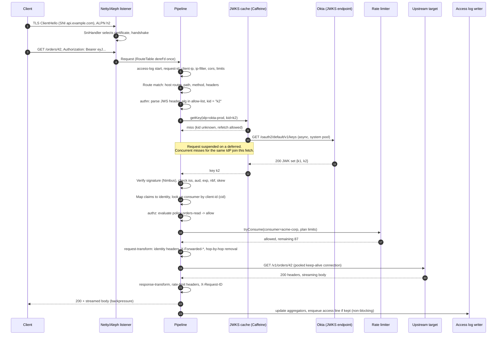

### 7.6 Error responses

Gateway-generated errors never reveal why authentication or authorization failed. The body is minimal JSON with the request ID for support correlation; the machine-readable reason goes only to the access log (doc 1, 2.3).

```json
{"error": "unauthorized", "request_id": "01923f6e-8c1a-7b3e-9f40-6f1d2c3b4a59"}
```

| Status | `error` | Typical reasons in the log (`auth_reason`, `authz_reason`, `error_code`) |
|---|---|---|
| 400 | `bad_request` | `request.malformed`, `request.invalid_host`, `validation.failed` (26.4), `version.unknown` (27.1) |
| 401 | `unauthorized` | `jwt.missing`, `jwt.expired`, `jwt.bad_signature`, `jwt.unknown_kid`, `jwt.alg_not_allowed`, `jwt.aud_mismatch`, `introspection.inactive`, `api_key.unknown`, `api_key.expired`, `mtls.no_certificate`, `mtls.unmapped` |
| 403 | `forbidden` | `ip.denied`, `authz.no_policy`, `authz.scope_missing:orders:write`, `authz.group_missing`, `authz.method_denied`, `authz.claim_type_mismatch` (10.5), `authz.not_subscribed` (5.7), `consumer.suspended`, `ratelimit.dimension_missing` (11.6) |
| 406 | `not_acceptable` | `version.unknown_media_type` (27.1) |
| 409 | `conflict` | `async.not_ready` (30.7) |
| 410 | `gone` | `version.retired` (26.5), `async.expired` (30.7) |
| 404 | `not_found` | `route.not_found` |
| 405 | `method_not_allowed` | `route.method_not_allowed` |
| 413 | `payload_too_large` | `limits.body_too_large`, `lambda.payload_too_large` (8.10) |
| 429 | `too_many_requests` | `ratelimit.exceeded:gold-rps`, `quota.exceeded:gold-monthly` |
| 502 | `bad_gateway` | `upstream.connect_failed`, `upstream.reset`, `upstream.tls_failed`, `upstream.tls_error` (9.11), `upstream.protocol_error`, `limits.response_too_large` (8.9), `lambda.function_error`, `lambda.bad_response`, `lambda.invoke_failed` (8.10), `composite.step_failed`, `composite.expr_failed` (28) |
| 503 | `service_unavailable` | `upstream.no_healthy_targets`, `upstream.pool_exhausted`, `authn.idp_unavailable` (9.12), `ratelimit.backend_unavailable`, `lambda.throttled`, `lambda.concurrency_limited` (8.10), `async.unavailable` (30.2) |
| 504 | `gateway_timeout` | `upstream.connect_timeout`, `upstream.read_timeout`, `upstream.total_timeout`, `lambda.timeout` (8.10), `composite.timeout` (28.2) |

Draft 4 errors that represent a resource state rather than a security decision (`410` retired versions, `406`/`400` unknown versions, async job states) use `application/problem+json` bodies with a documentation link, because clients need the detail and it reveals nothing that the portal does not already show. Security-related errors keep the minimal body.

`401` responses carry `WWW-Authenticate: Bearer realm="api"` (plus `error="invalid_token"` for JWT failures, per RFC 6750, without a description). Error bodies can be replaced by a per-route template in a later release; the MVP keeps the fixed shape.

---
## 8. Proxying

### 8.1 Upstream connection pools

- One Aleph client connection pool per upstream (not per route), created by the compiler and owned by the `upstream-pools` registry. Pools are keyed by `(upstream-id, pool-settings-hash)`, so a change to targets or weights keeps the pool while a change to TLS or pool limits creates a new pool and drains the old one.
- Per target: max connections (default 256), max pending acquisitions (default 1,024; beyond that `503 upstream.pool_exhausted` rather than unbounded queuing), idle timeout 60 s, keep-alive on.
- Upstream protocol in the MVP is **HTTP/1.1** (plain or TLS). HTTP/2 to upstreams is deferred with gRPC support; the pool abstraction keeps a `:protocol` key so it can be added without schema changes.
- Upstream TLS verifies the certificate chain and hostname by default, using the JDK trust store plus an optional per-upstream CA certificate. `:verify false` is allowed but marked with a console warning and an audit flag.
- DNS: target hostnames are resolved by Netty's async DNS resolver with TTL respected (min 5 s, max 300 s). Each resolved address is balanced as part of its target; this supports ECS service discovery (Cloud Map) and internal load balancers. Draft 4 adds explicit discovery sources (DNS SRV, Cloud Map API, Kubernetes EndpointSlices) in 8.11, and AWS Lambda functions as a non-HTTP upstream kind in 8.10.

### 8.2 Load balancing

- **Weighted round robin** (default) uses the smooth weighted round-robin algorithm (as in nginx): deterministic, even interleaving, weights 0 to 1000, weight 0 drains a target.
- **Least connections** picks the target with the lowest `in-flight / weight`, breaking ties randomly. In-flight counts are per node (each node balances independently); that is the standard trade-off and is accurate enough at N ≥ 2 nodes.
- Unhealthy targets (active or passive) are skipped. If **all** targets are unhealthy and `:panic-routing` is true (default), the balancer uses all targets anyway and logs `upstream_panic=true`; this prevents a misconfigured health check from taking an API fully down. With `:panic-routing false`, the request fails with `503 upstream.no_healthy_targets`.
- A retry never picks the same target as the previous attempt when another eligible target exists.
- **Discovered targets** (8.11) join the balancer like static ones; a target-set update rebuilds the balancer state atomically and keeps health state for targets that remain. New targets can ramp up with slow start, and SRV priorities act as failover tiers.

### 8.3 Streaming and backpressure

Request and response bodies are Manifold streams of Netty `ByteBuf`s, connected end to end with `manifold.stream/connect`, which propagates backpressure: if the client reads slowly, the gateway stops reading from the upstream socket (Netty `autoRead` off), and vice versa. Nothing buffers a whole body. Reference counting of `ByteBuf`s is the main correctness risk; the proxy interceptor owns release on every path (success, error, client abort, timeout), and CI runs the integration suite with Netty's `ResourceLeakDetector` at `PARANOID` level (section 22).

Client disconnect mid-request closes the upstream connection (it cannot be reused safely) and logs status `499` (client closed request) with `error_code = client.aborted`.

Server-Sent Events, flush-through streaming, response size limits after headers were sent, and stream metrics are specified in 8.9.

### 8.4 Timeouts and retries

| Timeout | Default | Scope | On expiry |
|---|---|---|---|
| `connect-ms` | 2,000 | TCP + TLS handshake to a target | Retry if allowed, else `504 upstream.connect_timeout` |
| `read-ms` | 30,000 | Time to first response byte, and max gap between body chunks | Before headers: `504 upstream.read_timeout`; mid-body: connection aborted, logged |
| `total-ms` | 60,000 | From first attempt to complete response headers, across all retries | `504 upstream.total_timeout` |

Route values override service values, which override global defaults. Streaming bodies are bounded by `read-ms` gaps, not a total, so long downloads work.

Retry rules (all must hold):
1. The method is idempotent per RFC 9110: `GET`, `HEAD`, `OPTIONS`, `PUT`, `DELETE`. `POST` and `PATCH` are never retried.
2. The failure is in the route's `:retries :on` set: connect error, connection reset before any response byte, timeout before any response byte, or upstream `502`/`503`/`504` (the defaults are connect error, reset, and 503).
3. The request body can be replayed: either there is no body, or the body was at most `retry-buffer-bytes` (default 64 KiB) and was buffered for that reason. Larger or streamed bodies disable retries for that request.
4. Attempts remain (`:attempts`, default 1 extra attempt) and `total-ms` has not elapsed.
5. The upstream's retry budget allows it: retries may not exceed 20% of requests to that upstream over a 10 s window, which prevents retry storms from amplifying an outage.

Backoff between attempts is 25 to 100 ms with full jitter.

### 8.5 Health checking

- **Active.** Each gateway node probes each target of each upstream that has active checks configured, at `interval-ms` with ±10% jitter, using the system HTTP pool (not the traffic pool), `GET <path>`, expecting `healthy-statuses`. A target turns unhealthy after `unhealthy-threshold` consecutive failures and healthy after `healthy-threshold` consecutive successes. Nodes check independently and do not share results; with N nodes a target receives N probes per interval, which is documented and acceptable for typical N.
- **Passive.** The proxy records outcomes: connection errors, timeouts, and `5xx` responses count as failures (`4xx` do not). After `consecutive-failures` the target is ejected for `ejection-ms`, doubling on each consecutive ejection up to `max-ejection-ms`. After the ejection period, the target receives traffic again (and active checks, if configured, can restore it earlier).
- Health state lives in a registry keyed by `(upstream-id, host, port)` so it survives config swaps. State changes emit an application log event and update the live counters; the node's heartbeat includes a per-upstream healthy/unhealthy summary for the console, and a 60 s EMF health line feeds the CloudWatch upstream-health widget (12.3.7).

### 8.6 WebSocket

Routes with `:websocket true` accept `Upgrade: websocket` on `GET`. The full request pipeline runs on the upgrade request (authentication, authorization, rate limiting count one request). The proxy then opens a WebSocket client connection to the target (Aleph `websocket-client`, forwarding the `Sec-WebSocket-Protocol` offer and identity headers), accepts the client upgrade (`websocket-connection`), and splices both streams with backpressure. Frames are not inspected or logged. Idle timeout (no frames either way) defaults to 300 s; max frame size 1 MiB. The access log line is written when the connection closes, with `ws=true`, total duration, and bytes in both directions. A route without `:websocket true` returns `400` to upgrade requests. Draft 4 makes the frame size and stream duration policy-level limits (8.9) and adds `StreamsOpened` and `StreamDuration` metrics.

### 8.7 HTTP/2 and hop-by-hop headers

HTTP/2 client requests are converted to HTTP/1.1 upstream requests: pseudo-headers become the request line and `Host`; `TE: trailers` is dropped; the `Connection`-specific headers do not exist in HTTP/2 and are rejected by Netty if sent.

For HTTP/1.1, the proxy removes hop-by-hop headers in both directions: `Connection`, `Keep-Alive`, `Proxy-Connection`, `Proxy-Authenticate`, `Proxy-Authorization`, `TE`, `Trailer`, `Transfer-Encoding`, `Upgrade` (kept for WebSocket), plus any header named in the `Connection` header. `Content-Length` and `Transfer-Encoding` are recomputed by Netty for the outgoing message. Requests with both `Content-Length` and `Transfer-Encoding`, or multiple differing `Content-Length` values, are rejected with `400` (request-smuggling defense).

`Host` sent upstream defaults to the target's host (`preserve-host false`); a service can set `:preserve-host true` for virtual-hosted backends.

### 8.8 Client IP and X-Forwarded-* headers

- **Client IP resolution.** If the connection came through Proxy Protocol from a trusted proxy, use its source address. Otherwise walk `X-Forwarded-For` from right to left, skipping addresses inside `trusted-proxies`; the first untrusted address is the client IP. If the direct peer is not trusted, the peer address is the client IP and incoming `X-Forwarded-*` headers are discarded. This prevents clients from spoofing their IP for IP filters, rate-limit keys, and logs.
- **Outgoing headers.** `X-Forwarded-For` gets the resolved client chain with the direct peer appended; `X-Forwarded-Proto`, `X-Forwarded-Host`, and `X-Forwarded-Port` describe the client-facing request; `X-Request-ID` and `traceparent`/`tracestate` are forwarded. The RFC 7239 `Forwarded` header is off by default (setting).
- **Identity headers** (section 9.8) are always stripped from the incoming request before any phase reads them, so a client cannot send its own `X-BeFive-Subject`; the full strip order is in 9.9.


### 8.9 Server-Sent Events, chunked streams, size limits, and stream metrics (Draft 4)

Streaming bodies without full buffering (8.3) and WebSocket splicing (8.6) are unchanged. Draft 4 adds explicit handling for Server-Sent Events (SSE) and long chunked responses, size limits at every policy level, and stream metrics (TRAF-005).

**SSE and chunked pass-through.** A response with `Content-Type: text/event-stream` (or a route with `:streaming {:mode :sse}`) switches the proxy into flush-through mode: every upstream chunk is written and flushed to the client immediately, with no coalescing, and the response bypasses the cache (29) and response-size buffering. Chunked responses of other types are already streamed; flush-through can be forced per route with `:streaming {:flush :always}` for NDJSON feeds. The route-level read gap `read-ms` (8.4) is replaced for streams by `:idle-timeout-ms` (default 300 s for SSE, the route's `read-ms` otherwise); SSE comment heartbeats from the upstream count as activity. `:max-duration-ms` (default unlimited) bounds a single stream. SSE works over HTTP/1.1 and HTTP/2; with HTTP/2 each stream is one multiplexed request and does not hold a connection.

**Size limits as a policy kind.** The `:limits` kind (23.3) is inheritable and lockable (a lower value is stronger):

| Field | Default | Enforcement |
|---|---|---|
| `:max-request-body-bytes` | 10 MiB | `Content-Length` checked in slot 8 (`413 limits.body_too_large` before reading); chunked bodies counted by a stream wrapper that aborts with `413` when the limit is crossed (if the response has not started) or resets the stream. |
| `:max-response-body-bytes` | unlimited | Upstream `Content-Length` above the limit: `502 limits.response_too_large` before any byte is sent. Chunked responses: counted; when the limit is crossed after headers were sent, the gateway aborts the connection (HTTP/1.1) or resets the stream (HTTP/2), because the status can no longer change, and logs `limit_rejected = response`. |
| `:max-header-bytes` | 16 KiB | Unchanged (7.1); can only lower the listener limit. |
| `:max-websocket-frame-bytes` | 1 MiB | Frame larger than the limit closes the connection with 1009. |
| `:max-stream-duration-ms` | unlimited | SSE, WebSocket, and long downloads are closed at the limit (SSE with a final comment line). |

Composite endpoints (28.4), Lambda upstreams (8.10), cached responses (29.3), and mock responses buffer bodies and have their own lower bounds; the effective limit is the minimum of the policy and the feature bound.

**Stream metrics and log fields.** Route summaries (12.3.2) gain `StreamsOpened` and `StreamDuration` (values in seconds for SSE, WebSocket, and responses flagged as streams; excluded from `Latency` as WebSockets already are), and node metric lines (12.3.7) gain `StreamsOpen` (gauge) and `LimitRejections` by kind (`request`, `response`, `frame`, `duration`). Access lines gain `stream` (`sse`, `ws`, `chunked`), `stream_duration_ms`, `ttfb_ms` (time to first response byte), and `limit_rejected`. The same values flow to every telemetry sink (31).

**Tests.** Slow SSE consumers keep backpressure (the upstream socket stops reading); idle and duration timeouts; flush-through latency (first event delivered within 5 ms of receipt, a target); limit crossings before and after headers on HTTP/1.1 and HTTP/2; no `ByteBuf` leaks on aborts (PARANOID leak detection).

### 8.10 AWS Lambda upstreams (Draft 4)

An upstream of kind `:lambda` invokes an AWS Lambda function instead of opening HTTP connections (API-004, API-005). Everything above the terminal handler (authentication, policies, limits, caching, logging) is identical to HTTP upstreams. Lambda Function URLs need nothing new: they are HTTPS endpoints and work as ordinary `:http` upstreams, including response streaming.

```clojure
{:id "orders-fn"
 :kind :lambda
 :lambda {:function "arn:aws:lambda:eu-west-1:123456789012:function:orders-api"
          :qualifier "live"                        ; alias or version; recommended
          :region "eu-west-1"
          :payload-format "2.0"                    ; the only format in 1.0
          :timeout-ms 29000                         ; client-side; should exceed the function timeout slightly
          :max-concurrency 100                      ; per gateway node; see below
          :max-pending 200
          :binary-media-types #{"application/pdf" "image/*"}}}
```

**Invocation.** The gateway calls `Invoke` (`RequestResponse`) with the AWS SDK for Java v2 asynchronous `LambdaAsyncClient`, using the task or pod IAM role through the default credentials provider chain (ECS task role, EKS IRSA or Pod Identity, EC2 instance profile). The SDK's `CompletableFuture` is converted to a Manifold deferred, so the event loop never blocks. The task role needs `lambda:InvokeFunction` on the qualified function ARN. Cross-account functions are invoked through the function's resource-based policy granting that role, so no role assumption (and no SDK `sts` module, which doc 1, 3.2 does not list) is needed in 1.0.

**Event mapping (API Gateway HTTP API payload format 2.0)**, so existing functions written for API Gateway run unchanged:

| Event field | Value |
|---|---|
| `version`, `routeKey` | `"2.0"`; `"<METHOD> <path template in {param} form>"`, for example `"GET /orders/{id}"` |
| `rawPath`, `rawQueryString` | Upstream path after rewriting (8.4 of the route); raw query string |
| `cookies` | Array of `Cookie` header values split on `; ` |
| `headers` | Lowercased names; repeated headers comma-joined (as API Gateway does); identity headers and the internal JWT (9.8, 9.10) included like for HTTP upstreams |
| `queryStringParameters` | Repeated parameters comma-joined |
| `pathParameters` | From the matched template |
| `requestContext` | `accountId` (configured or `"befive"`), `apiId` (API ID, or route ID for hand-written routes), `domainName`, `domainPrefix`, `http {method, path, protocol, sourceIp, userAgent}`, `requestId` (the gateway request ID), `routeKey`, `stage` (environment name), `time`, `timeEpoch` |
| `requestContext.authorizer` | For JWT-authenticated requests `{"jwt": {"claims": {...}, "scopes": [...]}}`, compatible with API Gateway's JWT authorizer shape (claims limited to those selected for forwarding, 9.8); plus `{"befive": {"subject", "clientId", "application", "organization", "groups", "authMethod"}}` for every authenticated request |
| `body`, `isBase64Encoded` | Text bodies as UTF-8; bodies whose `Content-Type` matches `:binary-media-types` or is not valid UTF-8 are base64 encoded |

**Response mapping.** If the function returns a JSON object with `statusCode`, BeFive uses `statusCode`, `headers`, `cookies` (each becomes a `Set-Cookie` header), `body`, and `isBase64Encoded`. If it returns anything else (a string, number, or an object without `statusCode`), BeFive answers `200` with the value serialized as JSON and `Content-Type: application/json`, which is API Gateway's payload 2.0 inference rule.

**Errors.**

| Condition | Response | `error_code` |
|---|---|---|
| Function error (`X-Amz-Function-Error: Unhandled` or `Handled`, including "Task timed out" inside the function) | `502` | `lambda.function_error` (the error type is logged, never returned) |
| Throttling (`TooManyRequestsException`, HTTP 429 from Lambda) | `503` with `Retry-After: 1` | `lambda.throttled` |
| Client-side timeout (`:timeout-ms`) | `504` | `lambda.timeout` |
| Request payload above Lambda's synchronous limit (6 MB at the time of writing; the gateway checks the encoded event size before calling) | `413` | `lambda.payload_too_large` |
| Response payload too large, malformed response JSON | `502` | `lambda.bad_response` |
| Access denied, function not found, KMS errors, invalid credentials | `502` | `lambda.invoke_failed` (details in the app log) |
| Local concurrency limit reached and `:max-pending` full | `503` | `lambda.concurrency_limited` |

Retries follow 8.4: only idempotent methods, only for throttling and connection-level SDK errors, never for function errors (the function may have acted).

**Concurrency and scaling.** Scaling stays with Lambda. To avoid overrunning a function's reserved concurrency, each gateway node applies `:max-concurrency` in-flight invocations per upstream (a semaphore) with a bounded wait queue; the cluster-wide ceiling is roughly nodes × `:max-concurrency`, which the console shows next to the function's reserved concurrency when the control plane may read it (`lambda:GetFunctionConcurrency`, optional).

**Metrics.** Per Lambda upstream: `LambdaInvocations`, `LambdaErrors` (function errors), `LambdaThrottles`, `LambdaDuration` (client-observed, values like `UpstreamLatency`), and `LambdaConcurrencyRejected`, added to the metric catalog with the `[Environment, Upstream]` dimension (bounded by configuration) and to all sinks. Access lines carry `upstream_kind = lambda`, `lambda_request_id` (from `x-amzn-RequestId`), and `lambda_function_error` when present.

**Netty version conflict (risk R3 in doc 1).** The SDK's default asynchronous HTTP client (`netty-nio-client`) is built on Netty 4.1, as is Aleph, and a JVM can load only one Netty version. Mitigation, in order:
1. **One pinned Netty version.** `deps.edn` pins every `io.netty` artifact to one version compatible with both Aleph and the SDK; a CI dependency-convergence check fails the build if any artifact resolves to a different version, and the Lambda, SQS, and S3 integration tests (LocalStack) plus the proxy suite run against the pinned set.
2. **Separate event loops.** The SDK client gets its own small `SdkEventLoopGroup` (2 threads per node by default), never Aleph's event loops, so SDK callbacks cannot delay request handling and vice versa. Continuations after an SDK future completes do only small work and hand results back through Manifold.
3. **Fallback client.** If a future Aleph or SDK release makes a common Netty version impossible, the setting `:aws {:async-http-client :crt}` switches to the AWS CRT-based asynchronous HTTP client, which does not use Netty (it adds a native library per architecture to the image and SBOM). As a last resort, `:aws {:async-http-client :url-connection}` runs the synchronous client on virtual threads, costing a thread hop per invocation.

**Security.** Function ARNs are configuration written by Operators and Administrators. Payloads contain the same forwarded identity as HTTP upstreams and never the original credential unless the route forwards it (9.8). The AWS SDK calls go to AWS endpoints (or VPC interface endpoints) and are outside the SSRF guard's private-address rule, but the endpoint override setting, if used, is validated like an integration URL (18.5).

**Tests.** LocalStack Lambda in Testcontainers: event conformance against recorded API Gateway 2.0 events, base64 rules, response inference, each error row, throttling with retry rules, concurrency limiter, and client timeout; a nightly test against real Lambda in a sandbox AWS account.

### 8.11 Service discovery (Draft 4)

Upstream targets can come from discovery instead of a static list (API-006). A discovered upstream still has health checks, load balancing, pools, and panic routing (8.1 to 8.5); discovery only supplies the target set.

```clojure
{:id "orders-backend"
 :scheme :http
 :discovery {:kind :kubernetes                       ; :dns-a | :dns-srv | :cloud-map | :kubernetes
             :kubernetes {:namespace "orders" :service "orders-api" :port-name "http"}
             :refresh-s 15                           ; polling kinds; the Kubernetes watch is push-based
             :initial-health :healthy                ; or :unknown (wait for the first active check)
             :slow-start-s 30                        ; weight ramp for new targets
             :on-empty :keep-last}                   ; or :use-empty
 :health-checks {:active {:path "/healthz"}}}
```

| Kind | Source | Mechanism |
|---|---|---|
| `:dns-a` | A/AAAA records of a hostname | Netty async resolver, re-resolved at the record TTL (clamped to 5 to 300 s); each address becomes a target with the configured port. This generalizes the Draft 3 behavior (8.1). |
| `:dns-srv` | SRV records, for example `_http._tcp.orders.service.consul` or ECS service discovery SRV names | Targets take host, port, and weight from the records; lower SRV priority values are used first, higher ones only when all lower-priority targets are unhealthy. |
| `:cloud-map` | AWS Cloud Map namespace and service | `DiscoverInstances` through the AWS SDK v2 `servicediscovery` async client with `HealthStatus = HEALTHY_OR_ELSE_ALL` and optional query parameters (attribute filters); polled every `:refresh-s` (default 15 s) with ±20% jitter per node. The task role needs `servicediscovery:DiscoverInstances`. |
| `:kubernetes` | `discovery.k8s.io/v1` EndpointSlices of one Service | Plain HTTPS watch against the Kubernetes API using the pod's service-account token and CA (`/var/run/secrets/kubernetes.io/serviceaccount`): list with `labelSelector=kubernetes.io/service-name=<service>`, then watch from the returned `resourceVersion`; on `410 Gone`, relist. Endpoints with `conditions.ready = true` are targets; if none are ready, endpoints with `serving = true` and `terminating = true` are used so that rolling updates drain gracefully. Needs a namespaced Role with `get`, `list`, `watch` on `endpointslices`. |

**Where it runs.** Every gateway node runs discovery for the upstreams its route table uses, so the data plane keeps its property of needing no control plane (2.3). The control plane runs the same code on demand for the console's upstream view and the route tester. With N nodes, Cloud Map receives N calls per refresh interval; at the default 15 s this is well within typical API quotas for small N, and the interval is configurable.

**Merging with health and balancing.** Discovered target sets are runtime state, not configuration: they do not bump the revision. Each upstream runtime holds an atom with the current target list; an update replaces the list atomically, rebuilds the smooth weighted round-robin state, and keeps health state for targets that remain (health is keyed by `(upstream, host, port)`, 8.5). New targets start healthy or unknown according to `:initial-health`, and with `:slow-start-s` their weight ramps linearly from 10% to 100%. Removed targets stop receiving new requests immediately; in-flight requests finish, and pooled connections to them are closed after they idle.

**Failure behavior.** If a discovery source fails (DNS timeout, Cloud Map error, Kubernetes API unreachable), the node keeps the last known target set and retries with backoff (1 s to 60 s); `DiscoveryStale` (0/1 per upstream, node metric) and the readiness body's degraded list (12.7) report it. An empty result keeps the last set when `:on-empty :keep-last` (default), because an empty set is more often a selector mistake than a real scale-to-zero; `:use-empty` fails requests with `503 upstream.no_healthy_targets`. At startup without any result, the upstream has no targets and requests fail with `503` until discovery succeeds.

**Metrics.** `DiscoveredTargets` (gauge per upstream), `DiscoveryUpdates`, `DiscoveryErrors`, `DiscoveryStale`, all in the metric catalog with `[Environment, Upstream]`.

**Security.** Discovered addresses are usually private and are treated like configured targets (not subject to the SSRF private-range rule, 18.5), but only upstreams configured by Operators or Administrators can use discovery, and the Kubernetes source reads only the namespace and Service named in configuration. The service-account token is read from the mounted file on each reconnect (tokens are rotated by Kubernetes) and never logged.

**Tests.** k3s in Testcontainers: scale up and down, rolling update with terminating endpoints, watch reconnect and `410` relist, RBAC denial; LocalStack Cloud Map; a DNS server container with SRV records and TTL changes; property test that health state survives target-list churn for unchanged targets.

---

## 9. Authentication

### 9.1 Model

A route lists up to four authentication methods and a mode:

- **`:any` (default).** The gateway selects the method whose credential is *present* in the request, in list order: a bearer token for `:jwt` (tokens with three dot-separated segments) or `:introspection` (opaque tokens, or JWTs if only introspection is configured), the configured header or query parameter for `:api-key`, a peer certificate for `:mtls`. If a present credential fails validation, the request is rejected with `401`; the gateway does **not** fall through to the next method. Falling through would let a broken or forged credential be silently ignored when another credential is present, and would make logs ambiguous. If no credential is present, `401 jwt.missing` (or the first method's "missing" reason).
- **`:all`.** Every listed method must succeed (typical: mTLS plus JWT). Identity is merged: subject, client ID, scopes, and groups come from the token methods; the consumer must resolve to the same consumer from every method that maps to one, else `401 authn.consumer_mismatch`.

The authentication result populates `:befive/identity` (normalized) and `:befive/consumer` (if a credential maps to one). A route whose policy requires a consumer (plan-based limits, consumer lists) but whose identity did not map to one gets `403 consumer.unknown`.

### 9.2 JWT with JWKS

Validation steps, in order (any failure is `401` with the reason shown):

1. Size limit: token at most 8 KiB (`jwt.too_large`).
2. Parse the JWS header with Nimbus. Reject `alg: none` and any algorithm not in the IdP's allow-list (`jwt.alg_not_allowed`). HMAC algorithms are not in the allow-list set for JWKS-based IdPs at all, which rules out RSA-public-key-as-HMAC-secret confusion.
3. Optional `typ` check (`at+jwt` per RFC 9068 when configured).
4. Resolve the key by `kid` from the JWKS cache (9.3). The key's `kty`/`crv` must be compatible with `alg`, and if the JWK carries `alg` or `use`, they must agree (`use` must be `sig`). No `kid` in the token: allowed only if the JWK set holds exactly one signing key compatible with the algorithm.
5. Verify the signature with Nimbus's `DefaultJWSVerifierFactory` verifier for that key.
6. Verify claims with Nimbus's `DefaultJWTClaimsVerifier`: `iss` equals the IdP issuer exactly; `aud` intersects the route's audiences (or the IdP's); `exp` present and in the future; `nbf` and `iat` not in the future; all with `clock-skew-ms` (default 60 s, max 300 s).
7. Map claims to identity using the IdP's claim paths: `subject`, `client-id`, `scopes` (array or space-delimited string, both normalized to a set), `groups` (array).
8. Look up the consumer: `(idp-id, client-id)` in the credential index (`:oauth-client` credentials). Unmapped client IDs are allowed (identity without consumer) unless the policy requires a consumer.

Verification runs on the event loop: RS256 and ES256 verification costs tens to low hundreds of microseconds, which fits the latency budget (20.1) and avoids a thread hop. A verified-token cache is not in the MVP; it would add a memory-exhaustion surface for a small gain.

### 9.3 JWKS cache and rotation

The JWKS cache is a Caffeine cache keyed by IdP ID holding `{:keys {kid -> JWK} :fetched-at :expires-at}`. Fetching uses the gateway's non-blocking system HTTP client (Aleph), then Nimbus `JWKSet/parse`. We do not use Nimbus's `RemoteJWKSet`/`JWKSourceBuilder` retrieval because its HTTP retrieval is blocking and would stall an event loop on a miss.

| Behavior | Rule (defaults) |
|---|---|
| Initial load | At compile time for every IdP referenced by an enabled route, in the background; first requests await the same fetch. |
| Freshness | TTL from `Cache-Control: max-age`, clamped to [5 min, 24 h]; 10 min if absent. |
| Refresh ahead | At 80% of TTL, refresh in the background; requests keep using current keys. |
| Unknown `kid` | Trigger an immediate refetch, **at most once per 30 s per IdP** (rate limit), single-flight (concurrent misses await one fetch). If the kid is still unknown, `401 jwt.unknown_kid`. Within the 30 s window, unknown kids fail fast without a fetch. This handles key rotation (a new key appears in tokens before our cache refresh) while preventing an attacker from forcing a JWKS fetch per request with random `kid`s. |
| Fetch failure | Keep serving cached keys up to `stale-if-error-s` (default 24 h, max 7 days; Draft 3 called it `stale-max`) past expiry, retry with exponential backoff (1 s to 60 s). After that, behavior follows the route's IdP failure mode (9.12): `503 authn.idp_unavailable` by default. |
| Persistence (Draft 4) | Every successful fetch is persisted to `idp_jwks_cache` and the LKG directory, HMAC-tagged, so restarted nodes verify tokens during an IdP outage (9.12). |
| Key removal | Keys absent from a successful fetch are removed immediately (revocation by rotation works). |
| Limits | JWKS response max 1 MiB, max 100 keys, fetch timeout 5 s, HTTPS only, SSRF guard (18.5). |
| Manual refresh | "Refresh keys now" in the console makes the control plane issue `NOTIFY befive_ops '{"refresh-jwks":"okta-prod"}'`; nodes treat it like an unknown-kid refetch (same 30 s rate limit). This channel carries operational signals only, never configuration. |

### 9.4 Token introspection (RFC 7662)

- `POST` to the IdP's introspection endpoint with `token=<token>&token_type_hint=access_token`, authenticated with `client_secret_basic` (default) or `client_secret_post`, over the system HTTP client (non-blocking).
- **Positive cache:** key is SHA-256 of the token (raw tokens are never stored), value is the normalized identity; TTL = min(`cache-ttl-ms` (default 60 s, max 300 s), token `exp` minus now). A token revoked at the IdP can therefore stay usable for up to the TTL; this is the documented trade-off, and the TTL is per IdP.
- **Negative cache:** `active: false` results cached for `negative-cache-ttl-ms` (default 10 s, max 30 s) in a separate cache capped at 50,000 entries (the positive cache is capped at 200,000), so a flood of random tokens cannot evict valid entries or exhaust memory.
- **Single flight:** concurrent lookups of the same token share one call.
- **Circuit breaker:** 5 consecutive failures (timeouts, `5xx`) open the circuit for 10 s; while open, cache misses return `503 authn.idp_unavailable` immediately. Timeout 2 s per call. Draft 4 shares the breaker with JWKS fetches for the same issuer (9.12).
- **Grace TTL (Draft 4):** with the route failure mode `:fail-open-for-cached`, a cached *active* result may be used up to `:grace-s` (max 15 minutes) past its TTL while the IdP is unreachable, never past the token's `exp`; negative results are never extended (9.12).
- Required response checks: `active` true, `exp` not past (with skew), `iss` equals the IdP issuer if present, `aud` intersects if the route configures audiences.

### 9.5 API keys

**Format.** `b5k_<prefix>_<secret>`: `prefix` is 8 characters of random base32 (lowercase), used as a public lookup ID; `secret` is 32 random bytes in base62 (43 characters). Example shape: `b5k_k3j9x2ab_7Vq...`. The `b5k_` marker makes keys easy to detect in secret scanners (we will register the pattern with GitHub secret scanning) and in log redaction.

**Storage.** `secret_hash = HMAC-SHA256(pepper, full-key-string)`, stored with `pepper_id`. The pepper is a 32-byte random value generated at first run, stored encrypted in the `secret` table under the envelope scheme (18.2), and delivered to gateway nodes as part of the snapshot. Rationale: API keys are high-entropy, so a slow hash (Argon2/bcrypt) adds latency without adding security; HMAC with a server-side pepper means a database dump alone does not allow offline verification of guessed keys.

**Lookup.** Parse the prefix, find the credential in the RouteTable's `api-key-by-prefix` map (an O(1) in-memory lookup), compute the HMAC with the credential's pepper, compare with `MessageDigest/isEqual` (constant time), then check status and `expires-at`. No database access.

**Issue and rotate.** Keys are generated by the control plane with `SecureRandom`, shown once in the API response (and console), and never retrievable again. Rotation issues a new key and sets `expires-at` on the old key to now + grace (default 7 days, range 0 to 90 days). A consumer may have at most **two active API keys** (doc 1), so a rotation must complete or the old key must be revoked before the next rotation. Revocation takes effect at the next revision apply (seconds).

**Transport.** Header `X-API-Key` by default (per-route override). Query parameter transport is off by default; when enabled, the parameter is removed before proxying and never logged.

**Pepper rotation.** A new pepper can be generated; new and rotated keys use it, old keys keep verifying with their recorded `pepper_id` until they are rotated out. The console shows how many active keys use each pepper.

### 9.6 Mutual TLS consumer mapping

The TLS layer validates the client certificate chain against the certificate's trusted CAs (and optional CRL files attached to CA certificates; OCSP is post-MVP). The `:mtls` authn method then maps the leaf certificate to a consumer:

1. Exact SHA-256 fingerprint match (`mtls-by-fingerprint`), which is simplest and most precise.
2. Otherwise, `(issuer-ca, subject DN)` match with RFC 4514 normalized DNs, or `(issuer-ca, SAN URI)` match (for SPIFFE-style IDs).

No match: `401 mtls.unmapped`. The identity's subject is the certificate subject DN; `auth_method = mtls`. Behind an ALB in mTLS passthrough mode, the certificate comes from `X-Amzn-Mtls-Clientcert` (URL-encoded PEM) and is accepted only from trusted proxies; the gateway then performs chain validation itself.

### 9.7 Okta preset

The Okta preset is a generic OIDC identity provider with derived defaults:

| Input | Derived value |
|---|---|
| Okta domain `acme.okta.com` (or a custom domain `login.acme.com`) + authorization server ID `default` or `aus1a2b3c4d5e6f7g8h9` | `issuer = https://acme.okta.com/oauth2/<asid>` |
| | `discovery-url = <issuer>/.well-known/openid-configuration` (validated to return `issuer` equal to the derived issuer) |
| | `jwks-url = <issuer>/v1/keys` (taken from discovery `jwks_uri`) |
| | `introspection.url = <issuer>/v1/introspect` (from discovery `introspection_endpoint`) |
| | claims: `subject "sub"`, `client-id "cid"`, `scopes "scp"`, `groups "groups"` |
| | default audience `api://default` for the `default` server (editable) |

The wizard rejects the Okta *org* authorization server (no ID) for JWT validation, with an explanation: Okta documents that access tokens from the org authorization server are intended for Okta APIs and should not be validated by resource servers; customers need a custom authorization server (the `default` one exists in most tenants). Introspection against the org server remains possible.

**Groups.** Okta includes groups in access tokens only if a `groups` claim is configured on the authorization server (with a filter). The wizard's test step decodes a pasted sample token and warns when the groups claim is missing. Group membership then maps to policies through `[:group "partners"]` predicates.

**Test connection** (control plane, SSRF-guarded, results shown step by step in the console):
1. DNS resolves and TLS handshake succeeds for the domain.
2. Discovery document fetches (`200`, JSON) and its `issuer` matches.
3. JWKS fetches; reports key count, key IDs, and algorithms; warns if none match the allowed algorithms.
4. If introspection credentials are set: introspect a dummy token; `200` with `{"active": false}` proves the client credentials work, `401` means they do not.
5. Optional: validate a pasted sample access token end to end (signature, issuer, audience, expiry) and show the mapped identity (subject, client ID, scopes, groups).

Generic OIDC providers (Microsoft Entra ID, Auth0, Keycloak, Ping) use `:kind :oidc` with an issuer or discovery URL and editable claim paths (for example Entra ID uses `azp` or `appid` for client ID, `scp` for delegated scopes, `roles` for app roles).

### 9.8 Identity forwarded upstream

After authentication and authorization, the request transform injects identity headers (names configurable globally and per service; values truncated at 4 KiB, with multi-valued data comma-joined):

| Header (default name) | Value |
|---|---|
| `X-BeFive-Subject` | identity subject |
| `X-BeFive-Client-Id` | client ID |
| `X-BeFive-Consumer` | consumer ID |
| `X-BeFive-Scopes` | space-separated scopes |
| `X-BeFive-Groups` | comma-separated groups (off by default, since group lists can be large) |
| `X-BeFive-Auth-Method` | `jwt`, `introspection`, `api-key`, `mtls` |

Token pass-through: for `:jwt` and `:introspection`, `Authorization` is forwarded by default (upstreams often validate again); `:forward-token false` strips it. For `:api-key`, the key header or parameter is always stripped. Upstreams should only trust identity headers on connections from the gateway (network policy or upstream mTLS with the gateway's client certificate, 9.11); the docs say so explicitly.

**Draft 4 additions.**

| Header (default name) | Value |
|---|---|
| `X-BeFive-Application` | application ID (5.6) |
| `X-BeFive-Organization` | organization ID |
| `X-BeFive-Api` | `api/version/operation` triple for operation routes |
| `X-BeFive-Claim-<Name>` | allow-listed original claims (`:forward-identity {:claims ["department"]}`), string values only, 1 KiB each |

- **Gateway-signed internal JWT.** Instead of, or in addition to, the headers, the gateway can mint a short-lived Ed25519 or ES256 JWT per request that upstreams verify through BeFive's JWKS endpoint. This replaces the Draft 3 "post-MVP candidate" and is specified in 9.10.
- **Strip list.** All configured identity header names, the internal JWT header, and every `X-BeFive-*` header are removed from inbound requests in slot 5 (9.9).
- **Credential forwarding is flagged.** A route that forwards the original credential (`:forward-token true` for tokens, or a plugin that copies an API key) is shown with the `forwards-credential` flag in the effective policy view (23.6) and audited when enabled (doc 1, 2.5).


### 9.9 Inbound header stripping and anti-spoofing order (Draft 4)

Identity data that upstreams trust must come only from the gateway. The new phase `:befive/strip-inbound` (7.4, slot 5) runs before any phase that reads identity and before plugins, and removes from the incoming request, in this order:

1. **Records first, then strips.** The force-log header (12.3.5) and the inbound `traceparent` (12.8) are read and recorded in the context before anything is removed; the force-log header is then removed so that it never reaches upstreams.
2. **Every `X-BeFive-*` header**, case-insensitive, regardless of configuration. The gateway generates the request ID header after this step (`X-Request-Id` handling in 7.4 is unchanged; a client-supplied `X-Request-Id` is still accepted as a correlation value only if the listener trusts it).
3. **The internal JWT header** (9.10, default `X-BeFive-Identity`, or the configured name if changed).
4. **All configured identity headers** from every route's `:forward-identity` configuration, compiled into one set per revision (not only the headers of the matched route, because a route change could otherwise expose a header that another route trusts), plus the legacy names `X-Consumer-*`, `X-Authenticated-*`, `X-Client-Id`, `X-Scopes`, and `X-Groups` unless a route explicitly declares one of them as a pass-through header.
5. **`Forwarded` and `X-Forwarded-*`** only after `:befive/client-ip` (slot 3) has consumed them; they are rewritten by the proxy step (8.8) rather than forwarded as received.

Stripping is a single pass over the header list against a precompiled lowercase set (about 1 µs, a target). The access log records `stripped_headers` as a count, and the names only when the request is sampled at debug level, because clients probing for spoofable headers are worth seeing. Plugins in `:pre-auth` cannot re-add stripped headers to influence authentication, because authentication reads the credential header only; if a plugin adds a header that is in the strip set, a warning is logged once per plugin and route. Tests: a property test over random header maps that no stripped name survives, spoofing attempts for every identity header style, and a test that a route reconfiguration does not open a window where an old identity header passes.

### 9.10 Gateway-signed internal JWT and the BeFive JWKS endpoint (Draft 4)

Resolves open question 8 of Draft 3 (Appendix A, decision 41). Upstreams that should not trust plain headers can verify a short-lived JWT minted by the gateway for each request (SEC-006). The token states who the caller is, which application and organization it belongs to, and how it authenticated, with the gateway as issuer.

```clojure
{:forward-identity {:internal-jwt {:enabled true
                                   :header "X-BeFive-Identity"     ; or "Authorization" with :scheme "Bearer" when the upstream expects it
                                   :audience "orders-service"       ; per service; required
                                   :lifetime-s 120                  ; default; max 600
                                   :claims {:groups true :scopes true
                                            :ctx ["department" "employee_type"]}  ; selected original claims, allow-list only
                                   :reuse {:enabled true :max-age-s 60}}}}
```

**Claims.** `iss` (the environment's issuer URL, default `https://<gateway public host>/.well-known/befive`, configurable per environment so linked environments have distinct issuers), `sub` (subject, or `app:<application id>` for client-credentials tokens without a user), `aud` (the service audience), `iat`, `nbf` (now minus 5 s), `exp` (now plus lifetime), `jti` (random 128-bit), `client_id`, `app` (application ID), `org` (organization ID), `consumer` (consumer ID for API keys and legacy consumers), `scope` (space-separated), `groups` (optional), `auth_method` (`jwt`, `introspection`, `api-key`, `mtls`, `none`), `idp` (issuer ID of the verified token), `befive:env` (environment name), `befive:rid` (request ID), and `ctx` (an object of allow-listed original claims). The token never contains the original credential.

**Signing and keys.** Default algorithm EdDSA with Ed25519 (fast signing, small signatures); `:alg :es256` for upstream libraries without EdDSA support. Keys are per environment:

```sql
CREATE TABLE jwt_signing_key (
  kid            text PRIMARY KEY,                 -- 'b5-' || base32 random
  environment_id text NOT NULL,
  alg            text NOT NULL CHECK (alg IN ('EdDSA','ES256')),
  public_jwk     jsonb NOT NULL,
  private_ref    text NOT NULL,                     -- secret store reference (18.2); private key never in this table
  state          text NOT NULL CHECK (state IN ('published','active','retiring','retired')),
  published_at   timestamptz NOT NULL,
  activated_at   timestamptz,
  retired_at     timestamptz
);
```

Rotation (every 90 days by default, and on demand through `POST /admin/v1/jwt-signing-keys/rotate`, audited) creates a key in `published` state, which is included in JWKS for **24 hours** before it becomes `active`, so upstream JWKS caches pick it up before any token is signed with it. The previous key moves to `retiring` and stays in JWKS for at least the maximum token lifetime plus 1 hour, then becomes `retired` and leaves JWKS. Signing keys are distributed to gateways in the revision snapshot as secret references resolved at compile time like other secrets (6.4). A compromise response (`POST /admin/v1/jwt-signing-keys/{kid}/revoke`) removes the key from JWKS immediately and forces activation of a new key, accepting that tokens in flight fail.

**JWKS publication.** Gateways serve `GET /.well-known/befive/jwks.json` and the discovery document `GET /.well-known/befive/openid-configuration` (issuer and `jwks_uri` only) on every listener that has `:publish-jwks true` (default on the internal listener at 9901 and off on public listeners, so customers choose where upstreams fetch keys). The control plane serves the same documents at `/.well-known/befive/...` on its admin listener without authentication. Responses have `Cache-Control: public, max-age=300`. Because gateways serve JWKS from the revision, upstreams keep verifying during a control-plane outage.

**Minting cost and reuse.** Signing Ed25519 on the JVM takes on the order of tens of microseconds (a target to confirm in benchmarks; budget 0.1 ms in 20.1). With `:reuse`, a token is cached per (service audience, subject, application, claim hash) for up to `:max-age-s` (never more than half the lifetime), in a Caffeine cache bounded at 50,000 entries; the request ID claim is then omitted from reused tokens, and upstreams that need per-request correlation use the `X-Request-Id` header.

**Upstream guidance** (documented): verify signature, `iss`, `aud`, and `exp` with a standard library, cache JWKS, and refetch on unknown `kid`. Tests: mint and verify with nimbus-jose-jwt and with a Node.js `jose` verifier in CI, rotation timeline with fake time, revoke path, reuse cache bounds, and claims allow-listing.

### 9.11 Upstream mutual TLS (Draft 4)

Gateways can authenticate to upstreams with client certificates (SEC-006):

```clojure
{:tls {:client-cert #befive/secret "orders-client-cert"   ; PEM certificate chain + key, secret store (18.2)
       :trust-bundle #befive/secret "orders-ca"          ; or :system
       :server-name "orders.internal.example.com"       ; SNI and hostname verification
       :verify-hostname true
       :min-version "TLSv1.2"}}
```

The upstream's Netty `SslContext` is built at compile time from the resolved secrets (JDK TLS provider, as for listeners, 18.3), cached per (certificate fingerprint, trust bundle, settings), and shared by the upstream's pools. Certificate rotation is a secret update that produces a new revision; new connections use the new context while existing pooled connections finish their current requests and are closed within `:max-connection-age-s` (default 300 s for mTLS upstreams). The node metric `UpstreamClientCertExpiryDays` (minimum per upstream) feeds a default alarm at 14 days. TLS handshake failures map to `502 upstream.tls_error` with the reason in the app log. Upstreams discovered dynamically (8.11) use the same context; hostname verification uses `:server-name` when set, because discovered IP addresses do not match certificates. Tests: a Testcontainers nginx with client-certificate verification; rotation without failed requests; expired and wrong-CA certificates.

### 9.12 Identity provider outage resilience (Draft 4)

The data plane already verifies JWTs locally, so an IdP outage affects only key refresh, introspection, and console and portal logins (SEC-007). Draft 4 makes the behavior explicit and survivable across restarts.

**Persisted JWKS.** Every successful JWKS fetch is written to the table `idp_jwks_cache` (by the fetching node, an upsert that only replaces an older `fetched_at`) and to the gateway's LKG directory next to the snapshot (6.6). The persisted copy is not part of the configuration revision, so key refreshes do not create revisions.

```sql
CREATE TABLE idp_jwks_cache (
  environment_id text NOT NULL,
  issuer_id      text NOT NULL,          -- auth provider ID (9.2)
  jwks           jsonb NOT NULL,
  fetched_at     timestamptz NOT NULL,
  etag           text,
  tag            bytea NOT NULL,         -- HMAC-SHA256 over (issuer_id, jwks, fetched_at), key derived from the keyring (18.2)
  PRIMARY KEY (environment_id, issuer_id)
);
```

Gateways write their LKG copy after each successful fetch (atomic rename) and, at startup, load the local copy first and then the database copy if it is newer (the node already reads PostgreSQL for configuration, 6.3; while PostgreSQL is unreachable, the local copy alone is used). The HMAC tag prevents a tampered file or row from injecting keys; a copy with an invalid tag is ignored and logged as a security event. A restarted node therefore verifies tokens immediately even if the IdP is down.

**Staleness rules** (per auth provider):

| Setting | Default | Meaning |
|---|---|---|
| `:jwks {:refresh-s 3600}` | 1 h | Normal refresh (9.3). |
| `:jwks {:stale-if-error-s 86400}` | 24 h (max 7 days) | After refresh failures, keep using the last good key set up to this age. Past it, tokens with a known `kid` still verify only if the route failure mode allows it (below). |
| `:introspection {:grace-s 0}` | 0 | With `:fail-open-for-cached`, a cached **active** introspection result may be used up to this long past its cache TTL (max 15 min), but never past the token's own `exp`. |

**Per-route failure mode** (`:idp-failure-mode`, part of the security policy kind, 23.3, lockable; stronger is more closed):

- `:fail-closed` (default): when the key set is older than `stale-if-error-s`, or introspection is unavailable and no fresh cache entry exists, respond `503 authn.idp_unavailable` with `Retry-After: 30`.
- `:fail-open-for-cached`: continue using the last key set up to 72 hours of total age and allow the introspection grace above. Negative results (unknown `kid`, inactive token, invalid signature) are never extended or overridden: fail-open applies only to evidence that previously proved validity.

There is no mode that accepts unverified tokens.

**Circuit breaker.** The introspection circuit breaker of 9.4 (5 consecutive failures open it for 10 s, then half-open with one probe) now also covers JWKS fetches per issuer, so an outage does not produce a thundering herd from every node; unknown-`kid` refetches (9.3) are suppressed while the breaker is open.

**Break-glass admin access.** Console login through OIDC fails while the IdP is down. The designated break-glass local account (18.4) can still log in with its password (and TOTP once that is decided, open question 3 in 35.1); every login raises a critical audit event, sends a notification through the configured channels (Slack or signed webhook in 1.0; email if configured), and receives a session limited to 1 hour. The account is disabled by default in production templates, and its use appears in the evidence export (33.3). The developer portal has no break-glass login; it shows a maintenance message while the IdP is unavailable.

**IdP health metrics** (node metric lines and all sinks, dimension `[Environment, Idp]`): `IdpJwksAgeSeconds` (gauge), `IdpJwksFetchErrors`, `IdpIntrospectionErrors`, `IdpIntrospectionLatency`, `IdpCircuitOpen` (0/1), `IdpStaleServing` (requests verified with a key set older than the refresh interval, or with grace), and `AuthnIdpUnavailable` (requests answered with `authn.idp_unavailable`). Default alarm: `IdpCircuitOpen` for 5 minutes or `IdpJwksAgeSeconds` above half of `stale-if-error-s`. A built-in anomaly detector watches `AuthnIdpUnavailable` and `IdpJwksFetchErrors` (14.6).

**Okta outage runbook (outline, shipped as a document in 1.0):**
1. *Detect*: IdP alarm or anomaly incident; confirm on Okta's status page and from a gateway node (`b5ctl idp check <issuer>` fetches JWKS through the node's path).
2. *Assess*: dashboard panel "IdP health" shows key-set age, breaker state, and stale-serving counts; the time remaining until `stale-if-error-s` expires per issuer.
3. *Keep traffic flowing*: for routes that tolerate it, an Administrator or Automation Manager may temporarily raise `stale-if-error-s` (up to 7 days) or switch non-Restricted routes to `:fail-open-for-cached` through a reviewed configuration change; locked Restricted policies cannot be relaxed (23.2).
4. *Admin access*: use break-glass login only if required; record the reason in the audit comment.
5. *Communicate*: portal maintenance banner; notify API consumers if logins or new tokens fail (token issuance is outside BeFive).
6. *Recover*: after Okta recovers, confirm key refresh (`IdpJwksAgeSeconds` drops), close the breaker, revert temporary changes (the change log lists them), disable break-glass, and attach the evidence export for the period to the incident.

**Tests.** Toxiproxy between gateway and a mock IdP: outage during steady state, outage across a node restart (LKG and control plane copies), key rotation during an outage (new `kid` fails closed), introspection grace bounds with fake time, tampered cache rejection, breaker behavior, and break-glass audit and notification.

---

## 10. Authorization policies

### 10.1 Model

A policy is a named rule tree. Rules are EDN vectors: combinators and predicates. Evaluation is pure and synchronous against the identity, consumer, and request.

| Form | Meaning |
|---|---|
| `[:all r1 r2 ...]` | every rule true (AND) |
| `[:any r1 r2 ...]` | at least one rule true (OR) |
| `[:not r]` | negation |
| `[:authenticated]` | any successful authentication |
| `[:auth-method :jwt :mtls]` | authenticated by one of these methods |
| `[:scope "orders:read"]` | scope present |
| `[:scopes :all "a" "b"]` / `[:scopes :any "a" "b"]` | all / any of the scopes |
| `[:group "partners"]` / `[:groups :any "a" "b"]` | IdP group membership (Okta groups) |
| `[:claim ["tenant"] := "acme"]` | claim at path compared: `:=`, `:not=`, `:in`, `:contains`, `:exists` |
| `[:client-id "0oa1..." "0oa2..."]` | client ID in set |
| `[:consumer "acme-corp" "globex"]` | consumer ID in set |
| `[:consumer-group "tier-1-partners"]` | consumer is a member of the named group |
| `[:ip "10.0.0.0/8" "192.168.10.0/24"]` | client IP in one of the CIDRs |

Validation limits: depth at most 8, at most 64 predicates per policy, referenced consumer groups must exist.

Draft 4 extends this rule tree into the claims expression language (10.5: typed claim operators, array quantifiers, application and organization predicates) and lets access rules be attached at any level of the policy hierarchy, where locked rules are conjoined with lower-level rules (23.3, 23.4). Classification levels supply default, optionally locked, access and IP rules (24.1).

### 10.2 Attachment and default deny

A route's `:access` is **required** and is either `{:public true}` or `{:policy <id> :methods {...}}`:

```clojure
{:id "orders"
 :service "orders"
 :match {:hosts ["api.example.com"] :paths ["/orders" "/orders/:id"]}
 :authn {:methods [{:type :jwt :identity-provider "okta-prod"}
                   {:type :api-key}]}
 :access {:policy "orders-read"                 ; default for every method
          :methods {:post "orders-write"
                    :put "orders-write"
                    :delete :deny}}}             ; explicit per-method override
```

Resolution for a request: the method's override if present (`:deny` always rejects with `403 authz.method_denied`; `:public` skips authn and authz for that method), else the default policy. A route with neither is invalid at write time; if one reaches a gateway anyway (for example, through a bug), the compiled chain rejects everything with `403 authz.no_policy`. That is the "default deny" of doc 1 expressed as data. For operations (5.6), `:access` may come from any level of the hierarchy; the requirement is that the *effective* policy has an access rule after resolution (23.4).

### 10.3 Examples

```clojure
;; Read access: any partner app with the scope, from anywhere.
{:id "orders-read"
 :rule [:all [:authenticated] [:scope "orders:read"]]}

;; Write access: scope AND (partner group OR tier-1 consumer list), from partner networks.
{:id "orders-write"
 :rule [:all
        [:scope "orders:write"]
        [:any [:group "partners-write"]
              [:consumer-group "tier-1-partners"]]
        [:ip "198.51.100.0/24" "203.0.113.0/24"]]}

;; Internal admin endpoints: mTLS-authenticated service identities, from the VPC only.
{:id "internal-admin"
 :rule [:all [:auth-method :mtls]
             [:consumer "billing-service" "reporting-service"]
             [:ip "10.0.0.0/8"]]}

;; Everyone authenticated except one suspended-in-policy partner group.
{:id "reports-read"
 :rule [:all [:authenticated]
             [:scope "reports:read"]
             [:not [:consumer-group "restricted-partners"]]]}

;; Tenant isolation by claim.
{:id "tenant-acme"
 :rule [:all [:claim ["tenant_id"] := "acme"] [:scopes :any "reports:read" "reports:admin"]]}
```

### 10.4 Evaluation and decisions

The compiler turns a rule tree into a closure tree once per revision (no interpretation per request). Evaluation short-circuits and returns a decision record, not just a boolean:

```clojure
{:result :deny                       ; :allow | :deny
 :policy "orders-write"
 :reason "scope_missing:orders:write"}   ; first failing predicate (for :all), or "no_alternative" (for :any)
```

- If the request has **no identity** and the policy contains any identity predicate, the decision is `401` (not `403`), because the correct client action is to authenticate.
- `:not` over identity predicates with no identity evaluates as a deny, never as an allow (no accidental "not in group" allow for anonymous callers).
- The decision reason goes to the access log (`authz_decision`, `authz_policy`, `authz_reason`) and the live counters; the response body says only `forbidden`.
- Suspended consumers are rejected before policy evaluation (`403 consumer.suspended`).


### 10.5 Claims expression language (Draft 4)

Draft 4 extends the rule tree of 10.1 into a small, typed claims language for access rules at every policy level (23.3), the portal's visibility and request-rights rules (25.4), composite step conditions (28.3), and job-result reader rules (30.7) (SEC-002, POL-002). It stays data (EDN vectors), compiles to closures once per revision, and has no loops, recursion, or user-defined functions, so evaluation time is bounded by the size of the expression.

**Grammar** (informal EBNF; existing forms of 10.1 remain valid):

```
rule      = combinator | predicate
combinator= "[:all" rule+ "]" | "[:any" rule+ "]" | "[:not" rule "]"
predicate = existing-predicate                       ; 10.1: :authenticated, :scope, :group, :client-id, :consumer, :ip, ...
          | "[:claim" path op value? "]"
          | "[:any-item" path rule "]" | "[:every-item" path rule "]"
          | "[:application" id+ "]" | "[:organization" id+ "]"
          | "[:classification" level "]"                          ; the API's classification (24.1), for shared rules
path      = "[" segment+ "]"                          ; segment = string key | non-negative integer index
          | "[:item" segment* "]"                     ; relative to the current array element inside :any-item / :every-item
          | "[:request" (:header name | :query name | :path-param name | :method) "]"
op        = := | :not= | :in | :exists | :any-of | :all-of | :none-of
          | :> | :>= | :< | :<= | :within | :matches
```

| Operator | Claim type | Value | Meaning |
|---|---|---|---|
| `:=` / `:not=` | any scalar | scalar | equality (strings case-sensitive; numbers compared numerically) |
| `:in` | scalar | vector of scalars | claim value is one of the values |
| `:exists` | any | none | the path resolves to a non-null value |
| `:any-of` / `:all-of` / `:none-of` | array or space-delimited string | vector | set intersection non-empty / superset / disjoint |
| `:>` `:>=` `:<` `:<=` | number | number | numeric comparison |
| `:within` | NumericDate (seconds) | duration, for example `"PT15M"` | claim time is within the duration before now, for example `[:claim ["auth_time"] :within "PT15M"]` for step-up freshness |
| `:matches` | string | RE2 pattern | full match with RE2J (linear time; no backtracking); pattern length at most 256 |

The Draft 3 operator `:contains` remains as an alias of `:any-of` with one value.

**Examples.**

```clojure
;; Employees of the finance department with recent authentication, or the batch application.
[:any [:all [:claim ["employee_type"] := "employee"]
            [:claim ["department"] :in ["finance" "treasury"]]
            [:claim ["auth_time"] :within "PT1H"]]
      [:application "app_01J9BATCH"]]

;; At least one entitlement object grants read on the requested region.
[:any-item ["entitlements"]
           [:all [:claim [:item "resource"] := "orders"]
                 [:claim [:item "actions"] :any-of ["read" "admin"]]
                 [:claim [:item "region"] := [:request :path-param "region"]]]]
```

The last example shows the only allowed dynamic comparison: a value may be a `[:request ...]` reference, compared as a string.

**Compilation.** `befive.policy.claims/compile` turns an expression into a function `(fn [ctx] -> {:result :allow|:deny :reason ...})`:

1. **Validation (malli)** at write time: depth at most 8, at most 64 predicates, at most 32 values per set, regex patterns compile under RE2J, durations parse, `:item` paths only inside item quantifiers.
2. **Static type checks** against the auth provider's declared claim types when available (the Okta preset declares `scp` as array, `auth_time` as number, and so on); a numeric operator on a claim declared as string is a validation error. Undeclared claims are checked at runtime: a type mismatch evaluates the predicate to false and records `authz_reason = claim_type_mismatch:<path>`.
3. **Path pre-resolution**: paths become vectors of keys; claim maps are the parsed JSON objects from Nimbus (`java.util.Map`), accessed without conversion to Clojure data.
4. **Set pre-building**: `:in`, `:any-of`, `:all-of`, `:none-of` values become `java.util.HashSet`s.
5. **Bounds**: item quantifiers scan at most 256 array elements (more elements: evaluates to false with reason `claim_array_too_large`, never true); arrays nested inside items are allowed but count against the depth limit.
6. **Short-circuit** evaluation as in 10.4; `:not` over a claim predicate with no identity is a deny.

Evaluation cost target: under 5 µs for expressions of 20 predicates (benchmarked in the policy microbenchmarks, 20.5).

**Tooling.** The effective-policy view (23.6) shows expressions in a readable form, the route tester (15.8) evaluates them against a pasted token or synthetic claims and shows which predicate decided, and the console builder offers the operators per claim type. Tests: generative tests compare the compiled closure against a straightforward interpreter over random expressions and claim maps; RE2J patterns with pathological inputs complete in linear time.

---

## 11. Rate limiting and quotas

### 11.1 Where limits come from

For each request, the rate-limit interceptor gathers applicable limits:

1. **Plan limits** of the consumer's plan (apply across all routes), replaced for this route by `:route-overrides` if the plan defines them.
2. **Route limits** (`:rate-limits` on the route), whose `:key` decides the bucket: `:route` (one shared bucket for all callers), `:consumer`, `:consumer-and-route`, or `:client-ip` (for anonymous public routes).

3. **Draft 4:** limits from the policy hierarchy (global to operation, 23.3) with the new dimensions of 11.6, and the effective plan chosen by application, consumer, and organization precedence (11.6).

All applicable limits must allow the request. Limits that share a bucket key (for example a plan's "100 per second" and "5,000 per minute") are bandwidths of one Bucket4j bucket and are consumed atomically. Limits with different keys (plan bucket and route bucket) are separate buckets: the interceptor consumes from each in turn and, if a later bucket rejects, refunds the earlier ones with `addTokens(1)`. On the Redis path the consume calls are pipelined, so a request with two buckets costs one network round trip (plus one more only when a refund is needed).

### 11.2 Bucket keys

```
rl:{env}:{scope}:{limit-id}:{subject}
  scope   = plan | route | cr (consumer-and-route)
  subject = consumer id | route id | client ip | consumer id + "/" + route id
examples:
  rl:prod:plan:gold-rps:acme-corp
  rl:prod:route:search-anon:203.0.113.9
  rl:prod:cr:orders-burst:acme-corp/orders-create
```

Draft 4 dimensioned limits use the key format in 11.6; the keys above stay valid. The `{env}` component isolates environments that share one Redis. Keys for client IPs are normalized (IPv6 truncated to /64 so one host cannot rotate addresses within its allocation).

### 11.3 Local versus Redis-backed buckets

| | Local (default) | Redis (when `BEFIVE_REDIS_URI` is set) |
|---|---|---|
| Implementation | Bucket4j `LockFreeBucket` per key in a Caffeine map (expire after 2 × window idle, max 1,000,000 keys) | Bucket4j `LettuceBasedProxyManager` with the async API (compare-and-swap Lua), per-key expiry |
| Accuracy in a cluster | Per node. With `:local-strategy :divide` (default in clusters without Redis), each node enforces `limit / live-node-count` (node count from the heartbeat table, refreshed every 10 s). Accurate when the load balancer spreads load evenly. | Exact across nodes. |
| Added latency | Sub-microsecond | One Redis round trip (target: under 1 ms p99 in the same AZ) |
| Burst | Bucket capacity `:burst` (default = limit), greedy refill | Same |

**Redis failure mode.** Each Redis call has a 50 ms timeout. After 3 consecutive failures, a circuit opens for 5 s. While Redis is failing, each limit follows its `:on-backend-failure`:
- `:fail-open` (default): fall back to the local bucket with the `:divide` strategy, so limits are approximately enforced rather than disabled; access logs show `rl_decision = degraded`.
- `:fail-closed`: reject with `503 ratelimit.backend_unavailable` (for limits that protect fragile backends or have contractual meaning).

A `RateLimitBackendDegraded` counter feeds an EMF metric and a CloudWatch alarm.

### 11.4 Monthly quotas

A limit with `:per :month` is a **calendar quota**, not a token bucket: it counts requests from the first day of the month 00:00 UTC to the last day's end (UTC is fixed in the MVP; per-plan time zones are an open question). It resets at the month boundary, not on a rolling window. Token buckets are the wrong tool here because month lengths differ and finance expects calendar months.

- **With Redis:** `INCR q:{env}:{consumer}:{limit-id}:{yyyy-mm}` with `EXPIREAT` set to month end + 35 days; exact.
- **Without Redis:** each node keeps local counters and, every 5 s, flushes deltas into `quota_usage` (`INSERT ... ON CONFLICT DO UPDATE SET used = used + excluded.used`) and reads back the global totals. Enforcement uses `global-total + local-unflushed`. Overshoot is bounded by roughly 5 s of cluster traffic for that consumer, which is acceptable for a monthly quota and is documented. The flush runs on a virtual thread; if the database is down, counters keep accumulating locally and flush later.
- In Redis mode, the node also mirrors quota totals to `quota_usage` every 60 s so the console can show consumption without Redis access from the control plane.

Quota rejections return `429` with reason `quota.exceeded:<limit-id>` and `Retry-After` set to the seconds until the month boundary.

### 11.5 Response headers

On every response from a route with limits, BeFive describes the most restrictive limit (lowest remaining relative to its size). **Draft 4 changes the default** to the IETF HTTPAPI working group's draft header fields (draft-ietf-httpapi-ratelimit-headers, structured fields), because doc 1, 2.7 asks for the standard `RateLimit` and `RateLimit-Policy` headers:

```
RateLimit-Policy: "gold-rps";q=100;w=1, "gold-monthly";q=1000000;w=2592000
RateLimit: "gold-rps";r=87;t=1
```

`RateLimit-Policy` lists the applicable policies (quota `q`, window `w` in seconds; at most 4 are listed, the most restrictive first), and `RateLimit` gives the remaining quota `r` and seconds until reset `t` for the most restrictive one. On `429`, additionally `Retry-After: <seconds>` (RFC 9110). The header field syntax follows the current draft and is versioned by a setting (`:rate-limit-headers :ietf-draft` (default) `| :x-ratelimit | :none`), so installations can keep the Draft 3 `X-RateLimit-Limit`/`-Remaining`/`-Reset` trio for clients that parse it. The owner's decision (October 1, 2026) is to treat the IETF fields as the standard and keep them as the default; BeFive tracks the draft and adopts the final RFC wording when it is published, as a new value of the setting (the draft syntax stays selectable for one major release so clients can migrate). Limits on the `:user` dimension are named by limit ID only, never with subject values. The exported OpenAPI documents the configured headers (26.9).


### 11.6 Rate-limit dimensions and plan precedence (Draft 4)

Draft 4 adds dimensions for applications, users, groups, scopes, and operations (TRAF-002, TRAF-003). A limit's `:key` is either one dimension or a vector of dimensions that are combined into one bucket key:

| Dimension | Subject value | Notes |
|---|---|---|
| `:application` | application ID (5.6) | Resolved from the credential or client ID; requests without an application fall back to the limit's `:on-missing` (`:skip` default, `:reject` with `403 ratelimit.dimension_missing`, or `:shared` one bucket). |
| `:api-key` | credential ID (never the key) | One bucket per key, for per-key contracts. |
| `:user` | `base32(SHA-256(pepper, subject))[0..20]` | The subject is hashed so Redis keys do not reveal user identities. |
| `:group` | IdP group from a configured list | First group in the limit's `:groups` list that the identity has; users in none use `:on-missing`. Group limits are shared buckets per group. |
| `:scope` | first matching scope from a configured list | Same rule as groups; for example separate buckets for `orders:read` and `orders:write`. |
| `:operation` | operation triple (API, version, operation) | Hand-written routes use the route ID. |
| `:organization` | organization ID | For contracts with a partner organization across applications. |
| `:consumer`, `:route`, `:client-ip` | as in 11.1 | Unchanged. |

Examples: `:key [:application :operation]` gives each application its own bucket per operation; `:key [:organization]` shares one bucket across a partner's applications.

**Bucket key format.** `rl:{env}:{limit-id}:{dim1}={value1}|{dim2}={value2}`, with values escaped. Each value is at most 64 characters (longer values are hashed), and the whole key at most 256 bytes. Draft 3 keys (11.2) keep their format, so existing Redis buckets stay valid through an upgrade.

**Where limits attach.** Limits are a policy kind (23.3). They attach at global, environment, API, version, path, or operation level; they are inherited downward and can be locked (a locked limit cannot be removed, and a lower level can only add further limits or lower the locked ones, 23.4). All inherited and local limits apply together, as in 11.1.

**Plans and precedence.** Plans (5.3) can be assigned to applications, consumers, and organizations. The effective plan for a request is the **application's plan if set, else the consumer's, else the organization's**; exactly one plan applies, so a partner's organization plan does not stack with an application plan. The plan's limits use `:application`, `:consumer`, or `:organization` subjects respectively, matching the level where the plan was assigned. Access approvals (24.3) can set the plan on the application they create or change.

**Bounded cardinality.** The local bucket map keeps its 1,000,000-key cap; group and scope dimensions are bounded by their configured lists. Reports and metrics never use the user dimension as a tag (31.4).

**Tests.** Property tests over random identities that bucket keys are deterministic and never contain raw subjects; precedence table tests for plans; refund behavior across three or more buckets (11.1); and Redis key compatibility with Draft 3 keys.

---
## 12. Observability

### 12.1 Log streams

All output is JSON lines on stdout (container-native; no files, no CloudWatch API calls). Each line has a `type` field so shippers and queries can separate streams:

| `type` | Written by | Content |
|---|---|---|
| `access` | gateway | One line per request (and per WebSocket connection at close) by default. With optional sampling (12.3.5), only kept requests, each marked with `sample_rate` and `log_reason`. No EMF. |
| `metrics` | gateway, control plane | EMF lines: per-node route summaries every flush interval (default 60 s; 12.3.2), node heartbeat and upstream health (60 s), certificate expiry (control plane, 60 s). |
| `usage` | gateway | Per-node usage summaries per (consumer, route) every flush interval (12.3.3). No EMF. |
| `audit` | control plane | One line per administrative event (also stored in PostgreSQL). |
| `app` | both | Application logs from Logback (startup, config applied, errors), JSON encoded. Anomaly and incident state changes and action outcomes are also written here (`logger: befive.anomaly`), so a CloudWatch-based SOC can follow them. |

Access lines are produced by a dedicated writer: the `:befive/access-log` interceptor builds a small Clojure map on the event loop (only for lines that are kept), pushes it to a bounded multi-producer single-consumer queue (65,536 entries), and one writer thread serializes with jsonista and writes to a buffered stdout stream. If the queue is full, the line is dropped and a `dropped_access_logs` counter increments (surfaced in `/internal/metrics`, the heartbeat, and the `DroppedAccessLogs` metric), so logging can never stall request processing. Dropping is a deliberate trade-off; sizing guidance in the docs keeps it at zero for the targets in section 19. A dropped access line costs no metrics or usage: those come from aggregators updated for every request, and their summary lines use a priority path that is never dropped (12.3.4).

### 12.2 Access log schema, version 1 (`befive.access/1`)

The schema is defined once as data in `befive.schema.access-log` (a `.cljc` catalog of field name, type, description, and redaction rule; `befive.schema.usage` and `befive.schema.metrics` do the same for usage and metric lines). The gateway's log builder, the documentation page, and the AWS recipe generator all read that catalog. Fields are never renamed or removed within schema version 1; new fields may be added. Absent values are omitted rather than written as `null`.

| Field | Type | Description |
|---|---|---|
| `schema` | string | Always `"befive.access/1"`. |
| `type` | string | `"access"`. |
| `ts` | string | Request start, RFC 3339 UTC with milliseconds. |
| `environment` | string | Node setting `:environment`. |
| `node` | string | Node ID. |
| `request_id` | string | `X-Request-ID` value (incoming if trusted, else generated UUIDv7). |
| `trace_id` | string | W3C trace ID (32 hex). |
| `parent_span_id` | string | Span ID from the incoming `traceparent`, if any. |
| `route_id` | string | Matched route ID (absent on `404`). |
| `service_id` | string | Service of the route. |
| `upstream_id` | string | Upstream ID. |
| `upstream_target` | string | `host:port` of the final attempt. |
| `method` | string | HTTP method. |
| `host` | string | Request host (lowercase, no port). |
| `path` | string | Request path, without query string. |
| `path_template` | string | Matched template, e.g. `/orders/:id` (low-cardinality grouping key). |
| `protocol` | string | `HTTP/1.1` or `HTTP/2`. |
| `status` | integer | Final status sent to the client (`499` when the client aborted). |
| `latency_ms` | number | Total time from request start to last response byte written (3 decimals). |
| `upstream_latency_ms` | number | Time from upstream request start to upstream response headers (last attempt). |
| `gateway_latency_ms` | number | `latency_ms` minus upstream time to headers and body streaming time; the gateway's own overhead. |
| `bytes_in` | integer | Request body bytes received. |
| `bytes_out` | integer | Response body bytes sent. |
| `client_ip` | string | Resolved client IP (8.8). |
| `user_agent` | string | Truncated to 256 characters. |
| `tls_version` | string | e.g. `TLSv1.3` (absent for plain HTTP). |
| `sni` | string | TLS SNI host. |
| `consumer_id` | string | Resolved consumer. |
| `consumer_name` | string | Consumer display name (so reports need no database). |
| `plan_id` | string | Consumer's plan. |
| `client_id` | string | OAuth client ID. |
| `subject` | string | Identity subject; `subject_hash` (SHA-256, hex, first 16 bytes) instead when `:access-log {:subject :hash}` is set. |
| `credential_id` | string | Credential that authenticated (API key prefix is never logged; the `cred_` ID is). |
| `auth_method` | string | `jwt`, `introspection`, `api_key`, `mtls`, `none`. |
| `auth_result` | string | `ok`, `fail`, `none` (public route or preflight). |
| `auth_reason` | string | Failure reason code (7.6). |
| `idp_id` | string | Identity provider used. |
| `authz_decision` | string | `allow`, `deny`, `public`. |
| `authz_policy` | string | Policy ID evaluated. |
| `authz_reason` | string | Denial reason code. |
| `rl_decision` | string | `allow`, `reject`, `degraded`, `none`. |
| `rl_limit_id` | string | Most restrictive (or rejecting) limit. |
| `rl_remaining` | integer | Remaining in that limit. |
| `upstream_status` | integer | Status from the upstream (differs from `status` when the gateway replaced it). |
| `attempts` | integer | Upstream attempts (1 = no retry). |
| `upstream_panic` | boolean | Present and true when panic routing was used. |
| `error_code` | string | Gateway error code, e.g. `upstream.read_timeout`, `client.aborted`. |
| `ws` | boolean | Present and true for WebSocket connections. |
| `plugin` | object | Fields added by plugins, namespaced by plugin ID, max 16 keys, string/number/boolean values. |
| `sample_rate` | number | Probability that this line was written: `1` in default mode and for lines kept by an always-keep rule, otherwise the route's sample rate. Weight counts with `1 / sample_rate` (12.3.6). |
| `in_sample` | integer (0/1) | `1` if the trace-ID sampler selected the request at the route's rate; always `1` in default mode. Use `in_sample = 1` for percentiles. |
| `log_reason` | string | `all` (default mode), `sampled`, `keep:<rule>` (e.g. `keep:5xx`, `keep:authn`, `keep:slow`), or `capped:<rule>` (12.3.5). |

**Draft 4 fields** (additive within `befive.access/1`):

| Field | Type | Description |
|---|---|---|
| `api_id`, `api_version`, `operation_id` | string | Operation triple for derived routes (6.9); absent for hand-written routes. |
| `version_selected_by` | string | `path`, `host`, `header`, `media-type`, `query`, `default` (27.1). |
| `classification` | string | Effective classification level (24.1). |
| `deprecated` | boolean | Present and true when the operation is deprecated (27.3). |
| `organization_id`, `application_id` | string | Tenant and application (5.6). |
| `subscription_id` | string | Entitlement used, for subscription-gated APIs (5.7). |
| `policy_sources` | object | Compact source IDs of the effective security, IP, rate-limit, and cache values (23.4), only when `:access-log {:policy-sources true}`. |
| `ip_rule` | string | Source of the IP decision (`api:pa_01J9K`), on `ip.denied`. |
| `rl_dimension` | string | Dimension set of the deciding limit, for example `application+operation` (11.6). |
| `cache_status` | string | `hit`, `miss`, `stale`, `revalidated`, `bypass:<reason>`, `store`, `store_skipped:<reason>` (29.7). |
| `stream`, `stream_duration_ms`, `ttfb_ms`, `limit_rejected` | various | Streams and size limits (8.9). |
| `upstream_kind`, `lambda_request_id`, `lambda_function_error` | string | Lambda upstreams (8.10). |
| `validation_errors` | integer | Request validation failures (26.4). |
| `job_id` | string | Async job submitted or read (30). |
| `parent_request_id`, `composite_step` | string | Composite step lines (28.5). |
| `client_kind` | string | `try-it` for portal try-it calls (25.7). |
| `stripped_headers` | integer | Number of inbound identity headers removed (9.9). |
| `idp_stale` | boolean | Present and true when verification used stale keys or the introspection grace (9.12). |
| `dd.trace_id`, `dd.span_id`, `http.*`, `network.client.ip`, `duration` | various | Only in Datadog log mode (31.3). |

Example access line (sample values; default mode, so `sample_rate` is 1 and `log_reason` is `"all"`):

```json
{"schema": "befive.access/1", "type": "access", "ts": "2026-09-28T03:04:05.123Z",
 "environment": "prod", "node": "befive-7f9c2", "request_id": "01923f6e-8c1a-7b3e-9f40-6f1d2c3b4a59",
 "trace_id": "4bf92f3577b34da6a3ce929d0e0e4736", "route_id": "orders-get", "service_id": "orders",
 "upstream_id": "orders-backend", "upstream_target": "10.0.3.17:8080",
 "method": "GET", "host": "api.example.com", "path": "/orders/42", "path_template": "/orders/:id",
 "protocol": "HTTP/2", "status": 200, "upstream_status": 200, "attempts": 1,
 "latency_ms": 14.212, "upstream_latency_ms": 12.905, "gateway_latency_ms": 0.842,
 "bytes_in": 0, "bytes_out": 1832, "client_ip": "203.0.113.9", "tls_version": "TLSv1.3",
 "consumer_id": "acme-corp", "consumer_name": "Acme Corp", "plan_id": "gold",
 "client_id": "0oa9xyz", "auth_method": "jwt", "auth_result": "ok", "idp_id": "okta-prod",
 "authz_decision": "allow", "authz_policy": "orders-read",
 "rl_decision": "allow", "rl_limit_id": "gold-rps", "rl_remaining": 87,
 "sample_rate": 1, "in_sample": 1, "log_reason": "all"}
```

With sampling on, the same request kept by the sampler at a 10% route rate carries `"sample_rate": 0.1, "in_sample": 1, "log_reason": "sampled"`; a `401` carries `"sample_rate": 1, "log_reason": "keep:authn"` and `in_sample` 0 or 1 depending on the trace ID.

Draft 1 of this document also put EMF metric values (`Requests`, `Latency`, and so on), `Environment`/`Route` dimension keys, and `_aws` on every access line. Draft 2 moved all metrics to summary lines (12.3). Nothing has shipped, so this is still schema version 1.

### 12.3 Metrics, usage summaries, and optional access-log sampling

This subsection defines how CloudWatch metrics and usage accounting are produced, and the optional sampling mode for access logs. Draft 4 feeds the same closed aggregator generations to Datadog, OTLP, and Prometheus sinks (31), adds `Api`/`Operation` dimensions and p90 as a statistic (31.2), and extends the usage aggregator with application and operation keys for reporting (32.1). The default is unchanged from doc 1 (2.5): **one access line per request**. Sampling is an opt-in setting for high-traffic customers.

#### 12.3.1 Decisions

| Topic | Decision |
|---|---|
| Default access logging | One line per request (and per WebSocket connection at close). Sampling is off. |
| Where EMF metrics live | In per-node **route summary lines**, written once per flush interval (default 60 s), in **both** modes. Access lines carry no EMF. |
| Usage accounting | Per-node **usage summary lines** per (consumer, route) per interval, in both modes. The monthly report and the usage queries read these, never access lines. |
| Sampling (opt-in) | Global rate with per-route overrides; always-keep rules for errors, denials, upstream failures, slow requests, listed consumers, and (only if an administrator enables it) a force-log header. |
| Sampling decision | Deterministic from the W3C trace ID, using OpenTelemetry's consistent probability sampling rule, so every node and any upstream tracer using the same rule agree. |
| Exactness | Metrics and usage are recorded from every request *before* the sampling decision, so they are exact in both modes. Counts computed from access lines are exact in default mode and unbiased estimates (weighted by `1 / sample_rate`) when sampling. |

**Why summary lines in both modes.** The alternative, per-request EMF by default and summaries only when sampling, means two metric pipelines with subtly different statistics, a discontinuity in every dashboard when an operator flips the switch, and two recipe variants to test. Using summaries always gives:
- one metric definition and one dashboard recipe, whatever the logging mode; turning sampling on or off never changes a metric;
- metrics that no longer depend on access-log health: a line dropped because the access queue is full (12.1) does not lose its metrics;
- smaller access lines: the EMF envelope and metric copies were about 0.95 KB of the 2.1 KB example line in draft 1;
- access lines that can go to the CloudWatch Logs Infrequent Access log class, which does not support Embedded Metric Format extraction (AWS "Log classes" documentation, retrieved September 28, 2026); summary lines stay in a Standard log group (13.1).

The accepted costs: metrics have interval resolution (60 s by default) and appear up to one interval later than per-request EMF would; latency values are quantized (at most about 1% relative error); and a node crash loses at most one interval of that node's summaries (12.3.4).

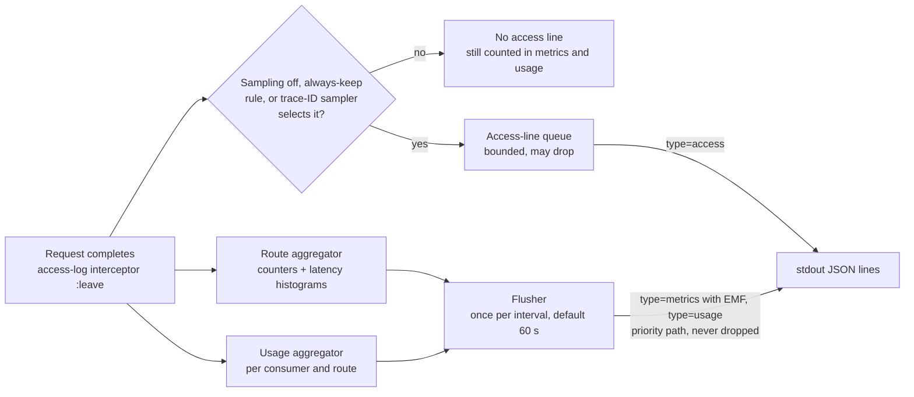

#### 12.3.2 Route summary lines (EMF)

For every route that saw traffic in the interval, each node writes one or more documents with `type: "metrics"`, `kind: "route"`, schema `befive.metrics/1`. Requests that matched no route (`404`, malformed requests) are recorded under the pseudo-route `_unmatched`, so fleet totals include them.

- **Part 1** carries the counters as single summed values (`Requests`, `Status4xx`, `Status5xx`, `AuthFailures`, `AuthzDenials`, `RateLimited`, `BytesOut`; `BytesIn` is a plain field, not a metric) plus the first values of each latency metric.
- **Parts 2 to n** carry only the remaining latency values, at most 100 per metric per document (the EMF limit for value arrays). Counters are never repeated, so `Sum` across parts, nodes, and intervals is exact.
- Each document declares only the metrics it contains. The directives keep draft 1's cardinality rules: `Requests`, `Status4xx`, `Status5xx`, and `Latency` under both `[Environment]` and `[Environment, Route]`; the other six metrics under `[Environment]` only. Route IDs are admin-defined and bounded (never taken from client input).
- Consumer, client IP, and status code are deliberately **not** dimensions: they are unbounded or high-cardinality, and each unique combination is a billed custom metric. Per-consumer data lives in log fields (usage lines and access lines) and is analyzed with Logs Insights, which costs per query rather than per metric per month.
- `_aws.Timestamp` is the interval start, so all nodes' documents for one interval land in the same CloudWatch minute. Every document stays under 4 KB, far below Docker's 16 KB log-line split and EMF's 1 MB document limit.

Example part 1 (sample values; the three latency arrays are shortened here to 5 of their 100 values):

```json
{
  "_aws": {
    "Timestamp": 1790564640000,
    "CloudWatchMetrics": [
      {
        "Namespace": "BeFive",
        "Dimensions": [["Environment"], ["Environment", "Route"]],
        "Metrics": [
          {"Name": "Requests", "Unit": "Count"},
          {"Name": "Status4xx", "Unit": "Count"},
          {"Name": "Status5xx", "Unit": "Count"},
          {"Name": "Latency", "Unit": "Milliseconds"}
        ]
      },
      {
        "Namespace": "BeFive",
        "Dimensions": [["Environment"]],
        "Metrics": [
          {"Name": "AuthFailures", "Unit": "Count"},
          {"Name": "AuthzDenials", "Unit": "Count"},
          {"Name": "RateLimited", "Unit": "Count"},
          {"Name": "BytesOut", "Unit": "Bytes"},
          {"Name": "UpstreamLatency", "Unit": "Milliseconds"},
          {"Name": "GatewayLatency", "Unit": "Milliseconds"}
        ]
      }
    ]
  },
  "schema": "befive.metrics/1", "type": "metrics", "kind": "route",
  "summary_id": "befive-7f9c2:1790560000:17", "node": "befive-7f9c2",
  "environment": "prod", "Environment": "prod", "route_id": "orders-get", "Route": "orders-get",
  "interval_start": "2026-09-28T03:04:00Z", "interval_s": 60, "part": 1, "parts": 19,
  "Requests": 1834, "Status4xx": 12, "Status5xx": 1, "AuthFailures": 9, "AuthzDenials": 3,
  "RateLimited": 0, "BytesIn": 0, "BytesOut": 3360912,
  "latency_samples": 1834, "latency_values_emitted": 1834,
  "Latency": [3.21, 3.21, 3.28, 3.34, 3.34],
  "UpstreamLatency": [2.46, 2.51, 2.51, 2.56, 2.61],
  "GatewayLatency": [0.412, 0.412, 0.42, 0.429, 0.437]
}
```

`Environment` and `Route` appear in PascalCase because EMF dimension values must be root-level keys named exactly like the dimension; the snake_case copies keep the log schema uniform for queries. Parts 2 to 19 repeat the envelope with only `Latency`, `UpstreamLatency`, and `GatewayLatency` declared and present.

**Latency: how percentiles stay meaningful.** An EMF metric value is a number or an array of up to 100 numbers; EMF has no equivalent of the `PutMetricData` values-and-counts pairs or statistic sets (EMF specification, retrieved September 28, 2026). `PutMetricData` would need CloudWatch API calls and IAM permissions on every gateway, which doc 1 rules out, and statistic sets (sum, count, minimum, maximum) cannot produce percentiles at all. So the gateway records each latency into a log-linear histogram per route and metric (bucket boundaries grow by 2% from 0.01 ms to 300 s, 870 buckets) and, at flush, expands the histogram back into values: each non-empty bucket contributes its representative value (geometric midpoint, 4 significant digits) once per request it holds. CloudWatch therefore sees one sample per request, and `p50`, `p99`, `SampleCount`, and `Average` of the latency metrics, computed over all nodes' documents for a minute, behave as they did with per-request EMF. The limits, stated plainly:

1. **Quantization.** Each value is off by at most about 1% (half a bucket width). A p99 of 212 ms is reported within about ±2 ms. CloudWatch then applies its own percentile approximation, as it does for any metric.
2. **Volume cap.** To bound output, a node emits at most `latency-values-max` values per route, metric, and interval (default 10,000, which is 100 documents). Above the cap the histogram is scaled down proportionally before expansion (largest-remainder rounding; every non-empty bucket keeps at least one value). That node's percentiles stay accurate to the quantization error up to about p99.9; beyond `1 − 1/cap` (p99.99 at the default) resolution is lost. `SampleCount` of `Latency` then undercounts requests, which is why request counts always come from `Requests` `Sum`. When only some nodes are capped, fleet-wide percentiles weight the uncapped nodes' samples slightly more than their share of traffic. The `LatencyValuesDownscaled` metric counts downscaled route-intervals so operators know when to raise the cap. At the default cap and a 60 s interval, downscaling starts above about 167 requests per second on one route on one node.
3. **Counters are exact, but only `Sum` means anything.** `SampleCount` and `Average` of counter metrics now count documents, not requests. Dashboards and alarms use `Sum` and metric math only (13.2, 13.4), and the recipe validator rejects any other statistic on a counter metric.
4. **Resolution and delay.** One data point per interval, no sub-minute metrics. Data appears one interval plus a few seconds after the traffic, so alarms react about a minute later than with per-request EMF.
5. **Delivery.** AWS documents EMF extraction as at-least-once, so a duplicated document can occasionally over-count. This was equally true of per-request EMF.

WebSocket connections count in `Requests` and the status metrics but are left out of the latency arrays, because their duration is the connection's lifetime, not a latency.

#### 12.3.3 Usage summary lines

Every interval, each node writes one `type: "usage"` line (schema `befive.usage/1`, no EMF) per (consumer, route) pair that saw traffic. Requests without a resolved consumer are counted in the route metrics only.

```json
{"schema": "befive.usage/1", "type": "usage", "summary_id": "befive-7f9c2:1790560000:u:412", "seq": 412,
 "process_start": 1790560000, "ts": "2026-09-28T03:05:01.004Z", "interval_start": "2026-09-28T03:04:00Z", "interval_s": 60,
 "environment": "prod", "node": "befive-7f9c2",
 "consumer_id": "acme-corp", "consumer_name": "Acme Corp", "plan_id": "gold", "route_id": "orders-get",
 "requests": 412, "status_2xx": 405, "status_3xx": 0, "status_4xx": 6, "status_5xx": 1,
 "rate_limited": 0, "bytes_in": 0, "bytes_out": 754112, "latency_ms_sum": 6091.37, "latency_ms_max": 212.4}
```

| Field | Type | Description |
|---|---|---|
| `summary_id` | string | Unique per line: node ID, process start (epoch seconds), sequence. |
| `seq` | integer | Per-process sequence number over usage lines, without gaps. The report uses it to detect duplicated or missing lines (13.5). |
| `process_start` | integer | Start time of the writing process (epoch seconds); with `node`, identifies the sequence that `seq` counts in. |
| `ts` | string | When the line was written. |
| `interval_start`, `interval_s` | string, integer | The interval (UTC, aligned to wall-clock boundaries). |
| `partial` | boolean | Present and true for the final, shortened interval written at shutdown. |
| `consumer_id`, `consumer_name`, `plan_id`, `route_id` | string | Attribution, copied from configuration at request time (so reports need no database). |
| `requests` | integer | All requests of this consumer on this route, including rejected ones. |
| `status_2xx`, `status_3xx`, `status_4xx`, `status_5xx` | integer | By final status class; `status_2xx` includes `101` WebSocket upgrades. |
| `rate_limited` | integer | Rejected by a rate limit or quota. |
| `bytes_in`, `bytes_out` | integer | Request and response body bytes. |
| `latency_ms_sum`, `latency_ms_max` | number | For averages and worst case; percentiles come from the metrics. |
| `overflow` | boolean | Present and true on `_overflow` lines (12.3.4). |

Usage lines make the monthly report and the usage and quota widgets exact in both modes. Quota **enforcement** is unaffected: it uses the counters in 11.4, not logs.

#### 12.3.4 Aggregation, flush, shutdown, crash loss, and memory

- **Attribution.** A request is counted in the interval in which it completes (WebSocket connections at close), on the node that served it. Intervals align to wall-clock boundaries (`interval-s` is 10, 20, 30, or 60; default 60), so all nodes' documents for an interval share a timestamp.
- **Hot path.** The access-log interceptor's `:leave` step updates the aggregators for every request, before the sampling decision: a few atomic increments on per-route counters, one histogram bucket increment per latency metric, and one lookup-and-increment in the usage map. Each aggregator has two generations selected by interval parity, so request threads never wait for a flush. The 0.2 ms response-path budget in 20.1 includes this work.
- **Flush.** One second after each boundary (so in-flight updates to the closed generation have finished), a flusher on a virtual thread reads and resets the closed generation, serializes one document at a time, and hands the documents to the stdout writer on a **priority path that never drops**: summaries bypass the bounded access-line queue and are written ahead of queued access lines. Only access lines can be dropped under overload (`DroppedAccessLogs`).
- **Shutdown (SIGTERM).** After the drain in 4.4 finishes (no requests in flight), the node closes the current partial interval and flushes it at once, with `"partial": true` and the interval-start timestamp. The writer then drains queued access lines within the existing 2 s budget. A clean shutdown loses no metrics or usage.
- **Crash** (SIGKILL, host loss, `ExitOnOutOfMemoryError`). The node loses its unflushed aggregates: at most one interval plus one second of that node's metrics and usage, together with any lines still in the stdout pipe or the log shipper's buffer. A node serving 250 requests per second loses at most about 15,000 requests from metrics and usage. A 10 s interval shrinks that to about 2,750, at the cost of six times as many usage lines. The report's completeness check makes such gaps visible (13.5). Quota enforcement counters are unaffected.
- **Memory bounds** (per node, both generations):
  - Route aggregator: counters plus three dense latency histograms of 870 four-byte buckets, allocated only for routes that see traffic, about 10.5 KB per active route per generation. Two generations: 200 active routes use about 4 MB; 2,000 routes (the compile-time target in 6.4) about 42 MB, worst case.
  - Usage aggregator: about 200 bytes per (consumer, route) key, capped at `usage-max-keys` per generation (default 100,000), so at most about 40 MB for both generations. When the cap is reached, requests with new keys are accumulated into one `_overflow` line per route (`consumer_id: "_overflow"`, `overflow: true`): totals stay exact, per-consumer attribution for those requests is lost, and `UsageOverflowRequests` (alarmed in 13.4) reports how many. Typical installs use a few thousand keys.
  - Serialization streams one document at a time; there is no per-interval output buffer.
- **Signals for anomaly detection.** The same closed generation also feeds the signal shipper (14.3), which writes one compact row per node per minute to PostgreSQL. It reads the generation after the summary lines are written and never delays them.

#### 12.3.5 Sampling mode (opt-in)

With `:access-log {:sampling {:enabled true}}` (5.3), the access-log interceptor decides per request whether to write the access line. The decision runs after the aggregators are updated and before the line's map is built, so a skipped request costs almost nothing beyond its metrics.

**Rates.** A global `rate` between 0 and 1 (for example 0.1), overridable per route with the route's `:logging {:sample-rate r}` (5.3). A rate of 0 keeps only always-keep lines, which suits health-check and polling routes. Route rates have effect only while sampling is enabled.

**Always-keep rules.** A request that matches an enabled rule is logged with `sample_rate` 1, whatever the sampler says. Rules are checked in this order, and the first match becomes `log_reason`:

| Rule | `log_reason` | Default when sampling is on |
|---|---|---|
| Final status 500 or above | `keep:5xx` | on |
| Authentication failure (`auth_result = fail`, usually `401`) | `keep:authn` | on |
| Authorization denial (usually `403`) | `keep:authz` | on |
| Rate-limit or quota rejection (`429`, or `503` when the rate-limit backend fails closed) | `keep:ratelimit` | on |
| Upstream error or timeout, retried request (`attempts > 1`), client abort (`499`) | `keep:upstream` | on |
| Any other 4xx status | `keep:4xx` | on for all 4xx; can be narrowed to a set such as `#{400 404 413}` or turned off. `401`, `403`, and `429` from denials stay covered by the rules above. |
| `latency_ms` at or above a threshold | `keep:slow` | on, 1,000 ms; per-route override `:logging {:slow-ms n}` |
| Consumer on the always-keep list | `keep:consumer` | empty list |
| Force-log header from an allowed source | `keep:debug` | off (see below) |
| WebSocket connection | `keep:ws` | on (one line per connection is cheap) |
| Incoming `traceparent` has the sampled flag | `keep:trace` | off; the flag is client-controlled, so anyone could force logging |

**Force-log header.** Disabled by default. When an administrator enables it, a request carrying the configured header (default `X-BeFive-Force-Log: 1`) is always logged, but only if it comes from an allowed CIDR (resolved client IP, 8.8) or authenticates as an allowed consumer; otherwise the header is ignored. Enabling it requires at least one allowed CIDR or consumer. The header is stripped before proxying whenever the feature is enabled, and forced lines are capped per node (default 50 per second), so a leaked allow-list entry cannot flood the logs.

**Keep budget.** Always-keep lines can dominate volume during an incident or an attack: a credential-stuffing flood of 401s is entirely always-keep. A token bucket per node (`keep-budget-per-second`, default 1,000 lines per second) caps them. Over budget, a matching request falls back to the trace-ID sampler; if selected, it is logged with the route's rate as `sample_rate` and `log_reason: "capped:<rule>"` (for example `capped:authn`), and every over-budget match increments `AlwaysKeepCapped`. Weighting stays correct because `sample_rate` is always the line's real inclusion probability. Metrics and usage remain exact regardless.

**Deterministic decision.** The sampler follows OpenTelemetry's consistent probability sampling, which relies on the randomness of W3C trace IDs:
1. The randomness value `R` is the explicit `rv` sub-key of an OpenTelemetry `tracestate` entry (`ot=rv:<14 hex digits>`) when present; otherwise it is the lowest 56 bits of the trace ID.
2. The rate `p` becomes a threshold `T = round((1 − p) × 2^56)`, and the request is in the sample when `R ≥ T`.
3. The gateway generates a random trace ID when a request has none (12.8), so every request has randomness.

Consequences: every node makes the same decision for the same trace, so a client retry that lands on another node, or a request that passes through two gateway tiers, is logged everywhere or nowhere. An upstream service's tracer that samples with the same rule at rate `q ≥ p` has traced every request the gateway sampled, so each sampled gateway line has a matching trace; with `q < p`, the traced requests are a subset of the gateway-sampled ones. The headers are only read; pass-through mode (12.8) forwards `traceparent` and `tracestate` unchanged.

**Client-chosen trace IDs.** A client that sets its own `traceparent` chooses `R`, so it can steer its successful requests out of (or into) the sample. It cannot hide from metrics, usage accounting, or any always-keep rule (errors, denials, slow requests, listed consumers). Customers who treat access logs as a security record should keep sampling off or set `:randomness :keyed`: `R` then comes from HMAC-SHA-256 of the trace ID under a cluster key held in the keyring, which stays consistent across nodes and retries but no longer lines up with external tracing samplers.

#### 12.3.6 Per-line sampling fields and query scaling

Every access line carries three fields, in both modes (12.2):

| Field | Default mode | Sampling mode |
|---|---|---|
| `sample_rate` | `1` | The line's inclusion probability: `1` when kept by an always-keep rule, otherwise the route's rate `p`. |
| `in_sample` | `1` | `1` if the trace-ID sampler selected the request at the route's rate (whatever the reason the line was kept), otherwise `0`. |
| `log_reason` | `"all"` | `"sampled"`, `"keep:<rule>"`, or `"capped:<rule>"`. |

Query rules (the saved queries in 13.3 follow them; in default mode every weight is 1, so they return exactly what unweighted queries would):
- **Counts and sums** use Horvitz–Thompson weights: `fields 1 / sample_rate as w | stats sum(w)`, and for bytes `fields bytes_out / sample_rate as bytes_out_w`. This is unbiased for any mix of route rates and keep rules. The relative standard error of an estimate built from `n` sampled lines is roughly √((1 − p) / n): about 3% for 1,000 lines at a 10% rate, about 10% for 100 lines.
- **Queries restricted to always-kept traffic** (5xx, and 401/403/429 under the default rules) are exact, because every such line has weight 1, unless the keep budget was exceeded, in which case they are unbiased estimates.
- **Percentiles and distributions** use `filter in_sample = 1`, a uniform sample of each route's traffic (always-keep lines on their own over-represent slow and failed requests). Across routes with different rates that sample is not uniform, so fleet-wide or cross-route percentiles come from the `Latency` metric.
- **Distinct counts** (distinct client IPs, distinct routes) are lower bounds while sampling; distinct consumers come from usage lines.
- **Single requests** (Q2, Q4) may have no gateway line when sampled out. The `X-Request-ID` still correlates with upstream logs, and a consumer under investigation can be added to the always-keep list.

#### 12.3.7 Periodic node metric lines

Besides route summaries, each node writes these `type: "metrics"` lines every 60 s:

| Metric | Dimensions | Source | Use |
|---|---|---|---|
| `NodeUp` (1) | `[Environment]` | each gateway node | `Sum` per minute = live node count |
| `HealthyTargets`, `UnhealthyTargets` | `[Environment, Upstream]` | each gateway node's view | upstream health widget (`Minimum` across nodes for healthy) |
| `ConfigRevisionLag` | `[Environment]` | each node: current minus applied revision | alarm if a node stays behind |
| `DroppedAccessLogs` | `[Environment]` | each node | alarm if non-zero |
| `RateLimitBackendDegraded` (0/1) | `[Environment]` | each node | alarm on Redis problems |
| `UsageOverflowRequests` | `[Environment]` | each node: requests accumulated into `_overflow` usage lines | alarm if non-zero |
| `LatencyValuesDownscaled` | `[Environment]` | each node: route-intervals whose latency values were downscaled | dashboard hint to raise the cap |
| `AlwaysKeepCapped` | `[Environment]` | each node: always-keep matches over the keep budget | shown on the sampling widget |
| `CertificateDaysToExpiry` | `[Environment]` (minimum across certificates) | control plane | alarm below 14 days |
| `SignalMinutesDropped` | `[Environment]` | each node: per-minute signal rows dropped because PostgreSQL was unreachable for over 15 minutes (14.3) | alarm if non-zero |
| `OpenIncidents`, `ActionsDead` | `[Environment]` | control plane leader | dashboard; alarm if `ActionsDead` > 0 (an integration kept failing for 24 h) |

#### 12.3.8 Custom metrics and ingestion cost

**Custom metrics** = 10 + 4 × (routes + 1) + 2 × upstreams + 8. The `+ 1` is the `_unmatched` pseudo-route; the 8 are the single-dimension metrics in 12.3.7. For 200 routes and 30 upstreams that is 882 metrics. At USD 0.30 per metric per month for the first 10,000 metrics (AWS CloudWatch pricing page, pricing examples for US East (N. Virginia), retrieved September 28, 2026; prices vary by Region and change over time) that is roughly USD 265 per month. Sampling does not change the metric count. `:emf {:route-metrics false}` removes the 4 × (routes + 1) term. The recipe README carries this formula.

**Log ingestion estimate.** Rough planning arithmetic, not a measurement. Assumptions:
- 1,000 requests per second around the clock (86.4 million per day), 30-day month, 4 gateway nodes, 50 routes active on every node, 500 active (consumer, route) pairs per node per minute.
- 1.2 KB per access line (planning figure; the full-field example in 12.2 is about 1.1 KB now that EMF is gone); 1 KB = 1,000 bytes, 1 GB = 10^9 bytes.
- 2% of requests match an always-keep rule under the defaults (4xx, 5xx, denials, slow requests), and the keep budget is not reached. Kept fraction = p + (1 − p) × 0.02.
- Summary overhead, sized from the example documents above: route summaries about 700 documents per minute cluster-wide (60,000 latency samples at 100 per document, plus a partly filled last document per route and node) at about 2.3 KB each, about 1.6 MB per minute; usage lines 4 × 500 × 0.48 KB, about 0.96 MB per minute; node metric lines about 0.02 MB per minute. Total about 2.6 MB per minute (about 43 bytes per request), or 3.7 GB per day, the same in every mode.

| Mode | Access lines kept | Access GB/day | Summary GB/day | Total GB/day | Total GB/month | Ingestion, all Standard (illustrative) | Ingestion, access lines in Infrequent Access (illustrative) |
|---|---|---|---|---|---|---|---|
| Sampling off (default) | 100% | 103.7 | 3.7 | 107.4 | ~3,220 | ~USD 1,610 | ~USD 830 |
| Sampling at 10% | 11.8% | 12.2 | 3.7 | 16.0 | ~480 | ~USD 240 | ~USD 150 |
| Sampling at 1% | 2.98% | 3.1 | 3.7 | 6.8 | ~205 | ~USD 100 | ~USD 80 |
| Sampling at 0% (always-keep only) | 2% | 2.1 | 3.7 | 5.8 | ~175 | ~USD 90 | ~USD 70 |

The price columns cover ingestion only, at USD 0.50 per GB for the Standard log class and USD 0.25 per GB for Infrequent Access, as shown in the pricing examples cited above (US East (N. Virginia), retrieved September 28, 2026). Summary lines are always priced as Standard because they carry EMF. The figures leave out the free tier, storage, and Logs Insights query charges (queries scan less data when sampling). Customers must check current prices for their Region.

How to read it: below about 5%, always-keep lines and the fixed summary overhead dominate, so going from 10% to 1% saves far less than ten times; the customer's own error and 4xx rate becomes the main lever (narrowing `status-4xx` or lowering the keep budget). Summary overhead grows with request count (about 27 bytes per request for latency values) and with active (consumer, route) pairs, not with the sample rate. For comparison, draft 1's per-request EMF lines (about 2.15 KB each) would have ingested about 5,570 GB per month at this traffic, so the default mode is also about 40% cheaper than before.

### 12.4 Redaction rules

Redaction is structural first (we never log what we do not need) and pattern-based second (a safety net).

1. **Headers are not logged.** The access log has no header map. A per-route debug setting can log an explicit allow-list of header names; `Authorization`, `Proxy-Authorization`, `Cookie`, `Set-Cookie`, the route's API-key header, and names in the global `sensitive-headers` setting can never be allow-listed (validation error).
2. **Query strings are not logged.** Only `path` and `path_template`.
3. **Bodies are never logged.**
4. **Credentials:** API keys never appear (only `credential_id`); tokens never appear (only claims-derived identity fields); client certificates appear as fingerprint only in `app` logs at debug level.
5. **Exception messages** in `app` logs pass through a scrubber that replaces JWT-shaped strings (`eyJ[A-Za-z0-9_-]+\.[A-Za-z0-9_-]+\.[A-Za-z0-9_-]*`), `b5k_...`/`b5a_...` keys, `Bearer ...` values, and `password=...`/`secret=...` pairs with `[REDACTED]`.
6. **Admin payloads** in audit events: fields marked `{:befive/secret true}` in the malli schema (secret values, private keys, passwords) are replaced with `"[REDACTED]"`; secret *references* are kept.
7. **Subject PII:** `:access-log {:subject :hash}` replaces `subject` with `subject_hash` for customers whose subjects are email addresses.
8. **Dictionary- and classification-driven masking (Draft 4).** Bodies are still never logged in access lines. Where any feature records body content (route tester traces, composite step traces, exemplars sent to the 1.1 LLM analysis, and the optional debug body sample of a route with `:logging {:bodies :redacted}`), fields tagged in the data dictionary (`pii`, `secret`, or custom tags configured as sensitive, 26.8) are masked by precompiled JSON Pointer sets, and `:logging {:bodies :off}` (the locked Restricted default, 24.1) disables body capture entirely.
9. **Presigned URLs, job tokens, try-it credentials, and the internal JWT** (9.10, 25.7, 30) are covered by the pattern scrubber (`X-Amz-Signature=...`, `X-BeFive-Job-Token`, and the internal JWT header).

A test suite sends requests carrying known canary secrets through every authentication path and failure mode and asserts that no log stream contains them (section 22).

### 12.5 Audit log schema (`befive.audit/1`)

Stored in `audit_event` and written to stdout as `type: "audit"`.

```json
{
  "schema": "befive.audit/1", "type": "audit",
  "id": "01923f70-11aa-7c2e-8b1d-2f0e9a7b6c55",
  "ts": "2026-09-28T03:10:44.512Z",
  "actor": {"type": "user", "id": "u_01J8Z...", "name": "jane.doe@example.com",
            "source": "oidc", "roles": ["operator"], "ip": "10.20.1.14",
            "user_agent": "Mozilla/5.0 ..."},
  "action": "route.update",
  "resource": {"kind": "route", "id": "orders-get"},
  "result": "success",
  "revision": 1843,
  "request_id": "01923f70-1199-7a01-9e33-44c1d2b0a7f1",
  "change": {
    "before": {"match": {"paths": ["/orders/:id"]}, "timeouts": {"read-ms": 30000}},
    "after":  {"match": {"paths": ["/orders/:id"]}, "timeouts": {"read-ms": 10000}},
    "diff":   [{"op": "replace", "path": ["timeouts", "read-ms"], "from": 30000, "to": 10000}]
  },
  "prev_hash": "9f2c...e1", "hash": "4a7b...0c"
}
```

Actions cover every Admin API mutation plus `session.login`, `session.login_failed`, `session.logout`, `token.create`, `token.revoke`, `credential.issue`, `credential.rotate`, `credential.revoke`, `config.apply`, `config.import`, `config.rollback`, `license.install`, `keyring.rotate`, `settings.update`, `export` (exports are audited because they reveal configuration), `incident.acknowledge`, `incident.resolve_manual`, `silence.create`, `automation.action.proposed`, `automation.action.applied`, `automation.action.denied`, `automation.action.approved`, `automation.action.rejected`, `automation.action.expired`, `automation.action.reverted`, `integration.test`, and `llm.analysis.requested` (1.1). Denied attempts are recorded with `result: "denied"`. Draft 4 adds the actor types and actions listed in 33.2 (access requests and approvals, Okta app calls, promotions, cache purges, job result retrievals, evidence exports, break-glass logins, and more).

**Tamper evidence.** `hash = SHA-256(prev_hash || canonical-json(event without hash fields))`, chained in insertion order under the same `config_state` lock or a dedicated audit advisory lock. `GET /admin/v1/audit-events/verify` recomputes the chain. This detects edits and deletions by someone with database access (it does not prevent them; exporting audit logs to CloudWatch with restricted delete permissions is the recommended control). Retention in PostgreSQL defaults to 400 days, configurable.

### 12.6 Live metrics for the console

Each gateway node keeps in-memory counters (`LongAdder`s) per route, per 10-second bucket:
- requests, `2xx`/`3xx`/`4xx`/`5xx` counts, auth failures by reason (top 20 reasons), authz denials, rate-limit rejections, bytes in and out;
- a latency histogram with fixed log-linear buckets (0.25 ms to 60 s, 48 buckets), which merges across nodes exactly and gives p50/p95/p99 with bounded relative error (about 10%), sufficient for a console;
- per upstream target: in-flight, health state, passive failure count.

Every 10 s the heartbeat component writes the closed bucket as one row per node into the `UNLOGGED` `node_metrics` table (unlogged because the data is disposable and should not generate write-ahead log). A control-plane job rolls 10-second rows into 1-minute rows (`node_metrics_1m`, also unlogged) every minute; 10-second rows are kept 2 hours and 1-minute rows 24 hours. The control plane aggregates rows across nodes for the requested window (10-second resolution up to 2 hours, 1-minute resolution up to 24 hours) and pushes updates to consoles over Server-Sent Events. Only aggregated counters cross this path, never per-request data, so the database load is one small row per node per 10 s regardless of traffic.

Draft 4 adds per-API and per-operation series (counters keyed by operation triple for derived routes), policy event counters (denials by reason, rate-limit rejections by dimension, IP-rule denials, override blocks), and IdP health values (9.12) to the 10-second buckets, so the console's live views per API and operation and its IdP health panel use the same path.

These live counters are separate from the per-minute signals that anomaly detection uses (14.3): live counters serve the console's 10-second charts, while signals come from the exact interval aggregates and carry the extra detail detection needs (exact status codes, IP sketches, exemplars).

The same counters are available per node at `GET :9901/internal/metrics` (JSON) for troubleshooting and for troubleshooting; Prometheus scraping uses `/internal/prometheus` (31.5).

### 12.7 Health and readiness semantics

| Endpoint (port 9901) | Gateway role | Control-plane role |
|---|---|---|
| `GET /healthz` (liveness) | `200` if the process is responsive: an event-loop ping task completed within the last 5 s. Never checks dependencies (a database outage must not restart gateways). | `200` if the HTTP server responds. |
| `GET /readyz` (readiness) | `200` when a RouteTable is loaded (from DB or LKG) and listeners are bound and the node is not draining. `503` otherwise. Body: `{"status":"ready","revision":1843,"config_source":"db","degraded":[]}`; degraded reasons (`db-unreachable`, `redis-unreachable`, `lkg-mode`, `idp-jwks-stale:okta-prod`) are informational and do **not** fail readiness. | `200` when the database is reachable and migrations are at the expected version. |

Readiness deliberately stays green in degraded modes: an unhealthy dependency affects freshness or accuracy, and pulling every gateway out of the load balancer would turn that into a full outage.

### 12.8 Trace propagation

- `traceparent` valid per W3C Trace Context: forwarded unchanged (pass-through mode, the MVP default), and its trace ID is logged as `trace_id`. `tracestate` is forwarded unchanged.
- Missing or invalid `traceparent`: the gateway generates one (random 16-byte trace ID, 8-byte span ID, flags `00`) and forwards it, so upstream logs correlate with the gateway log even without a tracing system.
- `X-Request-ID`: incoming values matching `^[A-Za-z0-9._:-]{8,128}$` are kept when `:request-id {:trust-incoming true}` (default true only for requests from trusted proxies); otherwise replaced. Always returned on the response.
- Optional access-log sampling derives its keep-or-skip decision from the trace ID's randomness, consistently with OpenTelemetry samplers (12.3.5); it never modifies `traceparent` or `tracestate`.
- **Draft 4: OpenTelemetry export is in 1.0.** With `:telemetry {:tracing {:enabled true}}`, the gateway creates its own spans (request, authn with IdP calls, cache, composite steps, Lambda, upstream) and forwards a child `traceparent` instead of passing the inbound one through unchanged (31.4). With tracing disabled, Draft 3 pass-through behavior is unchanged.

---

## 13. AWS dashboard and report recipe

### 13.1 Generator architecture

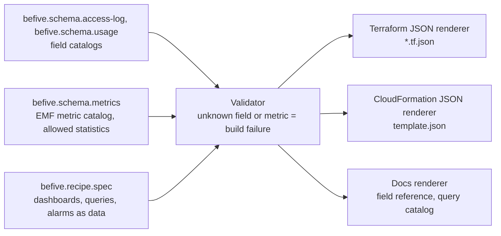

- Dashboards, queries, and alarms are written as Clojure data in `modules/aws-recipe`. Logs Insights queries are built with a tiny query builder (`(q/stats (q/count) :by [:route_id])`) that renders the query text and checks every field keyword against the access-log or usage catalog; access-line counts must use the `1 / sample_rate` weight (12.3.6), and the builder emits it. Metric widgets and alarms reference metric names checked against the EMF catalog, including the allowed statistics (only `Sum` for counter metrics, 12.3.2). A renamed field breaks the build rather than a customer's dashboard (doc 1, 2.6).
- Terraform output uses Terraform's JSON configuration syntax (`.tf.json`), which is plain data and needs no HCL printer. CloudFormation output is a JSON template. Both are rendered from the same intermediate resource model, and a CI test runs `terraform validate` and `cfn-lint` on the output.
- Inputs (Terraform variables / CloudFormation parameters): `environment`, `namespace` (default `BeFive`), `access_log_group`, `metrics_log_group` (defaults to `access_log_group` when all lines share one group), `audit_log_group`, `alarm_sns_topic_arn` (or create one with an email subscription), thresholds, and for the report: `report_bucket`, `ecs_cluster_arn`, `report_task_definition_arn`, `subnet_ids`, `security_group_ids`, `schedule_expression`.

### 13.2 Dashboards

Every widget is marked with how exact it is. **Exact** widgets read CloudWatch metrics or usage lines, which count every request in both logging modes (latency percentiles are exact up to the quantization in 12.3.2). **Logs Insights** widgets read access lines: exact in default mode, and scaled estimates (weighted by `1 / sample_rate`, 12.3.6) when sampling is on, except where every matching line is always kept. Widgets of the second kind carry a subtitle "estimated from sampled logs when sampling is on"; the generator adds it automatically from the query's catalog metadata.

**Operations dashboard** (`befive-<env>-operations`):

| Widget | Type | Source | Exactness |
|---|---|---|---|
| Requests per minute | line | `Requests` Sum, `[Environment]` | exact |
| Latency p50 / p90 / p95 / p99 | line | `Latency` p50, p90, p95, p99 (p90 added in Draft 4 as a statistic, 31.2) | exact (quantized) |
| Requests, 4xx and 5xx rate, p90 and p99 by API (Draft 4) | line | `[Environment, Api]` metrics (31.2) | exact |
| Cache hit ratio (Draft 4) | line | `CacheHits` / (`CacheHits` + `CacheMisses`) (29.7) | exact |
| Gateway overhead p99 | line | `GatewayLatency` p99 | exact (quantized) |
| 4xx and 5xx rate (%) | line with metric math | `100 * Status5xx / Requests`, `100 * Status4xx / Requests` (Sum) | exact |
| Top routes by traffic | bar | `Requests` Sum by `Route` (SEARCH expression, top 10) | exact |
| Top routes by p99 latency | bar | `Latency` p99 by `Route` | exact (quantized) |
| Routes with 5xx | table | `Status5xx` Sum by `Route` | exact |
| Upstream health | line | `HealthyTargets` Minimum, `UnhealthyTargets` Maximum by `Upstream` | exact |
| Gateway nodes | single value + line | `NodeUp` Sum per minute | exact |
| Config revision lag | line | `ConfigRevisionLag` Maximum | exact |
| Recent 5xx errors | Logs Insights table | Q3 | exact while the 5xx always-keep rule is on (the default) |
| Access logging | Logs Insights bar + line | Q13 (kept lines by `log_reason`), `AlwaysKeepCapped` Sum, `DroppedAccessLogs` Sum, `LatencyValuesDownscaled` Sum | line counts are what was written; metrics exact |

**Security dashboard** (`befive-<env>-security`):

| Widget | Type | Source | Exactness |
|---|---|---|---|
| Authentication failures | line | `AuthFailures` Sum | exact |
| Failures by method and reason | Logs Insights bar | Q5 | exact under the default always-keep rules; estimate if they are narrowed or the keep budget is exceeded |
| Authorization denials by route | Logs Insights bar | Q6 | as above |
| Rate-limit rejections | line | `RateLimited` Sum | exact |
| Top offending source IPs | Logs Insights table | Q7 | as above (distinct route counts are lower bounds if lines were capped) |
| Top offending consumers | Logs Insights table | Q8 | as above |
| Rate-limit backend degraded | line | `RateLimitBackendDegraded` Maximum | exact |
| IdP health (Draft 4) | line + single value | `IdpJwksAgeSeconds` Maximum, `IdpCircuitOpen` Maximum, `IdpStaleServing` and `AuthnIdpUnavailable` Sum by `Idp` (9.12) | exact |

**Usage dashboard** (`befive-<env>-usage`), with a Draft 4 "Deprecated usage" widget (Logs Insights over usage lines filtered on `deprecated = true`, by API version and consumer; exact). The same view exists in the console as a tab on the API page and as a shipped saved report (27.4, 32.5):

| Widget | Type | Source | Exactness |
|---|---|---|---|
| Requests by consumer (top 20) | Logs Insights bar | Q9 (usage lines) | exact |
| Data transfer by consumer | Logs Insights table | Q9 (usage lines) | exact |
| Requests by route | metric bar | `Requests` Sum by `Route` | exact |
| Requests by plan | Logs Insights pie | Q10 (usage lines) | exact |
| Quota consumption this month | Logs Insights table | Q11 (usage lines; count per consumer since the 1st; plan quotas shown alongside from the console, since limits are configuration, not logs) | exact, except for the crash-loss bound in 12.3.4 |

### 13.3 Saved Logs Insights queries

Shipped as `AWS::Logs::QueryDefinition` / `aws_cloudwatch_query_definition` in a `BeFive/<env>` folder. Queries use only catalog fields. Access-line queries follow the rules in 12.3.6 so that they are correct in both modes: counts use the weight `w = 1 / sample_rate` (every weight is 1 in default mode, so results equal plain `count(*)`), and percentiles use only `in_sample = 1` lines. Usage queries read `type = "usage"` lines, which are exact in both modes. Queries on usage lines run against the metrics log group, and queries on access lines against the access log group (the same group when all lines share one, 13.1).

**Q1. Slowest routes** (percentiles from a uniform sample; for exact fleet percentiles use the `Latency` metric widgets)
```
filter type = "access" and in_sample = 1
| stats count(*) as lines_in_sample,
        pct(latency_ms, 50) as p50_ms,
        pct(latency_ms, 95) as p95_ms,
        pct(latency_ms, 99) as p99_ms,
        pct(gateway_latency_ms, 99) as overhead_p99_ms
  by route_id
| sort p99_ms desc
| limit 25
```

**Q2. One consumer's activity** (replace the consumer ID; when sampling, only kept lines appear, so add the consumer to the always-keep list while investigating)
```
fields @timestamp, request_id, method, path, status, latency_ms, client_ip, auth_method, rl_decision, log_reason
| filter type = "access" and consumer_id = "acme-corp"
| sort @timestamp desc
| limit 500
```

**Q3. Error spikes by minute, route, and cause**
```
filter type = "access" and status >= 500
| fields 1 / sample_rate as w
| stats sum(w) as errors by bin(1m) as minute, route_id, error_code, upstream_target
| sort minute desc, errors desc
| limit 200
```

**Q4. Full path of one request** (replace the ID; matches the gateway line and any upstream lines that log the same request or trace ID; a sampled-out request has no gateway line but still appears in metrics and usage)
```
fields @timestamp, @log, node, route_id, status, upstream_target, attempts,
       latency_ms, upstream_latency_ms, auth_method, auth_reason, authz_decision, authz_reason,
       error_code, log_reason
| filter request_id = "01923f6e-8c1a-7b3e-9f40-6f1d2c3b4a59"
      or trace_id = "4bf92f3577b34da6a3ce929d0e0e4736"
| sort @timestamp asc
```

**Q5. Authentication failures by method and reason**
```
filter type = "access" and auth_result = "fail"
| fields 1 / sample_rate as w
| stats sum(w) as failures by auth_method, auth_reason
| sort failures desc
```

**Q6. Authorization denials by route and policy**
```
filter type = "access" and authz_decision = "deny"
| fields 1 / sample_rate as w
| stats sum(w) as denials by route_id, authz_policy, authz_reason
| sort denials desc
| limit 50
```

**Q7. Top offending source IPs (401, 403, 429)**
```
filter type = "access" and status in [401, 403, 429]
| fields 1 / sample_rate as w
| stats sum(w) as rejections, countDistinct(route_id) as routes_hit by client_ip
| sort rejections desc
| limit 25
```

**Q8. Top offending consumers**
```
filter type = "access" and ispresent(consumer_id) and status in [401, 403, 429]
| fields 1 / sample_rate as w
| stats sum(w) as rejections by consumer_id, consumer_name, status
| sort rejections desc
| limit 50
```

**Q9. Usage by consumer** (usage lines; exact)
```
filter type = "usage"
| stats sum(requests) as requests, sum(bytes_in) as bytes_in, sum(bytes_out) as bytes_out,
        sum(status_5xx) as errors_5xx, sum(latency_ms_sum) / sum(requests) as avg_latency_ms
  by consumer_id, consumer_name, plan_id
| sort requests desc
| limit 100
```

**Q10. Usage by plan** (usage lines; exact)
```
filter type = "usage"
| stats sum(requests) as requests by plan_id
```

**Q11. Month-to-date requests per consumer** (usage lines; dashboard time range "this month")
```
filter type = "usage"
| stats sum(requests) - sum(rate_limited) as requests_mtd by consumer_id, plan_id
| sort requests_mtd desc
```

**Q12. 401 spike drill-down** (used in the UI doc's investigation flow)
```
filter type = "access" and status = 401
| fields 1 / sample_rate as w
| stats sum(w) as n by bin(5m) as t, auth_reason, idp_id, route_id
| sort t desc, n desc
```

**Q13. Access lines written, by reason** (shows what sampling keeps; in default mode a single `all` bar)
```
filter type = "access"
| stats count(*) as lines by bin(5m) as t, log_reason
| sort t desc, lines desc
```

### 13.4 Alarms

All alarms use metrics, so they behave identically with and without access-log sampling. They notify the SNS topic, use `TreatMissingData = notBreaching` unless stated, and thresholds are variables with the defaults below. Counter metrics are only ever used with `Sum` (12.3.2).

| Alarm | Expression | Default threshold |
|---|---|---|
| High 5xx rate | `100 * Status5xx / Requests` (Sum, 1 min), `[Environment]` | > 5% for 3 of 5 minutes |
| High p99 latency | `Latency` p99, 1 min | > 1,000 ms for 5 of 5 minutes |
| Gateway overhead | `GatewayLatency` p99, 5 min | > 20 ms for 3 of 3 periods |
| Auth failure spike | `AuthFailures` Sum, 5 min, CloudWatch anomaly detection band | outside band (width 3) for 2 of 3 periods |
| Rate-limit rejections spike | `RateLimited` Sum, 5 min, anomaly detection | outside band for 2 of 3 |
| Nodes below minimum | `NodeUp` Sum, 1 min | < `min_nodes` for 3 minutes; `TreatMissingData = breaching` |
| Upstream unhealthy | `UnhealthyTargets` Maximum per upstream, 1 min | > 0 for 5 minutes (one alarm per listed upstream, optional) |
| Config lag | `ConfigRevisionLag` Maximum, 1 min | > 0 for 5 minutes |
| Dropped access logs | `DroppedAccessLogs` Sum, 5 min | > 0 |
| Usage attribution overflow | `UsageOverflowRequests` Sum, 5 min | > 0 |
| Rate-limit backend degraded | `RateLimitBackendDegraded` Maximum, 1 min | ≥ 1 for 2 minutes |
| Certificate expiry | `CertificateDaysToExpiry` Minimum, 1 h | < 14 |
| IdP unavailable (Draft 4) | `IdpCircuitOpen` Maximum, 1 min; or `IdpJwksAgeSeconds` Maximum | ≥ 1 for 5 minutes; or > half of `stale-if-error-s` |
| Upstream client certificate expiry (Draft 4) | `UpstreamClientCertExpiryDays` Minimum, 1 h | < 14 |
| Async queue age (Draft 4, optional) | `AsyncQueueAge` Maximum, 5 min | > 300 s |
| Telemetry sink dropping (Draft 4) | `TelemetrySinkDropped` Sum, 5 min | > 0 |
| Usage report failed | ECS task exit code via EventBridge rule on task state change → SNS | any non-zero exit |

These CloudWatch alarms and BeFive's built-in anomaly detection (14) are complementary: the alarms work without the control plane and follow AWS conventions, while BeFive's detection works without CloudWatch, uses seasonal baselines per route and consumer, groups related problems, and drives ServiceNow. Customers who want one incident pipeline can feed these alarms into BeFive with the CloudWatch alarm poller (14.8); the recipe then offers an option to tag the alarms it creates with a common name prefix for the poller.

### 13.5 Monthly usage report job

**Decision:** an **EventBridge Scheduler** schedule runs an **ECS RunTask** on Fargate using the same gateway image with the `report` subcommand, rather than a Lambda function. Rationale: it reuses the product's code and log schema (no second runtime to ship and patch), has no 15-minute execution limit for large months, and works identically as a Kubernetes CronJob on EKS.

**Draft 4.** The console report builder (32) makes this report one of the shipped saved reports (32.5), computed from PostgreSQL rollups and delivered by schedule. This CloudWatch job remains for customers who want usage reports from CloudWatch alone, for example from a separate audit account.

The report reads **usage summary lines** (12.3.3), never access lines, so it is exact whether or not access-log sampling is on, and it scans far less data than a per-request query would.

```
Schedule:  cron(0 3 1 * ? *)  in UTC    ; 03:00 UTC on the 1st, for the previous month
Command:   ["report" "usage" "--month" "previous"
            "--log-group" "/befive/metrics" "--bucket" "acme-befive-reports"
            "--prefix" "usage/" "--environment" "prod"]
IAM (task role): logs:StartQuery, logs:GetQueryResults, logs:StopQuery on the metrics log group;
                 s3:PutObject on the report prefix; kms:GenerateDataKey if the bucket uses SSE-KMS
```

Algorithm:
1. Split the month into one query per UTC day (keeps each result under Logs Insights' 10,000-row result limit and each query well under its timeout), run up to 4 concurrently (under the account's concurrent-query quota), with retry on throttling. Usage lines are attributed by `interval_start`, so an interval belongs to the day (and month) in which it starts.
2. Per day, run:
   ```
   filter type = "usage"
   | stats sum(requests) as requests, sum(status_4xx) as status_4xx, sum(status_5xx) as status_5xx,
           sum(rate_limited) as rate_limited, sum(bytes_in) as bytes_in, sum(bytes_out) as bytes_out,
           sum(latency_ms_sum) as latency_ms_sum
     by consumer_id, consumer_name, plan_id, route_id
   ```
   If a day returns 10,000 rows (truncation), re-run that day split into hours.
3. **Completeness check** per day: `filter type = "usage" | stats count(*) as lines, min(seq) as first_seq, max(seq) as last_seq by node, process_start`. For each node process, `lines` should equal `last_seq − first_seq + 1`. More lines means duplicates from at-least-once log delivery: the report re-queries that node's day with a first `stats ... by summary_id` stage (taking `max()` of each field per line) followed by a summing `stats`, which removes duplicates. Fewer lines means lost lines (for example, the tail of a crashed node, 12.3.4); the report cannot recover them and records the gap.
4. Merge days by `(consumer_id, route_id)`; compute `avg_latency_ms = latency_ms_sum / requests`.
5. Write to S3 (SSE-S3 or SSE-KMS):
   - `usage/2026-09/summary.csv` (one row per consumer),
   - `usage/2026-09/consumer=acme-corp.csv` (one row per route for that consumer),
   - `usage/2026-09/manifest.json` (query IDs, time range, row counts, SHA-256 of each file, product version, and the completeness result: duplicates removed and missing line ranges per node process).
6. Exit non-zero on any failure (the alarm in 13.4 fires); re-running is idempotent (overwrites the month's prefix). Missing lines alone do not fail the job; they are reported in the manifest.

CSV columns (per-consumer file): `month, consumer_id, consumer_name, plan_id, route_id, requests, status_4xx, status_5xx, rate_limited, bytes_in, bytes_out, avg_latency_ms`.

The report requires only CloudWatch Logs and S3 access. It does not need database access, because consumer names and plans are in the usage lines. The `report` subcommand can also run on-premises against exported log files later; that is out of MVP scope.

---

## 14. Anomaly detection and scripted response

This section adds a must-have MVP feature: BeFive notices anomalous patterns in its own traffic, groups them into incidents, and runs **response rules** that the customer writes as EDN data or as sandboxed Clojure scripts. The built-in actions include creating, updating, and resolving **ServiceNow** incidents and, from 1.1, asking an **enterprise LLM** (OpenAI, Azure OpenAI, Amazon Bedrock, or any OpenAI-compatible endpoint such as a self-hosted vLLM) for a best-guess root cause, which is written into the incident clearly labeled as AI-generated. Everything here runs inside the product: detection needs no CloudWatch, works in air-gapped installs, and is unaffected by access-log sampling.

Terminology used throughout:

| Term | Meaning |
|---|---|
| **Signal** | A per-minute, cluster-wide value derived from the gateways' interval summaries, for example the 5xx rate of route `orders-get` or the authentication failures from one source IP. |
| **Series** | One signal for one entity: `[:route/error-rate-5xx "orders-get"]`. |
| **Detector** | A configured rule that watches a set of series and decides when a value is anomalous (threshold, rate of change, seasonal baseline, and specializations). |
| **Anomaly** | One detector firing on one series, with a lifecycle (open, ongoing, resolved). |
| **Incident** | A group of related anomalies that are handled together. One BeFive incident maps to at most one ServiceNow incident (or one Event Management alert key). |
| **Response rule** | Maps incident events (opened, updated, resolved, reopened) to actions, declaratively, through a script, or both. |
| **Action** | A side effect executed by BeFive: create a ServiceNow incident, request an LLM analysis, post to Slack, block an IP for 30 minutes, and so on. Actions are the only way scripts affect the world. |

**Release scope (doc 1 Draft 4.1, 2.19 and decisions 11, 31, 34).** 1.0 ships detection, incidents and grouping, silences, declarative and scripted response rules, ServiceNow incident create, update, and resolve, Slack and signed-webhook notifications, and two traffic actions: **IP block** and **rate-limit tightening**. The following stay fully designed in this chapter but are labeled by release: the **LLM analysis** (14.14), the ServiceNow **Event Management** target (14.13), and **Microsoft Teams and email anomaly notifications** (`:teams/post`, `:email/send`) arrive in **1.1**, together with the LLM provider integration shared with AI-assisted spec checking (DEV-006); **consumer block** and **route disable** traffic actions are **1.1 or later**. Email itself (Angus Mail and SMTP settings) is in 1.0 for access-request approvals (24.4) and scheduled reports (32.4); only its use as an anomaly action moves to 1.1. Until 1.1, rules and scripts that request a 1.1 action fail validation with `action.not_available_in_release`, so configuration written for 1.0 never silently loses an action.

### 14.1 Decisions

| Topic | Decision |
|---|---|
| Where detection runs | In the control plane, on the **leader** control-plane node (PostgreSQL advisory lock). Gateways only produce data. |
| Input data | The exact per-node interval aggregates that already produce the route and usage summary lines (12.3), recorded before the sampling decision, so detection sees every request whether or not sampling is on and whether or not CloudWatch is used. |
| Transport from gateways | Gateways **write one compact row per node per minute into PostgreSQL** (`summary_inbox`), in the same flush that writes the summary lines. No new network path, no inbound connections to gateways, no gateway dependency on the control plane. Rejected: pushing to the control plane over an internal HTTP endpoint (14.3). |
| Retention | Raw inbox rows 2 hours; merged per-minute signals 8 days (consumer series 3 days); 5-minute rollups 35 days for seasonal baselines; source-IP lists 24 hours; incidents 400 days. All configurable within bounds (14.16). |
| Detectors | Static threshold, rate of change, and seasonal baseline (robust z-score against the same time of week over the previous 4 weeks, with an EWMA fallback during warm-up), plus three specializations: source-IP burst, upstream health flapping, and traffic absence. Every detector has minimum-volume guards. |
| Per-IP data | Gateways keep a bounded **top-k heavy-hitter sketch** (Space-Saving, k = 256) per interval for IPs failing authentication and for IPs rejected with `403` or `429`. No per-IP counters exist anywhere else. |
| Grouping | Anomalies that share a strong entity (upstream, service, identity provider, source IP, or a correlated configuration revision) within 15 minutes form one incident. |
| Response rules | Declarative EDN rules for the common cases; optional Clojure scripts for logic. Scripts are **pure functions** that receive the incident as data and return a vector of action requests; they never perform side effects themselves. |
| Script sandbox | SCI (already approved) with an allow-list of namespaces and no interop, running in a separate **native-image runner process** (`befive-script-runner`) with a hard wall-clock limit (process kill) and a heap limit. Trusted JVM code uses the plugin SPI instead (14.10). |
| Action delivery | Durable **outbox** table with idempotency keys, retries with exponential backoff, and per-integration rate limits, so a ServiceNow or LLM outage never loses an incident. |
| Traffic-affecting actions | Implemented as expiring **runtime overrides** in the configuration snapshot; each gateway enforces the expiry locally, so auto-revert works even if the control plane is down. Global mode `:off` by default; also `:dry-run`, `:approval`, `:on`, with blast-radius limits and protected networks, consumers, and routes. |
| ServiceNow | Table API on `incident` (1.0; Event Management `em_event` as an alternative target from 1.1), OAuth 2.0 client credentials with basic authentication as a fallback, dedupe on `correlation_id`, work notes while ongoing, configurable resolve state and close code. |
| LLM (1.1) | Off by default. Providers: OpenAI, Azure OpenAI, Amazon Bedrock, OpenAI-compatible endpoints. Redacted, minimized context bundle; structured JSON output; strict budget and timeouts; stored for audit; **advisory only**: LLM output is never an input to rules, scripts, or actions. |
| New dependencies | Eclipse Angus Mail (SMTP; used in 1.0 for approvals and reports, for anomaly email from 1.1); AWS SDK v2 `cloudwatch` module and, with the LLM in 1.1, `bedrockruntime` (SDK already approved). No statistics library: EWMA, median and MAD, and Space-Saving are about 300 lines of shared `.cljc` code. |

### 14.2 Overview

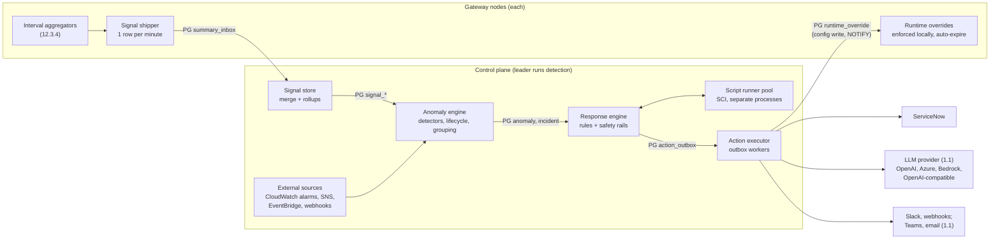

Edges marked PG pass through PostgreSQL tables: gateways and the control plane never connect to each other directly. Per minute, in order: gateways flush their closed interval (12.3.4) and insert their `summary_inbox` row; about 20 seconds after the minute boundary the leader merges all rows for that minute into cluster-wide signals, evaluates every detector, advances anomaly lifecycles, groups anomalies into incidents, and emits incident events; the response engine matches rules, runs scripts, applies safety rails, and writes action requests to the outbox; outbox workers on every control-plane node deliver them. A typical anomaly is visible in the console, and its ServiceNow incident exists, between 2 and 5 minutes after the traffic changed (confirmation needs 3 of 5 breaching minutes by default).

### 14.3 Signal transport from gateways

**Decision: gateways write to PostgreSQL.** Gateways already connect to PostgreSQL (configuration, heartbeat, live metrics in `node_metrics`), so a per-minute insert adds no new network path or firewall rule and preserves the property that gateways and control plane never talk to each other directly (2.3). The alternative, an internal HTTP endpoint on the control plane that gateways push to, was rejected: it would add a gateway-to-control-plane dependency and a new port to open in segmented networks, it needs its own authentication, and it loses data while the leader fails over unless gateways also buffer, which is what PostgreSQL already gives us durably.

A new gateway component, `:befive.gateway/signal-shipper`, is fed by the aggregator flusher. Once per minute (when `interval-s` is shorter than 60, it merges that minute's intervals first; counters add and histograms merge exactly) it builds one payload and inserts it:

```sql
CREATE TABLE summary_inbox (
  node_id        text        NOT NULL,
  minute         timestamptz NOT NULL,          -- interval start, UTC, aligned
  process_start  bigint      NOT NULL,          -- with seq: detects duplicates and gaps
  seq            integer     NOT NULL,
  partial        boolean     NOT NULL DEFAULT false,
  payload        bytea       NOT NULL,          -- gzip of befive.signals/1 JSON, <= 256 KiB
  received_at    timestamptz NOT NULL DEFAULT now(),
  PRIMARY KEY (node_id, minute, process_start)
);
```

**Payload `befive.signals/1`** (JSON before gzip; field names abbreviated here only where noted):

| Part | Contents | Bound |
|---|---|---|
| `routes` | Per active route (and `_unmatched`): requests; status counts by exact code for 4xx and 5xx (sparse map); `auth_failures`, `authz_denials`, `rate_limited`; `upstream_errors` by kind (connect, timeout, reset); top error codes (`jwt.unknown_kid`, `upstream.timeout`) with counts; latency and upstream latency histograms coarsened from 870 to about 350 buckets (5% width), sparse. | Routes that saw traffic; top 20 error codes per route |
| `consumers` | Per consumer: requests, 4xx, 5xx, rate-limited, derived at flush from the usage aggregator (no extra hot-path work). The top 1,000 consumers by requests are listed individually, the rest summed into `_other`. | `max-consumers` (default 1,000, max 10,000) |
| `ip_authn_failures`, `ip_rejections` | Space-Saving sketches: up to 256 `[ip, count, error]` entries each, for authentication failures (`401`) and for authorization or rate-limit rejections (`403`, `429`), plus the exact total they summarize. | k = 256 per sketch |
| `upstream_events` | Target health transitions in the minute: upstream, target, from, to, timestamp, reason (for example `active: 3 consecutive timeouts`). | 200 events, then a count |
| `exemplars` | Up to 20 redacted access-line maps per node per minute, sampled (reservoir) from requests that ended in a 5xx, an authentication failure, or an upstream error, in compact field mode after the normal redaction (12.4): no headers, no query strings, no tokens, no bodies. Used for the incident page and, optionally, the LLM context. | 20 lines, 1 KiB each |
| `node` | Node ID, product version, applied revision, config source, degraded reasons. | fixed |

**Heavy hitters for source IPs.** The route and usage aggregators never keep per-IP state, because client IPs are unbounded. The shipper instead keeps, per event-loop thread (no locking), two Space-Saving sketches with k = 256 that are updated only for requests that failed authentication or were rejected with `403` or `429`, and merges the per-thread sketches at flush. Space-Saving guarantees that every IP with more than N/k of the N counted events is present, and that each reported count overestimates the true count by at most the entry's recorded `error` (bounded by N/k). For a burst, that means an IP causing 2,000 of 10,000 failures in a minute is always found, with its count within 40 of the truth. Small, slow attacks spread over many IPs are not visible per IP by design; the route-level `auth_failures` signal still catches the aggregate rise.

**Hot-path cost.** Per request, the additions to the existing aggregator update are one array increment for the exact status code (only for 4xx and 5xx), one error-code counter increment on failures, and, only on authentication failures and rejections, one sketch update (a hash lookup and a small heap adjustment). Exemplars reuse the access-line map that is already built for kept lines (errors are always kept by default, 12.3.5), or build the compact map only for the few error requests that sampling skipped. The 0.2 ms response-path budget in 20.1 still applies and is checked by the benchmark.

**Failure behavior.** The shipper writes on a virtual thread with a 5 s statement timeout. If PostgreSQL is unreachable it keeps up to 15 unsent minutes in memory (at most about 4 MB), retries every 10 s, and then drops the oldest minute and increments `SignalMinutesDropped` (a node metric line field, 12.3.7). Serving traffic never waits on the shipper. Because gateways are independent of the control plane, rows accumulate if no control plane runs; to keep the table bounded anyway, each shipper deletes its own rows older than the retention (2 hours) every 10 minutes.

**Size.** A node serving 200 active routes and 1,000 consumers produces a payload of roughly 60 to 120 KB of JSON, about 15 to 30 KB after gzip; 12 nodes write about 0.2 to 0.4 MB per minute into a table that holds 2 hours, so the inbox stays under about 50 MB. These are estimates to be confirmed with the benchmark dataset.

### 14.4 Signal store, leader, and retention

**Leader.** Every control-plane node runs the anomaly components, but only the node holding the session-level advisory lock `pg_try_advisory_lock(hashtext('befive.anomaly'))` merges, detects, and runs the response engine. The lock is held on a dedicated connection; if the leader dies or loses the database, PostgreSQL releases the lock when the session ends and a standby acquires it on its next attempt (every 10 s). A new leader rebuilds its in-memory windows from `signal_minute` (the last 60 minutes) and loads open anomalies, incidents, and detector state from their tables, so a failover loses no state and at most one or two minutes of evaluation. In role `all` the single node is always the leader. Outbox workers (14.11) run on all control-plane nodes.

**Merge.** At minute boundary + 20 s (configurable 10 to 50 s), the leader reads all inbox rows for the minute and checks completeness against the gateway nodes that were live at that minute (heartbeats in `gateway_node`). If rows are missing it waits up to a further 20 s, then merges what arrived and marks the minute `partial` with the missing node count. Rows that arrive later are merged into the stored minute (so charts and baselines become correct), but detectors do not re-evaluate past minutes. Duplicate rows (same node, minute, and process) are ignored; rows more than 2 minutes in the future (clock skew) are rejected and reported as a node warning.

**Tables.**

| Table | Contents | Retention (default) | Rough size |
|---|---|---|---|
| `summary_inbox` | Raw per-node rows (14.3) | 2 h | < 50 MB for 12 nodes |
| `signal_minute` | Cluster-wide values per entity per minute: `entity_kind` (`env`, `route`, `service`, `upstream`, `consumer`), `entity_id`, `minute`, `counters` (int8 array in catalog order), `lat` and `ulat` (coarse histograms, bytea), `partial`. Partitioned by day. | 8 days; consumer rows 3 days | about 0.4 KB per route-minute: 50 routes about 30 MB per day |
| `signal_5m` | 5-minute rollups for `env`, `route`, `service`, and `upstream` entities, with p50, p95, and p99 precomputed | 35 days (4 weeks of baselines plus margin) | about 0.25 KB per row: 50 routes about 125 MB in total |
| `signal_topk_minute` | Merged cluster-wide IP sketches per minute (top 1,000 entries with error bounds) | 24 h (privacy default; 1 to 168 h) | about 60 KB per minute during bursts, less otherwise |
| `signal_exemplar` | Exemplar access-line maps per minute | 24 h | about 20 KB per node-minute at most |
| `baseline_state` | Per series: EWMA mean and variance, fast and slow EWMA for consumer surges, sample count, last update | while the series is active, pruned after 35 days idle | about 100 bytes per series |

Retention jobs drop whole daily partitions (cheap) and run on the leader. Detectors read from in-memory ring buffers (last 60 minutes per active route, service, upstream, and environment series) and from `signal_5m` for baselines, so detection does not scan large tables every minute.

### 14.5 Signal catalog

Signals are derived from the merged counters. Rates are computed from sums, never averaged across nodes.

| Signal | Entities | Definition |
|---|---|---|
| `:traffic/requests` | env, route, service, consumer | Requests per minute. |
| `:errors/rate-5xx` | env, route, service, upstream | 5xx responses / requests. |
| `:errors/rate-4xx` | env, route, consumer | 4xx responses / requests (excluding `401`, `403`, `429`, which have their own signals). |
| `:errors/count-401`, `:errors/count-403`, `:errors/count-429` | env, route, consumer (403, 429) | Counts per minute; `401` is also broken down by top error code (for example `jwt.unknown_kid`). |
| `:auth/failures` | env, route, identity provider | Authentication failures per minute (identity provider attribution from the route's authentication configuration and error codes). |
| `:latency/p95`, `:latency/p99` | env, route, service | From the merged coarse histograms (about ±2.5% quantization). |
| `:latency/upstream-p99` | route, upstream | Upstream time only, separating backend slowness from gateway overhead. |
| `:upstream/errors` | route, upstream | Connect failures, timeouts, and resets per minute. |
| `:upstream/health-transitions`, `:upstream/unhealthy-targets` | upstream | Transitions per minute and currently unhealthy targets (from `upstream_events` and heartbeats). |
| `:ip/auth-failures`, `:ip/rejections` | source IP (from sketches) | Estimated count per IP per minute with error bound. |
| `:cluster/nodes-reporting` | env | Live gateway nodes that delivered the minute. |
| `:config/changes` | env and each changed entity | Revisions committed in the minute and the entities they touched (from `config_change`). Used for correlation, not as a detector input on its own. |

Service and upstream values aggregate the routes that belong to them through the current configuration (route → service → upstream), so a failing upstream shows as one series even when it serves ten routes.

### 14.6 Detectors

Detectors are configuration entities (schema in 14.15), edited in the console or in files and promoted like routes. Every detector names one signal, a selection of entities, a condition, confirmation rules, recovery rules, guards, and a severity. Evaluation happens once per minute per selected series.

**Kinds.**

1. **Threshold.** Compares the signal with a fixed value, over a window with M-of-N confirmation.
2. **Rate of change.** Compares a recent window with a preceding reference window (ratio up or down), with minimum volume and minimum absolute change.
3. **Seasonal baseline.** Compares the recent value with what is normal for this time of week (below), in the configured direction (`:up`, `:down`, or `:both`).
4. **Source-IP burst** (specialized threshold on `:ip/*` series): an IP exceeds N failures in W minutes; the anomaly records the IP's share of all failures and the error bound.
5. **Upstream flap** (specialized threshold on `:upstream/health-transitions`): at least N transitions in W minutes.
6. **Absence** (specialized baseline): a route that normally carries traffic receives none (or less than a floor) for W minutes.

```clojure
;; detectors/orders.edn  (examples; sample thresholds)
[{:id "orders-5xx"
  :description "5xx rate on order routes"
  :kind :threshold
  :signal :errors/rate-5xx
  :select {:routes {:tags #{"team-orders"}}}
  :condition {:op :> :value 0.02}                 ; more than 2% of requests
  :confirm {:breaches 3 :of 5}                    ; 3 of the last 5 minutes
  :guard {:min-requests-per-minute 60}            ; rates on tiny volumes are noise
  :recover {:op :< :value 0.01 :minutes 10}       ; hysteresis: open at 2%, resolve below 1%
  :severity :high}

 {:id "orders-traffic-drop"
  :kind :rate-of-change
  :signal :traffic/requests
  :select {:routes {:tags #{"team-orders"}}}
  :direction :down
  :compare {:recent-minutes 10 :reference-minutes 60}
  :ratio 0.3                                      ; recent below 30% of reference
  :guard {:min-reference-per-minute 100 :min-absolute-change 500}
  :severity :high}

 {:id "auth-failures-unusual"
  :kind :baseline
  :signal :auth/failures
  :select {:identity-providers :all}
  :direction :up
  :z 4.0 :recover-z 2.0
  :guard {:min-absolute-change 50}                ; at least 50 more per 5 min than normal
  :severity :medium}

 {:id "credential-stuffing"
  :kind :ip-burst
  :signal :ip/auth-failures
  :condition {:count 300 :minutes 5}
  :severity :high
  :group-by :ip}

 {:id "upstream-flapping"
  :kind :flap
  :signal :upstream/health-transitions
  :select {:upstreams :all}
  :condition {:transitions 4 :minutes 10}
  :severity :medium}

 {:id "tier1-silent"
  :kind :absence
  :select {:routes {:tags #{"tier-1"}}}
  :minutes 10
  :expected {:min-baseline-per-minute 60}         ; only routes that normally carry >= 1 req/s
  :severity :critical}]
```

**Seasonal baseline, exactly.** For a series and the current evaluation time t:
- Baseline sample: the 5-minute rollup values from `signal_5m` for the same 5-minute slot of the week and its two neighboring slots, in each of the previous 4 weeks: up to 12 values. Slots are computed in the install's configured time zone (`:anomaly {:timezone "America/New_York"}`, default UTC), so business-hour patterns stay aligned across daylight-saving changes. The first week after a DST change compares against slots one hour off for the hours around the change; the neighbor slots soften that and it is documented.
- Current value: the sum (for counts) or the ratio of sums (for rates) over the trailing 5 minutes.
- Robust z-score: z = (x − median) / max(1.4826 × MAD, floor), where MAD is the median absolute deviation of the baseline sample and the floor prevents division by near-zero spread: for counts, max(√median, 1% of median, the detector's absolute floor); for rates, the detector's `:rate-floor` (default 0.002); for latency, 5% of the median.
- Requirement: at least 2 weeks of history (at least 6 baseline values) for the series.
- Warm-up fallback: with less history, the detector uses an EWMA of the per-minute values (half-life 2 hours) with an EWMA variance, z = (x − mean) / max(σ, floor). With less than 6 hours of data the series is **inactive** and the console shows it as "warming up (3 h of 6 h)". New routes therefore get threshold and rate-of-change protection immediately and seasonal protection after 6 hours, full seasonal behavior after 2 weeks.
- Consumer series use a two-speed EWMA instead of time-of-week baselines (consumer traffic is often batch-driven and consumers are too many to store 35 days of 5-minute history cheaply): a surge is fast EWMA (half-life 10 minutes) above k times the slow EWMA (half-life 24 hours) and above the minimum volume.

**Guards (all detectors).** `:min-requests-per-minute` for rate signals (a 50% error rate on 4 requests is not an incident); `:min-absolute-change` for count signals; `:min-baseline-per-minute` for drop and absence; and data completeness: minutes marked `partial` never count as breaches for `:down` and absence detectors (a crashed node must not look like a traffic drop; node loss has its own signal). A detector selecting more than 5,000 series is rejected at validation, and one detector can have at most 100 open anomalies; beyond that it opens a single "detector overflow" anomaly instead, which protects ServiceNow from storms caused by a bad detector.

**Config-change correlation.** When an anomaly opens, the engine looks up revisions committed in the preceding 30 minutes (configurable) that touched the anomaly's entities, their parents (route → service → upstream), or global settings that affect them (policies, identity providers, plans, rate limits). Matches are attached to the anomaly as `:correlated-revisions` with the diff paths from `config_change`, are usable in rule conditions (`:when {:correlated-change true}`), become a grouping key, and are included in the LLM context. Correlation is evidence, not proof: the console labels it "changed shortly before" and never "caused by".

**Built-in detectors.** A fresh install ships a conservative set, all set to the `:console` response only (no ServiceNow, no traffic actions) until an administrator adds rules: environment 5xx rate (baseline, z ≥ 5), environment traffic drop (rate of change, below 30% for 10 minutes), per-route 5xx above 5% (threshold), per-route latency p99 (baseline, z ≥ 5), authentication failures per identity provider (baseline), source-IP authentication-failure burst (300 in 5 minutes), upstream flapping, and gateway nodes not reporting.

**Honest limits.** Seasonal baselines learn from the previous 4 weeks, so a month-end batch, a public holiday, or a one-off marketing event will look anomalous; silences (14.7) and the `:guard` settings handle known events, and detectors can be tuned per route. Robust statistics on 6 to 12 values reject single outliers but cannot model growth trends within a week; strongly growing routes should use rate-of-change detectors. Per-minute resolution means detection needs at least 3 to 5 minutes to confirm by default; this is a trade against false alarms, adjustable per detector (down to 1 of 1, which suits absence detectors).

### 14.7 Anomaly lifecycle, grouping, silences, and severity

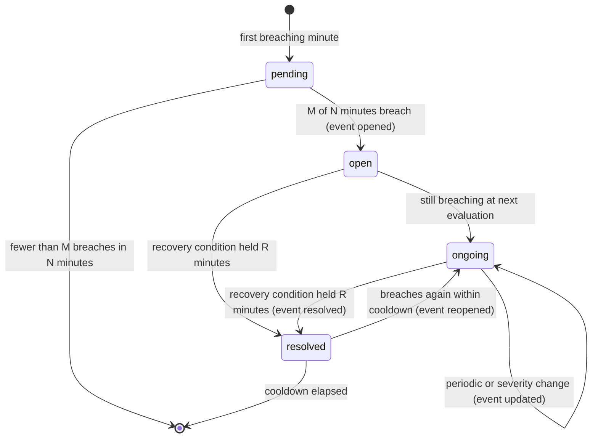

- **Pending** is internal and invisible: one breaching minute starts the M-of-N count (default 3 of 5).
- **Open** is the confirmed state and emits the incident-level event `opened` (or `updated` if the anomaly joins an existing incident).
- **Ongoing** anomalies emit `updated` when their severity changes and otherwise at most every `:update-every-minutes` (default 30) with fresh values, so ServiceNow work notes stay informative without flooding.
- **Resolved** requires the recovery condition to hold for R consecutive minutes (default 10). The recovery condition is stricter than "no longer breaching" (hysteresis): a threshold detector opened at 2% resolves below its `:recover` value (default 80% of the threshold), a baseline detector opened at z ≥ 4 resolves at z < 2. This prevents open/resolve flapping around a threshold.
- **Cooldown and reopen.** If the same detector breaches again on the same series within the cooldown (default 30 minutes) after resolving, the anomaly is reopened (`reopen_count` increases, event `reopened`), not duplicated. After the cooldown a new anomaly is created.
- **Deduplication key** is `(detector-id, series)`: at most one non-expired anomaly exists per key.
- **Acknowledgement** is an attribute set by a person (console or API), not a state. Acknowledged incidents still resolve automatically.

**Grouping into incidents.** When an anomaly opens, the engine computes its entity keys: the route, its service and upstream, the identity provider (for authentication signals), the source IP (for IP signals), correlated revisions, plus any `:group-by` key the detector declares. It joins an open incident if one was active in the last 15 minutes (`:group-window-minutes`) and shares at least one **strong** key (upstream, service, identity provider, source IP, or correlated revision); a shared route alone is also strong. Environment-level anomalies (for example the environment 5xx rate) join the incident that already contains anomalies on routes contributing most of that signal; otherwise they start their own incident. An incident holds at most 50 anomalies; further members are counted but not listed. The incident's severity is the highest member severity, its title comes from its first member ("5xx rate 7.8% on upstream orders (3 routes)"), and it resolves when all members are resolved and 15 minutes have passed without a new member (`:group-quiet-minutes`). Grouping is what makes "one ServiceNow incident per problem" true: a failing upstream behind ten routes produces one incident with ten anomalies, not ten tickets.

**Silences and maintenance windows.** A silence has matchers (detector IDs, signals, routes, services, upstreams, consumers, identity providers, tags, severity at most), a time specification (one-off start and end, or weekly recurring days, start time, duration, and time zone), a comment, and an author. While an anomaly or incident matches an active silence, it is still detected, stored, and shown in the console (marked "silenced"), but response rules do not run. If the problem is still present when the silence ends, the incident's `opened` event fires then, so nothing is lost. Maintenance windows are silences with `:kind :maintenance`; CI pipelines create them around deployments with `b5ctl silence create --match service=orders --duration 30m --comment "deploy 4be1c09"`. Silences are audited and appear on the incident timeline.

**Severity** has five levels. Detectors set it; rules can raise it (`:set-severity`); an incident's severity is the maximum of its members'. Default mapping to ServiceNow impact and urgency (configurable per integration):

| Severity | Impact / urgency | Resulting ServiceNow priority (default matrix) | Default notification behavior |
|---|---|---|---|
| `:critical` | 1 / 1 | 1 - Critical | Page-worthy; rules typically create an incident and notify chat. |
| `:high` | 1 / 2 | 2 - High | Incident. |
| `:medium` | 2 / 2 | 3 - Moderate | Incident or chat, per rule. |
| `:low` | 3 / 2 | 4 - Low | Chat or console. |
| `:info` | 3 / 3 | 5 - Planning | Console only. |

### 14.8 External anomaly sources (optional)

BeFive's own detectors cover what the gateways observe. Customers who already alarm in CloudWatch (including CloudWatch anomaly-detection alarms and composite alarms) can feed those alarms into the same lifecycle, grouping, rules, and ServiceNow integration. External anomalies skip M-of-N confirmation (the source decides when it fires and recovers) but get dedupe, grouping, silences, and rules like any other.

| Source | How | Network and permissions | Notes |
|---|---|---|---|
| **CloudWatch alarm poller** (recommended on AWS) | Leader calls `DescribeAlarms` every 60 s for configured alarm-name prefixes or ARNs; `ALARM` opens, `OK` resolves, `INSUFFICIENT_DATA` is recorded without action. | Outbound HTTPS to the CloudWatch endpoint (or a VPC interface endpoint); `cloudwatch:DescribeAlarms` on the control-plane task role only. No inbound path. | Works with private-only control planes. Adds the AWS SDK v2 `cloudwatch` module. |
| **Amazon SNS HTTPS subscription** | SNS posts to `POST /hooks/v1/sns/{source-id}` on the admin port. BeFive confirms only subscriptions for configured topic ARNs and verifies every message signature (signature version 2, SHA-256; signing certificate URL must be HTTPS on an `sns.<region>.amazonaws.com` host, fetched through the SSRF guard and cached). | SNS must reach the endpoint over the internet, so this needs a public path (a dedicated ALB listener rule for `/hooks/*` with AWS WAF), which many customers will not want for their admin port. | The console warns if the hooks path is not configured as reachable. |
| **Amazon EventBridge API destination** | An EventBridge rule on "CloudWatch Alarm State Change" targets an API destination at `POST /hooks/v1/events/{source-id}`, authenticated with an API-key header (`X-BeFive-Hook-Key`, compared in constant time with a stored secret). | Same reachability requirement as SNS. | Also accepts other EventBridge events mapped by a small field mapping. |
| **Generic webhook** | `POST /hooks/v1/generic/{source-id}` with a JSON body `{"key", "status": "firing" or "resolved", "severity", "title", "entities": {"route": ...}, "details"}` and an HMAC-SHA256 signature header `X-BeFive-Signature: t=<unix>,v1=<hex>` over `t + "." + body`, with a 5-minute timestamp tolerance. | Reachable from the sender (often internal monitoring). | For Prometheus Alertmanager, Datadog, or custom tools through a small relay. |

The hooks endpoints are separate from `/admin/v1`: no session or CSRF, per-source secrets, body limit 256 KiB, rate limit 60 requests per minute per source, and every accepted or rejected delivery is logged (`app` log) and counted. They can be disabled entirely (default: disabled until a source is configured).

### 14.9 Response rules

A response rule selects incident events and lists actions per event. Rules are configuration entities (14.15), evaluated in priority order; every matching rule runs (a rule can set `:stop true` to prevent lower-priority rules from running for that event). Incident events:

| Event | When |
|---|---|
| `:opened` | An incident is created (its first anomaly opened), or a silence covering it ended while it was still active. |
| `:updated` | A new anomaly joined, severity changed, or the periodic update is due (`:update-every-minutes`). |
| `:resolved` | All anomalies resolved and the quiet period passed. |
| `:reopened` | A resolved incident received a new or reopened anomaly within the cooldown. |
| `:action-result` | An action for this incident finished (for example `:llm/analyze` completed or `:servicenow/create` failed permanently); lets a rule react, for example by notifying chat that ServiceNow is unreachable. |

```clojure
;; response-rules/production.edn  (examples)
[{:id "servicenow-major"
  :description "ServiceNow incident for high and critical incidents (1.0)"
  :priority 100
  :when {:severity-at-least :high
         :environment #{"production"}}
  :on {:opened   [{:action :servicenow/create :integration "snow-prod"}
                  {:action :slack/post :integration "slack-api-oncall"}]
       ;; From 1.1, the AI best guess and Teams can be added:
       ;;   {:action :llm/analyze :integration "openai-enterprise"}
       ;;   {:action :servicenow/create ... :await [:llm/analyze] :await-timeout-s 45}
       ;;   {:action :teams/post :integration "teams-api-oncall"}
       :updated  [{:action :servicenow/update :integration "snow-prod"}]
       :reopened [{:action :servicenow/update :integration "snow-prod"}]
       :resolved [{:action :servicenow/resolve :integration "snow-prod"}
                  {:action :slack/post :integration "slack-api-oncall"}]}}

 {:id "config-change-heads-up"
  :description "Tell the author's team when an incident follows their change"
  :priority 90
  :when {:correlated-change true :severity-at-least :medium}
  :on {:opened [{:action :slack/post :integration "slack-platform"
                 :template :incident/correlated-change}]}}

 {:id "credential-stuffing"
  :description "Temporarily block a single IP that causes most authentication failures"
  :priority 80
  :when {:detectors #{"credential-stuffing"}}
  :script {:file "scripts/credential_stuffing.clj"}   ; inlined by b5ctl; stored as source
  :on {:opened [{:action :webhook/post :integration "soc-webhook"   ; :email/send from 1.1
                 :template :incident/summary}]}}]
```

`:when` conditions (all optional, combined with AND): `:severity-at-least`, `:detectors`, `:signals`, `:sources` (`:internal`, `:external`), `:entities` (routes, services, upstreams, consumers, identity providers by ID or tag), `:environment`, `:correlated-change`, `:min-duration-minutes` (only act on incidents that lasted this long, useful for noisy low-severity signals), and `:time` (business hours in a time zone). Templates (`:incident/summary`, `:incident/correlated-change`, or customer templates defined as data with `{{placeholders}}`) render titles and bodies; the defaults include the incident link in the console, members, key values against baseline, correlated changes, and actions taken.

**Idempotency and ordering.** Each action request gets an idempotency key `sha256(incident-id, rule-id, event-seq, action-index)`, so a rule evaluated twice (for example after a leader failover) enqueues the action once. For each (incident, integration) pair, actions execute in event order; an `update` waits until the `create` it depends on has succeeded.

### 14.10 Scripts and the sandbox

Scripts handle what declarative rules cannot express: thresholds that depend on context, choosing assignment groups by route tag, deciding whether a traffic action is warranted. A script is Clojure source attached to a rule (inline in the console, or a file in the configuration repository that `b5ctl` inlines on apply). It must define `respond`, a **pure function** from an event context to a vector of action requests. It cannot call anything with a side effect; the returned data is validated and executed by BeFive. This makes scripts deterministic, testable offline (`b5ctl anomaly test-script`), and easy to dry-run: dry-run simply records the returned actions instead of executing them.

```clojure
;; scripts/credential_stuffing.clj
(ns scripts.credential-stuffing
  (:require [befive.script :as es]))

(defn respond
  "Block one source IP for 30 minutes if it causes most authentication failures
   and is not in a protected network. Always tell the SOC channel."
  [{:keys [event incident anomalies settings]}]
  (let [burst (es/first-anomaly anomalies {:signal :ip/auth-failures})
        ip    (get-in burst [:entity :ip])
        share (:share burst)]                  ; this IP's share of all auth failures
    (cond-> [{:action :slack/post :integration "slack-soc"
              :text (str "Auth-failure burst from " ip ": "
                         (es/fmt-count (:value burst)) " failures in 5 min ("
                         (es/pct share) " of all failures)")}]
      (and (= event :opened)
           (> share 0.8)
           (not (es/protected-ip? settings ip)))
      (conj {:action :traffic/block-ip
             :cidr (str ip "/32")
             :duration-minutes 30
             :reason (str "credential stuffing suspected, incident " (:id incident))}))))
```

```clojure
;; scripts/route_owner.clj - choose the ServiceNow assignment group from route tags
(ns scripts.route-owner
  (:require [befive.script :as es]))

(def owners {"team-orders" "Orders API Support"
             "team-billing" "Billing Platform"})

(defn respond [{:keys [event incident]}]
  (let [group (or (some owners (es/entity-tags incident)) "API Platform")]
    (case event
      :opened   [{:action :servicenow/create :integration "snow-prod"
                  :fields {:assignment-group group}}]
      :updated  [{:action :servicenow/update :integration "snow-prod"}]
      :resolved [{:action :servicenow/resolve :integration "snow-prod"}]
      [])))
```

**Context passed to `respond`** (plain data, the same shape the console shows in the script tester): `:event`; `:incident` (ID, title, severity, status, opened and updated times, entity keys and tags, member count, acknowledgement, ServiceNow reference if any); `:anomalies` (per member: detector, signal, entity, value, threshold or baseline, z-score, share for IP signals, state, the last 60 minutes of the series and its baseline as vectors); `:correlated-revisions` (revision, time, actor role, changed paths); `:actions-taken` (earlier actions for this incident and their results); and `:settings` (protected networks, consumers, and routes; automation mode; environment name). The context never contains secrets, LLM output, access-line exemplars, or full configuration documents.

**Curated API.** Scripts can use `clojure.core` without I/O, evaluation, or concurrency functions (no `slurp`, `spit`, `eval`, `load-string`, `future`, `agent`, `send`, `Thread`), `clojure.string`, `clojure.set`, `clojure.walk`, and `befive.script`: pure helpers such as `first-anomaly`, `entity-tags`, `severity>=`, `protected-ip?`, `in-cidr?`, `pct`, `fmt-count`, `fmt-duration`, `minutes-since`, and `baseline-ratio`. Java interop, `import`, `resolve` of non-allowed vars, reflection, and class access are not available (SCI `:allow` lists plus `:deny`, no `:classes`). There is no filesystem, network, clock (the context carries `:now`), or random source, so the same context always gives the same result.

**Runner process.** Scripts run in `befive-script-runner`, a GraalVM native-image binary built from the `script-runner` module (like `b5ctl`) and shipped in the Docker image for linux-amd64 and linux-arm64. The control plane keeps a pool of runner processes (default 2, max 8) and exchanges length-prefixed EDN messages over stdin and stdout. The process boundary exists for enforceable limits, which an in-JVM interpreter cannot provide: since JDK 20, `Thread.stop` throws `UnsupportedOperationException`, so a runaway loop in an in-process interpreter could not be stopped, and the JVM cannot cap one thread's memory.

| Limit | Default | Maximum | Enforcement |
|---|---|---|---|
| Wall-clock time per invocation | 500 ms | 5 s | Control plane kills the process (SIGKILL) and starts a new one. |
| Heap per runner | 128 MiB | 512 MiB | Native-image `-Xmx`; out-of-memory ends the process. |
| Realized sequence length | 100,000 | 1,000,000 | SCI `:realize-max`. |
| Returned actions per invocation | 20 | 100 | Validation. |
| Result size | 64 KiB | 1 MiB | Validation. |
| Source size | 64 KiB | 256 KiB | Schema. |

Runner processes start with an empty environment, an empty temporary working directory, and no inherited file descriptors except the pipes. The security boundary is SCI's allow-list; the separate process adds hard resource limits and crash isolation, not a second guarantee against an interpreter escape, which is why editing scripts requires the Administrator or Automation Manager role (15.6) and every change is audited. Scripts are compiled when saved (syntax and allow-list errors are shown in the editor) and cached in each runner by content hash.

**Failures.** A script that throws, times out, or returns invalid actions is recorded in `script_run` with the error; the rule's declarative `:on` actions still run, and the console shows the failure on the incident timeline and the rule. After 5 consecutive failures the script is automatically suspended (the rule keeps its declarative actions) and an administrator notification is raised. If the runner binary cannot start (for example an unsupported platform), scripts are disabled with a clear status and EDN rules keep working.

**Trusted JVM code.** Operators who need arbitrary logic or a proprietary integration write a plugin with the existing SPI (17). Plugin API 1.1 adds an optional `:actions` map to the plugin definition, for example `{:acme/pagerduty {:config-schema [...] :execute (fn [action ctx] deferred)}}`, which registers `:acme/pagerduty` as an action usable in rules and scripts. Plugin actions run in the control-plane JVM with full privileges, as trusted code, through the same outbox, idempotency, and audit as built-in actions.

### 14.11 Built-in actions and the action executor

| Action | Effect | Traffic-affecting |
|---|---|---|
| `:console/notify` | Notification in the console bell and the incidents list (always on, implicit). | No |
| `:servicenow/create`, `:servicenow/update`, `:servicenow/resolve`, `:servicenow/comment` | Create, add a work note to, or resolve the ServiceNow incident for this BeFive incident, or (from 1.1) send an Event Management event (14.13). | No |
| `:llm/analyze` (1.1) | Build the redacted context bundle, call the configured LLM, store the structured best guess, and make it available to later ServiceNow and chat actions (14.14). Limited to 3 analyses per incident (initial, one automatic re-analysis when the incident grows by 3 or more anomalies, one manual). | No |
| `:email/send` (1.1) | Email through the configured SMTP relay (STARTTLS or implicit TLS, optional authentication), plain-text body from a template, to fixed recipients (no recipient addresses from incident data). | No |
| `:slack/post` | Slack incoming webhook with a Block Kit message. | No |
| `:teams/post` (1.1) | Microsoft Teams Workflows webhook (Power Automate "When a Teams webhook request is received") with an Adaptive Card; Office 365 connectors, which Microsoft retired, are not supported. | No |
| `:webhook/post` | JSON POST to a configured URL with an HMAC-SHA256 signature header, for custom automation. | No |
| `:incident/set-severity`, `:incident/add-note` | Change the BeFive incident's severity (upward only by rules) or add a timeline note. | No |
| `:traffic/block-ip` | Deny a source IP or small CIDR on all routes or selected routes for a limited time. | **Yes** |
| `:traffic/block-consumer` (1.1 or later) | Reject one consumer's requests (after authentication) for a limited time. | **Yes** |
| `:traffic/tighten-rate-limit` | Multiply the rate limits of a consumer or route by a factor below 1 for a limited time. | **Yes** |
| `:traffic/disable-route` (1.1 or later) | Answer a route with `503` and `Retry-After` for a limited time. | **Yes** |

Every outbound call goes through the shared SSRF-guarded client (`befive.core.http/safe-client`, 18.5) with per-integration timeouts, and every credential is a secret reference resolved from the envelope-encrypted secret store (18.2).

**Outbox.** Actions are rows in `action_outbox`: `id`, `incident_id`, `rule_id`, `action` (kind), `integration_id`, `request` (jsonb, validated), `idempotency_key` (unique), `status` (`pending`, `awaiting-approval`, `in-flight`, `succeeded`, `failed-retrying`, `dead`, `dry-run`, `denied`, `cancelled`), `attempts`, `next_attempt_at`, `last_error`, `result` (jsonb, for example the ServiceNow `sys_id` and `number`), and timestamps. Workers on every control-plane node claim due rows with `SELECT ... FOR UPDATE SKIP LOCKED`, execute on virtual threads, and write the result in the same transaction that marks the row. Rules:
- Retries use exponential backoff with full jitter: 10 s, 20 s, 40 s, up to 15 minutes between attempts, for up to 24 hours (configurable), then `dead` with a console alert and an `:action-result` event.
- HTTP `408`, `429`, and `5xx`, connection errors, and timeouts are retried; `Retry-After` is honored. Other `4xx` responses are permanent failures, except `401`, which triggers one token refresh and retry.
- Per (incident, integration), rows execute strictly in order; later rows wait while an earlier one is retrying.
- Per integration: a concurrency limit (default 4), a request rate limit (default 60 per minute), and a **storm limit** on new incidents (default 20 per hour). Above the storm limit, new incidents are not created individually; one "anomaly storm" ServiceNow incident is created and updated with the list, and the console shows a banner. This protects ServiceNow and the on-call team from a mass event or a bad detector.
- A worker crash after sending but before recording the result can repeat a call; ServiceNow creation is protected by the `correlation_id` lookup (14.13), chat and email may rarely duplicate a message, and traffic overrides are idempotent by key.

Completed outbox rows are kept 30 days (the incident timeline keeps a permanent summary).

### 14.12 Traffic-affecting actions and safety rails

Automatic actions that change how traffic is served can stop an attack quickly, and they can also cause an outage. BeFive treats them conservatively.

**Mechanism: runtime overrides.** A traffic action creates a `runtime_override` entity: `{:id "ovr-01J9..." :kind :block-ip :cidr "203.0.113.7/32" :routes :all :expires-at #inst "..." :reason "..." :incident-id "inc-..." :created-by "rule:credential-stuffing"}`. Creating it is a configuration write: it bumps the revision, is audited, and reaches every gateway through the normal propagation path (6.3) within seconds. Gateways compile overrides into the RouteTable and enforce them at fixed slots of the phase order (7.4):

| Kind | Enforcement point (7.4) | Response | Access-log `error_code` |
|---|---|---|---|
| `:block-ip` | `:befive/ip-filter` (slot 6), before the route's own lists and before authentication | `403` | `override.ip_blocked` |
| `:block-consumer` (1.1 or later) | `:befive/authn` (slot 11), right after the consumer is resolved | `403` | `override.consumer_blocked` |
| `:rate-limit-factor` | `:befive/rate-limit` (slot 13): limits multiplied by the factor for the scoped consumer or route | `429` | `ratelimit.exceeded` with `override` field |
| `:disable-route` (1.1 or later) | Slot 6 of the matched route's chain, before authentication (no identity provider calls) | `503` with `Retry-After` set to the remaining time | `override.route_disabled` |

Each gateway checks `:expires-at` against its own clock on every use and stops enforcing an expired override immediately, even if it cannot reach the database or the control plane, so **auto-revert does not depend on the control plane**. The leader deletes expired overrides (another audited revision) within a minute. Overrides are excluded from `b5ctl export` and from config-as-code sync, because they are environment-specific and temporary; they appear in the console on an "Active overrides" banner, on affected route and consumer pages, and in `b5ctl overrides list`.

**Modes.** `:automation {:traffic-actions {:mode :off}}` is the default. Modes, settable globally and per action kind (for example IP blocks `:on` but rate-limit tightening `:approval`). In 1.0 only `:block-ip` and `:rate-limit-factor` can be enabled; the other two kinds are rejected with `action.not_available_in_release`:
- `:off`: traffic actions are rejected and recorded as `denied` on the timeline ("automatic traffic actions are off").
- `:dry-run`: the action is fully evaluated, including all rails below, and recorded as "would have blocked 203.0.113.7/32 for 30 minutes", without effect. Recommended for the first weeks.
- `:approval`: the action waits in the approval queue (`approval` table) for a user with the approve permission; it expires unapproved after 15 minutes (configurable 5 to 60). Approvers see the incident, the proposed override, and its estimated impact.
- `:on`: applied automatically when all rails pass.

**Rails** (checked for every traffic action in every mode, and again at approval time):

| Rail | Default |
|---|---|
| Required duration | Every action needs `:duration-minutes`; maximum 240 for automatic actions (manual overrides from the console: up to 24 hours). |
| Concurrency limits | At most 20 active IP blocks and 3 rate-limit tightenings created by automation at any time (from 1.1 or later also 3 consumer blocks and 1 disabled route). |
| Rate of automatic actions | At most 10 traffic actions per hour cluster-wide, and at most one per incident per kind per 30 minutes. |
| Scope limits | IP blocks at most /24 (IPv4) or /64 (IPv6); rate-limit factor at least 0.25. |
| Protected networks | Never block trusted proxies (`:trusted-proxies`), load-balancer and health-check sources, the admin networks, or CIDRs in `:protected-cidrs`. |
| Protected consumers and routes | Consumers tagged `protected` are never blocked or throttled automatically; routes tagged `critical` are never disabled automatically. |
| Impact estimate | Before applying, the engine estimates the share of the last 15 minutes of successful traffic that the action would have affected (from signals). If an IP block would affect more than 1%, a consumer block more than 10%, or a route disable any successful traffic above 5 requests per second, the action is escalated to `:approval` even in `:on` mode. |
| Revert on resolve | Optional per action (`:revert-on-resolve true`): the override is removed when the incident resolves, if earlier than its expiry. |

**Audit.** Audit events `automation.action.proposed`, `automation.action.applied`, `automation.action.denied` (with the failing rail), `automation.action.approved`, `automation.action.rejected`, `automation.action.expired`, and `automation.action.reverted`, each with the rule, script run, incident, and override. Manual revert ("Revert now") is available on the override and the incident page to Operators and Administrators. Automation Managers configure modes and limits but do not approve or revert (15.6).

### 14.13 ServiceNow integration

An integration of kind `:servicenow` targets one instance. Most customers use the **incident** target (1.0); shops that run ServiceNow Event Management can choose the **Event Management** target instead (1.1), so their alert rules, correlation, and CMDB binding decide what becomes an incident.

```clojure
;; integrations/servicenow.edn
{:id "snow-prod"
 :kind :servicenow
 :instance-url "https://acme.service-now.com"
 :auth {:type :oauth-client-credentials               ; or :basic
        :client-id "3f9c0e0d2b1e4c7a9a51d2f1b5c0e7aa"
        :client-secret #befive/secret "snow-oauth-secret"}
 :target :incident                                     ; or :event-management
 :incident {:caller "svc_befive"                     ; sys_id or display value
            :assignment-group "API Platform"
            :category "Network" :subcategory "API gateway"
            :cmdb-ci "BeFive Production"             ; configuration item
            :business-service "Partner API"
            :contact-type "Monitoring"
            :impact-urgency {:critical [1 1] :high [1 2] :medium [2 2] :low [3 2] :info [3 3]}
            :extra-fields {"u_environment" "production"}
            :resolve {:state "6" :close-code "Solution provided"
                      :close-notes "Resolved automatically by BeFive: all anomalies recovered."}
            :reopen {:state "2"}                       ; In Progress
            :on-human-resolved :note-only              ; or :reopen
            :attach-summary true}
 :limits {:timeout-ms 10000 :requests-per-minute 60 :new-incidents-per-hour 20}}
```

**Authentication.**
- **OAuth 2.0 client credentials** (preferred): BeFive requests a token from `https://<instance>/oauth_token.do` with `grant_type=client_credentials`, caches it until 60 s before `expires_in`, and refreshes it once on a `401`. ServiceNow supports inbound client credentials from the Washington DC release onward; the ServiceNow administrator enables the system property `glide.oauth.inbound.client.credential.grant_type.enabled`, creates an OAuth API endpoint in the Application Registry, and sets its **OAuth Application User** to a dedicated integration user. The console's connection wizard lists these steps.
- **Basic authentication** (fallback for older instances or restrictive policies): a dedicated integration user marked "Web service access only", with its password as a secret; HTTPS only.
- The integration user needs the `itil` role (or a custom role with create and write ACLs on `incident` and create on attachments); for the Event Management target, `evt_mgmt_integration`.

**Incident target: calls.**

| Step | Request |
|---|---|
| Dedupe lookup (before every create, and after an ambiguous create timeout) | `GET /api/now/table/incident?sysparm_query=correlation_id=<cid>^active=true&sysparm_fields=sys_id,number,state&sysparm_limit=1` |
| Create | `POST /api/now/table/incident?sysparm_input_display_value=true&sysparm_fields=sys_id,number,state` |
| Work note, severity escalation | `PATCH /api/now/table/incident/{sys_id}` with `work_notes` (a journal field: each PATCH appends an entry) and, on escalation only, `impact` and `urgency` |
| Summary attachment | `POST /api/now/attachment/file?table_name=incident&table_sys_id={sys_id}&file_name=befive-inc-01J9Q4.txt` with `Content-Type: text/plain` |
| Resolve | `PATCH /api/now/table/incident/{sys_id}` with the configured `state`, `close_code`, `close_notes` |
| State check before update or resolve | `GET /api/now/table/incident/{sys_id}?sysparm_fields=state,active` |

**Dedupe.** `correlation_id` is `befive:<install-id>:<incident-id>` (the install ID is generated at first run), and `correlation_display` is `BeFive`. One BeFive incident creates at most one ServiceNow incident: the outbox idempotency key prevents duplicate create requests, and the lookup by `correlation_id` adopts an incident that was created by a request whose response was lost.

**Field mapping.** `short_description` is the incident title with severity and environment ("[production] 5xx rate 7.8% on upstream orders (3 routes)", at most 160 characters). `description` holds the summary: first detection time, members with values against baselines or thresholds, affected routes and consumers counts, correlated configuration changes with revision numbers, the console link, and, when available, the AI section (below). Reference fields (`caller_id`, `assignment_group`, `cmdb_ci`, `business_service`) accept display values through `sysparm_input_display_value=true`; the connection test resolves them to `sys_id`s and warns about ambiguous or missing names, and the stored configuration can use `sys_id`s directly. `impact` and `urgency` come from the severity mapping (14.7); ServiceNow computes priority. Scripts can override any mapped field for one incident (`:fields {...}`), and `:extra-fields` sets custom columns.

**While ongoing.** Each `updated` event appends one work note: what changed (new members, severity, current values), at most once per `:update-every-minutes`. Severity escalation raises impact and urgency; de-escalation only adds a note (people may have raised priority themselves).

**Resolution.** When the BeFive incident resolves, BeFive checks the state first. If the ServiceNow incident is still active it sets the configured resolve state (default `6`, Resolved), `close_code`, and `close_notes`; the state and close-code values differ between instances and releases, so they are configuration, and the connection test can list the instance's valid choices when the integration user may read `sys_choice`. If a person already resolved or closed it, BeFive only adds a work note. If the BeFive incident reopens within the cooldown and the ServiceNow incident is resolved but not closed, `:on-human-resolved` decides: add a note (default) or set the reopen state. A closed ServiceNow incident is never reopened; a later recurrence creates a new ServiceNow incident that references the previous number.

**Summary attachment.** On create, and again on resolve as a second file, BeFive attaches a plain-text report: timeline, per-member values and baselines as small tables, the actions taken, and the AI section if present. Plain text avoids instance restrictions on attachment types and renders everywhere.

**Event Management target (1.1).** BeFive sends events to `POST /api/global/em/jsonv2` with `{"records": [...]}` (or to the Table API on `em_event` if the customer prefers), one event per incident state change:

```json
{"records": [{
  "source": "BeFive",
  "node": "api.example.com",
  "type": "API anomaly",
  "resource": "upstream:orders",
  "metric_name": "errors/rate-5xx",
  "message_key": "befive:01J8X2M4:inc-01J9Q4",
  "severity": "2",
  "description": "[production] 5xx rate 7.8% on upstream orders (3 routes). Console: https://befive.example.internal/incidents/inc-01J9Q4",
  "additional_info": "{\"environment\":\"production\",\"routes\":\"orders-get,orders-create,orders-cancel\",\"incident_url\":\"https://befive.example.internal/incidents/inc-01J9Q4\"}"
}]}
```

Severity maps `:critical` 1, `:high` 2, `:medium` 3, `:low` 4, `:info` 5, and resolution sends the same `message_key` with severity `0` (Clear). `message_key` carries the dedupe role of `correlation_id`. `additional_info` is a JSON string, as ServiceNow expects. The AI best guess goes into `additional_info` as `ai_best_guess` text, labeled as below.

**Text safety.** Everything BeFive writes into ServiceNow is plain text: HTML is escaped and `[code]` markup, which ServiceNow can render as HTML in journal fields depending on instance settings, is stripped. This matters because incident text contains strings derived from traffic (paths, error messages) and from the LLM.

**Access-request records (Draft 4).** The same integration, with its credentials, outbox, rate limits, and text safety, also creates and tracks access-request records (catalog item orders or table records), receives signed decision webhooks, polls as a fallback, and writes outcomes back; see 24.5.

**Connection test** (console and `POST /integrations/{id}/test`), shown step by step like the Okta wizard (03-ui-design 5.9): DNS and TLS to the instance through the SSRF guard; token request (or basic authentication) with the precise error (`invalid_client`, grant type disabled, missing OAuth Application User); read access to `incident`; resolution of caller, assignment group, CI, and business service to `sys_id`s; optionally, after explicit confirmation, **create a test incident** (priority 5, short description "BeFive connection test"), attach a file, add a work note, and resolve it, reporting the incident number. For Event Management, the test sends one event with severity 5 and then clears it.

### 14.14 LLM analysis

**Release: 1.1** (doc 1 Draft 4.1, decision 34). The design below is kept unchanged for the first update; the LLM provider integration it defines is shared with AI-assisted specification checking (DEV-006, also 1.1).

`:llm/analyze` asks a configured model for a best-guess root cause. It is **off by default**: no LLM integration exists until an Administrator creates one, and the global switch `:anomaly {:llm {:enabled false}}` must be turned on (the console shows who turned it on and when). The analysis is advisory text for humans.

**Providers.**

| Provider | Call | Credentials | Structured output |
|---|---|---|---|
| OpenAI | `POST https://api.openai.com/v1/chat/completions` (base URL configurable, for example a regional or proxy endpoint) | API key secret; optional organization and project headers | `response_format` of type `json_schema` with `strict: true` |
| Azure OpenAI | The resource's chat completions endpoint for a deployment (URL configured as given in the Azure portal, including `api-version` where the endpoint requires it) | `api-key` header secret, or Microsoft Entra ID client credentials | `json_schema` where the deployment supports it, else JSON mode |
| Amazon Bedrock | Converse API through the AWS SDK for Java v2 `bedrockruntime` module; works through a VPC interface endpoint so traffic stays on the AWS network | The control-plane task role (`bedrock:InvokeModel` on the chosen model); no stored key | A single tool whose input schema is the output schema, with tool choice forced to it |
| OpenAI-compatible (vLLM, other self-hosted or gateway products) | `POST <base-url>/chat/completions` | Optional bearer token secret | `json_schema` if the server supports it (vLLM does, through guided decoding), else JSON mode |

Self-hosted OpenAI-compatible models are the path for air-gapped buyers: nothing leaves their network. Because such endpoints are usually on private addresses, their host must be added to the outbound allow list (18.5); the connection test says so explicitly. When a provider returns output that does not validate against the schema, BeFive retries once with the validation errors appended, then records the analysis as failed.

**Context bundle.** Built by the control plane, deterministic for a given incident state, and capped at `:max-input-tokens` (default 12,000, estimated at 4 characters per token, trimmed section by section from the least important):

| Section | Contents | Default |
|---|---|---|
| Incident | ID, severity, opened time, duration, title, member anomalies (detector, signal, entity IDs and tags, value, threshold or baseline, z-score) | always |
| Metric windows | Per member series and closely related series (requests, 5xx rate, p99, upstream p99 for the same routes and upstream): per-minute values for the 60 minutes before opening until now, and the baseline for the same minutes; each window has an evidence ID (`M1`, `M2`) | always |
| Configuration changes | Revisions in the 2 hours before opening that touched affected entities or relevant global settings: revision, time, source (console, CLI, API), actor role, and the diff paths with before and after values, after secret redaction; evidence IDs `C1843` | on |
| Upstream health events | Target transitions and reasons (`H1`, `H2`) | on |
| Top error codes | Per affected route, the top error codes with counts (`upstream.timeout` 4,210; `upstream.connect_refused` 812) (`R1`) | on |
| Node status | Nodes reporting, versions, applied revisions, degraded reasons | on |
| Sample access lines | Up to 20 exemplars (14.3) from affected routes, further minimized (below) | on, can be turned off |

The bundle never contains: request or response bodies, headers, query strings, tokens, API keys, cookies, secret values, private keys, credential IDs, admin user names or email addresses (actor role only), or free text from other systems.

**Redaction and minimization**, in this order, before anything leaves the network:
1. **Allow-list per section.** Only the listed fields are copied; anything else is dropped structurally.
2. **Client IPs** are replaced by `ip-` plus the first 8 hex characters of an HMAC-SHA256 with a per-install key (`:hash-ips true` by default), so the same IP is recognizable within one bundle but not reversible by the provider.
3. **Consumers** are pseudonymized (`consumer-1`, `consumer-2`, ...) when `:pseudonymize-consumers true` (default). The mapping stays in BeFive, which re-identifies names in the stored analysis for display in the console and ServiceNow (configurable: `:reidentify-in-servicenow true`).
4. **Subjects and client IDs** from tokens are removed.
5. **Pattern scrubber** on every remaining string, including configuration diffs and error messages: JWT-shaped strings, `b5k_` and `b5a_` keys, `Bearer` values, `password=`/`secret=` pairs, AWS access key IDs, PEM blocks, and email addresses become `[REDACTED]` (the same scrubber as 12.4, extended).
6. **Size cap** and truncation of long strings (paths to 200 characters).
The exact bundle sent is stored and viewable ("Exactly what was sent"), so a security reviewer can check the redaction on real incidents.

**Prompt.** A fixed, versioned system prompt (`befive.llm.prompt/1`) states the task (suggest likely causes for an API gateway incident from the evidence), requires citing evidence IDs, requires `insufficient_data: true` when the evidence does not support a conclusion, and states that everything inside the data block is untrusted data, not instructions. The data block is the JSON bundle, delimited and escaped.

**Output schema** (sent to providers; length limits are enforced by BeFive after parsing because providers' strict modes do not all support them):

```json
{
  "type": "object",
  "additionalProperties": false,
  "required": ["summary", "probable_causes", "confidence", "evidence", "next_steps", "insufficient_data"],
  "properties": {
    "summary":           {"type": "string"},
    "probable_causes":   {"type": "array", "items": {
                            "type": "object", "additionalProperties": false,
                            "required": ["cause", "likelihood", "evidence_ids"],
                            "properties": {
                              "cause":        {"type": "string"},
                              "likelihood":   {"type": "string", "enum": ["high", "medium", "low"]},
                              "evidence_ids": {"type": "array", "items": {"type": "string"}}}}},
    "confidence":        {"type": "string", "enum": ["high", "medium", "low"]},
    "evidence":          {"type": "array", "items": {
                            "type": "object", "additionalProperties": false,
                            "required": ["id", "observation"],
                            "properties": {"id": {"type": "string"}, "observation": {"type": "string"}}}},
    "next_steps":        {"type": "array", "items": {"type": "string"}},
    "insufficient_data": {"type": "boolean"}
  }
}
```

After parsing, BeFive keeps at most 3 causes, 10 evidence items, and 5 next steps, truncates strings (summary 600 characters, others 300), and checks that every cited evidence ID exists in the bundle; unknown IDs are removed and the analysis is flagged "cited evidence not found", which the console shows.

**Labeling.** Wherever the analysis appears, it carries the label **"AI-generated best guess (unverified)"**, the provider and model, the time, and the confidence, and it is kept visually and textually separate from measured facts. In ServiceNow it is a separate block in the description and in a work note:

```
--- AI-generated best guess (unverified) ---
Generated by BeFive LLM analysis (Azure OpenAI, deployment ops-analyst) at 2026-09-28 03:14 UTC.
Confidence: medium. Advisory only: verify before acting.

Summary: requests to upstream "orders" now exceed the 10 s read timeout that revision 1843
set on route orders-get at 03:03 (previously 30 s). Upstream p99 has been 11-14 s since
03:11, and 94% of 5xx responses are 504 upstream.timeout.
Likely cause (high): read timeout lowered below the upstream's peak latency. Evidence: C1843, M2, R1.
Other possibility (low): orders service slowdown unrelated to the change. Evidence: M2, H1.
Suggested next steps:
1. Compare upstream p99 (M2) with the new 10 s timeout; roll back 1843 or raise the timeout.
2. Check the orders service for slow queries since 03:11.
--- end of AI-generated text ---
```

**Advisory only.** LLM output is never an input to anything that acts: it is not in the script context, not a rule condition, and not parsed for commands; "next steps" are displayed as text, never as buttons. Prompt injection is expected, because the bundle contains strings that clients influence (paths, error messages, exemplar fields): the mitigations are that the model's output can only become text, that the output is schema-constrained and length-limited, that it is rendered as plain text (no Markdown or HTML rendering, no automatic links) in the console, ServiceNow, chat, and email, and that the system prompt marks data as untrusted. The worst outcome of a successful injection is a misleading paragraph clearly labeled as an unverified AI guess.

**Budget and limits** (per integration): timeout 60 s; at most 2 concurrent calls; at most 20 calls per hour; a monthly token budget (default 2,000,000 input plus output tokens, counted from the provider's reported usage) after which analyses are skipped with a timeline note "AI analysis skipped: monthly budget reached"; at most 3 analyses per incident; and optional per-1,000-token prices entered by the customer so the console can show an estimated monthly cost (no price data ships in the product). Incidents below `:min-severity` (default `:high`) are not analyzed automatically.

**Storage and audit.** `llm_analysis` rows keep the incident, integration, provider, model, prompt version, the bundle as sent, the raw response (truncated to 64 KiB), the parsed result, token usage, latency, and status. Retention defaults to 90 days (1 to 400). Viewing bundles and raw responses requires the `llm:view-prompts` permission (Administrators and Auditors), because bundles contain operational details. Each call writes an audit event `llm.analysis.requested` with the integration, token counts, and bundle hash.

### 14.15 Data model

New configuration kinds (common entity shape, 5.4; promoted by config-as-code except runtime overrides): `detector`, `response_rule`, `silence`, `integration`, and `runtime_override`. Detectors, rules, silences, and integrations bump the global revision like other configuration (so history, diff, and rollback work), but gateways ignore these kinds; only `runtime_override` and the settings they depend on reach the gateway snapshot.

```clojure
(def Severity [:enum :critical :high :medium :low :info])

(def EntitySelect                                   ; IDs, tags, or :all per entity kind
  [:map {:closed true}
   [:routes {:optional true} [:or [:= :all] [:map [:ids {:optional true} [:set Id]] [:tags {:optional true} Tags]]]]
   [:services {:optional true} [:or [:= :all] [:map [:ids {:optional true} [:set Id]] [:tags {:optional true} Tags]]]]
   [:upstreams {:optional true} [:or [:= :all] [:map [:ids {:optional true} [:set Id]]]]]
   [:consumers {:optional true} [:or [:= :all] [:map [:ids {:optional true} [:set Id]] [:tags {:optional true} Tags]]]]
   [:identity-providers {:optional true} [:or [:= :all] [:set Id]]]])

(def Detector
  [:multi {:dispatch :kind}
   [:threshold      [:map {:closed true} [:id Id] [:kind [:= :threshold]] [:signal SignalName]
                     [:select EntitySelect] [:condition [:map [:op [:enum :> :>= :< :<=]] [:value number?]]]
                     [:confirm {:default {:breaches 3 :of 5}} Confirm] [:guard {:optional true} Guard]
                     [:recover {:optional true} Recover] [:severity Severity] [:enabled {:default true} :boolean]
                     [:group-by {:optional true} [:enum :route :service :upstream :ip :identity-provider]]
                     [:description {:optional true} [:string {:max 1024}]] [:tags {:optional true} Tags]]]
   [:rate-of-change [:map {:closed true} ... [:direction [:enum :up :down]]
                     [:compare [:map [:recent-minutes [:int {:min 1 :max 60}]] [:reference-minutes [:int {:min 5 :max 1440}]]]]
                     [:ratio [:double {:min 0.01 :max 100}]] ...]]
   [:baseline       [:map {:closed true} ... [:direction [:enum :up :down :both]]
                     [:z {:default 4.0} [:double {:min 2 :max 20}]] [:recover-z {:default 2.0} [:double {:min 0 :max 10}]]
                     [:rate-floor {:optional true} [:double {:min 0 :max 1}]] ...]]
   [:ip-burst       [:map {:closed true} ... [:condition [:map [:count pos-int?] [:minutes [:int {:min 1 :max 60}]]]]]]
   [:flap           [:map {:closed true} ... [:condition [:map [:transitions pos-int?] [:minutes [:int {:min 1 :max 60}]]]]]]
   [:absence        [:map {:closed true} ... [:minutes [:int {:min 1 :max 120}]] [:expected [:map [:min-baseline-per-minute pos-int?]]]]]])

(def ActionRequest                                  ; returned by scripts, listed in rules
  [:multi {:dispatch :action}
   [:servicenow/create [:map [:action keyword?] [:integration Id] [:fields {:optional true} [:map-of keyword? :string]]
                        [:await {:optional true} [:vector keyword?]] [:await-timeout-s {:optional true} [:int {:min 1 :max 120}]]]]
   [:llm/analyze       [:map [:action keyword?] [:integration Id]]]            ; 1.1
   [:traffic/block-ip  [:map [:action keyword?] [:cidr Cidr] [:routes {:default :all} [:or [:= :all] [:set Id]]]
                        [:duration-minutes [:int {:min 1 :max 240}]] [:reason [:string {:min 1 :max 500}]]
                        [:revert-on-resolve {:default false} :boolean]]]
   ;; ... one entry per built-in action (14.11); plugin actions register their own schemas
   ])

(def ResponseRule
  [:map {:closed true}
   [:id Id] [:description {:optional true} [:string {:max 1024}]]
   [:enabled {:default true} :boolean]
   [:priority {:default 50} [:int {:min 0 :max 1000}]]
   [:stop {:default false} :boolean]
   [:when {:optional true} RuleCondition]
   [:on {:optional true} [:map-of [:enum :opened :updated :resolved :reopened :action-result]
                          [:vector {:max 20} ActionRequest]]]
   [:script {:optional true} [:map {:closed true}
                              [:source [:string {:max 65536}]]      ; stored form; b5ctl inlines :file
                              [:timeout-ms {:default 500} [:int {:min 50 :max 5000}]]]]
   [:dry-run {:default false} :boolean]             ; record actions only, for this rule
   [:tags {:optional true} Tags]])

(def Silence
  [:map {:closed true}
   [:id Id] [:kind {:default :silence} [:enum :silence :maintenance]]
   [:match SilenceMatch]
   [:schedule [:or [:map [:starts-at inst?] [:ends-at inst?]]
                   [:map [:weekly [:map [:days [:set [:enum :mon :tue :wed :thu :fri :sat :sun]]]
                                         [:start [:re #"^\d{2}:\d{2}$"]] [:duration-minutes [:int {:min 1 :max 1440}]]
                                         [:timezone :string]]]]]]
   [:comment [:string {:min 1 :max 1024}]]])

(def Integration
  [:multi {:dispatch :kind}
   [:servicenow ServiceNowIntegration]              ; 14.13
   [:llm        LlmIntegration]                     ; 1.1: provider, model, endpoint, credentials, :data options, budgets (14.14)
   [:smtp       [:map [:id Id] [:kind [:= :smtp]] [:host :string] [:port [:int {:min 1 :max 65535}]]
                 [:tls [:enum :starttls :implicit]] [:username {:optional true} :string]
                 [:password {:optional true} SecretRef] [:from :string]]]
   [:slack      [:map [:id Id] [:kind [:= :slack]] [:webhook-url SecretRef]]]   ; the URL itself is a secret
   [:teams      [:map [:id Id] [:kind [:= :teams]] [:webhook-url SecretRef]]]   ; 1.1
   [:webhook    [:map [:id Id] [:kind [:= :webhook]] [:url HttpsUrl] [:hmac-secret SecretRef]
                 [:headers {:optional true} [:map-of HeaderName :string]]]]
   [:cloudwatch-alarms [:map [:id Id] [:kind [:= :cloudwatch-alarms]] [:region :string]
                        [:alarm-name-prefixes [:vector {:min 1 :max 20} :string]]]]
   [:sns-source      [:map [:id Id] [:kind [:= :sns-source]] [:topic-arns [:set :string]]]]
   [:eventbridge-source [:map [:id Id] [:kind [:= :eventbridge-source]] [:api-key SecretRef]]]
   [:webhook-source  [:map [:id Id] [:kind [:= :webhook-source]] [:hmac-secret SecretRef]]]])

(def RuntimeOverride                                ; created by automation or by a user; never exported
  [:map {:closed true}
   [:id :string] [:kind [:enum :block-ip :block-consumer :rate-limit-factor :disable-route]]   ; 1.0 accepts :block-ip and :rate-limit-factor only
   [:cidr {:optional true} Cidr] [:consumer {:optional true} Id] [:route {:optional true} Id]
   [:routes {:optional true} [:or [:= :all] [:set Id]]]
   [:factor {:optional true} [:double {:min 0.25 :max 1.0}]]
   [:expires-at inst?] [:reason :string] [:incident-id {:optional true} :string]
   [:created-by :string]])                          ; "rule:<id>", "user:<id>"

(def AnomalySettings                                ; settings document :anomaly
  [:map {:closed true}
   [:enabled {:default true} :boolean]
   [:timezone {:default "UTC"} :string]
   [:evaluation-delay-s {:default 20} [:int {:min 10 :max 50}]]
   [:group-window-minutes {:default 15} [:int {:min 1 :max 120}]]
   [:group-quiet-minutes {:default 15} [:int {:min 1 :max 240}]]
   [:cooldown-minutes {:default 30} [:int {:min 0 :max 1440}]]
   [:update-every-minutes {:default 30} [:int {:min 5 :max 1440}]]
   [:signals [:map {:closed true}
              [:max-consumers {:default 1000} [:int {:min 100 :max 10000}]]
              [:topk {:default 256} [:int {:min 64 :max 1024}]]
              [:exemplars-per-minute {:default 20} [:int {:min 0 :max 100}]]]]
   [:retention [:map {:closed true}
                [:signal-minute-days {:default 8} [:int {:min 2 :max 35}]]
                [:signal-5m-days {:default 35} [:int {:min 15 :max 100}]]
                [:ip-hours {:default 24} [:int {:min 1 :max 168}]]
                [:incident-days {:default 400} [:int {:min 30 :max 3650}]]
                [:llm-days {:default 90} [:int {:min 1 :max 400}]]]]
   [:llm [:map {:closed true} [:enabled {:default false} :boolean]
          [:min-severity {:default :high} Severity]]]
   [:automation [:map {:closed true}
                 [:traffic-actions [:map {:closed true}
                                    [:mode {:default :off} [:enum :off :dry-run :approval :on]]
                                    [:per-kind {:optional true} [:map-of keyword? [:enum :off :dry-run :approval :on]]]
                                    [:approval-ttl-minutes {:default 15} [:int {:min 5 :max 60}]]
                                    [:protected-cidrs {:default []} [:vector Cidr]]
                                    [:limits {:optional true} TrafficLimits]]]]]])   ; defaults in 14.12
```

New PostgreSQL tables (in addition to the entity tables for the new kinds):

| Table | Key columns | Notes |
|---|---|---|
| `summary_inbox`, `signal_minute`, `signal_5m`, `signal_topk_minute`, `signal_exemplar`, `baseline_state` | see 14.3 and 14.4 | `signal_minute` and `signal_topk_minute` partitioned by day; `summary_inbox` and `signal_*` minute tables are `UNLOGGED` only if the customer opts in (default logged, so baselines survive a database crash). |
| `anomaly` | `id` (ULID), `detector_id`, `series_key`, `entity` jsonb, `state` (`open`, `ongoing`, `resolved`), `severity`, `opened_at`, `resolved_at`, `peak_value`, `last_value`, `baseline` jsonb, `reopen_count`, `silenced` boolean, `incident_id` FK, `correlated_revisions` bigint[] | Partial unique index on `(detector_id, series_key)` where not expired, enforcing dedupe. |
| `incident` | `id` (`inc-` + ULID), `status` (`open`, `resolved`), `severity`, `title`, `entity_keys` text[] (GIN), `opened_at`, `resolved_at`, `acknowledged_by`, `acknowledged_at`, `silenced` boolean, `servicenow` jsonb (`sys_id`, `number`, `state`, `url`), `member_count`, `event_seq` | |
| `incident_event` | `(incident_id, seq)` PK, `ts`, `type` (opened, member-added, severity-changed, silenced, action-proposed, action-succeeded, note, analysis, resolved, reopened), `data` jsonb, `actor` | The timeline shown in the console. |
| `action_outbox` | 14.11 | Index on `(status, next_attempt_at)`. |
| `approval` | `id`, `outbox_id` FK, `requested_at`, `expires_at`, `decided_by`, `decided_at`, `decision`, `impact` jsonb | |
| `script_run` | `id`, `rule_id`, `incident_id`, `source_hash`, `started_at`, `duration_ms`, `status`, `actions` jsonb, `error` | Retention 14 days. |
| `llm_analysis` | 14.14 | Retention 90 days. |
| `llm_usage` | `(integration_id, month)` PK, `input_tokens`, `output_tokens`, `calls` | Budget enforcement. |
| `external_event` | `id`, `source_id`, `received_at`, `verified` boolean, `payload` jsonb (truncated 16 KiB) | Retention 14 days; for troubleshooting hooks. |

### 14.16 Performance, memory, and storage bounds

| Where | Bound (defaults; targets to verify in the benchmark) |
|---|---|
| Gateway hot path | A few extra array increments per request; sketch updates only on authentication failures and rejections; covered by the existing 0.2 ms response-path budget (20.1). |
| Gateway memory | Per active route per generation about 2 KB more (status-code array and error-code counters); sketches 2 × k = 256 × event-loop threads (about 0.5 MB for 8 threads); exemplars about 20 KB; unsent payload buffer at most 15 minutes (about 4 MB). At 2,000 active routes the additions total about 9 MB. |
| Gateway database load | One insert of about 15 to 30 KB per node per minute, plus a small delete every 10 minutes. |
| Control-plane memory (leader) | Ring buffers of 60 minutes for route, service, upstream, and environment series: about 8 bytes × 60 × series. At 2,000 routes and 12 signals (24,000 series) about 12 MB; EWMA state for 10,000 consumers × 4 signals about 4 MB; baseline caches (current slot median and MAD per series) about 2 MB. Budget for the anomaly engine: 256 MB at maximum scale, within the default 2 GiB control-plane task. |
| Control-plane CPU | Merge plus evaluation per minute: target under 5 s at 2,000 routes, 10,000 consumers, and 20 nodes (most of it decompressing and merging payloads); the leader logs `anomaly.evaluation_ms` and warns above 30 s. |
| Series and detector limits | At most 200 detectors, 5,000 series per detector, 100,000 evaluated series per minute (validation rejects configurations above this), 100 open anomalies per detector. |
| Response engine | Event queue 1,000 entries; on overflow the oldest `updated` events are dropped (never `opened`, `resolved`, or `reopened`) and counted. |
| Script runners | 2 processes × 128 MiB heap by default. |
| Storage (50 routes, 200 active consumers, 6 nodes) | Roughly: inbox < 20 MB, `signal_minute` about 250 MB (8 days), `signal_5m` about 125 MB, IP and exemplar tables < 200 MB, incidents and timelines a few MB per month. Scales about linearly with active routes; the Settings page shows current sizes. |

### 14.17 Failure modes

| Failure | Behavior |
|---|---|
| PostgreSQL unreachable | Gateways keep serving; shippers buffer 15 minutes, then drop the oldest minutes (`SignalMinutesDropped`). The control plane cannot detect during the outage; after recovery, missing minutes are gaps (not zeros), so no false traffic-drop anomaly appears. Active overrides keep being enforced until they expire. |
| One gateway node crashes | Its last minute is missing; affected minutes are `partial`, drop and absence detectors ignore them, and `:cluster/nodes-reporting` can alert on the node loss itself. |
| Leader control plane dies | Another control-plane node takes the lock within about 10 s and rebuilds windows from `signal_minute`; one or two minutes may be evaluated late. With a single control plane, detection pauses until it restarts; gateways are unaffected. |
| ServiceNow down or rejecting | Outbox retries for 24 hours with backoff; the incident page shows "ServiceNow: pending (retrying, attempt 6)"; an `:action-result` event lets a rule notify chat. After 24 hours the action is `dead` and an administrator alert is raised. |
| LLM slow, down, or over budget (1.1) | `:servicenow/create` waits at most `:await-timeout-s`, then creates without the AI section; a later analysis is added as a work note when it arrives. Failures and skipped analyses appear on the timeline. |
| Script errors or runs too long | Process killed, `script_run` records the failure, declarative actions still run; 5 consecutive failures suspend the script. |
| Detector misconfigured and noisy | Per-detector cap (100 open anomalies, then one overflow anomaly), per-integration storm limit (one storm incident above 20 new incidents per hour), and silences. |
| Clock skew on a gateway | Rows more than 2 minutes in the future are rejected with a node warning; override expiry uses each gateway's clock, so skew shifts expiry by the skew (NTP is a documented requirement). |
| Hook endpoint abused | Signature or key verification, per-source rate limits, body limits; unverified requests never create anomalies. |

---

## 15. Admin API

### 15.1 Conventions

- **Base path** `/admin/v1`. The major version changes only on breaking changes; within v1, changes are additive (new resources, new optional fields, new enum values documented as open-ended).
- **Media types.** JSON (`application/json`) is the default. EDN (`application/edn`) for the CLI and Transit (`application/transit+json`) for the console are negotiated by Muuntaja with the same document shapes. Key names are identical across encodings (kebab-case, e.g. `"strip-prefix"`); keyword values become strings in JSON and are coerced back by malli.
- **Resource URLs** are plural nouns with the natural ID: `/admin/v1/routes/orders-get`. `PUT` creates or replaces at a known ID (idempotent, which suits declarative tooling); `POST` to a collection creates with the ID in the body; `PATCH` accepts JSON Merge Patch (RFC 7396); `DELETE` removes.
- **Server-managed fields** appear under `meta` in responses and are ignored on input.
- **Revision header.** Every response carries `X-BeFive-Revision` (current config revision); mutating responses carry the revision their change created.
- **Request IDs.** `X-Request-ID` accepted or generated, echoed, and recorded in audit events.

### 15.2 Resources

| Resource | Methods | Notes |
|---|---|---|
| `/services`, `/services/{id}` | GET, POST, PUT, PATCH, DELETE | `DELETE` blocked (409) while routes reference it. |
| `/upstreams`, `/upstreams/{id}` | GET, POST, PUT, PATCH, DELETE | |
| `/upstreams/{id}/health` | GET | Per-target health as seen by each live node. |
| `/routes`, `/routes/{id}` | GET, POST, PUT, PATCH, DELETE | Filters: `service`, `host`, `tag`, `q`. |
| `/policies`, `/policies/{id}` | GET, POST, PUT, PATCH, DELETE | `GET /policies/{id}/usage` lists referencing routes. |
| `/consumer-groups`, `/consumer-groups/{id}` | GET, POST, PUT, PATCH, DELETE | |
| `/consumers`, `/consumers/{id}` | GET, POST, PUT, PATCH, DELETE | Soft delete. Filters: `plan`, `group`, `status`, `q`. |
| `/consumers/{id}/credentials` | GET, POST | `POST {"type":"api-key"}` returns the key once. |
| `/consumers/{id}/credentials/{cid}` | GET, DELETE (revoke) | |
| `/consumers/{id}/credentials/{cid}/rotate` | POST | Body: `{"grace-days": 7}`; returns the new key once. |
| `/consumers/{id}/usage` | GET | Month-to-date quota usage and live counters. |
| `/plans`, `/plans/{id}` | GET, POST, PUT, PATCH, DELETE | `DELETE` blocked while consumers use it. |
| `/identity-providers`, `/identity-providers/{id}` | GET, POST, PUT, PATCH, DELETE | |
| `/identity-providers/{id}/test` | POST | Runs the connection test (9.7); optional `sample-token`. |
| `/identity-providers/test` | POST | Same test for an unsaved draft in the body (used by the wizard before saving). |
| `/identity-providers/{id}/refresh-keys` | POST | Asks nodes to refetch the JWKS (rate-limited, 9.3). |
| `/identity-providers/okta/derive` | POST | Input: domain and authorization server; output: derived URLs (used by the wizard). |
| `/certificates`, `/certificates/{id}` | GET, POST, PUT, DELETE | Upload PEM; private key goes to a secret. |
| `/secrets`, `/secrets/{name}` | GET (metadata only), PUT, DELETE | Values are write-only. |
| `/plugins` | GET | Loaded plugins, versions, config schemas (as JSON Schema), per-node presence. |
| `/test-requests` | POST | Route tester (15.8). |
| `/config/export` | GET | Whole configuration (or `?kinds=` subset) as a bundle. |
| `/config/diff` | POST | Body: desired bundle; response: structured diff and `base-revision`. |
| `/config/apply` | POST | Body: desired bundle, `base-revision`, `prune` options; applies atomically. |
| `/config/revisions`, `/config/revisions/{rev}` | GET | History, change summary, per-node applied status. |
| `/config/revisions/{rev}/rollback` | POST | Creates a new revision restoring state at `rev` (6.8). |
| `/cluster/nodes`, `/cluster/nodes/{id}` | GET | Node status and applied revision. |
| `/metrics/live` | GET | Aggregated live counters (JSON snapshot). |
| `/events` | GET (SSE) | Console event stream (15.9). |
| `/audit-events`, `/audit-events/{id}` | GET | Filters: `actor`, `action`, `resource-kind`, `resource-id`, `from`, `to`. |
| `/audit-events/verify` | POST | Hash-chain verification. |
| `/admin-users`, `/admin-users/{id}` | GET, POST, PUT, PATCH, DELETE | Local and SSO-provisioned users. |
| `/api-tokens`, `/api-tokens/{id}` | GET, POST, DELETE | Token shown once on create. |
| `/detectors`, `/detectors/{id}` | GET, POST, PUT, PATCH, DELETE | Detector entities (14.6). `GET /detectors/{id}/series` lists evaluated series with warm-up state. |
| `/response-rules`, `/response-rules/{id}` | GET, POST, PUT, PATCH, DELETE | Rules with optional script source (14.9, 14.10). Saving validates the script by compiling it in a runner. |
| `/response-rules/test` | POST | Runs a draft rule (and its script) against a sample or recorded incident event; returns matched conditions, script output, validated actions, and the rails that would apply. No side effects. |
| `/anomaly/simulate` | POST | Replay: draft or saved detectors and rules over a recorded time range (up to 35 days of stored signals); returns anomalies, incidents, and the actions each rule would have requested (14.6, 22). Runs asynchronously; poll the returned job. |
| `/silences`, `/silences/{id}` | GET, POST, PUT, DELETE | Silences and maintenance windows (14.7). |
| `/integrations`, `/integrations/{id}` | GET, POST, PUT, PATCH, DELETE | ServiceNow, LLM, SMTP, Slack, Teams, webhook, and external-source integrations. Credentials as secret references only. |
| `/integrations/{id}/test`, `/integrations/test` | POST | Step-by-step connection test for a saved or draft integration (14.13, 14.14). `create-test-incident: true` requires explicit confirmation in the body. |
| `/incidents`, `/incidents/{id}` | GET, PATCH | Filters: `status`, `severity`, `from`, `to`, `entity`, `detector`, `silenced`. `PATCH` sets acknowledgement, a note, or a severity override. |
| `/incidents/{id}/timeline` | GET | Incident events, actions, script runs, analyses. |
| `/incidents/{id}/resolve` | POST | Manual resolve (for example after a false positive); triggers `:resolved` rules unless `run-rules: false`. |
| `/incidents/{id}/analyses` | GET, POST | List analyses; `POST` requests a manual re-analysis (counts against the per-incident limit). |
| `/llm-analyses/{id}/bundle` | GET | Exactly what was sent and the raw response; requires `llm:view-prompts`. |
| `/anomalies/{id}` | GET | One anomaly with its series window and baseline. |
| `/signals/query` | POST | Series values for charts: entity, signals, range, resolution (minute or 5-minute). |
| `/actions`, `/actions/{id}` | GET | Outbox entries with status and attempts. `POST /actions/{id}/retry` re-queues a `dead` action. |
| `/approvals`, `/approvals/{id}/approve`, `/approvals/{id}/reject` | GET, POST | Pending traffic actions (14.12). |
| `/runtime-overrides`, `/runtime-overrides/{id}` | GET, POST, DELETE | Active overrides; `POST` creates a manual override (maximum 24 h); `DELETE` reverts. |
| `/settings/{key}` | GET, PUT | `sso`, `logging`, `forwarding`, `defaults`, `security`, `anomaly` (includes `automation`). |
| `/keyring` | GET | Master-key source, data keys, rotation state (no key material). |
| `/keyring/rotate` | POST | Create new data key and schedule re-encryption. |
| `/license` | GET, PUT | Upload license file; shows parsed fields and build coverage. |
| `/session`, `/session/login`, `/session/logout`, `/session/oidc/callback` | GET, POST | Console session management (not for automation). `GET /session` returns the user, roles, and the computed permission set the console uses to show or hide actions. |
| `/setup` | GET, POST | First-run setup (license, first administrator); only available until an administrator exists, and only with the bootstrap token (18.4). |
| `/openapi.json` | GET | Generated OpenAPI 3.1 document. |
| `/apis`, `/apis/{api}`, `/apis/{api}/versions`, `/apis/{api}/versions/{v}`, `.../operations`, `.../operations/{op}` (Draft 4) | GET, POST, PUT, PATCH, DELETE | APIs, versions, operations (5.6). Filters: `domain`, `owner`, `state`, `classification`, `tag`, `q`. |
| `/apis/{api}/versions/{v}/spec`, `/apis/{api}/versions/{v}/spec/diff` | GET, PUT, POST | OpenAPI import with diff preview (26.2, 26.3); `?url=` import through the SSRF guard. |
| `/apis/{api}/versions/{v}/openapi` | GET | OpenAPI export with BeFive additions (26.9). |
| `/apis/{api}/versions/{v}/transition` | POST | Lifecycle transitions (26.5). |
| `/apis/{api}/versions/{v}/operations/{op}/effective-policy`, `/routes/{id}/effective-policy`, `/apis/{api}/effective-policy`, `/effective-policy/preview` | GET, POST | Effective policy with provenance (23.6). |
| `/apis/{api}/deprecated-usage` | GET | Callers of deprecated versions and operations (27.4). |
| `/policy-attachments`, `/policy-attachments/{id}`, `/ip-sets`, `/ip-sets/{id}` | GET, POST, PUT, DELETE | Hierarchy attachments and locks (23.2), IP sets (23.5). |
| `/organizations`, `/applications`, `/applications/{id}/credentials`, `/subscriptions` | GET, POST, PUT, PATCH, DELETE | Tenancy and entitlements (5.6); credentials as for consumers. |
| `/access-requests`, `/access-requests/{id}`, `.../approve`, `.../reject`, `.../retry-provisioning`, `.../reroute` | GET, POST | Access workflow (24). |
| `/composites/test` | POST | Composite trace in the route tester (28.5). |
| `/cache/purge` | POST | Cache purge by scope (29.6). |
| `/jobs`, `/jobs/{id}`, `/jobs/{id}/result` | GET | Async job metadata; result download for Administrators only, audited (30.7). |
| `/dictionary/fields`, `/dictionary/terms` | GET, POST, PUT, DELETE | Data dictionary (26.8). |
| `/reports/run`, `/report-definitions`, `/report-schedules`, `/report-runs/{id}/download` | GET, POST, PUT, DELETE | Reporting (32). |
| `/retention/holds`, `/evidence-exports`, `/evidence-exports/{id}/download` | GET, POST | Retention holds and evidence export (33). |
| `/jwt-signing-keys`, `/jwt-signing-keys/rotate`, `/jwt-signing-keys/{kid}/revoke` | GET, POST | Internal JWT keys (9.10). |
| `/links`, `/links/invitations`, `/bundles`, `/promotions`, `/promotions/{id}/approve` | GET, POST | Linked environments and promotion (34). |
| `/settings/{key}` (Draft 4 keys) | GET, PUT | `classification`, `telemetry`, `retention`, `portal`, `access-workflow`, `okta-apps`, `rate-limit-headers`. |

**Separate API surfaces (Draft 4).** The developer portal has its own API, `/portal/v1` on the portal listener (25.2): catalog search and facets, API and version documents filtered by visibility, the developer's applications, keys, subscriptions, access requests and approvals (for API Owners), try-it, and session endpoints. It shares schemas and repositories with `/admin/v1` but no routes, middleware stack, or session cookie. Backends use `/jobs/v1` on the callback listener (30.4), linked environments use `/link/v1` (34.2), and ServiceNow and workflow systems post to `/hooks/v1/servicenow/{id}` and `/hooks/v1/workflow/{id}/decisions` (24.5, 24.6).

External anomaly sources post to `/hooks/v1/sns/{source-id}`, `/hooks/v1/events/{source-id}`, and `/hooks/v1/generic/{source-id}` on the admin port (14.8). These are not part of `/admin/v1`: they accept no session or API token, only the per-source verification, and are disabled unless `:hooks {:enabled? true}` is set.

### 15.3 Pagination, filtering, sorting

Cursor-based: `GET /routes?limit=50&cursor=<opaque>&sort=id`. Response:

```json
{"items": [ ... ], "next-cursor": "eyJpZCI6Im9yZGVycy1nZXQifQ", "total-estimate": 412}
```

The cursor encodes the sort key of the last item (keyset pagination, stable under concurrent inserts). `limit` defaults to 50, max 500. `total-estimate` is exact below 10,000 rows. `q` does case-insensitive substring search on ID and name (trigram index for consumers).

### 15.4 Optimistic concurrency

- `GET` returns `ETag: "route:orders-get:7"`.
- `PUT`/`PATCH`/`DELETE` require `If-Match` with the current ETag. Missing: `428 Precondition Required`. Stale: `412 Precondition Failed` with the current document in the problem details so the console can show a merge view.
- `PUT` with `If-None-Match: *` creates only if absent (`412` if it exists).
- Bulk `apply` uses `base-revision` instead of per-object ETags: if `config_state.revision` changed since the diff was computed, the server recomputes the diff; if the recomputed diff differs from the client's, it returns `409 revision-conflict` with the new diff, so a reviewed plan is never silently applied against a different state.

### 15.5 Error format

RFC 9457 problem details (`application/problem+json`), with a stable `type` URI per error kind and field-level errors from malli:

```json
{
  "type": "https://docs.befive.example/errors/validation",
  "title": "Validation failed",
  "status": 422,
  "detail": "The route document has 2 errors.",
  "request-id": "01923f71-0c3e-7d4f-a1b2-5e6f7a8b9c0d",
  "errors": [
    {"path": ["match", "paths", 0], "code": "pattern", "message": "must start with /, params as :name, optional trailing /*"},
    {"path": ["access"], "code": "required", "message": "routes need an access policy or {\"public\": true}"}
  ]
}
```

Error types: `validation` (422), `reference` (422, unknown referenced ID), `conflict` (409, e.g. delete of referenced object, route match conflict), `revision-conflict` (409), `cluster-upgrade-in-progress` (409), `precondition-required` (428), `precondition-failed` (412), `not-found` (404), `unauthenticated` (401), `forbidden` (403), `license` (403, action requires a license feature), `unavailable` (503, database down), `internal` (500).

### 15.6 Authentication and RBAC

**Console sessions.** OIDC authorization code flow with PKCE against the configured SSO provider (Okta by default; any OIDC provider), or local username and password. The control plane is a confidential client; after the callback it validates the ID token (Nimbus JOSE, same rules as 9.2), maps the user's groups to roles through the SSO settings (`{"okta-group-befive-admins" ["administrator"], ...}`), provisions or updates the `admin_user` row, and creates a server-side session. Details in 18.4.

**Automation tokens.** `Authorization: Bearer b5a_<prefix>_<secret>`, created by Administrators in the console or API, with a name, one or more roles, and a mandatory expiry (max 1 year). Stored like API keys (HMAC with pepper). Every use updates `last_used_at` (batched) and every mutation is audited with the token as actor.

**Roles** (fixed; custom roles are post-1.0). Draft 4 adds three roles: **Automation Manager** (doc 1 Draft 4.1, decision 31), **API Owner** (scoped to the APIs whose `owners` include the user or one of the user's groups, 5.6), and the portal **Developer**, which is not a console role (below). The table matches the role matrix in `03-ui-design.md` 2.2. "Own" means APIs the user owns.

| Capability | Administrator | Operator | API Owner | Consumer Manager | Automation Manager | Auditor |
|---|---|---|---|---|---|---|
| View all configuration, cluster status, live metrics | ✔ | ✔ | ✔ | ✔ | ✔ | ✔ |
| Services, upstreams, routes, policies: create, edit, delete | ✔ | ✔ | | | | |
| APIs, versions, operations, OpenAPI import, documentation (5.6, 26) | ✔ | ✔ | own | | | |
| Lifecycle: publish, deprecate (26.5) | ✔ | ✔ | own | | | |
| Lifecycle: retire (26.5) | ✔ | ✔ | | | | |
| Policy attachments at global level, global locks (23.2) | ✔ | | | | | |
| Policy attachments and locks at environment level and below (23.2) | ✔ | ✔ | | | | |
| Unlocked policy attachments at API, version, path, operation level (23.2) | ✔ | ✔ | own, within locks | | | |
| Classification levels and default policies (24.1; own console screen) | ✔ | view | view | view | view | view |
| Set an API's classification level | ✔ | ✔ | propose for own (confirmed by Operator or Administrator) | | | |
| Data dictionary (26.8) | ✔ | ✔ | own fields | | | |
| Composites and caching (28, 29) | ✔ | ✔ | own | | | |
| Cache purge (29.6) | ✔ | ✔ | own | | | history |
| Async endpoints (30.1) | ✔ | ✔ | | | | |
| Async jobs: view metadata | ✔ | ✔ | own | ✔ | ✔ | ✔ |
| Async jobs: download result files in the console (30.7, audited) | ✔ | | | | | |
| Route tester (dry run, no upstream call) | ✔ | ✔ | ✔ | ✔ | ✔ | ✔ |
| Route tester with upstream call | ✔ | ✔ | | | | |
| Organizations, consumers, applications, consumer groups, plans, subscriptions | ✔ | | | ✔ | | |
| Credentials and client ID bindings: issue, rotate, revoke | ✔ | | | ✔ | | |
| Access requests: approve or reject steps (24.4) | ✔ (any step) | | own APIs (owner steps) | Consumer Manager steps | | |
| Identity providers: create, edit, delete, test | ✔ | view, test | view | view | view | view |
| Certificates and secrets: create, replace, delete | ✔ | | | | | |
| Config export | ✔ | ✔ | own APIs | ✔ (their kinds) | ✔ (their kinds) | ✔ |
| Config import, diff, apply, rollback | ✔ | ✔ (their kinds) | own APIs | ✔ (their kinds) | ✔ (rules, detectors, silences) | diff only |
| Audit log view, verify | ✔ | own actions | own actions and own APIs | own actions | own actions | ✔ |
| Evidence export (33.3) | ✔ | | | | | ✔ |
| Admin users, API tokens, role mapping, SSO settings | ✔ | | | | | |
| License, keyring, logging, telemetry sinks, retention, portal settings | ✔ | | | | | view (no secrets) |
| Incidents, anomalies, detectors, rules, silences, integrations (without secrets): view | ✔ | ✔ | ✔ | ✔ | ✔ | ✔ |
| Incidents: acknowledge, add notes, manual resolve (LLM re-analysis from 1.1) | ✔ | ✔ | | | ✔ | |
| Silences and maintenance windows | ✔ | ✔ | | | ✔ | |
| Detectors: create, edit, delete, simulate | ✔ | | | | ✔ | simulate |
| Response rules without scripts and without traffic actions | ✔ | ✔ | | | ✔ | test |
| Response scripts: create, edit, enable | ✔ | | | | ✔ | test |
| Rules containing traffic actions; automation settings (modes, limits, protected lists) | ✔ | | | | ✔ | view |
| Approve or reject pending traffic actions; revert runtime overrides; manual overrides | ✔ | ✔ | | | | |
| Integrations: create, edit, delete | ✔ | test | | | test | |
| Reports: run and export (32.3) | all datasets | usage, performance, errors, policy events | own APIs | usage, consumers | performance, errors, policy events | all, including audit |
| Report schedules | ✔ | own | own | own | own | own |
| Environment links: link, unlink (34.2) | ✔ | | | | | |
| Promotion: request (34.5) | ✔ | ✔ | own APIs | | | |
| Promotion: approve and apply (34.5) | ✔ | ✔ (not own request) | | | | |
| LLM bundles and raw responses (`llm:view-prompts`, 1.1) | ✔ | | | | | ✔ |

"Their kinds" means an Operator's apply may only touch services, upstreams, routes, policies, APIs, composites, and policy attachments; a Consumer Manager's only organizations, consumers, applications, consumer groups, plans, and subscriptions; an Automation Manager's only detectors, response rules (including scripts and traffic actions), and silences; and an API Owner's only the API, version, operation, spec, documentation, dictionary, composite, cache, and unlocked attachment objects of owned APIs. A bundle containing other kinds is rejected with `403` listing the offending objects. RBAC is enforced in the Admin API (reitit route data `:befive/permission`, plus a `:befive/scope :owned-api` check that resolves ownership from the API ID in the path or body); the console only hides what the API would reject.

**Automation Manager.** Scripts and traffic-affecting automation are limited to Administrators and Automation Managers because a script is code that decides actions and a traffic action can cause an outage. The Automation Manager edits detectors, rules, scripts, and silences, sets traffic action modes and limits, and can acknowledge and resolve incidents, but **cannot approve, reject, or revert** traffic actions: that is the on-call task of Operators and Administrators, so the author of an automation is never its only safeguard. An Operator saving a rule whose actions include a `:traffic/*` action, or whose document contains a `:script`, receives `403` with the permission name (`automation:scripts` or `automation:traffic`).

**API Owner.** Ownership comes from `api.owners` (users or IdP groups). API Owners can publish and deprecate their versions, edit documentation, specs, dictionary fields, composites, and caching for their APIs, attach unlocked policies at API level and below, approve owner steps of access requests, and request promotions. They cannot set or remove locks, retire versions (retirement stops traffic), change classification without confirmation, or approve promotions. An API Owner who is also an Operator has the union of both roles.

**Portal Developer.** Developers sign in to the portal (25.3) with a separate session, cookie, and API (`/portal/v1`), never the console. Their rights are not a row in this table: they see APIs by visibility rules (25.4), manage only applications of their own organization that they own or co-own, request access, and use try-it. A developer identity has no Admin API permission; a portal session cookie is rejected by `/admin/v1`.

**Separation of duties.** Access-request steps can be configured so that the requester (or, for promotions, the proposer) cannot approve their own request (24.3, 34.5); an Administrator decision on someone else's step is recorded as an override in the audit log.

### 15.7 OpenAPI generation

This subsection is about the Admin API's own specification. OpenAPI documents for customer APIs are imported, stored, and exported by the pipeline in 26 (export with security schemes, rate-limit headers, and deprecation in 26.9); the two never mix.

Admin API routes are reitit routes with malli `:parameters` and `:responses` schemas. `reitit.openapi` generates an OpenAPI 3.1 document at build time (checked into the docs build and served at `/admin/v1/openapi.json`). Malli schemas convert to JSON Schema via `malli.json-schema`; custom predicates (like `valid-cidr?`) carry `:json-schema` properties so the output is precise. Redoc renders it in the docs site. A CI test fails if the generated document changes in a backward-incompatible way compared to the last release (using `oasdiff`).

### 15.8 Route tester

`POST /admin/v1/test-requests` with a sample request:

```json
{"method": "GET", "host": "api.example.com", "path": "/orders/42",
 "headers": {"Authorization": "Bearer eyJ..."}, "client-ip": "203.0.113.9",
 "revision": "current", "send-upstream": false}
```

The control plane compiles the current (or a proposed, unsaved) configuration with the same compiler the gateway uses (`befive.gateway.embed`), runs the request through the chain in-process, and returns a trace: matched route (and why others did not match), each interceptor's decision and timing, authentication result with identity, policy evaluation tree with the failing predicate highlighted, rate-limit evaluation (with a dry-run flag so no tokens are consumed), and the transformed upstream request (headers, path). With `send-upstream: true` (Operator or Administrator), it also sends the request to the selected target and returns status, headers, and the first 64 KiB of the body. Credentials in the request are redacted in the audit event for the test call. The tester uses the control plane's own JWKS/introspection caches, so it can reach the IdP (subject to the SSRF guard).

### 15.9 Real-time events for the console

`GET /admin/v1/events` (Server-Sent Events) streams:

| Event | Payload | Frequency |
|---|---|---|
| `revision` | `{revision, actor, summary}` | on every commit |
| `nodes` | node list with state and applied revision | every 5 s, on change |
| `metrics` | aggregated live counters for the last window | every 10 s |
| `health` | upstream target health changes | on change |
| `license` / `system` | banners (database down, license warnings) | on change |
| `incident` | incident opened, updated, resolved (ID, title, severity, status, counts) | on change |
| `approval` | pending traffic action created, decided, or expired | on change |
| `override` | runtime override created, expired, or reverted | on change |
| `access-request` (Draft 4) | access request submitted, step decided, provisioned, failed (ID, API, state) | on change |
| `promotion` (Draft 4) | proposal received, validated, approved, applied, failed, rolled back | on change |
| `idp-health` (Draft 4) | per IdP: key-set age, breaker state, stale serving (9.12) | every 10 s while degraded, on change |
| `job` (Draft 4) | async job state changes for jobs the user may see; report and evidence export runs | on change |

A comment heartbeat every 15 s keeps connections alive through load balancers (ALB idle timeout 60 s). The console falls back to polling `GET /metrics/live` and `/cluster/nodes` every 10 s if SSE fails.

---

## 16. CLI and configuration as code

### 16.1 Commands

`b5ctl` is a GraalVM native binary (and a JAR). It talks to the Admin API with an API token (`BEFIVE_TOKEN` or `--token-file`) and a server URL (`BEFIVE_SERVER`).

| Command | Behavior | Exit codes |
|---|---|---|
| `b5ctl validate [dir]` | Load files, evaluate DSL files, resolve variables for `--env`, validate every document and all cross-entity rules with the shared schemas. **Offline**: no server needed. `--server` adds plugin schemas from the server. | 0 valid, 1 invalid |
| `b5ctl diff [dir]` | Validate, fetch the server's export for the selected kinds, compute and print a structured diff (colored, or `--output json/edn`). | 0 no changes, 2 changes present, 1 error (like `terraform plan -detailed-exitcode`) |
| `b5ctl apply [dir]` | Diff, print it, ask for confirmation (or `--auto-approve`), then `POST /config/apply` with the bundle and `base-revision`. `--wait` blocks until all live nodes applied the new revision (timeout 60 s). | 0 applied (or nothing to do), 1 error, 3 conflict |
| `b5ctl export [dir]` | Write the server's configuration as a file tree (16.3), with secret references, never secret values or credential hashes. `--kinds` selects kinds; `--dsl` is not supported (export is always EDN). | 0, 1 |
| `b5ctl login` | Store server URL and token in `~/.config/b5ctl/config.edn` (mode 0600). | |
| `b5ctl secrets put <name>` | Write a secret value from stdin (never from an argument, so it stays out of shell history). | |
| `b5ctl consumers issue-key <consumer>` | Issue an API key; prints it once. | |
| `b5ctl status` | Cluster nodes and applied revisions. | |
| `b5ctl anomaly replay [dir]` | Run the detectors and rules in `dir` over recorded signals (`--from`, `--to`; from the server or from a file written by `export-signals`) **offline** with the shared `anomaly` module; prints anomalies, incidents, and the actions rules would request. `--expect file.edn` compares with labeled expectations (precision, recall, detection delay). | 0, 1 error, 2 expectations not met |
| `b5ctl anomaly export-signals` | Download recorded signals for a range (`--from`, `--to`, `--routes`) as gzip EDN for replay and tests. IP entries are hashed unless `--include-ips` (Administrator). | 0, 1 |
| `b5ctl anomaly test-script <file>` | Evaluate a response script in a local SCI sandbox with the same allow-list and limits against `--event sample.edn`; prints returned actions and validation errors. Offline. | 0 valid, 1 invalid |
| `b5ctl incidents list`, `b5ctl incidents show <id>`, `b5ctl incidents ack <id>` | Incident operations for terminals and runbooks. | |
| `b5ctl silence create`, `b5ctl silence list`, `b5ctl silence delete <id>` | Maintenance windows from CI (`--match service=orders --duration 30m --comment "..."`). | |
| `b5ctl overrides list`, `b5ctl overrides revert <id>` | Runtime overrides. | |
| `b5ctl openapi import <file> --api <id> --version <v> [--url] [--apply]` | Upload a spec, print the import diff with breaking changes and effective-policy changes (26.3); applies only with `--apply` (or confirmation). Mapping runs on the server, so the native binary needs no OpenAPI parser. | 0 no changes, 2 changes, 1 error, 4 breaking changes without `--allow-breaking` |
| `b5ctl openapi export <api> <version> [--dialect 3.0]` | Export with BeFive additions (26.9). | 0, 1 |
| `b5ctl api transition <api> <version> --to deprecated --sunset 2027-04-01` | Lifecycle transitions (26.5). | 0, 1 |
| `b5ctl policy effective <op-or-route> [--at-revision N]`, `b5ctl policy explain` | Effective policy with provenance (23.6). | 0, 1 |
| `b5ctl bundle create`, `b5ctl bundle sign`, `b5ctl bundle verify` | Signed bundles from a server or a Git directory; offline verification (34.3). | 0, 1, 5 signature invalid |
| `b5ctl promote --bundle <file> --to <link>`, `b5ctl promote status <id>` | Submit a promotion proposal and follow it (34.5). | 0, 1, 3 rejected |
| `b5ctl cache purge --api <id> [--version] [--operation] [--wait]` | Cache purge (29.6). | 0, 1 |
| `b5ctl evidence export --from --to`, `b5ctl evidence verify <archive>` | Evidence archives (33.3). | 0, 1, 5 verification failed |
| `b5ctl idp check <issuer>` | Fetch discovery and JWKS through the server's path and show key-set age and breaker state (9.12). | 0, 1 |
| `b5ctl dictionary rebuild` | Rebuild the data dictionary index (26.8). | 0, 1 |

### 16.2 Declarative sync algorithm

1. **Load desired state.** Read `befive.edn`, expand `:include` globs, read EDN files (with `#befive/var`, `#befive/env`, `#befive/secret` tags), evaluate DSL `.clj` files in SCI (16.4), and merge into a bundle `{kind {id doc}}`. Duplicate IDs across files are errors.
2. **Normalize both sides.** Apply malli defaults, sort sets and order-insensitive vectors (tags, hosts), drop `meta`, canonicalize strings (header names lowercase in maps). Normalization is a shared `.cljc` function, so the CLI, server, and console agree byte for byte.
3. **Scope.** Only kinds in the bundle's `:sync {:kinds ...}` (default: all kinds present in the files) are compared. Within those kinds, `:sync {:select-tags #{"team-orders"}}` restricts both sides to objects carrying one of those tags, so several teams can manage disjoint slices of one gateway (like decK select tags). Objects outside scope are never touched.
4. **Diff.** Key by `[kind id]`: *create* (desired only), *update* (both, not equal after normalization; with a path-level change list), *delete* (server only, and only if `:prune true`, default true within scope). The diff engine is in `befive.schema.diff` (`.cljc`), shared with the console's diff view.
5. **Order.** Creates and updates in dependency order: secrets (names must exist), certificates, identity providers, upstreams, services, policies, IP sets, classification settings, consumer groups, plans, organizations, consumers, applications, routes, APIs, API specs, versions, operations, composites, policy attachments, dictionary terms, integrations, detectors, response rules, silences. Policy attachments are applied after the entities they attach to, and lock validation (23.4) runs on the complete resulting state. Deletes in reverse order. Runtime overrides are never part of sync.
6. **Apply atomically.** The server re-validates the full resulting state, checks `base-revision` (15.4), and commits all changes in one transaction as one revision with `source = cli-apply`. Either everything applies or nothing does.
7. **Report.** Print the new revision and, with `--wait`, per-node apply status.

Credentials are excluded from sync unless `--include credentials`, in which case only `:oauth-client` and `:mtls` credential mappings (which contain no secrets) are synced; API keys are always issued per environment through the API or console.

### 16.3 File layout

```
befive-config/
├── befive.edn                 ; manifest
├── env/
│   ├── staging.edn              ; variables for --env staging
│   └── production.edn
├── upstreams/orders.edn
├── services/orders.edn
├── routes/orders.edn            ; a vector of routes, or one route per file
├── policies/orders.edn
├── plans/partner-plans.edn
├── consumers/partners.edn       ; optional
├── identity-providers/okta.edn
├── certificates/api-example-com.edn
├── certificates/api-example-com.pem
├── integrations/servicenow.edn  ; secret references only
├── detectors/orders.edn
├── response-rules/production.edn
├── scripts/credential_stuffing.clj ; response scripts, inlined into rules on apply
├── apis/orders/api.edn          ; Draft 4: API, versions, operations overrides (5.6)
├── apis/orders/v2.openapi.yaml  ; spec imported on apply (26.2)
├── apis/orders/policies.edn     ; attachments at api/version/path/operation level (23.2)
├── composites/order-summary.edn ; composite definitions (28)
├── classification.edn           ; levels and defaults (24.1)
├── overlays/dev.edn             ; environment overlays: #befive/var values, environment-level
├── overlays/prod.edn            ;   attachments, settings (34.4); applied only to that environment
└── src/acme/befive/routes.clj  ; optional DSL
```

```clojure
;; befive.edn
{:befive/format 1
 :include ["upstreams/*.edn" "services/*.edn" "routes/*.edn" "policies/*.edn"
           "plans/*.edn" "identity-providers/*.edn" "certificates/*.edn"
           "integrations/*.edn" "detectors/*.edn" "response-rules/*.edn"
           "src/**/*.clj"]
 :sync {:kinds #{:upstreams :services :routes :policies :plans :identity-providers :certificates}
        :select-tags #{"team-orders"}
        :prune true}}

;; env/production.edn
{:orders-host "orders.internal.prod.example.com"
 :okta-domain "acme.okta.com"
 :public-host "api.example.com"}

;; identity-providers/okta.edn
{:id "okta-prod"
 :name "Okta (production)"
 :kind :okta
 :okta {:domain #befive/var :okta-domain :authorization-server "default"}
 :jwt {:audiences #{"api://default"}}
 :introspection {:client-id "0oa1introspect" :client-secret #befive/secret "okta-introspection-secret"}
 :tags #{"team-orders"}}
```

Response scripts are not DSL files: `b5ctl` never evaluates them. A rule's `:script {:file "scripts/x.clj"}` is read as text, checked with the sandbox's allow-list, and stored as `:source`; `b5ctl export` writes it back to a file. `#befive/secret "name"` is a reference to a secret that must already exist in the target environment (created with `b5ctl secrets put` or the console); `validate` warns and `apply` fails if it does not. `#befive/env "VAR"` reads an environment variable at apply time, intended for non-secret CI values.

**Overlays and `--env` (Draft 4).** Files under `overlays/` hold the environment-specific part of the configuration (34.4). `b5ctl apply --env prod` applies the shared files plus `overlays/prod.edn`; `b5ctl bundle create` excludes overlays, so a bundle promoted from Test to Prod resolves its `#befive/var` values from Prod's own overlay. The Draft 3 `env/*.edn` variable files remain supported and are equivalent to an overlay's `:vars`.

### 16.4 Clojure DSL

The DSL (`befive.dsl`, in the schema module, `.cljc`) is plain functions returning plain data; there are no macros, so everything composes with ordinary Clojure. The native CLI evaluates DSL files with **SCI** (the Small Clojure Interpreter, which runs inside GraalVM native images) with only `clojure.core`, `clojure.string`, `clojure.set`, and `befive.dsl` available, no I/O, and no Java interop. Teams that want arbitrary JVM Clojure can use `b5ctl.jar` as a library (`clojure -M -m befive.cli.main`), where DSL files are loaded with the real Clojure compiler.

```clojure
(ns acme.befive.routes
  (:require [befive.dsl :as em]))

(def okta (em/jwt-auth "okta-prod"))
(def partner-key (em/api-key-auth {:header "X-API-Key"}))

(defn crud-routes
  "Standard read/write routes for a resource, protected by scopes."
  [{:keys [resource service host]}]
  (let [read-policy  (str resource "-read")
        write-policy (str resource "-write")]
    [(em/policy read-policy  [:all [:authenticated] [:scope (str resource ":read")]])
     (em/policy write-policy [:all [:scope (str resource ":write")] [:consumer-group "tier-1-partners"]])
     (em/route (str resource)
       {:service service
        :match   {:hosts [host] :paths [(str "/" resource) (str "/" resource "/:id")]}
        :authn   (em/any-of okta partner-key)
        :access  (em/access read-policy {:post write-policy :put write-policy :delete :deny})
        :rate-limits [(em/limit (str resource "-burst") 50 :second {:key :consumer-and-route})]
        :request-headers (em/headers {:set {"X-Env" "prod"} :remove ["X-Debug"]})
        :tags #{"team-orders"}})]))

(em/defconfig
  (crud-routes {:resource "orders"   :service "orders"   :host (em/var :public-host)})
  (crud-routes {:resource "invoices" :service "billing"  :host (em/var :public-host)}))
```

`em/defconfig` registers a sequence of documents; each DSL function validates its arguments eagerly with malli so errors point at the DSL call, not at the merged bundle.

---

## 17. Custom plugin SPI

### 17.1 Packaging and loading

A plugin is a JAR or a source directory under the plugins directory (default `/opt/befive/plugins`, mounted read-only into containers), containing `befive-plugin.edn` at its root:

```clojure
{:plugin/id      :acme/request-signer        ; qualified keyword, globally unique
 :plugin/version "1.4.0"
 :plugin/api     1                           ; SPI major version required
 :plugin/entry   acme.request-signer/plugin  ; var holding the plugin definition
 :plugin/description "Signs upstream requests with an HMAC over method, path, and date."}
```

At startup (`:befive/plugins`), for each plugin the loader:
1. Reads and validates the manifest; refuses plugins whose `:plugin/api` major differs from the running SPI (clear log message, node stays up without that plugin; routes using it fail compile, so their revision is not applied on that node).
2. Creates a `clojure.lang.DynamicClassLoader` whose parent is the application classloader and adds the JAR or directory URL. Loading is parent-first: `clojure.*`, `befive.plugin.api`, and the product's own dependencies always resolve from the host, so plugins share one Clojure runtime and cannot replace core classes.
3. Binds `clojure.lang.Compiler/LOADER` to that classloader and `require`s the entry namespace, then resolves the entry var.
4. Validates the plugin definition and registers its config schema in the malli registry under the plugin ID.

**Consequences of the classloader decision.** Clojure namespaces are global within a runtime, so two plugins cannot bundle different versions of the same Clojure library. The loader detects a namespace already loaded from a different JAR and refuses the second plugin. Plugins should depend only on `plugin-api` and on libraries the product already ships (the docs publish that list per release), or shade Java dependencies. Full isolation (one Clojure runtime per plugin) was rejected as too heavy and fragile.

Plugins load only at startup; adding or upgrading a plugin is a rolling restart. The control plane loads the same plugins directory (recommended) to validate route plugin configs; if it does not have a plugin, it validates against the schema reported by gateway nodes in their heartbeat (malli schemas serialize as data when they use only registry types).

### 17.2 Plugin definition and interceptor contract

```clojure
(ns acme.request-signer
  (:require [befive.plugin.api :as api]))

(def config-schema
  [:map {:closed true}
   [:key-secret [:map [:secret :string]]]        ; secret reference, resolved at compile time
   [:header {:default "X-Signature"} :string]
   [:include-body-hash {:default false} :boolean]])

(defn- compile-interceptor [config env]
  ;; Runs once per config revision, off the hot path. Return an interceptor map.
  (let [k (api/resolve-secret env (:key-secret config))]
    {:name ::sign
     :enter (fn [ctx]
              (let [req (api/request ctx)
                    sig (hmac-hex k (str (:method req) "\n" (api/upstream-path ctx)))]
                (-> ctx
                    (api/set-upstream-header (:header config) sig)
                    (api/add-log-field :signed true))))}))

(def plugin
  {:id            :acme/request-signer
   :config-schema config-schema
   :phases        #{:pre-proxy}                  ; phases this plugin may be placed in
   :default-phase :pre-proxy
   :compile       compile-interceptor})
```

Contract:
- `:compile (fn [config env] interceptor)` is called during snapshot compile with the validated, defaulted config. It may do expensive setup (parse keys, build lookup tables). It must be pure with respect to external systems (no network calls); failures throw with a message shown in the node's `apply_error`.
- The interceptor has `:enter`, `:leave`, `:error` functions (any subset) following the pipeline contract (7.2). They must not block: return the context, or a Manifold deferred for asynchronous work (for example, an async HTTP call through `api/http-client`, which is SSRF-guarded and pooled).
- Plugins short-circuit with `(api/respond ctx status headers body)`; the response still flows through `:leave` of earlier interceptors and is access-logged with `error_code = plugin.<id>.responded`.
- Exceptions are caught by the pipeline: the request fails with `500`, `error_code = plugin.error`, and the plugin ID is logged. A plugin that exceeds 1 ms synchronous execution repeatedly is flagged in the node's app log (sampling timer).

**Response actions (plugin API 1.1).** A plugin definition may also contain `:actions`, a map from qualified action keywords to `{:config-schema ... :execute (fn [action ctx] deferred)}`. The control plane registers them as actions usable in response rules and scripts (14.10). They run in the control-plane JVM, receive the validated action map and a context with the incident, the integration's resolved secrets, and `api/http-client`, and return a result map through a Manifold deferred. Delivery, retries, idempotency keys, and audit are handled by the outbox exactly as for built-in actions. Plugin actions are trusted code like interceptors (17.3); they are how customers add proprietary ticketing or paging systems without waiting for a release.

### 17.3 What plugins can and cannot access

The public API (`befive.plugin.api`) is the only supported surface:

| Can | Cannot (not exposed; accessing internals is unsupported and may break in any release) |
|---|---|
| Read the request (method, path, query, headers; body as a stream only in `:pre-auth` and with an explicit `:body-access` flag) | The database, the Admin API, or other configuration objects |
| Read identity, consumer (ID, name, plan, metadata), route ID, path params | Secrets other than those referenced in the plugin's own config |
| Set, remove, and read upstream request headers; change the upstream path (in `:pre-proxy`) | Raw Netty channels, `ByteBuf`s, the RouteTable, other plugins' state |
| Read and modify response status and headers (in `:response`) | Response bodies (body transformation is post-MVP) |
| Respond early | Change authentication or authorization decisions after they were made |
| Add namespaced access-log fields | Write to stdout/logs directly (use `api/log` which goes through the scrubber) |
| Make async outbound HTTP calls via `api/http-client` | Unrestricted outbound network (the helper enforces the SSRF guard; plain Java sockets are technically possible, see below) |
| Keep per-plugin state created in `:compile` (e.g. caches) | |

**Plugins are trusted code.** They run in the gateway's JVM with its privileges. Java 21 offers no supported in-process sandbox (the Security Manager is deprecated for removal and permanently disabled in later JDKs), so the API boundary is a contract, not a security boundary. The docs say plainly that operators must review plugins like any other code they deploy; the console marks routes that use plugins; and each node reports plugin IDs, versions, and JAR SHA-256 in its heartbeat so an auditor can see exactly what runs.

### 17.4 Versioning and compatibility

- `plugin-api` has its own SPI major version (`1`). All product releases with SPI 1 run SPI 1 plugins without recompilation. Additive API functions arrive in minor releases; a plugin declaring it needs a newer minor (`:plugin/api-min "1.3"`) is refused on older products with a clear message.
- The context map's raw keys are **not** part of the contract; plugins use accessor functions only. This leaves the product free to change internals.
- An SPI major bump (if ever) comes with at least one release that supports both versions.

---
## 18. Security architecture

### 18.1 Threat model summary (STRIDE)

Assets: upstream APIs and their data, consumer credentials, IdP client secrets, TLS private keys, integration credentials (ServiceNow, LLM API keys, webhook URLs), the configuration (which defines who may access what), audit history, operational data that could leave the network through integrations, and availability of the data plane.

| Category | Threats | Main mitigations |
|---|---|---|
| **Spoofing** | Forged or replayed tokens; algorithm confusion; stolen API keys; spoofed client IP or identity headers; forged admin sessions | Strict JWT validation with allow-listed algorithms and exact issuer/audience checks (9.2); API keys only as HMAC hashes, `b5k_` pattern for secret scanning, expiry and rotation (9.5); trusted-proxy-only `X-Forwarded-For` (8.8); inbound identity headers always stripped; `__Host-` session cookies with SameSite=Strict and CSRF tokens (18.4). |
| **Tampering** | Config modified outside the Admin API; LKG file edited; audit rows altered; request smuggling; plugin JAR swapped | Database access restricted to the product's DB role; LKG checksum and restrictive file mode; audit hash chain (12.5); strict HTTP parsing with `Content-Length`/`Transfer-Encoding` rules (8.7); plugin SHA-256 reported per node; signed images (18.6). |
| **Repudiation** | Admin denies making a change | Every mutation audited with actor, source IP, request ID, before/after; audit shipped to CloudWatch with separate retention and IAM. |
| **Information disclosure** | Secrets in logs; secrets in DB dumps; verbose error bodies; exported config leaking secrets; SSRF reading cloud metadata | Structural redaction and canary tests (12.4); envelope encryption at rest (18.2); minimal error bodies (7.6); exports contain secret references only; SSRF guard (18.5). |
| **Denial of service** | Request floods; slow-loris; huge headers or bodies; JWKS refetch amplification with random `kid`s; introspection cache flooding; regex backtracking; retry storms | Load balancer and WAF in front; header and body limits, idle timeouts (7.1); kid-refetch rate limit (9.3); bounded negative cache (9.4); RE2J (linear-time) for header-match regexes; retry budget (8.4); bounded queues everywhere (pool pending, access-log queue). |
| **Automation abuse** (anomaly response, 14) | An attacker triggers anomalies on purpose (for example failed logins from a victim's IP range, or from spoofed addresses) so that automation blocks legitimate clients; a bad detector or script floods ServiceNow; an approver is socially engineered | Traffic actions off by default; dry-run and approval modes; protected networks, consumers, and routes; impact estimate escalates to approval; concurrency, rate, scope, and duration limits; gateway-enforced expiry; client IPs only from trusted proxy chains (8.8), so spoofed `X-Forwarded-For` cannot frame an address; storm limits per integration; every step audited (14.12). |
| **Sandbox escape** (response scripts) | A script breaks out of SCI to read secrets or the database, or exhausts resources | SCI allow-list without interop, `eval`, or I/O; separate native process with no database, HTTP, or file code linked in, empty environment, killed on timeout, heap-limited; script editing limited to Administrators and Automation Managers and audited; escape test corpus in CI (22). |
| **Data exfiltration through the LLM** (1.1) | Sensitive data (tokens, customer identifiers, IPs) sent to a third-party model; provider retention | LLM off by default; allow-list context sections; IP hashing and consumer pseudonymization on by default; secret-pattern scrubber; token caps; self-hosted OpenAI-compatible option for air-gapped buyers; stored "exactly what was sent" for review (14.14). |
| **Prompt injection** | Attacker-controlled strings in paths or errors steer the model into misleading text or into proposing actions | LLM output can only become labeled text; never a rule, script, or action input; schema-constrained, length-limited, rendered as plain text; `[code]` markup stripped in ServiceNow (14.13, 14.14). |
| **Developer portal** (25) | XSS through API descriptions or examples; session theft; catalog enumeration through search or facet counts; developers reaching another organization's applications; portal compromise pivoting to the Admin API | Separate listener, hostname, cookie, OIDC client, and database role; strict CSP plus `markdown-it` without HTML and DOMPurify; SQL-level visibility with facets counted after filtering; ownership checks on every application route; no configuration-writing routes on `/portal/v1` (25.2 to 25.4); WAF and rate limits in front of the internet-facing hostname from 0.x (25.3). |
| **Response cache** (29) | Cross-tenant data leakage through shared keys; cache poisoning; heap or Redis dumps exposing bodies | Partitioned keys with HMAC derivation; authorization before lookup; `Vary` handling and bypass for `Set-Cookie` and `Vary: *`; AES-GCM with AAD bound to the key; Restricted caching off and locked (29.2, 29.3, 24.1). |
| **Async results and presigned URLs** (30) | Guessing job IDs; leaked presigned URLs; backend callback forgery; storage left behind | Authorization on every read (owner or readers expression); 60 s default presigned GET (max 15 min); job-scoped tokens; retention with S3 lifecycle backstop; audit of every retrieval (30.7, 30.8). |
| **Composite steps** (28) | Composition used to bypass a target's policy; template injection into URLs; resource exhaustion | In-process dispatch through the target's chain with the caller's identity; fixed upstream bases with URL-encoded templated segments; step, parallelism, buffer, and time limits; SCI with timeouts (28.2 to 28.4). |
| **Inbound callbacks and webhooks** (24.5, 24.6, 30.4) | Forged approvals; replayed decisions | HMAC with timestamps and replay caches; ServiceNow decisions re-read from the instance; distinct inbound secrets for generic webhooks; optional source CIDRs; job tokens per job. |
| **Okta Management API credential** (24.8) | Abuse of a credential that can create applications in the customer's Okta org | Off by default; least-privilege custom admin role or `okta.apps.manage` service app; secret-store reference; never deletes apps; Restricted APIs excluded by default; rate rail; every call audited; critical audit event on enablement. |
| **Linked environments** (34) | A compromised Dev environment pushing malicious configuration to Prod; replayed link requests | Signed requests and bundles with per-environment Ed25519 keys; target-side validation, effective-policy diff, and approval with separation of duties; bundles cannot carry secrets or consumer data. |
| **Internal JWT keys** (9.10) | Signing-key theft letting an attacker mint identities trusted by upstreams | Private keys in the secret store, never in tables or logs; short lifetimes; rotation and immediate revocation; per-environment issuers. |
| **Elevation of privilege** | Operator escalating to Administrator; lower role using IdP test or route tester as an SSRF or secret oracle; plugin abuse | Server-side RBAC per endpoint (15.6); IdP create/edit is Administrator-only; tester upstream calls require Operator; secrets write-only through the API; plugins documented as trusted code (17.3); integration create/edit Administrator-only, scripts Administrator or Automation Manager, and connection tests never echo secret values; API Owners scoped to owned APIs and unable to set locks (15.6, 23.2). |

Out of scope for the MVP: multi-tenant isolation (one install serves one organization; all admins see all configuration), hardware security modules, FIPS 140-3 validated crypto (open question), and protection against a malicious database administrator beyond tamper evidence.

### 18.2 Secrets encryption at rest (envelope encryption)

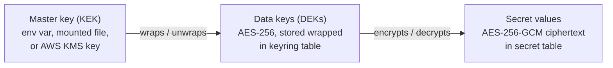

- **Master key (key-encryption key, KEK)** sources, chosen by `BEFIVE_MASTER_KEY_SOURCE`:
  - `env`: `BEFIVE_MASTER_KEY` holds 32 random bytes, base64. Suitable when the orchestrator injects it from a secret store (ECS `secrets` from Secrets Manager).
  - `file`: `BEFIVE_MASTER_KEY_FILE` (default `/run/secrets/befive-master-key`), for Docker/Kubernetes secrets.
  - `aws-kms`: `BEFIVE_KMS_KEY_ARN`. DEKs are generated with KMS `GenerateDataKey` and stored as KMS ciphertext; each node calls KMS `Decrypt` once per DEK at startup. The master key never leaves KMS. Recommended on AWS.
- **Data keys (DEKs):** AES-256 keys stored wrapped in `keyring` (with `env`/`file` sources, wrapped with AES-256-GCM under the KEK; with KMS, as KMS ciphertext). One DEK is `active` for new encryptions; older ones are `decrypt-only`.
- **Secret values:** AES-256-GCM with a random 96-bit nonce per encryption and **associated data** `"secret:" + name + ":" + version`, which binds each ciphertext to its row so ciphertexts cannot be swapped between secrets. Stored format: `{"v":1,"dek":"dek-3","nonce":"...","ct":"..."}` (bytes base64).
- **Where decryption happens:** in the control plane when validating (for example, that a private key matches a certificate) and when an integration calls ServiceNow, an LLM provider, an SMTP relay, or a webhook (the secret is resolved per call from the keyring and kept only in the client's token cache), and in the gateway compiler when building a RouteTable. Plaintext lives only in memory, in the objects that need it (`SslContext`, HMAC keys, introspection client secrets), never in logs, API responses, exports, or the LKG file.
- **Rotation:**
  - *DEK rotation* (`POST /keyring/rotate`, also scheduled every 90 days by default): create a new active DEK; a background job re-encrypts all secrets under it in batches (each re-encryption is a config write, so gateways pick up the new ciphertext through the normal revision flow); when no secret references the old DEK it becomes `retired`.
  - *KEK rotation:* set the new master key alongside the old one (`BEFIVE_MASTER_KEY_PREVIOUS` / previous file / previous KMS ARN), restart the control plane, trigger rewrap (DEKs are re-wrapped under the new KEK; secret values are untouched), then remove the old key from all nodes. With KMS, automatic KMS key rotation needs no action at all.
- **First run:** the control plane creates the first DEK and the API-key pepper. If no master key is configured, the control plane refuses to start in production mode and, in evaluation mode (`BEFIVE_EVAL=true`), generates a master key into `/var/lib/befive/master.key` with a loud warning.
- The `/keyring` endpoint and the console's "Secrets key status" panel show the master-key source, DEK IDs and ages, and re-encryption progress, never key material.

### 18.3 TLS defaults

- Protocols: TLS 1.3 and TLS 1.2 only. TLS 1.2 cipher suites restricted to ECDHE key exchange with AES-GCM or ChaCha20-Poly1305. No RSA key exchange, no CBC suites, no renegotiation.
- Provider: the JDK TLS provider in the MVP (fewer native components in the image). Netty's BoringSSL (`netty-tcnative`) is evaluated during performance hardening and may become an opt-in setting (open question).
- Certificates: RSA 2048+ or ECDSA P-256/P-384. The control plane rejects uploads with expired certificates, keys that do not match, or weak keys, and warns 30 days before expiry (console banner, audit event, `CertificateDaysToExpiry` metric).
- The admin port (9000) uses TLS when a certificate is configured for it; behind an internal ALB it may run plain HTTP inside the VPC. The console sets `Strict-Transport-Security` when served over HTTPS.
- Upstream TLS verification on by default (8.1).

### 18.4 Admin session security

- Session cookie `__Host-befive_session`: 256-bit random value, `Secure`, `HttpOnly`, `SameSite=Strict`, `Path=/`. The database stores only its SHA-256.
- Idle timeout 30 minutes, absolute lifetime 12 hours (both configurable within limits); session ID rotated at login; logout deletes the server-side session.
- CSRF: `SameSite=Strict` plus a per-session CSRF token that the console sends in `X-CSRF-Token` on every mutating request.
- OIDC: authorization code with PKCE (S256), `state` and `nonce` checked, ID token validated with the same JWT rules as 9.2; tokens from the IdP are not stored beyond the login transaction (no refresh tokens are kept).
- Local accounts: Argon2id password hashes (buddy-hashers), minimum 12 characters with a breach-list check against a bundled top-100,000 list (no online calls), lockout for 15 minutes after 10 failed attempts, login attempts audited. Local accounts are intended for first-run and break-glass use; an Administrator can disable local sign-in once SSO works (a single designated break-glass account can remain enabled). TOTP for local accounts is an open question.
- **First run:** until the first administrator exists, the only reachable console page is `/setup`, and it requires a one-time **bootstrap token** printed once to stdout at first start (or supplied as `BEFIVE_BOOTSTRAP_TOKEN`). This prevents whoever reaches the port first from claiming the installation. The token is invalidated when the first administrator is created.
- **Portal sessions** follow the same rules with a separate cookie (`__Host-befive_portal`, `SameSite=Lax` for the OIDC return), 60-minute idle and 12-hour absolute limits, and their own CSRF token (25.3).
- Security headers on console responses: strict `Content-Security-Policy` (`default-src 'self'`, no inline scripts; Ant Design's runtime styles use a per-response nonce), `X-Content-Type-Options: nosniff`, `Referrer-Policy: same-origin`, `frame-ancestors 'none'`.
- API tokens cannot use the session endpoints, and session cookies are not accepted by `/admin/v1` routes that are marked automation-only (none in the MVP); both principals go through the same RBAC.

### 18.5 SSRF (server-side request forgery) considerations

Outbound requests whose URLs come from configuration: JWKS, discovery and introspection URLs (IdPs), health-check probes, the IdP test connection, the route tester, plugin `api/http-client` calls, and the anomaly-response integrations (ServiceNow instance URLs, LLM endpoints, Slack and Teams webhook URLs, generic webhooks, the SNS signing-certificate fetch). Upstream targets themselves are the product's purpose and are not restricted, but they are writable only by Operators and Administrators.

The shared `befive.core.http/safe-client` enforces, for IdP URLs, tests, and plugin calls:
- `https` only (plain `http` only to hosts on an explicit allow-list, for development IdPs).
- DNS resolution by the client, then an IP check **on the resolved address used for the connection** (no second lookup, which defeats DNS rebinding): deny loopback, link-local (including `169.254.169.254` and `fd00:ec2::254`, the EC2 instance metadata service addresses), unique-local and private ranges unless allow-listed (`settings :security :outbound-allow-cidrs`), multicast, and unspecified addresses.
- No redirects for JWKS, introspection, and integration calls; at most 3 same-host redirects for discovery.
- Integration URLs are validated when saved and again on every call (the resolved address can change). A self-hosted LLM or an on-premises webhook receiver on a private address needs an explicit outbound allow-list entry; the connection test names the exact CIDR to add. SMTP connections are checked against the same address rules.
- Response size caps (1 MiB) and timeouts (5 s).

Health checks use the upstream's own target list (already trusted configuration) and are not subject to the private-range rule (targets are usually private).

**Draft 4 outbound paths.**

| Path | Rule |
|---|---|
| OpenAPI URL import (26.2) | `safe-client`, HTTPS, 10 MiB cap while streaming, no redirects to other hosts; remote `$ref`s disabled entirely. |
| ServiceNow requests, Okta Management API, workflow webhooks (24) | `safe-client` like other integrations; Okta domain must match the configured Okta preset. |
| Client job callbacks (30.6) | Only pre-registered HTTPS URLs that passed a verification challenge; resolved address checked on every delivery; private ranges denied unless allow-listed. |
| Backend dispatch (30.4) | Uses configured upstreams (trusted configuration), like proxying. |
| Try-it (25.7) | Only to the configured Sandbox gateway base URL (allow-listed explicitly), paths from the operation template with encoded parameters. |
| Lambda, SQS, S3, Cloud Map (8.10, 8.11, 30) | AWS SDK to AWS or VPC endpoints; custom endpoint overrides validated like integration URLs. |
| Kubernetes discovery (8.11) | Only the in-cluster API server address from the service-account environment. |
| Linked environments (34.2) | Only registered link base URLs; signatures required both ways. |
| Composite steps (28.5) | Only in-process operations or configured upstream bases; templates cannot change the host. |

### 18.6 Supply chain

- Dependencies pinned to exact versions in `deps.edn` and `package.json` lockfile for the console; weekly dependency report (antq, npm audit) in CI.
- **SBOM:** CycloneDX SBOMs for the uberjar (from the resolved dependency tree) and for the image (Syft); published with each release and shipped in the offline kit.
- **Scanning:** Trivy (or Grype) on every image build; builds fail on fixable critical vulnerabilities; results published with the release.
- **Signing:** images signed with cosign using a key-pair (not keyless, so air-gapped customers can verify offline with the published public key), plus an SLSA provenance attestation. CLI binaries and tarballs have SHA-256 checksums signed with the same key.
- **Base image:** minimal glibc image, `jlink` runtime, non-root UID 10001, no shell in the production image variant (a `-debug` variant with a shell is published for troubleshooting), read-only root filesystem supported.
- **Reproducibility:** builds are pinned to a Clojure CLI and Node version; exact byte-for-byte reproducibility is a goal, not a promise, for the MVP.

---

## 19. Licensing

### 19.1 Policy: perpetual use, updates gated by build date

- A license grants **perpetual use** of any product build released **on or before** the license's `maintenance-expires` date.
- Each build embeds its **build date** (release date) in the uberjar manifest.
- At startup: if `build-date <= maintenance-expires`, the build is covered. Time passing never stops a covered build: the check does not compare against the current clock, so an install keeps running indefinitely, offline, even with a wrong system clock.
- Installing a **newer build released after maintenance expired** is not covered. That build refuses to start the gateway role and tells the operator exactly why (build date, maintenance end, and how to renew). Because this happens at startup, a rolling deployment of an uncovered build fails its first new task's readiness check while existing tasks keep serving; nothing already running is interrupted. The control-plane role of an uncovered build starts in *license-only mode* (console shows only the license upload page), so the operator can install a renewed license without rolling back.
- Renewal produces a new license file with a later `maintenance-expires`; installing it (API, console, or file mount) takes effect immediately.

### 19.2 File format

A license file is a small JSON document so that the sales tooling (and any customer script) can read it without Clojure:

```json
{
  "format": 1,
  "key-id": "lic-2026-a",
  "payload": "eyJsaWNlbnNlLWlkIjoiTElDLTIwMjYtMDAxNDIiLCJjdXN0b21lciI6ey...",
  "signature": "kQ3m8f9x0Zr1...base64url Ed25519 signature over the payload bytes..."
}
```

`payload` is base64url of UTF-8 JSON; the signature is over those exact bytes (no canonicalization problems). Decoded payload:

```json
{
  "license-id": "LIC-2026-00142",
  "customer": {"name": "Example Corp", "id": "CUST-0091"},
  "edition": "enterprise",
  "type": "perpetual",
  "issued-at": "2026-10-01",
  "maintenance-expires": "2027-09-30",
  "max-gateway-nodes": 12,
  "environments": ["production", "non-production"],
  "features": ["redis-rate-limiting", "custom-plugins", "okta-preset", "aws-recipe"],
  "notes": "PO 4500123"
}
```

(Illustrative values.) `max-gateway-nodes` is optional (absent means unlimited). `type` is `perpetual` or `trial`; trial licenses add `use-expires`.

### 19.3 Verification

- The product embeds a set of Ed25519 public keys by `key-id`, so the vendor can rotate signing keys; retired keys stay embedded for verification of old licenses.
- Verification uses the JDK's built-in `Signature.getInstance("Ed25519")`. No network access, ever.
- License sources, in order: the `license` table (installed through the API or console), then `BEFIVE_LICENSE_FILE`. The newest valid license wins.
- Checked at startup and whenever a license is installed. The result is exposed at `/admin/v1/license` and in each node's heartbeat.

### 19.4 Behavior by situation

| Situation | Data plane | Control plane |
|---|---|---|
| Valid, build covered | Normal | Normal |
| Maintenance expires (time passes) on a covered build | **Normal, forever** | Informational notice 60 days before and after maintenance end: "updates released after <date> will need a renewal" |
| Uncovered build (released after maintenance expiry) | Refuses to start, exit code 78 with a clear message | License-only mode |
| More live gateway nodes than `max-gateway-nodes` | **Keeps serving** (never break traffic) | Warning banner, audit event, `license_status = over-limit` in heartbeat |
| No license (evaluation mode) | Serves normally, limited to 1 gateway node (additional nodes stay not-ready with a log message) | Banner "Evaluation - unlicensed"; all features enabled |
| Trial license past `use-expires` | Keeps serving | Read-only: configuration changes rejected with `403 license` until a license is installed |
| Tampered or invalid license file | Treated as no license (evaluation limits), logged as an error | Banner with the verification error |

This keeps the commercial promise simple for buyers: nothing that runs today stops running because of the license, and the only thing a lapsed maintenance contract gates is running newer builds.

---

## 20. Performance approach

### 20.1 Targets and budgets

Targets from doc 1 (to be tested against, not measurements):
- Added gateway latency p99 **< 5 ms** for a JWT-authenticated route with a warm cache.
- **≥ 10,000 requests/s per node** on 4 vCPUs for small payloads.
- Configuration visible on all nodes **within 5 s**.

Budget for the gateway's own work on a warm JWT request (targets for component benchmarks, p99, 4 vCPU at 10,000 requests/s):

| Stage | Budget |
|---|---|
| Netty decode, pipeline setup, request-ID, client-IP, IP filter, CORS, limits | 0.3 ms |
| Route match (host map + reitit + candidates) | 0.05 ms |
| JWT parse and signature verification (RS256/ES256, key cached) | 0.3 ms |
| Consumer lookup, policy evaluation | 0.05 ms |
| Rate limit: local / Redis same-AZ | 0.02 ms / 1.0 ms |
| Request transform, upstream pool checkout, header writing | 0.3 ms |
| Response path: transforms, header copy, metrics, usage, and signal aggregator updates, sampling decision, access-log enqueue | 0.2 ms |
| Draft 4: strip-inbound and effective IP set lookup | 0.005 ms |
| Draft 4: internal JWT minting (Ed25519), when enabled; ~0 with reuse hits | 0.1 ms |
| Draft 4: request validation, when enabled (bodies under 64 KiB) | 0.2 ms |
| Draft 4: cache lookup (L1 hit, including AES-GCM decrypt of ≤ 64 KiB); the upstream call is skipped | < 1 ms total request p99 target |
| Draft 4: composite in-process step dispatch (excluding the target's own work) | 0.05 ms per step |
| Draft 4: OpenTelemetry spans, when tracing is enabled | 0.005 ms per span |
| Headroom for GC pauses, scheduling, TLS record processing | remainder up to 5 ms |

### 20.2 Hot-path engineering rules

- No blocking calls on event-loop threads, verified by BlockHound-style checks in tests (Netty's `BlockingOperationDetector` approach via an agent in the test profile).
- No reflection (`*warn-on-reflection*` errors), primitive math where it matters, type-hinted Java interop.
- Precompute everything per revision: header-name lowercasing, policy closures, interceptor vectors, template strings.
- Avoid per-request allocation of large structures: case-insensitive header map wraps Netty `HttpHeaders` instead of copying into a Clojure map; context is a record for fixed keys plus a map for extensions.
- Access log: build a compact map on the event loop (only for kept lines), serialize on the writer thread. Aggregators: preallocated counters and histogram arrays, atomic increments only, no allocation per request except a new usage key.
- JSON only where needed (jsonista with a preconfigured `ObjectMapper`).

### 20.3 JVM settings (defaults in the image)

```
-XX:+UseZGC -XX:+ZGenerational          # low-pause generational ZGC (Java 21)
-XX:MaxRAMPercentage=70                 # leave room for Netty direct memory and metaspace
-XX:MaxDirectMemorySize=1g              # bounded pooled ByteBufs (scaled by task memory in docs)
-XX:+ExitOnOutOfMemoryError             # let the orchestrator replace the task
-XX:+AlwaysPreTouch                     # predictable latency after start
-Dio.netty.allocator.type=pooled
-Dio.netty.leakDetection.level=disabled # (paranoid in CI)
-Djdk.tracePinnedThreads=short          # (test profile only) detect virtual-thread pinning
-Xlog:gc*:stderr:time,level,tags        # GC logs as app log lines (JSON-wrapped by the shipper)
```

Container sizing guidance (to be confirmed by benchmarks): 4 vCPU / 8 GiB for gateway nodes, 1 vCPU / 2 GiB for control planes. `BEFIVE_JAVA_OPTS` appends or overrides.

### 20.4 Virtual threads (off the hot path only)

Virtual threads run: the PostgreSQL LISTEN loop and poller, snapshot fetch and compile, LKG writes, heartbeat and metrics flush, the signal shipper, quota flush, Admin API handlers (Aleph handler executor for the control plane), the usage-report task, KMS calls, and on the control plane the signal merge, detectors, outbox workers, and integration calls. The data plane's request path never runs on virtual threads; it runs on Netty event loops with non-blocking I/O. pgjdbc 42.6+ avoids `synchronized` in hot paths (fewer pinning issues); the test profile logs pinned threads.

### 20.5 Benchmarking plan (k6)

- **Environment:** AWS, same AZ, dedicated instances: load generator (c7i.2xlarge), gateway (c7i.xlarge = 4 vCPU, to match the target), upstream (c7i.xlarge running a minimal Netty echo server that returns a fixed 1 KiB body), Redis (ElastiCache) for the Redis scenarios. Instance types are the plan; the report records exactly what was used.
- **Method:** k6 open model (`constant-arrival-rate` executor) to avoid coordinated omission; warm-up 2 minutes, measure 10 minutes; 3 runs per scenario; report p50, p90, p99, p99.9, max, error rate, gateway CPU and memory.
- **Added latency** = (latency through the gateway) − (latency direct to the upstream) at the same arrival rate, measured per percentile.
- **Scenarios:** (1) public route, no auth; (2) API key; (3) JWT warm cache (RS256); (4) JWT + local rate limit; (5) JWT + Redis rate limit; (6) TLS termination with HTTP/2 clients; (7) 64 KiB and 1 MiB streaming bodies; (8) WebSocket connection churn; (9) config churn: an `apply` every 5 s during load, asserting zero errors and propagation under 5 s; (10) 2-hour soak at 70% of max throughput, checking memory and latency drift; (11) upstream failure: kill a target during load, measure errors until passive ejection; (12) scenario 3 with 2,000 routes, signal shipping, and 50 active runtime overrides, asserting the same latency budget; (13) control-plane detection at scale: 20 simulated nodes, 2,000 routes, 10,000 consumers, measuring merge and evaluation time per minute; Draft 4: (14) scenario 3 with 2,000 operations from OpenAPI, a six-level policy hierarchy, and 50,000 subscriptions, asserting the same latency budget and the compile target; (15) cache hit ratio 90% at 64 KiB responses, measuring hit latency and memory; (16) composites with 4 parallel steps; (17) internal JWT on with and without reuse; (18) all sinks enabled (EMF, DogStatsD, OTLP traces at 5%, Prometheus scrape) compared with EMF only; (19) Lambda upstream through LocalStack for functional load and a real AWS account for latency; (20) portal search at 2,000 APIs and 50,000 operations.
- **Throughput test:** increase arrival rate in steps until p99 added latency exceeds 5 ms or errors exceed 0.1%; that rate is the node's measured capacity.
- k6 scripts, the echo server, and a results template live in `perf/`; results are published per release as measurements with the exact setup.

---

## 21. Upgrades, migrations, and compatibility

### 21.1 Database migrations

- Migratus SQL migrations in `control-plane/resources/migrations`, numbered by timestamp, **run only by the control plane** under a PostgreSQL advisory lock (so two control planes starting together do not race). `BEFIVE_MIGRATE_ON_START=false` lets DBAs run `java -jar befive.jar migrate` explicitly.
- **Expand/contract policy:** a release's migrations must keep working for the previous minor release's gateway nodes and control plane. Additive changes (new tables, new nullable columns, new indexes created `CONCURRENTLY`) ship immediately; destructive changes (drop, rename, type narrowing) ship at least one minor release after the code stops using the old shape.
- Down migrations are written for development, but production rollback is by restoring the database backup taken before upgrade (documented), because down migrations can lose data.
- Every migration is tested against a production-sized synthetic dataset for lock duration in CI (fail if an exclusive lock is held over 1 s).

### 21.2 Rolling upgrades with mixed versions

Supported upgrade order: **control plane first** (runs migrations), **then gateway nodes rolling**. Guarantees:
- Gateway nodes of version N−1 work against a database migrated to N and a control plane of version N.
- Mixed N−1 and N gateway nodes serve traffic concurrently during the roll.
- Skipping minor versions is supported for the database (migrations are sequential), but mixed-version clusters are supported only for adjacent minors.
- Downgrading the control plane is not supported after migrations ran; downgrading gateway nodes to N−1 is supported while the cluster has not yet used N-only features (below).

### 21.3 Config schema versioning and feature levels

- Documents carry no per-document version; the schema is additive within config format 1 (`:befive/format 1` in files, `:snapshot/format 1` in snapshots). New optional fields and new enum values are the only allowed changes within a format.
- Each release has an integer **feature level**. Every schema addition is tagged with the feature level that introduced it (a malli property `{:befive/since 3}`).
- Nodes report their feature level in the heartbeat; the control plane computes the **cluster feature level** as the minimum over live gateway nodes. A write that uses a field or enum value newer than the cluster feature level is rejected with `409 cluster-upgrade-in-progress`, naming the old nodes. This matters for security: an old node that ignored a new policy predicate could allow what the admin meant to deny. Old nodes therefore never receive configuration they cannot enforce.
- Gateway snapshot readers reject unknown keys in security-relevant positions (authn, access, policies) as a second line of defense, and tolerate them elsewhere.
- Runtime overrides are a new gateway-consumed kind, so they are tagged with the feature level that introduced them. While any live gateway is older, traffic actions are recorded as `denied` ("cluster upgrade in progress") rather than applied, because an old node would silently ignore them.
- **Draft 4 kinds and fields** (APIs and operations, policy attachments and locks, claims operators, cache, validation, composites, Lambda and discovered upstreams, async endpoints, internal JWT, new rate-limit dimensions) carry the 1.0 feature level. A 0.x gateway never receives them: writes are rejected with `409 cluster-upgrade-in-progress` until every gateway runs 1.0. Locks and claims operators are security-relevant positions, so an older node rejects a snapshot containing them rather than ignoring them. Promotions check the target's cluster feature level before validation (34.6).

### 21.4 Compatibility promises (within major version 1)

| Surface | Promise |
|---|---|
| Admin API `/admin/v1` | Additive changes only; no removal or renaming of fields or endpoints; new enum values may appear (clients must tolerate unknown values). |
| Config files (`:befive/format 1`) and DSL | Any file valid for 1.x release R stays valid for all later 1.x releases. |
| Access log `befive.access/1`, metric lines `befive.metrics/1`, usage lines `befive.usage/1`, audit `befive.audit/1`, EMF metric names | Fields and metric names never removed or renamed; new fields may be added. The recipe generated by release R keeps working with later 1.x gateways. |
| Plugin SPI 1 | Plugins built for SPI 1.x run on all releases supporting SPI 1 (17.4). |
| Signal payload `befive.signals/1` | Internal, but versioned: a control plane reads payloads from gateways one minor version older, and gateways only add fields. |
| Detectors, response rules, scripts (`befive.script` API) | Documents valid in release R stay valid in later 1.x releases; helper functions in `befive.script` are never removed within version 1. |
| CLI | Command names, flags, and exit codes stable; new flags may be added. |
| License files | Format 1 files verify on all future releases. |
| Deprecations | Announced in release notes at least two minor releases before removal in the next major. |

---

## 22. Testing strategy

| Component | Tests | Tools |
|---|---|---|
| `schema` (cljc) | Unit tests for every schema, run on JVM and in Node (ClojureScript) to guarantee identical validation; generative tests: generated valid documents round-trip through JSON, EDN, and Transit unchanged; diff engine properties (diff of A→B applied to A equals B; normalization is idempotent) | Kaocha, test.check, malli generators, shadow-cljs node test target |
| Compiler | Property: delta-merge equals full-load for random change sequences; route-matching oracle test (a slow reference matcher compared against the compiled router over generated routes and requests); compile time on 2,000 routes | test.check, criterium |
| Pipeline executor | Phase order, short-circuit and error semantics, sync/async mixing, no blocking on event loop | Kaocha, blocking-detection agent |
| Proxy | Integration against real upstream servers: streaming both ways with slow readers (backpressure), timeouts, retries (idempotent only, budget), health checks and ejection, WebSocket splice, HTTP/2 client to HTTP/1.1 upstream, hop-by-hop removal, request-smuggling cases; `ByteBuf` leak detection at PARANOID | Kaocha, Testcontainers, Netty ResourceLeakDetector |
| AuthN | JWT: test vectors for every algorithm, `alg=none`, HMAC confusion, wrong `kid`, rotation (new kid appears), JWKS outage with stale serving, clock skew edges, `aud` array/string; introspection: caching, negative cache bounds, circuit breaker; API keys: rotation grace, two-key limit, constant-time compare; mTLS mapping | Mock OIDC provider in Testcontainers (e.g. a small Clojure mock issuer), Nimbus to mint tokens |
| Okta preset | End-to-end against a real Okta developer tenant (discovery, JWKS, groups claim, introspection) in a nightly job with secrets held in CI | Okta developer tenant |
| AuthZ | Table-driven tests per predicate; property: `[:not p]` never allows anonymous; 401 vs 403 selection | test.check |
| Rate limiting | Local accuracy; Redis accuracy with 3 simulated nodes; fail-open and fail-closed on Redis kill; monthly quota boundary (month rollover, leap years) with an injectable clock | Testcontainers Redis, Toxiproxy |
| Config sync | NOTIFY path, poll fallback with LISTEN broken, gap handling after retention pruning, DB outage with LKG startup, compile failure keeps old revision | Testcontainers PostgreSQL, Toxiproxy |
| Control plane | Every endpoint: RBAC matrix as data-driven tests (every role × every endpoint), ETag/If-Match, pagination, problem details, audit event written for every mutation, hash-chain verification, OpenAPI backward-compatibility diff | Kaocha, oasdiff |
| Migrations | Up on empty DB; up from each previous release's schema with data; lock-duration check | Testcontainers PostgreSQL |
| Observability | Access-log, usage, and metric line conformance (every line validates against its catalog); EMF documents validate against the EMF JSON schema and stay under 100 values per array; property: summed route and usage summaries equal the per-request ground truth for random traffic, in both modes and across interval boundaries and shutdown; histogram expansion keeps every value within 1% and preserves counts below the cap; sampling determinism (same trace ID gives the same decision on every node, matches reference OpenTelemetry threshold vectors) and Horvitz–Thompson estimates within statistical bounds; always-keep rules, keep budget, and force-log allow-list; redaction canary tests across all failure paths | malli, JSON schema validator, test.check |
| AWS recipe | Generated Terraform passes `terraform validate`; CloudFormation passes `cfn-lint`; queries only reference catalog fields; a nightly job deploys the recipe to a sandbox account and runs each saved query against real logs | Terraform, cfn-lint, AWS sandbox |
| CLI | Golden-file tests for validate/diff/apply output; native binary smoke tests on each OS in CI | Kaocha, GraalVM |
| Plugins | Example plugins load from JAR and directory; API-version refusal; namespace conflict detection; exception isolation | Kaocha |
| Licensing | Signature verification (valid, tampered, unknown key ID), build-date coverage matrix, evaluation limits, trial expiry behavior | Kaocha |
| Signal shipping and merge | Property: merged `signal_minute` values equal the per-request ground truth for random traffic across nodes, interval sizes, and shutdowns; Space-Saving sketches always contain every IP above N/k with counts within the error bound, including after per-thread and cross-node merges; payload caps; PostgreSQL outage buffering and drop accounting | test.check, Testcontainers PostgreSQL, Toxiproxy |
| Detectors and lifecycle (`anomaly`, cljc) | Unit tests per detector kind on hand-built series; properties: hysteresis never flaps for series oscillating inside the recovery band, dedupe keeps one anomaly per key, no `resolved` without `open`, grouping is deterministic and order-independent within a minute, silences suppress actions but not records; warm-up transitions; DST slot alignment; partial minutes never trigger drop or absence detectors | Kaocha, test.check (JVM and Node) |
| **Replay and simulation harness** | `befive.anomaly.replay` runs detectors, lifecycle, grouping, and rules in dry-run over recorded signals; a library of labeled datasets (recorded from test environments and synthesized): deployment-induced 5xx, JWKS rotation failure, credential stuffing from one IP and from many, upstream flapping, slow latency creep, holiday traffic, month-end batch, DST change, node loss. CI gates on precision, recall, and median detection delay per dataset against committed baselines, so detector changes cannot silently get noisier or slower. The same harness backs `b5ctl anomaly replay` and the console's simulate feature | Kaocha, recorded EDN datasets |
| Response rules and scripts | Rule matching tables; idempotency keys stable across re-evaluation; script outputs validated; timeouts kill and respawn runners; failure fallback to declarative actions; automatic suspension after 5 failures | Kaocha |
| Sandbox escape | Corpus of escape and abuse attempts (Java interop, `Class/forName`, `clojure.lang.RT`, `eval`, `load-string`, `resolve` tricks, `slurp`, `future`, reader tags, infinite loops, deep recursion, huge allocations, huge outputs); each must be rejected at compile time or killed within limits; fuzzing of script sources | Kaocha, native runner in CI |
| Safety rails and overrides | Properties: no generated sequence of actions exceeds concurrency, rate, scope, or duration limits; protected networks, consumers, and routes are never affected; approval expiry; gateways stop enforcing expired overrides with PostgreSQL and the control plane stopped; feature-level gating | test.check, Testcontainers, Toxiproxy |
| Outbox and integrations | Mock ServiceNow (token expiry, `401` refresh, `429` with `Retry-After`, `5xx`, timeouts after commit with dedupe through `correlation_id`, human-resolved and closed incidents, Event Management payloads); mock LLM providers (1.1: valid output, schema violations with one repair retry, timeouts, budget exhaustion); Slack, Teams (1.1), SMTP (GreenMail; approvals and reports in 1.0), and webhook mocks; worker crash between send and record; nightly end-to-end run against a ServiceNow developer instance | Kaocha, Testcontainers, GreenMail, ServiceNow PDI |
| LLM redaction and injection (1.1) | Canary secrets, tokens, emails, and IPs planted in configuration diffs, error codes, and exemplars never appear in bundles; prompt-injection corpus in paths and errors never produces actions and is rendered inert in console, ServiceNow, chat, and email outputs | Kaocha |
| Policy hierarchy (Draft 4) | Property tests of 23.7: lock monotonicity, most-specific-wins, order independence, validator soundness (clamp is a no-op), naive oracle, delta equals full; golden effective-policy JSON | test.check |
| Claims language, internal JWT, IdP outage (Draft 4) | Compiled-versus-interpreted generative tests; RE2J pathological inputs; JWT mint and verify with Nimbus and Node `jose`, rotation timeline; IdP outage across restarts with Toxiproxy (9.10 to 9.12, 10.5) | test.check, Toxiproxy, Node |
| Access workflow and Okta apps (Draft 4) | State-machine properties, separation of duties, ServiceNow mock and nightly PDI run with the shipped flow script, webhook signature and replay tests, Okta Management API mock and nightly developer-org run (24.9) | Kaocha, ServiceNow PDI, Okta developer org |
| Portal (Draft 4) | Visibility and facet-leakage properties, CSP and sanitizer XSS corpus, OIDC with a mock IdP and Okta nightly, try-it limits, preview-mode route absence (25.8) | test.check, Playwright |
| OpenAPI pipeline (Draft 4) | Corpus of public specs: parse, map, diff, export round trip, mock generation, dictionary walk; remote `$ref` rejection (26) | Kaocha, golden files |
| Cache, composites, async (Draft 4) | Partition isolation property; RFC 9111 subset; purge propagation with NOTIFY dropped; composite cancellation and leak checks; async dispatch, retention, presigned expiry, authorization properties (28 to 30) | test.check, LocalStack, MinIO |
| Lambda and discovery (Draft 4) | LocalStack Lambda event conformance and errors; k3s EndpointSlice watch and relist; Cloud Map; DNS SRV; Netty dependency-convergence check in CI (8.10, 8.11) | Testcontainers (LocalStack, k3s), CI check |
| Telemetry sinks (Draft 4) | Sink agreement (all sinks equal EMF sums); Datadog Agent container intake; OTel collector; `promtool check metrics`; cardinality guard; Datadog recipe `terraform validate` (31.7) | Testcontainers (Datadog Agent, OTel collector), promtool, Terraform |
| Reporting, InfoSec, promotion (Draft 4) | Rollup sums equal aggregator totals; histogram quantile accuracy; query-model validation; evidence tamper tests; multi-cluster promotion with tampered bundles and replay (32 to 34) | test.check, Testcontainers |
| Console | Unit tests for re-frame events and subscriptions; component tests; end-to-end flows (first-run, onboard API, issue key, anomaly to ServiceNow incident with a mock ServiceNow, write and dry-run a script) against a running `all` container | shadow-cljs test, Playwright |
| Performance | Section 20.5, run before each release and nightly at reduced scale for regressions | k6 |
| Security | Dependency and image scanning; OWASP ZAP baseline scan of the console and Admin API; annual external penetration test before GA | Trivy, ZAP |

---

## 23. Policy hierarchy and effective policy resolution (Draft 4)

This chapter covers POL-001 and POL-002 (doc 1, 2.4). Policies can be attached at six levels and inherited downward. Higher levels can lock them, and the compiler resolves one effective policy per operation at compile time, so the hierarchy adds nothing to the request path.

### 23.1 Levels

| Order | Level | Scope | Where it lives |
|---|---|---|---|
| 1 | Global | Every route in every environment that receives the configuration | Promoted configuration (34) |
| 2 | Environment | Every route in this environment | Environment overlay (34.4), never promoted |
| 2a | Classification defaults | Every API, version, or operation with that level | Classification settings (24.1), injected at the level that declares the classification |
| 3 | API | All versions of the API | `policy_attachment` with scope `api` |
| 4 | Version | All operations of the version | scope `version` |
| 5 | Path | Operations of the version whose path starts with a prefix, for example `/admin` | scope `path` (prefix match on the normalized template, segment boundaries only) |
| 6 | Operation | One operation | scope `operation`, or the operation document's own fields |

Classification defaults are not a separate level in the user's mental model. They behave as if the attachments were placed at the level where the classification is declared. For example, an API marked Restricted gets the Restricted defaults as API-level attachments with their own lock flags. An operation marked Restricted inside an Internal API gets them at operation level. Hand-written routes (5.3) resolve global, environment, then the route's own fields (6.9).

### 23.2 Attachments and locks

```clojure
{:id "pa_01J9K..."                                        ; server-generated
 :scope {:level :api :api "payments"}                     ; or {:level :path :api "payments" :version "v2" :prefix "/admin"}
 :kind :ip                                                ; 23.3
 :value {:allow ["10.0.0.0/8" "172.16.0.0/12"] :deny []}
 :locked true                                             ; lower levels may only tighten
 :reason "Payments is internal-only (InfoSec standard 4.2)"   ; shown in lock violation messages
 :meta {:labels {"owner" "platform"}}}
```

```sql
CREATE TABLE policy_attachment (
  id           text PRIMARY KEY,
  level        text NOT NULL CHECK (level IN ('global','environment','api','version','path','operation')),
  api_id       text, version_id text, path_prefix text, operation_id text,
  kind         text NOT NULL,
  locked       boolean NOT NULL DEFAULT false,
  doc          jsonb NOT NULL,
  version      bigint NOT NULL, revision bigint NOT NULL,
  CHECK ((level IN ('global','environment')) = (api_id IS NULL)),
  UNIQUE NULLS NOT DISTINCT (level, api_id, version_id, path_prefix, operation_id, kind)
);
CREATE INDEX policy_attachment_api ON policy_attachment (api_id, version_id);
```

There is at most one attachment per (scope, kind). Operation-level values can also be written inline in the operation document (`:authn`, `:access`, `:rate-limits`, and so on). That is the same thing as an operation-level attachment, and validation rejects having both. Environment-level attachments are stored in `env_overlay` (34.4) so they never travel in bundles.

**Who may attach and lock** (15.6). Global attachments and global locks require Administrator. Operators may attach policies and set locks at environment level and below. API Owners may attach **unlocked** policies at API, version, path, and operation level for their own APIs, within existing locks, including caching policies; they cannot set or remove locks. Changing classification defaults requires Administrator.

### 23.3 Policy kinds and their strength order

Each kind is a map of fields. Each field has a **merge rule** (how a lower level's value combines with the inherited value) and a **strength order** (which values count as tighter). Locks are checked per field.

| Kind | Fields | Merge rule | Stronger means |
|---|---|---|---|
| `:security` | `:authn` (methods, mode), `:access` (rule tree or policy reference), `:idp-failure-mode` (9.12), `:forward-token`, `:internal-jwt` | most specific wins; locked `:access` is conjoined | `:authn`: required ⊃ optional, `:all` ⊃ `:any`, a subset of methods; `:access`: logical conjunction with the locked rule; `:fail-closed` > `:fail-open-for-cached`; `:forward-token false` > `true` |
| `:ip` | `:allow` CIDR set, `:deny` CIDR set | allow lists intersect when locked, otherwise most specific wins; deny lists union | smaller allow set (address-set inclusion), larger deny set |
| `:rate-limit` | vector of limits (11.6) | union (all apply); a locked limit cannot be removed | a lower rate or capacity for the same limit ID |
| `:logging` | `:bodies` (`:off`/`:redacted`/`:on`), `:redact-fields`, `:sampling` overrides, `:force-log` | most specific wins; `:redact-fields` union | `:off` > `:redacted` > `:on`; more redacted fields |
| `:cache` | `:mode`, `:ttl-s`, `:vary`, `:honor-client-no-cache` | most specific wins | `:off` > `:per-user` > `:per-application` > `:public`; shorter TTL |
| `:limits` | the fields in 8.9 | most specific wins | lower values |
| `:deprecation` | `:deprecated-at`, `:sunset-at`, `:link` | most specific wins | not lockable (informational) |

Strength is a partial order per field, implemented as a `meet` function (the tighter of two values, or their combination) and a `<=` predicate. For example, the meet of two CIDR allow sets is their intersection, computed exactly with a small in-house range-set implementation (`befive.net.cidr`, sorted 128-bit ranges over `java.net.InetAddress` bytes; no new library). The meet of two access rules is `[:all a b]`.

### 23.4 Resolution algorithm

Resolution runs in the control plane at write time (for validation and previews) and in every gateway compile (6.9), using the same pure function `befive.policy.resolve/effective`:

```
effective(op):
  chain = [global, environment, classification-defaults@declaring-level..., api, version, paths sorted by prefix length, operation]
  result = {}                 ; field -> {:value v :source level+attachment-id :locked? bool :lock-source ...}
  for level in chain:                       ; least specific first
    for (kind, field, v) in attachments(level):
      cur = result[kind][field]
      if cur is nil:                 result[kind][field] = {v, source=level, locked=att.locked}
      elif not cur.locked:           result[kind][field] = merge-unlocked(kind, field, cur.value, v) with source=level,
                                                           locked = att.locked
      else:                                  ; inherited value is locked
        if not stronger-or-equal(kind, field, v, cur.value): violation(field, cur.lock-source, level)
        result[kind][field] = {meet(cur.value, v), source=level, locked=true, lock-source=cur.lock-source}
  require result[:security][:access] present            ; default deny, 10.2
  return result
```

- **Most specific wins** for unlocked fields, except for union-merged fields (rate limits, deny lists, redacted fields), which accumulate.
- **Locked fields** can only be tightened. A weaker lower value is a **validation error** at write time: `policy.lock_violation: operation payments/v2/refund sets :ip :allow to 0.0.0.0/0, but API payments locks :ip :allow (reason: "Payments is internal-only")`. Writes, imports, OpenAPI imports, and promotions all run the same validator.
- **Defense in depth.** The compiler applies `meet` even after validation passed. If an invalid configuration ever reaches a gateway, for example through a validator bug or an older control plane in a mixed-version upgrade, the effective value is still at least as strict as the lock. The clamp is logged at WARN with the field and both sources.
- **Locked access rules** are conjoined: a lower level's `:access` becomes `[:all locked-rule lower-rule]`, so a lower level can add conditions but never replace the locked rule.
- **Provenance.** Every effective field records its source level and attachment ID, and for locked fields also the lock source. Provenance is kept in the control plane's resolution result. Gateways keep only a compact source ID per field, for the route tester and debug logs.

**Cost.** Resolution is O(levels × fields) per operation, with memoization per (API, version, path prefix) for the shared upper part of the chain. Budget: 50 ms of the compile target for 2,000 operations (6.9). Expected cost is well below that, because most operations have only a few attachments.

### 23.5 IP rules at every level

The `:ip` kind (SEC-005) replaces route-level IP filters. Global and environment levels typically allow internal ranges for internal hosts. Classification defaults supply "internal ranges only" for Restricted (24.1). A named **IP set** (`ip_set` configuration kind: a reusable name for a list of CIDRs, for example `corp-egress`) can be referenced as `{:allow [#befive/ip-set "corp-egress"]}`. The effective allow set is compiled into one sorted range array per route and checked in slot 6 (7.4) with a binary search, both IPv4 and IPv6, against the client IP from 8.8. Runtime IP blocks from the anomaly engine (14.12) are separate runtime overrides and apply in addition. Denials return `403 ip.denied`, and the access log records the policy source.

### 23.6 Effective policy API and tooling

| Endpoint | Purpose |
|---|---|
| `GET /admin/v1/apis/{api}/versions/{v}/operations/{op}/effective-policy` | Effective policy with provenance for one operation |
| `GET /admin/v1/routes/{id}/effective-policy` | Same for hand-written routes and derived routes (by `op-` ID) |
| `GET /admin/v1/apis/{api}/effective-policy?version=v2` | All operations of a version, for the console matrix and the evidence export (33.3) |
| `POST /admin/v1/effective-policy/preview` | Body: a proposed change set (as for config diff). Returns the effective policy before and after for affected operations, and any lock violations. Used by the console editors, OpenAPI import (26.2), and promotion (34.5). |

Response shape (abbreviated):

```json
{"operation": "payments/v2/refund",
 "policy": {
   "ip": {"allow": {"value": ["10.0.0.0/8"], "source": {"level": "api", "attachment": "pa_01J9K"}, "locked": true,
                    "lockReason": "Payments is internal-only (InfoSec standard 4.2)"}},
   "security": {"access": {"value": ["all", ["scope", "payments:refund"], ["group", "payments-ops"]],
                           "source": {"level": "operation"}, "locked": true, "lockSource": {"level": "classification", "classification": "restricted"}}},
   "cache": {"mode": {"value": "off", "source": {"level": "classification", "classification": "restricted"}, "locked": true}}},
 "flags": ["forwards-credential"],
 "revision": 2211}
```

`flags` lists conditions the doc 1 requirements ask to make visible, such as a route that forwards a credential (doc 1, 2.5) or a public method. `b5ctl policy effective payments/v2/refund [--at-revision N] [--format table|json]` prints the same, and `b5ctl policy explain` adds the full chain per field.

### 23.7 Tests

Property tests (test.check) over generated hierarchies of up to 6 levels, random attachments of all kinds, and random lock flags:

1. **Lock monotonicity.** For every locked field, the effective value is stronger than or equal to the locked value, whatever lower levels contain.
2. **Most specific wins.** With no locks, the effective value of a last-wins field equals the most specific attachment's value.
3. **Order independence.** Permuting the attachment insertion order or the map order inside a level does not change the result.
4. **Validator soundness.** For every configuration the validator accepts, the compiler's clamp is a no-op. For every configuration it rejects, at least one field would have been clamped.
5. **Oracle.** The result equals a naive reference implementation that materializes every level's full policy and folds it.
6. **Delta equals full.** Resolution from a delta-merged model equals resolution from a full snapshot (extends the 6.3 test).

Example tests cover each kind's strength order, including IPv6 range intersection, and a golden-file test for the effective-policy JSON.

---

## 24. Classification and the access-request workflow (Draft 4)

This chapter covers SEC-003, SEC-004, GOV-4, and IAM-006 (doc 1, 2.6). Classification is data on APIs, versions, and operations. It feeds the policy hierarchy (23) and approval routing. Access requests turn a developer's portal request into a subscription and credentials, with approval either built in or through ServiceNow or another workflow system.

### 24.1 Classification model and default policies

Levels are a settings document (`:classification`, Administrator-only, promoted with configuration). Each level has an ordinal, so "raise" and "lower" are defined:

```clojure
{:classification
 {:levels [{:id "public"       :ordinal 0 :label "Public"}
           {:id "internal"     :ordinal 1 :label "Internal"}
           {:id "confidential" :ordinal 2 :label "Confidential"}
           {:id "restricted"   :ordinal 3 :label "Restricted"}]
  :default "internal"                                     ; for APIs without a classification
  :defaults                                               ; injected as attachments at the declaring level (23.1)
  {"confidential" [{:kind :cache   :value {:mode :per-application} :locked true}
                   {:kind :logging :value {:bodies :redacted} :locked true}]
   "restricted"   [{:kind :cache    :value {:mode :off} :locked true}
                   {:kind :ip       :value {:allow [#befive/ip-set "internal-ranges"]} :locked true}
                   {:kind :logging  :value {:bodies :off :redact-fields #{"*"}} :locked true}
                   {:kind :security :value {:access [:authenticated] :idp-failure-mode :fail-closed} :locked true}]}
  :approval-chains                                         ; 24.4
  {"public"       [:api-owner]
   "internal"     [:api-owner]
   "confidential" [:api-owner]
   "restricted"   [:api-owner {:group "infosec-approvers"}]}
  :portal {:request-allowed #{"public" "internal" "confidential" "restricted"}}}}
```

These are the shipped defaults described in doc 1, 2.6, and customers can edit them. The `internal-ranges` IP set ships empty and must be filled in before a Restricted API can be published: an empty locked allow set would deny everything, so validation flags it at publish time with `classification.ip_set_empty`.

**Rules.**
- **Who classifies.** Administrators edit levels and defaults (a dedicated console screen, 03). Operators and Administrators set an API's level; API Owners may propose a level for their own APIs, which an Operator or Administrator confirms (15.6).
- A version or operation may **raise** its API's classification, never lower it (5.6). The effective classification of an operation is the maximum along its chain.
- Data dictionary tags (26.8) add field-level effects independent of the operation's level. A response field tagged `pii` is redacted in body samples (12.4), and a response schema containing a field tagged `no-cache` makes the operation's cache mode `:off` unless an Administrator overrides it explicitly.
- Changing a level's defaults is a configuration change. Its effective-policy preview (23.6) lists every affected operation, and lock violations created by the change are reported before commit. Existing lower-level attachments that would now violate a new lock are listed for the Administrator to resolve. They are not auto-deleted.
- The access log and reports carry `classification` (12.2), and the catalog uses it as a facet (25.5).

### 24.2 Access-request entities

An access request asks for application × API version (× plan). Requests come from the portal (1.0) or from the Admin API, which Consumer Managers and integrations use.

```sql
CREATE TABLE access_request (
  id               text PRIMARY KEY,                -- 'ar_' || ULID
  application_id   text NOT NULL REFERENCES application(id),
  api_id           text NOT NULL, version_id text NOT NULL,
  plan_id          text,
  requested_by     text NOT NULL,                   -- portal_user id or admin user id
  justification    text NOT NULL CHECK (length(justification) <= 4000),
  classification   text NOT NULL,                   -- effective level at submission (frozen)
  state            text NOT NULL,
  route            text NOT NULL CHECK (route IN ('builtin','servicenow','webhook')),
  external_ref     jsonb,                           -- {"system":"servicenow","sys_id":"...","number":"RITM0012345"}
  okta             jsonb,                           -- 24.8 result: client_id, app id (never secrets)
  subscription_id  text,
  expires_at       timestamptz NOT NULL,            -- for pending states
  version          bigint NOT NULL,
  created_at timestamptz NOT NULL, updated_at timestamptz NOT NULL
);
CREATE UNIQUE INDEX access_request_open ON access_request (application_id, api_id, version_id)
  WHERE state IN ('submitted','pending-approval','pending-external','approved','provisioning');

CREATE TABLE approval_step (
  access_request_id text NOT NULL REFERENCES access_request(id),
  seq        int NOT NULL,
  approver   jsonb NOT NULL,                        -- {"kind":"api-owner"} | {"group":"infosec-approvers"} | {"user":"..."}
  state      text NOT NULL CHECK (state IN ('waiting','pending','approved','rejected','skipped')),
  decided_by text, decided_at timestamptz, comment text,
  PRIMARY KEY (access_request_id, seq)
);

CREATE TABLE access_request_event (                 -- append-only timeline; also audited (12.5)
  id bigserial PRIMARY KEY, access_request_id text NOT NULL, at timestamptz NOT NULL,
  kind text NOT NULL, actor jsonb NOT NULL, data jsonb NOT NULL
);
```

### 24.3 State machine

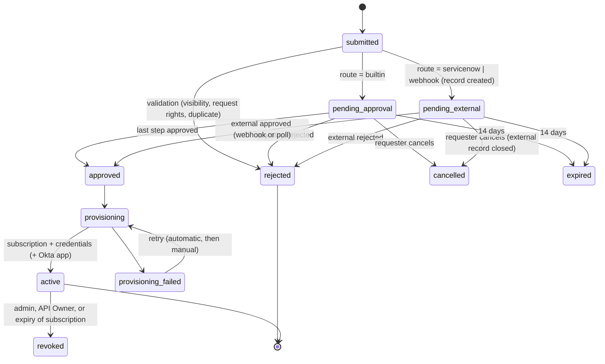

Transitions are implemented in `befive.access.workflow` as a pure function `(transition request event) -> {:request ... :effects [...]}`. Effects (create an external record, send email, provision, write back) go to the existing action outbox (14.11) with new action kinds `:access/*`, so they inherit retries, ordering per request, idempotency keys, and dead-letter handling. Each transition takes a row lock on the request (`SELECT ... FOR UPDATE`) and checks `version`, so a webhook and a poller reporting the same decision apply it once. Every transition appends an `access_request_event` row and an audit event (12.5).

**Submission checks.** The requester must be able to see the version (25.4) and have **request rights**. Request rights are a separate claims expression per API (default: any signed-in portal user in an organization), so seeing an API does not imply being allowed to ask for it. The application must belong to the requester's organization, and the requester must be one of its owners. The version must be `:published` or `:deprecated`, and new requests for a deprecated version can be disabled per API. There must be no open duplicate, and the classification must be in `:portal :request-allowed`.

**Expiry.** Pending requests expire after 14 days (configurable 1 to 90). Expiry closes the external record when the adapter supports it.

### 24.4 Built-in approvals

The chain for the request's frozen classification is materialized into `approval_step` rows at submission. Steps run **sequentially**: step n+1 becomes `pending` only after step n is approved. `:api-owner` resolves to the API's owners (users or Okta groups, 5.6). A group step can be satisfied by any member, based on the console user's mapped Okta groups at decision time.

- **Separation of duties.** The requester can never approve their own request. With `:distinct-approvers true` (the default for Restricted), one person cannot approve two steps of the same request.
- **Who decides.** In the console: Administrators, Consumer Managers, and API Owners for their APIs, if they match the step. In the portal: API Owners who also sign in to the portal see an "Approvals" page, using the same API and rules.
- **Notifications.** Email through Angus Mail and the SMTP relay settings (which remain in 1.0 for approvals and scheduled reports). The new approver of each pending step and the requester on each decision are notified. Templates are plain text with a console link and no request data beyond API, version, application, and requester. Console bell notifications are also sent (15.9).
- **Reminders** after 3 days, and a daily digest per approver (both configurable).
- **Plans.** An approver may change the requested plan, for example downgrading it. The change is recorded and shown to the requester.

### 24.5 ServiceNow request integration

The existing ServiceNow integration kind (14.13) gains a `:requests` section. Connection settings, OAuth client credentials, the outbox, rate limits, text safety, and the connection test are reused.

```clojure
{:id "snow-prod"
 :kind :servicenow
 :instance-url "https://acme.service-now.com"
 :auth {...}                                               ; as in 14.13
 :requests
 {:enabled true
  :mode :catalog-item                                      ; or :table
  :catalog-item {:sys-id "a1b2c3d4e5f60718293a4b5c6d7e8f90"
                 :variables {"api_name"       "{{api.name}}"
                             "api_version"    "{{version.id}}"
                             "classification" "{{request.classification}}"
                             "application"    "{{application.name}} ({{application.id}})"
                             "organization"   "{{organization.name}}"
                             "requested_for"  "{{requester.email}}"
                             "justification"  "{{request.justification}}"
                             "befive_ref"     "{{request.id}}"}}
  :table {:name "sc_req_item" :fields {...}}               ; for :table mode, same templates
  :state-map {:approved  {"approval" #{"approved"}}       ; field -> values that mean the decision
              :rejected  {"approval" #{"rejected"}}
              :cancelled {"state" #{"4" "7"}}}             ; Closed Incomplete, Closed Skipped (instance-specific)
  :inbound {:enabled true :secret #befive/secret "snow-request-hook-secret"}
  :poll {:enabled true :every-minutes 5}
  :write-back {:on-active  {:work-notes "Access provisioned by BeFive: subscription {{subscription.id}}." :state "3"}
               :on-failure {:work-notes "BeFive provisioning failed: {{error.code}}. The platform team has been notified."}}}}
```

**Record creation.** In `:catalog-item` mode (the default, because approvals in ServiceNow are usually defined on catalog items), the outbox calls `POST /api/sn_sc/servicecatalog/items/{sys_id}/order_now` with `{"sysparm_quantity": "1", "variables": {...}}`. The response returns the request (`REQ...`) and the requested item is looked up by `befive_ref`. BeFive stores the `sc_req_item` `sys_id` and number in `external_ref` and moves the request to `pending-external`. In `:table` mode BeFive inserts the configured table with `POST /api/now/table/{name}`, for customers who run approvals on a custom table. Template values are plain text with the 14.13 escaping. The justification is truncated to 4,000 characters. Correlation uses the `befive_ref` variable (or field), and lookups by it make creation idempotent, as `correlation_id` does for incidents.

**Integration user roles.** Ordering a catalog item and reading `sc_req_item` need the catalog and request ACLs. The connection test checks them, and the doc lists the least-privilege roles to configure. The connection test can order the item in a dry-run mode only if the customer provides a test catalog item. Otherwise it validates read access and variable names (`GET /api/sn_sc/servicecatalog/items/{sys_id}` returns the item's variables, and BeFive warns about unmapped required variables).

**Inbound signed webhook.** The customer adds a business rule or flow (BeFive ships an example script for Flow Designer and a business rule) that posts to `POST https://<control-plane>/hooks/v1/servicenow/{integration-id}` when the item's approval or state changes:

```
X-BeFive-Timestamp: 1790000000
X-BeFive-Signature: v1=<hex HMAC-SHA256(secret, timestamp + "." + body)>
{"befive_ref":"ar_01J9...","sys_id":"...","approval":"approved","state":"2","approver":"jane.doe","comment":"..."}
```

The hooks endpoint (14.8 conventions: no session, body limit 256 KiB, per-source rate limit) verifies the signature in constant time and rejects timestamps more than ±5 minutes from now. A replay cache keyed by (integration, signature) for 10 minutes rejects duplicates. The payload is only a **hint**: BeFive then reads the item back with `GET /api/now/table/sc_req_item/{sys_id}?sysparm_fields=approval,state,sys_updated_on,...` and applies the state map to what ServiceNow returns, so a forged or stale payload cannot approve anything even if the secret leaked. HMAC computed in ServiceNow scripts uses `GlideCertificateEncryption` or `CertificateEncryption` HMAC helpers. The shipped script shows this, and the customer's ServiceNow team must review it for their release.

**Polling fallback.** Every `:every-minutes` (default 5), the leader queries open requests in batches: `GET /api/now/table/sc_req_item?sysparm_query=sys_idIN<ids>^sys_updated_on>javascript:gs.minutesAgoStart(10)&sysparm_fields=...`, up to 100 IDs per call. The same state map is applied. Polling also detects records closed in ServiceNow without a webhook, and it is the only mechanism when inbound connectivity to the control plane is not possible.

**Provisioning.** On approval, the `:access/provision` effect runs in one database transaction: it creates the subscription (with plan), an API key for the application if the API's authentication uses keys and the application has none (the key is shown once to the developer in the portal, never written to ServiceNow), and the optional Okta app (24.8, as a separate outbox step before the transaction, so a failed Okta call does not leave a half-provisioned subscription). It then bumps a `subscription` revision (5.7). The request becomes `active` when the revision is committed, and the portal shows "active in about 5 seconds" because gateways apply it within the propagation target.

**Write-back.** `PATCH /api/now/table/sc_req_item/{sys_id}` with the configured work notes and, optionally, a closing state. Write-back failures retry through the outbox and never roll back provisioning. Revocation in BeFive adds a work note to the original item, when that item still exists.

**Field and state mapping** are configuration because catalog items and state values differ between instances (as noted for incidents in 14.13). The connection test lists the item's variables and the `sc_req_item` approval choices.

### 24.6 Generic webhook adapter

For other workflow systems, for example Jira Service Management through its automation webhooks, an integration of kind `:workflow-webhook` sends a signed request event and accepts a signed decision callback:

```
POST <configured URL>
webhook-id: ar_01J9...:submitted
webhook-timestamp: 1790000000
webhook-signature: v1,<base64 HMAC-SHA256(secret, id + "." + timestamp + "." + body)>
Content-Type: application/json

{"type":"access_request.submitted","request":{"id":"ar_01J9...","api":"payments","version":"v2","classification":"restricted",
 "application":{"id":"acme-billing","name":"Acme billing"},"organization":"acme","requester":"dev@acme.example",
 "justification":"...","decisionUrl":"https://cp.example.com/hooks/v1/workflow/jira-sm/decisions"}}
```

The headers follow the Standard Webhooks convention, so receivers can use existing verification libraries. The decision callback `POST /hooks/v1/workflow/{integration-id}/decisions` with `{"request":"ar_...","decision":"approved|rejected|cancelled","decidedBy":"...","comment":"...","externalRef":"JSM-1234"}` must carry the same signature headers, computed with a separate inbound secret. Timestamp tolerance and the replay cache are as in 24.5. Because a generic system cannot be read back, the decision callback is authoritative. For that reason the adapter requires an inbound secret distinct from the outbound one, and it can be restricted to source CIDRs. Restricted-level requests can be configured to require a built-in confirmation step after an external approval (`:confirm-external-for #{"restricted"}`). Events are also sent for `provisioned`, `failed`, `expired`, and `revoked`.

### 24.7 Routing rules

`:access-workflow` settings choose the route per classification and optionally per API: built-in, a ServiceNow integration, or a webhook integration, for example `{:default :builtin :by-classification {"restricted" "snow-prod"}}`. The route is frozen at submission. If the integration is disabled while requests are pending, they stay pending and an Administrator can re-route them, which is audited.

### 24.8 Optional Okta OAuth app creation

Off by default (doc 1, 2.6, decision 32). When enabled for an API and an application of kind `:service`, provisioning creates an Okta OIDC service application and binds its client ID to the BeFive application. Binding existing client IDs created by Okta administrators stays the default and needs no Okta credential. APIs classified Restricted are excluded by default (`:exclude-classifications`), so their clients are always created by Okta administrators. Created clients always use **`private_key_jwt`** (owner decisions, October 1, 2026). By default the **developer generates the key pair and uploads only the public key**; BeFive validates it, registers it with the Okta app, and never holds the private key. Rotation is by uploading a second public key that overlaps with the first. As an opt-in convenience, an install-level setting lets BeFive generate the key pair instead (below). Client secrets are not used for apps BeFive creates.

```clojure
{:okta-apps {:enabled false
             :identity-provider "okta-prod"                ; the Okta preset (9.7)
             :credential {:kind :api-token                 ; or :oauth-service-app
                          :token #befive/secret "okta-apps-token"}
             ;; :oauth-service-app {:client-id "0oa..." :private-key #befive/secret "okta-apps-key"} ; scope okta.apps.manage
             :client-keys {:max-active 2                     ; current key plus one overlapping key during rotation
                           :rotation-reminder-days 180       ; remind owners to rotate; nil = no reminder
                           :allow-generated false}           ; opt-in: BeFive generates key pairs (Administrator only)
             :label-prefix "befive-"
             :assign-to-auth-server {:mode :none}          ; or :manage (needs extra permissions)
             :exclude-classifications #{"restricted"}    ; default; Restricted APIs keep manual client binding
             :on-revoke :deactivate}}                      ; or :none; never delete
```

**Credential.** One of the two options from doc 1, 2.6. (a) An API token created by a dedicated Okta admin account that holds a custom admin role limited to application management. Okta API tokens carry the permissions of the admin who created them, which is why the admin account must be dedicated. (b) An OAuth 2.0 service app for the Okta Management API, granted the `okta.apps.manage` and `okta.apps.read` scopes, authenticating with `private_key_jwt`. Either way, the secret is stored in the secret store (18.2), only the control plane uses it, and every call is audited with method, path, and response status. No Okta SDK is used: the calls go through the SSRF-guarded system HTTP client (18.5).

**Calls.**
1. `POST https://<okta-domain>/api/v1/apps` with an `oidc_client` app: `label` = prefix + application ID, `settings.oauthClient.application_type = "service"`, `grant_types = ["client_credentials"]`, `response_types = ["token"]`, `credentials.oauthClient.token_endpoint_auth_method = "private_key_jwt"`, and `settings.oauthClient.jwks.keys` containing the application's validated public JWK (with a `kid`). Okta never issues a client secret for these apps. Provisioning waits in `provisioning` until the application has a registered public key; the portal asks for it on approval (03, 5.39).
2. Store the returned `client_id` and app `id` in `access_request.okta` and create the `:oauth-client` credential binding (9.2) for the application.
3. Scopes and audience: by default BeFive does **not** modify Okta authorization-server policies or rules. The customer's Okta admin grants the new client access to the custom authorization server through policies that match, for example, all clients with the `befive-` label or a group-based rule. With `{:mode :manage}`, BeFive also adds the client to a named authorization-server policy (`PUT /api/v1/authorizationServers/{id}/policies/{policyId}` updating `conditions.clients.include`). This needs additional permissions and is off by default, because it changes the customer's authorization configuration.

**Client keys: developer upload (default).** The developer generates a key pair on their own system (the portal and the docs show a short `openssl` command: `openssl genpkey -algorithm EC -pkeyopt ec_paramgen_curve:P-256 -out client.key` then `openssl pkey -in client.key -pubout -out client.pub.pem`; or `-algorithm RSA -pkeyopt rsa_keygen_bits:3072`) and uploads only the public key, as a JWK or a PEM `PUBLIC KEY` (SPKI), in the portal or the console (`POST /portal/v1/apps/{id}/client-keys`, `POST /admin/v1/applications/{id}/client-keys`). Validation in the control plane (Nimbus JOSE): RSA with a modulus of at least 2048 bits and a standard public exponent, or EC on P-256; any private material is **rejected without being stored or logged** (a JWK with `d`, `p`, `q`, `dp`, `dq`, `qi`, or `k`; PEM blocks of type `PRIVATE KEY`, `RSA PRIVATE KEY`, `EC PRIVATE KEY`, or `ENCRYPTED PRIVATE KEY`), with the message "This is a private key. Upload only the public key; keep the private key on your system." Symmetric keys, other curves, and certificates with private keys are rejected; a `kid` is set to the RFC 7638 thumbprint when absent, and a key whose thumbprint is already registered for another application is rejected. Table `okta_client_key` (`application_id`, `okta_app_id`, `kid`, `thumbprint`, `kty`, `alg` (RS256 or ES256), `public_jwk` jsonb, `origin` (`uploaded` or `generated`), `state` (`active`, `deactivated`), `uploaded_by`, `created_at`, `deactivated_at`, `deactivated_reason`) holds public keys only, unless `origin = generated` (below). BeFive registers each key with `POST /api/v1/apps/{appId}/credentials/jwks` in state `ACTIVE`.

**Rotation and compromise.** Rotation is overlap-based and driven by the developer: upload a second public key (at most `:max-active` keys are active, default 2), move the client to the new private key, then deactivate the old key (`POST /api/v1/apps/{appId}/credentials/jwks/{kid}/lifecycle/deactivate`). The portal shows each key's upload date and state. `:rotation-reminder-days` sends a reminder email; BeFive never deactivates a key on a schedule, because that would break a client that has not moved. **Report compromised** (portal or console, application owners and Administrators) deactivates the key in Okta at once, with no overlap, records a `client_key.compromised` audit event, and notifies the owners; if it was the only active key, the client cannot authenticate until a new key is uploaded, which the confirmation states. If an Okta call fails, the key state does not change and the outbox retries; the console shows the pending state.

**Opt-in: BeFive-generated keys.** An install-level setting `:allow-generated true`, off by default and changeable only by Administrators (a critical audit event), lets developers ask BeFive to generate the key pair instead. The key pair is generated in the control plane (Nimbus JOSE, RSA 3072 or P-256), and the private key is stored only as a secret-store entry (`okta-app-key/<application-id>/<kid>`, encrypted under the keyring, 18.2); it is never written to tables, logs, or bundles, and linked environments never receive it. The developer downloads the private key **once** (JWK or PEM) after a fresh sign-in (OIDC `max_age=300`); the download is audited with user, key ID, and IP, and a second download is refused (rotate instead). **Retention (owner decision, October 1, 2026, Update 3):** the private key is deleted from the secrets store immediately after the one-time download, or after 24 hours if it is never downloaded. Deletion after a download happens in the same transaction that records the download (the response is streamed from memory; the secret-store entry is removed before commit), and a leader job (`befive.access.okta-key-sweeper`, every 10 minutes) deletes undownloaded entries whose `created_at` is more than 24 hours old. Both deletions write a `client_key.private_deleted` audit event (`reason` `downloaded` or `expired`). An expired, never-downloaded key stays registered in Okta but is unusable (nobody holds the private key), so it is deactivated in Okta in the same step, and the portal shows "Expired before download; generate or upload a new key". After deletion BeFive holds no private key for that application, so generated keys have the same custody profile as uploaded keys from then on. Generated keys are **never available for Restricted APIs** (not overridable), and a per-API setting `:okta-apps {:generated-keys false}` disables them for any other API; applications whose entitlements include such an API must use uploaded keys. Rotation and compromise work as for uploaded keys.

**Optional in-browser generation (convenience).** The portal can also generate the key pair in the developer's browser with WebCrypto (`crypto.subtle.generateKey`, ECDSA P-256 or RSASSA-PKCS1-v1_5 3072), offer the private key as a local file download (PKCS#8 PEM), and upload only the public JWK. The private key never leaves the browser, so this counts as developer upload, not as a BeFive-generated key. It is labeled as a convenience, with a note that generating keys on the system that will use them (the `openssl` command) is preferred; it relies on the portal's strict CSP (25.3) because a compromised portal script could otherwise read the key.

**Idempotency.** Before creating, BeFive searches `GET /api/v1/apps?q=<label>` and adopts an existing app with the exact label and a matching `befive_ref` in the app's notes. A timed-out create therefore never produces two apps.

**Revocation.** `:deactivate` calls `POST /api/v1/apps/{id}/lifecycle/deactivate`, and `:none` only unbinds. BeFive never deletes Okta apps: deletion is irreversible and belongs to Okta administrators.

**Failure handling.** Okta `429` responses honor `X-Rate-Limit-Reset`. `401` and `403` move the request to `provisioning-failed` with a clear message ("the Okta credential lacks application management permission"). The **connection test** reads one app (`GET /api/v1/apps?limit=1`). With explicit confirmation it creates and deactivates a test app labeled `befive-connection-test`, so missing permissions show up before the first real request.

**Security considerations.** The credential can create applications in the customer's Okta org, so the risk entry R11 (doc 1) applies: least privilege, a dedicated admin, a secret-store reference, audit, a critical audit event when the setting is enabled, and a rate rail of at most 20 app creations per hour by default. By default BeFive never holds client private keys, so a control-plane or secret-store compromise exposes no client credential for created apps; upload validation rejects private material without storing it. Only the opt-in BeFive-generated mode stores private keys, and only briefly; its mitigations are the Administrator-only setting, exclusion of Restricted APIs, keyring encryption, per-application keys, a single audited download, deletion from the secrets store right after that download or after 24 hours if never downloaded, and immediate deactivation in Okta on a compromise report.

### 24.9 Metrics, audit, and tests

- **Metrics:** `AccessRequestsSubmitted`, `AccessRequestsDecided` (by outcome and route), `AccessRequestPendingAge` (gauge, oldest), `AccessProvisioningFailures`, `WorkflowWebhookRejected` (signature, timestamp, replay), and `OktaAppCalls` by status. All are control-plane metrics exported through the sinks (31).
- **Audit actions** (12.5): `access_request.submitted|approved|rejected|cancelled|expired|provisioned|provisioning_failed|revoked`, `approval_step.decided`, `workflow.hook.rejected`, `okta_app.created|adopted|deactivated`, and `okta_apps.settings_changed` (critical).
- **Tests:** state-machine property tests (random event sequences never reach `active` without the required approvals, and duplicate decisions apply once); separation-of-duties tests; a ServiceNow mock server with recorded responses for catalog ordering, read-back, and write-back; a nightly test against a ServiceNow developer instance (PDI) with the shipped flow script; webhook signature, tolerance, and replay tests; and an Okta Management API mock plus a nightly test against an Okta developer org for create, adopt, and deactivate.

---

## 25. Developer portal (Draft 4)

This chapter covers DEV-001, DEV-002, DEV-003, and DEV-005 (doc 1, 2.11), plus the portal side of SEC-003. There is **one portal**, hosted by the production cluster's control plane. It lists APIs from linked environments and sends try-it traffic to the Sandbox cluster (decision 20). The portal is a separate single-page application with its own hostname, session, and API surface, so a portal compromise cannot reach the Admin API.

### 25.1 Release subsets

| Capability | 0.x preview (`:portal {:mode :preview}`) | 1.0 (`:mode :full`) |
|---|---|---|
| Okta login, visibility by groups and users | ✔ | ✔ |
| Catalog search and facets | ✔ (local environment only) | ✔ (with linked-environment federation, 25.6) |
| OpenAPI-rendered docs, deprecation badges | ✔ | ✔ plus changelog |
| Applications, keys, subscriptions | | ✔ |
| Access requests and portal approvals | | ✔ (24) |
| Try-it | | ✔ (25.7) |

In preview mode the portal API exposes no mutating endpoints other than login and logout. The routes are not registered at all, so a request for them returns `404`, not `403`. The preview reads only the local environment's catalog. Partners **may access the preview from outside** (owner decision, October 1, 2026), so it is not internal-only by default and is designed for internet exposure from 0.x: the listener is off until an Administrator enables it, and then serves the configured portal hostname on all interfaces like the 1.0 portal. The internet-exposure measures of 25.3 apply in full from 0.x, and the 0.x milestone includes a portal-preview security review (doc 1, 4.2, milestone 10).

### 25.2 Components

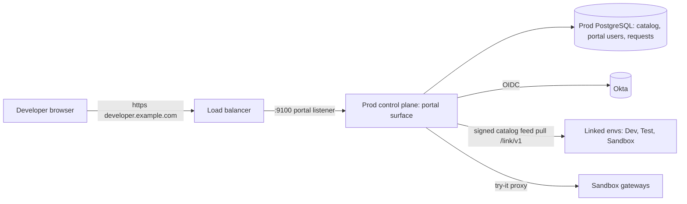

- **SPA.** A second shadow-cljs build (`:portal`), sharing the malli schemas, the re-frame infrastructure, and the component library with the console (03, section 8). It is served as static assets with content hashes from the portal listener.
- **Portal API.** `/portal/v1`, a reitit handler distinct from `/admin/v1`, with its own middleware stack, its own permission model (25.4), and no route that changes configuration. Everything it writes is portal-owned data: applications (limited fields), access requests, keys for the developer's own applications, and portal users.
- **Listener.** A separate Aleph listener (default port 9100) on the control plane, with TLS and a host allow-list (`:portal {:hosts ["developer.example.com"]}`). Requests with other `Host` headers get `421`. The admin listener does not serve portal paths, and the portal listener does not serve `/admin/v1`.
- **Portal-only control-plane tasks.** `BEFIVE_CP_SURFACES=portal` starts a control-plane task that runs only the portal surface. It has no admin listener, no leader election, and no anomaly engine, and it connects to PostgreSQL with a separate database role (`befive_portal`) that has privileges only on the portal-related tables and read access to catalog tables. This lets customers put the portal in a public subnet with its own scaling and blast radius. In small installs the regular control plane serves both surfaces.

### 25.3 Hosting, sessions, and content security

- **Sign-in.** OIDC authorization code flow with PKCE against a **separate Okta OIDC client** (a web app registered for the portal), so the console's client and its group claims stay separate. Settings: `:portal {:oidc {:identity-provider "okta-workforce" :client-id ... :client-secret #befive/secret "..." :groups-claim "groups"}}`. Partners in a separate Okta org or a customer identity tenant are supported by configuring that provider instead. One OIDC provider per portal in 1.0.
- **Users.** `portal_user` (`id`, `idp`, `sub` unique per IdP, `email`, `name`, `groups` text[] refreshed at each login, `organization_id` resolved from organization rules (5.6: Okta groups or email domains), `status`, `last_login_at`). Users are created at first login. Group membership is a snapshot taken at login and refreshed on each new session.
- **Sessions.** Server-side rows in `portal_session` (SHA-256 of a 256-bit token). Cookie `__Host-befive_portal`, `Secure`, `HttpOnly`, `SameSite=Lax` (Lax is needed for the OIDC redirect return), with `Path=/`. A per-session CSRF token is required in `X-CSRF-Token` on every non-GET request, and `Origin` is checked against the portal hosts. Idle timeout 60 minutes, absolute lifetime 12 hours. Logout deletes the session and optionally calls Okta's logout endpoint.
- **Content security.** `Content-Security-Policy: default-src 'self'; script-src 'self'; style-src 'self' 'nonce-…'; img-src 'self' data:; connect-src 'self'; frame-ancestors 'none'; base-uri 'none'; form-action 'self'`, plus `X-Content-Type-Options: nosniff` and `Referrer-Policy: same-origin`. API descriptions and documentation pages are Markdown rendered with `markdown-it` with HTML input disabled, and the output is sanitized again with DOMPurify. Links get `rel="noopener noreferrer"`, and images are allowed only from the portal host or `data:` URLs below 256 KiB. OpenAPI example payloads are rendered as text, never as HTML.
- **Rate limits.** Per user and per IP on the portal API (default 300 requests per minute per user, 60 login attempts per IP per 10 minutes). These use the gateway's local Bucket4j implementation embedded in the control plane.
- **Internet exposure (from 0.x).** The reference layout (2.4) puts the portal hostname behind its own ALB listener with **AWS WAF** (AWS managed rule groups for common exploits and known bad inputs, the IP reputation list, and a rate-based rule, default 2,000 requests per 5 minutes per IP), with BeFive's own limits above as the second layer. Recommended: the portal-only control-plane task (25.2) in a public subnet with the `befive_portal` database role, so a portal compromise cannot reach admin tables or the admin listener. Unauthenticated requests reach only static assets, `/login`, `/callback`, and health; everything else requires a session, and catalog responses and facet counts are computed after visibility filtering (25.4), so an anonymous or unentitled user learns nothing about hidden APIs. The CSP above is enforced (not report-only), `Strict-Transport-Security: max-age=31536000; includeSubDomains` is sent, error pages carry no stack traces or versions, and the `Server` header is suppressed. Login failures and visibility denials feed the anomaly engine's portal signals (credential stuffing detector). Doc 1 risk R4 and its mitigations apply from 0.x.

### 25.4 Visibility and request rights

Visibility decides who sees an API, version, or operation in the catalog, docs, and search. It is set per API and can be **narrowed** (never widened) per version and per operation:

```clojure
:visibility {:audience :restricted                ; :public-portal (any signed-in user) | :restricted
             :groups #{"partners-acme" "internal-developers"}
             :users #{"00u1a2b3c4D5e6F7g8h9"}      ; Okta user IDs (sub), not emails
             :organizations #{"acme"}}            ; members of these organizations
```

- **Inheritance.** The effective visibility of a version is the API's audience intersected with the version's setting. For an operation, it is the version's visibility intersected with the operation's setting. An operation can be hidden from partners inside a visible version, for example `/admin` operations.
- **Request rights** are separate (24.3): a claims expression evaluated against the portal user, defaulting to "member of any organization". Visibility without request rights shows the API with a "contact the owner" note.
- **Enforcement in SQL.** Visibility is denormalized into `catalog_visibility` (`entry_id`, `kind` (`group`, `user`, `org`, `public`), `value`). Catalog queries join on the user's groups, `sub`, and organization with `EXISTS` subqueries, so invisible entries are never loaded into the application layer. Facet counts are computed **after** visibility filtering, so the counts do not reveal hidden APIs. Direct URLs to invisible APIs return `404`.
- **Docs filtering.** The OpenAPI document served to the portal is rebuilt per (version, visibility class): operations the user cannot see are removed, along with schemas reachable only from removed operations. Documents are cached per visibility class, a hash of the matching group set, in a bounded Caffeine cache.
- **Admin preview.** Console users with view rights can "view portal as" a group or user. Read-only, audited.

### 25.5 Catalog search and facets

The catalog index is a denormalized table maintained by the control plane on every API, version, operation, or spec change. It is rebuilt fully by a maintenance job daily and on demand.

```sql
CREATE TABLE catalog_entry (
  id             text PRIMARY KEY,               -- 'api:orders' | 'ver:orders:v2' | 'op:orders:v2:get-order'
  kind           text NOT NULL CHECK (kind IN ('api','version','operation')),
  api_id text NOT NULL, version_id text, operation_id text,
  source_env     text NOT NULL,                  -- local env or linked env id (25.6)
  title text NOT NULL, summary text,
  domain text, owners text[], tags text[], state text, classification text,
  environments   text[] NOT NULL,                -- availability, from federation
  deprecated boolean NOT NULL DEFAULT false, sunset_at timestamptz,
  search         tsvector NOT NULL,
  updated_at timestamptz NOT NULL
);
CREATE INDEX catalog_entry_search ON catalog_entry USING gin (search);
CREATE INDEX catalog_entry_tags ON catalog_entry USING gin (tags);
CREATE INDEX catalog_entry_title_trgm ON catalog_entry USING gin (title gin_trgm_ops);   -- if pg_trgm is available
```

- **Vector.** `setweight(to_tsvector(cfg, title), 'A') || setweight(to_tsvector(cfg, tags + domain + operationIds), 'B') || setweight(to_tsvector(cfg, summary), 'C') || setweight(to_tsvector(cfg, description + parameter and field names), 'D')`. The text search configuration is `english` by default and `simple` as an option, set per install. Field names from the data dictionary (26.8) are included, so searching for `iban` finds the operations that use it.
- **Query.** `websearch_to_tsquery(cfg, :q)` (it supports quotes, `or`, and `-`), ranked with `ts_rank_cd` and a boost for API-kind entries and published state. For short queries (under 3 characters) or no FTS hits, the search falls back to `pg_trgm` similarity on titles when the extension is available. Results are grouped by API, with the matching versions and operations shown as children.
- **Facets.** Domain, owner, tags, lifecycle state, classification, version, and environment availability. Counts come from one `GROUP BY` per facet over the visibility-filtered, query-filtered set, using `GROUPING SETS` in a single statement. Statement timeout 2 s.
- **Scale target:** 2,000 APIs and 50,000 operations with search p95 under 200 ms on the reference database (a target).

### 25.6 Linked-environment catalog federation

The production portal shows APIs from linked environments (34.2), each version with its availability per environment ("Sandbox, Test, Prod"). Federation uses the link channel:

- Every 5 minutes, and immediately after a promotion completes, the production control plane pulls `GET /link/v1/catalog?since=<cursor>` from each linked environment that has `:catalog-feed true`. The feed is the environment's catalog entries without bodies plus the version documents' hashes, signed with the environment's link key (34.2).
- Entries are stored with `source_env = <link id>`, and availability is merged per (API, version) into `catalog_env_availability`. Specs of versions that exist only in non-production environments are fetched on demand through `GET /link/v1/specs/{sha256}`, verified by hash, and cached in `catalog_federated_version`.
- **Precedence.** Production's own data wins for metadata such as titles, owners, and visibility. Linked environments contribute availability and versions that production does not have yet, for example a version in Test. Visibility for federated-only versions comes from the source environment's settings. If production has the API, production's narrowing also applies.
- **Staleness.** A linked environment that cannot be reached keeps its last feed. The portal shows "availability as of HH:MM", and after 24 hours the entries are marked stale.
- Federation never moves configuration. It is read-only metadata, distinct from promotion (34.5).

### 25.7 Try-it proxying to the Sandbox

Try-it requests are sent **server-side** by the portal's control plane to the Sandbox gateways. They are not sent from the browser, which avoids CORS configuration on every API and keeps sandbox credentials out of the browser.

```
browser --POST /portal/v1/try-it {apiVersion, operation, method, path, headers, query, body, target:"sandbox"}-->
  portal control plane: checks visibility, sandbox entitlement, try-it limits; builds the request
  --> https://sandbox-gw.example.com/... with credential mode (a) or (b)
  <-- response (status, headers allow-listed, body up to 1 MiB) --> browser
```

- **Credential modes.** (a) **Portal-minted try-it token** (default): the developer selects one of their sandbox-scope applications (5.6, `:environment-scope :sandbox`). The portal mints a short-lived JWT (60 s) signed with the Sandbox environment's try-it key, which is part of the link key material (34.2), with `sub` = developer, `app` = application, and `aud` = sandbox. The Sandbox gateways accept it through a built-in auth provider of kind `:befive-tryit`, which is enabled only in environments marked `:sandbox true`. (b) **Own credential**: the developer pastes an API key or bearer token for the request. It is used once and never stored or logged (it is redacted like all credentials, 12.4).
- **Limits.** Request body up to 1 MiB, response body up to 1 MiB (truncated with a notice), 30 s timeout, 30 requests per minute per user, and hop-by-hop and cookie headers removed. Requests go only to the Sandbox gateway base URL configured for the link (`:try-it-base-url`). The SSRF guard (18.5) applies, with that URL explicitly allow-listed.
- **Production target.** Never the default. Offered only when the API sets `:try-it {:production true}` (5.6; off by default), only in own-credential mode, and with a confirmation. Production try-it calls are audited.
- **Logging.** Every try-it call writes a portal audit-lite record (user, API, operation, status, latency; no bodies). The sandbox gateway logs the request normally with `client_kind = try-it`.

### 25.8 Metrics, security, and tests

- **Metrics:** `PortalLogins` (by outcome), `PortalSessionsActive`, `PortalSearchLatency`, `PortalTryItRequests` (by outcome), `CatalogFederationAgeSeconds` per link, `CatalogIndexLag`.
- **Security summary** (also in 18.1): separate listener, hostnames, cookie, OIDC client, and database role; no configuration-writing routes; SQL-level visibility; strict CSP plus sanitized Markdown; server-side try-it with limits; API keys shown once; Okta client keys uploaded as public keys only, private material rejected; opt-in BeFive-generated keys downloadable once (and deleted from the secrets store right after download or after 24 hours) after re-authentication, audited (24.8); WAF and rate limits in front of the internet-facing hostname from 0.x (25.3).
- **Tests:** visibility property tests (no query, facet, or direct URL reveals an invisible entry; generated users and visibility trees); facet-count leakage tests; CSP and sanitizer tests with XSS payload corpora in descriptions and examples; OIDC login against an Okta developer org nightly and a mock IdP in CI; federation with two linked test environments; try-it limit and redaction tests; and preview-mode tests asserting that mutating routes are absent.

---

## 26. OpenAPI pipeline, lifecycle, sandbox and mocks, and the data dictionary (Draft 4)

This chapter covers DEV-004, DEV-005, DEV-007, DEV-008, and API-002 (doc 1, 2.11). OpenAPI documents are the usual way APIs enter BeFive. They are parsed and stored, mapped onto versions and operations, diffed before applying, used for optional request validation and mock responses, indexed into the data dictionary, and exported with what BeFive adds.

### 26.1 Pipeline overview

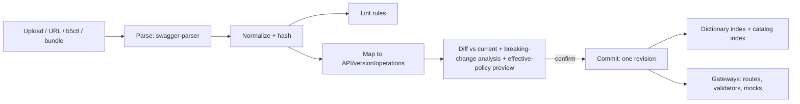

Parsing and mapping run only in the control plane and the CLI (`befive.openapi`). Gateways receive the normalized JSON of the parts they need (operation schemas for validation, examples for mocks), never the raw document.

### 26.2 Import and storage

- **Inputs.** File upload (console and `POST /admin/v1/apis/{api}/versions/{v}/spec`, `Content-Type: application/yaml|json`), URL import (`{"url": "https://..."}`), and `b5ctl openapi import`. Size limit 10 MiB. URL import goes through the SSRF guard (18.5), HTTPS only by default, with a 10 s timeout and the same 10 MiB cap while streaming.
- **Parser.** `io.swagger.parser.v3:swagger-parser` with `ParseOptions`: `resolve = true`, `resolveFully = false` (references are kept and resolved lazily by BeFive's walker, so recursive schemas stay finite), and **remote and file references disabled** through a custom `ResolverCache` that rejects any `$ref` that is not document-local. Specifications split across files are imported as a bundle (zip or a directory in `b5ctl`) whose relative references resolve only within the bundle. Swagger 2.0 documents are converted by the parser's converter and flagged in lint. Parse messages are returned to the user with JSON paths.
- **Normalization.** Convert to JSON, sort keys, drop `x-befive-internal-*` extensions, and compute a SHA-256 of the canonical form. The `api_spec` row (5.7) stores the original bytes (compressed), the normalized JSON, and lint results. Specs are immutable and deduplicated by hash.
- **Extensions.** `x-befive-api` (API ID), `x-befive-operation-id` (stable operation ID), `x-befive-backend` (`proxy|mock|async|composite` reference), `x-befive-classification`, `x-befive-visibility`, `x-befive-cache`, `x-befive-rate-limits`, and `x-befive-deprecation`. Extensions are applied as operation-level fields, which run through the same lock validation as hand edits (23.4). An extension can never set a field an API Owner could not set.

### 26.3 Mapping and diff

- **Operation identity.** Taken from `x-befive-operation-id`, or `operationId` slugified (`getOrderById` becomes `get-order-by-id`), or derived from method plus path (`get-orders-id`). Operation IDs must be stable across imports. A changed `operationId` with the same method and path is detected as a rename, the user confirms it, and the existing operation keeps its ID and attachments.
- **Paths.** `{param}` becomes `:param`. Path-level and operation-level `servers` entries are ignored for routing; the version's service decides the backend. Server URLs that contain a base path are reported in the diff as a hint for `:upstream-path`.
- **Diff.** The import diff shows added, removed, and changed operations. For changed ones it shows parameters, request body, responses, security requirements, and deprecation. An in-house **breaking-change analysis** in `befive.openapi.diff` flags removed operations, removed or newly required parameters, removed response fields, type narrowing, enum value removal, changed security, and `2xx` response removal. It covers the common rules that tools like `oasdiff` check; `oasdiff` stays a CI tool for the Admin API's own spec (15.7) and is not a runtime dependency.
- **Impact.** For each breaking change the diff lists affected derived routes, policy attachments that reference removed operations (which would become orphaned and are reported as errors), composites that call the operation (28), and **callers in the last 30 days** from rollups (32.2) by application. Importing a breaking change into a `:published` version requires confirmation with a comment. The recommended path is a new version.
- **Effective-policy preview** (23.6) for the changed operations, including lock violations from extensions.
- **Apply.** One revision containing the spec, version, operations, and attachments, with `source = openapi-import`, audited with the spec hash.

### 26.4 Request validation (optional per operation)

With `:validation {:request true}`, the new `:befive/validate` phase (7.4, slot 15) checks path, query, and header parameters and the JSON request body against the operation's schemas. It uses networknt `json-schema-validator` (proposed in doc 1, 3.2), with schemas compiled once per revision in the gateway compile step for the OpenAPI 3.1 dialect (2020-12) or the 3.0 dialect. Bodies are validated only for JSON media types and only up to 1 MiB; larger bodies on a validating operation are rejected with `413` unless `:validation {:max-body-bytes ...}` is raised. Validation runs on the event loop for bodies under 64 KiB and on the virtual-thread executor above that (one thread hop). Failures return `400 validation.failed` with up to 10 error entries (JSON Pointer path and keyword, never echoing values). The access log records `validation_errors` as a count. Response validation is not in 1.0; the route tester can validate responses for debugging.

### 26.5 Lifecycle states and retirement

| State | Routes compiled | Catalog | Transitions |
|---|---|---|---|
| `design` | Only in environments with `:allow-design-routes` (Sandbox by default) or as mocks (26.7) | Visible to owners and admins, "Design" badge | → `published` (requires a backend or mock, an access rule after resolution, and a lint run without errors) |
| `published` | Yes | Visible per visibility | → `deprecated` (requires `deprecated-at`; `sunset-at` recommended) |
| `deprecated` | Yes, with deprecation headers (27.3) | Badge, sunset date, migration link | → `retired` (blocked before `sunset-at` unless forced with a comment; warns if callers in the last 7 days) |
| `retired` | Retirement routes answering `410` | Hidden by default; shown in the changelog | none (terminal; re-publishing means a new version) |

Transitions are API calls (`POST /admin/v1/apis/{api}/versions/{v}/transition {"to": "deprecated", ...}`), available to Operators and Administrators. API Owners can publish and deprecate their own APIs' versions but cannot retire them (15.6), because retirement stops traffic. They are audited and recorded in a per-API changelog (`api_changelog` rows: version, from, to, at, by, note) shown in the portal. Promotion (34.5) carries lifecycle states, and a target environment can require that a version is `published` in the source before it is promoted to production.

**Retired responses.** `410 Gone`, `Content-Type: application/problem+json`, body `{"type": "https://docs.befive.dev/errors/version-retired", "title": "This API version is retired", "status": 410}`, and `Link: <https://developer.example.com/apis/orders/v3>; rel="successor-version"` when a successor is configured, plus a `rel="sunset"` link to migration documentation (27.3). Retirement routes skip authentication by design: they reveal only that the version existed, which is public information on the portal changelog. A per-API setting `:retired-response :not-found` returns `404` instead for APIs whose existence is sensitive.

### 26.6 Sandbox environment

The Sandbox is a separate BeFive cluster (34.1) marked `:sandbox true`. That enables design routes, mocks by default, the `:befive-tryit` auth provider (25.7), and separate rate limits (Sandbox plans), and it never shares credentials or peppers with production: keys are issued per environment. Sandbox access requires a portal login and a sandbox entitlement. Sandbox-scope applications are created self-service without approval, unless the API's classification requires approval even in the sandbox (`:sandbox-approval true` per classification level; Restricted defaults to true).

### 26.7 Mock responses

An operation with backend `:mock`, or any operation in a version with `:mock {:enabled true}` when the request is sent to the sandbox host, is answered by the terminal `:befive/mock` handler from the spec:

1. **Response selection.** `Prefer: code=404` picks the status (if defined), and `Prefer: example=not-found` picks a named example (the `Prefer` conventions used by common mock servers). Without a preference, the lowest `2xx` response is used.
2. **Body.** The response's `example`, or the named or first `examples` entry, or the schema's `example`. If there is none, a body **generated deterministically** from the schema with a fixed seed derived from (operation, status): it respects `type`, `format`, `enum`, `minimum`/`maximum`, `minLength`/`maxLength`, `required`, `oneOf` (first branch), and `$ref`, with depth limit 8, array length 1–3, and output limit 64 KiB.
3. **Headers.** Declared response headers with examples, `Content-Type` from the response media type, and `X-BeFive-Mock: example|generated`.
4. **Policies.** Authentication, access rules, rate limits, and logging apply as for real backends, so a mock exercises the same contract. Validation (26.4) can be combined with mocks.

Mock generation is precomputed at compile time for examples and lazily cached per (operation, status, example) for generated bodies, in a bounded cache. Mock latency is not simulated in 1.0.

### 26.8 Data dictionary index

The dictionary is a searchable index of fields and schemas across all ingested specs (DEV-008), with curated definitions and tags:

```sql
CREATE TABLE dictionary_term (                  -- curated, promoted with configuration
  id bigserial PRIMARY KEY, name text UNIQUE NOT NULL,
  definition text, owners text[], tags text[] NOT NULL DEFAULT '{}',   -- e.g. {pii, financial, no-cache}
  match jsonb                                   -- rules linking fields to the term: names, patterns, schema hashes
);
CREATE TABLE dictionary_field (                 -- one row per distinct (name, normalized type, canonical schema hash)
  id          bigserial PRIMARY KEY,
  name        text NOT NULL,                    -- property name, e.g. "iban"
  json_type   text NOT NULL, format text,
  schema_hash text NOT NULL,                    -- SHA-256 of the canonicalized subschema (descriptions removed)
  description text,                             -- most common description across usages
  term_id     bigint REFERENCES dictionary_term(id),
  search      tsvector NOT NULL,
  UNIQUE (name, json_type, schema_hash)
);
CREATE TABLE dictionary_usage (
  field_id bigint NOT NULL REFERENCES dictionary_field(id),
  api_id text NOT NULL, version_id text NOT NULL, operation_id text,
  location text NOT NULL,                       -- 'request.body', 'response.200.body', 'query', 'header', 'component'
  pointer  text NOT NULL,                       -- JSON Pointer into the spec, e.g. "/components/schemas/Payment/properties/iban"
  PRIMARY KEY (field_id, api_id, version_id, pointer)
);
```

- **Indexing.** After each spec commit, a control-plane job walks the normalized spec (components, parameters, request and response bodies, with `$ref` following and a cycle guard) and upserts fields and usages for that version. The index is derived data and can be rebuilt from specs at any time (`b5ctl dictionary rebuild`).
- **Terms and tags.** Data owners curate terms, for example "IBAN, tagged `pii`, `financial`", that match fields by name (`iban`, `*_iban`), by pattern, or by explicit schema hash. Spec authors can tag fields directly with `x-befive-tags: [pii]`. Tags are configuration and are promoted.
- **Effects.** Tagged fields drive body redaction in logged samples (12.4) and in context sent to any LLM feature (from 1.1), cache defaults (`no-cache` tag, 24.1), and the classification view in the console ("operations returning PII fields"). The compiler resolves tags into per-operation JSON Pointer sets, so redaction on the hot path is a precompiled list of pointers, not a lookup.
- **Search.** Dictionary search uses the same FTS approach as the catalog (25.5) and is shown in the console and, filtered by visibility, in the portal.

### 26.9 Export

`GET /admin/v1/apis/{api}/versions/{v}/openapi?format=yaml|json&dialect=3.1|3.0` (and the portal equivalent, filtered by visibility) returns the stored spec with BeFive's additions merged, as 3.1 by default or 3.0 for older tooling:

- `servers`: the environment's public hosts with the version's path prefix.
- `components.securitySchemes`: the effective authentication: OAuth 2.0 client credentials with the Okta token URL and scopes, `openIdConnect` with the discovery URL, `apiKey` in the configured header, or `mutualTLS`. Per-operation `security` comes from the effective policy.
- Rate-limit response headers (`RateLimit`, `RateLimit-Policy`, `Retry-After`) on responses where limits apply, and `401`, `403`, and `429` responses with the BeFive problem schema.
- `deprecated: true` on deprecated operations, `x-befive-sunset`, and documentation links.
- `x-befive-*` extensions only if `?extensions=true`.

A property test checks the round trip: import, export, and re-import produce the same operations, parameters, and schemas (modulo the added sections). Golden-file tests cover a corpus of public specs (Stripe-like, GitHub-like, Petstore variants) for parse, map, diff, export, and mock generation. Lint rules (1.0, deterministic) include: missing `operationId`, missing descriptions on operations, response codes without schemas, missing examples (warning; mocks fall back to generation), security requirements not matching the effective policy, and unused components. LLM-assisted checking (DEV-006) is 1.1.

---

## 27. Versioning and deprecation (Draft 4)

This chapter covers API-001 and API-002 (doc 1, 2.8).

### 27.1 Version routing strategies

An API's versioning rule decides how a request selects a version. It is set per API and can be overridden per version:

```clojure
{:versioning {:strategy :path                         ; :path | :host | :header | :media-type | :query
              :path {:template "/v{version}"}           ; "/v2/..." -> version "v2"
              ;; :host {:template "{version}.api.example.com"}
              ;; :header {:name "Api-Version"}          ; "Api-Version: 2026-09-01"
              ;; :media-type {:pattern "application/vnd.acme.{version}+json"}   ; Accept / Content-Type
              ;; :query {:name "api-version"}
              :default-version "v2"                     ; for requests that name none (header/media-type/query)
              :aliases {"latest" "v3"}}}
```

| Strategy | Compiled into | Notes |
|---|---|---|
| `:path` | The version's path prefix, part of route matching (6.4) | No runtime cost. A default version does not apply, because a path without a prefix matches no version route. Optional unversioned alias routes can be compiled explicitly. |
| `:host` | The version's host list | Uses the host router. Certificates must cover version hosts. |
| `:header` | A candidate predicate on the header value | Candidates at the same template are ordered by version, and the default-version candidate (no header) comes last. |
| `:media-type` | A predicate on `Accept` (for responses) and `Content-Type` (for bodies), parsed once per request into the context, with parameters ignored | `Accept` lists are matched in quality order. A request whose `Accept` names an unknown version gets `406 version.unknown_media_type`. |
| `:query` | A predicate on the query parameter | The parameter is removed before proxying unless `:forward true`. |

- **Unknown versions.** For header and query strategies, an explicit version value that matches no candidate returns `400 version.unknown` with the list of available versions (public information) in the problem body. For path and host strategies, an unknown version simply does not match (`404 route.not_found`).
- **Caching.** Responses selected by header, media type, or query get `Vary: <header>` (or `Vary: Accept`) added, so shared caches and BeFive's own cache (29.2) separate versions.
- **Selection logging.** The access log records `api_version` and `version_selected_by` (`path`, `host`, `header`, `media-type`, `query`, `default`).

### 27.2 Conflicts and candidates

Header, media-type, and query predicates make candidates at the same template distinct for conflict detection (6.9). Two versions with the same predicate value, or two default versions, are validation errors. Mixing strategies within one API is allowed only per version override, for example moving from header to path at v3. The validator checks that every version is reachable.

### 27.3 Deprecation, Sunset, and Link headers

```clojure
:deprecation {:deprecated-at #inst "2026-10-01T00:00:00Z"
              :sunset-at     #inst "2027-04-01T00:00:00Z"
              :link "https://developer.example.com/apis/orders/migrate-v2-v3"
              :headers {:deprecation true :sunset true :link true}}     ; each can be disabled
```

Deprecation is a policy kind (23.3, not lockable), so it can be set on an API, version, path, or operation, with the most specific value winning. The new `:befive/lifecycle` phase (7.4, slot 9) adds, on the leave path of every response (including errors after routing):

```
Deprecation: @1790812800                                   ; RFC 9745 structured date (Unix seconds)
Sunset: Thu, 01 Apr 2027 00:00:00 GMT                      ; RFC 8594 HTTP-date
Link: <https://developer.example.com/apis/orders/migrate-v2-v3>; rel="deprecation"; type="text/html",
      <https://developer.example.com/apis/orders/migrate-v2-v3>; rel="sunset"; type="text/html"
```

The header values are precomputed strings at compile time, so the cost is one header append. If the upstream already sent `Deprecation` or `Sunset`, the upstream value is kept and BeFive's is not added (`:headers {:override false}` default), and the decision is logged. Before `deprecated-at`, the `Deprecation` header is still sent with the future date, which RFC 9745 allows, so clients learn about planned deprecations early. After `sunset-at`, the version keeps working until it is retired explicitly. Retirement is a lifecycle transition (26.5), not automatic, because automatic retirement can cause an outage.

### 27.4 Deprecated-usage report

"Who still calls it" (doc 1, 2.8) comes from two sources:

1. **Rollups** (32.2): the usage rollups carry `deprecated` as a dimension (from the access record's `deprecated` field, 12.2), so a saved report "Deprecated usage" lists API, version, operation, organization, application, request count, and error rate over a period.
2. **Last call.** `deprecated_last_call` (`api_id`, `version_id`, `operation_id`, `application_id`, `last_call_at`, `calls_7d`) is upserted by the rollup job from 1-minute rollups for deprecated operations only. It gives the exact last-seen time per application without scanning long periods.

The console view per API version shows these, with contact details from the application owners and organization, and an "Export contacts" action (CSV). The Draft 3 monthly report and the CloudWatch and Datadog dashboards get a deprecated-usage panel (13.2, 31.6). The anomaly engine can alert when a deprecated version's traffic rises after a date (an optional detector template).

**Tests.** Header formats against RFC examples; precedence across levels; upstream-header coexistence; version selection for every strategy, with unknown-value and default cases; `Vary` correctness; and report accuracy against generated traffic in integration tests.

### 27.5 Deprecation notice emails (1.0)

Owner decision (October 1, 2026; doc 1, 2.8): developers and application owners whose applications call a deprecated operation get email notices at the deprecation date, before sunset, and at sunset.

```clojure
:deprecation {:deprecated-at #inst "2026-10-01T00:00:00Z"
              :sunset-at     #inst "2027-04-01T00:00:00Z"
              :notices {:enabled true                 ; per API (inherits down to version and operation)
                        :at [:deprecation [:before-sunset 30] [:before-sunset 7] :sunset]
                        :lookback-days 30             ; who counts as a caller
                        :reply-to "payments-api-team@example.com"
                        :note "Use v3; see the migration guide."}}   ; owner text, plain, 2 KiB max
```

- **Notification job.** `befive.lifecycle.notices`, a leader job on the control plane that runs hourly. For each deprecated API, version, or operation with notices enabled, it finds the due notice points (deprecation date, each `:before-sunset` offset, sunset) and the recipients, and writes one `:email/deprecation-notice` effect per recipient and notice point to the existing **action outbox** (14.11), which delivers through **Angus Mail** and the SMTP relay settings (the same path as access-request emails, 24.4). The outbox provides retries, per-integration rate limits, and dead-lettering; the idempotency key `deprecation:<api>:<version>:<notice-point>:<recipient>` ensures each person receives each notice once, even after restarts or reruns.
- **Recipients.** Applications with calls to the deprecated scope in the last `:lookback-days`, from `deprecated_last_call` (27.4), resolved to their owners and co-owners (portal users, 5.6, 25.4) and the application's contact email; at the deprecation date the job also includes applications subscribed to the version even without recent calls. Several deprecated operations of one API for the same recipient are combined into one email per notice point.
- **Content.** A plain-text template (with an optional HTML part using the same text) naming the API, version, operations, sunset date, the migration link, the owner's `:note`, the application's call count and last call time, and links to the portal API page and changelog. No request data, tokens, or other organizations' information. Templates are customizable per installation.
- **Opt-out.** Per API, owners can turn notices off or change the schedule (API Owners for their own APIs, 15.6). Per application, developers can opt out in the portal (`notice_optout`: `application_id`, `scope` (`all` or an API ID), `created_by`, `created_at`); the at-sunset notice can only be suppressed by the per-API setting. Every email carries a portal link to the opt-out setting.
- **Records.** `deprecation_notice` (`id`, `api_id`, `version_id`, `operation_ids` text[], `notice_point`, `application_id`, `recipient_email` (hashed in exports), `outbox_id`, `state`, `sent_at`) backs the console's deprecation tab ("notified: 14 of 15 applications") and the portal's notice banners; retention follows the audit-adjacent defaults (33.1). Sends are audited as `deprecation.notice.sent` in batches per run.
- **Failure modes.** SMTP down: outbox retries for 24 hours, then dead-letters and shows a console warning on the API page; notices that were due while the job could not run are sent on the next run (late, never skipped), except the at-deprecation notice after the first before-sunset notice was sent. Changing `sunset-at` reschedules future notice points; already sent notices are not repeated.
- **Metrics and tests.** `befive_deprecation_notices_total{result}` and `befive_deprecation_notice_recipients`; tests for schedule computation across time zones (all dates are UTC), idempotency under reruns, opt-out precedence, recipient resolution from rollups, and GreenMail delivery.

---

## 28. Composite endpoints (Draft 4)

This chapter covers API-003 (doc 1, 2.9). A composite endpoint is an operation (or route) whose backend is a bounded, loop-free step graph. Each step calls an existing operation, route, or upstream with the caller's identity, and the results are mapped into one response.

### 28.1 EDN schema

```clojure
{:kind :composite
 :composite
 {:timeout-ms 3000                                         ; whole composite; max 30000
  :max-parallel 8
  :steps
  [{:id :customer
    :call {:operation ["customers" "v1" "get-customer"]}  ; or {:route "legacy-customers"} or {:upstream "crm" :method :get :path "..."}
    :request {:path-params {"id" "{{request.path.customerId}}"}}
    :on-error :fail}                                       ; :fail | :skip | {:default {...}}
   {:id :orders
    :call {:operation ["orders" "v2" "list-orders"]}
    :request {:query {"customer" "{{steps.customer.body.id}}" "limit" "20"}}
    :after [:customer]
    :on-error {:default {"items" []}}}
   {:id :loyalty
    :call {:operation ["loyalty" "v1" "get-points"]}
    :request {:path-params {"id" "{{steps.customer.body.loyaltyId}}"}}
    :after [:customer]
    :when [:claim ["scp"] :any-of ["loyalty:read"]]       ; claims language, 10.5
    :on-error :skip}]
  :response
  {:status 200
   :body {"customer" "{{steps.customer.body}}"
          "orders"   "{{steps.orders.body.items}}"
          "points"   "{{steps.loyalty.body.balance | default: null}}"}
   :headers {"Cache-Control" "private, max-age=0"}}
  :expr nil}}                                              ; optional SCI post-processing, 28.4
```

- **Graph.** Steps form a DAG through `:after`. Validation rejects cycles, unknown references, more than 16 steps, a depth over 8, and steps that call a composite operation (composites cannot call composites, so recursion is impossible). Validation also rejects calls to `:design` operations from a published composite, and targets whose effective policy would always deny the composite's own allowed callers (a warning, because it depends on identity).
- **Templates.** `{{...}}` expressions use JSON Pointer–style paths into `request` (path, query, headers, body) and `steps.<id>` (`status`, `headers`, `body`). There is a small filter set: `default`, `join`, `first`, `lower`, `upper`, `to-string`, `to-number`. A whole-value template (`"{{steps.customer.body}}"`) inserts the JSON value, and a template inside a string interpolates text. Templates are parsed at compile time into accessor functions. There is no evaluation of arbitrary code in templates.

### 28.2 Execution model

The terminal handler `:befive/composite` (7.4, slot 21) builds a Manifold deferred graph:

1. Topologically sort the steps at compile time into levels. At runtime, start each step when its `:after` dependencies are realized, using `manifold.deferred/let-flow` and `zip` over dependency deferreds, with a semaphore of `:max-parallel` per request.
2. **Dispatch in-process.** A step that calls an operation or route does not go through the network. The composite builds an internal request (method, path, headers, body from templates) and runs it through the **target operation's compiled chain** from slot 10 onward (`:pre-auth` plugins, authentication, authorization, rate limit, validation, cache, transforms, proxy). It reuses the caller's verified identity: the credential is not re-sent, and the authn phase accepts a pre-verified identity marker that only the composite handler can set (an unforgeable context key, never a header). Each step therefore applies the target's access rules, rate limits, and caching exactly as for a direct call (doc 1, 2.9: "composition cannot bypass access control").
3. **Upstream steps** (`:call {:upstream ...}`) call an upstream directly with the composite operation's own policies (no target policy exists). They are allowed only for Operators and Administrators to configure, and only for upstreams whose service is used by the composite's API.
4. **Conditions.** `:when` is a claims-language expression (10.5) over identity and request, and it may also reference `[:step :customer :status]`. A false condition marks the step `skipped`, and its templates yield `null`.
5. **Errors.** A step "fails" on a non-`2xx` status, a timeout, or an exception. `:on-error :fail` aborts the composite: outstanding steps are cancelled (their deferreds are put into error, and in-flight upstream requests are closed), and the response maps the failure (`502 composite.step_failed` with the step ID in the log; a `401`/`403` from a step is passed through as the same status, because identity is shared). `:skip` and `{:default ...}` continue.
6. **Timeouts.** Per step `:timeout-ms` (default: the target's timeout, capped by the remaining composite budget) and the overall `:timeout-ms` (`504 composite.timeout`).

### 28.3 Limits

| Limit | Default | Max |
|---|---|---|
| Steps | — | 16 |
| Parallel steps per request | 8 | 16 |
| Step response body buffered | 1 MiB | 4 MiB |
| Total buffered across steps | 4 MiB | 16 MiB |
| Composite timeout | 3 s | 30 s |
| Composite response body | 4 MiB | 16 MiB |
| Rate-limit cost | Each step consumes from its target's limits; the composite operation has its own limits as well | — |

Step bodies must be JSON (other media types are passed only as base64 strings when `:as :base64`). Bodies are buffered because they are mapped. Streaming targets (SSE, WebSocket) cannot be steps.

### 28.4 SCI expressions

An optional `:expr` (a post-processing function) or per-step `:expr` runs in the existing sandboxed script runner (14.10). Gateway nodes that have composites with expressions start a **gateway runner pool**: the same `befive-script-runner` native binary (2 processes per node by default, max 4) with the same allow-list (no I/O, no Java interop, no clock or randomness) and, for composites, `loop`, `recur`, and `while` removed from the allowed vars. Calls use the same length-prefixed EDN protocol over stdin and stdout, with a **50 ms timeout** per call (SIGKILL and restart on timeout) and a 64 MiB heap per runner. Calls are dispatched from virtual threads, so the event loop never waits on a pipe. A timeout or crash maps to `502 composite.expr_failed`, and the runner is restarted. Expressions receive only the step results and the identity summary (subject, application, organization, scopes), never credentials. Because the hop costs about 0.2–1 ms (an estimate), expressions are optional and the console recommends templates first.

### 28.5 Identity, policy, and observability

- **Per-step identity.** The internal JWT (9.10), if enabled on a target, is minted per step with the target's audience.
- **Logging.** The composite request produces one access line. Each step produces a child line with `parent_request_id` (12.2), `composite_step`, its own route, operation, status, and latency, unless `:log-steps false` on the operation, in which case only failed steps are logged. Usage and rate-limit accounting count each step on its target, so reports show composites' downstream load.
- **Tracing.** One span per step (`befive.composite.step`, with `step.id`, `step.target`, `step.status`) under the composite's span (31.4), so the execution graph is visible in Datadog or any OTLP backend.
- **Route tester.** `POST /admin/v1/test-requests` with `{"trace": true}` returns a per-step trace (inputs after templating, with redaction; status; latency; skipped or failed reason) and a Gantt-style timeline in the console.
- **Metrics.** `CompositeRequests`, `CompositeStepFailures` (by composite and step), `CompositeLatency`, and `CompositeExprTimeouts`.

**Security.** Steps cannot be targeted at arbitrary URLs. Templates cannot create new hosts; the upstream base is fixed and only path and query are templated, with path segments URL-encoded (18.5). Composite definitions are configuration with the usual RBAC: API Owners may edit composites in their APIs that call only operations of their own APIs or operations they can see, and upstream steps require Operator. **Tests:** graph validation property tests (no accepted graph has a cycle or exceeds limits); identity propagation tests (a step to an operation the caller may not access gets `403`); cancellation on failure releases connections (leak detection); timeout budgeting; template edge cases; SCI timeouts; and per-step trace correctness.

---

## 29. Encrypted response caching (Draft 4)

This chapter covers TRAF-004 (doc 1, 2.7). Each node has an in-memory Caffeine cache, with an optional shared Redis tier. Entries are encrypted with AES-GCM, including in memory. Keys are partitioned by authorization context, the cache honors `Cache-Control`, purge works through the Admin API, and defaults follow classification.

### 29.1 Policy

The `:cache` policy kind (23.3), attachable at any level and lockable:

```clojure
{:kind :cache
 :value {:mode :per-application                ; :off (default) | :public | :per-application | :per-user
         :ttl-s 60                             ; default TTL when the upstream sends no freshness; max 86400
         :max-ttl-s 3600                       ; cap on upstream-provided freshness
         :methods #{:get :head}                ; only safe methods; POST caching is not supported
         :statuses #{200 203 204 301 404 410}
         :vary-headers ["Accept" "Accept-Language"]   ; added to the key in addition to the upstream's Vary
         :key-query :all                       ; :all | :none | ["page" "size"] (allow-list, sorted)
         :honor-client-no-cache false          ; client Cache-Control: no-cache bypasses lookup when true
         :max-entry-bytes 1048576
         :stale-if-error-s 0}}                 ; serve stale on upstream 5xx/timeouts, within this window
```

The mode order `:off` > `:per-user` > `:per-application` > `:public` is the strength order for locks. Restricted ships with `:off` locked, and Confidential with at least `:per-application` locked (24.1). Authenticated routes cannot use `:public` unless the attachment says `:public-for-authenticated true`, which is an explicit, flagged choice in the effective-policy view.

### 29.2 Key derivation and partitioning

```
canonical = env | route-or-operation-id | api-version | method | normalized path | sorted allowed query
          | values of vary-headers and of the upstream Vary headers (case-normalized)
partition = ""                                  (:public)
          | "app:" + application id             (:per-application; consumer id when no application)
          | "user:" + subject + "|" + idp       (:per-user)
gens      = purge generations for (global, api, version, operation, partition)   (29.6)
cache-key = HMAC-SHA256(K_key, canonical || 0x00 || partition || 0x00 || gens)
```

- `K_key` is an HKDF-derived key (29.3), so cache keys cannot be precomputed by someone who sees Redis contents and knows the URL space.
- `:per-application` without a resolved application (anonymous) bypasses the cache: `cache_status = bypass:no_partition`. A cached entry is never shared across partitions.
- **Authorization still runs before the lookup.** The cache phase is slot 16, after authentication, authorization, and rate limiting (7.4). Cache hits therefore never skip access control, and a hit counts against rate limits and quotas like any request.

### 29.3 Encryption

- **Keys.** `K_enc(epoch) = HKDF-SHA256(DEK_cache, salt = env-id, info = "befive-cache-enc" || epoch)`, and `K_key` likewise with `info = "befive-cache-key"`. `DEK_cache` is a data key in the keyring (18.2), delivered to gateways like other secrets. The `epoch` is the UTC day number, and entries from older epochs become undecryptable after the epoch plus 1 day, which bounds key lifetime even without DEK rotation.
- **Entry.** `nonce (12 random bytes) || AES-256-GCM(K_enc, plaintext = status | headers | body, AAD = cache-key || epoch)`. AAD binding means an entry moved to another key, for example by tampering in Redis, fails authentication and is treated as a miss and deleted.
- **Cost.** AES-GCM with JDK intrinsics (AES-NI or ARMv8 crypto) runs at multiple GB/s per core. For typical entries under 64 KiB, encryption and decryption cost a few microseconds (an estimate to be confirmed in benchmarks).
- **What is never cached.** Responses with `Set-Cookie`, `Vary: *`, `Cache-Control: no-store` or `private` (except `private` in `:per-user` mode), `Authorization`-dependent responses in `:public` mode (the upstream must state `public` or `s-maxage` when the request had `Authorization`, per RFC 9111), status codes outside `:statuses`, and bodies above `:max-entry-bytes`.

### 29.4 Cache-Control semantics

- **Freshness.** `s-maxage`, then `max-age`, then `Expires`, capped at `:max-ttl-s`. Without any of them, `:ttl-s` applies only if the policy says so. BeFive does not apply heuristic freshness from `Last-Modified`.
- **Revalidation.** Stale entries with `ETag` or `Last-Modified` are revalidated with `If-None-Match` or `If-Modified-Since`. A `304` refreshes the entry. `must-revalidate` and `proxy-revalidate` disable `stale-if-error` for that entry.
- **Client directives.** `no-cache` and `max-age=0` from clients are ignored by default (a common gateway choice that protects backends) and honored with `:honor-client-no-cache true`. `only-if-cached` is honored (`504` on a miss).
- **Response headers.** `Age` is added on hits. `X-BeFive-Cache: hit|miss|stale|bypass|revalidated` is optional, on by default in non-production environments.
- **Request coalescing.** Concurrent misses for the same key wait for one upstream fetch (single flight per node, max 100 waiters, then fall through), which protects backends from stampedes.

### 29.5 Tiers

| Tier | Implementation | Notes |
|---|---|---|
| L1, per node | Caffeine with a weigher on the encrypted size, default 256 MiB (`:cache {:memory-mb 256}`), W-TinyLFU eviction, expiry per entry from freshness | Off-heap is not used. The memory budget is included in the container sizing guidance (20.3). |
| L2, optional | Redis (the same `BEFIVE_REDIS_URI` as rate limiting, or a separate URI), `SET key value PX ttl`, keys `c:{env}:{base64url cache-key}` | 20 ms timeout. A circuit breaker opens after 5 failures for 10 s, and L1 keeps working. L2 hits are written to L1. Values are already encrypted. |

Store happens on the leave path after the response is complete. Bodies are buffered up to `:max-entry-bytes` while being streamed to the client (tee), and if the limit is exceeded the store is abandoned, so caching never delays the first byte. Hit path latency target: under 1 ms p99 for L1 hits of entries up to 64 KiB (20.1).

### 29.6 Purge and invalidation

- **API.** `POST /admin/v1/cache/purge` with a scope: `{"api": "orders"}`, `{"api": "orders", "version": "v2"}`, `{"operation": [...]}`, `{"route": "..."}`, `{"application": "acme-billing"}`, or `{"all": true}` (Administrator only), plus `b5ctl cache purge`. API Owners can purge their APIs. Purges are audited (12.5) with scope and actor.
- **Mechanism: generation counters.** A purge increments the generation for its scope. Generations are part of the key derivation (29.2), so all old entries become unreachable at once without enumerating keys. Old entries age out by TTL and LRU.
- **Propagation.** The control plane writes a `cache_purge` row (`id`, `scope`, `generation`, `at`, `actor`), then sends `NOTIFY befive_ops '{"cache-purge": <id>}'`. Gateways apply the generation within about a second, and also poll `cache_purge` every 10 s for missed notifications. Purges are operational signals, not configuration, so they do not bump the revision. In L2, the generations are also stored as Redis keys so all nodes agree even with a stale NOTIFY. The response returns when the row is committed, and `?wait=true` waits until live nodes report the generation in their heartbeat.
- **Automatic invalidation.** Applying a revision that changes an operation's backend, version, or effective cache policy bumps that operation's generation automatically.

### 29.7 Observability, security, and tests

- **Log and metrics.** The access field `cache_status` (`hit`, `miss`, `stale`, `revalidated`, `bypass:<reason>`, `store`, `store_skipped:<reason>`), and metrics `CacheHits`, `CacheMisses`, `CacheStores`, `CacheBypass`, `CacheEvictions`, `CacheBytes` (gauge), `CachePurges`, and `CacheL2Errors`, by environment and API (31.3). Bodies are never logged.
- **Security.** Partitioning, AAD binding, HMAC keys, daily key epochs, and classification defaults address risk R6 (doc 1). A heap dump or Redis snapshot shows only ciphertext and opaque keys. The effective-policy view flags any `:public` cache on an authenticated operation.
- **Tests.** Property tests that no generated request in partition A can read an entry stored by partition B. RFC 9111 conformance cases for the subset we implement. Purge generation propagation across nodes, with NOTIFY dropped. Tampered Redis entries are rejected. Coalescing under load. Memory bound under a flood of unique keys.

---

## 30. Asynchronous endpoints and the job subsystem (Draft 4)

This chapter covers TRAF-006 and TRAF-007 (doc 1, 2.10). An asynchronous operation answers `202 Accepted` at once. BeFive dispatches the work, tracks it in PostgreSQL, stores results in object storage, and lets only authorized callers retrieve them. Backends with their own `202` plus `Location` pattern need none of this: they are proxied as normal operations with policies on both calls.

### 30.1 Configuration

```clojure
{:kind :async
 :async {:dispatch {:kind :http-callback                    ; :http-callback | :lambda-event | :sqs
                    :upstream "reports-backend" :path "/jobs" ; for :http-callback
                    ;; :function "arn:aws:lambda:...:function:report-gen:live"   ; :lambda-event
                    ;; :queue-url "https://sqs.eu-west-1.amazonaws.com/123456789012/report-jobs"  ; :sqs
                    }
         :max-request-bytes 262144                          ; job input stored with the job (encrypted)
         :timeout-s 3600                                     ; job must finish within this
         :result {:storage "results-s3"                      ; object store id (30.5)
                  :retention-h 72                            ; default; max 2160 (90 days)
                  :retrieval :proxy                          ; :proxy | :presigned
                  :readers [:any [:owner] [:group "finance-reports"]]}   ; claims language plus [:owner]
         :client-callbacks true                              ; allow per-application callback URLs (30.6)
         :max-active-per-application 20}}
```

### 30.2 Request flow

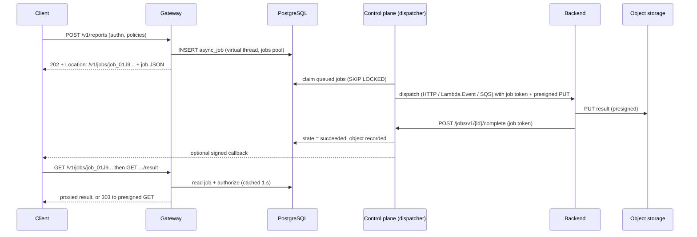

**Exception to hot-path rule 2 (1).** Submitting a job must persist it before answering `202`, so the gateway writes one row to PostgreSQL per submit, and status reads also read it. This is the only data-plane path that touches the database, and it is bounded. The work runs on virtual threads with a dedicated small Hikari pool (`:jobs {:db-pool-size 4}` per gateway node), never on an event loop. If PostgreSQL is unavailable, async submits fail with `503 async.unavailable` and `Retry-After: 5`, while every synchronous route keeps working (rule 5 holds). Status reads are cached per node for 1 s, and the job's terminal states are cached until expiry.

**Responses.** Submit returns `202` with `Location: <status URL>`, `Retry-After: 2`, and `{"id": "job_...", "state": "queued", "statusUrl": "...", "createdAt": "..."}`. Status `GET` returns the state, progress (if the backend reports it), timestamps, `resultUrl` when succeeded, and an error summary when failed. Status URLs are served under the API's host and version, as a per-API generated route `GET {prefix}/jobs/{id}` plus `GET {prefix}/jobs/{id}/result` and `DELETE` (cancel), with the operation's authentication.

### 30.3 Tables and states

```sql
CREATE TABLE stored_object (
  id text PRIMARY KEY, store_id text NOT NULL, bucket text, key text NOT NULL,
  size_bytes bigint, content_type text, sha256 text,
  envelope jsonb,                                   -- wrapped DEK and nonce if BeFive envelope encryption is on
  expires_at timestamptz NOT NULL, deleted_at timestamptz
);
CREATE TABLE async_job (
  id             text PRIMARY KEY,                  -- 'job_' || ULID
  environment_id text NOT NULL,
  api_id text NOT NULL, version_id text NOT NULL, operation_id text NOT NULL,
  owner          jsonb NOT NULL,                    -- subject, application, organization, idp (for authorization)
  state          text NOT NULL CHECK (state IN ('queued','dispatched','running','succeeded','failed',
                                               'expired','cancelled','dispatch_failed','dead')),
  input          bytea,                             -- encrypted request (method, headers allow-list, body)
  input_dek_id   text,
  progress       smallint,
  error          jsonb,                             -- {code, message} supplied by backend, length-limited
  object_id      text REFERENCES stored_object(id),
  attempts       int NOT NULL DEFAULT 0,
  next_attempt_at timestamptz,
  deadline_at    timestamptz NOT NULL,
  expires_at     timestamptz,                       -- result retention end
  created_at timestamptz NOT NULL, updated_at timestamptz NOT NULL
) PARTITION BY RANGE (created_at);                   -- monthly partitions
CREATE INDEX async_job_due ON async_job (state, next_attempt_at) WHERE state IN ('queued','dispatch_failed');
CREATE INDEX async_job_owner ON async_job ((owner->>'application'), created_at DESC);

CREATE TABLE object_access (                         -- every retrieval (also an audit event)
  id bigserial PRIMARY KEY, object_id text NOT NULL, job_id text, at timestamptz NOT NULL,
  actor jsonb NOT NULL, mode text NOT NULL CHECK (mode IN ('proxy','presigned')), client_ip inet, request_id text
);
CREATE TABLE job_callback_delivery (
  id bigserial PRIMARY KEY, job_id text NOT NULL, url text NOT NULL, attempt int NOT NULL,
  status int, error text, at timestamptz NOT NULL
);
```

State transitions: `queued → dispatched` (dispatcher sent it) → `running` (backend acknowledged or reported progress) → `succeeded | failed`. Also `queued|dispatched|running → cancelled` (client `DELETE`, best effort: the backend is told through the callback API when possible), any non-terminal state → `expired` at `deadline_at`, and `dispatch_failed` (retrying) → `dead` after the retry budget (default 10 attempts over 1 hour).

### 30.4 Dispatch

The control-plane dispatcher (all control-plane nodes, `SKIP LOCKED` claims like the action outbox, 14.11) sends each job once per attempt:

| Kind | Mechanism | Backend receives |
|---|---|---|
| `:http-callback` | `POST` to the upstream through the gateway's upstream definitions (pools, TLS, mTLS 9.11), from the control plane | JSON `{jobId, operation, input, callback: {completeUrl, progressUrl, failUrl}, result: {putUrl, headers, expiresAt}, token}` with `X-BeFive-Job-Token` |
| `:lambda-event` | `Invoke` with `InvocationType=Event` (AWS SDK v2) | Same JSON as the event payload; Lambda's own async retries are disabled on the function by recommendation (BeFive retries dispatch) |
| `:sqs` | `SendMessage` (FIFO queues get `MessageGroupId` = application and `MessageDeduplicationId` = job ID) | Same JSON as the message body |

The **job token** is a random 256-bit value stored hashed on the job, valid until the deadline, and scoped to that job's callback endpoints. **Callback listener:** `/jobs/v1/{id}/progress|complete|fail` on a dedicated control-plane listener (default port 9200, `:jobs {:callback-listener {...}}`), separate from the admin listener so it can be exposed to backends without exposing the Admin API. `complete` carries the result metadata (size, content type, sha256). BeFive verifies the object exists (`HeadObject`) before marking `succeeded`, unless the backend posts the result inline (up to 256 KiB, then stored by BeFive).

**Result upload.** For S3 and S3-compatible stores, BeFive provides a presigned `PUT` URL (S3 presigner, already approved) valid for the remaining job time (max 7 days, the SigV4 maximum), with the content type and `x-amz-server-side-encryption: aws:kms` headers. Envelope-encrypted results (30.5) cannot use presigned PUT, because the backend would have to encrypt. In that case the backend posts the result body to `/jobs/v1/{id}/result` (streaming, size-limited) and BeFive encrypts and stores it.

### 30.5 Object storage backends

```clojure
:object-stores {"results-s3" {:kind :s3 :bucket "acme-befive-results" :prefix "prod/"
                              :region "eu-west-1" :sse {:kind :kms :key-id "alias/befive-results"}}
                "minio"      {:kind :s3-compatible :endpoint "https://minio.internal:9000"
                              :bucket "results" :path-style true :credentials #befive/secret "minio-creds"}
                "local"      {:kind :filesystem :root "/var/lib/befive/objects"}}    ; single-node installs only
:jobs {:envelope-encryption false}       ; true: BeFive AES-GCM on top, DEK per object wrapped by the keyring
```

Object keys are `<prefix><env>/<api>/<yyyy>/<mm>/<dd>/<job-id>`, so lifecycle rules can target prefixes. The filesystem store is rejected in clustered mode, because nodes would not share it. IAM for S3: `s3:PutObject`, `s3:GetObject`, `s3:DeleteObject`, and `s3:HeadObject` limited to the prefix, plus `kms:GenerateDataKey` and `kms:Decrypt` on the key. The Terraform example includes a bucket policy that denies non-TLS access and unencrypted puts.

### 30.6 Client callbacks

Applications can register callback URLs (5.6, `:callbacks`, up to 8 per application, validated at registration: HTTPS, public DNS, through the SSRF guard (18.5), and a verification challenge). A job submit may name one registered URL by ID (`X-BeFive-Callback: cb_01...`). Arbitrary URLs in requests are never accepted. On terminal states the control plane posts `{"type": "job.succeeded", "job": {...}}` with Standard Webhooks headers (`webhook-id` = job ID plus state, `webhook-timestamp`, and `webhook-signature: v1,<base64 HMAC-SHA256>`), using a per-application callback secret shown once at registration. Retries use exponential backoff for up to 24 hours. Deliveries are recorded in `job_callback_delivery`. The callback never contains the result itself, only the job status and `resultUrl`.

### 30.7 Retrieval and authorization

- **Who.** The job owner (same application, and same subject if the job was submitted with a user token) or callers that satisfy the `:readers` expression (claims language with `[:owner]`). Organization admins are not readers by default.
- **Modes.** `:proxy` streams the object through the gateway (supports `Range`, respects size limits 8.9, and decrypts envelope-encrypted objects). `:presigned` answers `303 See Other` with `Location` set to a presigned `GET` valid 60 s by default (max 15 minutes) and `Cache-Control: no-store`. Presigned mode is unavailable with envelope encryption.
- **Console retrieval.** In the console, only Administrators can download result files (for support cases). Every such download is audited like a client retrieval.
- **Logging.** Every retrieval writes `object_access` and an audit event (`job.result.retrieved`, with mode), and the access log carries `job_id`. Presigned URLs are never logged (redaction pattern for `X-Amz-Signature`).
- **Errors.** `404` for unknown or invisible jobs (no distinction, to avoid enumeration), `409 async.not_ready` for unfinished jobs, and `410 async.expired` after retention.

### 30.8 Retention

The leader deletes expired results every 10 minutes: objects through `DeleteObject`, then `stored_object.deleted_at`, then the job row's `input` is cleared. Job rows are kept 30 days after expiry for audit (metadata only), then dropped by partition. Retention per endpoint is 72 hours by default, up to 90 days, within the global `:retention` limits (33.1). An S3 lifecycle rule on the prefix (expire after the maximum retention plus 1 day) is recommended as a backstop and included in the Terraform example, so a long control-plane outage cannot leave results forever.

### 30.9 Metrics, security, and tests

- **Metrics:** `AsyncJobsSubmitted`, `AsyncJobsByState` (gauge), `AsyncDispatchFailures`, `AsyncJobDuration`, `AsyncQueueAge` (oldest queued), `AsyncCallbackFailures`, `ObjectRetrievals` by mode, and `AsyncSubmitDbErrors` (gateway).
- **Security.** Job IDs are unguessable ULIDs with 80 random bits, but authorization never relies on that. Job tokens are scoped per job. Results are retrievable only after authorization, presigned URLs are short-lived, client callback targets are pre-registered and verified, and inputs are encrypted at rest. See 18.1 and 18.5.
- **Tests:** LocalStack (S3, SQS, Lambda async), MinIO, and the filesystem store; dispatch retries and `dead`; deadline expiry; callback signatures; presigned URL expiry; authorization property tests (no non-reader retrieves a result); PostgreSQL outage during submit (`503`, sync routes unaffected); and retention deletion including lifecycle backstop documentation.

---

## 31. Telemetry sinks and the Datadog recipe (Draft 4)

This chapter covers OBS-001, OBS-003, OBS-005, and OBS-006 (doc 1, 2.13 and 2.14). The per-node aggregators of 12.3 stay the single source of numbers. Draft 4 adds sink adapters that read the same closed interval and render it for Datadog, OTLP, and Prometheus, plus OpenTelemetry spans and a Datadog Terraform recipe generated from the same catalogs as the CloudWatch recipe.

### 31.1 Architecture

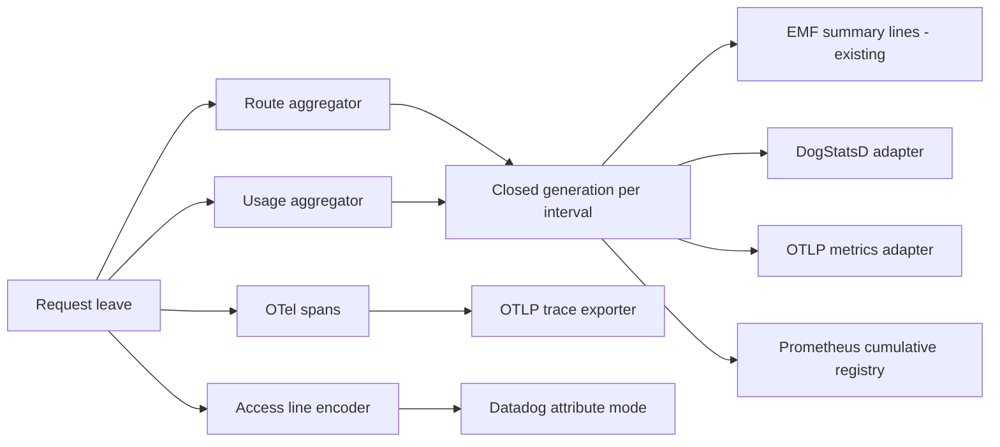

At each flush (12.3.4), the flusher closes the current aggregator generation and hands the immutable value to every enabled sink adapter on its own virtual thread. Sinks never read live counters, so all sinks report the same numbers for the same interval: an interval's request count in Datadog equals the EMF `Requests` sum. A slow or failing sink cannot delay EMF or another sink. Each adapter has a bounded queue of 3 generations; when the queue is full the oldest generation is dropped and `TelemetrySinkDropped{sink}` is incremented.

```clojure
:telemetry {:sinks {:emf        {:enabled true}                         ; existing default
                    :datadog    {:enabled false
                                 :dogstatsd {:socket "unix:///var/run/datadog/dsd.socket"}  ; or {:host "127.0.0.1" :port 8125}
                                 :logs {:mode :datadog}                 ; JSON attribute mapping, 31.3
                                 :tags {"team" "platform"}}
                    :otlp       {:enabled false :endpoint "http://otel-collector:4318" :protocol :http-protobuf
                                 :metrics {:temporality :delta} :headers {"x-tenant" #befive/secret "otlp-tenant"}}
                    :prometheus {:enabled false}}                       ; :9901/internal/prometheus
            :tracing {:enabled false :exporter :otlp :sampler {:ratio 0.05} :queue 2048}
            :cardinality {:consumer-top-k 50 :operation-tags true}}
```

### 31.2 Metric catalog extensions

The catalog in `befive.schema.metrics` (13.1) remains the only list of metric names. Draft 4 adds the metrics defined in 8.9 to 8.11, 9.12, 24.9, 25.8, 28.5, 29.7, and 30.9, and these dimensions:

- **API and operation.** Route summary lines gain `Api`, `ApiVersion`, and `Operation` fields. EMF directives add `[Environment, Api]` for `Requests`, `Status4xx`, `Status5xx`, and `Latency`. `[Environment, Api, Operation]` is opt-in (`:emf {:operation-dimension true}`), because each operation is a billed custom metric. APIs and operations are admin-defined and bounded, never taken from client input.
- **p90.** p90 is a **statistic**, not a new metric: CloudWatch computes it from the EMF value arrays, Datadog distributions compute it server-side, and Prometheus histograms compute it with `histogram_quantile`. The recipes add p90 next to p50, p95, and p99 (13.2).
- **Status classes.** `Status4xx` and `Status5xx` stay. Datadog and OTLP get a `status_class` tag on one `requests` count instead of separate counters, and the recipe expresses 4xx and 5xx rates with tag filters.

### 31.3 Datadog

**Metrics (DogStatsD).** `java-dogstatsd-client` (proposed, doc 1, 3.2), using a non-blocking client with its own sender thread, over a Unix domain socket (recommended on ECS and EKS with the Datadog Agent sidecar or DaemonSet) or UDP. Per closed generation, for each (route, status class):

| Datadog metric | Type | Source |
|---|---|---|
| `befive.requests` | count | `Requests`, tagged `status_class` |
| `befive.request.latency` / `befive.upstream.latency` / `befive.gateway.overhead` | distribution | Latency histograms. Each bucket is sent as a distribution datagram with the bucket's representative value and a sample rate of `1/count` (`value|d|@rate` multi-value packing), so the Agent reconstructs counts without sending one value per request. |
| `befive.auth.failures`, `befive.authz.denials`, `befive.ratelimited`, `befive.bytes.out` | count | Route summary |
| `befive.usage.requests` | count | Usage aggregator, tagged consumer and application (top-k, below) |
| Node gauges, IdP health, cache, async, discovery | gauge or count | Node metric lines and the new subsystems |

**Tags.** Unified service tagging `env:<environment>`, `service:befive-gateway`, `version:<product version>`, plus `route`, `api`, `api_version`, `operation`, `status_class`, `node` (optional, off by default), and `upstream` where relevant. Tags come from bounded configuration values only.

**Cardinality controls.** `consumer` and `application` tags are emitted only for the **top 50** (configurable `:consumer-top-k`) per node per interval by request count, and the rest is folded into `_other`. Exact per-consumer numbers remain in usage lines and rollups (32). The `user` dimension is never a tag. A guard counts distinct tag sets per interval and disables the `operation` tag (logging a warning) if it exceeds a configured limit, default 5,000.

**Logs.** `:logs {:mode :datadog}` makes the access-log encoder add Datadog's standard attributes alongside the BeFive fields: `http.method`, `http.status_code`, `http.url_details.path`, `http.useragent`, `network.client.ip`, `duration` (nanoseconds), `service`, `env`, `version`, `status` (log level), and the correlation fields `dd.trace_id` and `dd.span_id`. Datadog's correlation expects the lower 64 bits of the W3C trace ID as an unsigned decimal string, and the encoder computes it from `trace_id`. With OTLP traces sent through the Agent, Datadog's trace view links to these logs. Lines stay `befive.access/1` with additive fields, so the CloudWatch recipe is unaffected. The Datadog Agent collects stdout from the container. BeFive does not ship logs to Datadog over HTTP.

**Traces.** OTLP to the Agent's OTLP receiver (31.4). No Datadog tracing library is used.

### 31.4 OpenTelemetry traces and OTLP metrics

- **Spans.** The OpenTelemetry Java SDK (proposed) with explicit spans created by BeFive's interceptors; there is no bytecode agent. Per request: a server span `befive.request` (route, API, operation, status, application, never credentials), child spans `befive.authn` (only when an IdP call occurred: JWKS fetch or introspection), `befive.cache` (only on lookups), `befive.composite.step` (28.5), `befive.lambda.invoke`, and the client span `befive.upstream` with standard HTTP semantic-convention attributes. A child `traceparent` is forwarded with the upstream span ID, replacing Draft 3's pure pass-through when tracing is enabled (12.8).
- **Sampling.** Parent-based. A sampled inbound `traceparent` is honored. Otherwise a trace-ID ratio sampler is used whose threshold is consistent with the access-log sampler (12.3.5), so sampled logs and traces largely coincide. Errors cannot be tail-sampled in-process. Customers who need that run a collector with tail sampling.
- **Export.** Batch span processor with a queue of 2,048 spans, 512 per batch, 5 s schedule, and drop when full (`TelemetrySinkDropped{sink="otlp-traces"}`), exported over OTLP/HTTP protobuf (default) or gRPC to an OpenTelemetry collector or the Datadog Agent. Export runs on SDK threads, never on event loops. Cost budget: about 5 µs per span on the request path (20.1), and zero when tracing is disabled (no-op tracer).
- **OTLP metrics.** A custom `MetricProducer` adapter turns each closed generation into OTLP sum and histogram points, with delta temporality by default (cumulative optional), exported with the SDK's `PeriodicMetricReader` aligned to the flush interval. Histogram bucket boundaries are the aggregator's boundaries, so no requantization occurs.

### 31.5 Prometheus

`GET :9901/internal/prometheus` (operations port, never public) returns text exposition format version 0.0.4, rendered in-house: cumulative counters and histograms built by adding each closed generation into a per-node cumulative registry. Metric names use the `befive_` prefix with `_total`, `_seconds`, and `_bytes` suffixes. Histogram buckets are a fixed subset of the aggregator buckets (25 buckets). Labels follow the same cardinality rules as Datadog (top-k consumers, no users). A restart resets counters, which Prometheus handles. Scrape responses are cached for 1 s.

### 31.6 Datadog Terraform recipe

`modules/datadog-recipe` renders a Terraform module (JSON syntax, like 13.1) using the `datadog` provider:

- **Dashboards** (`datadog_dashboard_json` resources) mirroring the CloudWatch operations, security, and usage dashboards (13.2): request rate, 4xx and 5xx rates, p50/p90/p95/p99 latency by API and operation, upstream latency, rate-limit and authentication events, IP blocks, IdP health, cache hit ratio, deprecated usage, and top consumers.
- **Monitors** (`datadog_monitor`) mirroring the CloudWatch alarms (13.4), with the same default thresholds, as variables. Notification handles are variables.
- **Log pipeline** (`datadog_logs_custom_pipeline`) with a status remapper, date remapper, service remapper, attribute remappers for BeFive fields that Datadog does not map by default, and the `trace_id` mapping. **Facets** are created where the provider supports them. Where it does not, the README documents the facet list and a small script using the Datadog API that the customer can run.
- **Generated from the catalog.** Metric names, tags, and log attributes are checked against `befive.schema.metrics` and the access-log catalog at build time (13.1), so the Datadog and CloudWatch recipes cannot drift. CI runs `terraform validate` on the output.
- Inputs: `env`, `service`, notification handles, thresholds, and the optional Datadog site.

### 31.7 Failure modes and tests

- A missing Agent socket: DogStatsD drops silently in the client. BeFive counts send errors from the client's error handler (`TelemetrySinkErrors{sink="datadog"}`) and reports the sink as degraded in readiness details (never not-ready).
- An OTLP collector outage: the batch queue drops when full and exports are retried by the SDK with backoff.
- **Tests:** the sink agreement test (one generated traffic pattern, every sink's totals equal the EMF sums); Testcontainers with a Datadog Agent container (DogStatsD intake, log collection, OTLP intake) and an OpenTelemetry collector with file exporter; `promtool check metrics` on the Prometheus output; cardinality guard tests; trace-log correlation ID conversion tests; and overhead benchmarks with tracing on and off.

---

## 32. Reporting: rollups, report builder, schedules, and exports (Draft 4)

This chapter covers OBS-007 (doc 1, 2.15). Reports read PostgreSQL rollups produced by the leader from the per-minute summaries that gateways already ship for anomaly detection (14.3). They never read access lines, so they are exact with or without sampling (12.3).

### 32.1 Source data

The `befive.signals/1` payload (14.3) is extended **additively** with a `usage` part. It holds one entry per (application or consumer, operation or route, status class) with requests, 4xx, 5xx, rate-limited, bytes in and out, latency sum, and a coarse latency histogram, taken from the usage aggregator at flush. The entries carry an `api`, `api_version`, `operation`, `organization`, `deprecated`, and `classification` context taken from the compiled route. The same top-N rule as the existing `consumers` part applies (default 5,000 pairs per node per minute, the rest folded into `_other` per operation), and the payload limit stays 256 KiB gzip. Older gateways without the part still produce correct anomaly signals, and their usage appears in reports only at the route level during a mixed-version upgrade (21.2).

### 32.2 Rollup tables

```sql
CREATE TABLE rollup_1m (
  minute          timestamptz NOT NULL,
  environment_id  text NOT NULL,
  api_id text, version_id text, operation_id text, route_id text NOT NULL,
  organization_id text, consumer_id text, application_id text,
  status_class    smallint NOT NULL,            -- 2, 3, 4, 5; 0 = no response (aborted)
  deprecated      boolean NOT NULL DEFAULT false,
  requests        bigint NOT NULL, rate_limited bigint NOT NULL,
  bytes_in bigint NOT NULL, bytes_out bigint NOT NULL,
  latency_ms_sum  double precision NOT NULL,
  latency_hist    int4[] NOT NULL,              -- 64 log-spaced buckets, 1 ms .. 60 s
  partial         boolean NOT NULL DEFAULT false
) PARTITION BY RANGE (minute);                    -- daily partitions, kept 8 days by default
CREATE INDEX ON rollup_1m (environment_id, api_id, minute);
CREATE INDEX ON rollup_1m (application_id, minute);

CREATE TABLE rollup_1h (LIKE rollup_1m INCLUDING DEFAULTS) PARTITION BY RANGE (minute);  -- column holds the hour; monthly partitions, 13 months
CREATE TABLE rollup_events_1h (                   -- policy and security events for reports (denials, IP blocks, auth failures by reason)
  hour timestamptz NOT NULL, environment_id text NOT NULL, api_id text, route_id text,
  application_id text, event text NOT NULL, reason text, count bigint NOT NULL
) PARTITION BY RANGE (hour);
```

- **Build.** After the leader merges a minute (14.4), it aggregates the `usage` parts of all nodes for that minute into `rollup_1m` (one `INSERT ... SELECT` from a `VALUES` batch, using `COPY` for large minutes). Late inbox rows trigger an upsert for the affected keys. At hour + 5 minutes, the leader rolls the 60 minutes into `rollup_1h` with `INSERT ... SELECT ... GROUP BY`. Histograms are merged with a custom SQL aggregate `befive_hist_sum(int4[])` (element-wise sum, written in SQL/PLpgSQL, no extension needed). Quantiles are computed in the query layer from merged histograms, so p50, p90, p95, and p99 are available for any grouping, with bucket-width error (about 9% relative width per bucket, so reported quantiles are within one bucket of the true value).
- **Retention.** Whole partitions are dropped: `rollup_1m` after 8 days (1 to 35), `rollup_1h` after 13 months (up to 36), following `:retention` (33.1). Partitions are created 2 days or 1 month ahead.
- **Cardinality cap.** Per minute, at most 20,000 rows per environment (configurable). Beyond that, the lowest-volume application keys are folded into `_other` per operation, and the minute is flagged so reports can show "includes folded rows".

**Storage estimate (an estimate, not a measurement).** With 1,000 active (application, operation, status-class) combinations per minute and about 150 bytes per row on disk, `rollup_1m` grows by about 216 MB per day, so about 1.7 GB for 8 days. Hourly rows for the same combinations (about 1,000 × 24 × 395 days × ~400 bytes) come to about 3.8 GB for 13 months at the high end, with fewer rows when combinations are sparse in an hour. 500 combinations roughly halves both figures. Indexes add about 30–50%. The sizing guide (20.3) will restate these after benchmarking with the dataset in 20.5.

### 32.3 Report query model

A report definition is EDN, validated with malli and compiled to SQL with HoneySQL (already approved):

```clojure
{:id "deprecated-usage"
 :dataset :usage                                ; :usage | :performance | :errors | :security-events | :audit | :consumers
 :measures [:requests :error-rate-5xx :p90-latency-ms :last-call]
 :dimensions [:api :api-version :operation :organization :application]
 :filters [[:= :deprecated true] [:in :environment ["prod"]]]
 :time {:range :last-30-days :bucket :day}        ; :minute (≤ 8 days), :hour, :day, :week, :month
 :sort [[:requests :desc]] :limit 1000}
```

- **Catalog.** Each dataset declares its measures, given as SQL expressions over rollups (`sum(requests)`, `sum(requests) FILTER (WHERE status_class = 5) / nullif(sum(requests),0)`, quantiles from `befive_hist_sum`), and its dimensions with their columns and display joins (names from `api`, `application`, `organization`). Unknown names are validation errors, so a report cannot express arbitrary SQL.
- **Table choice.** `rollup_1m` for buckets under an hour and ranges within its retention, otherwise `rollup_1h`.
- **Execution.** Read-only transaction, `statement_timeout = 30s`, a result row cap of 100,000 for exports and 5,000 for the console view, and parameters bound by HoneySQL (no string concatenation). Long reports for exports run in the background with progress events (15.9).
- **RBAC.** Report access follows 15.6. Administrators and Auditors see all datasets (the audit dataset only for them). Operators see usage, performance, errors, and policy events. Automation Managers see performance, errors, and policy events. Consumer Managers see usage and consumers. API Owners see datasets for their own APIs only, enforced by an injected filter `api_id = ANY(:owned)` that the user cannot remove. Saved reports record their owner and visibility (private, role, everyone with access).
- **API.** `POST /admin/v1/reports/run` (ad hoc), `/admin/v1/report-definitions` (CRUD), and `GET /admin/v1/report-runs/{id}/download`.

### 32.4 Schedules and delivery

`report_schedule` (definition, cron expression in a time zone, format, delivery, enabled, owner) is evaluated by the leader every minute. A due schedule creates a `report_run` row (state, started and finished times, row count, sha256, error) and executes on a virtual thread with the owner's permissions at run time, so a demoted owner's schedule fails rather than leaking. Deliveries:

- **Download:** the file is stored in the configured object store (30.5) or in PostgreSQL for small files (under 5 MiB), with a link in the console. Files are retained 30 days.
- **Email:** Angus Mail (kept in 1.0 for approvals and reports, decision 10 of doc 1), as an attachment up to 10 MiB or as a link. Recipients come from a configured allow-list of domains.
- **S3:** `PutObject` to a configured bucket and prefix (SSE-KMS recommended), with a manifest JSON like 13.5.

Formats: CSV (RFC 4180, UTF-8 with an optional BOM for Excel), JSON (array or NDJSON), and XLSX through `fastexcel` if approved (doc 1, 3.2; otherwise the option is hidden). Exports stream rows from a server-side cursor, so memory stays flat.

### 32.5 Shipped saved reports and the Draft 3 monthly report

The shipped saved reports are: monthly usage by consumer and application (the successor of 13.5's CSV with the same columns plus application and operation), deprecated usage (27.4), error rates by API, latency percentiles by operation, top consumers, policy and security events, and access requests and approvals. The 13.5 Logs Insights job stays available for customers who want usage reports directly from CloudWatch without database access (for example from an audit account), and its manifest format is shared.

**Tests.** Rollup correctness: generated traffic, then rollup sums equal the aggregator totals (the extension of the 14.3 property). Late-row upserts. Histogram aggregate quantile accuracy against exact quantiles of generated distributions. Query-model validation property tests (no definition produces SQL outside the catalog). RBAC row-filter tests. Schedule time-zone and DST tests. Export streaming memory tests.

---

## 33. InfoSec: retention, audit coverage, and evidence export (Draft 4)

This chapter covers OBS-008, GOV-1, GOV-5, and GOV-6 (doc 1, 2.16).

### 33.1 Retention settings

One settings document, `:retention`, governs every store BeFive writes itself. Customer log destinations (CloudWatch, Datadog) have their own retention, which the recipes set from variables:

```clojure
{:retention {:audit-days 2555               ; 7 years default; min 365; deletion keeps the chain verifiable (33.2)
             :rollup-1m-days 8 :rollup-1h-months 13
             :signals {:minute-days 8 :topk-hours 24 :exemplar-hours 24}    ; 14.4
             :source-ip {:rollups :none :access-requests :truncate-after-90d}  ; IP data minimization
             :job-results-max-hours 2160    ; cap for per-endpoint retention (30.8)
             :report-files-days 30
             :access-requests-days 1095
             :llm-prompts-days 30           ; from 1.1 (14.14)
             :portal-sessions-days 30
             :config-change-days 365}}      ; rollback window (6.8)
```

- **Enforcement.** The leader runs retention once per hour, dropping partitions where tables are partitioned and deleting in batches of 10,000 otherwise. Each run writes one audit event with counts per store.
- **Legal hold.** `POST /admin/v1/retention/holds` (Administrator) suspends deletion for named stores and an optional time range, with a reason. Holds are audited and listed in evidence exports.
- **Validation.** Values below documented minimums are rejected: audit 365 days, config changes 30 days.

### 33.2 Audit coverage of new actions

The `befive.audit/1` schema (12.5) is unchanged. Draft 4 adds actor types and actions:

- **Actor types:** `user` (console), `token` (automation token), `developer` (portal user), `system` (scheduled jobs, retention), `rule` (anomaly response rule), and `link` (a linked environment acting through the link protocol, 34.2).
- **New actions:** APIs, versions, and operations (`api.*`, `api_version.transition`, `openapi.imported`), policy attachments and locks (`policy_attachment.*`, `policy.lock_changed`), classification settings, access requests and approvals (24.9), Okta app calls, applications and keys from the portal, subscriptions, cache purges (29.6), job result retrievals (30.7), report definitions, schedules, and runs, evidence exports, retention runs and holds, telemetry sink settings, JWT signing key rotation and revocation (9.10), break-glass logins (9.12, severity critical), linked-environment registration, bundle signing, and promotion steps (34.6). The Admin API audits every mutation by construction (reitit middleware), and new endpoints register their action names in the catalog, so the evidence export can list coverage.
- **Retention and the hash chain.** Deleting old audit events would break `prev_hash` verification at the boundary. Before deletion, a **checkpoint** event records the hash of the last deleted event and the count, signed with the install's evidence key (33.3). Verification starts from the newest checkpoint.

### 33.3 Evidence export

An evidence export is a signed archive for a chosen period, produced by `POST /admin/v1/evidence-exports` (Administrator or Auditor) or `b5ctl evidence export --from --to`:

| File | Contents |
|---|---|
| `manifest.json` | Install ID, environment, period, product version, generation time, requester, file list with SHA-256, and the evidence public key ID |
| `manifest.sig` | Ed25519 signature over the canonical manifest |
| `configuration/` | Configuration as of the period end (EDN, secrets as references only) and the revision list in the period |
| `effective-policies.json` | Effective policy with provenance for every operation (23.6) |
| `audit/events.ndjson` + `audit/verification.json` | Audit events in the period and the chain verification result from the nearest checkpoint |
| `keys/inventory.csv` | API keys, automation tokens, JWT signing keys, certificates: metadata only (IDs, owners, created, expires, last used, state), never secrets or hashes |
| `access/requests.csv` | Access requests with decisions, approvers, and timestamps; subscriptions active in the period |
| `access/roles.csv` | Console users, role mappings, API Owner scopes, break-glass usage |
| `retention.json` | Retention settings and holds |
| `security-events.csv` | From `rollup_events_1h`: authentication failures, denials, and IP blocks by API and day |

- **Signing.** The evidence key is an Ed25519 key pair per install, with the private key in the secret store. The public key is shown in the console and can be fetched from `/.well-known/befive/evidence-key`, so auditors can pin it. `b5ctl evidence verify <archive> [--key <pem>]` checks every file hash and the signature, and re-verifies the audit chain from the files.
- **Execution.** Exports run in the background (`evidence_export` table: state, period, requester, sha256, object location) and are stored in the object store or PostgreSQL. Downloads are audited. Archives are zip with deterministic ordering.
- **Tests:** tampering any file or the manifest fails verification; chain verification across a retention checkpoint; RBAC; deterministic output for the same inputs.

---

## 34. Linked environments, signed bundles, overlays, and promotion (Draft 4)

This chapter covers API-007 and POL-004 (doc 1, 2.12). Each environment (Dev, Test, Prod, Sandbox) is its own BeFive cluster with its own control plane and PostgreSQL (decision 24). Linking lets environments exchange signed bundles and catalog feeds without sharing databases or credentials.

### 34.1 Model

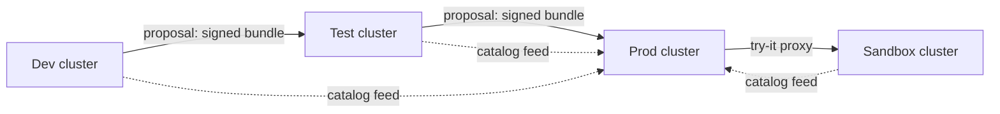

Promotion is **push a proposal, pull nothing automatically**. The source sends a proposal, and the target decides: it verifies the bundle, diffs it, requires approval, and applies it. A target never applies a bundle without its own approval step, unless an Administrator enables auto-apply for a non-production link (`:auto-apply true`, never allowed when the target is marked `:production true`).

### 34.2 Link registry and handshake

```sql
CREATE TABLE linked_environment (
  id             text PRIMARY KEY,               -- 'test', 'prod', 'sandbox'
  name text NOT NULL, base_url text NOT NULL,    -- the peer's link listener, e.g. https://befive-cp.test.example.com:9300
  peer_key       jsonb NOT NULL,                 -- peer's Ed25519 public JWK (link key)
  our_key_id     text NOT NULL,                  -- our link key (private key in the secret store)
  roles          text[] NOT NULL,                -- {'promote-to','promote-from','catalog-feed','try-it-target'}
  state          text NOT NULL CHECK (state IN ('pending','active','suspended')),
  production     boolean NOT NULL DEFAULT false,
  sandbox        boolean NOT NULL DEFAULT false,
  try_it_base_url text,                          -- 25.7
  last_contact_at timestamptz, created_at timestamptz NOT NULL
);
```

- **Handshake.** An Administrator in the target creates an invitation (`POST /admin/v1/links/invitations`). It returns a one-time code (32 random bytes, valid 24 h) plus the target's link URL and key fingerprint. An Administrator in the source enters the code and URL. The source then calls `POST /link/v1/handshake` with its public key and an HMAC of the payload under the code. Both sides store each other's public key and show the fingerprints for out-of-band comparison. The link becomes `active` after the target confirms. No shared long-lived secret exists afterwards.
- **Link protocol.** `/link/v1/*` on a dedicated control-plane listener (default port 9300, mTLS optional). Every request is signed: the header `X-BeFive-Link-Signature` carries an Ed25519 signature over method, path, timestamp, nonce, and body digest, from the sender's link key. Verification checks ±5 minutes and a nonce cache. Endpoints: `proposals` (submit, status), `catalog` (feed, 25.6), `specs/{sha256}`, `promotions/{id}/events` (status back to the source), and `health`.
- **Keys.** Link keys rotate through a re-handshake or a signed key-rollover message, accepted only when signed by the current key. Suspending a link rejects all its requests. Link actions are audited with actor type `link`.

### 34.3 Bundles

A bundle is the promotable subset of configuration plus specs, canonical and signed:

```
bundle-orders-2026-10-01T1200Z.b5b       (zip, deterministic order)
├── manifest.edn          ; bundle id, source env, source revision, created by, created at, selection,
│                          ; file list with SHA-256, schema/feature level (21.3), required overlay variables
├── manifest.sig          ; Ed25519 over the canonical manifest, by the source env's link key or a CI key
├── config/*.edn          ; apis, versions, operations, services, upstreams (with #befive/var), policies,
│                          ; policy attachments (non-environment), composites, classification, dictionary terms
└── specs/<sha256>.json   ; normalized OpenAPI documents
```

- **Selection.** By API (with its versions, operations, attachments, referenced services, upstreams, policies, and composites), by label, or everything promotable. Consumers, applications, credentials, subscriptions, secrets, certificates, runtime overrides, and environment-level attachments are never included. Secrets appear only as references (`#befive/secret "name"`), which must exist in the target.
- **Variables.** Environment-specific values are written as `#befive/var "orders.upstream.url"` in the source. A bundle's manifest lists its required variables. The target resolves them from its overlay (34.4), and a missing variable is a validation error at proposal time.
- **CI path.** `b5ctl bundle create --api orders --out b.b5b` builds a bundle from a running environment or from a Git directory (16.3). `b5ctl bundle sign --key ci.pem` signs it with a CI key that the target trusts (`:trusted-bundle-keys`, Administrator-managed). `b5ctl bundle verify` checks hashes and signatures offline. `b5ctl promote --bundle b.b5b --to prod` submits a proposal directly to the target's link endpoint, authenticated with an automation token and a trusted signature. This lets pipelines promote without the console (POL-004).

### 34.4 Overlays

```clojure
;; overlay in Prod (stored in env_overlay, edited in the console or overlays/prod.edn)
{:vars {"orders.upstream.url" "https://orders.prod.internal:8443"
        "orders.discovery" {:kind :cloud-map :cloud-map {:namespace "prod.internal" :service "orders"}}
        "okta.issuer" "https://acme.okta.com/oauth2/aus1prod"}
 :attachments [{:scope {:level :environment} :kind :ip :value {:allow [#befive/ip-set "corp"]} :locked true}]
 :settings {:telemetry {...} :cache {:memory-mb 512}}}
```

- `env_overlay` is one row per environment with history in `config_change` like other configuration. Overlays are edited only by Administrators and Operators.
- Variables can hold scalars or maps (for whole discovery or TLS blocks). Their types are checked where they are used, after substitution, by the normal schemas.
- Environment-level attachments live only in the overlay, which is how an environment can be stricter than the promoted configuration without changing it (23.1).

### 34.5 Promotion flow

```mermaid
sequenceDiagram
    participant S as Source CP (Test)
    participant T as Target CP (Prod)
    participant A as Approver (Prod)
    S->>S: build + sign bundle (selection)
    S->>T: POST /link/v1/proposals (signed)
    T->>T: verify signatures, hashes, feature level, trusted key
    T->>T: resolve overlay vars, validate, diff vs current, effective-policy diff, lock check
    T-->>S: proposal accepted (id)
    A->>T: review diff, approve (separation of duties)
    T->>T: apply as ONE revision (source=promotion, bundle id)
    T-->>S: promotion events (applied, revision, rolled-back)
    T->>T: audit; S audits its side
```

- **Promotion table.** `promotion` (id, link, bundle id and hash, source revision, state `proposed|validated|rejected|approved|applying|applied|failed|rolled-back|superseded`, diff summary, approvers, target revision) and `promotion_event` (timeline). A newer proposal for the same selection supersedes an unapproved older one.
- **Diff.** The configuration diff of 16.2 plus the effective-policy diff (23.6) per affected operation, lifecycle state changes, and breaking-change analysis for specs (26.3), with callers in the target environment.
- **Approval.** By default one approval by an Administrator or Operator in the target, and two approvals for links into `:production` targets. Separation of duties applies: the person who created the bundle in the source (recorded in the manifest by user identity, matched by email or IdP subject) cannot approve in the target. API Owners can request promotions of their own APIs but cannot approve them; Operators cannot approve their own requests (15.6).
- **Apply.** One transaction, one revision with `source = promotion` (6.10), and the same propagation as any change. If the target changed after validation, apply revalidates and fails safely (`409`), and the approver re-reviews.
- **Rollback.** The target's normal rollback (6.8) of the promotion revision marks the promotion `rolled-back` and notifies the source. The source never rolls back the target.
- **Sandbox and Dev.** Promotion is not required to be linear. Links define allowed directions (`promote-to` roles), so Dev → Test → Prod and Dev → Sandbox are both expressible.

### 34.6 Failure modes, security, and tests

- **Failure modes.** A target that is unreachable leaves the proposal queued in the source outbox with retries. Signature or hash failures reject the proposal with `link.bundle_invalid` and a critical audit event in the target. Feature-level mismatch (the target runs an older version) is rejected with the required level (21.3).
- **Security.** Ed25519 link keys per environment; signed requests with replay protection; no database or credential sharing; bundles cannot carry secrets or consumer data; target-side approval; trusted CI keys managed by Administrators; and full audit on both sides.
- **Audit actions:** `link.created|suspended|key_rotated`, `bundle.created|signed`, `promotion.proposed|validated|rejected|approved|applied|failed|rolled_back`.
- **Tests:** two- and three-cluster Testcontainers setups with a promotion end to end; tampered bundles, wrong keys, and replays; missing overlay variables; concurrent target changes between validation and apply; rollback notification; and determinism (the same selection produces byte-identical bundles).

---

## 35. Open questions and risks

This chapter was chapter 23 in Draft 3. Question numbers 1 to 15 are kept so that earlier references stay meaningful; resolved questions are marked.

### 35.1 Open questions (need a decision from the user)

1. **Per-IP pre-authentication rate limiting.** The MVP relies on the load balancer and AWS WAF for unauthenticated floods. Add a simple per-IP limiter before authentication in the MVP? (The temporary IP block action in 14.12 covers bursts detected by anomaly rules, but it is not a rate limiter.)
2. **Quota time zone.** Monthly quotas use UTC calendar months. Is per-plan time zone needed for the first customers?
3. **TOTP for local admin accounts.** Local accounts are break-glass only; is MFA on them required for the first enterprise buyers?
4. **FIPS 140-3.** Some regulated buyers require FIPS-validated crypto. That affects the TLS provider and JDK choice. Target it post-MVP?
5. **Upstream HTTP/2.** Deferred with gRPC. Confirm no first customer needs HTTP/2 to backends.
6. **Evaluation mode limits.** Is "1 gateway node, all features, no time limit" the right evaluation shape, or should evaluation be time-limited?
7. **Custom domain Okta deployments** with custom authorization servers behind a custom URL: confirm the wizard should accept arbitrary domains (it does in this design) rather than only `*.okta.com`/`*.oktapreview.com`.
8. *Resolved in Draft 4:* the gateway-signed internal JWT is in 1.0 as an option (9.10; doc 1, decision 15).
9. *Resolved in Draft 4.1:* BeFive stays the working name; the trademark and search-confusion check is a pre-launch checklist item, not an open question (doc 1, decision 6). Derived names still change mechanically if needed.
10. *Resolved in Draft 4.1:* a fixed Automation Manager role edits rules and scripts, enables and configures traffic actions, and manages detectors and silences; Administrators keep all rights; Operators (and Administrators) approve and revert traffic actions (15.6).
11. *Resolved in Draft 4.1:* 1.0 ships IP block and rate-limit tightening; consumer block and route disable are 1.1 or later (14.11, 14.12).
12. **ServiceNow releases** (partly resolved: Event Management moved to 1.1, so 1.0 uses the incident target only). Do the first customers need ServiceNow releases older than Washington DC (basic authentication only), for incidents and for access-request records (24.5)?
13. **LLM defaults** (now for 1.1, together with DEV-006). Off by default, analysis only for `:high` and above, IP hashing and consumer pseudonymization on, 90-day retention of prompts. Which providers must be certified for the first customers (OpenAI, Azure OpenAI, Bedrock, vLLM), and do their policies require zero-data-retention endpoints?
14. **Source-IP retention.** Per-IP sketches are kept 24 hours by default for privacy. Do security teams need longer (up to 7 days is allowed)?
15. **External alert formats.** Accept Prometheus Alertmanager webhooks natively in the MVP, or only the generic format (Alertmanager through a small relay)?
16. *Resolved October 1, 2026:* Okta apps that BeFive creates use `private_key_jwt` only, with no client secrets. By default developers upload only their public key and BeFive never holds the private key; BeFive-generated keys are an opt-in, Administrator-only install setting, excluded for Restricted APIs (24.8). Update 3: a generated private key is deleted from the secrets store immediately after the one-time download, or after 24 hours if it is never downloaded.
17. *Resolved October 1, 2026:* partners may access the 0.x preview from outside; it is not internal-only by default, and the internet-exposure measures and a portal-preview security review apply from 0.x (25.1, 25.3).
18. *Resolved October 1, 2026:* deprecation notice emails to developers are in 1.0 (27.5; `03-ui-design.md` question 9).
19. *Resolved October 1, 2026:* the IETF `RateLimit`/`RateLimit-Policy` headers stay the default, `X-RateLimit-*` stays an option, and BeFive tracks the final RFC wording (11.5).

### 35.2 Risks

| Risk | Impact | Mitigation |
|---|---|---|
| Aleph integration depth: custom `SniHandler`, Proxy Protocol, and HTTP/2 through `:pipeline-transform` may fight Aleph's pipeline assumptions | Milestone 2 slip | Spike in milestone 2 week 1; fallback is writing the server bootstrap directly on Netty while keeping Aleph's client and Manifold streams. |
| `ByteBuf` reference-count leaks with raw streams | Memory growth, crashes under load | Single ownership rule in the proxy interceptor; PARANOID leak detection in CI; soak tests. |
| Sampling misread: operators treat sampled Logs Insights counts as exact, or clients steer their own trace IDs out of the sample | Wrong numbers in reviews; gaps in forensic logs | Weighted queries and "estimated" widget subtitles (13.2); exact metrics and usage lines for anything billed or alarmed; always-keep for errors and denials; `:randomness :keyed` and sampling off for security-record use (12.3.5). |
| JVM p99 under 5 ms at 10,000 requests/s on 4 vCPUs is ambitious with TLS and JWT | Missed target | Budget in 20.1, early benchmarks from milestone 2, ZGC, option to evaluate BoringSSL. Targets stay targets until measured. |
| CloudWatch ingestion cost surprises buyers (one line per request is the default) | Sales objection | Published cost arithmetic (12.3.8), compact field mode, Infrequent Access for access lines, and the optional sampling mode with exact metrics and usage. |
| KMS unavailable while DB is also down during a node restart | New nodes cannot decrypt secrets and stay not-ready | Running nodes unaffected; document the dependency; optional cached-wrapped-key mode for `env`/`file` sources. |
| Plugins are trusted code with no sandbox | Customer plugin crashes or compromises a node | Clear documentation, per-node plugin inventory with hashes, exception isolation; sandboxed policy expressions remain post-MVP (doc 1, 2.11). |
| Clojure namespace sharing between plugins | Dependency conflicts between customer plugins | Detection and clear refusal; publish the product's dependency list per release. |
| GraalVM native-image with SCI and the shared schema module | CLI build breakage | CI builds native binaries on every merge; keep `schema` free of reflection-heavy libraries. |
| Aleph and Manifold maintenance pace | Long-term support risk for a perpetual product | The pipeline executor and proxy isolate Aleph behind small interfaces (`befive.gateway.server`, `befive.gateway.client`); Netty itself is the stable foundation. |
| LISTEN/NOTIFY through connection poolers (PgBouncer transaction mode) | Slower propagation | Poll fallback and documented 2 s poll setting; recommend direct connections for gateway LISTEN. |
| Single global revision lock | Contention if many admins write concurrently | Admin write rates are low; measure; batch writes through `apply`. Automation writes (runtime overrides) are rate-limited to 10 per hour by the rails. |
| Anomaly response enlarges the MVP (signals, detectors, rules, script runner, six integrations, console screens) | Later first release | Separate milestone after the observability milestone; build order puts detection, console incidents, and ServiceNow first, then LLM, then traffic actions; traffic actions can ship in dry-run and approval modes first without changing the design. |
| False positives and alert fatigue | Customers disable the feature or ServiceNow teams reject it | Conservative built-in detectors that only notify the console; M-of-N confirmation, hysteresis, minimum volumes, grouping, storm limits; replay harness and console simulation before enabling rules; precision gates in CI (22). |
| ServiceNow instances differ (states, close codes, mandatory fields, business rules, ACLs) | Create or resolve fails at customers | Everything instance-specific is configuration; step-by-step connection test with a real test incident; outbox keeps failed actions visible and retryable. |
| LLM output is wrong or overconfident | Misleading incident text | Labeled unverified AI guess with confidence and cited evidence, invalid citations flagged, advisory-only design, off by default. |
| Native-image script runner (SCI) build and platform coverage | Scripts unavailable on some platforms | Built in CI on every merge for linux-amd64 and linux-arm64 like `b5ctl`; EDN rules work without the runner. |
| PostgreSQL load and storage from signals | Database growth, slower admin queries | Compact gzip rows, daily partitions dropped by retention, rollups; sizes shown in Settings; benchmark scenario 13 (20.5). |
| Draft 4 scope size (portal, workflow, OpenAPI pipeline, composites, cache, async, sinks, reports, promotion) | Later 1.0 (doc 1, 4.3: about 2.1 to 2.7 times the Draft 3 MVP, an estimate) | Each subsystem is isolated behind its own component and chapter; the 0.x build carries the gateway, Okta, policy hierarchy, telemetry, and the read-only portal preview; dry-run and approval-only automation is the remaining scope reserve. |
| Netty version conflict between Aleph and the AWS SDK async client (doc 1, R3) | Lambda, SQS, S3, Cloud Map unusable, or runtime errors | One pinned Netty version with a CI convergence check, separate SDK event loops, CRT client fallback (8.10). |
| Policy hierarchy surprises (doc 1, R4) | Operators cannot tell why a request is denied or allowed | Effective policy view with provenance and lock reasons, previews on every change, property-tested resolution (23). |
| Okta Management API credential and client keys (doc 1, R11) | A leaked credential can create applications in the customer's Okta org; with the opt-in generated keys, a secret-store compromise could expose client private keys | Off by default, least privilege, secret store, audit, rate rail, Restricted excluded; client keys are developer-uploaded public keys by default (BeFive holds no private key); generated keys are Administrator opt-in, never for Restricted APIs, downloadable once, and deleted from the secrets store right after the download or after 24 hours if never downloaded (Update 3); immediate deactivation on a compromise report (24.8). |
| Cross-cluster portal (doc 1, R12) | Stale or inconsistent catalog across environments; try-it depending on the Sandbox cluster | Signed feeds with age display and stale marking; try-it errors are explicit; production metadata wins (25.6, 25.7). |
| The async job path touches PostgreSQL from gateways | Database latency or outage affects async submits | Bounded exception with its own pool, `503` on outage, synchronous routes unaffected (30.2). |
| IETF rate-limit header draft changes before publication | Client incompatibility | Versioned setting with `X-RateLimit-*` option; BeFive adopts the final RFC wording and keeps the draft syntax selectable for one major release (11.5). |

---

## Appendix A: Decisions this document adds beyond doc 1 (please confirm)

1. Separate operations port 9901 for health, readiness, and internal metrics; data-plane ports do not expose them by default.
2. JSONB document storage with extracted relational columns; natural slug IDs for configuration entities; soft delete only for consumers; credentials revoked, never deleted.
3. One global config revision serialized by a row lock; deltas from `config_change` with full-snapshot fallback; last-known-good snapshot files on local disk (default on).
4. In-house Sieppari-compatible pipeline executor instead of depending on Sieppari.
5. Fixed phase order with four plugin extension phases (`:pre-auth`, `:post-auth`, `:pre-proxy`, `:response`); rate limiting after authorization.
6. `:any` authentication mode does not fall through after a present-but-invalid credential.
7. JWKS and introspection fetched with Aleph's non-blocking client, Nimbus used for parsing and verification only.
8. Panic routing on by default when all targets are unhealthy.
9. Upstream protocol HTTP/1.1 only in the MVP.
10. *Changed in Draft 4:* rate-limit headers default to the IETF draft `RateLimit-Policy`/`RateLimit` fields plus `Retry-After`, with `X-RateLimit-*` as a setting (11.5); monthly quotas are UTC calendar counters; clusters without Redis divide limits by live node count.
11. EMF dimension design: `[Environment]` and `[Environment, Route]` only (plus the `_unmatched` pseudo-route); consumers analyzed with Logs Insights on usage and access lines, not metrics.
12. Live console metrics pushed through an `UNLOGGED` PostgreSQL table, streamed to browsers with Server-Sent Events.
13. Monthly usage report as an EventBridge Scheduler → ECS task running the same image (not a Lambda). This adds the AWS SDK for Java v2 (CloudWatch Logs, S3, KMS modules) to the stack.
14. SCI embedded in the native CLI to evaluate DSL files (new dependency).
15. RE2J for header-match regular expressions (new dependency, linear-time matching).
16. Audit log hash chain for tamper evidence.
17. License file as JSON with base64url payload and Ed25519 signature; uncovered builds refuse to start the gateway role, running builds never stop; node limits are warnings only.
18. Cluster feature level gating for mixed-version safety.
19. JDK TLS provider in the MVP (BoringSSL evaluated later).
20. cosign key-pair signing (not keyless) for air-gapped verification.
21. First-run setup protected by a one-time bootstrap token printed to the container log.
22. Live console metrics retained 2 hours at 10-second resolution and 24 hours at 1-minute resolution in PostgreSQL.
23. EMF metrics come from per-node route summary lines every 60 s (latency as expanded log-linear histograms) in both logging modes, not from per-request lines; doc 1, 2.5 is updated to match.
24. Usage accounting (monthly report, usage and quota widgets) comes from per-node usage summary lines, with a sequence-number completeness check in the report.
25. Optional access-log sampling, off by default: trace-ID-consistent (OpenTelemetry rule), per-route rates, always-keep rules with a per-node keep budget, admin-enabled force-log header, and `sample_rate`/`in_sample`/`log_reason` on every line.
26. Four log groups on AWS (`/befive/access`, `/befive/metrics`, `/befive/app`, `/befive/audit`); the metrics group must be Standard class, the access group may be Infrequent Access.
27. Product name BeFive with derived names: CLI `b5ctl`, key prefixes `b5k_`/`b5a_`, CloudWatch namespace `BeFive`, schema names `befive.<stream>/<n>`, headers `X-BeFive-*`, Clojure namespaces `befive.*`, image `befive`.
28. Anomaly detection runs in the control plane on a leader elected with a PostgreSQL advisory lock, from the exact interval aggregates, independent of CloudWatch and of access-log sampling.
29. Gateways deliver per-minute signal rows by inserting into PostgreSQL (`summary_inbox`), not by pushing to the control plane; they buffer 15 minutes and prune their own rows.
30. Per-IP detection uses Space-Saving top-k sketches (k = 256) per node per minute for authentication failures and for `403`/`429` rejections; IP data kept 24 hours by default.
31. Detector kinds threshold, rate of change, seasonal baseline (robust z-score over the same time-of-week slots of 4 weeks, EWMA warm-up), source-IP burst, upstream flap, and absence; built-in detectors notify the console only.
32. Incident = group of anomalies sharing a strong entity within 15 minutes; one BeFive incident maps to at most one ServiceNow incident.
33. Response rules as EDN plus optional pure Clojure scripts returning action data; scripts run in SCI inside a separate native-image runner process with hard time and memory limits; scripts are editable by Administrators and (Draft 4.1) Automation Managers.
34. Plugin API 1.1 adds response actions for trusted JVM code.
35. Durable action outbox with idempotency keys, retries for 24 hours, per-integration rate and storm limits.
36. Traffic-affecting actions as expiring runtime overrides enforced by gateways; off by default; dry-run, approval, and on modes; blast-radius rails.
37. ServiceNow through the Table API (incident) with OAuth client credentials or basic authentication, `correlation_id` dedupe, work notes, configurable resolution, plain-text summary attachment; Event Management (`em_event`) as an alternative target from 1.1.
38. LLM analysis (1.1) off by default; OpenAI, Azure OpenAI, Bedrock (AWS SDK `bedrockruntime` module), and OpenAI-compatible providers over plain HTTP; redacted context bundle; structured output; advisory only; prompts stored 90 days.
39. New dependencies: Eclipse Angus Mail for SMTP; AWS SDK v2 `bedrockruntime` and `cloudwatch` modules. No statistics or LLM SDK libraries.
40. Hooks endpoints `/hooks/v1/*` for SNS, EventBridge, and generic webhooks, disabled by default; the CloudWatch alarm poller is the recommended AWS path.

### Draft 4 decisions

41. APIs, versions, and operations are first-class entities that compile onto ordinary routes (6.9); hand-written routes stay supported. Organizations and applications are added, with a default application per existing consumer (5.7).
42. Policy hierarchy global > environment > API > version > path > operation; most specific wins for unlocked values, locks bound lower levels by a strength order and are checked at compile time and on write; resolution happens at compile time only (23).
43. Global locks are Administrator-only; Operators lock at environment level and below; API Owners attach only unlocked policies on owned APIs (15.6, 23.2).
44. Claims expression language as EDN data compiled to closures, with RE2J regular expressions; no general-purpose scripting in the request path (10.5).
45. Inbound identity headers are stripped in slot 5, before any interceptor reads headers (9.9).
46. Optional gateway-signed internal JWT (Ed25519 default, ES256 option) with a BeFive JWKS endpoint and key rotation (9.10).
47. IdP outage resilience: JWKS persisted in PostgreSQL and served stale up to 24 h by default, introspection grace cache off by default, per-route fail-closed default, break-glass local admin (9.12).
48. Classification levels with locked defaults for Restricted (no caching, no body logging, approval required); classification has its own console screen (24.1).
49. Access requests as a state machine with built-in, ServiceNow, or generic-webhook approval; decisions are always re-verified (ServiceNow record re-read; webhook HMAC with replay protection) (24).
50. Okta app creation is optional and off by default, never deletes Okta apps (revocation deactivates), excludes Restricted APIs by default, and uses `private_key_jwt` only: developers upload public keys by default and BeFive never holds the private key; BeFive-generated keys are an Administrator opt-in, excluded for Restricted APIs, and a generated private key is deleted from the secrets store immediately after the one-time download, or after 24 hours if it is never downloaded (24.8; Update 3).
51. One portal SPA on its own hostname and listener, served by the production control plane, with its own API `/portal/v1`; linked-environment catalogs federated through signed feeds; try-it proxied to Sandbox only unless an API enables a production target (off by default) (25).
52. The 0.x portal preview is read-only and may be exposed to partners on the internet, with WAF, rate limits, strict CSP, and a security review from 0.x (25.1, 25.3).
53. OpenAPI import through swagger-parser with remote `$ref`s disabled; the import diff classifies breaking changes and shows effective-policy changes; retired versions answer `410` (26).
54. Deprecation, Sunset, and Link headers from lifecycle data; deprecated usage is a tab on the API page and a shipped report (27).
55. Composite endpoints as a declarative step graph dispatched in-process through each target's chain with Manifold deferreds; expressions in SCI runners (28).
56. Response cache encrypted with AES-GCM, partitioned by tenant and identity by default, Caffeine L1 and optional Redis L2, purge by scope (29).
57. Async endpoints with a PostgreSQL job table, dispatch by HTTP callback, Lambda async, or SQS, results in S3-compatible storage, presigned GET of 60 s by default; console downloads by Administrators only (30).
58. Telemetry sinks fed from the existing aggregators: EMF (unchanged), DogStatsD, Datadog logs, OTLP traces and metrics, Prometheus; Datadog Terraform recipe shipped (31).
59. Reporting from 1-minute and 1-hour PostgreSQL rollups with a typed query model, schedules, and CSV/JSON/XLSX exports (32); retention settings and signed evidence exports (33).
60. Linked environments push signed bundles as proposals; the target validates, diffs, and requires approval; overlays keep environment-specific values; nothing is pulled (34). IETF `RateLimit` headers by default (11.5).
61. Deprecation notice emails in 1.0 from a leader job through the action outbox and Angus Mail, at deprecation, before sunset, and at sunset, configurable per API with per-application opt-out (27.5).
