# BeFive: Web Console and Developer Portal UI Design

Draft 4, October 1, 2026 (draft 1: September 27; drafts 2 and 3: September 28). Stage 3 (UI design). Builds on `01-mvp-scope-and-stack.md` Draft 4.1 (scope and stack; authoritative for features and releases), `02-architecture.md` (domain model, Admin API, RBAC), and `04-requirements-traceability.md` (section 5 lists the work this draft does). Where this document names a field, its validation rule comes from the shared malli schemas in `02-architecture.md` section 5.3; this document does not define separate UI rules. Section numbers of `02-architecture.md` refer to its Draft 3 numbering unless a new Draft 4 subsystem is named; the architecture worker will reconcile them.

## Changelog

- **Update 3 (October 1, 2026).** Generated-key retention (owner decision): a BeFive-generated private key is deleted from the secrets store immediately after the one-time download, or after 24 hours if it is never downloaded (5.14.6, 5.38).
- **Update 2 (October 1, 2026).** Okta client keys: developers generate their own key pair and upload only the public key (primary path, with a documented `openssl` command and an optional in-browser WebCrypto generator labeled as a convenience); BeFive-generated keys are an opt-in, Administrator-only setting, excluded for Restricted APIs (5.14.6, 5.38, 5.39, 6.9).
- **Update (October 1, 2026).** Applies four owner answers (`01` Draft 4.1 update): Okta apps that BeFive creates use `private_key_jwt` only (5.14.6, 5.38, 5.39, 6.9; key custody refined in Update 2); partners may reach the 0.x portal preview from outside (5.33, 5.14.6); the IETF `RateLimit` headers are the default with `X-RateLimit-*` as an option (5.14); deprecation emails to developers are in 1.0 (5.20, 5.32, 5.40). Question 9 and the two `01` questions in 10 are resolved.
- **Draft 4 (October 1, 2026).** Incorporates the customer requirements (`00-customer-requirements.md`) and the owner's answers recorded in `01` Draft 4.1.
  - **Information architecture (3).** The console sidebar is regrouped into six collapsible groups: **APIs** (APIs, versions, operations, OpenAPI import, lifecycle, deprecation, composites, data dictionary, classification), **Traffic** (adds caching and async jobs), **Access & governance** (organizations, consumers, applications, access requests, plans, identity providers, certificates), **Anomalies**, and **Operations** (adds **Reports** and **Environments**). New URLs, shortcuts, and a release-label pattern (4.8) and policy-source pattern (4.9).
  - **Roles (2).** New fixed console roles **API Owner** (scoped to owned APIs) and **Automation Manager** (rules, scripts, detectors, silences, traffic-action settings); the portal-side **Developer** role; a full permissions matrix (2.2).
  - **Changed console screens:** Overview (5.2: per-API and per-operation views, p90, policy events, IdP health), Services & upstreams (5.3: Lambda upstream form, service-discovery form), Routes (5.4: links to operations, cache, size limits, deprecation), Route tester (5.5: effective policy, composite trace), Policies (5.6: six levels and locks), Organizations, consumers, and applications (5.7, rewritten), Identity providers (5.9: outage behavior, IdP health, internal JWT keys), Audit log (5.12: evidence export), Config as code (5.13), Settings (5.14: new 5.14.4 Telemetry sinks, 5.14.5 Retention & evidence, 5.14.6 Developer portal & Okta app creation; Integrations and Anomaly & automation updated for 1.1 items and the Automation Manager role), anomaly screens 5.15 to 5.19 (two traffic actions in 1.0; LLM analysis, Teams and email notifications, and ServiceNow Event Management labeled 1.1).
  - **New console screens (5.20 to 5.32):** APIs and API detail, OpenAPI import with diff preview, operation detail with the **effective policy view**, claims-rule editor, data dictionary, classification, composite builder with test trace, caching and purge, async endpoints and job browser, access requests and approvals, report builder and scheduled reports, environments and the promotion wizard.
  - **Developer portal (5.33 to 5.40):** one portal hosted by the production cluster, with Okta login and group visibility, home, catalog search with facets, API pages with rendered OpenAPI docs, per-environment availability, try-it against the Sandbox cluster, applications and keys, access requests (including optional Okta OAuth app creation), deprecation badges and changelog; the read-only **0.x preview** subset is marked on every portal screen.
  - **Flows (6):** 6.5 rewritten for linked-environment promotion; 6.6 updated (no AI analysis or Teams in 1.0); 6.7 updated for the Automation Manager; new flows 6.8 to 6.13 (onboard an API from OpenAPI, request access through ServiceNow, promote Dev to Test to Prod, operate during an Okta outage, build a composite, run and retrieve an async job).
  - **Design system and frontend (7, 8):** classification and policy-source tokens, the portal's lighter branding, a second shadow-cljs build for the portal, new code-split modules.
  - **Mockups (9):** seven new mockups (portal catalog, portal API detail, effective policy, access-request approval, composite builder, report builder, promotion wizard); all seven existing mockups updated to the new navigation; incident detail and detectors & rules updated for the 1.0 anomaly scope; consumer detail now shows an application.
  - **Open questions (10)** resolved where the owner's answers settle them; new questions added.
- **Rename (September 28, 2026).** The product was renamed from Emissary to BeFive after Draft 3; derived names changed mechanically (CLI `b5ctl`, key prefixes `b5k_`/`b5a_`, headers `X-BeFive-*`, namespaces `befive.*`, variables `BEFIVE_*`).
- **Draft 3 (September 28, 2026).** Named the product with the chosen logo (concept 3, "transit"; 7.9) and added the anomaly-response screens (5.14.2, 5.14.3, 5.15 to 5.19, flows 6.6 and 6.7).
- **Draft 2 (September 28, 2026).** Added the access-log sampling controls (5.4 Advanced, 5.14.1).
- **Draft 1 (September 27, 2026).** Initial console design.

**Release labels used in this document.** **0.x** is the design-partner build, **1.0** is general availability (every Must requirement), **1.1** is the first update right after 1.0 (`01` 2.20). Screens and fields without a label are in 1.0 (and, where `01` 4.1 says so, already in 0.x). Items marked "1.1" are designed here so the layout leaves room for them, but they are not shown as working features in 1.0 screens (pattern 4.8).

**Mockups.** Fourteen static mockups (HTML/CSS rendered to 1440×900 PNG) are in `mockups/`, with sources in `mockups/src/` (`build.py` and `screens_d4.py` generate the HTML, `render.sh` renders with headless Chrome). **All numbers, names, and times in the mockups are sample data**, not product screenshots or measurements. The sample customer is **Example Corp** (licensee, portal owner); partner organizations are Acme Corp, Northwind Logistics, Globex Retail, Initech Payments, and Umbrella Travel.

---

## Contents

1. [Goals and design principles](#1-goals-and-design-principles)
2. [Personas and roles](#2-personas-and-roles)
3. [Information architecture and global layout](#3-information-architecture-and-global-layout)
4. [Shared interaction patterns](#4-shared-interaction-patterns)
5. [Screen specifications](#5-screen-specifications) (console 5.1 to 5.32; developer portal 5.33 to 5.40)
6. [Key user flows](#6-key-user-flows)
7. [Visual design system](#7-visual-design-system)
8. [Frontend architecture](#8-frontend-architecture)
9. [Mockup gallery](#9-mockup-gallery)
10. [Open questions](#10-open-questions)

**Section 5 index.** Console: [5.1 Sign-in](#51-sign-in), [5.2 Overview](#52-overview-dashboard), [5.3 Services & upstreams](#53-services--upstreams), [5.4 Routes](#54-routes), [5.5 Route tester](#55-route-tester), [5.6 Policies](#56-policies), [5.7 Organizations, consumers, and applications](#57-organizations-consumers-and-applications), [5.8 Plans](#58-plans), [5.9 Identity providers](#59-identity-providers), [5.10 Certificates](#510-certificates), [5.11 Gateway nodes](#511-gateway-nodes-cluster-status), [5.12 Audit log and evidence export](#512-audit-log-and-evidence-export), [5.13 Config as code](#513-config-as-code), [5.14 Settings](#514-settings), [5.15 Incidents](#515-incidents), [5.16 Incident detail](#516-incident-detail), [5.17 Detectors & rules](#517-detectors--rules), [5.18 Silences](#518-silences), [5.19 Approvals & overrides](#519-approvals--overrides), [5.20 APIs](#520-apis-list-and-api-detail), [5.21 OpenAPI import](#521-openapi-import-with-diff-preview), [5.22 Operation detail and effective policy](#522-operation-detail-and-the-effective-policy-view), [5.23 Claims-rule editor](#523-claims-rule-editor), [5.24 Data dictionary](#524-data-dictionary), [5.25 Classification](#525-classification-levels-and-default-policies), [5.26 Composites](#526-composite-endpoints-graph-builder-and-test-trace), [5.27 Caching](#527-caching-cache-policy-and-purge), [5.28 Async jobs](#528-asynchronous-endpoints-and-the-job-browser), [5.29 Access requests](#529-access-requests-and-approvals), [5.30 Reports](#530-reports-report-builder-and-scheduled-reports), [5.31 Environments and promotion](#531-environments-linked-environments-and-the-promotion-wizard), [5.32 Deprecated-usage view](#532-deprecated-usage-view). Developer portal: [5.33 Portal structure and the 0.x preview](#533-developer-portal-structure-hosting-and-the-0x-preview), [5.34 Sign-in and visibility](#534-portal-sign-in-and-visibility), [5.35 Home](#535-portal-home), [5.36 Catalog](#536-portal-catalog-search-and-facets), [5.37 API page](#537-portal-api-page-docs-try-it-and-availability), [5.38 Applications and keys](#538-portal-applications-and-keys), [5.39 Access requests](#539-portal-access-requests), [5.40 Changelog and deprecation](#540-portal-changelog-and-deprecation-notices).

---

## 1. Goals and design principles

The console competes with WSO2 API Manager (Publisher and Admin portals) and the Red Hat/IBM 3scale Admin Portal. Buyers who have used those tools expect the same objects (APIs, applications, plans, keys) but complain about deep navigation, slow pages, and configuration that is hard to review. The console's job is to make the gateway's plain-data configuration easy to understand, safe to change, and quick to verify. Draft 4 adds a second audience: developers who use the **developer portal** (5.33 to 5.40) to find, try, and request access to APIs; the portal follows the same principles with a lighter, customer-branded look.

| Principle | What it means in practice |
|---|---|
| **One object, three views** | Every object page has a form view and an EDN view (and JSON on request). The EDN is the same document the CLI uses (`02-architecture.md` 5.1). Users can always see exactly what will be stored. |
| **Show the effect, not only the setting** | Next to configuration, show live consequences: traffic on a route, which nodes applied a change, how many routes use a policy, which credential authenticated. |
| **Safe by default, fast when sure** | Default deny is visible (a route cannot be saved without an access decision). Destructive or wide-impact actions show a preview of consequences and require explicit confirmation; routine edits are one click. |
| **Verify before you ship** | The route tester, IdP test connection, and config diff are first-class, reachable from the objects they verify. |
| **Dense but calm** | Enterprise tables with compact rows, tabular numbers, and restrained color. Color carries status, never decoration. |
| **Everything the API can do, the UI can do (and vice versa)** | The console uses only the public Admin API. No hidden endpoints. |
| **No dead ends** | Every empty state explains the next step and links to it; every error names the field or object and the fix. |
| **Works offline and air-gapped** | No CDNs, web fonts, analytics, or external calls from the browser. All assets are served by the control plane. |
| **Show where a policy comes from** | Every effective policy value shows the level that set it and whether it is locked (4.9), so nobody has to reconstruct inheritance in their head (`01` 2.4). |
| **Ship what is ready, label what is next** | 1.0 screens never show 1.1 features as working controls; where a later feature has an obvious place, a muted "Available in 1.1" placeholder marks it (4.8). |
| **AI is labeled, never authoritative** (1.1) | AI-generated text always carries an "AI-generated best guess (unverified)" label, its provider and time, and a confidence, sits in its own panel apart from measured facts, and is never turned into buttons or actions (4.7). |

---

## 2. Personas and roles

### 2.1 Personas

| Persona | Typical title | Goals | Primary screens | Role |
|---|---|---|---|---|
| **Platform admin** ("Priya") | Platform engineering lead | Install and run the product, connect SSO and IdPs, manage admins, certificates, secrets, license, telemetry sinks, linked environments, and upgrades | First-run setup, Settings, Identity providers, Certificates, Gateway nodes, Environments | Administrator |
| **API operator** ("Marco") | Backend or DevOps engineer on an API team | Publish and change APIs and routes, protect them with Okta, test, and promote Dev to Test to Prod | APIs, Routes, Policies, Route tester, Environments, Config as code, Overview | Operator |
| **API owner** ("Kim") | Product owner or tech lead of one API (for example the Payments API) | Keep the API's spec, docs, lifecycle, and lower-level policies right; decide who gets access; see who still calls deprecated versions | APIs (own), OpenAPI import, effective policy, Access requests, deprecated-usage view | API Owner (scoped) |
| **Partner / consumer manager** ("Dana") | Partner integration or API product manager | Onboard organizations, consumers, and applications, assign plans, issue and rotate keys, answer "how much did partner X use" with reports | Organizations, Consumers, Applications, Plans, Reports | Consumer Manager |
| **Security auditor** ("Sam") | Security or compliance analyst | Review who can access what and who changed what, verify the audit chain, export evidence, review what automation did, without changing anything | Audit log, Evidence export, effective policy, Access requests (read), Reports (audit datasets), Incidents | Auditor |
| **On-call engineer** ("Omar") | SRE or operations engineer on call | Arrive from a ServiceNow page or Slack message, understand an incident in a minute, act (roll back, approve or revert a traffic action), and see it resolve | Incident detail, Incidents, Approvals & overrides, Config as code history | Operator |
| **Automation engineer** ("Lee") | SRE or security engineer who owns the response automation | Tune detectors, write and test response rules and scripts, decide which traffic actions run in dry run, approval, or live mode | Detectors & rules, Silences, Anomaly & automation settings | Automation Manager |
| **External or internal developer** ("Devon") | Developer at a partner (Northwind Logistics) or an internal team | Find an API, read its docs, try it in the sandbox, request access, get and rotate keys, learn about deprecations | Developer portal only (5.33 to 5.40) | Developer (portal) |

A console user can hold several roles (for example Operator and Consumer Manager). The console computes permissions from the union of roles, using the RBAC matrix in `02-architecture.md` 15.6 (extended in Draft 4 by the matrix below), fetched once per session from `GET /admin/v1/session` as a permission set. Roles are fixed (custom roles stay post-1.0, `01` 2.21) and can be mapped from Okta groups (5.14, Single sign-on).

**API Owner scope.** API Owner is granted per API (or per API tag, for example `owner:team-payments`), either directly to a user or through an Okta group mapping with a scope. Ownership comes from the API's owner field (`01` 2.1). Everything an API Owner may edit is limited to the APIs in scope; elsewhere they have the universal read access below.

**Developer** is not a console role. Developers sign in to the portal (5.34) through Okta; their rights come from portal visibility (Okta groups and named users) and entitlements on their applications. A person can be both a console user and a portal developer with separate sessions on separate hostnames.

### 2.2 Permissions matrix

V = view, E = create and edit, A = approve or decide, R = run (tests, simulations, exports), "own" = only for APIs in the API Owner's scope, "—" = no access. Viewing is universal in the console except where marked (secrets are never viewable by anyone). The API remains the enforcement point.

| Area (screens) | Administrator | Operator | API Owner | Consumer Manager | Automation Manager | Auditor |
|---|---|---|---|---|---|---|
| APIs, versions, operations, OpenAPI import, lifecycle, deprecation (5.20, 5.21) | E | E | E own (metadata, specs, docs, lifecycle up to Published; Retire needs Operator) | V | V | V |
| Policies at global and environment level (5.6, 5.22) | E | E | V | V | V | V |
| Policies at API, version, path, operation level (5.22) | E | E | E own, within locks | V | V | V |
| Locks (set or remove) | E | E (environment level and below) | — (cannot set or remove locks) | — | — | V |
| Classification levels and their default policies (5.25) | E | V | V (may propose a level for own APIs; Operator or Admin confirms) | V | V | V |
| Data dictionary (5.24) | E | E | E own fields (descriptions, tags except PII removal) | V | V | V |
| Services, upstreams, routes, composites, caching, async endpoints (5.3, 5.4, 5.26 to 5.28) | E | E | V (composites and caching on own APIs: E own) | V | V | V |
| Cache purge (5.27) | R | R | R own | — | — | V (history) |
| Async jobs: view metadata (5.28) | V | V | V own | V | V | V |
| Async jobs: retrieve result files from the console | R (audited) | — | — | — | — | — |
| Route tester (5.5) | R (send to upstream) | R (send to upstream) | R (dry run) | R (dry run) | R (dry run) | R (dry run) |
| Organizations, consumers, applications, plans, keys, client ID bindings (5.7, 5.8) | E | V | V | E | V | V |
| Access requests (5.29) | A (any step) | V | A own (owner step) | A (built-in "Consumer Manager" steps if configured) | V | V |
| Identity providers, certificates (5.9, 5.10) | E | V (run tests) | V | V | V | V |
| Detectors, silences (5.17, 5.18) | E | V (silences: E) | V | V | E | V (run simulations) |
| Response rules and scripts (5.17) | E | V (rules without scripts or traffic actions: E) | V | V | E | V (run tests) |
| Traffic actions: mode and limits (5.14.3) | E | V | V | V | E | V |
| Traffic actions: approve, reject, revert, manual override (5.19) | A | A | — | — | V | V |
| Incidents: acknowledge, note, resolve (5.15, 5.16) | E | E | V | V | E | V |
| Reports: run and export (5.30) | R all datasets | R (usage, performance, errors, policy events) | R own APIs | R (usage, consumers) | R (performance, errors, policy events) | R all, including audit datasets |
| Reports: schedules | E | E own | E own | E own | E own | E own |
| Environments: link, unlink (5.31) | E | V | V | V | V | V |
| Promotion: request (5.31) | E | E | E own APIs | — | — | V |
| Promotion: approve and apply | A | A (not own request) | — | — | — | V |
| Config as code (5.13) | E | E (their kinds) | E own APIs | E (their kinds) | E (rules, detectors) | R (diff only) |
| Audit log, chain verification (5.12) | V, R | V own actions | V own actions and own APIs | V own actions | V own actions | V, R |
| Evidence export (5.12) | R | — | — | — | — | R |
| Settings: telemetry sinks, retention, portal, integrations, SSO, license, secrets (5.14) | E | V (integrations: run tests) | — (portal settings: V) | — | V (integrations: run tests) | V (no secrets) |
| Admin users, API tokens, role mapping | E | — | — | — | — | V |

**How the UI treats permissions** (unchanged in principle, extended for scoped roles):
- Navigation shows every section to every console role (read access is universal), so auditors see the whole system. For API Owners, list pages of APIs, access requests, and reports default to a "My APIs" filter (`Segmented` "My APIs | All"), which they can clear.
- Actions a user cannot perform are **hidden** in toolbars and row menus (not disabled), except on detail pages where a disabled button with a tooltip ("Requires Operator role" or "Payments API is not in your API Owner scope") explains why an obvious action is missing.
- Forms open read-only (inputs rendered as text) for users without edit rights. On policy forms, fields locked by a higher level are read-only for everyone except at the level that set the lock (4.9).
- The API remains the enforcement point; a `403` from the API shows a message naming the missing permission or scope.
- Break-glass: the local break-glass Administrator (5.1) has all Administrator rights and every action it takes is flagged in the audit log.

---

## 3. Information architecture and global layout

### 3.1 Navigation map

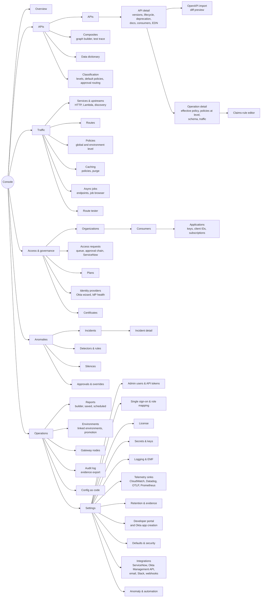

Grouping follows the user's task, not the data model:

| Group | Question it answers | Main users |
|---|---|---|
| **APIs** | What APIs do we offer, in which versions, with which contract and lifecycle, and what policy does each operation really get? | API owners, operators |
| **Traffic** | Where do requests go and how are they handled (routes, upstreams, global policies, caching, async)? | Operators |
| **Access & governance** | Who may call what: organizations, consumers, applications, keys, access requests, plans, identity providers | Consumer managers, API owners, admins |
| **Anomalies** | What is going wrong and how does BeFive respond? | On-call engineers, automation managers |
| **Operations** | Running and governing the system: reports, environments and promotion, nodes, audit and evidence, configuration as code, settings | Admins, auditors, operators |

Draft 3's "Access" group becomes **Access & governance**, because access requests and approvals are governance workflow (SEC-003, GOV-4), and the APIs area is placed first because the API, not the route, is now the main object users look for. Routes stay under Traffic: most routes are generated from operations (`01` 2.1) and are reached from the operation page; hand-written routes are still listed and edited there.

**Where the requested items live:** versions, operations, lifecycle, and deprecation are tabs and actions of the API detail (5.20), not separate menu entries; OpenAPI import is a primary action on the APIs list and on each API (5.21); the deprecated-usage view (5.32) is a tab of API detail and a shipped saved report; classification is both a menu entry (levels and defaults, 5.25) and a field on each API, version, and operation.

### 3.2 URL scheme (reitit-frontend, HTML5 history)

| Path | Screen |
|---|---|
| `/` | Overview (query `?api=:id` scopes it to one API, 5.2) |
| `/apis`, `/apis/new`, `/apis/import` | APIs list, create, OpenAPI import (5.20, 5.21) |
| `/apis/:api/:tab` | API detail (tabs `overview`, `versions`, `operations`, `docs`, `policies`, `consumers`, `deprecation`, `changelog`, `edn`) |
| `/apis/:api/versions/:version/:tab` | Version detail (tabs `operations`, `spec`, `policies`, `lifecycle`, `edn`) |
| `/apis/:api/versions/:version/import` | Import a new spec revision into a version (diff preview) |
| `/apis/:api/versions/:version/operations/:op/:tab` | Operation detail (tabs `overview`, `effective-policy`, `policies`, `schema`, `traffic`, `consumers`, `edn`) |
| `/composites`, `/composites/:id` | Composite list, graph builder (5.26) |
| `/dictionary`, `/dictionary/:field` | Data dictionary (5.24) |
| `/classification`, `/classification/:level` | Classification levels, defaults, approval routing (5.25) |
| `/services`, `/services/:id` | Services list, service detail (tabs: `routes`, `upstream`, `health`, `edn`) |
| `/upstreams/:id` | Upstream detail (HTTP, Lambda, discovery) |
| `/routes`, `/routes/new`, `/routes/:id`, `/routes/:id/edit` | Routes |
| `/policies`, `/policies/new`, `/policies/:id`, `/policies/levels/:level` | Policies; `levels/global` and `levels/environment` edit the two top levels (5.6) |
| `/caching`, `/caching/purges` | Cache overview, purge history (5.27) |
| `/jobs`, `/jobs/endpoints/:id`, `/jobs/:job-id` | Async job browser, endpoint config, job detail (5.28) |
| `/tester?route=:id` or `?operation=:api/:version/:op` | Route tester |
| `/organizations`, `/organizations/:id/:tab` | Organizations (5.7) |
| `/consumers`, `/consumers/:id/:tab` | Consumers |
| `/applications`, `/applications/:id/:tab` | Applications (tabs `credentials`, `subscriptions`, `usage`, `access`, `activity`, `edn`) |
| `/access-requests`, `/access-requests/:id`, `/access-requests/routing` | Access request queue, detail, routing rules (5.29) |
| `/plans`, `/plans/:id` | Plans |
| `/identity-providers`, `/identity-providers/new/okta`, `/identity-providers/new/oidc`, `/identity-providers/:id/:tab` | Identity providers (tabs include `health`, 5.9) |
| `/certificates`, `/certificates/:id` | Certificates |
| `/incidents`, `/incidents/:id` | Incidents, incident detail |
| `/automation/rules`, `/automation/rules/:id`, `/automation/detectors`, `/automation/detectors/:id`, `/automation/silences`, `/automation/approvals` | Anomaly response screens (5.17 to 5.19) |
| `/reports`, `/reports/new`, `/reports/:id`, `/reports/schedules` | Reports (5.30) |
| `/environments`, `/environments/:id`, `/environments/promotions/new`, `/environments/promotions/:id` | Linked environments and promotions (5.31) |
| `/nodes`, `/nodes/:id` | Gateway nodes |
| `/audit`, `/audit/:id`, `/audit/evidence` | Audit log, evidence export (5.12) |
| `/config`, `/config/import`, `/config/revisions/:rev` | Config as code |
| `/settings/:section` | Settings (sections include `integrations`, `integrations/:id`, `anomaly`, `telemetry`, `retention`, `portal`) |
| `/setup`, `/login` | First-run setup, sign-in |

Table filters, sorting, and pagination are reflected in query parameters (`/apis?domain=commerce&lifecycle=published&page=2`) so links can be shared. Paths use the API's ID (`orders`) and the version name (`v2`); operations use the operation ID from the spec (`getOrder`) or, when none exists, a generated ID (`get-orders-id`).

**Portal URLs** are on the portal's own hostname (for example `https://developer.example.com`) and are listed in 5.33.

### 3.3 Global layout

- **Left navigation** (Ant Design `Layout.Sider` + inline `Menu`, dark navy `#0b1f33`, 224 px, collapsible to 64 px icons). Draft 4 has 28 entries in six groups, more than fit at 900 px height, so **group headers are collapsible** (`Menu` `SubMenu` in inline mode with uppercase group labels). The open state of each group is a per-user preference stored locally; the group containing the current page is always open. A collapsed group shows the sum of its badges next to its chevron (for example "Access & governance 4" when four access requests wait), so nothing urgent is hidden. Counts appear next to large collections (APIs, routes, organizations, consumers, applications); Incidents shows the number of open incidents as a red `Badge`, Access requests the number waiting for **the signed-in user's** decision, and Approvals the number of pending traffic-action approvals. Footer shows the product version, licensee, and maintenance end date. The mockups show one typical persisted state: the active group plus as many groups as fit.
- **Top bar** (`Layout.Header`, 56 px, white):
  - **Environment badge** (`Tag` with a colored dot): the control plane's `:environment` setting (for example `production` in red, `test` in amber, `dev` and `sandbox` in blue). The color is configurable and repeated on every confirmation dialog. In Draft 4 the badge is also a `Dropdown` listing the **linked environments** (5.31) with links to their consoles, replacing Draft 3's open question 1. Opening another environment's console is a plain link; there is no cross-environment session.
  - **Cluster status**: "6 of 6 nodes in sync · revision 1843", driven by the SSE `nodes` event (unchanged).
  - **Global search** (`AutoComplete`, shortcut `/`): searches IDs and names across APIs, operations (by path, `/orders/{id}` finds the operation and its route), routes, services, organizations, consumers, applications (by client ID or key prefix), policies, plans, IdPs, data dictionary fields, and access request numbers (`AR-1042`). Results are grouped by kind with keyboard navigation.
  - **Help** and **notifications** (`Badge` + `Dropdown`: license notices, certificate expiry, nodes behind, failed scheduled reports, new incidents, pending approvals, access requests waiting for you, promotions waiting for approval, linked environment unreachable, integration actions that failed permanently).
  - **User menu** (`Avatar` + `Dropdown`): name, roles (with API Owner scope listed), "My API tokens" (Administrators), density preference, "Open developer portal" (a link to the portal hostname), sign out.
- **Content area**: `Breadcrumb` (group, then objects, for example "APIs / Orders API / v2 / GET /orders/{id}"), page header (title, status tags, primary actions on the right), then content. Max content width is unbounded for tables; forms cap at 1,200 px with an optional right-side panel (EDN preview, help, or the "edit at this level" panel of 5.22).
- **System banners** (full-width `Alert` under the top bar) as in Draft 3, plus: "Okta unreachable: console SSO degraded, gateways validating with cached keys (JWKS age 2 h 14 min)" (from IdP health, 5.9), "Linked environment test unreachable since 09:12" (Operators and Administrators only), and "Promotion b-0928-07 waiting for your approval".

### 3.4 Keyboard shortcuts

`/` search; `g o` Overview, `g p` APIs, `g r` Routes, `g c` Consumers, `g q` Access requests, `g i` Incidents, `g e` Environments, `g a` Audit; `n` new object on list pages; `e` edit on detail pages; `Ctrl/Cmd+S` save in forms; `Ctrl/Cmd+Enter` run the route tester or composite test; `?` shortcut help. All shortcuts are disabled while focus is in a text field (except save). The portal has only `/` (search) and `?`.

---

## 4. Shared interaction patterns

### 4.1 Lists (tables)

- Ant Design `Table` with `size="small"` (compact density default; "comfortable" is a user preference), sticky header, server-side pagination (cursor-based API, page numbers in the UI via cached cursors), sortable columns where the API supports sorting.
- Filter bar above the table: text filter (`Input` with search icon, debounced 250 ms, maps to `q`), `Select` filters for the key relations (service, plan, auth method, status), tag filter (`Select mode="tags"`).
- Row selection enables a bulk action bar (enable/disable, add tag, export selected as EDN, delete). Bulk changes go through `POST /config/apply` so they are one revision.
- Column chooser (`Dropdown` with `Checkbox.Group`), persisted per user in local storage.
- Live columns (requests per second, 15-minute sparkline) come from the live-metrics stream and are labeled as such in the table caption.

### 4.2 Forms

- Ant Design `Form` in vertical layout, grouped into `Card` sections with an `Anchor` on the left for long forms (Route edit). Required fields marked with the standard asterisk.
- **Validation is driven by the shared malli schemas** (section 8.5): as the user types (debounced 200 ms), the form document is validated with the same schema the server uses; humanized messages appear under fields. On save, server `422` problem details map back to fields by path. No validation rule is written twice.
- **Defaults are visible**: optional fields with defaults show the default as placeholder text ("30000 (default)"), and the EDN preview shows the stored value after defaults are applied.
- **Unsaved changes**: a `Tag` "Unsaved changes" in the header; navigating away opens a `Modal.confirm` ("Discard changes to orders-get?").
- **Save** writes with `If-Match`. On `412` (someone else saved), a conflict dialog shows the other version's author and time and offers: *Review differences* (a side-by-side diff of their version and yours), *Overwrite with mine*, or *Discard mine*.
- After save, a `message.success` toast shows "Saved as revision 1844 · applying to 6 nodes" and a small progress indicator in the cluster status until all nodes report the revision.

### 4.3 EDN view

Every detail page has an **EDN** tab (or a `Drawer` from list rows) showing the object as EDN in a read-only CodeMirror 6 editor with syntax highlighting, fold markers, and a copy button, plus a JSON toggle. Editors with edit rights can switch the tab to edit mode: the EDN is parsed and validated live (same schema), errors show as gutter markers with messages, and "Apply to form" updates the form. This is how users learn the config-as-code format without leaving the console.

### 4.4 Confirmations for destructive actions

| Level | Used for | Pattern |
|---|---|---|
| Inline | Reversible, low impact (disable a plugin on a draft form, remove a path from an unsaved form) | No confirmation; undo in the form. |
| `Popconfirm` | Single low-impact object changes (remove a target with weight 0, revoke an expired key) | "Revoke key b5k_z2cw…? Requests using it will fail after the next revision." |
| `Modal.confirm` with impact summary | Delete an object, revoke an active credential, suspend a consumer, disable a route with traffic | Shows what will stop working (for example "This route served 612 req/s in the last 15 minutes"), then Cancel / red Delete. |
| Type-to-confirm `Modal` | High impact: delete a route or consumer with traffic in the last 24 h; config apply containing deletions in a `production`-colored environment; disable local sign-in; rotate the master key; delete an identity provider used by routes (blocked unless unreferenced) | The user types the object ID (or the environment name for applies). The confirm button stays disabled until it matches. |

Deletes of referenced objects are blocked, not confirmed: the dialog lists the referencing objects with links ("Policy orders-read is used by 4 routes").

### 4.5 Empty, loading, and error states

- **Empty** (`Empty` with an illustration, one sentence, and a primary action): "No routes yet. Routes decide which requests reach which service. [Create route] [Import configuration]". Filtered-empty says "No routes match these filters. [Clear filters]".
- **Loading**: `Skeleton` for first load of a page; table-level `Spin` for refetches; never blank screens. Live widgets show "Waiting for gateway counters" until the first SSE metrics event.
- **Errors**: field errors under fields; object-level errors in an `Alert` at the top of the form with a "Go to field" link; page-level failures as `Result status="error"` with the request ID and a retry button; connectivity loss as a top banner with automatic retry. All error messages include the request ID (copyable) for support.

### 4.6 Secrets in the UI

Secrets are write-only everywhere. Secret fields render as `Input.Password` when set for the first time and as "Stored encrypted · last changed 2026-09-12 · [Replace]" afterwards. One-time values generated by the server (API keys, admin API tokens, the bootstrap admin password if generated) appear once in a modal that cannot be dismissed until the user confirms they stored the value (see Application detail, 5.7, and the portal's keys page, 5.38).

### 4.7 AI-generated content (1.1)

LLM analysis moves to **1.1** (`01` 2.19, 2.20), together with DEV-006 spec assistance. In 1.0 no AI text appears anywhere in the console or portal; the incident page shows a muted "AI best guess · Available in 1.1" placeholder (pattern 4.8, Figure 6). The pattern below is kept so 1.1 needs no layout change, and applies unchanged to the 1.1 incident panel, the LLM integration test, the text sent to ServiceNow, and the DEV-006 spec suggestions in the OpenAPI editor:
- A header with a sparkle icon and the text **"AI-generated best guess"** plus a `Tag` "unverified", so the label works without color; the provider, model, time, and confidence follow in secondary text.
- A distinct container: dashed 1 px border and a light purple background (token "AI content" in 7.2), used for nothing else in the product.
- Plain text only: no Markdown or HTML rendering, no automatic links, and next steps as a numbered list of text, never buttons. (DEV-006 suggestions are the one exception: each suggestion has "Insert into editor", which copies text into the user's draft; nothing is saved without the user saving.)
- Evidence chips (`M1`, `C1843`) that link to the facts they cite; chips for evidence that does not exist are removed and the panel says "some cited evidence was not found".
- A footer sentence, always visible: "Advisory only. BeFive never acts on AI output."
- Screen readers announce the region as "AI-generated best guess, unverified" (`aria-label` on the region).

### 4.8 Release labels for later features

Some designed features arrive after 1.0 (1.1, or "later" for items without a committed update). Rules:
- **1.0 screens do not offer 1.1 features as working controls.** Where a later feature has an obvious place (the AI panel on an incident, the Teams and email actions in a rule, the Event Management target in the ServiceNow form, consumer block and route disable in traffic actions), the console shows a compact, muted placeholder with a pill **"Available in 1.1"** or **"Later"** (dashed grey border, grey text, `.later` style in the mockups), never a disabled button that looks broken.
- Placeholders are one line, carry no link to non-existent settings, and can be hidden per user ("Hide upcoming features"). They exist so that design partners understand the roadmap, and so the 1.1 layout is already reserved.
- In **0.x**, portal screens and console screens that are 1.0-only are absent rather than labeled (the 0.x navigation simply has fewer entries: no Composites, Data dictionary, Caching, Async jobs, Access requests, Reports, or the promotion half of Environments). The portal preview has its own banner (5.33).
- Labels in this document: "(1.1)" after a feature name, "(0.x preview)" for portal parts already in 0.x.

### 4.9 Policy sources, locks, and inherited values

The policy hierarchy (`01` 2.4: global, environment, API, version, path, operation) is shown the same way everywhere a policy value appears (effective policy view 5.22, route form 5.4, tester 5.5, promotion diff 5.31):
- **Source chip** (`Tag`, rounded, one hue per level): Global (grey), Environment (magenta), API (blue), Version (cyan), Path (purple), Operation (green). A value contributed by a **classification default** (`01` 2.6) carries an amber chip with the level's name ("Confidential"), placed after the level it was attached at. Chips always include the level's name in text, so color is redundant.
- **Lock icon** (`LockOutlined`, amber text) with the level that set the lock ("locked · API"). A locked value can be tightened below the lock (the UI offers only tighter options: for example a lower rate limit, a narrower CIDR list, a narrower cache partition) and cannot be weakened; weakening options are hidden, and an attempt through EDN fails validation with a message naming the lock (5.22).
- **Inherited value in forms**: a field not set at the current level shows the effective value as a placeholder with its source chip ("50 req/s · Version"), and an "Override here" link that turns the field editable. "Reset to inherited" removes the override.
- **Overridden values** are shown struck through under the effective value when "Show overridden values" is on (default on in the effective policy view, off elsewhere), so reviewers can see that a lower level changed something and from what.
- **Classification badges** (Public, Internal, Confidential, Restricted, or customer-defined levels) use the classification tokens of 7.2 and always show the level name in text.

---

## 5. Screen specifications

Each screen lists: **purpose**; **roles** (V = view, E = edit); **components** (Ant Design names); **fields and validation** (schema references are to `02-architecture.md` 5.3); **empty state**; **error states**; **destructive actions**. Role abbreviations: Adm = Administrator, Op = Operator, AO = API Owner (scoped to owned APIs), CM = Consumer Manager, AM = Automation Manager, Aud = Auditor; the full matrix is 2.2. Console screens are 5.1 to 5.32 (5.1 to 5.19 keep their Draft 3 numbers; 5.20 to 5.32 are new), developer portal screens are 5.33 to 5.40. Release labels follow 4.8.

### 5.1 Sign-in

- **Purpose:** authenticate admins through SSO or a local account.
- **Roles:** unauthenticated.
- **Components:** centered `Card` (400 px) on a neutral background with the product mark and environment badge; primary `Button` "Sign in with Okta" (label uses the SSO provider's display name, e.g. "Sign in with Okta" or "Sign in with Microsoft Entra ID"); `Divider` "or"; collapsed `Collapse` panel "Sign in with a local account" containing `Form` with `Input` (email) and `Input.Password`; `Alert` area for errors.
- **Fields:** email (required, email format); password (required). No client-side password rules on sign-in (they apply on creation).
- **Behavior:** when local sign-in is disabled by an Administrator, the local panel is hidden unless the URL has `?local=1` (break-glass account). After SSO callback, users without any mapped role see a `Result status="403"`: "Your account is not mapped to a console role. Ask an administrator to add your Okta group to a role."
- **Errors:** generic "Email or password is incorrect" (no user enumeration); lockout message with remaining time; SSO errors show the IdP error code and the request ID; "Session expired" notice when redirected after idle timeout.
- **Empty/first run:** if no admin exists, `/login` redirects to `/setup` (flow 6.1).

### 5.2 Overview dashboard

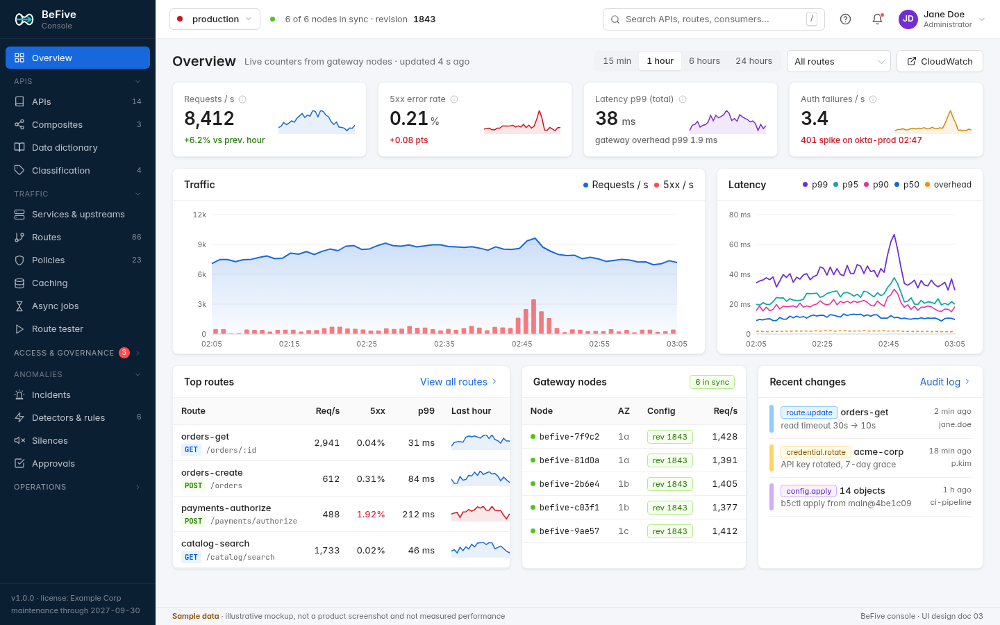
*Figure 1. Overview dashboard with the Draft 4 navigation and p90 in the latency chart (sample data).*

- **Purpose:** answer "is the gateway healthy right now, and what changed?" in one glance, without CloudWatch or Datadog, for the whole environment, one API, or one operation (`01` 2.14, OBS-004).
- **Roles:** all V.
- **Components:** page header with `Segmented` time range (15 min, 1 h, 6 h, 24 h; ranges up to 2 h use 10-second buckets, longer ranges use the 1-minute rollups; anything older links to the Reports screen and to CloudWatch or Datadog), a **scope** `Cascader` (All traffic › API › version › operation, plus hand-written routes; the selected scope is in the URL, `?api=orders&version=v2&op=getOrder`), "CloudWatch" and "Datadog" link buttons (shown for the sinks configured in 5.14.4); four `Card` + `Statistic` KPIs with sparklines (requests per second, 5xx error rate with the 4xx rate as secondary text, latency p99 with gateway overhead p99, authentication failures per second); ECharts area chart "Traffic" (requests per second with 4xx and 5xx per second bars, toggled by legend); ECharts line chart "Latency" (**p50, p90, p95, p99**, gateway overhead dashed); `Table` "Top routes" (requests per second, 5xx rate, p99, sparkline; in API scope it becomes "Top operations"); `Table` "Gateway nodes"; "Recent changes" list (audit events that bumped the revision, now also promotions "Promoted from test · bundle b-0928-07").
- **Draft 4 panels below the fold** (not in Figure 1): **Policy events** (denials by reason, rate-limit rejections by dimension, IP blocks including temporary traffic-action blocks, cache hit ratio), each a small bar list with a link to the matching report (5.30); **IdP health** (per identity provider: JWKS fetch age, last fetch error, introspection p95 and error rate, state "healthy / serving stale keys / failing"; links to 5.9); **Deprecated traffic** (requests to deprecated operations in the window, top applications, link to 5.32).
- **Interactions:** clicking a KPI opens a drill-down `Drawer` (authentication failures by reason, route, and IdP; 5xx by route and error code; in API scope, by operation and application). Each has "Open in CloudWatch Logs Insights" or "Open in Datadog" with the matching saved query. Brushing a time range on the traffic chart filters the tables. Every chart has "View as table".
- **Empty state:** before any traffic: "No traffic yet. Once requests reach a gateway node, live counters appear here within 10 seconds." With a checklist `Card` for new installs: connect an IdP, import an OpenAPI document (5.21), send a test request, connect a telemetry sink.
- **Errors:** SSE disconnected: amber "Live updates paused, retrying" indicator, polling fallback; no nodes reporting: `Alert` "No gateway nodes are reporting. Check that gateway containers are running and can reach the database."
- **Destructive actions:** none.

### 5.3 Services & upstreams

**List** (`/services`)
- **Purpose:** see every backend API and where it sends traffic.
- **Roles:** all V; Adm, Op E.
- **Components:** `Table` with columns: service (ID and name), upstream, targets (`Badge` counts "3 healthy · 0 unhealthy"), load balancing, routes (count, link), requests per second, owner, tags; toolbar `Button` "New service"; `Segmented` switch "Services | Upstreams" (upstreams are reusable across services and get their own list with the same shell).
- **Empty:** "No services yet. A service is a backend API: where requests go after they pass the gateway. [New service]".

**Service detail** (`/services/:id`)
- **Components:** header with name, ID, `Tag`s, actions (Edit, View EDN, Delete); `Tabs`: *Routes* (the service's routes, same columns as the routes list), *Upstream* (upstream settings `Descriptions` plus editable target table), *Health*, *Settings* (timeouts, retries, base path, identity forwarding), *EDN*.
- **Targets table** (`Table` with inline editing): host, port, weight (`InputNumber`, 0 to 1000; 0 shows "drained"), health per node (`Tooltip` with each node's view: "healthy on 6 of 6 nodes"), passive ejections in the last hour, in-flight requests. Actions: set weight 0 (drain), remove.
- **Health tab:** per target, active check status and last result, passive ejection history (`Timeline`), and a small ECharts status strip for the last hour.

| Field | Control | Validation (schema) |
|---|---|---|
| Service ID | `Input` (create only), auto-suggested from name | `Id` regex `^[a-z0-9][a-z0-9-]{0,62}$`, unique (async check `GET /services/:id` → 404 means free) |
| Name | `Input` | 1 to 128 chars |
| Upstream | `Select` with "Create new upstream" option (inline `Drawer`) | must reference an existing upstream |
| Base path | `Input` with `/` prefix | starts with `/` |
| Timeouts connect/read/total | `InputNumber` with "ms" suffix, default placeholders 2000/30000/60000 | 0 to 3,600,000 |
| Retries attempts | `InputNumber` | 0 to 5 |
| Retry on | `Checkbox.Group` (connect error, reset, timeout, 502, 503, 504) | subset of enum |
| Identity forwarding | `Switch` per header plus header-name `Input` | header-name token syntax |
| Upstream targets | editable `Table`: host `Input`, port `InputNumber`, weight `InputNumber` | host 1 to 253 chars; port 1 to 65535; weight 0 to 1000; 1 to 256 targets |
| Scheme | `Radio.Group` http/https | enum |
| Load balancing | `Radio.Group` round robin / least connections | enum |
| Active health check | `Switch` then path `Input`, interval, timeout, healthy statuses (`Select mode="tags"` of status codes), thresholds | interval ≥ 1000 ms; timeout ≥ 100 ms; thresholds 1 to 10 |
| Passive health check | `Switch` then consecutive failures, ejection, max ejection | per schema |
| Panic routing | `Switch` with help text | boolean |
| Upstream TLS | verify `Switch` (turning off shows a warning `Alert`), CA certificate `Select`, client certificate `Select`, SNI `Input` | certificate IDs of the right kind |

- **Errors:** delete of a service with routes is blocked (list of routes). Upstream `:verify false` saves with a persistent warning tag "TLS verification off".
- **Destructive:** delete service (type-to-confirm if it has routes that served traffic in 24 h; blocked while routes reference it); remove a target (`Popconfirm`, suggests draining first if it has in-flight requests).

**Lambda upstream** (Draft 4, `01` 2.2). "New upstream" offers a kind `Radio.Group` of cards: **HTTP targets** (the form above), **AWS Lambda**, and **Service discovery**. The Lambda form:

| Field | Control | Validation (schema) |
|---|---|---|
| Function | `Input` for the function name or ARN, with an optional qualifier (alias or version) `Input` | ARN syntax or function-name syntax; qualifier `$LATEST`, a number, or an alias name |
| Region | `Select` (defaults to the control plane's region) | AWS region code |
| Invocation | `Radio` synchronous (request/response) / asynchronous (only offered for asynchronous endpoints, 5.28) | enum |
| Payload format | read-only "API Gateway payload format 2.0" with a help link | fixed in 1.0 |
| Concurrency limit | `InputNumber` with a help text "keep below the function's reserved concurrency" | 1 to 10,000 |
| Timeout | `InputNumber` ms | 100 to 900,000 |
| Credentials | read-only "Uses the gateway task's IAM role"; an optional role-to-assume ARN per environment comes from the overlay (5.31) | ARN syntax |

The **Test** button invokes the function with a sample event built from a chosen operation (dry run: "Invoke with DryRun permission check" first, then an optional real invocation after `Modal.confirm`) and shows status, duration, billed duration, and the mapped HTTP response. Upstream detail for Lambda replaces the targets table with invocation, error, throttle, and duration charts. Error mapping (function error → `502`, throttle → `503`, timeout → `504`) is shown read-only.

**Service discovery** (`01` 2.2). Source `Radio.Group`: DNS A records (host, port, refresh interval), DNS SRV (record name, refresh interval), AWS Cloud Map (namespace `Select`, service `Select`, optional attribute filters as key/value rows), Kubernetes EndpointSlices (namespace, service name, port name; a read-only note "requires read access to EndpointSlices"). Common fields: refresh interval (`InputNumber`, 5 to 300 s), minimum endpoints before traffic is sent (`InputNumber`), behavior when discovery fails (`Radio`: keep last known endpoints, the default; or mark unhealthy). The targets table becomes read-only "Discovered endpoints" with the source, discovered time, and health per node; weights are not editable (traffic is spread evenly). **Test discovery** resolves once from the control plane and lists the endpoints it found; differences between the control plane's and nodes' views are flagged per node in the Health tab.

### 5.4 Routes

**List** (`/routes`)

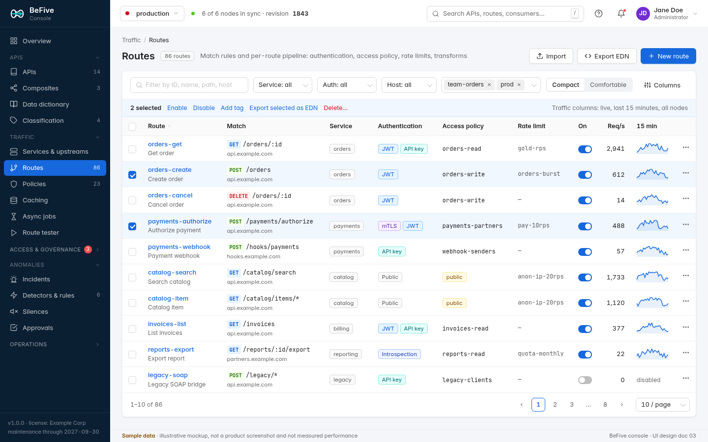
*Figure 2. Routes list with bulk selection and the Draft 4 navigation (sample data; the new API / operation column of 5.4 is not drawn).*

- **Purpose:** find and manage routes quickly; see protection and traffic at a glance.
- **Roles:** all V; Adm, Op E.
- **Components:** page header with count `Tag`, actions Import, Export EDN, New route; filter bar (text, service, authentication method, host, tags, `Segmented` density); bulk action bar; `Table` columns: route (ID link and display name), match (method `Tag`s colored by method, path in monospace, host below), service `Tag`, authentication (`Tag` per method: JWT, API key, mTLS, Introspection, Public), access policy (monospace policy ID, or amber `Tag` "public"), rate limit, enabled `Switch` (inline toggle with `Modal.confirm` if the route has traffic), requests per second and 15-minute sparkline, row `Dropdown` (Edit, Duplicate, Test, View EDN, Delete).
- **Empty:** "No routes yet" with New route and Import configuration.
- **Errors:** row-level warning icon with `Tooltip` for routes with issues reported by nodes (for example "plugin acme/request-signer missing on 2 nodes").

**Create / edit** (`/routes/new`, `/routes/:id/edit`)

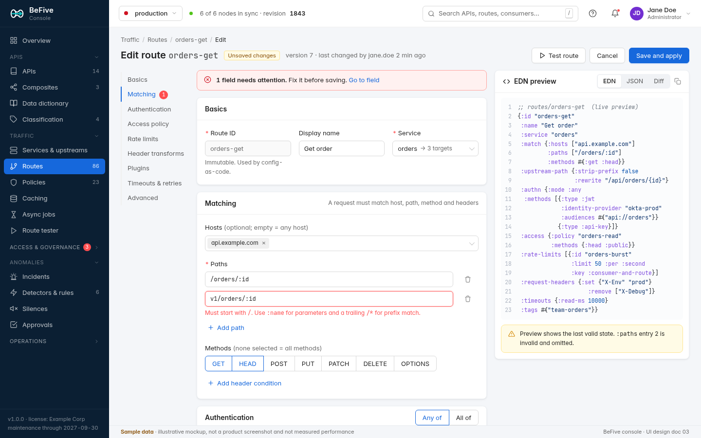
*Figure 3. Route edit form with a validation error and live EDN preview (sample data).*

- **Purpose:** define matching and the full per-route pipeline in one place, with the stored EDN visible.
- **Roles:** Adm, Op E; others see the detail page read-only (same sections, text instead of inputs).
- **Layout:** three columns: `Anchor` section navigation (with error count `Badge`s), form `Card`s, right-side `Card` "EDN preview" (`Segmented` EDN / JSON / Diff against the saved version; CodeMirror read-only; shows the last valid state with a note when the form has errors). Header actions: Test route (opens the tester with this unsaved draft), Cancel, Save and apply.
- **Sections and fields:**

| Section | Field | Control | Validation (schema) |
|---|---|---|---|
| Basics | Route ID | `Input` (disabled after create) | `Id`, unique |
| | Display name | `Input` | ≤ 128 chars |
| | Service | `Select` showing the upstream and target count | existing service |
| | Enabled | `Switch` | boolean |
| | Tags | `Select mode="tags"` | `Tags` (≤ 32, tag syntax) |
| Matching | Hosts | `Select mode="tags"` (suggests hosts from certificates' SNIs) | ≤ 32; host or `*.domain` pattern |
| | Paths | list of `Input`s (monospace) with add/remove | 1 to 32; `PathPattern`: starts with `/`, params `:name`, optional trailing `/*`; message: "Must start with /. Use :name for parameters and a trailing /* for prefix match." |
| | Methods | `Radio.Button`-style multi-toggle (GET, HEAD, POST, PUT, PATCH, DELETE, OPTIONS) | subset of enum; none = all |
| | Header conditions | rows: name `Input`, operator `Select` (equals, matches regex, present), value `Input` | header-name token syntax; regex validated server-side with RE2 syntax |
| | Priority | `InputNumber` | −1000 to 1000 |
| | Conflicts | read-only `Alert` computed by the shared validator: conflicting (error) or shadowed (warning) routes with links | cross-entity rule |
| Upstream path | Strip prefix | `Switch` | boolean |
| | Rewrite | `Input` with template help (`{id}` from path params) | template syntax; params must exist in all paths |
| Authentication | Mode | `Radio.Group` "Any of" / "All of" with help | enum |
| | Methods | orderable list (drag handle) of method cards; "Add method" `Dropdown`: JWT, Introspection, API key, mTLS. JWT/introspection: identity provider `Select`, audiences `Select mode="tags"` (defaults from IdP), forward token `Switch`. API key: header `Input` (default X-API-Key), query parameter `Input` (off by default, with warning). mTLS: no fields (uses certificate mapping) | 1 to 4 methods; IdP required for JWT/introspection |
| Access policy | Decision | `Radio.Group`: "Require policy" / "Public (no authentication)" | required (default deny made explicit) |
| | Default policy | `Select` of policies with "Create policy" shortcut (opens policy editor in a `Drawer`) and a preview of the rule in plain language | existing policy |
| | Per-method overrides | `Table`: method `Select`, decision `Select` (policy, Deny, Public) | methods unique |
| Rate limits | Limits | editable `Table`: ID, limit `InputNumber`, per `Select` (second, minute, hour, day, month), burst, key `Select` (consumer, client IP, route, consumer and route), on backend failure `Radio` (fail open, fail closed) | ≤ 8; limit ≥ 1; month limits labeled "calendar quota (UTC)" |
| | Effective limits | read-only note listing plan limits that also apply | none |
| Header transforms | Request / Response | `Tabs` with four sub-tables: Remove, Rename, Set, Append; value inputs support template variables with an insert `Dropdown` (`${consumer.id}`, `${request.id}`, …) | header-name syntax; templates validated |
| Plugins | Instances | orderable list: plugin `Select` (from loaded plugins, with version and "missing on N nodes" warning), phase `Select` (only phases the plugin allows), order `InputNumber`, config form **generated from the plugin's malli schema** (8.5) with a raw EDN fallback | plugin schema |
| Timeouts & retries | Connect, read, total; attempts; retry on | as in 5.3, placeholders show inherited service values ("inherited: 30000") | per schema |
| Advanced | CORS, IP filter, body limit, WebSocket | CORS (`Switch`, origins `Select mode="tags"`, methods, headers, credentials `Switch`, max age), IP allow/deny (`Select mode="tags"` with CIDR validation), max request body (`InputNumber` + unit `Select`), WebSocket `Switch` | CIDR syntax; body 0 to 2^31 |
| | Access-log sampling overrides | sample rate `InputNumber` in percent (placeholder "inherit global"; helper: "0% for health checks keeps only errors, denials, and slow requests"), slow-request threshold `InputNumber` ms; a note shows "Takes effect only when sampling is enabled in Settings › Logging & EMF (currently off)" with the current state | rate 0 to 100; threshold 1 to 3,600,000 ms |

- **Empty:** new route pre-fills Matching with the service base path and Access with "Require policy" and no selection (save disabled with "Choose an access policy or mark the route public").
- **Errors:** error summary `Alert` at the top with count and "Go to field"; field messages from malli; save blocked while errors exist; server-side conflict errors (route match conflicts) shown in the Conflicts row; `412` conflict dialog (4.2).
- **Destructive:** delete (type-to-confirm when traffic in 24 h); switching Access to Public shows a `Modal.confirm`: "Anyone who can reach the gateway will be able to call GET /orders/:id without credentials."

**Draft 4 changes to routes.**
- Most routes are now **generated from operations** (`01` 2.1). The list gets an "API / operation" column (link to 5.22) and a `Segmented` filter "All | From APIs | Hand-written". A generated route opens read-only with the banner "This route is generated from Orders API v2 · GET /orders/{id}. Edit the operation instead. [Open operation]"; matching, authentication, and policy sections are edited on the operation and its levels, while route-only settings that do not belong to an operation (header transforms, plugins, timeouts and retries) stay editable here and are stored as operation overrides.
- New sections in the route form, each with the inherited-value pattern of 4.9: **Caching** (policy `Select`, TTL, partition `Radio` public / per application / per user, honor `Cache-Control` `Switch`; disabled with a lock note on Restricted APIs), **Size limits** (request and response maximum, stream idle timeout), **Deprecation** (deprecated date, sunset date, migration link; read-only when set at version or API level), **Rate limits** (key `Select` gains application, API key, user, Okta group, scope, operation, and organization dimensions, combinable).
- Route kinds: "New route" offers **Proxy** (the form above), **Composite** (opens 5.26), and **Asynchronous** (opens 5.28).
- Authentication: the JWT method shows the IdP's outage behavior choice **"When the IdP is unreachable"** `Radio` (Fail closed, the default; Fail open for cached tokens and introspection results) with a help link to the Okta outage runbook (5.9). The **Forward identity** section adds "Internal JWT" (`Switch`, audience `Input` defaulting to the upstream host, lifetime `InputNumber` 30 to 600 s).

### 5.5 Route tester

- **Purpose:** send a sample request through the configured (or draft) pipeline and see exactly which route matched, which authentication method and policy applied, and how the rate limit evaluated (`01` 2.17).
- **Roles:** all V and run in dry-run mode; Adm, Op can enable "Send to upstream".
- **Components:** two-pane layout. Left: request builder (method `Select`, host `AutoComplete`, path `Input`, headers editable `Table` with presets "Add bearer token", "Add API key", query parameters, client IP `Input` (to test IP rules), body `Input.TextArea` for small bodies, `Switch` "Send to upstream", `Select` "Configuration: current revision / draft from editor"). Right: result `Steps` (vertical) with one step per interceptor phase: route match (with "why not" list for near-miss routes), IP filter, CORS, authentication (method, result, identity `Descriptions`: subject, client ID, scopes, groups, consumer), authorization (policy tree rendered as nested `Tree` with each predicate green/red and the failing predicate highlighted), rate limit (bucket, remaining, dry-run), request transform (final upstream method, path, headers table with added/removed highlighted), upstream response (status, headers, first 64 KiB of body) when sent.
- **Fields:** method (enum), host (host syntax), path (starts with `/`), headers (name syntax; values up to 8 KiB), client IP (IPv4/IPv6).
- **Empty:** "Build a request or pick a route to prefill it." Route `Select` prefills host, path (with example parameter values), and method.
- **Errors:** a pipeline rejection is not an error: it is shown as the outcome ("Would return 403 forbidden · reason authz.scope_missing:orders:write"). Tester failures (IdP unreachable from the control plane) show as step errors with the reason.
- **Security:** tokens and keys pasted into the tester are not stored or logged; the audit event records the test with credentials redacted. A "Copy as curl" button copies the request with credential values replaced by placeholders.
- **Destructive:** none (dry run consumes no rate-limit tokens).

- **Draft 4 additions:** the tester can target an operation (`?operation=orders/v2/getOrder`) instead of a route. A new result step **Effective policy** lists every policy value that applied with its source chip (4.9) and links to 5.22. For **composites**, the upstream step becomes a per-step trace (`Steps` nested under the composite: step ID, target route, status, duration, skipped-because condition, mapped output preview) with the total and the gateway overhead (Figure 9 in 5.26 uses the same component). For **cached** operations the result shows "cache HIT (age 12 s, partition application)" or "MISS, stored". For **asynchronous** endpoints, the result shows the `202`, the job ID, and a link to the job (5.28). The tester's IdP calls show "served from stale keys (age 2 h 14 min)" during an IdP outage.

### 5.6 Policies

Draft 4 introduces the six-level hierarchy (`01` 2.4): global, environment, API, version, path, and operation. **Named policies** (reusable access rules, as in Draft 3) still exist and are attached at levels; the **policy kinds** covered by the hierarchy are security and authentication, IP rules, rate limits and quotas, logging and redaction, caching, size limits, and deprecation.

**List** (`/policies`)
- **Components:** `Segmented` "Named policies | Global level | Environment level". *Named policies:* `Table` with policy ID, description, rule summary in plain language ("scope orders:write AND (groups any of partners-write, payments-admin) AND IP in 2 ranges"), attached at (levels with source chips, for example "API · Orders API, Operation · 3"), used by (operation and route counts), last changed. *Global level* and *Environment level* open the level editor below for those two levels; the API, version, path, and operation levels are edited on the API pages (5.20, 5.22).
- **Empty:** "No policies yet. Policies decide who may call an operation. Operations without an access decision are denied unless marked public. [New policy]".

**Level editor** (`/policies/levels/global`, `/policies/levels/environment`, and the *Policies* tab on API, version, and operation pages)
- **Purpose:** set and lock values for one level and see what they do below.
- **Roles:** Adm, Op E at global and environment level; API Owners edit API, version, path, and operation levels of their APIs, within locks (2.2); locks are set by Adm and Op only.
- **Components:** one `Card` per policy kind with the values set at this level, each with a **Lock** `Switch` ("Lower levels may tighten but not weaken this"); values inherited from above are shown greyed with their source chip and lock (4.9). A right panel "Impact" counts the operations affected ("Applies to 412 operations in 14 APIs; overridden on 9") and lists lower-level values that a new lock would make invalid, which must be fixed before saving.
- **Validation:** a save that would weaken a lock is rejected by the shared validator before it reaches the server: "Rejected: IP rules are locked at environment level (prod) by marco.rossi. You can narrow the list but not widen it." The same message comes from the server for API and CLI changes.

**Named policy editor** (`/policies/:id`)
- **Purpose:** build and review access rules visually or as EDN, and see where they apply.
- **Roles:** all V; Adm, Op E; API Owners E for policies attached only within their APIs.
- **Components:** `Tabs` "Visual builder" / "EDN" (kept in sync; switching validates). Visual builder: nested group `Card`s for combinators with a `Segmented` "ALL of / ANY of" and a "NOT" toggle; predicate rows with a type `Select` (Authenticated, Auth method, Scope, Scopes all/any, Group, Groups any, **Claim rule** (5.23), Client ID, Application, Organization, Consumer group, Source IP) and type-specific inputs. "Add condition" and "Add group" buttons at each level. Right panel: plain-language summary, "Attached at" list with levels, and a **policy test** box (paste identity JSON or pick a recent tester result; shows allow/deny with the failing predicate).
- **Fields and validation:** policy ID (`Id`); description (≤ 1,024); rule: depth ≤ 8, ≤ 64 predicates, referenced consumer groups and applications must exist, CIDRs valid, claim operators from the enum (all from the `Rule` schema).
- **Errors:** invalid EDN shows gutter markers; builder errors inline per row; saving a policy used by operations shows an impact note ("This change affects 4 operations on 6 nodes") in the save confirmation.
- **Destructive:** delete blocked while attached anywhere; removing a lock shows the levels that could then weaken it (`Modal.confirm`).

### 5.7 Organizations, consumers, and applications

Draft 4 follows the domain model of `01` 2.1: **organizations** (tenants, such as a partner company or an internal business unit) contain **consumers**, and consumers own **applications**, which hold the credentials (API keys, bound Okta OAuth client IDs, client-certificate mappings) and the subscriptions. Plans can be assigned at any of the three levels; the most specific assignment wins and the UI always shows where the effective plan comes from.

**Lists** (`/organizations`, `/consumers`, `/applications`)
- **Organizations:** `Table` with organization (name, ID), kind `Tag` (partner, internal, customer), consumers, applications, plan (with source), month-to-date requests, open access requests, tags. Filters: kind, plan, text.
- **Consumers:** `Table` with consumer (name, ID), organization link, status `Tag` (active, suspended), applications, plan (with source chip "org" or "own"), month-to-date usage `Progress` against the quota, last seen. Filters: organization, plan, status, group.
- **Applications:** `Table` with application ID, environment `Tag` (prod, sandbox; sandbox applications live in the Sandbox cluster and are listed there), consumer and organization, credentials (icons with counts), subscriptions count, last used, created by (console user or "portal: devon.park"). Filters: organization, API subscribed, credential type, "created in portal".
- **Empty:** "No organizations yet. An organization groups the consumers and applications of one partner or business unit. [New organization]"; the consumer and application lists explain their parent and link to it.

**Organization detail** (`/organizations/:id/:tab`): tabs *Consumers*, *Applications*, *Usage*, *Access requests*, *Portal access* (which portal users belong to this organization, mapped from Okta groups such as `partner-northwind`), *Activity*, *EDN*.

**Application detail** (`/applications/:id/:tab`)

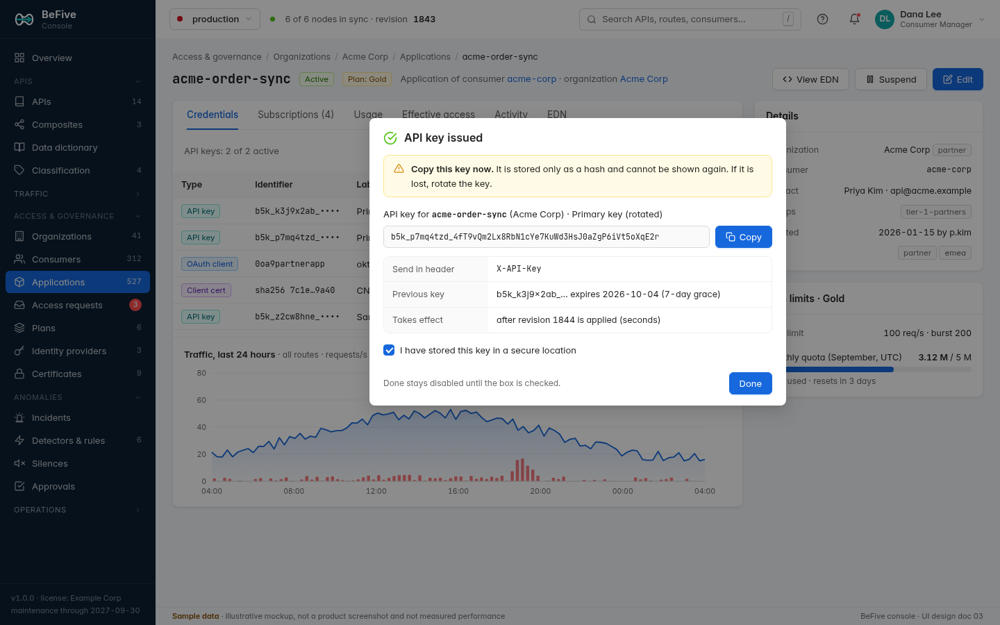
*Figure 4. Application detail for `acme-order-sync` with the one-time API key reveal after rotation (sample data; file name kept from Draft 3).*

- **Purpose:** manage one application's credentials, subscriptions, and access, and answer usage questions.
- **Roles:** all V; Adm, CM E. API Owners see the subscriptions to their APIs and can revoke them (with a reason, audited).
- **Components:** header (application ID, status `Tag`, plan `Tag`, "Application of consumer acme-corp · organization Acme Corp" with links; actions View EDN, Suspend/Resume, Edit); right column `Card`s "Details" (organization, consumer, contact, groups, created, tags) and "Plan limits" (rate limits, monthly quota `Progress` with reset date, plan source); `Tabs`:
  - *Credentials:* toolbar Issue API key, Bind OAuth client, Add client certificate; `Table`: type `Tag`, identifier (key prefix `b5k_k3j9x2ab_••••`, client ID, or certificate fingerprint), label (an Okta-bound client shows the IdP and "bound" or "created by BeFive"), created, expires, last used, status `Tag` (Active, In grace period, Expired, Revoked), actions Rotate / Revoke / Unbind.
  - *Subscriptions:* `Table` of entitlements (API, version, plan, environment, granted by access request link or "granted by dana.lee", granted at, scopes); "Add subscription" for Consumer Managers (bypasses the request workflow, requires a reason, audited; hidden for APIs whose classification requires approval, where the button reads "Create access request").
  - *Usage:* month-to-date requests, 4xx/5xx, rate-limited count, traffic chart, per-operation breakdown, deprecated calls (link to 5.32), link "Open as report" (5.30).
  - *Effective access:* which operations this application can call, computed by evaluating each operation's effective policy (5.22) against the application's static attributes (subscriptions, organization, groups, credential types); dynamic conditions (scopes, claims, IP) shown as "depends on token/IP".
  - *Activity:* audit events for this application and its credentials, including portal actions by the developer.
  - *EDN:* application document (credential secrets excluded).
- **One-time secret reveal** (Issue or Rotate API key): unchanged from Draft 3 (4.6): `Modal` with success icon, warning `Alert` "Copy this key now. It is stored only as a hash and cannot be shown again.", monospace read-only field with a Copy button, `Descriptions` (header to use, previous key and its grace expiry, "takes effect after revision N is applied"), required `Checkbox` "I have stored this key in a secure location"; Done stays disabled until checked; `Esc` and mask clicks do not close the modal. The key is held only in component-local state and cleared on close.
- **Fields:**

| Field | Control | Validation (schema) |
|---|---|---|
| Organization ID, consumer ID, application ID | `Input` (create only) | `Id`, unique per kind including soft-deleted within 30 days |
| Name | `Input` | 1 to 128 |
| Organization kind | `Radio.Group` partner / internal / customer | enum |
| Plan | `Select` (shows "inherits Gold from Acme Corp" as placeholder) | existing plan (optional at each level) |
| Groups | `Select mode="multiple"` | existing consumer groups |
| Contact name, email | `Input` | email format |
| Application type | `Radio` machine (client credentials) / user-facing (authorization code with PKCE) | enum; informs which credentials are offered |
| Metadata | key/value `Table` | keys keyword syntax, values ≤ 256 chars |
| API key label, expiry, rotation grace | `Input`, `DatePicker`, `InputNumber` days | ≤ 128; future date; 0 to 90, default 7 |
| OAuth client | IdP `Select` + client ID `Input` | 1 to 256 chars; unique per IdP among active credentials |
| Client certificate | `Upload.Dragger` for PEM or subject DN + CA, or SAN URI + CA | valid PEM; unique among active credentials |

- **Rules surfaced in the UI:** "Issue API key" is disabled when the application has two active keys ("An application can have at most two active API keys. Rotate or revoke one first."). Rotation shows the grace period before confirming. Applications created in the portal show "Created by devon.park in the developer portal" and the developer can rotate their keys there too (5.38).
- **Errors:** duplicate client ID or fingerprint shows which application already owns it (if the user may view it).
- **Destructive:** revoke credential (`Modal.confirm` with last-used time); unbind an Okta client created by BeFive (`Modal.confirm`: "The Okta app 0oa… stays in Okta; BeFive never deletes Okta apps. Deactivate it in Okta if it is no longer needed."); suspend (`Modal.confirm` listing active credentials; reversible); delete organization, consumer, or application (type-to-confirm; blocked while children exist; soft delete with 30-day ID reservation and retained usage history).

### 5.8 Plans

- **Purpose:** define reusable rate limits and quotas and assign them to organizations, consumers, or applications (3scale-style application plans).
- **Roles:** all V; Adm, CM E.
- **Components:** list as `Card` grid (plan name, limits summary, assignment counts by level, quota) plus a `Table` view toggle; detail page with limits editable `Table` (as in routes, keyed by application by default, with the Draft 4 dimensions), operation overrides (`Table`: API › version › operation `Cascader`, limits), assignments (`Table` with level, object, usage `Progress`), whether the plan is **offered in the portal** for access requests (`Switch` per API, used by 5.39), EDN tab.
- **Fields:** plan ID (`Id`), name (1 to 128), description, limits (≤ 8, limit ≥ 1, `per` enum, burst ≥ 1, key dimensions), operation overrides (existing operations).
- **Empty:** "No plans yet. Plans bundle rate limits and monthly quotas, such as 100 requests per second and 5 million per month. [New plan]" with Bronze, Silver, and Gold templates (editable before saving).
- **Destructive:** delete blocked while assigned (bulk "Move assignments to plan…" offered); lowering a quota below current month-to-date usage shows a warning listing affected applications ("3 applications will be over quota immediately and receive 429").

### 5.9 Identity providers

**List** (`/identity-providers`)
- **Components:** `Card` list with provider type logo (Okta, generic OIDC), issuer, JWKS status (`Badge`: "2 keys · refreshed 3 min ago", or red "refresh failing since 02:47"), routes using it, last test result; "Connect provider" `Dropdown`: Okta (recommended), Generic OIDC.
- **Roles:** all V; Adm E; Op may run tests.

**Okta connection wizard** (`/identity-providers/new/okta`)

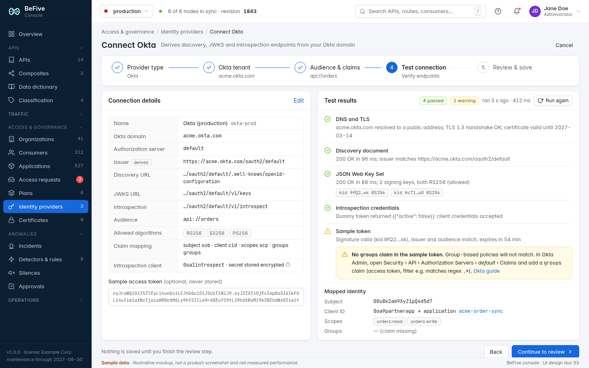
*Figure 5. Okta connection wizard, test-connection step (sample data).*

`Steps` (horizontal) with five steps; nothing is saved until the last step:

1. **Provider type.** `Radio.Group` of cards: Okta (preset) or Generic OIDC (switches to the generic form).
2. **Okta tenant.** Fields: display name (`Input`, 1 to 128), ID (`Input`, `Id`, suggested `okta-<env>`), Okta domain (`Input` with `https://` addon, accepts `acme.okta.com`, `acme.oktapreview.com`, or a custom domain; strips scheme and trailing slashes; host syntax), authorization server (`Radio.Group` "default" / "Custom (enter ID)" with `Input` for `aus…`; choosing "Org authorization server" shows an info `Alert` explaining that org-server access tokens cannot be validated locally and offering introspection only). As the user types, a live `Descriptions` preview shows the derived issuer, discovery, JWKS, and introspection URLs (`POST /identity-providers/okta/derive`).
3. **Audience and claims.** Audience (`Select mode="tags"`, default `api://default` for the default server, required ≥ 1), allowed algorithms (`Checkbox.Group`, default RS256; HS* not offered), clock skew (`InputNumber` seconds, 0 to 300, default 60), claim mapping (`Input`s prefilled: subject `sub`, client ID `cid`, scopes `scp`, groups `groups`), introspection (optional `Switch`: client ID `Input`, client secret `Input.Password` stored as a new secret, auth method `Radio`, cache TTL and negative TTL `InputNumber` in seconds with limits 0 to 300 and 0 to 30).
4. **Test connection.** Runs automatically on entering the step and on "Run again" (`POST /identity-providers/test` with the unsaved draft). Left: summary `Descriptions` of the draft (with "Edit" back to step 2 or 3) and an optional sample access token `Input.TextArea` ("never stored"). Right: result list, one row per check with icon, title, and detail:
   - DNS and TLS (resolved address class, TLS version, certificate expiry);
   - Discovery document (status, latency, issuer match);
   - JSON Web Key Set (status, latency, key IDs and algorithms as `Tag`s, warning if no key matches the allowed algorithms);
   - Introspection credentials (dummy token → `{"active": false}` means credentials accepted; `401` means rejected);
   - Sample token (signature, issuer, audience, expiry) and a **Mapped identity** block (subject, client ID with the consumer it maps to, scopes, groups).
   Warnings carry the fix in product terms, for example the missing `groups` claim with the exact Okta Admin path to add it. Failures block "Continue" unless the user ticks "Save anyway (for example, the IdP is not reachable from the control plane network)".
5. **Review and save.** EDN preview of the identity provider (secret shown as a reference), list of what happens next ("Gateway nodes will fetch keys from …/v1/keys within seconds"), and "Save" plus "Save and create a protected route" (jumps to route creation with this IdP preselected).

- **Errors:** each test row shows a specific message: DNS failure, SSRF guard blocked (for example "address 10.1.2.3 is private; add it to Settings › Security › Outbound allow list if intended"), TLS error with the certificate problem, HTTP status with a short body excerpt, issuer mismatch showing both values, timeouts with duration.
- **Generic OIDC form:** single page with issuer or discovery URL, "Fetch configuration" button that fills JWKS and introspection URLs, the same audience/claims/introspection fields with generic defaults (client ID claim `azp`, scopes `scope`), and the same test panel.
- **IdP detail page:** configuration, JWKS status (keys, last refresh per node, next refresh, stale warnings), "Refresh keys now" (`Button`, asks nodes to refetch through a config-independent signal; rate-limited like unknown-kid refetches), test panel, routes using it, EDN.
- **Destructive:** delete blocked while routes or OAuth-client bindings reference it; replacing the introspection secret uses the write-only secret pattern.

- **Draft 4: binding client IDs to applications.** In the test step, the Mapped identity block shows the **application** a client ID maps to (Figure 5: `0oa9partnerapp` → application `acme-order-sync`); an unknown client ID shows "not bound to any application" with a link to bind it (5.7).
- **Draft 4: IdP health tab** (`/identity-providers/:id/health`, `01` 2.3 IAM-008). `Statistic`s for JWKS fetch age (per node, worst first), fetch errors in the last hour, introspection p95 latency and error rate, and introspection cache hit ratio; a state `Tag` "Healthy", amber "Serving stale keys (age 2 h 14 min, limit 24 h)", or red "Failing: stale window exceeded"; an ECharts strip of fetch results over 24 hours. A **Resilience** card shows and edits (Administrators) the stale-if-error window (`InputNumber` hours, 1 to 168, default 24), the introspection grace TTL, and lists routes and operations by outage behavior ("Fail closed: 71 · Fail open for cached: 15"), linking to them. A read-only **Break-glass** card shows whether a local break-glass administrator exists and when it last signed in, and links to the Okta outage runbook. When an IdP is degraded, the system banner of 3.3 appears on every page.
- **Draft 4: internal JWT signing keys** (Settings › Secrets & keys, linked from here; `01` 2.3). `Table` of gateway signing keys (key ID, algorithm Ed25519 or ES256, state active / next / retired, created, published at `https://<gateway>/.well-known/befive/jwks.json`), "Rotate" (`Modal.confirm`: "A new key becomes active after 10 minutes; the old key stays published for 24 hours"), and the list of routes that forward an internal JWT.

### 5.10 Certificates

- **Purpose:** manage server certificates (SNI), CA bundles for client-certificate validation, and upstream client certificates; avoid expiry incidents.
- **Roles:** all V (no private key material is ever shown); Adm E.
- **Components:** `Table`: ID, kind `Tag` (Server, CA, Client), subject/SANs, SNIs, expires (relative date with color: red < 14 days, amber < 30 days), used by (listeners/SNIs, upstreams, mTLS mappings); upload `Drawer` with `Upload.Dragger` for PEM chain and private key (or paste into `Input.TextArea`), parsed preview (`Descriptions`: subject, issuer, SANs, validity, key type and size, SHA-256) before saving.
- **Fields:** ID (`Id`), kind (enum), certificate PEM (valid chain; not expired; RSA ≥ 2048 or ECDSA P-256/P-384), private key (required for Server and Client; must match certificate; stored as a secret), SNIs (default from SANs; host patterns), client auth mode (`Radio`: none, optional, require) and trusted CAs (`Select` of CA certificates).
- **Empty:** "No certificates. Upload a server certificate to terminate TLS on the gateway, or rely on your load balancer for TLS."
- **Errors:** parse errors with the PEM line; key mismatch; duplicate SHA-256 (links to existing).
- **Destructive:** delete blocked while referenced; replacing a server certificate shows the SNIs affected and applies atomically with the next revision.

### 5.11 Gateway nodes (cluster status)

- **Purpose:** see every node's health and whether it applied the latest configuration.
- **Roles:** all V.
- **Components:** header `Statistic`s (nodes live, in sync, behind, current revision); `Table`: node ID, status `Badge` (ready, degraded, draining, stale), version, AZ/host, started, config source (`Tag` "db" or amber "last-known-good file"), **applied revision** (`Tag` green when current; amber "applying" < 10 s; red "behind" with error `Tooltip`), last heartbeat (relative), requests per second, plugins (count, `Popover` with IDs, versions, SHA-256), license status. Row click opens a `Drawer` with details: apply error (entity and message), degraded reasons (`db-unreachable`, `redis-unreachable`, `idp-jwks-stale:okta-prod`), upstream health as seen by this node, recent state changes.
- **Revision view:** `GET /config/revisions/:rev/status` rendered as a `Progress` "5 of 6 nodes applied revision 1844" at the top while a rollout is in progress.
- **Empty:** "No gateway nodes are reporting." with a checklist (container running with `BEFIVE_ROLE=gateway`, database reachable, same database as this control plane).
- **Errors:** cluster feature-level warning during upgrades ("2 nodes run 1.2.0; features added in 1.3 are unavailable until they are upgraded").
- **Destructive:** none (nodes are managed by the orchestrator; stale rows can be hidden).

### 5.12 Audit log and evidence export

**Audit log** (`/audit`)
- **Purpose:** show who changed what and when, with before/after, for auditors and incident review. Draft 4 adds the new auditable actions (`01` 2.16): access-request decisions and provisioning, Okta Management API calls, promotions on both sides, lifecycle transitions, lock changes, cache purges, async result retrievals, report exports, and evidence exports.
- **Roles:** Adm, Aud V all; Op, CM, AM V their own actions; API Owners their own actions and actions on their APIs.
- **Components:** filter bar (`DatePicker.RangePicker`, actor `Select` with search (users, tokens, "portal: <developer>", "promotion from test"), action `Select`, resource kind `Select`, resource ID `Input`, API `Select`, result `Segmented` all/success/denied); `Table`: time (with zone), actor (avatar, name, source `Tag` OIDC/local/token/portal/break-glass), action `Tag`, resource (link), revision, result, source IP; row expands to a before/after diff and request ID, and for promotions the bundle ID and the paired event in the other environment. Toolbar: "Verify integrity" (runs `POST /audit-events/verify`, shows the verified range or the first broken link), "Export CSV" (audited), "Evidence export".
- **Empty, errors, destructive:** as in Draft 3 (no events match; integrity failure shows the breaking event ID; audit events cannot be edited or deleted).

**Evidence export** (`/audit/evidence`, `01` 2.16, OBS-008, GOV-6)
- **Purpose:** give auditors one signed archive for a period instead of screenshots.
- **Roles:** Adm, Aud run; everyone else has no access.
- **Components:** a short form: period (`DatePicker.RangePicker`, presets "last quarter", "last 12 months"), contents `Checkbox.Group` (configuration at period end, effective policies for all operations, audit extract with chain verification, key and credential inventory (metadata only: prefixes, owners, created, last used, never hashes), access-request outcomes, promotion history, retention settings), scope (`Select` all APIs or chosen APIs/classifications), format (archive of EDN and CSV with a manifest; PDF summary optional). A preview counts what will be included ("12,409 audit events · 14 APIs · 527 applications · 61 access requests"). "Create export" runs as a background job with a `Progress`; the result row shows size, SHA-256, the signing key ID, and "Download" (audited). A **verification note** explains how to verify the signature with `b5ctl evidence verify`.
- **Destructive:** none; exports expire after the configured retention (5.14.5) and can be deleted early by Administrators (`Popconfirm`).

### 5.13 Config as code

- **Purpose:** export, import, diff, and apply configuration from the console, with the same semantics as `b5ctl` (`01` 2.12; `02-architecture.md` 16).
- **Roles:** export: all (scoped by role); import/diff: Adm, Op, CM, AM, AO (their kinds or APIs), Aud (diff only); apply and rollback: Adm, Op, CM, AM, AO (their kinds or APIs).
- **Components:** `Tabs`:
  - *Export:* kinds `Checkbox.Group`, tag filter `Select mode="tags"`, format `Radio` (single EDN bundle, ZIP of the `b5ctl` directory layout, JSON), "Include consumers" `Switch`; "Download" `Button`; note "Secrets and credential hashes are never exported; secret references are."
  - *Import & diff:* `Upload.Dragger` for an EDN/JSON bundle or ZIP directory (parsed and validated in the browser with the shared schemas, including variable resolution with an environment `Select` if the bundle has `env/` files); sync options (`Checkbox.Group` of kinds, select tags, prune `Switch`); **diff view**: summary `Statistic`s (create, update, delete, unchanged), `Tree` grouped by kind with change `Tag`s, and for the selected object a side-by-side CodeMirror merge view with path-level change list; validation problems (missing secrets, references to objects outside scope, conflicts) in an `Alert` list that blocks apply; "Apply" button showing counts ("Apply 3 creates, 2 updates, 1 delete").
  - *History:* revisions `Table` (revision, time, actor, source `Tag` console/API/CLI/import/rollback, summary, node rollout status); detail shows the change set and a "Roll back to this revision" button (computes a forward diff and reuses the diff/apply confirmation).
- **Apply confirmation:** `Modal` with the environment badge, counts, deletions listed explicitly, the base revision, and a type-to-confirm field requiring the environment name when there are deletions or the environment is marked production. If the server returns `409 revision-conflict`, the modal is replaced by the new diff with "Configuration changed since you computed this diff (revision 1843 → 1845). Review the updated diff."
- **Empty:** Import tab shows the drop zone and a link to the CLI docs.
- **Errors:** file parse errors with file name, line, and column; schema errors with EDN path; scope violations ("Your role cannot apply consumers; remove them or ask a Consumer Manager").

- **Draft 4:** the export kinds add APIs, versions, operations (with their OpenAPI documents), composites, classification levels, data dictionary annotations, and applications; the format list adds **signed bundle** (the format used by promotion, 5.31). The Import tab accepts signed bundles and shows the signature status ("Signed by b5-test-2026 · verified") before the diff. Cross-environment promotion has its own guided screen (5.31); this screen stays the general tool for Git-based teams and for restoring revisions.

### 5.14 Settings

All settings sections are Administrator-edit, except Anomaly & automation, which Automation Managers also edit; Auditor can view License, Secrets & keys, Logging & EMF, Telemetry sinks, Retention & evidence, Developer portal, Integrations (without secrets), and Anomaly & automation. Draft 4 adds three sections (rows marked below) and the internal JWT signing keys under Secrets & keys (5.9).

| Section | Purpose | Components and fields (validation) | Destructive actions |
|---|---|---|---|
| **Admin users & API tokens** | Manage console users and automation tokens | Users `Table` (name, email, source, roles `Tag`s, status, last sign-in); invite local user `Drawer` (email, display name, roles `Checkbox.Group`, generated temporary password shown once); SSO users are created on first sign-in and their roles come from group mapping (shown read-only with the mapping source). API tokens `Table` (name, prefix, roles, created by, expires, last used); create `Drawer` (name 1 to 128, roles, expiry `DatePicker` required, ≤ 1 year) with one-time reveal modal. | Disable/delete user (`Modal.confirm`; cannot remove the last Administrator); revoke token (`Modal.confirm` with last-used time). |
| **Single sign-on** | Configure OIDC sign-in to the console | Provider (Okta preset or generic OIDC; reuses the IdP wizard's derive and test logic but stores a separate console client), client ID, client secret (write-only), redirect URI (read-only, copy button), scopes (`openid profile email groups`), group-to-role mapping `Table` (group name `Input` → roles `Select mode="multiple"`), "Test sign-in" (opens a popup flow and shows the ID token claims and resulting roles), local sign-in `Switch` with break-glass account `Select`. | Disabling local sign-in: type-to-confirm; blocked until an SSO test sign-in succeeded in this session. |
| **License** | View and install licenses | `Descriptions`: licensee, license ID, edition, type, maintenance expires, max gateway nodes vs live nodes, features; **build coverage** `Result`: "This build (released 2026-10-01) is covered" or "not covered"; `Upload` for a new license file with parsed preview before install; history `Table`. | None (installing a license is additive). |
| **Secrets & keys** | Show encryption status without revealing material | Master key source (`Tag`: env, file, AWS KMS with ARN), data keys `Table` (ID, state, created, secrets encrypted), re-encryption progress `Progress`, pepper IDs with active key counts, secrets `Table` (name, used by, last changed; values never shown; Replace action). | Rotate data key (`Modal.confirm` explaining the background re-encryption); rotate API-key pepper (type-to-confirm; explains old keys keep working until rotated). |
| **Logging & EMF** | Control access-log, sampling, metric, and usage output | Access log field and subject modes, sensitive headers; optional access-log sampling (off by default) with global rate, per-route overrides, and always-keep rules; EMF namespace, per-route metrics, flush interval, and caps; a live **volume and cost estimate**. Full spec in 5.14.1. | Turning sampling on or keeping less asks for confirmation (5.14.1); changes apply with the next revision. |
| **Integrations** | Connect ServiceNow (incidents and access requests), email, Slack, webhooks, workflow systems, and external alarm sources, with connection tests (LLM providers and Teams in 1.1) | Full spec in 5.14.2. | Delete blocked while rules use it; secret replacement is write-only. |
| **Anomaly & automation** | Detection, grouping, traffic-action mode and limits (AI analysis switch in 1.1) | Full spec in 5.14.3. | Traffic mode On requires type-to-confirm in production. |
| **Telemetry sinks** | Choose where metrics, logs, and traces go | CloudWatch EMF, Datadog, OTLP, and Prometheus, several at once. Full spec in 5.14.4. | Disabling a sink shows which dashboards and alarms stop receiving data. |
| **Retention & evidence** | How long BeFive keeps each kind of data | Full spec in 5.14.5. | Shortening a retention period is type-to-confirm (data older than the new period is deleted by the next cleanup). |
| **Developer portal** | Portal hostname, sign-in, branding, try-it, and optional Okta app creation | Full spec in 5.14.6. | Enabling Okta app creation requires a successful credential test. |
| **Defaults & security** | Global defaults and guardrails | Default timeouts and retries, identity header names, rate-limit header style `Radio` (IETF `RateLimit`/`RateLimit-Policy`, the default; `X-RateLimit-*`; off), with a note that BeFive follows the final RFC wording, trusted request-ID sources, outbound allow list CIDRs for the SSRF guard, session idle and absolute timeouts (within limits), environment name color. | Widening the outbound allow list shows a warning `Modal.confirm`. |

#### 5.14.1 Logging & EMF

- **Purpose:** control what the gateway writes to CloudWatch and what that costs, without ever making metrics, alarms, or usage reports inexact (`02-architecture.md` 12.3).
- **Layout:** one page with four `Card`s in the main column, a sticky **Estimate** panel on the right, and a sticky footer with "Save" (disabled until something changed) and "Discard". The page header shows the current mode as a `Tag`: "One line per request" (default) or, for example, "Sampling 10%". Values still at their defaults carry a small grey "default" label.
- **Exactness note:** an `Alert type="info"` under the mode control, always visible: "Metrics, alarms, usage reports, and quota figures count every request in both modes. Sampling only affects access-log lines; Logs Insights widgets then show estimates scaled by the sample rate."

| Card | Fields and components | Validation and behavior |
|---|---|---|
| **Access log** | Field mode `Radio` (full, compact; help text lists the fields compact mode drops); subject logging `Radio` (plain, hash); sensitive headers `Select mode="tags"` (built-in sensitive headers shown as locked tags). | Header-name syntax. |
| **Access-log sampling** | Mode `Radio.Group`: "Log every request (default)" or "Sample". When "Sample": global rate `Slider` paired with an `InputNumber` in percent (0 to 100, two decimals; helper text "0% keeps only the always-keep lines below"); randomness `Radio` ("Trace ID, consistent with OpenTelemetry tracing" or "Keyed hash, cannot be steered by clients"); per-route overrides as a read-only `Table` (route, rate, slow threshold, "Edit" link to the route's Advanced section) with a count `Badge`. | Rate 0 to 100. Choosing "Sample" shows an inline `Alert type="warning"`: "Individual successful requests may have no access-log line. Errors, denials, and slow requests are always kept by the rules below." |
| **Always keep** (shown only in "Sample" mode) | One `Checkbox` per rule, each with a one-line explanation: server errors (5xx); authentication failures, authorization denials, and rate-limit rejections; upstream errors, timeouts, retries, and client aborts; other 4xx with a `Radio` (all, only these codes with a `Select mode="tags"` of 400 to 499, none); slower than `InputNumber` ms (default 1,000); WebSocket connections; consumers `Select mode="multiple"` with server-side search; incoming trace "sampled" flag (warning text: "clients control this flag, so any client can force logging"). Keep budget `InputNumber` (lines per second per node, default 1,000; helper: "over budget, matching requests are sampled like others and marked `capped`"). A collapsed **Force-log header** panel: enable `Switch` (off), header name `Input` (default `X-BeFive-Force-Log`), allowed networks `Select mode="tags"` of CIDRs, allowed consumers `Select mode="multiple"`, maximum forced lines per second per node `InputNumber` (default 50). | Codes 400 to 499; threshold 1 to 3,600,000 ms; CIDR syntax. Enabling the force-log header without an allowed network or consumer shows the field error "Add at least one allowed network or consumer, otherwise anyone could force logging" and blocks save. |
| **Metrics (EMF)** | Namespace `Input`; per-route metrics `Switch` and metric `Checkbox.Group`; flush interval `Segmented` (10, 20, 30, 60 s; helper: "Shorter intervals lose less data if a node crashes but write more usage lines"); latency values cap `InputNumber` (per route, node, and interval); usage keys cap `InputNumber`; CloudWatch console links (region, dashboard names) for deep links. | Namespace in CloudWatch syntax, not starting with `AWS/`; latency cap 100 to 100,000; usage cap 1,000 to 1,000,000. |

- **Estimate panel:** inputs prefilled from the last 24 hours of live counters (average requests per second, active routes, active consumer-route pairs, measured always-keep fraction, average access-line size from the writer's byte counter), each editable for what-if calculations; with no traffic yet, the inputs show editable placeholders (1,000 requests per second) and the note "No traffic yet; enter expected values". Outputs update live: custom metric count and monthly metric cost (formula in `02-architecture.md` 12.3.8), access lines per day, GB per day and per month split into access lines and summary lines, and monthly ingestion cost for Standard and for Infrequent Access access lines, with a comparison row "vs. one line per request". Prices are editable inputs prefilled with the example prices documented in the recipe and labeled "example prices, US East, retrieved 2026-09-28; verify current AWS pricing for your Region". The panel is titled "Estimate, not a bill"; the console makes no call to AWS to compute it.
- **Interactions:** saving a change that turns sampling on, lowers a rate, or turns off an always-keep rule opens a `Modal.confirm` that lists the new rate, the always-keep rules in effect, the estimated volume change from the panel, and the sentence "Logs Insights widgets will show estimates for sampled traffic." Turning sampling off, or making it keep more, saves without confirmation. After save, the footer shows rollout progress ("Applied on 3 of 4 nodes") using the revision pattern from 5.11.
- **Empty:** not applicable; a first visit shows the defaults.
- **Errors:** field messages from malli; `412` conflict dialog (4.2).
- **Permissions:** Administrator edits. Auditor sees every field read-only and can still change Estimate inputs for what-if (never saved).
- **Destructive:** nothing is irreversible; the confirmation above covers the loss of per-request visibility. Every save is audited as `settings.update` with the diff.

#### 5.14.2 Integrations

- **Purpose:** connect BeFive to ServiceNow, email, Slack, webhooks, workflow systems, and external alarm sources (and, in 1.1, an LLM provider and Teams), and prove each connection works before an incident or access request depends on it.
- **Layout:** `Table` of integrations (name, kind `Tag`, target host, status: last success and last error with time, "used by" with counts of rules, access-request routing rules, and report schedules); "Add integration" opens a kind picker, then a form in a wide `Drawer` with a **Test connection** panel on the right that runs `POST /integrations/test` on the draft and shows step results as in the Okta wizard (5.9). Kinds arriving in 1.1 appear in the picker as muted cards with the "Available in 1.1" pill (4.8).
- **ServiceNow form:** instance URL; authentication `Radio` (OAuth client credentials, recommended; basic) with client ID and write-only secret, plus the "What your ServiceNow admin needs to do" checklist; **uses** `Checkbox.Group`: *Incidents* (anomaly response) and *Access requests* (Draft 4, `01` 2.6). *Incidents* settings as in Draft 3: field mapping (caller, assignment group, category, configuration item, business service, contact type, extra fields), severity-to-impact-and-urgency matrix, resolution, reopen behavior, "Attach summary". Target is the Incident table; **Event Management (`em_event`) is shown as a muted "Available in 1.1" option**. *Access requests* settings: catalog item or request table, field mapping for requested API, classification, application, organization, and requester; approval outcome via the **inbound signed webhook** (URL to copy, HMAC secret, a "Send test callback" helper) with a **fallback poll** interval (`InputNumber` minutes, default 5); write-back of the provisioning outcome (work note and state). **Test steps:** DNS and TLS, token, read `incident` and/or `sc_req_item`, resolve reference fields, verify the webhook signature with a sample, and an optional "Create test incident" (creates and resolves a priority 5 incident).
- **Workflow webhook form** (generic adapter, for example Jira Service Management): outbound URL, signing secret, event types (request created, cancelled), decision callback URL to copy, expected payload shown as a JSON sample. **Test:** sends a signed sample request and waits up to 60 s for a signed sample decision.
- **SMTP form** (1.0, for access-request approvals and notifications and scheduled reports): host, port, TLS mode, credentials, sender. **Test:** "Send test message". Using email for anomaly notifications is a 1.1 action (5.17).
- **Slack and webhook forms:** Slack webhook URL as a write-only secret; generic webhook URL, headers, and HMAC secret. **Test:** "Send test message".
- **Teams form (1.1)** and **LLM form (1.1):** designed as in Draft 3 (Teams Workflows webhook; LLM provider, data-sharing switches with the always-visible warning, budgets, minimum severity, synthetic test shown in the AI panel style). In 1.0 they are not offered (placeholders only).
- **Okta Management API** credentials for optional app creation are configured in 5.14.6, not here, because they belong with the portal and their test differs; the integrations table lists them read-only with a link.
- **External sources:** CloudWatch alarm poller, SNS, EventBridge, and generic webhook sources, as in Draft 3.
- **Errors:** SSRF guard blocks name the address and the allow-list entry to add; ServiceNow errors quote the ServiceNow message (`invalid_client`, "User Not Authenticated", ACL denial on `incident` or `sc_req_item`).
- **Permissions:** Administrators edit; Operators and Automation Managers view and run tests on saved integrations; secrets are never displayed.
- **Destructive:** deleting an integration in use is blocked with the list of users (rules, routing rules, schedules); replacing a secret uses the write-only pattern (4.6).

#### 5.14.3 Anomaly & automation

- **Purpose:** global behavior of detection, incidents, and automatic traffic actions.
- **Cards:** *Detection* (time zone for seasonal baselines, evaluation delay, grouping window, quiet period, cooldown, update frequency, signal caps); *Retention* (moved to 5.14.5; a link remains); *Traffic actions* (mode `Segmented`: Off, Dry run, Approval, On, with per-kind overrides in a `Table` that has two rows in 1.0, **block IP or small CIDR** and **tighten rate limit**, and a muted row "Consumer block, route disable · Available in 1.1 or later"; concurrency, rate, scope, and duration limits; protected CIDRs; protected consumer tag and critical route tag, kept so 1.1 rails are configured in advance; approval time-out); *AI analysis* is a muted one-line placeholder "AI best guess for incidents · Available in 1.1" (4.8).
- **Interactions:** switching traffic actions to On in an environment marked production requires type-to-confirm of the environment name and shows a summary of what the rules did in dry run over the last 7 days ("would have blocked 3 IPs and tightened 1 rate limit"). Every save is audited.
- **Permissions:** Administrators and **Automation Managers** edit; Operators and Auditors view.

#### 5.14.4 Telemetry sinks

- **Purpose:** send BeFive's metrics, logs, and traces to the customer's tools, with the same numbers everywhere (`01` 2.13).
- **Layout:** one `Card` per sink with an enable `Switch`, status (`Badge` "sending · last flush 4 s ago" or red error), and a **Test** button that sends one synthetic data point or span and reports the result.
  - *CloudWatch EMF* (on by default): the Draft 3 settings move to 5.14.1; this card links there.
  - *Datadog:* DogStatsD address (default `unix:///var/run/datadog/dsd.socket` or `localhost:8125`), log format "Datadog reserved attributes" `Switch`, trace correlation `Switch`, traces through OTLP to the Agent (endpoint), service and env tag defaults. No Datadog API key is needed (the Agent ships the data); a note says so.
  - *OTLP:* endpoint, protocol (gRPC, HTTP/protobuf), headers (values as write-only secrets), metrics and traces `Switch`es, **trace sampling** (`InputNumber` percent, parent-based `Switch`).
  - *Prometheus:* scrape endpoint path and port on gateway nodes, optional basic auth, "Copy scrape config" button.
- **Tag sets and cardinality** (shared card): which dimensions are attached to metrics (`Checkbox.Group`: API, version, operation, environment, organization, application, consumer, status class), with a **live cardinality estimate** per sink from current traffic ("~2,140 series; Datadog custom metrics are billed per series") and caps (`InputNumber` maximum series per node; over the cap, values roll into `other`). Consumer and application dimensions show a warning when they would exceed the cap.
- **Permissions:** Administrators edit; Operators and Auditors view and run tests.

#### 5.14.5 Retention & evidence

- **Purpose:** one place to see and set how long each kind of data is kept (`01` 2.16), and where evidence exports go.
- **Components:** `Table` with data kind (access logs shipped by BeFive's own jobs, 1-minute rollups, 1-hour rollups, per-minute anomaly signals, incidents, audit events, async job results and files, report outputs, evidence exports, source-IP data, LLM prompts (1.1)), current retention (`InputNumber` + unit), minimum and maximum allowed, current storage size, next cleanup time, and a "legal hold" `Switch` for audit events (pauses deletion). Source-IP data offers "truncate after N days" (keep /24 and /48) as an alternative to deletion. Evidence export settings: signing key (`Select` of keys), default contents, storage target for large exports (download only, or S3 bucket).
- **Permissions:** Administrators edit; Auditors view.

#### 5.14.6 Developer portal and Okta app creation

- **Purpose:** configure the one portal hosted by this production cluster (`01` 2.11) and the optional Okta OAuth app creation (`01` 2.6). The section is shown only on the environment that hosts the portal; other environments show "The developer portal is hosted by prod (linked environment)" with a link.
- **Cards:**
  - *Hosting:* portal hostname (`Input`, for example `developer.example.com`; a note on the DNS and certificate needed, with the certificate `Select` from 5.10), state `Segmented` Off / Preview (0.x read-only subset) / On, "Open portal" link. Turning the portal on (Preview or On) shows a checklist `Alert` for internet exposure: WAF in front of the hostname, rate limits (shown with their current values), CSP enforced, and a link to the portal hardening guide; partners may reach the preview from outside.
  - *Sign-in:* Okta OIDC application for the portal (client ID, write-only secret, redirect URI to copy), default visibility for new APIs (`Radio`: nobody until published to groups, the default; all signed-in users), group-to-organization mapping `Table` (Okta group → organization, so a partner's developers land in their organization).
  - *Branding:* portal title (default "<licensee> Developer Portal"), customer logo `Upload` (optional; SVG or PNG, shown in place of the BeFive mark), accent color (`ColorPicker` limited to colors with ≥ 4.5:1 contrast on white), support contact, links to guides. A live preview of the portal header.
  - *Try-it:* sandbox base URL (the linked Sandbox environment, read-only), "Allow production target" default `Switch` (off; per-API override in 5.20), request timeout.
  - *Okta app creation (optional, off by default):* enable `Switch`; credential type `Radio` (API token from a dedicated admin with a custom admin role limited to app management; OAuth 2.0 service app with the `okta.apps.manage` scope, with private key upload); Okta domain; app name prefix (`Input`, default `befive-`, so created apps are recognizable in Okta); client authentication: fixed text "`private_key_jwt`. Developers generate their own key pair and upload only the public key; BeFive registers it with Okta and never holds the private key. Client secrets are not used."; rotation reminder (`InputNumber` days, default 180, or off); **Allow BeFive-generated keys** (`Switch`, off by default, Administrators only; turning it on opens `Modal.confirm`: "BeFive will generate key pairs on request and store the private key in the secrets store only until the developer downloads it once; it is deleted right after that download, or after 24 hours if it is never downloaded. Not available for Restricted APIs." and writes a critical audit event), shown with the list of APIs that disable it per API (5.20) and the fixed note "Never for Restricted APIs"; which classifications allow automatic creation (`Checkbox.Group`; Restricted unticked by default). **Test credential** performs a read (`GET /api/v1/apps?limit=1`) and a permission check without creating anything, and reports the granted scope or role. A permanent note: "BeFive creates and updates apps with this credential. It never deletes Okta apps; revoking access deactivates the binding in BeFive only." Enabling requires a successful test in the current session; the credential is a write-only secret (4.6). Every Okta call is audited.
- **Permissions:** Administrators edit; API Owners and Auditors view.

### 5.15 Incidents

**List** (`/incidents`)

- **Purpose:** see what is wrong now and what was wrong recently, triage, and jump to the ServiceNow ticket.
- **Roles:** all V; Adm, Op, AM: acknowledge, add notes, silence, resolve manually.
- **Components:** page header with `Statistic`s (open incidents by severity) and a `Segmented` status filter (Open, Resolved, All); filter bar (severity `Select`, entity search across APIs, operations, routes, services, upstreams, applications, identity providers, and IPs, detector `Select`, `DatePicker.RangePicker`, "Include silenced" `Switch`); `Table`: severity (`Tag` with icon and word, never color alone), title, entities (`Tag`s), started, duration, members, ServiceNow (incident number link with state, "pending (retrying)", or red "failed"), actions (icons for tickets, notifications, traffic actions with counts), acknowledged by. The Draft 3 "AI" column returns in 1.1. Row selection enables "Acknowledge" and "Silence similar".
- **Empty:** "No incidents. 9 detectors are watching 412 series; incidents appear here when something unusual happens. [Review detectors]".
- **Errors:** "Anomaly detection is paused: no control-plane node holds the detection lock" (red `Alert`); "No signal data from gateway nodes for 5 minutes" (amber); both from the `system` SSE event.
- **Destructive:** "Resolve manually" (`Modal.confirm`: "Resolving runs the resolve actions of matching rules, for example resolving INC0012345 in ServiceNow. [Resolve and run rules] [Resolve without rules]").

### 5.16 Incident detail

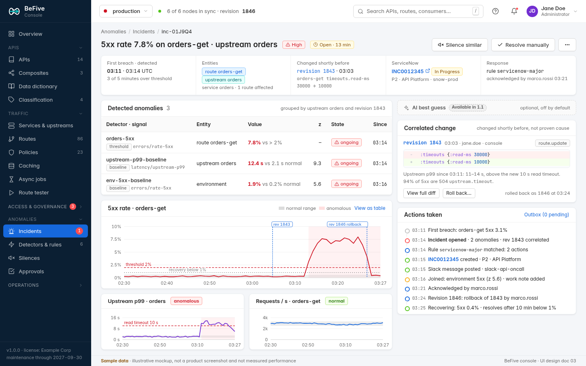
*Figure 6. Incident detail with detected anomalies, charts, the correlated change with a rollback shortcut, actions taken, the ServiceNow link, and the 1.1 placeholder for the AI best guess (sample data).*

- **Purpose:** understand one incident quickly: what was detected, since when, what changed, and what BeFive already did.
- **Roles:** all V; Adm, Op: acknowledge, note, silence similar, resolve manually, approve or reject pending traffic actions, revert overrides, roll back the correlated change (Op and Adm; this opens the revision rollback of 5.13); AM: acknowledge, note, silence similar, resolve manually.
- **Layout:** page header with severity `Tag`, title, status `Tag`, and actions (Acknowledge, which disappears once someone has acknowledged; Silence similar; Resolve manually; `Dropdown` with "Copy link", "Open in CloudWatch", "Open in Datadog"). A `Descriptions` strip: first breach and detection times with zone, detectors, entities (links, now including API and operation), correlated change (revision link with the changed path, "changed shortly before", never "caused by"), and ServiceNow (number link, state, assignment group; or the pending/failed state with "Retry").
- **Main column:** unchanged from Draft 3: "Detected anomalies" table, the primary chart with baseline band, threshold, anomaly period, and revision markers, small multiples, and evidence `Tabs` (Top error codes, Upstream health events, Sample requests, Configuration changes). Every chart has "View as table".
- **Side column (Draft 4):**
  - **AI best guess placeholder** at the top of the column: a muted one-line `Card` "AI best guess · Available in 1.1 · optional, off by default" (pattern 4.8). In 1.1 this becomes the AI panel of 4.7 at the same position, **collapsed by default** so the measured facts below stay in view (resolving Draft 3 open question 7 in favor of facts first).
  - **Correlated change** `Card` (new in Draft 4): revision number, author, time, and source, and the changed paths as a compact diff (for example `:timeouts {:read-ms 30000}` → `10000`), a one-line factual note ("upstream p99 since 03:11: 11–14 s, above the new 10 s read timeout"), and the header note "changed shortly before, not proven cause"; actions "View full diff" and **"Roll back…"** (Adm, Op; opens the rollback confirmation of 5.13 prefilled with this revision; after a rollback the card shows "rolled back as 1846 at 03:24"). When several changes correlate, a list with the closest first. When none correlates, the card says "No configuration change in the 60 minutes before the first breach".
  - **Actions timeline** (`Timeline`): detection, rule matches, script runs (link to input and output), ServiceNow create, notes, and resolve with the incident number, Slack and webhook posts, traffic actions with their mode ("dry run: would block 198.51.100.23/32 for 30 min"), approvals with Approve and Reject buttons, active overrides with a countdown and "Revert now", acknowledgements, and silences. Failed actions are red with the error and "Retry".
- **Empty/errors:** a resolved incident whose signals were pruned shows the stored summary values and says "Minute data older than 8 days has been removed".
- **Destructive:** approve traffic action (`Modal.confirm` with the override, duration, impact estimate, and the environment badge); revert override (`Popconfirm`); roll back (the 5.13 confirmation).

### 5.17 Detectors & rules

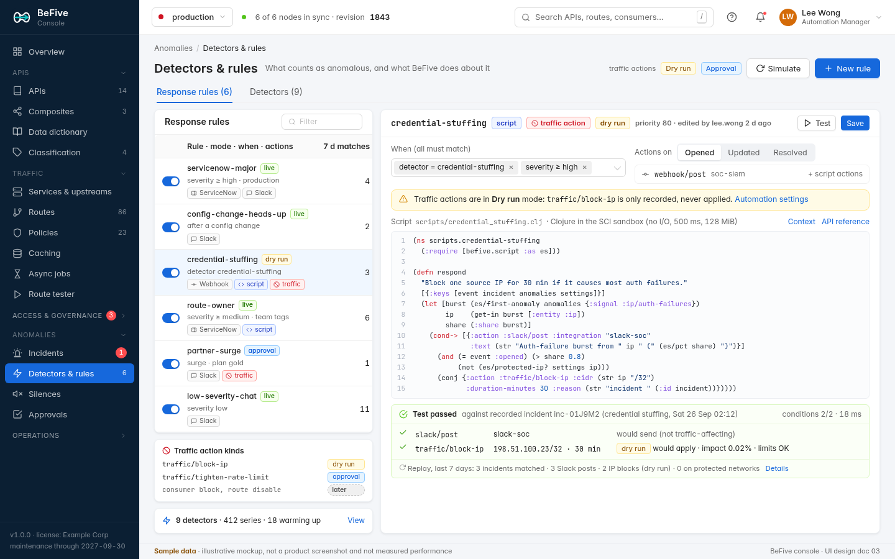
*Figure 7. Response rules list, traffic action kinds, the rule editor, script editor, and test results, as seen by an Automation Manager (sample data).*

- **Purpose:** decide what counts as anomalous and what BeFive does about it; test changes against recorded traffic before they go live.
- **Roles:** all V; Adm, **AM** E detectors, rules, scripts, and traffic actions; Op E silences and rules without scripts or traffic actions; Aud can run tests and simulations (no save).
- **Components:** `Tabs` (Response rules, Detectors). Left: rules `Table` (enabled `Switch`, priority, name, condition summary, action icons with a red "traffic" `Tag` when a rule can affect traffic, "script" `Tag`, mode `Tag` "live", "dry run", or "approval", 7-day matches); below it a **Traffic action kinds** `Card` (new in Draft 4) listing the two 1.0 kinds with their current mode (`block-ip` dry run, `tighten-rate-limit` approval) and the muted line "consumer block, route disable · later", with a link to 5.14.3. Right: the **rule editor** for the selected rule:
  - *When:* as in Draft 3 (severity, detectors and signals, entities by ID or tag, environment, correlated change, minimum duration, business hours).
  - *Actions per event:* `Segmented` (Opened, Updated, Resolved, Reopened); each action is a row with its integration `Select` and options. "Add action" `Dropdown` groups: **Tickets** (ServiceNow incident), **Notify** (Slack, Webhook; Teams and Email shown muted with "1.1"), **Traffic** (Block IP, Tighten rate limit; Block consumer and Disable route shown muted with "later"). The Draft 3 "AI analysis" group returns in 1.1. Traffic actions are hidden for users without the permission and, when the global mode is Off, show the inline `Alert`: "Automatic traffic actions are Off. This action will be recorded as denied. [Automation settings]".
  - *Script* (collapsible; Administrators and Automation Managers edit): CodeMirror 6 with Clojure syntax, autocomplete for `befive.script` helpers, and inline compile and allow-list errors. Helpers for 1.1 actions are listed in the context drawer with a "1.1" tag and rejected at save in 1.0 ("`:teams/post` is not available in this version").
  - *Test:* as in Draft 3 (recorded or synthetic input, matched conditions, returned actions, rail outcome and mode per action, run time; "Replay 7 days").
- **Detectors tab:** unchanged from Draft 3, plus the built-in **IdP health** detector (JWKS fetch age and introspection errors per identity provider, `01` 2.3).
- **Fields and validation:** schemas in `02-architecture.md` 14.15; a rule with neither actions nor a script is an error; actions not available in the running version are errors.
- **Empty:** "No response rules yet. Built-in detectors notify the console only. Add a rule to create ServiceNow incidents or notify a channel. [New rule from template]" with templates (ServiceNow for high severity, Slack for all, credential stuffing IP block in dry run, partner surge rate-limit tightening with approval).
- **Destructive:** disabling a rule (`Popconfirm`); deleting a rule referenced by pending actions (`Modal.confirm` listing them; pending actions are cancelled).

### 5.18 Silences

- **Purpose:** pause responses during planned work or for known noise, without losing detection records.
- **Roles:** all V; Adm, Op, AM E.
- **Components:** as in Draft 3; the matcher keys add API, operation, and application. "Silence similar" on an incident opens the drawer prefilled with its entities.
- **Destructive:** ending a silence early (`Popconfirm`: "Incidents still open will fire their opened actions now").

### 5.19 Approvals & overrides

- **Purpose:** decide on traffic actions that need a human, and see and undo every temporary traffic change.
- **Roles:** all V; Adm, Op approve, reject, revert, and create manual overrides (`01` 2.17: Operators approve and revert). Automation Managers view (they configure modes and rules but do not approve their own automation).
- **Components:** header shows the automation mode `Tag`; `Card` "Pending approvals" (`Table`: incident link, rule, proposed action and target, duration, impact estimate, expires in, Approve and Reject); `Card` "Active overrides" (`Table`: kind (IP block or rate-limit tightening in 1.0), target, scope, created by, reason, incident, expires in, "Revert now"); "New manual override" `Drawer` (maximum 24 h; same rails). A global banner, "2 active traffic overrides", appears on every page while any override is active.
- **Destructive:** approve (`Modal.confirm` with impact); revert (`Popconfirm`).

### 5.20 APIs list and API detail

**List** (`/apis`)
- **Purpose:** the main catalog for operators and API owners: every API with its versions, lifecycle, classification, owner, and traffic.
- **Roles:** all V; Adm, Op E; API Owners E own (2.2).
- **Components:** page header with count, actions **Import OpenAPI** (primary, 5.21), New API, Export; filter bar (text, domain, owner, classification, lifecycle, tag, environment availability, `Segmented` "My APIs | All" for API Owners); `Table`: API (name, ID, domain), versions (`Tag` per version colored by lifecycle: Design grey, Published green, Deprecated amber with sunset date in a `Tooltip`, Retired struck-through), classification badge (4.9), owner (team or person), operations count, requests per second (sparkline), 5xx rate, consumers (applications subscribed), environments (chips for Dev, Test, Prod, Sandbox where the version exists, from linked environments 5.31), last changed.
- **Empty:** "No APIs yet. Import an OpenAPI document to create an API with its versions and operations, or create one by hand. [Import OpenAPI] [New API]".

**API detail** (`/apis/:api/:tab`)
- **Header:** name, ID, classification badge, owner, domain, tags; actions Import new spec revision, Add version, Export OpenAPI (`Dropdown`: as imported, as enriched by BeFive with security schemes, rate-limit headers, and deprecation information), View EDN.
- **Tabs:**
  - *Overview:* description (Markdown editor with preview, sanitized), links to guides, per-version summary cards (lifecycle, operations, requests, consumers), the API's Overview dashboard scope link (5.2).
  - *Versions:* `Table` of versions (name, lifecycle, versioning rule, default `Tag`, backing service or upstream, environments, operations, created); "Add version" (copy from an existing version, or import a spec); the **versioning rule** editor per API: `Radio.Group` path prefix / header / host / media type / query parameter, with the parameter name or pattern, and the default version for requests that name none (`01` 2.8).
  - *Operations:* `Table` across versions (method tag, path template, operation ID, summary, classification if overriding, policies set at this level (count with source chips), request validation `Switch`, mock responses `Switch` (Sandbox only), deprecation, requests per second); row click opens 5.22.
  - *Docs:* rendered OpenAPI per version as the portal shows it (the same renderer, 5.37), with portal visibility settings: visible to Okta groups and named users at API, version, and operation level (`Select mode="multiple"` with group search from the Okta integration), and "Allow production target in try-it" (`Switch`, off), and "Allow BeFive-generated Okta client keys" (`Switch`, on; shown only when the Administrator allowed generated keys in 5.14.6; hidden with "Not available for Restricted APIs" when the API is Restricted).
  - *Policies:* the level editor (5.6) for the API level; the version and path levels open from the version and operation pages.
  - *Consumers:* applications subscribed per version, with plan, organization, last call, and deprecated-call counts.
  - *Deprecation:* the deprecated-usage view (5.32) for this API.
  - *Changelog:* entries per version (generated from spec diffs and lifecycle transitions, editable before publishing to the portal, 5.40).
  - *EDN.*
- **Lifecycle** (`01` 2.11): each version's lifecycle `Tag` in the header of the version page is a `Dropdown` with the allowed next states: Design → Published → Deprecated → Retired (and Deprecated → Published to undo). Transitions open a `Modal`:
  - *Publish:* checks (spec valid, every operation has an access decision, classification set, at least one environment) as a checklist; publishing makes the version visible in the portal to its audiences.
  - *Deprecate:* deprecated date (default today), sunset date (required, ≥ 30 days ahead with a warning below 90 days), migration link, and options for the `Deprecation`, `Sunset`, and `Link` headers (on by default); a preview of the headers; **Email notices** (`Switch`, on by default; schedule `Checkbox.Group` At deprecation, 30 days before sunset, 7 days before sunset, At sunset; reply-to; a short note for developers) with "14 applications (22 developers) will be emailed" and the list behind a link (5.40).
  - *Retire:* only after the sunset date or with an override reason; shows applications that called the version in the last 30 days (5.32) and the `410 Gone` response that callers will get (with its documentation link). Retire is type-to-confirm with the version name and requires the Operator or Administrator role.
- **Destructive:** delete API (only when every version is in Design or Retired with no traffic in 30 days; type-to-confirm); delete version (Design only).

### 5.21 OpenAPI import with diff preview

- **Purpose:** create or update an API, version, and operations from an OpenAPI 3.0 or 3.1 document, and see exactly what changes before applying (`01` 2.11, DEV-007).
- **Roles:** Adm, Op E; API Owners for their APIs.
- **Flow** (`Steps`, one page): 
  1. **Source:** `Upload.Dragger` (YAML or JSON), URL `Input` (fetched through the SSRF guard), or paste (CodeMirror). The browser parses and shows "OpenAPI 3.1.0 · 15 operations · 42 schemas".
  2. **Target:** new API (name, ID, domain, owner, classification prefilled from `info` and `x-` extensions) or an existing API and version (`Select`; new version or a new revision of an existing one).
  3. **Lint and diff:** left, the **deterministic lint** results (1.0: missing operation IDs, missing descriptions, undocumented error responses, schemas without examples, names inconsistent with the data dictionary, security schemes BeFive cannot enforce) as a list with severity and "Go to line"; a muted "AI suggestions · Available in 1.1" row (DEV-006). Right, the **diff preview**: summary `Statistic`s (operations added, changed, removed; schemas changed; breaking changes), a `Tree` by path with change `Tag`s, and for a selected operation a side-by-side diff of its spec fragment and of the BeFive operation it maps to. **Breaking changes** (removed operation, removed or narrowed field, new required parameter) are flagged red with the applications that called the affected operation in the last 7 days.
  4. **Mapping:** how operations map to routes: backing service or upstream per version (`Select`), path prefix from the versioning rule, which operations keep hand-made settings, and which removed operations are deleted versus deprecated (default: deprecate if called in the last 30 days).
  5. **Apply:** "Apply as revision N" with the standard confirmation; or "Save as draft" (Design versions only).
- **Errors:** parse errors with line and column; unsupported features (for example `callbacks`) listed as warnings that do not block; references that cannot be resolved block with the JSON Pointer.

### 5.22 Operation detail and the effective policy view

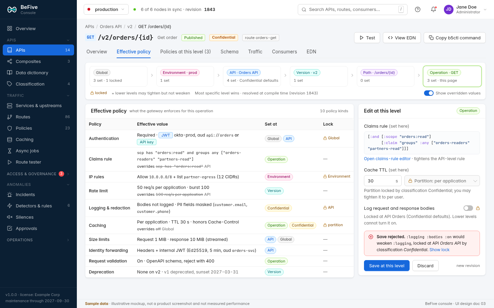
*Figure 8. Operation detail, Effective policy tab: the six-level chain, each policy kind with its effective value, source level, and lock, the "Edit at this level" panel, and a save rejected by a lock (sample data).*

- **Purpose:** answer "what does the gateway actually enforce for this operation, and why?" (`01` 2.4, POL-002, GOV-6), and edit the operation level without guessing about inheritance.
- **Roles:** all V; editing as for policy levels (2.2).
- **Header:** method tag and full path (`GET /v2/orders/{id}`), operation ID and summary, lifecycle and classification badges, the generated route ID; actions Test (opens the tester on this operation), View EDN, **Copy b5ctl command** (`b5ctl policy effective orders v2 getOrder`).
- **Tabs:** Overview, **Effective policy**, Policies at this level, Schema (request and response schemas with data dictionary links and classification tags such as PII; request validation settings), Traffic (per-operation charts with p50, p90, p95, p99), Consumers, EDN.
- **Effective policy tab:**
  - **Level chain:** six cards (Global, Environment · prod, API · Orders API, Version · v2, Path · `/orders/{id}`, Operation · GET), each with the count of values set and locked there; clicking a card filters the table to values set at that level. The current level is highlighted. A legend explains the lock and "most specific level wins · resolved at compile time (revision 1843)".
  - **Table** with one row per policy kind (authentication, claims rule, IP rules, rate limit, logging and redaction, caching, size limits, identity forwarding, request validation, deprecation): effective value in plain language with monospace details, **set at** source chips (one or more when values merge, for example a classification default and an API value), and **lock** (level that locked it, or "—"). With "Show overridden values" on, a struck-through line shows what a lower level replaced ("overrides 100 req/s per application · API").
  - **Edit at this level** side panel: fields for the current level only, with inherited placeholders (4.9), the claims rule (opens 5.23), and locked items shown read-only with an explanation ("Locked at API Orders API (Confidential defaults). Lower levels cannot turn it on."). Save writes a new revision.
  - **Lock violation:** an attempted weakening (from the panel, EDN, or a pasted value) shows an inline error `Alert`: "Save rejected. `:logging :bodies :on` would weaken `:logging`, locked at API Orders API by classification Confidential. [Show lock]". The same message comes from the server and from `b5ctl` (`01` 2.4).
- **Credential forwarding flag:** if any level forwards the original credential upstream, the identity forwarding row shows an amber "forwards credential" tag (`01` 2.5).

### 5.23 Claims-rule editor

- **Purpose:** write scope and claims rules (`01` 2.3, IAM-003) without learning the expression syntax, and test them against real tokens.
- **Where:** a `Drawer` from the effective policy panel, the named policy builder (predicate type "Claim rule"), and the route form.
- **Components:** rows combined by `Segmented` ALL / ANY (nestable once more); each row: claim path `AutoComplete` (suggests `scp`, `groups`, `sub`, `cid`, and custom claims seen in recent tester runs), operator `Select` (equals, in set, contains any of, contains all of, present, absent, number greater/less, time before/after), value input that matches the operator (tags for sets, date-time picker for times). Live **expression preview** in EDN (`[:and [:scope "orders:read"] [:claim "groups" :any ["orders-readers" "partners-read"]]]`) and in plain language. **Test** box: paste a token (decoded locally, never stored) or pick a recent tester identity; shows true/false per row.
- **Validation:** shared `Rule` schema; claim paths ≤ 8 segments; sets ≤ 64 values; the editor marks tightening versus weakening relative to the inherited rule when a lock exists ("tightens the API-level rule").

### 5.24 Data dictionary

- **Purpose:** find a field across all APIs, see its definition, owner, tags, and where it is used (`01` 2.11, DEV-008), and drive redaction (`01` 2.13).
- **Roles:** all V; Adm, Op E; API Owners E fields of their APIs (removing a PII tag requires Adm or Op).
- **Components:** search (`Input.Search` with suggestions) and facets (API, tag such as PII, type, owner); `Table`: field name (canonical, for example `customer.email`), type, description, tags (`Tag`s: PII, secret, financial), owner, used in (count of schemas and operations), inconsistencies (same name with different types across APIs). Field detail: definition, examples, synonyms (fields in other APIs mapped to this one), usages as a list of API › version › schema path, and **effects**: "Masked in logged body samples and LLM context (1.1); excluded from shared cache keys".
- **Empty:** "The dictionary fills itself from imported OpenAPI schemas. Import a spec to start."

### 5.25 Classification levels and default policies

- **Purpose:** define classification levels and what each level means for policy and approvals (`01` 2.6, SEC-004, GOV-4).
- **Roles:** all V; Adm E.
- **Components:** an ordered list of levels (default Public, Internal, Confidential, Restricted; add, rename, reorder) with the badge preview; per level a detail with three cards: **Default policies** (the policy kinds of 4.9, each with value and a Lock `Switch`; shipped defaults: Restricted = no response caching, internal IP ranges only, body redaction, stronger approval chain; Confidential = per-application cache partition, body redaction), **Access-request routing** (approval chain: auto-approve, API owner, API owner then security approver group, or a ServiceNow or webhook workflow; who may approve each step), and **Usage** (APIs, versions, operations at this level).
- **Behavior:** changing a default shows the operations whose effective policy changes and any lower-level values that a new lock would invalidate; saving writes one revision. An API Owner can propose a level for their API; an Operator or Administrator confirms (2.2).

### 5.26 Composite endpoints: graph builder and test trace

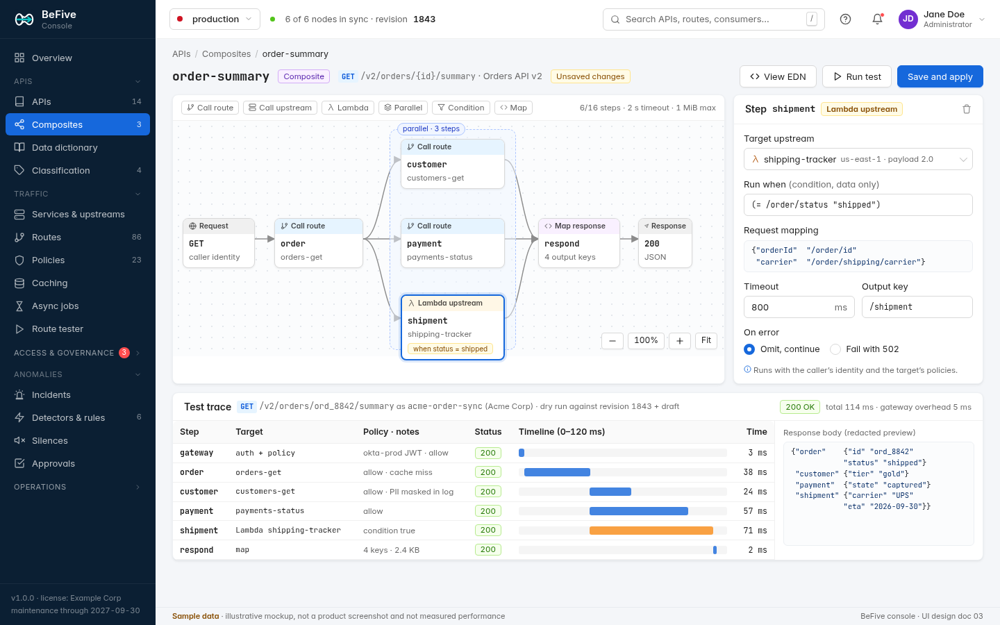
*Figure 9. Composite `order-summary`: graph builder with a parallel group and a conditional Lambda step, step inspector, and the per-step test trace (sample data).*

- **Purpose:** build a composite endpoint (`01` 2.9, API-003) from existing routes and upstreams without code, and see per step what happened.
- **Roles:** all V; Adm, Op E; API Owners E for composites in their APIs.
- **List** (`/composites`): `Table` with composite, path, API and version, steps, p99, 5xx rate, last changed. "New composite" asks for the API, version, method, and path (it becomes an operation of that version).
- **Builder** (`/composites/:id`):
  - **Palette** above the canvas: Call route, Call upstream, Lambda, Parallel, Condition, Map. **Limits** shown live: "6/16 steps · 2 s timeout · 1 MiB max" (the composite's limits from its settings; exceeding a limit is a validation error).
  - **Canvas** (React Flow, `@xyflow/react`, 8.2): Request node, step nodes (kind label, step ID, target), parallel groups as a dashed frame, a condition badge on conditional steps ("when status = shipped"), Map response, and Response nodes. Edges are drawn by data dependency; **no loops** can be drawn (the canvas refuses a cycle with "Composites cannot contain loops"). Zoom, fit, and a keyboard-accessible **outline view** (a `Tree` of steps with Move up/down) as the alternative to dragging.
  - **Step inspector** (right panel): target (`Select` of routes or upstreams, including Lambda with region and payload format), run when (condition expression, data only, validated by the claims-expression schema family), request mapping (JSON Pointer and templates, CodeMirror with key completion from the previous steps' example outputs), timeout, output key, on error (`Radio` omit and continue / fail with 502). A note: "Runs with the caller's identity and the target's policies" (`01` 2.9: composition cannot bypass access control).
  - **Optional expression step:** a Map step can contain an SCI expression (run in the out-of-process script runner); it shows a "script" tag and its own timeout.
  - **Test trace** (bottom): run against the current revision plus the draft as a chosen application (`Select`, default a recent caller), dry run by default; result `Table` per step (step, target, policy and notes such as "allow · cache miss" or "PII masked in log", status, a timeline bar on a common time axis, time), total and gateway overhead, and the redacted response preview. The same trace appears in the route tester (5.5).
- **Errors:** unknown targets, mapping paths that reference outputs not produced earlier, and limits are listed in an error summary with links to the step.
- **Destructive:** delete composite (type-to-confirm if called in 24 h).

### 5.27 Caching: cache policy and purge

- **Purpose:** see what is cached, hit ratios, and purge safely (`01` 2.7, TRAF-004).
- **Roles:** all V; Adm, Op E policies and purge; API Owners purge their APIs.
- **Components** (`/caching`): `Statistic`s (hit ratio, entries, memory per node, Redis tier status if enabled, encrypted `Tag` "AES-GCM · key k-2026-09"); `Table` of cache policies in use (API › operation, TTL, partition public / per application / per user, honors `Cache-Control`, hit ratio, entries, source chip of where the policy is set); Restricted APIs listed as "caching off (Restricted default)" with the lock.
- **Purge** `Drawer`: scope `Radio` (one operation, one API version, a key prefix, everything for one application), a preview "≈ 1,240 entries on 6 nodes and Redis", reason (required), "Purge" (`Modal.confirm`; type-to-confirm for whole API or everything). Purge history (`/caching/purges`): time, actor, scope, entries removed, reason; all audited.

### 5.28 Asynchronous endpoints and the job browser

- **Purpose:** configure asynchronous endpoints and see jobs and their result files without exposing the files (`01` 2.10, TRAF-006, TRAF-007).
- **Roles:** all V of metadata (API Owners their APIs); Adm, Op E endpoints; retrieving a result from the console is Administrator-only, requires a reason, and is audited (2.2).
- **Endpoint form** (`/jobs/endpoints/:id`, also reached from "New route › Asynchronous"): dispatch `Radio` (HTTP with callback URL, asynchronous Lambda, Amazon SQS queue with queue URL), result store (`Select`: S3 with SSE-KMS bucket and key, S3-compatible endpoint, local filesystem for single-node installs), BeFive envelope encryption `Switch`, retention (`InputNumber` days), who may retrieve (job owner always; plus groups or scopes), delivery (`Radio` proxied through the gateway / presigned URL with lifetime ≤ 15 min), client webhook callbacks (`Switch`, HMAC signing secret), job time-out. A **Test** that submits a synthetic job and follows it to completion.
- **Job browser** (`/jobs`): filters (endpoint, state, application, time); `Table`: job ID, endpoint, application, state `Tag` (queued, running, succeeded, failed, expired), submitted, duration, result size, retrievals count, expires. Job detail: state timeline, callback attempts, retrieval log (who, when, how: proxied or presigned), and for Administrators "Retrieve result" (reason `Input`, then download through the control plane).
- **Empty:** "No asynchronous endpoints. Use one when a backend takes longer than a client should wait: BeFive returns 202 with a job ID and stores the result."

### 5.29 Access requests and approvals

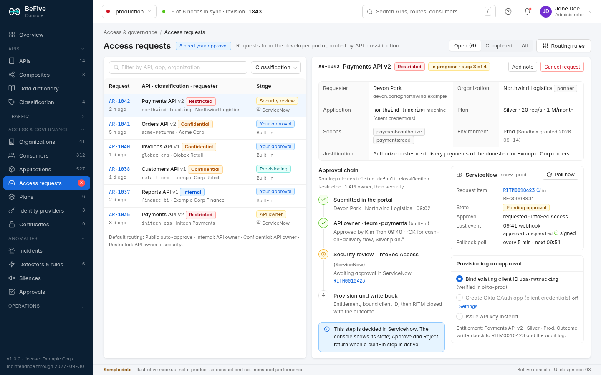
*Figure 10. Access requests: queue with stage per request, and request AR-1042 for a Restricted API with the approval chain, the ServiceNow security step, and provisioning options (sample data).*

- **Purpose:** decide on access requests from the portal and see each request's chain end to end, whether the decision is built in, in ServiceNow, or in another workflow system (`01` 2.6, SEC-003, GOV-1).
- **Roles:** all V; approvers decide only the steps assigned to them: API Owners the owner step for their APIs, the configured security approver group the security step, Administrators any step; Consumer Managers if a routing rule names them (2.2). The nav badge counts requests waiting for the signed-in user.
- **Queue** (left): segmented Open / Completed / All; filter by API, application, organization, classification; rows with request number, API and version, classification badge, requesting application and organization, age, and **stage** (`Tag` "Your approval", "API owner", "Security review" with the ServiceNow icon, "Provisioning", "Approved", "Rejected", "Cancelled"). A footer shows the default routing ("Public: auto-approve · Internal: API owner · Confidential: API owner · Restricted: API owner + security"), linking to routing rules (`/access-requests/routing`, edited in 5.25).
- **Request detail** (right):
  - Header: number, API and version, classification, state ("In progress · step 3 of 4"), actions Add note, Cancel request (Adm and the requester in the portal).
  - `Descriptions`: requester (portal user), organization, application (type: machine or user-facing), plan requested, scopes requested, environment (with the Sandbox entitlement status), justification.
  - **Approval chain** (`Steps` vertical): submitted, each approval step with approver or group, time, comment, and system (built-in or ServiceNow), provisioning and write-back. Built-in steps assigned to the user show **Approve** and **Reject** (comment required for reject; optional conditions such as a lower plan or shorter expiry). For ServiceNow steps, an info `Alert` says the decision is made in ServiceNow, and a **ServiceNow** card shows the request item (`RITM0010423` in `REQ0009931`, link), state, approval group, last event ("09:41 webhook approval.requested · signed"), and the fallback poll schedule with **Poll now**.
  - **Provisioning on approval** card: `Radio` **Bind existing client ID** (default; the client ID `Input` with a check that it exists in the linked Okta IdP), **Create Okta OAuth app** (shown only when enabled in 5.14.6; otherwise muted "off · Settings"), or **Issue API key instead**. The resulting entitlement is summarized ("Payments API v2 · Silver · Prod") and the outcome is written back to ServiceNow and the audit log.
- **Errors:** ServiceNow unreachable (amber state "waiting for ServiceNow · retrying"; the request is never auto-approved by a failure); webhook signature invalid (logged, ignored, poll continues); Okta app creation failed (request stays approved, provisioning failed with "Retry" and the Okta error).
- **Destructive:** reject (comment required); revoke an approved entitlement later from the application's Subscriptions tab (5.7).

### 5.30 Reports: report builder and scheduled reports

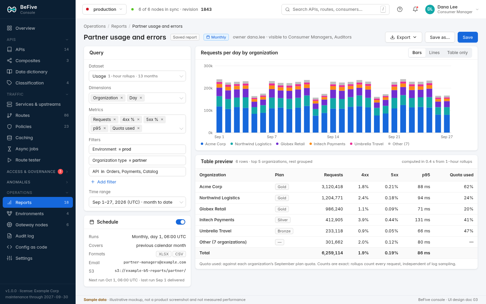
*Figure 11. Report builder: saved monthly report "Partner usage and errors" with query panel, chart, table preview, and schedule (sample data).*

- **Purpose:** answer usage, performance, error, and security questions without SQL or CloudWatch, and deliver them on a schedule (`01` 2.15, OBS-007).
- **Roles:** dataset access by role (2.2); report owners edit their reports and schedules; Administrators edit all.
- **List** (`/reports`): tabs Saved (shipped reports such as "Monthly usage by consumer" from Draft 3, "Deprecated operations still called", "Access request outcomes", plus user reports), Scheduled (next run, last result, recipients), Runs (history with downloads).
- **Builder** (`/reports/:id`):
  - **Query** panel: dataset `Select` (Usage, Consumers, Performance, Errors, Policy and security events, Audit events; each with its source and granularity, "1-hour rollups · 13 months"), dimensions (multi-select tags: API, version, operation, organization, consumer, application, environment, status class, time bucket), metrics (requests, 4xx %, 5xx %, p50 to p99, quota used, denials, cache hit ratio, as allowed by the dataset), filters (rows of field, operator, value), time range (presets and custom, in UTC with the user's zone shown).
  - **Result:** chart (`Segmented` Bars / Lines / Table only; top 5 series, rest grouped as "Other (n)") and a table preview with totals; a footnote that counts are exact (rollups count every request regardless of log sampling).
  - **Schedule** card: enable `Switch`, recurrence (daily, weekly, monthly on day N at a time in UTC), period covered (previous day, week, calendar month), formats (CSV, JSON, XLSX if approved in `01` 3.2), delivery (email to addresses or groups via the SMTP integration; S3 bucket and prefix), next and last run. Email deliveries attach files up to 10 MB, otherwise send a link to the console download.
  - Header actions: Export (`Dropdown`: CSV, JSON, XLSX), Save as…, Save; visibility `Select` (only me, roles).
- **Errors:** dataset not permitted for the role (hidden from the `Select`); query too large ("more than 100,000 rows; add a filter or export instead"); delivery failures appear on the run and in notifications.

### 5.31 Environments: linked environments and the promotion wizard

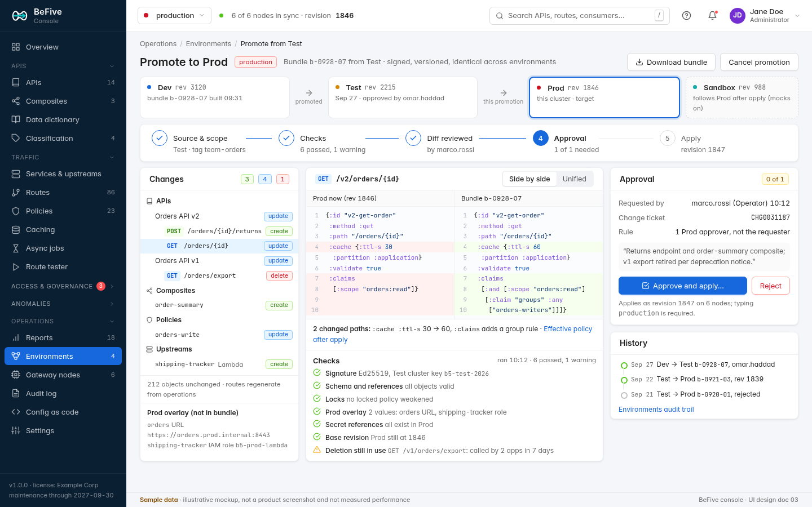
*Figure 12. Promotion of bundle b-0928-07 from Test to Prod: environment path, steps, change tree, side-by-side diff, checks, and the approval card (sample data).*

- **Purpose:** see the linked environments and promote a signed bundle from one to the next with diff, checks, approval, and audit on both sides (`01` 2.12, API-007, POL-004). This replaces Draft 3's export-and-import promotion as the recommended console path (6.5, 6.10).
- **Roles:** all V; Adm link and unlink environments; requesting a promotion: Adm, Op, API Owners (own APIs); approving and applying: Adm, Op who did not request it (2.2).
- **Environments** (`/environments`): cards per linked environment (Dev, Test, Prod, Sandbox) with role (`Tag` "this cluster", "hosts portal", "follows Prod" for Sandbox), console URL, current revision, last promotion in and out, reachability, and bundle signing key. "Link environment" (`Drawer`: console URL, mutual trust via a one-time link token generated in the other environment, signing key fingerprint check). Per environment, an **overlay** tab lists environment-specific values (upstream URLs, discovery settings, IAM roles, secret references) that stay out of bundles.
- **Promotion wizard** (`/environments/promotions/new`, `/environments/promotions/:id`):
  - **Path strip:** each environment with revision and status; the source and target highlighted, Sandbox noted as "follows Prod after apply (mocks on)".
  - **Steps:** Source & scope (source environment, scope by API, tag, or explicit objects; bundle built and signed in the source), Checks, Diff reviewed, Approval, Apply.
  - **Changes** tree by kind (APIs and operations, composites, policies, upstreams) with create/update/delete counts and tags; "212 objects unchanged; routes regenerate from operations". The **Prod overlay (not in bundle)** box lists the target values that will be used.
  - **Diff** for the selected object: side by side or unified, with a summary of changed paths and a link to the effective policy after apply.
  - **Checks:** signature and key (`Ed25519`, key ID), schema and references, **locks** (no locked policy weakened in the target), overlay values present, secret references exist in the target, base revision unchanged, and warnings such as "Deletion still in use: GET /v1/orders/export called by 2 apps in 7 days". Failing checks block approval; warnings need acknowledgement.
  - **Approval** card: requester, change ticket (`Input`, optional or required per environment), approval rule ("1 Prod approver, not the requester"), requester's note, **Approve and apply…** (type-to-confirm with the environment name) and Reject; history of recent promotions.
- **Errors:** the target changed since the diff (base revision moved): the diff is recomputed and approval resets; the source unreachable while building (retry); signature not trusted (blocking, with the key fingerprint).
- **Destructive:** apply (type-to-confirm); unlink environment (type-to-confirm; promotions in flight are cancelled).

### 5.32 Deprecated-usage view

- **Purpose:** show who still calls deprecated operations, versions, and APIs before retirement (`01` 2.8, API-002, OBS-007).
- **Where:** the *Deprecation* tab of each API (5.20), the Overview panel (5.2), and the shipped saved report "Deprecated operations still called" (5.30), which uses the same data with scheduling and export.
- **Components:** filters (API, version, sunset before, minimum calls); `Table` grouped by deprecated item: operation or version, deprecated and sunset dates (days left as a `Tag`, red under 30), then per application: organization, consumer contact, calls in the last 7 and 30 days, last call time, trend sparkline, notice status (emailed per notice point, opted out, seen in the portal; 5.40). Actions: "Copy contact list", "Open as report", and "Send portal notice" (posts a deprecation notice to those applications' developers in the portal, 5.40).
- **Empty:** "Nothing deprecated is being called." 

### 5.33 Developer portal: structure, hosting, and the 0.x preview

The developer portal is a separate single-page application for **developers** ("Devon", 2.1), internal and external (`01` 2.11, DEV-001 to DEV-005). It shares the component library, the design tokens, and the malli schemas with the console, but has its own build (8.11), its own hostname, its own Okta OIDC application, and a lighter look (7.9).

- **Hosting:** one portal, served by the **production** control plane on its own hostname (sample: `https://developer.example.com`). It lists APIs from all linked environments and shows each version's availability per environment; try-it goes to the **Sandbox** cluster (`01` 2.11, decision on one portal).
- **Layout:** light header (56 px, white, with a 3 px navy top rule) containing the mark (the customer's logo if uploaded, otherwise the BeFive small mark) with the portal title "Example Corp / Developer Portal", top navigation (Home, APIs, Guides, Applications, Access requests), global search (`/`), and the user menu (name, organization, "My profile", sign out). No left sider: content is centered, max 1,360 px. Footer: support contact, terms link, "Powered by BeFive" (removable by configuration).
- **URLs** (on the portal hostname):

| Path | Screen | 0.x preview |
|---|---|---|
| `/` | Home (5.35) | yes (catalog highlights only) |
| `/apis`, `/apis?q=…&facet=…` | Catalog (5.36) | yes |
| `/apis/:api` and `/apis/:api/:version/:tab` | API page (5.37); tabs `docs`, `changelog`, `guides`, `access`; `/apis/:api/:version/docs/:op` deep-links an operation | yes (docs and changelog only) |
| `/guides`, `/guides/:slug` | Guides (Markdown pages managed in the console) | yes |
| `/apps`, `/apps/new`, `/apps/:id` | Applications and keys (5.38) | no |
| `/requests`, `/requests/:id` | Access requests (5.39) | no |
| `/changelog` | Changelog across visible APIs (5.40) | yes |
| `/login`, `/callback` | Okta sign-in (5.34) | yes |

- **0.x preview (read-only):** Okta login, group and user visibility, catalog search and facets, and OpenAPI-rendered docs (`01` 2.11, 4.1). Subscriptions, keys, try-it, and access requests are **absent** in 0.x (not shown disabled): the navigation shows Home, APIs, Guides only; the API page has no Access tab and no try-it panel; the "Your applications" rail is replaced by "Questions? Contact the API team" with the support contact. A dismissible banner reads "Preview: browse and read API documentation. Requesting access and keys arrive with BeFive 1.0." Partners may reach the preview from outside (owner decision, October 1, 2026), so it is designed for an external audience from 0.x: the sign-in page, error pages, and empty states never reveal hidden API names, and the hardening checklist of 5.14.6 applies.
- **Roles:** portal users have no console roles. Visibility comes from Okta groups and named users on APIs, versions, and operations; actions come from entitlements on their applications (`01` 2.11). Console users can open the portal with their own Okta identity like any developer.

### 5.34 Portal sign-in and visibility

- **Sign-in:** `/login` shows the portal title and one button "Sign in with Okta" (OIDC authorization code with PKCE). There are no local portal accounts. After sign-in, the user's Okta groups determine their organization (5.14.6 mapping) and visibility. Users in no mapped group see an empty catalog with "You don't have access to any APIs yet. Ask your contact at Example Corp to add you to a developer group." 
- **Visibility rules surfaced in the UI:** APIs, versions, and operations the user cannot see do not appear anywhere (search, counts, changelog, links): the portal never shows "hidden" placeholders, and deep links to invisible items return the standard not-found page, so a catalog cannot be enumerated. Visible but not entitled items show a "Request access" action.
- **Session:** idle timeout 60 min, absolute 12 h (configurable); during an Okta outage, existing sessions continue until they expire and new sign-ins show "Sign-in is temporarily unavailable because Okta cannot be reached. Existing applications and keys keep working." (`01` 2.3).
- **Errors:** Okta errors show the error code and a request ID; an expired session returns to the page after sign-in.

### 5.35 Portal home

- **Purpose:** the landing page after sign-in: what is new, what needs attention, where to start.
- **Components:** greeting with the organization; a search box (focus on load); **Needs attention** (1.0): pending access requests, keys expiring within 30 days, deprecations affecting the user's applications with sunset dates (from 5.32 data, only for the user's own applications); **Your applications** (1.0) with environment chips; **Featured APIs** (`Card`s chosen by administrators or the most used visible APIs); **Recently updated** (from the changelog); links to getting-started guides. In 0.x only search, featured, recently updated, and guides are shown.
- **Empty:** a first-time developer with no applications sees "Get started: 1. Find an API · 2. Create a sandbox application · 3. Try it" with links.

### 5.36 Portal catalog: search and facets

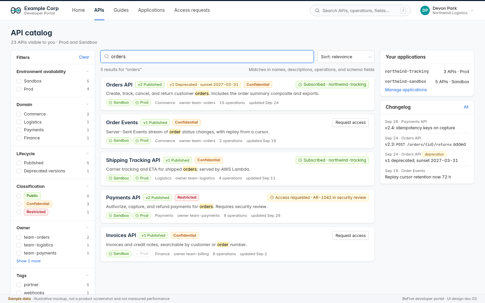
*Figure 13. Developer portal catalog: search for "orders" with facets, result cards with lifecycle, classification, environment availability, and subscription or request state, plus the side rail (sample data).*

- **Purpose:** find an API by name, description, operation, or schema field (`01` 2.11, DEV-002).
- **Components:**
  - **Search** `Input` with highlighted matches; sort `Select` (relevance, name, recently updated); a result summary ("5 results for 'orders'") with active facet chips; a note on what is searched ("names, descriptions, operations, and schema fields").
  - **Facets** (left, collapsible groups with counts that update with the query): environment availability (Sandbox, Prod, …), domain, lifecycle (Published, Deprecated versions), classification (badges as in 4.9; only levels the user can see), owner, tags, version. "Clear" resets.
  - **Result cards:** API name, current version with lifecycle `Tag`, other versions with deprecation and sunset ("v1 Deprecated · sunset 2027-03-31"), classification badge, one-line description with highlights, environment availability chips (`envchip`: check for available, dash for not), domain, owner, operation count, updated date; right side the user's **state** for that API: "Subscribed · northwind-tracking", "Access requested · AR-1042 in security review", or a "Request access" button (1.0). Sandbox-only APIs show the Prod chip as unavailable.
  - **Side rail** (1.0): "Your applications" (application, entitled API count, environment) with "Manage applications"; "Changelog" (latest entries across visible APIs, deprecations tagged).
- **Behavior:** search is server-side PostgreSQL full-text search with facet counts in the same response; query and facets are in the URL; results are paged (20 per page). Keyboard: `/` focuses search, arrows move through results.
- **Empty:** "No APIs match 'xyz'. Try fewer words, or clear filters." with the clear action; if the user sees no APIs at all, the message from 5.34.

### 5.37 Portal API page: docs, try-it, and availability

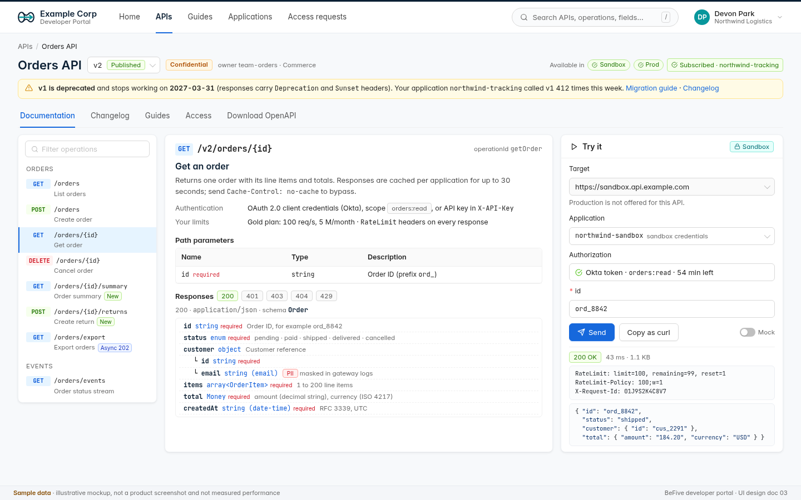
*Figure 14. Developer portal API page for Orders API v2: deprecation banner for v1, operation list, rendered OpenAPI documentation with a PII-tagged field, and the try-it panel targeting the Sandbox (sample data).*

- **Purpose:** understand an API and try it safely (`01` 2.11, DEV-001, DEV-005).
- **Header:** API name, version `Select` (with lifecycle tags), classification badge, owner and domain; right side "Available in" environment chips and the user's subscription state.
- **Deprecation banner** (amber `Alert`) when any version the user's applications call is deprecated: "v1 is deprecated and stops working on 2027-03-31 (responses carry `Deprecation` and `Sunset` headers). Your application northwind-tracking called v1 412 times this week. [Migration guide] [Changelog]". Only the user's own applications are mentioned.
- **Tabs:** Documentation, Changelog (5.40), Guides, Access (1.0: the user's applications' entitlements for this API and "Request access", 5.39), Download OpenAPI (the enriched export: security schemes, rate-limit headers, deprecation information).
- **Documentation:** left, operation list grouped by tag with method tags, filter, and badges (New, Deprecated, Async 202); center, the selected operation rendered from the OpenAPI document by BeFive's own renderer (no third-party script, no CDN): summary, description (sanitized Markdown), authentication in plain words ("OAuth 2.0 client credentials (Okta), scope orders:read, or API key in X-API-Key"), the user's limits from their plan and that **RateLimit headers** are returned, parameters table, responses with status tabs and a schema tree with types, required markers, enum values, examples, and **classification tags from the data dictionary** (for example `email` tagged PII "masked in gateway logs"). Operations the user cannot see are omitted.
- **Try-it panel** (1.0; right column): target `Select` fixed to the Sandbox base URL (`https://sandbox.api.example.com`); the note "Production is not offered for this API" unless the API allows a production target (5.20), in which case Production is a second option, never the default, and selecting it shows an amber warning; application `Select` (the user's **sandbox** applications only; keys never shared with production); authorization (obtains an Okta token for the sandbox application through the portal's back end, or uses the sandbox API key held in memory for the session, showing scope and remaining lifetime); parameter inputs generated from the schema; **Send**, **Copy as curl** (credentials as placeholders), and a **Mock** `Switch` (uses OpenAPI-example mocks in the Sandbox, `01` 2.11). The response shows status, time, size, the `RateLimit`, `RateLimit-Policy`, and request ID headers, and the body (formatted JSON, truncated at 64 KiB).
- **Errors:** sandbox not linked ("Try-it is unavailable: the sandbox environment is not connected"); no sandbox application ("Create a sandbox application to try this API" with a button); `401`, `403`, and `429` explained in plain words with the reason header where available.

### 5.38 Portal applications and keys

- **Purpose:** self-service applications and credentials within the developer's entitlements (`01` 2.11, DEV-001, SEC-001). 1.0 only.
- **List** (`/apps`): `Card`s per application (name, environment Prod or Sandbox, type machine or user-facing, entitled APIs, credentials summary, last used). "New application": name, environment (Sandbox applications can be created freely; Prod applications only exist once an access request is approved or an administrator creates one), type, description.
- **Application page** (`/apps/:id`): *Credentials* (API keys: Issue, Rotate with grace period, Revoke; the one-time reveal modal of 4.6, identical to the console; OAuth: the bound Okta client ID; when the app was created by BeFive, a **Client keys** card (`private_key_jwt`; per key: key ID (thumbprint), algorithm, origin Uploaded / Generated, state Active / Deactivated, uploaded by and when). **Upload public key** is the primary action: a `Modal` with a drop zone and a text area for a JWK or PEM `PUBLIC KEY`, a collapsible "How to create a key pair" with the `openssl` commands (`openssl genpkey -algorithm EC -pkeyopt ec_paramgen_curve:P-256 -out client.key`, then `openssl pkey -in client.key -pubout -out client.pub.pem`; copy buttons), and inline validation (RSA 2048 bits or more, or EC P-256). Pasting private material is refused immediately in the browser and again on the server, with "This is a private key. Upload only the public key; keep the private key on your system."; nothing is sent when the browser detects it. A secondary link **Generate in this browser (convenience)** creates the key pair with WebCrypto, downloads the private key as a local `.pem` file, and uploads only the public key; the private key never leaves the browser, and a note recommends generating keys on the system that will use them. Where the Administrator allowed it and no Restricted or opted-out API is involved, a third option **Let BeFive generate the key** creates the pair on the server and offers a **one-time download** after a fresh sign-in (audited; "Downloaded by Devon on 1 Oct, 14:02 ET; it cannot be downloaded again"). The private key is deleted from the secrets store right after the download, or after 24 hours if it is never downloaded; until then the key row shows a countdown ("Download within 23 h 12 min; after that the key is deleted and deactivated"), and an expired key shows "Expired before download" with **Generate new key** and **Upload public key** actions. **Rotate key** guides through uploading a second key ("Both keys work until you deactivate the old one"), then **Deactivate** the old key (`Modal.confirm` with the key ID). **Report key compromised** (danger) deactivates the key in Okta at once; if it is the only active key, the confirmation says the client will stop working until a new key is uploaded. No client secret exists for BeFive-created apps. Consumer Managers and Administrators have the same card on the console application page (5.7)), *Subscriptions* (API, version, plan, environment, granted on, "Request change"), *Usage* (requests, errors, rate-limited, quota `Progress` for this month), *Activity* (the developer's own actions), and *Notifications* (`Switch` per API for deprecation emails; the at-sunset notice cannot be turned off here).
- **Rules:** at most two active keys per application (as in the console); revoking asks for confirmation with the last-used time; a developer sees only their organization's applications that they created or were added to.
- **Errors:** issuing a key on a suspended application is blocked ("This application is suspended by Example Corp. Contact support.").

### 5.39 Portal access requests

- **Purpose:** request access to an API version and plan for one of the developer's applications, and follow the request (`01` 2.6, SEC-003). 1.0 only.
- **Request form** (`Modal` from "Request access"): API and version (prefilled), application `Select` (or "New application"), environment (Prod; Sandbox entitlement is granted with it automatically where configured), plan `Select` (plans offered for this API, 5.8, with limits), scopes `Checkbox.Group` (from the API's security scheme), justification (required, 20 to 1,000 characters), and a summary of who decides ("Restricted API: the API owner and Example Corp security review this request. This usually takes 1 to 3 business days."). Submit creates the request (`AR-1042`).
- **My requests** (`/requests`): `Table` with number, API and version, application, plan, submitted, state (`Steps` mini view: Submitted → API owner → Security review → Provisioned), and a detail page with the timeline (approver names shown as configured: names or "API owner", "Security team"; ServiceNow ticket numbers are not shown to external developers unless configured), comments from approvers, and Cancel while pending.
- **On approval:** the developer gets an email (1.0 email for approvals) and a portal notification; the application shows the new subscription; if Okta app creation was chosen, the new client ID appears on the application with next steps: upload your public key (the upload `Modal` of 5.38 opens directly; the request shows "Waiting for your public key" until then, and provisioning completes on upload), configure the client assertion (a short `private_key_jwt` snippet with the token endpoint and key ID), and test.
- **On rejection:** the reason is shown, with "Request again".

### 5.40 Portal changelog and deprecation notices

- **Purpose:** keep developers informed about changes and deprecations (`01` 2.8, 2.11, API-002, DEV-004).
- **Components:** `/changelog`: a feed of entries across visible APIs, filterable by API, type (added, changed, deprecated, retired, fixed), and "affects my applications"; each entry has date, API and version, type `Tag`, and text (written or edited by the API owner in the console, 5.20). Per-API changelog on the API page. Deprecation entries carry the sunset date and the migration link.
- **Notices:** deprecations affecting the developer's applications appear as a banner on the home page and the API page (5.35, 5.37), in "Needs attention", and by **email** (1.0, owner decision October 1, 2026) to the developers and application owners whose applications called the deprecated operation in the last 30 days (and those subscribed to the version at the deprecation date), at deprecation, 30 and 7 days before sunset, and at sunset by default; schedule and text configurable or turned off per API (5.20), and developers can opt out per application (5.38) except for the at-sunset notice. Each email links to the API page, the changelog, and the opt-out setting. Notices record whether they were seen, which the console shows in 5.32.

---

## 6. Key user flows

Timings are design targets for usability testing, not measurements. Flows 6.1 to 6.7 are from Draft 3 (6.3, 6.5, 6.6, and 6.7 updated); 6.8 to 6.13 are new.

### 6.1 First-run setup (license, admin account, first IdP)

Precondition: the container started for the first time and printed a bootstrap token to its log.

1. The admin opens `https://<host>:9000/`. With no administrator in the database, every path redirects to `/setup`.
2. **Step "Verify ownership":** paste the bootstrap token from the container log (`Input.Password`). Wrong tokens are rate-limited (5 per minute).
3. **Step "License":** upload the license file (`Upload.Dragger`); the parsed licensee, edition, maintenance date, node limit, and build coverage appear for confirmation. Or choose "Continue in evaluation mode" (1 gateway node, banner shown).
4. **Step "Security check":** read-only status of the master key source (env, file, or AWS KMS) and database migrations. In evaluation mode with a generated master key, an amber `Alert` explains the risk and links to the docs.
5. **Step "First administrator":** email, display name, password (Argon2id rules: ≥ 12 characters, not in the bundled breach list, strength meter). This becomes the break-glass local account.
6. **Step "Single sign-on" (optional but recommended):** "Connect Okta" runs the Okta wizard in console-SSO mode (domain, authorization server, client ID and secret for the console app, redirect URI shown for copying into Okta), then the group-to-role mapping (`befive-admins` → Administrator, etc.), then "Test sign-in" in a popup. Skippable.
7. **Step "Done":** summary and a button to the Overview, which shows the onboarding checklist (connect an IdP for APIs, create a service, create a route, issue a key, set up CloudWatch recipe). The bootstrap token is now invalid; an audit event records the setup.

### 6.2 Onboard an API protected by Okta in under 5 minutes

Precondition: an Okta identity provider exists (or is created inline in step 3). Target: under 5 minutes for a user who knows the upstream URL, the audience, and the scope.

This flow is for a hand-written route; when the team has an OpenAPI document, 6.8 is faster and creates the API, version, and operations as well.

1. **Routes › New route.** The form opens with Basics focused.
2. **Service:** in the Service `Select`, choose "Create new service"; a `Drawer` asks for name (ID auto-suggested, e.g. `orders`) and one upstream URL (`https://orders.internal:8443`), creating service and upstream with defaults. (≈ 45 s)
3. **Matching:** host `api.example.com` (suggested from certificates), paths `/orders` and `/orders/:id`, methods left empty (all). The Conflicts row confirms no overlap. (≈ 30 s)
4. **Authentication:** Add method › JWT › identity provider `okta-prod`; audiences prefilled from the IdP (`api://orders`). (≈ 20 s)
5. **Access policy:** "Require policy" › "Create policy" opens the policy `Drawer` with a template "Require scope" › type `orders:read` › save as `orders-read`. Add a per-method override POST/PUT → new policy `orders-write` with scope `orders:write`, DELETE → Deny. (≈ 60 s)
6. **Test route** (header button) opens the tester with the draft: paste an access token from Okta (or use the "Get test token" helper link to the Okta docs), run. The tester shows route matched, JWT valid, identity with scopes, policy allow, and the upstream request that would be sent. Toggle "Send to upstream" to see the real response. (≈ 60 s)
7. **Save and apply.** Toast "Saved as revision 1844 · applying to 6 nodes"; the cluster status reaches "6 of 6 in sync" within seconds. (≈ 10 s)
8. Optional: "View EDN" and copy it into the team's Git repository to switch to config-as-code later.

### 6.3 Onboard a partner organization with a plan and API key

1. **Plans:** confirm a suitable plan exists (e.g. Gold: 100 req/s, 5 million per month); otherwise create it from the Gold template.
2. **Organizations › New organization:** "Acme Corp" (ID `acme-corp`, kind partner), plan Gold (inherited by its consumers and applications). Save.
3. **New consumer** in the organization: `acme-corp` with contact Priya Kim, groups `tier-1-partners`.
4. **New application** for the consumer: `acme-order-sync`, type machine. The application detail opens on *Credentials* with "Issue the first credential".
5. **Issue API key:** label "Primary", optional expiry. Confirm; the one-time reveal modal (Figure 4) requires ticking "I have stored this key" before Done.
6. If the partner uses Okta client credentials instead: **Bind OAuth client** › IdP `okta-prod`, client ID `0oa9partnerapp`.
7. **Subscriptions:** add Orders API v2 on Gold (Public and Internal APIs can be added directly with a reason; Confidential and Restricted ones go through an access request, 6.9). **Effective access** then lists the operations Acme can call.
8. Send the key through the organization's secure channel (the product never emails secrets), or invite Acme's developers to the portal (Okta group `partner-acme` mapped to the organization, 5.14.6) so they manage their own keys (5.38).

### 6.4 Investigate a spike of 401s

1. **Overview:** the "Auth failures / s" KPI turns red with a spike; within a few minutes the built-in detector opens an incident "Authentication failures above normal on okta-prod", shown in the notification bell and on Incidents (the CloudWatch anomaly alarm may also have fired). The incident page links to the same drill-down and lists correlated configuration changes, which shortens branches B and C below.
2. Click the KPI › drill-down `Drawer` shows failures by reason, route, and IdP for the selected window: for example 92% `jwt.unknown_kid` on IdP `okta-prod`, across all JWT routes, starting 02:47.
3. The reason explains itself in a `Tooltip` ("Tokens are signed with a key ID the gateway does not know"). A link opens **Identity providers › okta-prod**, whose JWKS status shows the key IDs each node holds and the last refresh result.
4. **Branch A, key rotation not yet picked up:** the IdP shows "refresh failing since 02:47: TLS handshake failed" on all nodes. Run **Test connection** from the control plane: DNS and TLS fail with "certificate signed by unknown authority" (for example, a new corporate TLS-inspection proxy). The fix is network-side; after the fix, "Refresh keys now" and watch failures drop on the Overview.
5. **Branch B, configuration change:** the drill-down instead shows `jwt.aud_mismatch` on one route. **Audit log** filtered to that route shows `route.update` 5 minutes before the spike changing `audiences`. Open the event's diff, then **Config as code › History › Roll back** that revision (or edit the route), confirm, and verify in the Overview.
6. **Branch C, attack or misbehaving client:** failures are `jwt.bad_signature` from few IPs. "Open in CloudWatch" launches saved query Q7 (top offending source IPs) for the same window (its counts stay exact even with access-log sampling on, because 401s are always kept by default); the operator adds the IPs to the route's deny list or to AWS WAF.
7. Record findings; every change made during the investigation is in the audit log with request IDs.

### 6.5 Promote configuration from Test to Prod (linked environments)

Draft 4 replaces the export-and-import path with promotion between **linked environments** (`01` 2.12). Pipelines can do the same with `b5ctl` (signed bundles); export and import (5.13) remain for Git-based teams and for environments that are not linked. The step-by-step console flow is 6.10; this section summarizes what changed from Draft 3:

1. Promotion starts in the **target** environment's console ("Promote from Test"), which pulls a signed bundle from the source over the environment link, so the approver sees the target's state and checks.
2. Environment-specific values live in **overlays** in each environment and never travel in the bundle, so Draft 3's "variables in `env/production.edn`" step disappears from the console flow.
3. Checks include the target's **locks**: a bundle that would weaken a lock in Prod is blocked there even if it passed in Test.
4. Approval is a separate person ("1 Prod approver, not the requester"); both environments record the promotion in their audit logs with the bundle ID.
5. Rollback is a normal revision rollback in the target (5.13) or a promotion of the previous bundle.

### 6.6 From anomaly to a ServiceNow incident

Precondition: a ServiceNow integration (`snow-prod`) and a Slack integration exist, and the rule `servicenow-major` (`02-architecture.md` 14.9) is enabled. Sample timeline, matching Figure 6. (In 1.1, an optional AI best guess is added at step 4; nothing else changes.)

1. **03:03** Revision 1843 lowers the `orders-get` read timeout from 30 s to 10 s (an ordinary edit, shown on the Overview's recent changes).
2. **03:11** The orders service slows down under a batch load; upstream p99 rises above 10 s, and `orders-get` starts returning `504` (`upstream.timeout`).
3. **03:14** After 3 of 5 breaching minutes, detector `orders-5xx` opens an anomaly; the upstream p99 baseline detector opens a second one. Both share upstream `orders` and correlate with revision 1843, so they form incident `inc-01J9Q4` (severity high). The incidents badge and the notification bell update through SSE.
4. **03:14** The rule creates **INC0012345** with priority 2, assignment group API Platform, the summary, and the correlated change; a Slack message goes to the on-call channel. ServiceNow pages the on-call engineer through the customer's usual process.
5. **03:16** The environment 5xx rate anomaly joins the incident; ServiceNow gets a work note.
6. **03:21** Marco (Operator) opens the console link from the ServiceNow incident. The incident page shows the 5xx chart with a marker at revision 1843 and the **Correlated change** card with the diff (`:read-ms 30000 → 10000`). He acknowledges the incident.
7. He clicks **Roll back** on the card, reviews the rollback diff, and confirms. Revision 1846 is applied on all nodes within seconds.
8. **03:34** After 10 consecutive minutes below the recovery threshold, the anomalies resolve and so does the incident; the rule resolves INC0012345 with the configured close code and notes, attaches the final summary, and posts to Slack. Total time from first breach to ServiceNow incident: about 3 minutes; to resolution: 23 minutes.

### 6.7 Write, test, and dry-run a response script

1. **Detectors & rules › New rule from template › "Credential stuffing: block one IP (dry run)".** Lee (Automation Manager) opens the editor with conditions (detector `credential-stuffing`) and a script that blocks an IP causing over 80% of failures for 30 minutes and posts to Slack; the rule's own action sends a signed webhook to the SOC's SIEM (`soc-siem`).
2. Lee adjusts the script; a typo in a helper name shows an inline error on save ("Unable to resolve symbol: es/protect-ip?"); trying `:teams/post` shows "not available in this version".
3. **Test** against the recorded incident from Saturday: conditions match; the script returns a Slack post and a `:traffic/block-ip` for `198.51.100.23/32`; rails report "dry run: would apply · impact 0.02% of successful traffic · limits OK" in 18 ms.
4. **Replay 7 days:** 3 incidents would have matched; 3 Slack posts and 3 webhook posts; 2 IP blocks, none on protected networks.
5. Save. Because the IP-block kind is in Dry run, real incidents now record "would have blocked" entries on their timelines, which the team reviews for two weeks.
6. To go further, Lee sets the IP-block kind to Approval (5.14.3). Operators then approve blocks from the incident page or Approvals; Lee cannot approve (2.2). Each block expires on its own after 30 minutes, even if the control plane is down.

### 6.8 Onboard an API from an OpenAPI document

Precondition: an Okta identity provider exists; Marco (Operator) has `orders-v2.yaml`. Target: under 10 minutes to a published, protected version in Dev.

1. **APIs › Import OpenAPI** (5.21): drop the file. "OpenAPI 3.1.0 · 15 operations · 42 schemas".
2. **Target:** new API "Orders API" (ID `orders`, domain Commerce, owner team-orders, classification Confidential), version `v2`, versioning by path prefix.
3. **Lint and diff:** 2 warnings (an operation without an error response; a field `custEmail` inconsistent with the dictionary's `customer.email`); all 15 operations "added". The Confidential defaults appear in the preview (per-application cache partition, body redaction, locked).
4. **Mapping:** backing service `orders` (existing upstream); security scheme `oauth2` mapped to IdP `okta-prod` with audience `api://orders`; scopes from the spec become claims rules per operation.
5. **Apply** as a Design version. The API page opens; the *Operations* tab shows 15 operations with access decisions.
6. **Effective policy** (5.22) for `GET /v2/orders/{id}`: check authentication, claims, rate limit, and the locked logging policy.
7. **Test** an operation with a token (5.5), then **Publish** v2 (5.20): the checklist passes; the portal now shows the API to the groups set on the *Docs* tab.
8. Kim (API Owner) refines descriptions and the changelog entry in the console; promotion to Test and Prod follows in 6.10.

### 6.9 Request and approve access through ServiceNow

Precondition: the Payments API v2 is Restricted; routing rule `restricted-default` sends requests to the API owner (built-in) and then to InfoSec Access in ServiceNow. Matches Figure 10.

1. **Portal:** Devon (Northwind Logistics) finds Payments API, clicks **Request access**, chooses application `northwind-tracking`, plan Silver, scopes `payments:authorize` and `payments:read`, and writes a justification. AR-1042 is created at 09:02 (5.39).
2. **Console:** Kim (API Owner, team-payments) sees "Access requests 1" in the navigation, opens AR-1042, and approves with a comment at 09:40.
3. BeFive creates `RITM0010423` in ServiceNow (`REQ0009931`) for the security step and shows "Awaiting approval in ServiceNow". ServiceNow sends signed webhook events; the console shows each one and polls every 5 minutes as a fallback.
4. InfoSec Access approves in ServiceNow. The webhook arrives; BeFive provisions: entitlement Payments API v2 · Silver · Prod on `northwind-tracking`, bound to the existing client ID `0oa7nwtracking` (default provisioning). The RITM gets a work note and is closed with the outcome; the audit log records each step.
5. **Portal:** Devon gets an email and a notification; the application shows the subscription; calls with the client-credentials token now pass the policy.
6. If the customer enabled Okta app creation (5.14.6) and Devon chose "Create a new Okta app", step 4 instead creates `befive-northwind-tracking` in Okta with the customer's least-privilege credential, binds the client ID, and asks Devon for a public key: Devon runs the documented `openssl` command on the integration server and uploads `client.pub.pem` in the portal (about 1 minute); BeFive validates it and registers it with Okta (`private_key_jwt`). The private key never leaves Devon's system.

### 6.10 Promote Dev → Test → Prod

Precondition: Dev, Test, Prod, and Sandbox are linked; Prod requires one approver who is not the requester. Matches Figure 12.

1. **Test console › Environments › Promote from Dev:** scope tag `team-orders`. Dev builds and signs bundle `b-0928-07` (rev 3120). Checks pass; Omar approves in Test on Sep 27; Test is at rev 2215.
2. **Prod console › Environments › Promote from Test:** Marco selects the same bundle. **Changes:** 3 create (`POST /orders/{id}/returns`, composite `order-summary`, Lambda upstream `shipping-tracker`), 4 update, 1 delete (`GET /v1/orders/export`).
3. **Diff:** on `v2 get-order`, the cache TTL goes 30 → 60 s and the claims rule adds a group condition; "Effective policy after apply" shows the result.
4. **Checks:** signature Ed25519 by `b5-test-2026`; schema and references; no locked policy weakened; Prod overlay supplies the orders URL and the `b5-prod-lambda` IAM role; secret references exist; base revision unchanged at 1846. One warning: the deleted v1 export was called by 2 applications in 7 days. Marco acknowledges it in his note and enters change ticket `CHG0031187`.
5. **Approval:** Jane (Administrator) reviews and clicks **Approve and apply…**, typing `production`. Prod applies revision 1847 on 6 nodes; Sandbox follows Prod with mocks on.
6. Both audit logs record the promotion with bundle ID and approver; the portal shows the new operation and changelog entry, and Prod is listed as an environment for the new version.

### 6.11 Operate during an Okta outage

1. **02:47** Okta's JWKS endpoint becomes unreachable. Gateways keep validating JWTs with cached keys; IdP health (5.9) turns amber: "Serving stale keys (age 0 h 12 min, limit 24 h)". The built-in IdP health detector opens an incident; the system banner appears on every console page.
2. Console SSO fails for new sign-ins. Priya uses the **break-glass** local administrator (`/login?local=1`, 5.1); the audit log flags the session.
3. The IdP health tab lists routes by outage behavior: 71 fail closed, 15 fail open for cached introspection results. Introspection-based routes see cache hits until the grace TTL ends; the tab shows when that happens per route.
4. Portal: existing sessions continue; new sign-ins show the outage message (5.34); try-it is unaffected for signed-in developers with cached sandbox tokens.
5. If the outage approaches the stale window, Priya can extend it (Resilience card, audited) after checking the runbook; she does not switch fail-closed routes to fail-open without the API owners.
6. **05:10** Okta recovers; key refresh succeeds on all nodes; the incident resolves; the break-glass session is reviewed in the audit log.

### 6.12 Build and test a composite endpoint

1. **APIs › Composites › New composite:** Orders API v2, `GET /v2/orders/{id}/summary`, ID `order-summary`.
2. Drag **Call route** `orders-get` (output `/order`), then a **Parallel** group with `customers-get`, `payments-status`, and a **Lambda** step `shipping-tracker` with run-when `(= /order/status "shipped")`.
3. Add **Map response** with four output keys. The limits strip shows "6/16 steps · 2 s timeout · 1 MiB".
4. **Run test** as `acme-order-sync` (dry run): the trace shows each step's policy decision, status, and timing (total 114 ms, gateway overhead 5 ms). The customer step notes "PII masked in log".
5. **Save and apply**; the composite appears as an operation of Orders API v2 with its own effective policy (5.22) and is promoted with the API (6.10).

### 6.13 Run an asynchronous job and retrieve the file

1. **Traffic › Async jobs › New endpoint:** `POST /v2/orders/export` (Orders API v2), dispatch to SQS queue `orders-export`, result store S3 `example-b5-results` with SSE-KMS, retention 7 days, retrieval by job owner or group `finance-readers`, delivery by presigned URL (5 min).
2. A client calls the endpoint; BeFive answers `202` with job ID `job_01J9…` and a status URL; the job browser shows it queued, then running.
3. The backend writes the file and reports completion; the client polls the status URL (or receives the signed callback) and gets a short-lived presigned URL after authorization. The retrieval is logged.
4. In the console, the job detail shows state timeline, callback attempts, and retrievals. An Operator sees metadata only; an Administrator who must inspect the file uses "Retrieve result" with a reason, which is audited.

---

## 7. Visual design system

### 7.1 Foundation

Ant Design 5 with a custom theme via `ConfigProvider` tokens (no CSS overrides of component internals). Fonts are bundled with the console (Inter and JetBrains Mono, both under the SIL Open Font License); no web-font CDN.

### 7.2 Color tokens

| Token (Ant Design name) | Value | Use | Contrast on white |
|---|---|---|---|
| `colorPrimary` | `#1668dc` | Primary buttons, links, active navigation, focus | 5.2:1 (Ant Design's default `#1677ff` is 4.1:1, below AA for text, which is why we darken it) |
| `colorText` | `rgba(0,0,0,0.88)` | Body text | 16:1 |
| `colorTextSecondary` | `rgba(0,0,0,0.65)` (`#595959`) | Secondary text | 7.0:1 |
| `colorTextTertiary` | `#6b6b6b` | Captions, help text, table meta | 5.3:1 (Ant Design's default 0.45 alpha is 3.4:1 and is not used for text) |
| `colorTextQuaternary` | `rgba(0,0,0,0.25)` | Placeholders, disabled only (never meaningful text) | n/a |
| `colorBgLayout` | `#f4f6f9` | Page background | |
| `colorBgContainer` | `#ffffff` | Cards, tables, inputs | |
| `colorBorder` / `colorSplit` | `#d9d9d9` / `#f0f0f0` | Input borders / table dividers | |
| Sider background | `#0b1f33` (hover `#12304d`) | Left navigation | Nav text 9.8:1 |
| `colorSuccess` | icon `#52c41a`, text `#237804` | Healthy, in sync, allowed | text 5.6:1 |
| `colorWarning` | icon `#faad14`, text `#874d00` | Degraded, applying, expiring, public routes | text 6.8:1 |
| `colorError` | icon `#ff4d4f`, text `#cf1322` | Failed, behind, denied, destructive | text 5.6:1 |
| `colorInfo` | `#1668dc` | Informational alerts | 5.2:1 |
| Environment colors | production `#cf1322`, test `#d48806` (dot only), dev and sandbox `#1668dc` | Environment badge dot and confirmation dialogs | dot plus text label |
| AI content (1.1) | text `#531dab` on `#f9f0ff`, dashed border `#d3adf7` | AI-generated best guess panel and label only (4.7) | text 8.9:1; always with the text label |

**HTTP method tags** (monospace, filled, text ≥ 4.5:1): GET blue (`#0958d9` on `#e6f4ff`), POST green (`#237804` on `#f6ffed`), PUT orange (`#ad4e00` on `#fff7e6`), PATCH purple (`#531dab` on `#f9f0ff`), DELETE red (`#cf1322` on `#fff1f0`).

**Chart palette** (ECharts theme, colorblind-distinguishable ordering): `#1668dc`, `#13a8a8`, `#722ed1`, `#fa8c16`, `#eb2f96`, `#52c41a`; errors always `#ff4d4f`. Series are also distinguished by line style in latency charts (dashed for gateway overhead).

**Status rule:** status is never shown by color alone. Every status has an icon or text label (`Badge` with text, `Tag` with words like "behind").
**Classification badges** (Draft 4, 4.9; `Tag` with text, ≥ 4.5:1): Public green (`#237804` on `#f6ffed`), Internal blue (`#0958d9` on `#e6f4ff`), Confidential amber (`#874d00` on `#fff7e6`), Restricted red (`#a8071a` on `#fff1f0`, bold). Customer-defined levels pick from the same four families plus grey. Classification colors are never reused for status.

**Policy source chips** (Draft 4, 4.9; rounded `Tag`, text ≥ 4.5:1): Global grey (`#434343` on `#f5f5f5`), Environment magenta (`#9e1068` on `#fff0f6`), API blue (`#0958d9` on `#e6f4ff`), Version cyan (`#006d75` on `#e6fffb`), Path purple (`#531dab` on `#f9f0ff`), Operation green (`#237804` on `#f6ffed`), classification default amber (`#874d00` on `#fff7e6`). Locks use the amber warning text color with the lock icon and the level name. Chips appear only in policy contexts, so the overlap with method and classification hues does not confuse; the text label always disambiguates.

**Release-label pill** (4.8): `#6b6b6b` text on `#fafafa` with a dashed `#d9d9d9` border; never interactive-looking.

### 7.3 Typography

| Role | Font | Size / line height | Weight |
|---|---|---|---|
| Page title | Inter | 20 / 28 | 600 |
| Card title | Inter | 14 / 22 | 600 |
| Body, form labels, table cells (compact density) | Inter | 13 / 20 | 400 |
| Body (comfortable density) | Inter | 14 / 22 | 400 |
| Captions, help text | Inter | 12 / 18 | 400 |
| KPI numbers | Inter, tabular numerals | 26 / 36 | 600 |
| Code, IDs, paths, keys, EDN | JetBrains Mono | 12 / 20 (11.5 in dense previews) | 400 |

Numbers in tables use tabular figures (`font-variant-numeric: tabular-nums`) and are right-aligned. IDs, paths, and header names are always monospace so they can be read and compared exactly.

### 7.4 Spacing, density, and shape

- 4 px base grid; common steps 4, 8, 12, 16, 24, 32.
- Page padding 24 px; card body padding 16 px; gap between cards 16 px.
- **Density:** compact by default (Ant Design `size="small"` tables: 36 to 40 px rows for single-line, about 50 px for two-line cells; 32 px controls). "Comfortable" preference switches `ConfigProvider` to default size and 14 px text. Enterprise users routinely scan 50 to 100 rows, so compact is the default.
- Border radius: 6 px controls, 8 px cards and modals.
- Elevation: cards use a subtle 1 px border plus soft shadow; only modals, drawers, and popovers float.

### 7.5 Iconography and illustration

Line icons at 16 px (Ant Design Icons, outlined set). A sparkle icon is reserved for AI-generated content (1.1). The lock icon is reserved for policy locks (4.9). The product mark is covered in 7.9 Brand; it is one component, so a later revision of the artwork touches one file. Empty-state illustrations are Ant Design's simple `Empty` image; no decorative imagery elsewhere.

### 7.6 Dark mode stance

**Not in 1.0.** The console and the portal ship in light mode only; the left navigation is already dark. All colors come from theme tokens and ECharts uses a theme object, so dark mode later is a `ConfigProvider` algorithm switch (`theme.darkAlgorithm`) plus a dark ECharts theme and CodeMirror theme, without component changes. Rationale: halving the visual QA surface for the first release matters more than a preference feature.

### 7.7 Accessibility (WCAG 2.1 AA)

- **Contrast:** all text tokens meet 4.5:1 (large text 3:1); non-text UI (focus rings, input borders against background, chart lines) meets 3:1. Token choices above were checked against these ratios.
- **Keyboard:** every action reachable by keyboard in a logical order; visible focus ring (2 px `colorPrimary` outline) on all interactive elements; drag-and-drop ordering (authentication methods, plugins) has "Move up/Move down" buttons as the keyboard alternative; modals trap focus and return it on close.
- **Screen readers:** Ant Design's ARIA roles; icon-only buttons have `aria-label`s; toasts and live status changes use polite live regions (`aria-live="polite"`), errors on submit use assertive announcements; charts have "View as table" alternatives and text summaries ("Requests per second, last hour: average 8,100, peak 9,400 at 02:47").
- **Forms:** labels bound to inputs; errors linked with `aria-describedby`; error summary at the top links to fields.
- **Motion:** respects `prefers-reduced-motion` (no chart animations, no skeleton shimmer).
- **Zoom:** layouts work at 200% browser zoom (content reflows; tables scroll horizontally inside their card).
- **Testing:** axe-core checks in Playwright end-to-end tests for every screen; manual keyboard and screen-reader pass (NVDA and VoiceOver) before release.

### 7.8 Responsive stance

Desktop-first. Supported minimum viewport **1280 × 720**; designed at 1440 × 900. Between 1024 and 1280 px, the left navigation collapses to icons and right-side panels (EDN preview) move below the form. Below 1024 px, read-only screens (Overview, Gateway nodes, Audit log, detail pages) remain usable for on-call checks from a tablet, and editors show a notice recommending a larger screen. Phones are not a target for the console. The **portal** is responsive down to 768 px (catalog, docs, applications; try-it moves below the docs), and its documentation pages remain readable on phones.

### 7.9 Brand

The chosen logo is **concept 3, "transit"**: a sideways wormhole (Einstein-Rosen bridge) wireframe with a teal arrow passing through it, standing for requests that pass through BeFive to where they need to go. The artwork is generated from code; the files live in `/workspace/befive-logo/concept-3/` (generator in `/workspace/befive-logo/src/`, see its README). Those files are the source of truth: the console and the docs use copies and never edit them.

| File (in `concept-3/`) | Use |
|---|---|
| `icon-small-dark.svg` | Console navigation header on the navy sider, 30 px, next to the live text "BeFive" (Inter 600) and "Console". Used in all mockups (inlined from the copy in `mockups/src/assets/`). |
| `icon-small.svg`, `icon-small-mono-black.svg`, `icon-small-mono-white.svg` | Simplified mark for 64 px and below on light backgrounds, and single-color uses. `icon-small.svg` is the developer portal's header mark (copy in `mockups/src/assets/befive-icon-small.svg`). |
| `icon.svg`, `icon-dark.svg`, `icon-mono-*.svg` | Detailed mark above 64 px (login page, About dialog, documentation). |
| `lockup.svg`, `lockup-dark.svg`, `lockup-mono-*.svg` | Mark plus the "BeFive" wordmark (Inter SemiBold as outlined paths) for the login page, documentation site, and printed material. |
| `icon-16/32/64/512.png`, `icon-dark-*.png`, `lockup*-1200.png` | Raster exports for places that cannot take SVG. |

- **In the console,** the mark is one Reagent component (`befive.console.ui.brand/mark`, in the `shell` module, 8.2) that renders a copy of the SVG shipped under `resources/public/brand/`. The wordmark next to it in the header is live text, not the lockup, so it follows the type scale and screen readers read "BeFive"; the mark itself is decorative (`aria-hidden`), and the header link has `aria-label` "BeFive home". The browser tab title is "<page title> · BeFive Console", and the sign-in page heading is "BeFive Console".
- **Colors:** navy ink `#0b1f33` (the sider color) and teal `#08979c` on light backgrounds or `#13c2c2` on dark ones. Teal belongs to the mark only: the UI primary stays Ant Design blue (7.2), and teal is never a status color. `#08979c` on white is 3.6:1, enough for a graphic but not for text, so teal text is not used.
- **Minimum size:** 16 px, using the small variant (`icon-16.png` is rendered from `icon-small.svg`).
- **App icon and favicon:** the square variant is the transit mark on a BeFive Navy (`#0B1F33`) rounded tile, in `/workspace/befive-logo/concept-3/`. The console serves `favicon.svg` with `favicon.ico` (16, 32, and 48 px) as fallback, `app-icon-180.png` as the `apple-touch-icon` (full-bleed square; iOS rounds the corners), and `app-icon-192.png` and `app-icon-512.png` in the web-app manifest. Sizes of 64 px and below use the simplified drawings (`app-icon-small.svg`, `app-icon-16.svg`). Never crop the lockup or the detailed icon to make an icon. The full brand reference is `/workspace/befive-logo/befive-brand-sheet.png`.

**Developer portal branding** (Draft 4, 5.33). The portal belongs to the customer, so it carries **the customer's name first**:
- Light header (white, 56 px) with a 3 px BeFive Navy (`#0b1f33`) top rule; mark `icon-small.svg` (light-background variant, copied to `mockups/src/assets/befive-icon-small.svg` and in the product to the portal's `resources/public/brand/`) at 28 px, then the portal title as live text: the licensee's name in Inter 600 ("Example Corp") over "Developer Portal" in caption size.
- An uploaded customer logo (5.14.6) replaces the BeFive mark; the title stays live text. The accent color applies to the active navigation underline, links, and primary buttons only if it passes 4.5:1 on white; otherwise the console's `colorPrimary` is used.
- Footer "Powered by BeFive" in tertiary text (can be turned off). Browser tab title "<page title> · Example Corp Developer Portal".
- Same type scale and tokens as the console, comfortable density by default (14 px body), wider line length for documentation (max 760 px for prose).

---

## 8. Frontend architecture

### 8.1 Stack and build

- ClojureScript with **shadow-cljs**, **re-frame** and **Reagent** (React 18), **Ant Design 5** via npm (used through Reagent's `:>` interop, wrapped in thin `befive.console.ui.*` components that set defaults and accept Clojure data), **Apache ECharts** (via a small Reagent wrapper that owns the chart instance), **CodeMirror 6** (EDN and Clojure language support via `@nextjournal/lang-clojure`, merge view for diffs; the same package powers the response-script editor), and in Draft 4 **React Flow** (`@xyflow/react`, MIT) for the composite graph builder (5.26), loaded only in the `composite` module. The developer portal is a second build in the same repository (8.11).
- Shared code from the `schema` module (`.cljc`): malli schemas, humanized messages, defaults, the cross-entity validator, the diff engine, and normalization. The console therefore validates and diffs exactly as the server and CLI do.

### 8.2 Code splitting

shadow-cljs `:modules`:

| Module | Contents | Loaded |
|---|---|---|
| `shell` | App shell, routing, API client, auth, lists, detail pages, forms, Ant Design | Initially |
| `charts` | ECharts and chart components | When a page with charts mounts (Overview, usage tabs) |
| `editor` | CodeMirror 6, EDN editor, merge/diff view, config-as-code screens | When an EDN tab, policy EDN view, audit diff, or config screen opens |
| `tester` | Route tester (pulls parts of `editor`) | On `/tester` |
| `automation` | Detectors & rules, rule and script editors, test and replay views, silences, approvals (pulls `editor` and `charts`) | On `/automation/*` |
| `incidents` | Incidents list and detail, correlated change, timeline (pulls `charts`; the AI panel joins in 1.1) | On `/incidents/*` |
| `apis` | APIs, versions, operations, OpenAPI import and lint, effective policy view, claims-rule editor, data dictionary, classification, the shared OpenAPI renderer (pulls `editor` for spec diffs) | On `/apis/*`, `/dictionary`, `/classification` |
| `governance` | Organizations, consumers, applications, access requests, plans | On `/organizations/*`, `/consumers/*`, `/applications/*`, `/access-requests/*`, `/plans/*` |
| `composite` | Composite builder (React Flow), test trace | On `/composites/*` |
| `traffic-extra` | Caching and purge, async endpoints and job browser | On `/caching/*`, `/jobs/*` |
| `reports` | Report builder, schedules, runs (pulls `charts`) | On `/reports/*` |
| `environments` | Linked environments, overlays, promotion wizard (pulls `editor`) | On `/environments/*` |

Lazy loading uses `shadow.lazy` with a `Skeleton` placeholder. Target (to verify during implementation): initial `shell` bundle under 900 KB gzip, first meaningful paint under 2 s on a typical corporate laptop over the LAN.

### 8.3 app-db shape

```clojure
{:session   {:user {:id "u_01J8..." :name "Jane Doe" :email "jane.doe@example.com"}
             :roles #{:administrator}
             :permissions #{:routes/write :consumers/write :settings/write ...}
             :csrf-token "..." :environment {:name "production" :color :red}}
 :route     {:name :befive.routes/edit :path-params {:id "orders-get"} :query-params {}}
 :entities  {:route   {"orders-get" {:doc {...} :etag "\"route:orders-get:7\"" :fetched-at 1790564645123}}
             :service {...} :policy {...} :consumer {...} :plan {...}
             :identity-provider {...} :certificate {...} :upstream {...}}
 :lists     {[:route {:service "orders" :tag "team-orders"}]
             {:ids ["orders-get" "orders-create"] :cursors {1 nil 2 "eyJ..."} :page 1
              :total-estimate 86 :status :loaded}}
 :forms     {[:route "orders-get"]
             {:original {...}              ; document as loaded (for dirty check and Diff tab)
              :draft    {...}              ; current edits (plain EDN document)
              :errors   {[:match :paths 1] ["Must start with /. ..."]}
              :touched  #{[:match :paths 1]}
              :server-errors nil :saving? false}}
 :cluster   {:revision 1843
             :nodes {"befive-7f9c2" {:status :ready :applied-revision 1843 :config-source :db ...}}
             :rollout {:revision 1844 :applied 5 :live 6}}
 :live      {:window :1h :resolution :10s
             :series {:requests [...] :status-5xx [...] :latency {:p50 [...] :p95 [...] :p99 [...]}}
             :routes {"orders-get" {:rps 2941.0 :err-5xx 0.0004 :p99-ms 31.0 :spark [...]}}
             :auth-failures {:by-reason {"jwt.unknown_kid" 3.1}}}
 :tester    {:request {...} :result {...} :running? false}
 :config    {:import {:bundle {...} :diff {...} :problems [...] :base-revision 1843}}
 :incidents {:open-count 1 :pending-approvals 0
             :detail {"inc-01J9Q4" {:incident {...} :anomalies [...] :timeline [...] :analysis {...}}}}
 :automation {:test {:rule-draft {...} :input {:incident "inc-01J9M2"} :result {...} :running? false}
              :replay {:job-id "sim_01J9..." :status :running}}
 :effective {["orders" "v2" "getOrder"] {:levels [...] :values {...} :revision 1843}}   ; effective policy view, per operation
 :access-requests {:waiting-for-me 3 :detail {"AR-1042" {:request {...} :chain [...] :servicenow {...}}}}
 :composites {:builder {["order-summary"] {:graph {...} :selected "shipment" :trace {...}}}}
 :reports   {:builder {:query {...} :result {...} :status :loaded}}
 :promotion {:draft {:bundle "b-0928-07" :source "test" :changes {...} :checks [...] :diff-path [...]}}
 :ui        {:density :compact :sider-collapsed? false :banners [...] :sse {:status :connected}}}
```

Rules: server documents live once under `:entities` (normalized by kind and ID); lists hold IDs; forms hold drafts separate from entities, so live updates never overwrite a user's unsaved edits. One-time secrets are **never** stored in app-db (component-local state only), so they cannot leak through re-frame debugging tools or error reports.

### 8.4 Routing

**reitit-frontend** with HTML5 history (`reitit.frontend.easy`). Route data carries the page component, required permission (for hiding navigation actions), title, breadcrumb function, and `:controllers` whose `:start`/`:stop` dispatch data loading and SSE subscriptions for the page (for example, the route edit controller loads the route, services, policies, and IdPs, and stops live updates for other routes). Query parameters are coerced with malli, which keeps filters shareable and validated.

### 8.5 Forms with malli

- A form is `{:schema <malli schema> :original <doc> :draft <doc>}` in app-db. Inputs are bound by **path** (`[:match :paths 1]`) through generic `befive.console.form/field` components that read `(get-in draft path)` and dispatch `[:form/set form-id path value]`.
- Validation: on change (debounced 200 ms) the draft is validated with `malli.core/explain`; errors are humanized with `malli.error/humanize` using the shared custom messages and stored by path; fields show the first message for their path. Cross-entity rules (reference existence, route conflicts) run with the shared validator against entities in app-db, and again on the server.
- Server `422` problem details carry the same paths, merged into `:server-errors`.
- **Generated forms:** for plugin configs and other schema-described maps, a form generator walks the malli schema (`:map`, `:enum` → `Select`, `:boolean` → `Switch`, `:int` with `:min`/`:max` → `InputNumber`, `:string` → `Input`, `[:vector …]` → repeatable rows, `{:befive/secret true}` → write-only secret field) with a raw EDN fallback for anything it cannot render. Titles and help text come from schema properties (`:title`, `:description`).
- Defaults: placeholders show `:default` values from the schema; the EDN preview applies `mt/default-value-transformer` so users see the stored result.

### 8.6 API client layer

- A re-frame effect `:befive/api` built on `fetch`: base URL `/admin/v1`, `Accept`/`Content-Type: application/transit+json`, `credentials: "same-origin"`, `X-CSRF-Token` on mutations, `X-Request-ID` generated per call (shown in error messages), `If-Match` from the stored ETag on updates, and a 30 s timeout via `AbortController`.
- Central response handling: `401` → save the current URL and redirect to `/login`; `403` → toast naming the missing permission; `412` → conflict dialog; `409 revision-conflict` → refresh diff; `422` → form errors; `503` → system banner "Database unavailable, changes cannot be saved"; network errors → retry with backoff for GETs only.
- Request deduplication for identical in-flight GETs and a short (10 s) staleness window per entity to avoid refetch storms when navigating.

### 8.7 Real-time updates

- One `EventSource` connection to `GET /admin/v1/events` per browser tab, opened after sign-in. Events (`revision`, `nodes`, `metrics`, `health`, `license`, `system`, `incident`, `approval`, `override`; `02-architecture.md` 15.9; Draft 4 proposes `access-request`, `promotion`, `idp-health`, and `job` for the architecture worker to add) dispatch re-frame events that update `:cluster`, `:live`, `:incidents`, and banners.
- On a `revision` event, entities of changed kinds are marked stale; open detail pages refetch if the object changed and show "Updated by jane.doe just now" (and if the user has a dirty form for that object, a non-blocking notice "This route changed on the server; saving will show differences").
- If SSE fails 3 times in a row, the client polls `GET /metrics/live` and `GET /cluster/nodes` every 10 s and retries SSE every 60 s. The top bar shows the connection state.

### 8.8 Internationalization readiness

All user-visible strings go through `(tr :routes/delete-confirm {:id id})` with EDN dictionaries per locale (`resources/i18n/en-US.edn`), ICU-style placeholders and plural forms. Dates, times, and numbers use the browser's `Intl` APIs with the user's locale and time zone (times always show the zone abbreviation; audit timestamps offer a UTC toggle). 1.0 ships `en-US` only (console and portal); layouts avoid fixed-width text containers so translations of up to 40% longer fit. Server error messages carry stable codes, so they can be translated client-side later.

### 8.9 How the control plane serves the console

- `shadow-cljs release` output (hashed file names) is packaged into the uberjar under `resources/public/console/` at build time.
- The control plane serves `/assets/*` with `Cache-Control: public, max-age=31536000, immutable`, and `index.html` for all non-API console paths (HTML5 history fallback) with `Cache-Control: no-cache`.
- `index.html` is rendered per request only to inject the CSP nonce (used by Ant Design's runtime CSS-in-JS via `ConfigProvider csp={{nonce}}`) and the environment name/color, so the first paint shows the right environment badge.
- Security headers per `02-architecture.md` 18.4 (strict CSP with no inline scripts, `frame-ancestors 'none'`, `nosniff`, HSTS over HTTPS).
- The developer portal is served by the production control plane on its own hostname (8.11).
- No external requests from the browser: fonts, icons, and docs are local; "CloudWatch" and "Okta guide" links are plain outbound links opened in a new tab by the user.

### 8.10 Testing the console

Unit tests for re-frame event handlers and subscriptions (pure functions) and form helpers; shared-schema tests run in both JVM and JavaScript; component tests for the generic form field and table wrappers; Playwright end-to-end tests of the thirteen flows in section 6 (flows 6.6 and 6.9 against a mock ServiceNow, 6.11 against a mock Okta that can be made unreachable, 6.10 against two linked containers) against a running `BEFIVE_ROLE=all` container, with axe-core accessibility checks on every visited page; visual regression snapshots of key screens at 1440 × 900 and 1280 × 720.

### 8.11 Developer portal build

- **Second shadow-cljs build** `:portal` in the same repository, with modules `portal-shell` (layout, routing, auth, catalog, search; initially loaded), `portal-docs` (OpenAPI renderer, schema tree; loaded on API pages), `portal-tryit` (request builder, response viewer; 1.0), and `portal-apps` (applications, keys, requests; 1.0). Target: `portal-shell` under 400 KB gzip; the 0.x preview build excludes `portal-tryit` and `portal-apps` entirely (compile-time flag), so no dead code for absent features ships.
- **Shared code:** the `schema` module (malli schemas and messages), `befive.ui.*` wrappers, design tokens, the brand component, and the OpenAPI renderer (also used by the console's *Docs* tab, 5.20). Console-only modules (editor, automation, charts beyond simple usage) are not dependencies of the portal.
- **Hosting:** the production control plane serves the portal on its own hostname with its own `index.html`, CSP (`default-src 'self'`; `connect-src 'self'` plus the Sandbox gateway origin for try-it; `frame-ancestors 'none'`), cookies scoped to the portal hostname (`__Host-` prefix), and its own Okta OIDC client. The portal API is a separate, narrower route set (`/portal/v1`, `02-architecture.md` to be extended by the architecture worker) that returns only what the signed-in developer may see; the portal never calls `/admin/v1`.
- **app-db:** `{:session {:user … :organization … :groups …} :catalog {:query … :facets … :results …} :api {…} :tryit {:request … :response …} :apps {…} :requests {…}}`. One-time secrets follow the console rule (component-local only). Try-it credentials (sandbox tokens) are held in memory for the session only.
- **Testing:** Playwright flows for portal search, docs, try-it against a mock sandbox, application and key lifecycle, and access requests (portal side of 6.9), with axe-core checks; the 0.x preview build has its own smoke suite verifying that absent features are absent.

---

## 9. Mockup gallery

All mockups: 1440 × 900 PNG, **sample data**, styled after Ant Design 5 with the tokens in section 7, each with the footer "Sample data · illustrative mockup, not a product screenshot and not measured performance". Console mockups show the Draft 4 navigation (3.3) and the BeFive mark (7.9) inlined from `mockups/src/assets/befive-icon-small-dark.svg`; portal mockups use the light header with `mockups/src/assets/befive-icon-small.svg` and the sample customer name (7.9). Sources: `mockups/src/console.css` (hand-written Ant Design–style CSS, including portal classes), `mockups/src/common.py` (navigation, header, console and portal frames, icons), `mockups/src/build.py` (the seven Draft 3 screens, updated) and `mockups/src/screens_d4.py` (the seven Draft 4 screens), which generate the HTML files in `mockups/src/`, and `mockups/src/render.sh` (renders all fourteen with headless Chrome).

| # | Screen | Section | File | Shows |
|---|---|---|---|---|
| 1 | Overview dashboard | 5.2 | [`mockups/overview.png`](mockups/overview.png) | KPIs with sparklines, traffic chart, latency with p50/p90/p95/p99, top routes, node sync, recent changes; collapsible navigation groups |
| 2 | Routes list | 5.4 | [`mockups/routes-list.png`](mockups/routes-list.png) | Compact table with method tags, authentication and policy columns, live traffic, bulk selection bar, filters |
| 3 | Route edit | 5.4 | [`mockups/route-edit.png`](mockups/route-edit.png) | Section anchor navigation with error badge, schema-driven path validation error, live EDN preview |
| 4 | Okta connection wizard | 5.9 | [`mockups/okta-wizard.png`](mockups/okta-wizard.png) | Steps, derived endpoints, test results with an actionable warning, mapped identity with the bound application |
| 5 | Application detail | 5.7 | [`mockups/consumer-detail.png`](mockups/consumer-detail.png) | Application `acme-order-sync` (consumer acme-corp, organization Acme Corp): credentials, subscriptions tab, plan quota, one-time API key reveal (file name kept from Draft 3) |
| 6 | Incident detail | 5.16 | [`mockups/incident-detail.png`](mockups/incident-detail.png) | Detected anomalies, chart with baseline band and revision marker, correlated change with Roll back, "AI best guess · Available in 1.1" placeholder, actions timeline with Slack and ServiceNow |
| 7 | Detectors & rules | 5.17 | [`mockups/anomaly-rules.png`](mockups/anomaly-rules.png) | Automation Manager view: rules with modes, traffic action kinds (two in 1.0, later kinds muted), rule editor, script editor, test results |
| 8 | Effective policy | 5.22 | [`mockups/api-effective-policy.png`](mockups/api-effective-policy.png) | Six-level chain, per-kind effective values with source chips and locks, overridden values, edit-at-this-level panel, lock-violation rejection |
| 9 | Composite builder | 5.26 | [`mockups/composite-builder.png`](mockups/composite-builder.png) | Step graph with parallel group and conditional Lambda step, limits, step inspector, per-step test trace |
| 10 | Access request approval | 5.29 | [`mockups/access-request-approval.png`](mockups/access-request-approval.png) | Queue with stages, request detail, approval chain, ServiceNow step with webhook and fallback poll, provisioning options |
| 11 | Report builder | 5.30 | [`mockups/report-builder.png`](mockups/report-builder.png) | Query panel, stacked chart, table preview with totals, monthly schedule with XLSX/CSV, email and S3 delivery |
| 12 | Promotion wizard | 5.31 | [`mockups/promotion-wizard.png`](mockups/promotion-wizard.png) | Environment path, steps, change tree, side-by-side diff, checks with a warning, approval card, history |
| 13 | Portal catalog | 5.36 | [`mockups/portal-catalog.png`](mockups/portal-catalog.png) | Customer-branded portal header, search with facets, result cards with lifecycle, classification, environment availability, subscription and request state, side rail |
| 14 | Portal API page | 5.37 | [`mockups/portal-api-detail.png`](mockups/portal-api-detail.png) | Deprecation banner, operation list, rendered OpenAPI docs with a PII-tagged field, try-it against the Sandbox with RateLimit headers |

The mockups are static and illustrate layout, density, and component choice; they are not pixel specifications. Where a mockup and the text differ, the text wins. Each image is also embedded next to its screen specification in section 5 (Figures 1 to 14).

---

## 10. Open questions

**Resolved by the owner's answers (recorded in `01` Draft 4.1):**
- *Draft 3 question 1, environment awareness across installs:* replaced by **linked environments** (5.31); the environment badge lists them (3.3).
- *Draft 3 question 2, consumer self-service and onboarding email:* provided by the **developer portal** (5.33 to 5.40); the console does not send onboarding emails.
- *Draft 3 question 3, custom roles:* stay post-1.0; **API Owner** and **Automation Manager** are added as fixed roles (2.2).
- *Draft 4 question 9, deprecation emails to developers* (resolved October 1, 2026): in 1.0 (5.40, 5.20, 5.38).
- *`01` question 1, client authentication for Okta-created apps* (resolved October 1, 2026): `private_key_jwt` only; developers upload their public key and BeFive never holds the private key; BeFive-generated keys are an Administrator opt-in, not for Restricted APIs (5.14.6, 5.38, 5.39).
- *`01` question 2, reach of the 0.x preview* (resolved October 1, 2026): partners may reach it from outside (5.33, 5.14.6).
- *Rate-limit header default* (`02` question 19, resolved October 1, 2026): IETF `RateLimit` headers by default, `X-RateLimit-*` as an option (5.14).
- *Draft 3 question 7, AI panel placement:* moot for 1.0 (LLM analysis is in 1.1); for 1.1 the design keeps the panel at the top of the side column, collapsed by default, above the correlated change (5.16).

**Still open (from Draft 3):**
1. **Dark mode:** confirm it can wait until after 1.0 for both console and portal.
2. **Live metrics retention:** 2 hours at 10 s and 24 hours at 1 minute for the live overview; longer ranges now go to Reports (1-hour rollups, 13 months). Is that split acceptable?
3. **Tablet read-only support:** is on-call use from tablets worth testing for 1.0? The portal's catalog and docs are designed to work down to 768 px; console editors are not.
4. **Script editing in the console versus Git only:** should production installs be able to lock scripts (and now response rules generally) to config-as-code only?

**New in Draft 4:**
5. **Navigation default state:** the six groups collapse; the design opens the active group plus as many as fit, remembered per user. Should new users instead start with everything open, or with a role-based default (for example Access & governance open for Consumer Managers)?
6. **API Owner and Retire:** the design lets API Owners publish and deprecate their versions but requires an Operator or Administrator to retire (because retirement breaks callers) and to set locks. Confirm, or let API Owners retire after the sunset date.
7. **Try-it against production:** the design never defaults to production and offers it only per API (off by default, 5.20). Should the production option exist at all in 1.0?
8. **Portal branding depth:** 1.0 offers name, logo, accent color, and footer. Are custom CSS or custom pages needed for the first customers?
9. **Who approves traffic actions** (question 10 before October 1, 2026): the design follows `01` 2.17 (Administrators and Operators approve; Automation Managers configure but do not approve). Confirm that Automation Managers should not approve.

**Referenced from `01` Draft 4.1:** no `01` questions remain open; the two that affected these screens were resolved on October 1, 2026 (above).
