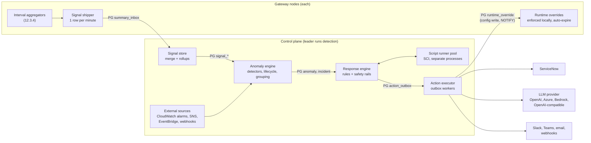
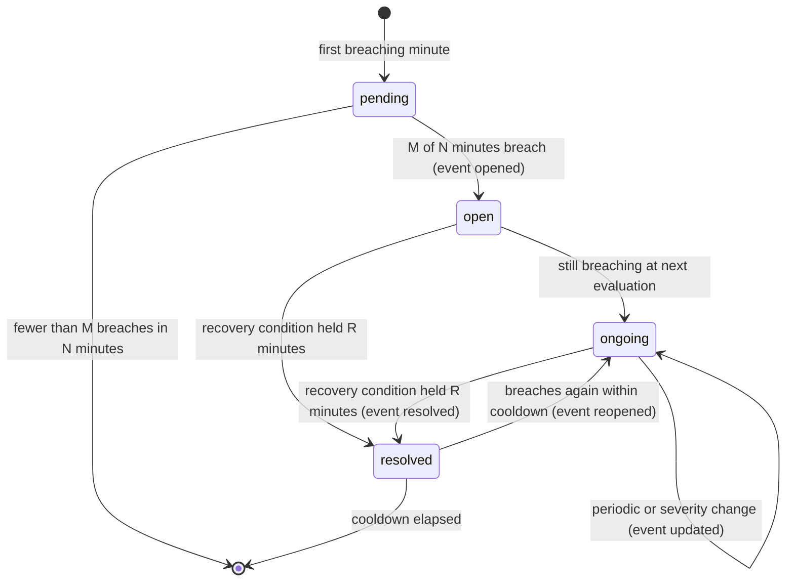

<!-- Excerpt of 02-architecture.md, section 14 (draft 3, September 28, 2026; product renamed from Emissary to BeFive, derived names changed mechanically). Cross-references such as 12.3, 15.6, or 18.5 point to sections of 02-architecture.md; "doc 1" and "doc 3" mean 01-mvp-scope-and-stack.md and 03-ui-design.md. -->

## 14. Anomaly detection and scripted response

This section adds a must-have MVP feature: BeFive notices anomalous patterns in its own traffic, groups them into incidents, and runs **response rules** that the customer writes as EDN data or as sandboxed Clojure scripts. The built-in actions include creating, updating, and resolving **ServiceNow** incidents and asking an **enterprise LLM** (OpenAI, Azure OpenAI, Amazon Bedrock, or any OpenAI-compatible endpoint such as a self-hosted vLLM) for a best-guess root cause, which is written into the incident clearly labeled as AI-generated. Everything here runs inside the product: detection needs no CloudWatch, works in air-gapped installs, and is unaffected by access-log sampling.

Terminology used throughout:

| Term | Meaning |
|---|---|
| **Signal** | A per-minute, cluster-wide value derived from the gateways' interval summaries, for example the 5xx rate of route `orders-get` or the authentication failures from one source IP. |
| **Series** | One signal for one entity: `[:route/error-rate-5xx "orders-get"]`. |
| **Detector** | A configured rule that watches a set of series and decides when a value is anomalous (threshold, rate of change, seasonal baseline, and specializations). |
| **Anomaly** | One detector firing on one series, with a lifecycle (open, ongoing, resolved). |
| **Incident** | A group of related anomalies that are handled together. One BeFive incident maps to at most one ServiceNow incident (or one Event Management alert key). |
| **Response rule** | Maps incident events (opened, updated, resolved, reopened) to actions, declaratively, through a script, or both. |
| **Action** | A side effect executed by BeFive: create a ServiceNow incident, request an LLM analysis, post to Slack, block an IP for 30 minutes, and so on. Actions are the only way scripts affect the world. |

### 14.1 Decisions

| Topic | Decision |
|---|---|
| Where detection runs | In the control plane, on the **leader** control-plane node (PostgreSQL advisory lock). Gateways only produce data. |
| Input data | The exact per-node interval aggregates that already produce the route and usage summary lines (12.3), recorded before the sampling decision, so detection sees every request whether or not sampling is on and whether or not CloudWatch is used. |
| Transport from gateways | Gateways **write one compact row per node per minute into PostgreSQL** (`summary_inbox`), in the same flush that writes the summary lines. No new network path, no inbound connections to gateways, no gateway dependency on the control plane. Rejected: pushing to the control plane over an internal HTTP endpoint (14.3). |
| Retention | Raw inbox rows 2 hours; merged per-minute signals 8 days (consumer series 3 days); 5-minute rollups 35 days for seasonal baselines; source-IP lists 24 hours; incidents 400 days. All configurable within bounds (14.16). |
| Detectors | Static threshold, rate of change, and seasonal baseline (robust z-score against the same time of week over the previous 4 weeks, with an EWMA fallback during warm-up), plus three specializations: source-IP burst, upstream health flapping, and traffic absence. Every detector has minimum-volume guards. |
| Per-IP data | Gateways keep a bounded **top-k heavy-hitter sketch** (Space-Saving, k = 256) per interval for IPs failing authentication and for IPs rejected with `403` or `429`. No per-IP counters exist anywhere else. |
| Grouping | Anomalies that share a strong entity (upstream, service, identity provider, source IP, or a correlated configuration revision) within 15 minutes form one incident. |
| Response rules | Declarative EDN rules for the common cases; optional Clojure scripts for logic. Scripts are **pure functions** that receive the incident as data and return a vector of action requests; they never perform side effects themselves. |
| Script sandbox | SCI (already approved) with an allow-list of namespaces and no interop, running in a separate **native-image runner process** (`befive-script-runner`) with a hard wall-clock limit (process kill) and a heap limit. Trusted JVM code uses the plugin SPI instead (14.10). |
| Action delivery | Durable **outbox** table with idempotency keys, retries with exponential backoff, and per-integration rate limits, so a ServiceNow or LLM outage never loses an incident. |
| Traffic-affecting actions | Implemented as expiring **runtime overrides** in the configuration snapshot; each gateway enforces the expiry locally, so auto-revert works even if the control plane is down. Global mode `:off` by default; also `:dry-run`, `:approval`, `:on`, with blast-radius limits and protected networks, consumers, and routes. |
| ServiceNow | Table API on `incident` (or Event Management `em_event` as an alternative target), OAuth 2.0 client credentials with basic authentication as a fallback, dedupe on `correlation_id`, work notes while ongoing, configurable resolve state and close code. |
| LLM | Off by default. Providers: OpenAI, Azure OpenAI, Amazon Bedrock, OpenAI-compatible endpoints. Redacted, minimized context bundle; structured JSON output; strict budget and timeouts; stored for audit; **advisory only**: LLM output is never an input to rules, scripts, or actions. |
| New dependencies | Eclipse Angus Mail (SMTP); AWS SDK v2 `bedrockruntime` and `cloudwatch` modules (SDK already approved). No statistics library: EWMA, median and MAD, and Space-Saving are about 300 lines of shared `.cljc` code. |

### 14.2 Overview



Edges marked PG pass through PostgreSQL tables: gateways and the control plane never connect to each other directly. Per minute, in order: gateways flush their closed interval (12.3.4) and insert their `summary_inbox` row; about 20 seconds after the minute boundary the leader merges all rows for that minute into cluster-wide signals, evaluates every detector, advances anomaly lifecycles, groups anomalies into incidents, and emits incident events; the response engine matches rules, runs scripts, applies safety rails, and writes action requests to the outbox; outbox workers on every control-plane node deliver them. A typical anomaly is visible in the console, and its ServiceNow incident exists, between 2 and 5 minutes after the traffic changed (confirmation needs 3 of 5 breaching minutes by default).

### 14.3 Signal transport from gateways

**Decision: gateways write to PostgreSQL.** Gateways already connect to PostgreSQL (configuration, heartbeat, live metrics in `node_metrics`), so a per-minute insert adds no new network path or firewall rule and preserves the property that gateways and control plane never talk to each other directly (2.3). The alternative, an internal HTTP endpoint on the control plane that gateways push to, was rejected: it would add a gateway-to-control-plane dependency and a new port to open in segmented networks, it needs its own authentication, and it loses data while the leader fails over unless gateways also buffer, which is what PostgreSQL already gives us durably.

A new gateway component, `:befive.gateway/signal-shipper`, is fed by the aggregator flusher. Once per minute (when `interval-s` is shorter than 60, it merges that minute's intervals first; counters add and histograms merge exactly) it builds one payload and inserts it:

```sql
CREATE TABLE summary_inbox (
  node_id        text        NOT NULL,
  minute         timestamptz NOT NULL,          -- interval start, UTC, aligned
  process_start  bigint      NOT NULL,          -- with seq: detects duplicates and gaps
  seq            integer     NOT NULL,
  partial        boolean     NOT NULL DEFAULT false,
  payload        bytea       NOT NULL,          -- gzip of befive.signals/1 JSON, <= 256 KiB
  received_at    timestamptz NOT NULL DEFAULT now(),
  PRIMARY KEY (node_id, minute, process_start)
);
```

**Payload `befive.signals/1`** (JSON before gzip; field names abbreviated here only where noted):

| Part | Contents | Bound |
|---|---|---|
| `routes` | Per active route (and `_unmatched`): requests; status counts by exact code for 4xx and 5xx (sparse map); `auth_failures`, `authz_denials`, `rate_limited`; `upstream_errors` by kind (connect, timeout, reset); top error codes (`jwt.unknown_kid`, `upstream.timeout`) with counts; latency and upstream latency histograms coarsened from 870 to about 350 buckets (5% width), sparse. | Routes that saw traffic; top 20 error codes per route |
| `consumers` | Per consumer: requests, 4xx, 5xx, rate-limited, derived at flush from the usage aggregator (no extra hot-path work). The top 1,000 consumers by requests are listed individually, the rest summed into `_other`. | `max-consumers` (default 1,000, max 10,000) |
| `ip_authn_failures`, `ip_rejections` | Space-Saving sketches: up to 256 `[ip, count, error]` entries each, for authentication failures (`401`) and for authorization or rate-limit rejections (`403`, `429`), plus the exact total they summarize. | k = 256 per sketch |
| `upstream_events` | Target health transitions in the minute: upstream, target, from, to, timestamp, reason (for example `active: 3 consecutive timeouts`). | 200 events, then a count |
| `exemplars` | Up to 20 redacted access-line maps per node per minute, sampled (reservoir) from requests that ended in a 5xx, an authentication failure, or an upstream error, in compact field mode after the normal redaction (12.4): no headers, no query strings, no tokens, no bodies. Used for the incident page and, optionally, the LLM context. | 20 lines, 1 KiB each |
| `node` | Node ID, product version, applied revision, config source, degraded reasons. | fixed |

**Heavy hitters for source IPs.** The route and usage aggregators never keep per-IP state, because client IPs are unbounded. The shipper instead keeps, per event-loop thread (no locking), two Space-Saving sketches with k = 256 that are updated only for requests that failed authentication or were rejected with `403` or `429`, and merges the per-thread sketches at flush. Space-Saving guarantees that every IP with more than N/k of the N counted events is present, and that each reported count overestimates the true count by at most the entry's recorded `error` (bounded by N/k). For a burst, that means an IP causing 2,000 of 10,000 failures in a minute is always found, with its count within 40 of the truth. Small, slow attacks spread over many IPs are not visible per IP by design; the route-level `auth_failures` signal still catches the aggregate rise.

**Hot-path cost.** Per request, the additions to the existing aggregator update are one array increment for the exact status code (only for 4xx and 5xx), one error-code counter increment on failures, and, only on authentication failures and rejections, one sketch update (a hash lookup and a small heap adjustment). Exemplars reuse the access-line map that is already built for kept lines (errors are always kept by default, 12.3.5), or build the compact map only for the few error requests that sampling skipped. The 0.2 ms response-path budget in 20.1 still applies and is checked by the benchmark.

**Failure behavior.** The shipper writes on a virtual thread with a 5 s statement timeout. If PostgreSQL is unreachable it keeps up to 15 unsent minutes in memory (at most about 4 MB), retries every 10 s, and then drops the oldest minute and increments `SignalMinutesDropped` (a node metric line field, 12.3.7). Serving traffic never waits on the shipper. Because gateways are independent of the control plane, rows accumulate if no control plane runs; to keep the table bounded anyway, each shipper deletes its own rows older than the retention (2 hours) every 10 minutes.

**Size.** A node serving 200 active routes and 1,000 consumers produces a payload of roughly 60 to 120 KB of JSON, about 15 to 30 KB after gzip; 12 nodes write about 0.2 to 0.4 MB per minute into a table that holds 2 hours, so the inbox stays under about 50 MB. These are estimates to be confirmed with the benchmark dataset.

### 14.4 Signal store, leader, and retention

**Leader.** Every control-plane node runs the anomaly components, but only the node holding the session-level advisory lock `pg_try_advisory_lock(hashtext('befive.anomaly'))` merges, detects, and runs the response engine. The lock is held on a dedicated connection; if the leader dies or loses the database, PostgreSQL releases the lock when the session ends and a standby acquires it on its next attempt (every 10 s). A new leader rebuilds its in-memory windows from `signal_minute` (the last 60 minutes) and loads open anomalies, incidents, and detector state from their tables, so a failover loses no state and at most one or two minutes of evaluation. In role `all` the single node is always the leader. Outbox workers (14.11) run on all control-plane nodes.

**Merge.** At minute boundary + 20 s (configurable 10 to 50 s), the leader reads all inbox rows for the minute and checks completeness against the gateway nodes that were live at that minute (heartbeats in `gateway_node`). If rows are missing it waits up to a further 20 s, then merges what arrived and marks the minute `partial` with the missing node count. Rows that arrive later are merged into the stored minute (so charts and baselines become correct), but detectors do not re-evaluate past minutes. Duplicate rows (same node, minute, and process) are ignored; rows more than 2 minutes in the future (clock skew) are rejected and reported as a node warning.

**Tables.**

| Table | Contents | Retention (default) | Rough size |
|---|---|---|---|
| `summary_inbox` | Raw per-node rows (14.3) | 2 h | < 50 MB for 12 nodes |
| `signal_minute` | Cluster-wide values per entity per minute: `entity_kind` (`env`, `route`, `service`, `upstream`, `consumer`), `entity_id`, `minute`, `counters` (int8 array in catalog order), `lat` and `ulat` (coarse histograms, bytea), `partial`. Partitioned by day. | 8 days; consumer rows 3 days | about 0.4 KB per route-minute: 50 routes about 30 MB per day |
| `signal_5m` | 5-minute rollups for `env`, `route`, `service`, and `upstream` entities, with p50, p95, and p99 precomputed | 35 days (4 weeks of baselines plus margin) | about 0.25 KB per row: 50 routes about 125 MB in total |
| `signal_topk_minute` | Merged cluster-wide IP sketches per minute (top 1,000 entries with error bounds) | 24 h (privacy default; 1 to 168 h) | about 60 KB per minute during bursts, less otherwise |
| `signal_exemplar` | Exemplar access-line maps per minute | 24 h | about 20 KB per node-minute at most |
| `baseline_state` | Per series: EWMA mean and variance, fast and slow EWMA for consumer surges, sample count, last update | while the series is active, pruned after 35 days idle | about 100 bytes per series |

Retention jobs drop whole daily partitions (cheap) and run on the leader. Detectors read from in-memory ring buffers (last 60 minutes per active route, service, upstream, and environment series) and from `signal_5m` for baselines, so detection does not scan large tables every minute.

### 14.5 Signal catalog

Signals are derived from the merged counters. Rates are computed from sums, never averaged across nodes.

| Signal | Entities | Definition |
|---|---|---|
| `:traffic/requests` | env, route, service, consumer | Requests per minute. |
| `:errors/rate-5xx` | env, route, service, upstream | 5xx responses / requests. |
| `:errors/rate-4xx` | env, route, consumer | 4xx responses / requests (excluding `401`, `403`, `429`, which have their own signals). |
| `:errors/count-401`, `:errors/count-403`, `:errors/count-429` | env, route, consumer (403, 429) | Counts per minute; `401` is also broken down by top error code (for example `jwt.unknown_kid`). |
| `:auth/failures` | env, route, identity provider | Authentication failures per minute (identity provider attribution from the route's authentication configuration and error codes). |
| `:latency/p95`, `:latency/p99` | env, route, service | From the merged coarse histograms (about ±2.5% quantization). |
| `:latency/upstream-p99` | route, upstream | Upstream time only, separating backend slowness from gateway overhead. |
| `:upstream/errors` | route, upstream | Connect failures, timeouts, and resets per minute. |
| `:upstream/health-transitions`, `:upstream/unhealthy-targets` | upstream | Transitions per minute and currently unhealthy targets (from `upstream_events` and heartbeats). |
| `:ip/auth-failures`, `:ip/rejections` | source IP (from sketches) | Estimated count per IP per minute with error bound. |
| `:cluster/nodes-reporting` | env | Live gateway nodes that delivered the minute. |
| `:config/changes` | env and each changed entity | Revisions committed in the minute and the entities they touched (from `config_change`). Used for correlation, not as a detector input on its own. |

Service and upstream values aggregate the routes that belong to them through the current configuration (route → service → upstream), so a failing upstream shows as one series even when it serves ten routes.

### 14.6 Detectors

Detectors are configuration entities (schema in 14.15), edited in the console or in files and promoted like routes. Every detector names one signal, a selection of entities, a condition, confirmation rules, recovery rules, guards, and a severity. Evaluation happens once per minute per selected series.

**Kinds.**

1. **Threshold.** Compares the signal with a fixed value, over a window with M-of-N confirmation.
2. **Rate of change.** Compares a recent window with a preceding reference window (ratio up or down), with minimum volume and minimum absolute change.
3. **Seasonal baseline.** Compares the recent value with what is normal for this time of week (below), in the configured direction (`:up`, `:down`, or `:both`).
4. **Source-IP burst** (specialized threshold on `:ip/*` series): an IP exceeds N failures in W minutes; the anomaly records the IP's share of all failures and the error bound.
5. **Upstream flap** (specialized threshold on `:upstream/health-transitions`): at least N transitions in W minutes.
6. **Absence** (specialized baseline): a route that normally carries traffic receives none (or less than a floor) for W minutes.

```clojure
;; detectors/orders.edn  (examples; sample thresholds)
[{:id "orders-5xx"
  :description "5xx rate on order routes"
  :kind :threshold
  :signal :errors/rate-5xx
  :select {:routes {:tags #{"team-orders"}}}
  :condition {:op :> :value 0.02}                 ; more than 2% of requests
  :confirm {:breaches 3 :of 5}                    ; 3 of the last 5 minutes
  :guard {:min-requests-per-minute 60}            ; rates on tiny volumes are noise
  :recover {:op :< :value 0.01 :minutes 10}       ; hysteresis: open at 2%, resolve below 1%
  :severity :high}

 {:id "orders-traffic-drop"
  :kind :rate-of-change
  :signal :traffic/requests
  :select {:routes {:tags #{"team-orders"}}}
  :direction :down
  :compare {:recent-minutes 10 :reference-minutes 60}
  :ratio 0.3                                      ; recent below 30% of reference
  :guard {:min-reference-per-minute 100 :min-absolute-change 500}
  :severity :high}

 {:id "auth-failures-unusual"
  :kind :baseline
  :signal :auth/failures
  :select {:identity-providers :all}
  :direction :up
  :z 4.0 :recover-z 2.0
  :guard {:min-absolute-change 50}                ; at least 50 more per 5 min than normal
  :severity :medium}

 {:id "credential-stuffing"
  :kind :ip-burst
  :signal :ip/auth-failures
  :condition {:count 300 :minutes 5}
  :severity :high
  :group-by :ip}

 {:id "upstream-flapping"
  :kind :flap
  :signal :upstream/health-transitions
  :select {:upstreams :all}
  :condition {:transitions 4 :minutes 10}
  :severity :medium}

 {:id "tier1-silent"
  :kind :absence
  :select {:routes {:tags #{"tier-1"}}}
  :minutes 10
  :expected {:min-baseline-per-minute 60}         ; only routes that normally carry >= 1 req/s
  :severity :critical}]
```

**Seasonal baseline, exactly.** For a series and the current evaluation time t:
- Baseline sample: the 5-minute rollup values from `signal_5m` for the same 5-minute slot of the week and its two neighboring slots, in each of the previous 4 weeks: up to 12 values. Slots are computed in the install's configured time zone (`:anomaly {:timezone "America/New_York"}`, default UTC), so business-hour patterns stay aligned across daylight-saving changes. The first week after a DST change compares against slots one hour off for the hours around the change; the neighbor slots soften that and it is documented.
- Current value: the sum (for counts) or the ratio of sums (for rates) over the trailing 5 minutes.
- Robust z-score: z = (x − median) / max(1.4826 × MAD, floor), where MAD is the median absolute deviation of the baseline sample and the floor prevents division by near-zero spread: for counts, max(√median, 1% of median, the detector's absolute floor); for rates, the detector's `:rate-floor` (default 0.002); for latency, 5% of the median.
- Requirement: at least 2 weeks of history (at least 6 baseline values) for the series.
- Warm-up fallback: with less history, the detector uses an EWMA of the per-minute values (half-life 2 hours) with an EWMA variance, z = (x − mean) / max(σ, floor). With less than 6 hours of data the series is **inactive** and the console shows it as "warming up (3 h of 6 h)". New routes therefore get threshold and rate-of-change protection immediately and seasonal protection after 6 hours, full seasonal behavior after 2 weeks.
- Consumer series use a two-speed EWMA instead of time-of-week baselines (consumer traffic is often batch-driven and consumers are too many to store 35 days of 5-minute history cheaply): a surge is fast EWMA (half-life 10 minutes) above k times the slow EWMA (half-life 24 hours) and above the minimum volume.

**Guards (all detectors).** `:min-requests-per-minute` for rate signals (a 50% error rate on 4 requests is not an incident); `:min-absolute-change` for count signals; `:min-baseline-per-minute` for drop and absence; and data completeness: minutes marked `partial` never count as breaches for `:down` and absence detectors (a crashed node must not look like a traffic drop; node loss has its own signal). A detector selecting more than 5,000 series is rejected at validation, and one detector can have at most 100 open anomalies; beyond that it opens a single "detector overflow" anomaly instead, which protects ServiceNow from storms caused by a bad detector.

**Config-change correlation.** When an anomaly opens, the engine looks up revisions committed in the preceding 30 minutes (configurable) that touched the anomaly's entities, their parents (route → service → upstream), or global settings that affect them (policies, identity providers, plans, rate limits). Matches are attached to the anomaly as `:correlated-revisions` with the diff paths from `config_change`, are usable in rule conditions (`:when {:correlated-change true}`), become a grouping key, and are included in the LLM context. Correlation is evidence, not proof: the console labels it "changed shortly before" and never "caused by".

**Built-in detectors.** A fresh install ships a conservative set, all set to the `:console` response only (no ServiceNow, no traffic actions) until an administrator adds rules: environment 5xx rate (baseline, z ≥ 5), environment traffic drop (rate of change, below 30% for 10 minutes), per-route 5xx above 5% (threshold), per-route latency p99 (baseline, z ≥ 5), authentication failures per identity provider (baseline), source-IP authentication-failure burst (300 in 5 minutes), upstream flapping, and gateway nodes not reporting.

**Honest limits.** Seasonal baselines learn from the previous 4 weeks, so a month-end batch, a public holiday, or a one-off marketing event will look anomalous; silences (14.7) and the `:guard` settings handle known events, and detectors can be tuned per route. Robust statistics on 6 to 12 values reject single outliers but cannot model growth trends within a week; strongly growing routes should use rate-of-change detectors. Per-minute resolution means detection needs at least 3 to 5 minutes to confirm by default; this is a trade against false alarms, adjustable per detector (down to 1 of 1, which suits absence detectors).

### 14.7 Anomaly lifecycle, grouping, silences, and severity



- **Pending** is internal and invisible: one breaching minute starts the M-of-N count (default 3 of 5).
- **Open** is the confirmed state and emits the incident-level event `opened` (or `updated` if the anomaly joins an existing incident).
- **Ongoing** anomalies emit `updated` when their severity changes and otherwise at most every `:update-every-minutes` (default 30) with fresh values, so ServiceNow work notes stay informative without flooding.
- **Resolved** requires the recovery condition to hold for R consecutive minutes (default 10). The recovery condition is stricter than "no longer breaching" (hysteresis): a threshold detector opened at 2% resolves below its `:recover` value (default 80% of the threshold), a baseline detector opened at z ≥ 4 resolves at z < 2. This prevents open/resolve flapping around a threshold.
- **Cooldown and reopen.** If the same detector breaches again on the same series within the cooldown (default 30 minutes) after resolving, the anomaly is reopened (`reopen_count` increases, event `reopened`), not duplicated. After the cooldown a new anomaly is created.
- **Deduplication key** is `(detector-id, series)`: at most one non-expired anomaly exists per key.
- **Acknowledgement** is an attribute set by a person (console or API), not a state. Acknowledged incidents still resolve automatically.

**Grouping into incidents.** When an anomaly opens, the engine computes its entity keys: the route, its service and upstream, the identity provider (for authentication signals), the source IP (for IP signals), correlated revisions, plus any `:group-by` key the detector declares. It joins an open incident if one was active in the last 15 minutes (`:group-window-minutes`) and shares at least one **strong** key (upstream, service, identity provider, source IP, or correlated revision); a shared route alone is also strong. Environment-level anomalies (for example the environment 5xx rate) join the incident that already contains anomalies on routes contributing most of that signal; otherwise they start their own incident. An incident holds at most 50 anomalies; further members are counted but not listed. The incident's severity is the highest member severity, its title comes from its first member ("5xx rate 7.8% on upstream orders (3 routes)"), and it resolves when all members are resolved and 15 minutes have passed without a new member (`:group-quiet-minutes`). Grouping is what makes "one ServiceNow incident per problem" true: a failing upstream behind ten routes produces one incident with ten anomalies, not ten tickets.

**Silences and maintenance windows.** A silence has matchers (detector IDs, signals, routes, services, upstreams, consumers, identity providers, tags, severity at most), a time specification (one-off start and end, or weekly recurring days, start time, duration, and time zone), a comment, and an author. While an anomaly or incident matches an active silence, it is still detected, stored, and shown in the console (marked "silenced"), but response rules do not run. If the problem is still present when the silence ends, the incident's `opened` event fires then, so nothing is lost. Maintenance windows are silences with `:kind :maintenance`; CI pipelines create them around deployments with `b5ctl silence create --match service=orders --duration 30m --comment "deploy 4be1c09"`. Silences are audited and appear on the incident timeline.

**Severity** has five levels. Detectors set it; rules can raise it (`:set-severity`); an incident's severity is the maximum of its members'. Default mapping to ServiceNow impact and urgency (configurable per integration):

| Severity | Impact / urgency | Resulting ServiceNow priority (default matrix) | Default notification behavior |
|---|---|---|---|
| `:critical` | 1 / 1 | 1 - Critical | Page-worthy; rules typically create an incident and notify chat. |
| `:high` | 1 / 2 | 2 - High | Incident. |
| `:medium` | 2 / 2 | 3 - Moderate | Incident or chat, per rule. |
| `:low` | 3 / 2 | 4 - Low | Chat or console. |
| `:info` | 3 / 3 | 5 - Planning | Console only. |

### 14.8 External anomaly sources (optional)

BeFive's own detectors cover what the gateways observe. Customers who already alarm in CloudWatch (including CloudWatch anomaly-detection alarms and composite alarms) can feed those alarms into the same lifecycle, grouping, rules, and ServiceNow integration. External anomalies skip M-of-N confirmation (the source decides when it fires and recovers) but get dedupe, grouping, silences, and rules like any other.

| Source | How | Network and permissions | Notes |
|---|---|---|---|
| **CloudWatch alarm poller** (recommended on AWS) | Leader calls `DescribeAlarms` every 60 s for configured alarm-name prefixes or ARNs; `ALARM` opens, `OK` resolves, `INSUFFICIENT_DATA` is recorded without action. | Outbound HTTPS to the CloudWatch endpoint (or a VPC interface endpoint); `cloudwatch:DescribeAlarms` on the control-plane task role only. No inbound path. | Works with private-only control planes. Adds the AWS SDK v2 `cloudwatch` module. |
| **Amazon SNS HTTPS subscription** | SNS posts to `POST /hooks/v1/sns/{source-id}` on the admin port. BeFive confirms only subscriptions for configured topic ARNs and verifies every message signature (signature version 2, SHA-256; signing certificate URL must be HTTPS on an `sns.<region>.amazonaws.com` host, fetched through the SSRF guard and cached). | SNS must reach the endpoint over the internet, so this needs a public path (a dedicated ALB listener rule for `/hooks/*` with AWS WAF), which many customers will not want for their admin port. | The console warns if the hooks path is not configured as reachable. |
| **Amazon EventBridge API destination** | An EventBridge rule on "CloudWatch Alarm State Change" targets an API destination at `POST /hooks/v1/events/{source-id}`, authenticated with an API-key header (`X-BeFive-Hook-Key`, compared in constant time with a stored secret). | Same reachability requirement as SNS. | Also accepts other EventBridge events mapped by a small field mapping. |
| **Generic webhook** | `POST /hooks/v1/generic/{source-id}` with a JSON body `{"key", "status": "firing" or "resolved", "severity", "title", "entities": {"route": ...}, "details"}` and an HMAC-SHA256 signature header `X-BeFive-Signature: t=<unix>,v1=<hex>` over `t + "." + body`, with a 5-minute timestamp tolerance. | Reachable from the sender (often internal monitoring). | For Prometheus Alertmanager, Datadog, or custom tools through a small relay. |

The hooks endpoints are separate from `/admin/v1`: no session or CSRF, per-source secrets, body limit 256 KiB, rate limit 60 requests per minute per source, and every accepted or rejected delivery is logged (`app` log) and counted. They can be disabled entirely (default: disabled until a source is configured).

### 14.9 Response rules

A response rule selects incident events and lists actions per event. Rules are configuration entities (14.15), evaluated in priority order; every matching rule runs (a rule can set `:stop true` to prevent lower-priority rules from running for that event). Incident events:

| Event | When |
|---|---|
| `:opened` | An incident is created (its first anomaly opened), or a silence covering it ended while it was still active. |
| `:updated` | A new anomaly joined, severity changed, or the periodic update is due (`:update-every-minutes`). |
| `:resolved` | All anomalies resolved and the quiet period passed. |
| `:reopened` | A resolved incident received a new or reopened anomaly within the cooldown. |
| `:action-result` | An action for this incident finished (for example `:llm/analyze` completed or `:servicenow/create` failed permanently); lets a rule react, for example by notifying chat that ServiceNow is unreachable. |

```clojure
;; response-rules/production.edn  (examples)
[{:id "servicenow-major"
  :description "ServiceNow incident with an AI best guess for high and critical incidents"
  :priority 100
  :when {:severity-at-least :high
         :environment #{"production"}}
  :on {:opened   [{:action :llm/analyze :integration "openai-enterprise"}
                  {:action :servicenow/create :integration "snow-prod"
                   :await [:llm/analyze] :await-timeout-s 45}  ; create without it after 45 s
                  {:action :teams/post :integration "teams-api-oncall"}]
       :updated  [{:action :servicenow/update :integration "snow-prod"}]
       :reopened [{:action :servicenow/update :integration "snow-prod"}]
       :resolved [{:action :servicenow/resolve :integration "snow-prod"}
                  {:action :teams/post :integration "teams-api-oncall"}]}}

 {:id "config-change-heads-up"
  :description "Tell the author's team when an incident follows their change"
  :priority 90
  :when {:correlated-change true :severity-at-least :medium}
  :on {:opened [{:action :slack/post :integration "slack-platform"
                 :template :incident/correlated-change}]}}

 {:id "credential-stuffing"
  :description "Temporarily block a single IP that causes most authentication failures"
  :priority 80
  :when {:detectors #{"credential-stuffing"}}
  :script {:file "scripts/credential_stuffing.clj"}   ; inlined by b5ctl; stored as source
  :on {:opened [{:action :email/send :integration "smtp-corp"
                 :to ["soc@example.com"] :template :incident/summary}]}}]
```

`:when` conditions (all optional, combined with AND): `:severity-at-least`, `:detectors`, `:signals`, `:sources` (`:internal`, `:external`), `:entities` (routes, services, upstreams, consumers, identity providers by ID or tag), `:environment`, `:correlated-change`, `:min-duration-minutes` (only act on incidents that lasted this long, useful for noisy low-severity signals), and `:time` (business hours in a time zone). Templates (`:incident/summary`, `:incident/correlated-change`, or customer templates defined as data with `{{placeholders}}`) render titles and bodies; the defaults include the incident link in the console, members, key values against baseline, correlated changes, and actions taken.

**Idempotency and ordering.** Each action request gets an idempotency key `sha256(incident-id, rule-id, event-seq, action-index)`, so a rule evaluated twice (for example after a leader failover) enqueues the action once. For each (incident, integration) pair, actions execute in event order; an `update` waits until the `create` it depends on has succeeded.

### 14.10 Scripts and the sandbox

Scripts handle what declarative rules cannot express: thresholds that depend on context, choosing assignment groups by route tag, deciding whether a traffic action is warranted. A script is Clojure source attached to a rule (inline in the console, or a file in the configuration repository that `b5ctl` inlines on apply). It must define `respond`, a **pure function** from an event context to a vector of action requests. It cannot call anything with a side effect; the returned data is validated and executed by BeFive. This makes scripts deterministic, testable offline (`b5ctl anomaly test-script`), and easy to dry-run: dry-run simply records the returned actions instead of executing them.

```clojure
;; scripts/credential_stuffing.clj
(ns scripts.credential-stuffing
  (:require [befive.script :as es]))

(defn respond
  "Block one source IP for 30 minutes if it causes most authentication failures
   and is not in a protected network. Always tell the SOC channel."
  [{:keys [event incident anomalies settings]}]
  (let [burst (es/first-anomaly anomalies {:signal :ip/auth-failures})
        ip    (get-in burst [:entity :ip])
        share (:share burst)]                  ; this IP's share of all auth failures
    (cond-> [{:action :slack/post :integration "slack-soc"
              :text (str "Auth-failure burst from " ip ": "
                         (es/fmt-count (:value burst)) " failures in 5 min ("
                         (es/pct share) " of all failures)")}]
      (and (= event :opened)
           (> share 0.8)
           (not (es/protected-ip? settings ip)))
      (conj {:action :traffic/block-ip
             :cidr (str ip "/32")
             :duration-minutes 30
             :reason (str "credential stuffing suspected, incident " (:id incident))}))))
```

```clojure
;; scripts/route_owner.clj - choose the ServiceNow assignment group from route tags
(ns scripts.route-owner
  (:require [befive.script :as es]))

(def owners {"team-orders" "Orders API Support"
             "team-billing" "Billing Platform"})

(defn respond [{:keys [event incident]}]
  (let [group (or (some owners (es/entity-tags incident)) "API Platform")]
    (case event
      :opened   [{:action :servicenow/create :integration "snow-prod"
                  :fields {:assignment-group group}}]
      :updated  [{:action :servicenow/update :integration "snow-prod"}]
      :resolved [{:action :servicenow/resolve :integration "snow-prod"}]
      [])))
```

**Context passed to `respond`** (plain data, the same shape the console shows in the script tester): `:event`; `:incident` (ID, title, severity, status, opened and updated times, entity keys and tags, member count, acknowledgement, ServiceNow reference if any); `:anomalies` (per member: detector, signal, entity, value, threshold or baseline, z-score, share for IP signals, state, the last 60 minutes of the series and its baseline as vectors); `:correlated-revisions` (revision, time, actor role, changed paths); `:actions-taken` (earlier actions for this incident and their results); and `:settings` (protected networks, consumers, and routes; automation mode; environment name). The context never contains secrets, LLM output, access-line exemplars, or full configuration documents.

**Curated API.** Scripts can use `clojure.core` without I/O, evaluation, or concurrency functions (no `slurp`, `spit`, `eval`, `load-string`, `future`, `agent`, `send`, `Thread`), `clojure.string`, `clojure.set`, `clojure.walk`, and `befive.script`: pure helpers such as `first-anomaly`, `entity-tags`, `severity>=`, `protected-ip?`, `in-cidr?`, `pct`, `fmt-count`, `fmt-duration`, `minutes-since`, and `baseline-ratio`. Java interop, `import`, `resolve` of non-allowed vars, reflection, and class access are not available (SCI `:allow` lists plus `:deny`, no `:classes`). There is no filesystem, network, clock (the context carries `:now`), or random source, so the same context always gives the same result.

**Runner process.** Scripts run in `befive-script-runner`, a GraalVM native-image binary built from the `script-runner` module (like `b5ctl`) and shipped in the Docker image for linux-amd64 and linux-arm64. The control plane keeps a pool of runner processes (default 2, max 8) and exchanges length-prefixed EDN messages over stdin and stdout. The process boundary exists for enforceable limits, which an in-JVM interpreter cannot provide: since JDK 20, `Thread.stop` throws `UnsupportedOperationException`, so a runaway loop in an in-process interpreter could not be stopped, and the JVM cannot cap one thread's memory.

| Limit | Default | Maximum | Enforcement |
|---|---|---|---|
| Wall-clock time per invocation | 500 ms | 5 s | Control plane kills the process (SIGKILL) and starts a new one. |
| Heap per runner | 128 MiB | 512 MiB | Native-image `-Xmx`; out-of-memory ends the process. |
| Realized sequence length | 100,000 | 1,000,000 | SCI `:realize-max`. |
| Returned actions per invocation | 20 | 100 | Validation. |
| Result size | 64 KiB | 1 MiB | Validation. |
| Source size | 64 KiB | 256 KiB | Schema. |

Runner processes start with an empty environment, an empty temporary working directory, and no inherited file descriptors except the pipes. The security boundary is SCI's allow-list; the separate process adds hard resource limits and crash isolation, not a second guarantee against an interpreter escape, which is why editing scripts requires the Administrator role (15.6) and every change is audited. Scripts are compiled when saved (syntax and allow-list errors are shown in the editor) and cached in each runner by content hash.

**Failures.** A script that throws, times out, or returns invalid actions is recorded in `script_run` with the error; the rule's declarative `:on` actions still run, and the console shows the failure on the incident timeline and the rule. After 5 consecutive failures the script is automatically suspended (the rule keeps its declarative actions) and an administrator notification is raised. If the runner binary cannot start (for example an unsupported platform), scripts are disabled with a clear status and EDN rules keep working.

**Trusted JVM code.** Operators who need arbitrary logic or a proprietary integration write a plugin with the existing SPI (17). Plugin API 1.1 adds an optional `:actions` map to the plugin definition, for example `{:acme/pagerduty {:config-schema [...] :execute (fn [action ctx] deferred)}}`, which registers `:acme/pagerduty` as an action usable in rules and scripts. Plugin actions run in the control-plane JVM with full privileges, as trusted code, through the same outbox, idempotency, and audit as built-in actions.

### 14.11 Built-in actions and the action executor

| Action | Effect | Traffic-affecting |
|---|---|---|
| `:console/notify` | Notification in the console bell and the incidents list (always on, implicit). | No |
| `:servicenow/create`, `:servicenow/update`, `:servicenow/resolve`, `:servicenow/comment` | Create, add a work note to, or resolve the ServiceNow incident for this BeFive incident, or send an Event Management event (14.13). | No |
| `:llm/analyze` | Build the redacted context bundle, call the configured LLM, store the structured best guess, and make it available to later ServiceNow and chat actions (14.14). Limited to 3 analyses per incident (initial, one automatic re-analysis when the incident grows by 3 or more anomalies, one manual). | No |
| `:email/send` | Email through the configured SMTP relay (STARTTLS or implicit TLS, optional authentication), plain-text body from a template, to fixed recipients (no recipient addresses from incident data). | No |
| `:slack/post` | Slack incoming webhook with a Block Kit message. | No |
| `:teams/post` | Microsoft Teams Workflows webhook (Power Automate "When a Teams webhook request is received") with an Adaptive Card; Office 365 connectors, which Microsoft retired, are not supported. | No |
| `:webhook/post` | JSON POST to a configured URL with an HMAC-SHA256 signature header, for custom automation. | No |
| `:incident/set-severity`, `:incident/add-note` | Change the BeFive incident's severity (upward only by rules) or add a timeline note. | No |
| `:traffic/block-ip` | Deny a source IP or small CIDR on all routes or selected routes for a limited time. | **Yes** |
| `:traffic/block-consumer` | Reject one consumer's requests (after authentication) for a limited time. | **Yes** |
| `:traffic/tighten-rate-limit` | Multiply the rate limits of a consumer or route by a factor below 1 for a limited time. | **Yes** |
| `:traffic/disable-route` | Answer a route with `503` and `Retry-After` for a limited time. | **Yes** |

Every outbound call goes through the shared SSRF-guarded client (`befive.core.http/safe-client`, 18.5) with per-integration timeouts, and every credential is a secret reference resolved from the envelope-encrypted secret store (18.2).

**Outbox.** Actions are rows in `action_outbox`: `id`, `incident_id`, `rule_id`, `action` (kind), `integration_id`, `request` (jsonb, validated), `idempotency_key` (unique), `status` (`pending`, `awaiting-approval`, `in-flight`, `succeeded`, `failed-retrying`, `dead`, `dry-run`, `denied`, `cancelled`), `attempts`, `next_attempt_at`, `last_error`, `result` (jsonb, for example the ServiceNow `sys_id` and `number`), and timestamps. Workers on every control-plane node claim due rows with `SELECT ... FOR UPDATE SKIP LOCKED`, execute on virtual threads, and write the result in the same transaction that marks the row. Rules:
- Retries use exponential backoff with full jitter: 10 s, 20 s, 40 s, up to 15 minutes between attempts, for up to 24 hours (configurable), then `dead` with a console alert and an `:action-result` event.
- HTTP `408`, `429`, and `5xx`, connection errors, and timeouts are retried; `Retry-After` is honored. Other `4xx` responses are permanent failures, except `401`, which triggers one token refresh and retry.
- Per (incident, integration), rows execute strictly in order; later rows wait while an earlier one is retrying.
- Per integration: a concurrency limit (default 4), a request rate limit (default 60 per minute), and a **storm limit** on new incidents (default 20 per hour). Above the storm limit, new incidents are not created individually; one "anomaly storm" ServiceNow incident is created and updated with the list, and the console shows a banner. This protects ServiceNow and the on-call team from a mass event or a bad detector.
- A worker crash after sending but before recording the result can repeat a call; ServiceNow creation is protected by the `correlation_id` lookup (14.13), chat and email may rarely duplicate a message, and traffic overrides are idempotent by key.

Completed outbox rows are kept 30 days (the incident timeline keeps a permanent summary).

### 14.12 Traffic-affecting actions and safety rails

Automatic actions that change how traffic is served can stop an attack quickly, and they can also cause an outage. BeFive treats them conservatively.

**Mechanism: runtime overrides.** A traffic action creates a `runtime_override` entity: `{:id "ovr-01J9..." :kind :block-ip :cidr "203.0.113.7/32" :routes :all :expires-at #inst "..." :reason "..." :incident-id "inc-..." :created-by "rule:credential-stuffing"}`. Creating it is a configuration write: it bumps the revision, is audited, and reaches every gateway through the normal propagation path (6.3) within seconds. Gateways compile overrides into the RouteTable and enforce them at fixed slots of the phase order (7.4):

| Kind | Enforcement point (7.4) | Response | Access-log `error_code` |
|---|---|---|---|
| `:block-ip` | `:befive/ip-filter` (slot 5), before the route's own lists and before authentication | `403` | `override.ip_blocked` |
| `:block-consumer` | `:befive/authn` (slot 9), right after the consumer is resolved | `403` | `override.consumer_blocked` |
| `:rate-limit-factor` | `:befive/rate-limit` (slot 11): limits multiplied by the factor for the scoped consumer or route | `429` | `ratelimit.exceeded` with `override` field |
| `:disable-route` | Slot 5 of the matched route's chain, before authentication (no identity provider calls) | `503` with `Retry-After` set to the remaining time | `override.route_disabled` |

Each gateway checks `:expires-at` against its own clock on every use and stops enforcing an expired override immediately, even if it cannot reach the database or the control plane, so **auto-revert does not depend on the control plane**. The leader deletes expired overrides (another audited revision) within a minute. Overrides are excluded from `b5ctl export` and from config-as-code sync, because they are environment-specific and temporary; they appear in the console on an "Active overrides" banner, on affected route and consumer pages, and in `b5ctl overrides list`.

**Modes.** `:automation {:traffic-actions {:mode :off}}` is the default. Modes, settable globally and per action kind (for example IP blocks `:on` but route disabling `:approval`):
- `:off`: traffic actions are rejected and recorded as `denied` on the timeline ("automatic traffic actions are off").
- `:dry-run`: the action is fully evaluated, including all rails below, and recorded as "would have blocked 203.0.113.7/32 for 30 minutes", without effect. Recommended for the first weeks.
- `:approval`: the action waits in the approval queue (`approval` table) for a user with the approve permission; it expires unapproved after 15 minutes (configurable 5 to 60). Approvers see the incident, the proposed override, and its estimated impact.
- `:on`: applied automatically when all rails pass.

**Rails** (checked for every traffic action in every mode, and again at approval time):

| Rail | Default |
|---|---|
| Required duration | Every action needs `:duration-minutes`; maximum 240 for automatic actions (manual overrides from the console: up to 24 hours). |
| Concurrency limits | At most 20 active IP blocks, 3 consumer blocks, 3 rate-limit tightenings, and 1 disabled route created by automation at any time. |
| Rate of automatic actions | At most 10 traffic actions per hour cluster-wide, and at most one per incident per kind per 30 minutes. |
| Scope limits | IP blocks at most /24 (IPv4) or /64 (IPv6); rate-limit factor at least 0.25. |
| Protected networks | Never block trusted proxies (`:trusted-proxies`), load-balancer and health-check sources, the admin networks, or CIDRs in `:protected-cidrs`. |
| Protected consumers and routes | Consumers tagged `protected` are never blocked or throttled automatically; routes tagged `critical` are never disabled automatically. |
| Impact estimate | Before applying, the engine estimates the share of the last 15 minutes of successful traffic that the action would have affected (from signals). If an IP block would affect more than 1%, a consumer block more than 10%, or a route disable any successful traffic above 5 requests per second, the action is escalated to `:approval` even in `:on` mode. |
| Revert on resolve | Optional per action (`:revert-on-resolve true`): the override is removed when the incident resolves, if earlier than its expiry. |

**Audit.** Audit events `automation.action.proposed`, `automation.action.applied`, `automation.action.denied` (with the failing rail), `automation.action.approved`, `automation.action.rejected`, `automation.action.expired`, and `automation.action.reverted`, each with the rule, script run, incident, and override. Manual revert ("Revert now") is available on the override and the incident page to Operators and Administrators.

### 14.13 ServiceNow integration

An integration of kind `:servicenow` targets one instance. Most customers use the **incident** target; shops that run ServiceNow Event Management can choose the **Event Management** target instead, so their alert rules, correlation, and CMDB binding decide what becomes an incident.

```clojure
;; integrations/servicenow.edn
{:id "snow-prod"
 :kind :servicenow
 :instance-url "https://acme.service-now.com"
 :auth {:type :oauth-client-credentials               ; or :basic
        :client-id "3f9c0e0d2b1e4c7a9a51d2f1b5c0e7aa"
        :client-secret #befive/secret "snow-oauth-secret"}
 :target :incident                                     ; or :event-management
 :incident {:caller "svc_befive"                     ; sys_id or display value
            :assignment-group "API Platform"
            :category "Network" :subcategory "API gateway"
            :cmdb-ci "BeFive Production"             ; configuration item
            :business-service "Partner API"
            :contact-type "Monitoring"
            :impact-urgency {:critical [1 1] :high [1 2] :medium [2 2] :low [3 2] :info [3 3]}
            :extra-fields {"u_environment" "production"}
            :resolve {:state "6" :close-code "Solution provided"
                      :close-notes "Resolved automatically by BeFive: all anomalies recovered."}
            :reopen {:state "2"}                       ; In Progress
            :on-human-resolved :note-only              ; or :reopen
            :attach-summary true}
 :limits {:timeout-ms 10000 :requests-per-minute 60 :new-incidents-per-hour 20}}
```

**Authentication.**
- **OAuth 2.0 client credentials** (preferred): BeFive requests a token from `https://<instance>/oauth_token.do` with `grant_type=client_credentials`, caches it until 60 s before `expires_in`, and refreshes it once on a `401`. ServiceNow supports inbound client credentials from the Washington DC release onward; the ServiceNow administrator enables the system property `glide.oauth.inbound.client.credential.grant_type.enabled`, creates an OAuth API endpoint in the Application Registry, and sets its **OAuth Application User** to a dedicated integration user. The console's connection wizard lists these steps.
- **Basic authentication** (fallback for older instances or restrictive policies): a dedicated integration user marked "Web service access only", with its password as a secret; HTTPS only.
- The integration user needs the `itil` role (or a custom role with create and write ACLs on `incident` and create on attachments); for the Event Management target, `evt_mgmt_integration`.

**Incident target: calls.**

| Step | Request |
|---|---|
| Dedupe lookup (before every create, and after an ambiguous create timeout) | `GET /api/now/table/incident?sysparm_query=correlation_id=<cid>^active=true&sysparm_fields=sys_id,number,state&sysparm_limit=1` |
| Create | `POST /api/now/table/incident?sysparm_input_display_value=true&sysparm_fields=sys_id,number,state` |
| Work note, severity escalation | `PATCH /api/now/table/incident/{sys_id}` with `work_notes` (a journal field: each PATCH appends an entry) and, on escalation only, `impact` and `urgency` |
| Summary attachment | `POST /api/now/attachment/file?table_name=incident&table_sys_id={sys_id}&file_name=befive-inc-01J9Q4.txt` with `Content-Type: text/plain` |
| Resolve | `PATCH /api/now/table/incident/{sys_id}` with the configured `state`, `close_code`, `close_notes` |
| State check before update or resolve | `GET /api/now/table/incident/{sys_id}?sysparm_fields=state,active` |

**Dedupe.** `correlation_id` is `befive:<install-id>:<incident-id>` (the install ID is generated at first run), and `correlation_display` is `BeFive`. One BeFive incident creates at most one ServiceNow incident: the outbox idempotency key prevents duplicate create requests, and the lookup by `correlation_id` adopts an incident that was created by a request whose response was lost.

**Field mapping.** `short_description` is the incident title with severity and environment ("[production] 5xx rate 7.8% on upstream orders (3 routes)", at most 160 characters). `description` holds the summary: first detection time, members with values against baselines or thresholds, affected routes and consumers counts, correlated configuration changes with revision numbers, the console link, and, when available, the AI section (below). Reference fields (`caller_id`, `assignment_group`, `cmdb_ci`, `business_service`) accept display values through `sysparm_input_display_value=true`; the connection test resolves them to `sys_id`s and warns about ambiguous or missing names, and the stored configuration can use `sys_id`s directly. `impact` and `urgency` come from the severity mapping (14.7); ServiceNow computes priority. Scripts can override any mapped field for one incident (`:fields {...}`), and `:extra-fields` sets custom columns.

**While ongoing.** Each `updated` event appends one work note: what changed (new members, severity, current values), at most once per `:update-every-minutes`. Severity escalation raises impact and urgency; de-escalation only adds a note (people may have raised priority themselves).

**Resolution.** When the BeFive incident resolves, BeFive checks the state first. If the ServiceNow incident is still active it sets the configured resolve state (default `6`, Resolved), `close_code`, and `close_notes`; the state and close-code values differ between instances and releases, so they are configuration, and the connection test can list the instance's valid choices when the integration user may read `sys_choice`. If a person already resolved or closed it, BeFive only adds a work note. If the BeFive incident reopens within the cooldown and the ServiceNow incident is resolved but not closed, `:on-human-resolved` decides: add a note (default) or set the reopen state. A closed ServiceNow incident is never reopened; a later recurrence creates a new ServiceNow incident that references the previous number.

**Summary attachment.** On create, and again on resolve as a second file, BeFive attaches a plain-text report: timeline, per-member values and baselines as small tables, the actions taken, and the AI section if present. Plain text avoids instance restrictions on attachment types and renders everywhere.

**Event Management target.** BeFive sends events to `POST /api/global/em/jsonv2` with `{"records": [...]}` (or to the Table API on `em_event` if the customer prefers), one event per incident state change:

```json
{"records": [{
  "source": "BeFive",
  "node": "api.example.com",
  "type": "API anomaly",
  "resource": "upstream:orders",
  "metric_name": "errors/rate-5xx",
  "message_key": "befive:01J8X2M4:inc-01J9Q4",
  "severity": "2",
  "description": "[production] 5xx rate 7.8% on upstream orders (3 routes). Console: https://befive.example.internal/incidents/inc-01J9Q4",
  "additional_info": "{\"environment\":\"production\",\"routes\":\"orders-get,orders-create,orders-cancel\",\"incident_url\":\"https://befive.example.internal/incidents/inc-01J9Q4\"}"
}]}
```

Severity maps `:critical` 1, `:high` 2, `:medium` 3, `:low` 4, `:info` 5, and resolution sends the same `message_key` with severity `0` (Clear). `message_key` carries the dedupe role of `correlation_id`. `additional_info` is a JSON string, as ServiceNow expects. The AI best guess goes into `additional_info` as `ai_best_guess` text, labeled as below.

**Text safety.** Everything BeFive writes into ServiceNow is plain text: HTML is escaped and `[code]` markup, which ServiceNow can render as HTML in journal fields depending on instance settings, is stripped. This matters because incident text contains strings derived from traffic (paths, error messages) and from the LLM.

**Connection test** (console and `POST /integrations/{id}/test`), shown step by step like the Okta wizard (03-ui-design 5.9): DNS and TLS to the instance through the SSRF guard; token request (or basic authentication) with the precise error (`invalid_client`, grant type disabled, missing OAuth Application User); read access to `incident`; resolution of caller, assignment group, CI, and business service to `sys_id`s; optionally, after explicit confirmation, **create a test incident** (priority 5, short description "BeFive connection test"), attach a file, add a work note, and resolve it, reporting the incident number. For Event Management, the test sends one event with severity 5 and then clears it.

### 14.14 LLM analysis

`:llm/analyze` asks a configured model for a best-guess root cause. It is **off by default**: no LLM integration exists until an Administrator creates one, and the global switch `:anomaly {:llm {:enabled false}}` must be turned on (the console shows who turned it on and when). The analysis is advisory text for humans.

**Providers.**

| Provider | Call | Credentials | Structured output |
|---|---|---|---|
| OpenAI | `POST https://api.openai.com/v1/chat/completions` (base URL configurable, for example a regional or proxy endpoint) | API key secret; optional organization and project headers | `response_format` of type `json_schema` with `strict: true` |
| Azure OpenAI | The resource's chat completions endpoint for a deployment (URL configured as given in the Azure portal, including `api-version` where the endpoint requires it) | `api-key` header secret, or Microsoft Entra ID client credentials | `json_schema` where the deployment supports it, else JSON mode |
| Amazon Bedrock | Converse API through the AWS SDK for Java v2 `bedrockruntime` module; works through a VPC interface endpoint so traffic stays on the AWS network | The control-plane task role (`bedrock:InvokeModel` on the chosen model); no stored key | A single tool whose input schema is the output schema, with tool choice forced to it |
| OpenAI-compatible (vLLM, other self-hosted or gateway products) | `POST <base-url>/chat/completions` | Optional bearer token secret | `json_schema` if the server supports it (vLLM does, through guided decoding), else JSON mode |

Self-hosted OpenAI-compatible models are the path for air-gapped buyers: nothing leaves their network. Because such endpoints are usually on private addresses, their host must be added to the outbound allow list (18.5); the connection test says so explicitly. When a provider returns output that does not validate against the schema, BeFive retries once with the validation errors appended, then records the analysis as failed.

**Context bundle.** Built by the control plane, deterministic for a given incident state, and capped at `:max-input-tokens` (default 12,000, estimated at 4 characters per token, trimmed section by section from the least important):

| Section | Contents | Default |
|---|---|---|
| Incident | ID, severity, opened time, duration, title, member anomalies (detector, signal, entity IDs and tags, value, threshold or baseline, z-score) | always |
| Metric windows | Per member series and closely related series (requests, 5xx rate, p99, upstream p99 for the same routes and upstream): per-minute values for the 60 minutes before opening until now, and the baseline for the same minutes; each window has an evidence ID (`M1`, `M2`) | always |
| Configuration changes | Revisions in the 2 hours before opening that touched affected entities or relevant global settings: revision, time, source (console, CLI, API), actor role, and the diff paths with before and after values, after secret redaction; evidence IDs `C1843` | on |
| Upstream health events | Target transitions and reasons (`H1`, `H2`) | on |
| Top error codes | Per affected route, the top error codes with counts (`upstream.timeout` 4,210; `upstream.connect_refused` 812) (`R1`) | on |
| Node status | Nodes reporting, versions, applied revisions, degraded reasons | on |
| Sample access lines | Up to 20 exemplars (14.3) from affected routes, further minimized (below) | on, can be turned off |

The bundle never contains: request or response bodies, headers, query strings, tokens, API keys, cookies, secret values, private keys, credential IDs, admin user names or email addresses (actor role only), or free text from other systems.

**Redaction and minimization**, in this order, before anything leaves the network:
1. **Allow-list per section.** Only the listed fields are copied; anything else is dropped structurally.
2. **Client IPs** are replaced by `ip-` plus the first 8 hex characters of an HMAC-SHA256 with a per-install key (`:hash-ips true` by default), so the same IP is recognizable within one bundle but not reversible by the provider.
3. **Consumers** are pseudonymized (`consumer-1`, `consumer-2`, ...) when `:pseudonymize-consumers true` (default). The mapping stays in BeFive, which re-identifies names in the stored analysis for display in the console and ServiceNow (configurable: `:reidentify-in-servicenow true`).
4. **Subjects and client IDs** from tokens are removed.
5. **Pattern scrubber** on every remaining string, including configuration diffs and error messages: JWT-shaped strings, `b5k_` and `b5a_` keys, `Bearer` values, `password=`/`secret=` pairs, AWS access key IDs, PEM blocks, and email addresses become `[REDACTED]` (the same scrubber as 12.4, extended).
6. **Size cap** and truncation of long strings (paths to 200 characters).
The exact bundle sent is stored and viewable ("Exactly what was sent"), so a security reviewer can check the redaction on real incidents.

**Prompt.** A fixed, versioned system prompt (`befive.llm.prompt/1`) states the task (suggest likely causes for an API gateway incident from the evidence), requires citing evidence IDs, requires `insufficient_data: true` when the evidence does not support a conclusion, and states that everything inside the data block is untrusted data, not instructions. The data block is the JSON bundle, delimited and escaped.

**Output schema** (sent to providers; length limits are enforced by BeFive after parsing because providers' strict modes do not all support them):

```json
{
  "type": "object",
  "additionalProperties": false,
  "required": ["summary", "probable_causes", "confidence", "evidence", "next_steps", "insufficient_data"],
  "properties": {
    "summary":           {"type": "string"},
    "probable_causes":   {"type": "array", "items": {
                            "type": "object", "additionalProperties": false,
                            "required": ["cause", "likelihood", "evidence_ids"],
                            "properties": {
                              "cause":        {"type": "string"},
                              "likelihood":   {"type": "string", "enum": ["high", "medium", "low"]},
                              "evidence_ids": {"type": "array", "items": {"type": "string"}}}}},
    "confidence":        {"type": "string", "enum": ["high", "medium", "low"]},
    "evidence":          {"type": "array", "items": {
                            "type": "object", "additionalProperties": false,
                            "required": ["id", "observation"],
                            "properties": {"id": {"type": "string"}, "observation": {"type": "string"}}}},
    "next_steps":        {"type": "array", "items": {"type": "string"}},
    "insufficient_data": {"type": "boolean"}
  }
}
```

After parsing, BeFive keeps at most 3 causes, 10 evidence items, and 5 next steps, truncates strings (summary 600 characters, others 300), and checks that every cited evidence ID exists in the bundle; unknown IDs are removed and the analysis is flagged "cited evidence not found", which the console shows.

**Labeling.** Wherever the analysis appears, it carries the label **"AI-generated best guess (unverified)"**, the provider and model, the time, and the confidence, and it is kept visually and textually separate from measured facts. In ServiceNow it is a separate block in the description and in a work note:

```
--- AI-generated best guess (unverified) ---
Generated by BeFive LLM analysis (Azure OpenAI, deployment ops-analyst) at 2026-09-28 03:14 UTC.
Confidence: medium. Advisory only: verify before acting.

Summary: requests to upstream "orders" now exceed the 10 s read timeout that revision 1843
set on route orders-get at 03:03 (previously 30 s). Upstream p99 has been 11-14 s since
03:11, and 94% of 5xx responses are 504 upstream.timeout.
Likely cause (high): read timeout lowered below the upstream's peak latency. Evidence: C1843, M2, R1.
Other possibility (low): orders service slowdown unrelated to the change. Evidence: M2, H1.
Suggested next steps:
1. Compare upstream p99 (M2) with the new 10 s timeout; roll back 1843 or raise the timeout.
2. Check the orders service for slow queries since 03:11.
--- end of AI-generated text ---
```

**Advisory only.** LLM output is never an input to anything that acts: it is not in the script context, not a rule condition, and not parsed for commands; "next steps" are displayed as text, never as buttons. Prompt injection is expected, because the bundle contains strings that clients influence (paths, error messages, exemplar fields): the mitigations are that the model's output can only become text, that the output is schema-constrained and length-limited, that it is rendered as plain text (no Markdown or HTML rendering, no automatic links) in the console, ServiceNow, chat, and email, and that the system prompt marks data as untrusted. The worst outcome of a successful injection is a misleading paragraph clearly labeled as an unverified AI guess.

**Budget and limits** (per integration): timeout 60 s; at most 2 concurrent calls; at most 20 calls per hour; a monthly token budget (default 2,000,000 input plus output tokens, counted from the provider's reported usage) after which analyses are skipped with a timeline note "AI analysis skipped: monthly budget reached"; at most 3 analyses per incident; and optional per-1,000-token prices entered by the customer so the console can show an estimated monthly cost (no price data ships in the product). Incidents below `:min-severity` (default `:high`) are not analyzed automatically.

**Storage and audit.** `llm_analysis` rows keep the incident, integration, provider, model, prompt version, the bundle as sent, the raw response (truncated to 64 KiB), the parsed result, token usage, latency, and status. Retention defaults to 90 days (1 to 400). Viewing bundles and raw responses requires the `llm:view-prompts` permission (Administrators and Auditors), because bundles contain operational details. Each call writes an audit event `llm.analysis.requested` with the integration, token counts, and bundle hash.

### 14.15 Data model

New configuration kinds (common entity shape, 5.4; promoted by config-as-code except runtime overrides): `detector`, `response_rule`, `silence`, `integration`, and `runtime_override`. Detectors, rules, silences, and integrations bump the global revision like other configuration (so history, diff, and rollback work), but gateways ignore these kinds; only `runtime_override` and the settings they depend on reach the gateway snapshot.

```clojure
(def Severity [:enum :critical :high :medium :low :info])

(def EntitySelect                                   ; IDs, tags, or :all per entity kind
  [:map {:closed true}
   [:routes {:optional true} [:or [:= :all] [:map [:ids {:optional true} [:set Id]] [:tags {:optional true} Tags]]]]
   [:services {:optional true} [:or [:= :all] [:map [:ids {:optional true} [:set Id]] [:tags {:optional true} Tags]]]]
   [:upstreams {:optional true} [:or [:= :all] [:map [:ids {:optional true} [:set Id]]]]]
   [:consumers {:optional true} [:or [:= :all] [:map [:ids {:optional true} [:set Id]] [:tags {:optional true} Tags]]]]
   [:identity-providers {:optional true} [:or [:= :all] [:set Id]]]])

(def Detector
  [:multi {:dispatch :kind}
   [:threshold      [:map {:closed true} [:id Id] [:kind [:= :threshold]] [:signal SignalName]
                     [:select EntitySelect] [:condition [:map [:op [:enum :> :>= :< :<=]] [:value number?]]]
                     [:confirm {:default {:breaches 3 :of 5}} Confirm] [:guard {:optional true} Guard]
                     [:recover {:optional true} Recover] [:severity Severity] [:enabled {:default true} :boolean]
                     [:group-by {:optional true} [:enum :route :service :upstream :ip :identity-provider]]
                     [:description {:optional true} [:string {:max 1024}]] [:tags {:optional true} Tags]]]
   [:rate-of-change [:map {:closed true} ... [:direction [:enum :up :down]]
                     [:compare [:map [:recent-minutes [:int {:min 1 :max 60}]] [:reference-minutes [:int {:min 5 :max 1440}]]]]
                     [:ratio [:double {:min 0.01 :max 100}]] ...]]
   [:baseline       [:map {:closed true} ... [:direction [:enum :up :down :both]]
                     [:z {:default 4.0} [:double {:min 2 :max 20}]] [:recover-z {:default 2.0} [:double {:min 0 :max 10}]]
                     [:rate-floor {:optional true} [:double {:min 0 :max 1}]] ...]]
   [:ip-burst       [:map {:closed true} ... [:condition [:map [:count pos-int?] [:minutes [:int {:min 1 :max 60}]]]]]]
   [:flap           [:map {:closed true} ... [:condition [:map [:transitions pos-int?] [:minutes [:int {:min 1 :max 60}]]]]]]
   [:absence        [:map {:closed true} ... [:minutes [:int {:min 1 :max 120}]] [:expected [:map [:min-baseline-per-minute pos-int?]]]]]])

(def ActionRequest                                  ; returned by scripts, listed in rules
  [:multi {:dispatch :action}
   [:servicenow/create [:map [:action keyword?] [:integration Id] [:fields {:optional true} [:map-of keyword? :string]]
                        [:await {:optional true} [:vector keyword?]] [:await-timeout-s {:optional true} [:int {:min 1 :max 120}]]]]
   [:llm/analyze       [:map [:action keyword?] [:integration Id]]]
   [:traffic/block-ip  [:map [:action keyword?] [:cidr Cidr] [:routes {:default :all} [:or [:= :all] [:set Id]]]
                        [:duration-minutes [:int {:min 1 :max 240}]] [:reason [:string {:min 1 :max 500}]]
                        [:revert-on-resolve {:default false} :boolean]]]
   ;; ... one entry per built-in action (14.11); plugin actions register their own schemas
   ])

(def ResponseRule
  [:map {:closed true}
   [:id Id] [:description {:optional true} [:string {:max 1024}]]
   [:enabled {:default true} :boolean]
   [:priority {:default 50} [:int {:min 0 :max 1000}]]
   [:stop {:default false} :boolean]
   [:when {:optional true} RuleCondition]
   [:on {:optional true} [:map-of [:enum :opened :updated :resolved :reopened :action-result]
                          [:vector {:max 20} ActionRequest]]]
   [:script {:optional true} [:map {:closed true}
                              [:source [:string {:max 65536}]]      ; stored form; b5ctl inlines :file
                              [:timeout-ms {:default 500} [:int {:min 50 :max 5000}]]]]
   [:dry-run {:default false} :boolean]             ; record actions only, for this rule
   [:tags {:optional true} Tags]])

(def Silence
  [:map {:closed true}
   [:id Id] [:kind {:default :silence} [:enum :silence :maintenance]]
   [:match SilenceMatch]
   [:schedule [:or [:map [:starts-at inst?] [:ends-at inst?]]
                   [:map [:weekly [:map [:days [:set [:enum :mon :tue :wed :thu :fri :sat :sun]]]
                                         [:start [:re #"^\d{2}:\d{2}$"]] [:duration-minutes [:int {:min 1 :max 1440}]]
                                         [:timezone :string]]]]]]
   [:comment [:string {:min 1 :max 1024}]]])

(def Integration
  [:multi {:dispatch :kind}
   [:servicenow ServiceNowIntegration]              ; 14.13
   [:llm        LlmIntegration]                     ; provider, model, endpoint, credentials, :data options, budgets (14.14)
   [:smtp       [:map [:id Id] [:kind [:= :smtp]] [:host :string] [:port [:int {:min 1 :max 65535}]]
                 [:tls [:enum :starttls :implicit]] [:username {:optional true} :string]
                 [:password {:optional true} SecretRef] [:from :string]]]
   [:slack      [:map [:id Id] [:kind [:= :slack]] [:webhook-url SecretRef]]]   ; the URL itself is a secret
   [:teams      [:map [:id Id] [:kind [:= :teams]] [:webhook-url SecretRef]]]
   [:webhook    [:map [:id Id] [:kind [:= :webhook]] [:url HttpsUrl] [:hmac-secret SecretRef]
                 [:headers {:optional true} [:map-of HeaderName :string]]]]
   [:cloudwatch-alarms [:map [:id Id] [:kind [:= :cloudwatch-alarms]] [:region :string]
                        [:alarm-name-prefixes [:vector {:min 1 :max 20} :string]]]]
   [:sns-source      [:map [:id Id] [:kind [:= :sns-source]] [:topic-arns [:set :string]]]]
   [:eventbridge-source [:map [:id Id] [:kind [:= :eventbridge-source]] [:api-key SecretRef]]]
   [:webhook-source  [:map [:id Id] [:kind [:= :webhook-source]] [:hmac-secret SecretRef]]]])

(def RuntimeOverride                                ; created by automation or by a user; never exported
  [:map {:closed true}
   [:id :string] [:kind [:enum :block-ip :block-consumer :rate-limit-factor :disable-route]]
   [:cidr {:optional true} Cidr] [:consumer {:optional true} Id] [:route {:optional true} Id]
   [:routes {:optional true} [:or [:= :all] [:set Id]]]
   [:factor {:optional true} [:double {:min 0.25 :max 1.0}]]
   [:expires-at inst?] [:reason :string] [:incident-id {:optional true} :string]
   [:created-by :string]])                          ; "rule:<id>", "user:<id>"

(def AnomalySettings                                ; settings document :anomaly
  [:map {:closed true}
   [:enabled {:default true} :boolean]
   [:timezone {:default "UTC"} :string]
   [:evaluation-delay-s {:default 20} [:int {:min 10 :max 50}]]
   [:group-window-minutes {:default 15} [:int {:min 1 :max 120}]]
   [:group-quiet-minutes {:default 15} [:int {:min 1 :max 240}]]
   [:cooldown-minutes {:default 30} [:int {:min 0 :max 1440}]]
   [:update-every-minutes {:default 30} [:int {:min 5 :max 1440}]]
   [:signals [:map {:closed true}
              [:max-consumers {:default 1000} [:int {:min 100 :max 10000}]]
              [:topk {:default 256} [:int {:min 64 :max 1024}]]
              [:exemplars-per-minute {:default 20} [:int {:min 0 :max 100}]]]]
   [:retention [:map {:closed true}
                [:signal-minute-days {:default 8} [:int {:min 2 :max 35}]]
                [:signal-5m-days {:default 35} [:int {:min 15 :max 100}]]
                [:ip-hours {:default 24} [:int {:min 1 :max 168}]]
                [:incident-days {:default 400} [:int {:min 30 :max 3650}]]
                [:llm-days {:default 90} [:int {:min 1 :max 400}]]]]
   [:llm [:map {:closed true} [:enabled {:default false} :boolean]
          [:min-severity {:default :high} Severity]]]
   [:automation [:map {:closed true}
                 [:traffic-actions [:map {:closed true}
                                    [:mode {:default :off} [:enum :off :dry-run :approval :on]]
                                    [:per-kind {:optional true} [:map-of keyword? [:enum :off :dry-run :approval :on]]]
                                    [:approval-ttl-minutes {:default 15} [:int {:min 5 :max 60}]]
                                    [:protected-cidrs {:default []} [:vector Cidr]]
                                    [:limits {:optional true} TrafficLimits]]]]]])   ; defaults in 14.12
```

New PostgreSQL tables (in addition to the entity tables for the new kinds):

| Table | Key columns | Notes |
|---|---|---|
| `summary_inbox`, `signal_minute`, `signal_5m`, `signal_topk_minute`, `signal_exemplar`, `baseline_state` | see 14.3 and 14.4 | `signal_minute` and `signal_topk_minute` partitioned by day; `summary_inbox` and `signal_*` minute tables are `UNLOGGED` only if the customer opts in (default logged, so baselines survive a database crash). |
| `anomaly` | `id` (ULID), `detector_id`, `series_key`, `entity` jsonb, `state` (`open`, `ongoing`, `resolved`), `severity`, `opened_at`, `resolved_at`, `peak_value`, `last_value`, `baseline` jsonb, `reopen_count`, `silenced` boolean, `incident_id` FK, `correlated_revisions` bigint[] | Partial unique index on `(detector_id, series_key)` where not expired, enforcing dedupe. |
| `incident` | `id` (`inc-` + ULID), `status` (`open`, `resolved`), `severity`, `title`, `entity_keys` text[] (GIN), `opened_at`, `resolved_at`, `acknowledged_by`, `acknowledged_at`, `silenced` boolean, `servicenow` jsonb (`sys_id`, `number`, `state`, `url`), `member_count`, `event_seq` | |
| `incident_event` | `(incident_id, seq)` PK, `ts`, `type` (opened, member-added, severity-changed, silenced, action-proposed, action-succeeded, note, analysis, resolved, reopened), `data` jsonb, `actor` | The timeline shown in the console. |
| `action_outbox` | 14.11 | Index on `(status, next_attempt_at)`. |
| `approval` | `id`, `outbox_id` FK, `requested_at`, `expires_at`, `decided_by`, `decided_at`, `decision`, `impact` jsonb | |
| `script_run` | `id`, `rule_id`, `incident_id`, `source_hash`, `started_at`, `duration_ms`, `status`, `actions` jsonb, `error` | Retention 14 days. |
| `llm_analysis` | 14.14 | Retention 90 days. |
| `llm_usage` | `(integration_id, month)` PK, `input_tokens`, `output_tokens`, `calls` | Budget enforcement. |
| `external_event` | `id`, `source_id`, `received_at`, `verified` boolean, `payload` jsonb (truncated 16 KiB) | Retention 14 days; for troubleshooting hooks. |

### 14.16 Performance, memory, and storage bounds

| Where | Bound (defaults; targets to verify in the benchmark) |
|---|---|
| Gateway hot path | A few extra array increments per request; sketch updates only on authentication failures and rejections; covered by the existing 0.2 ms response-path budget (20.1). |
| Gateway memory | Per active route per generation about 2 KB more (status-code array and error-code counters); sketches 2 × k = 256 × event-loop threads (about 0.5 MB for 8 threads); exemplars about 20 KB; unsent payload buffer at most 15 minutes (about 4 MB). At 2,000 active routes the additions total about 9 MB. |
| Gateway database load | One insert of about 15 to 30 KB per node per minute, plus a small delete every 10 minutes. |
| Control-plane memory (leader) | Ring buffers of 60 minutes for route, service, upstream, and environment series: about 8 bytes × 60 × series. At 2,000 routes and 12 signals (24,000 series) about 12 MB; EWMA state for 10,000 consumers × 4 signals about 4 MB; baseline caches (current slot median and MAD per series) about 2 MB. Budget for the anomaly engine: 256 MB at maximum scale, within the default 2 GiB control-plane task. |
| Control-plane CPU | Merge plus evaluation per minute: target under 5 s at 2,000 routes, 10,000 consumers, and 20 nodes (most of it decompressing and merging payloads); the leader logs `anomaly.evaluation_ms` and warns above 30 s. |
| Series and detector limits | At most 200 detectors, 5,000 series per detector, 100,000 evaluated series per minute (validation rejects configurations above this), 100 open anomalies per detector. |
| Response engine | Event queue 1,000 entries; on overflow the oldest `updated` events are dropped (never `opened`, `resolved`, or `reopened`) and counted. |
| Script runners | 2 processes × 128 MiB heap by default. |
| Storage (50 routes, 200 active consumers, 6 nodes) | Roughly: inbox < 20 MB, `signal_minute` about 250 MB (8 days), `signal_5m` about 125 MB, IP and exemplar tables < 200 MB, incidents and timelines a few MB per month. Scales about linearly with active routes; the Settings page shows current sizes. |

### 14.17 Failure modes

| Failure | Behavior |
|---|---|
| PostgreSQL unreachable | Gateways keep serving; shippers buffer 15 minutes, then drop the oldest minutes (`SignalMinutesDropped`). The control plane cannot detect during the outage; after recovery, missing minutes are gaps (not zeros), so no false traffic-drop anomaly appears. Active overrides keep being enforced until they expire. |
| One gateway node crashes | Its last minute is missing; affected minutes are `partial`, drop and absence detectors ignore them, and `:cluster/nodes-reporting` can alert on the node loss itself. |
| Leader control plane dies | Another control-plane node takes the lock within about 10 s and rebuilds windows from `signal_minute`; one or two minutes may be evaluated late. With a single control plane, detection pauses until it restarts; gateways are unaffected. |
| ServiceNow down or rejecting | Outbox retries for 24 hours with backoff; the incident page shows "ServiceNow: pending (retrying, attempt 6)"; an `:action-result` event lets a rule notify chat. After 24 hours the action is `dead` and an administrator alert is raised. |
| LLM slow, down, or over budget | `:servicenow/create` waits at most `:await-timeout-s`, then creates without the AI section; a later analysis is added as a work note when it arrives. Failures and skipped analyses appear on the timeline. |
| Script errors or runs too long | Process killed, `script_run` records the failure, declarative actions still run; 5 consecutive failures suspend the script. |
| Detector misconfigured and noisy | Per-detector cap (100 open anomalies, then one overflow anomaly), per-integration storm limit (one storm incident above 20 new incidents per hour), and silences. |
| Clock skew on a gateway | Rows more than 2 minutes in the future are rejected with a node warning; override expiry uses each gateway's clock, so skew shifts expiry by the skew (NTP is a documented requirement). |
| Hook endpoint abused | Signature or key verification, per-source rate limits, body limits; unverified requests never create anomalies. |
