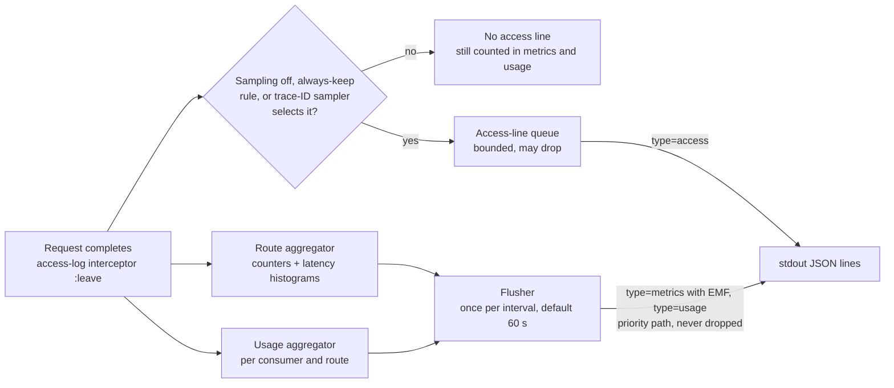

<!-- Excerpt of 02-architecture.md, section 12.3 (draft 3, September 28, 2026; product renamed from Emissary to BeFive, derived names changed mechanically). Cross-references such as 12.2, 13.3, or 5.3 point to sections of 02-architecture.md. -->

### 12.3 Metrics, usage summaries, and optional access-log sampling

This subsection defines how CloudWatch metrics and usage accounting are produced, and the optional sampling mode for access logs. The default is unchanged from doc 1 (2.5): **one access line per request**. Sampling is an opt-in setting for high-traffic customers.

#### 12.3.1 Decisions

| Topic | Decision |
|---|---|
| Default access logging | One line per request (and per WebSocket connection at close). Sampling is off. |
| Where EMF metrics live | In per-node **route summary lines**, written once per flush interval (default 60 s), in **both** modes. Access lines carry no EMF. |
| Usage accounting | Per-node **usage summary lines** per (consumer, route) per interval, in both modes. The monthly report and the usage queries read these, never access lines. |
| Sampling (opt-in) | Global rate with per-route overrides; always-keep rules for errors, denials, upstream failures, slow requests, listed consumers, and (only if an administrator enables it) a force-log header. |
| Sampling decision | Deterministic from the W3C trace ID, using OpenTelemetry's consistent probability sampling rule, so every node and any upstream tracer using the same rule agree. |
| Exactness | Metrics and usage are recorded from every request *before* the sampling decision, so they are exact in both modes. Counts computed from access lines are exact in default mode and unbiased estimates (weighted by `1 / sample_rate`) when sampling. |

**Why summary lines in both modes.** The alternative, per-request EMF by default and summaries only when sampling, means two metric pipelines with subtly different statistics, a discontinuity in every dashboard when an operator flips the switch, and two recipe variants to test. Using summaries always gives:
- one metric definition and one dashboard recipe, whatever the logging mode; turning sampling on or off never changes a metric;
- metrics that no longer depend on access-log health: a line dropped because the access queue is full (12.1) does not lose its metrics;
- smaller access lines: the EMF envelope and metric copies were about 0.95 KB of the 2.1 KB example line in draft 1;
- access lines that can go to the CloudWatch Logs Infrequent Access log class, which does not support Embedded Metric Format extraction (AWS "Log classes" documentation, retrieved September 28, 2026); summary lines stay in a Standard log group (13.1).

The accepted costs: metrics have interval resolution (60 s by default) and appear up to one interval later than per-request EMF would; latency values are quantized (at most about 1% relative error); and a node crash loses at most one interval of that node's summaries (12.3.4).



#### 12.3.2 Route summary lines (EMF)

For every route that saw traffic in the interval, each node writes one or more documents with `type: "metrics"`, `kind: "route"`, schema `befive.metrics/1`. Requests that matched no route (`404`, malformed requests) are recorded under the pseudo-route `_unmatched`, so fleet totals include them.

- **Part 1** carries the counters as single summed values (`Requests`, `Status4xx`, `Status5xx`, `AuthFailures`, `AuthzDenials`, `RateLimited`, `BytesOut`; `BytesIn` is a plain field, not a metric) plus the first values of each latency metric.
- **Parts 2 to n** carry only the remaining latency values, at most 100 per metric per document (the EMF limit for value arrays). Counters are never repeated, so `Sum` across parts, nodes, and intervals is exact.
- Each document declares only the metrics it contains. The directives keep draft 1's cardinality rules: `Requests`, `Status4xx`, `Status5xx`, and `Latency` under both `[Environment]` and `[Environment, Route]`; the other six metrics under `[Environment]` only. Route IDs are admin-defined and bounded (never taken from client input).
- Consumer, client IP, and status code are deliberately **not** dimensions: they are unbounded or high-cardinality, and each unique combination is a billed custom metric. Per-consumer data lives in log fields (usage lines and access lines) and is analyzed with Logs Insights, which costs per query rather than per metric per month.
- `_aws.Timestamp` is the interval start, so all nodes' documents for one interval land in the same CloudWatch minute. Every document stays under 4 KB, far below Docker's 16 KB log-line split and EMF's 1 MB document limit.

Example part 1 (sample values; the three latency arrays are shortened here to 5 of their 100 values):

```json
{
  "_aws": {
    "Timestamp": 1790564640000,
    "CloudWatchMetrics": [
      {
        "Namespace": "BeFive",
        "Dimensions": [["Environment"], ["Environment", "Route"]],
        "Metrics": [
          {"Name": "Requests", "Unit": "Count"},
          {"Name": "Status4xx", "Unit": "Count"},
          {"Name": "Status5xx", "Unit": "Count"},
          {"Name": "Latency", "Unit": "Milliseconds"}
        ]
      },
      {
        "Namespace": "BeFive",
        "Dimensions": [["Environment"]],
        "Metrics": [
          {"Name": "AuthFailures", "Unit": "Count"},
          {"Name": "AuthzDenials", "Unit": "Count"},
          {"Name": "RateLimited", "Unit": "Count"},
          {"Name": "BytesOut", "Unit": "Bytes"},
          {"Name": "UpstreamLatency", "Unit": "Milliseconds"},
          {"Name": "GatewayLatency", "Unit": "Milliseconds"}
        ]
      }
    ]
  },
  "schema": "befive.metrics/1", "type": "metrics", "kind": "route",
  "summary_id": "befive-7f9c2:1790560000:17", "node": "befive-7f9c2",
  "environment": "prod", "Environment": "prod", "route_id": "orders-get", "Route": "orders-get",
  "interval_start": "2026-09-28T03:04:00Z", "interval_s": 60, "part": 1, "parts": 19,
  "Requests": 1834, "Status4xx": 12, "Status5xx": 1, "AuthFailures": 9, "AuthzDenials": 3,
  "RateLimited": 0, "BytesIn": 0, "BytesOut": 3360912,
  "latency_samples": 1834, "latency_values_emitted": 1834,
  "Latency": [3.21, 3.21, 3.28, 3.34, 3.34],
  "UpstreamLatency": [2.46, 2.51, 2.51, 2.56, 2.61],
  "GatewayLatency": [0.412, 0.412, 0.42, 0.429, 0.437]
}
```

`Environment` and `Route` appear in PascalCase because EMF dimension values must be root-level keys named exactly like the dimension; the snake_case copies keep the log schema uniform for queries. Parts 2 to 19 repeat the envelope with only `Latency`, `UpstreamLatency`, and `GatewayLatency` declared and present.

**Latency: how percentiles stay meaningful.** An EMF metric value is a number or an array of up to 100 numbers; EMF has no equivalent of the `PutMetricData` values-and-counts pairs or statistic sets (EMF specification, retrieved September 28, 2026). `PutMetricData` would need CloudWatch API calls and IAM permissions on every gateway, which doc 1 rules out, and statistic sets (sum, count, minimum, maximum) cannot produce percentiles at all. So the gateway records each latency into a log-linear histogram per route and metric (bucket boundaries grow by 2% from 0.01 ms to 300 s, 870 buckets) and, at flush, expands the histogram back into values: each non-empty bucket contributes its representative value (geometric midpoint, 4 significant digits) once per request it holds. CloudWatch therefore sees one sample per request, and `p50`, `p99`, `SampleCount`, and `Average` of the latency metrics, computed over all nodes' documents for a minute, behave as they did with per-request EMF. The limits, stated plainly:

1. **Quantization.** Each value is off by at most about 1% (half a bucket width). A p99 of 212 ms is reported within about ±2 ms. CloudWatch then applies its own percentile approximation, as it does for any metric.
2. **Volume cap.** To bound output, a node emits at most `latency-values-max` values per route, metric, and interval (default 10,000, which is 100 documents). Above the cap the histogram is scaled down proportionally before expansion (largest-remainder rounding; every non-empty bucket keeps at least one value). That node's percentiles stay accurate to the quantization error up to about p99.9; beyond `1 − 1/cap` (p99.99 at the default) resolution is lost. `SampleCount` of `Latency` then undercounts requests, which is why request counts always come from `Requests` `Sum`. When only some nodes are capped, fleet-wide percentiles weight the uncapped nodes' samples slightly more than their share of traffic. The `LatencyValuesDownscaled` metric counts downscaled route-intervals so operators know when to raise the cap. At the default cap and a 60 s interval, downscaling starts above about 167 requests per second on one route on one node.
3. **Counters are exact, but only `Sum` means anything.** `SampleCount` and `Average` of counter metrics now count documents, not requests. Dashboards and alarms use `Sum` and metric math only (13.2, 13.4), and the recipe validator rejects any other statistic on a counter metric.
4. **Resolution and delay.** One data point per interval, no sub-minute metrics. Data appears one interval plus a few seconds after the traffic, so alarms react about a minute later than with per-request EMF.
5. **Delivery.** AWS documents EMF extraction as at-least-once, so a duplicated document can occasionally over-count. This was equally true of per-request EMF.

WebSocket connections count in `Requests` and the status metrics but are left out of the latency arrays, because their duration is the connection's lifetime, not a latency.

#### 12.3.3 Usage summary lines

Every interval, each node writes one `type: "usage"` line (schema `befive.usage/1`, no EMF) per (consumer, route) pair that saw traffic. Requests without a resolved consumer are counted in the route metrics only.

```json
{"schema": "befive.usage/1", "type": "usage", "summary_id": "befive-7f9c2:1790560000:u:412", "seq": 412,
 "process_start": 1790560000, "ts": "2026-09-28T03:05:01.004Z", "interval_start": "2026-09-28T03:04:00Z", "interval_s": 60,
 "environment": "prod", "node": "befive-7f9c2",
 "consumer_id": "acme-corp", "consumer_name": "Acme Corp", "plan_id": "gold", "route_id": "orders-get",
 "requests": 412, "status_2xx": 405, "status_3xx": 0, "status_4xx": 6, "status_5xx": 1,
 "rate_limited": 0, "bytes_in": 0, "bytes_out": 754112, "latency_ms_sum": 6091.37, "latency_ms_max": 212.4}
```

| Field | Type | Description |
|---|---|---|
| `summary_id` | string | Unique per line: node ID, process start (epoch seconds), sequence. |
| `seq` | integer | Per-process sequence number over usage lines, without gaps. The report uses it to detect duplicated or missing lines (13.5). |
| `process_start` | integer | Start time of the writing process (epoch seconds); with `node`, identifies the sequence that `seq` counts in. |
| `ts` | string | When the line was written. |
| `interval_start`, `interval_s` | string, integer | The interval (UTC, aligned to wall-clock boundaries). |
| `partial` | boolean | Present and true for the final, shortened interval written at shutdown. |
| `consumer_id`, `consumer_name`, `plan_id`, `route_id` | string | Attribution, copied from configuration at request time (so reports need no database). |
| `requests` | integer | All requests of this consumer on this route, including rejected ones. |
| `status_2xx`, `status_3xx`, `status_4xx`, `status_5xx` | integer | By final status class; `status_2xx` includes `101` WebSocket upgrades. |
| `rate_limited` | integer | Rejected by a rate limit or quota. |
| `bytes_in`, `bytes_out` | integer | Request and response body bytes. |
| `latency_ms_sum`, `latency_ms_max` | number | For averages and worst case; percentiles come from the metrics. |
| `overflow` | boolean | Present and true on `_overflow` lines (12.3.4). |

Usage lines make the monthly report and the usage and quota widgets exact in both modes. Quota **enforcement** is unaffected: it uses the counters in 11.4, not logs.

#### 12.3.4 Aggregation, flush, shutdown, crash loss, and memory

- **Attribution.** A request is counted in the interval in which it completes (WebSocket connections at close), on the node that served it. Intervals align to wall-clock boundaries (`interval-s` is 10, 20, 30, or 60; default 60), so all nodes' documents for an interval share a timestamp.
- **Hot path.** The access-log interceptor's `:leave` step updates the aggregators for every request, before the sampling decision: a few atomic increments on per-route counters, one histogram bucket increment per latency metric, and one lookup-and-increment in the usage map. Each aggregator has two generations selected by interval parity, so request threads never wait for a flush. The 0.2 ms response-path budget in 20.1 includes this work.
- **Flush.** One second after each boundary (so in-flight updates to the closed generation have finished), a flusher on a virtual thread reads and resets the closed generation, serializes one document at a time, and hands the documents to the stdout writer on a **priority path that never drops**: summaries bypass the bounded access-line queue and are written ahead of queued access lines. Only access lines can be dropped under overload (`DroppedAccessLogs`).
- **Shutdown (SIGTERM).** After the drain in 4.4 finishes (no requests in flight), the node closes the current partial interval and flushes it at once, with `"partial": true` and the interval-start timestamp. The writer then drains queued access lines within the existing 2 s budget. A clean shutdown loses no metrics or usage.
- **Crash** (SIGKILL, host loss, `ExitOnOutOfMemoryError`). The node loses its unflushed aggregates: at most one interval plus one second of that node's metrics and usage, together with any lines still in the stdout pipe or the log shipper's buffer. A node serving 250 requests per second loses at most about 15,000 requests from metrics and usage. A 10 s interval shrinks that to about 2,750, at the cost of six times as many usage lines. The report's completeness check makes such gaps visible (13.5). Quota enforcement counters are unaffected.
- **Memory bounds** (per node, both generations):
  - Route aggregator: counters plus three dense latency histograms of 870 four-byte buckets, allocated only for routes that see traffic, about 10.5 KB per active route per generation. Two generations: 200 active routes use about 4 MB; 2,000 routes (the compile-time target in 6.4) about 42 MB, worst case.
  - Usage aggregator: about 200 bytes per (consumer, route) key, capped at `usage-max-keys` per generation (default 100,000), so at most about 40 MB for both generations. When the cap is reached, requests with new keys are accumulated into one `_overflow` line per route (`consumer_id: "_overflow"`, `overflow: true`): totals stay exact, per-consumer attribution for those requests is lost, and `UsageOverflowRequests` (alarmed in 13.4) reports how many. Typical installs use a few thousand keys.
  - Serialization streams one document at a time; there is no per-interval output buffer.
- **Signals for anomaly detection.** The same closed generation also feeds the signal shipper (14.3), which writes one compact row per node per minute to PostgreSQL. It reads the generation after the summary lines are written and never delays them.

#### 12.3.5 Sampling mode (opt-in)

With `:access-log {:sampling {:enabled true}}` (5.3), the access-log interceptor decides per request whether to write the access line. The decision runs after the aggregators are updated and before the line's map is built, so a skipped request costs almost nothing beyond its metrics.

**Rates.** A global `rate` between 0 and 1 (for example 0.1), overridable per route with the route's `:logging {:sample-rate r}` (5.3). A rate of 0 keeps only always-keep lines, which suits health-check and polling routes. Route rates have effect only while sampling is enabled.

**Always-keep rules.** A request that matches an enabled rule is logged with `sample_rate` 1, whatever the sampler says. Rules are checked in this order, and the first match becomes `log_reason`:

| Rule | `log_reason` | Default when sampling is on |
|---|---|---|
| Final status 500 or above | `keep:5xx` | on |
| Authentication failure (`auth_result = fail`, usually `401`) | `keep:authn` | on |
| Authorization denial (usually `403`) | `keep:authz` | on |
| Rate-limit or quota rejection (`429`, or `503` when the rate-limit backend fails closed) | `keep:ratelimit` | on |
| Upstream error or timeout, retried request (`attempts > 1`), client abort (`499`) | `keep:upstream` | on |
| Any other 4xx status | `keep:4xx` | on for all 4xx; can be narrowed to a set such as `#{400 404 413}` or turned off. `401`, `403`, and `429` from denials stay covered by the rules above. |
| `latency_ms` at or above a threshold | `keep:slow` | on, 1,000 ms; per-route override `:logging {:slow-ms n}` |
| Consumer on the always-keep list | `keep:consumer` | empty list |
| Force-log header from an allowed source | `keep:debug` | off (see below) |
| WebSocket connection | `keep:ws` | on (one line per connection is cheap) |
| Incoming `traceparent` has the sampled flag | `keep:trace` | off; the flag is client-controlled, so anyone could force logging |

**Force-log header.** Disabled by default. When an administrator enables it, a request carrying the configured header (default `X-BeFive-Force-Log: 1`) is always logged, but only if it comes from an allowed CIDR (resolved client IP, 8.8) or authenticates as an allowed consumer; otherwise the header is ignored. Enabling it requires at least one allowed CIDR or consumer. The header is stripped before proxying whenever the feature is enabled, and forced lines are capped per node (default 50 per second), so a leaked allow-list entry cannot flood the logs.

**Keep budget.** Always-keep lines can dominate volume during an incident or an attack: a credential-stuffing flood of 401s is entirely always-keep. A token bucket per node (`keep-budget-per-second`, default 1,000 lines per second) caps them. Over budget, a matching request falls back to the trace-ID sampler; if selected, it is logged with the route's rate as `sample_rate` and `log_reason: "capped:<rule>"` (for example `capped:authn`), and every over-budget match increments `AlwaysKeepCapped`. Weighting stays correct because `sample_rate` is always the line's real inclusion probability. Metrics and usage remain exact regardless.

**Deterministic decision.** The sampler follows OpenTelemetry's consistent probability sampling, which relies on the randomness of W3C trace IDs:
1. The randomness value `R` is the explicit `rv` sub-key of an OpenTelemetry `tracestate` entry (`ot=rv:<14 hex digits>`) when present; otherwise it is the lowest 56 bits of the trace ID.
2. The rate `p` becomes a threshold `T = round((1 − p) × 2^56)`, and the request is in the sample when `R ≥ T`.
3. The gateway generates a random trace ID when a request has none (12.8), so every request has randomness.

Consequences: every node makes the same decision for the same trace, so a client retry that lands on another node, or a request that passes through two gateway tiers, is logged everywhere or nowhere. An upstream service's tracer that samples with the same rule at rate `q ≥ p` has traced every request the gateway sampled, so each sampled gateway line has a matching trace; with `q < p`, the traced requests are a subset of the gateway-sampled ones. The headers are only read; pass-through mode (12.8) forwards `traceparent` and `tracestate` unchanged.

**Client-chosen trace IDs.** A client that sets its own `traceparent` chooses `R`, so it can steer its successful requests out of (or into) the sample. It cannot hide from metrics, usage accounting, or any always-keep rule (errors, denials, slow requests, listed consumers). Customers who treat access logs as a security record should keep sampling off or set `:randomness :keyed`: `R` then comes from HMAC-SHA-256 of the trace ID under a cluster key held in the keyring, which stays consistent across nodes and retries but no longer lines up with external tracing samplers.

#### 12.3.6 Per-line sampling fields and query scaling

Every access line carries three fields, in both modes (12.2):

| Field | Default mode | Sampling mode |
|---|---|---|
| `sample_rate` | `1` | The line's inclusion probability: `1` when kept by an always-keep rule, otherwise the route's rate `p`. |
| `in_sample` | `1` | `1` if the trace-ID sampler selected the request at the route's rate (whatever the reason the line was kept), otherwise `0`. |
| `log_reason` | `"all"` | `"sampled"`, `"keep:<rule>"`, or `"capped:<rule>"`. |

Query rules (the saved queries in 13.3 follow them; in default mode every weight is 1, so they return exactly what unweighted queries would):
- **Counts and sums** use Horvitz–Thompson weights: `fields 1 / sample_rate as w | stats sum(w)`, and for bytes `fields bytes_out / sample_rate as bytes_out_w`. This is unbiased for any mix of route rates and keep rules. The relative standard error of an estimate built from `n` sampled lines is roughly √((1 − p) / n): about 3% for 1,000 lines at a 10% rate, about 10% for 100 lines.
- **Queries restricted to always-kept traffic** (5xx, and 401/403/429 under the default rules) are exact, because every such line has weight 1, unless the keep budget was exceeded, in which case they are unbiased estimates.
- **Percentiles and distributions** use `filter in_sample = 1`, a uniform sample of each route's traffic (always-keep lines on their own over-represent slow and failed requests). Across routes with different rates that sample is not uniform, so fleet-wide or cross-route percentiles come from the `Latency` metric.
- **Distinct counts** (distinct client IPs, distinct routes) are lower bounds while sampling; distinct consumers come from usage lines.
- **Single requests** (Q2, Q4) may have no gateway line when sampled out. The `X-Request-ID` still correlates with upstream logs, and a consumer under investigation can be added to the always-keep list.

#### 12.3.7 Periodic node metric lines

Besides route summaries, each node writes these `type: "metrics"` lines every 60 s:

| Metric | Dimensions | Source | Use |
|---|---|---|---|
| `NodeUp` (1) | `[Environment]` | each gateway node | `Sum` per minute = live node count |
| `HealthyTargets`, `UnhealthyTargets` | `[Environment, Upstream]` | each gateway node's view | upstream health widget (`Minimum` across nodes for healthy) |
| `ConfigRevisionLag` | `[Environment]` | each node: current minus applied revision | alarm if a node stays behind |
| `DroppedAccessLogs` | `[Environment]` | each node | alarm if non-zero |
| `RateLimitBackendDegraded` (0/1) | `[Environment]` | each node | alarm on Redis problems |
| `UsageOverflowRequests` | `[Environment]` | each node: requests accumulated into `_overflow` usage lines | alarm if non-zero |
| `LatencyValuesDownscaled` | `[Environment]` | each node: route-intervals whose latency values were downscaled | dashboard hint to raise the cap |
| `AlwaysKeepCapped` | `[Environment]` | each node: always-keep matches over the keep budget | shown on the sampling widget |
| `CertificateDaysToExpiry` | `[Environment]` (minimum across certificates) | control plane | alarm below 14 days |
| `SignalMinutesDropped` | `[Environment]` | each node: per-minute signal rows dropped because PostgreSQL was unreachable for over 15 minutes (14.3) | alarm if non-zero |
| `OpenIncidents`, `ActionsDead` | `[Environment]` | control plane leader | dashboard; alarm if `ActionsDead` > 0 (an integration kept failing for 24 h) |

#### 12.3.8 Custom metrics and ingestion cost

**Custom metrics** = 10 + 4 × (routes + 1) + 2 × upstreams + 8. The `+ 1` is the `_unmatched` pseudo-route; the 8 are the single-dimension metrics in 12.3.7. For 200 routes and 30 upstreams that is 882 metrics. At USD 0.30 per metric per month for the first 10,000 metrics (AWS CloudWatch pricing page, pricing examples for US East (N. Virginia), retrieved September 28, 2026; prices vary by Region and change over time) that is roughly USD 265 per month. Sampling does not change the metric count. `:emf {:route-metrics false}` removes the 4 × (routes + 1) term. The recipe README carries this formula.

**Log ingestion estimate.** Rough planning arithmetic, not a measurement. Assumptions:
- 1,000 requests per second around the clock (86.4 million per day), 30-day month, 4 gateway nodes, 50 routes active on every node, 500 active (consumer, route) pairs per node per minute.
- 1.2 KB per access line (planning figure; the full-field example in 12.2 is about 1.1 KB now that EMF is gone); 1 KB = 1,000 bytes, 1 GB = 10^9 bytes.
- 2% of requests match an always-keep rule under the defaults (4xx, 5xx, denials, slow requests), and the keep budget is not reached. Kept fraction = p + (1 − p) × 0.02.
- Summary overhead, sized from the example documents above: route summaries about 700 documents per minute cluster-wide (60,000 latency samples at 100 per document, plus a partly filled last document per route and node) at about 2.3 KB each, about 1.6 MB per minute; usage lines 4 × 500 × 0.48 KB, about 0.96 MB per minute; node metric lines about 0.02 MB per minute. Total about 2.6 MB per minute (about 43 bytes per request), or 3.7 GB per day, the same in every mode.

| Mode | Access lines kept | Access GB/day | Summary GB/day | Total GB/day | Total GB/month | Ingestion, all Standard (illustrative) | Ingestion, access lines in Infrequent Access (illustrative) |
|---|---|---|---|---|---|---|---|
| Sampling off (default) | 100% | 103.7 | 3.7 | 107.4 | ~3,220 | ~USD 1,610 | ~USD 830 |
| Sampling at 10% | 11.8% | 12.2 | 3.7 | 16.0 | ~480 | ~USD 240 | ~USD 150 |
| Sampling at 1% | 2.98% | 3.1 | 3.7 | 6.8 | ~205 | ~USD 100 | ~USD 80 |
| Sampling at 0% (always-keep only) | 2% | 2.1 | 3.7 | 5.8 | ~175 | ~USD 90 | ~USD 70 |

The price columns cover ingestion only, at USD 0.50 per GB for the Standard log class and USD 0.25 per GB for Infrequent Access, as shown in the pricing examples cited above (US East (N. Virginia), retrieved September 28, 2026). Summary lines are always priced as Standard because they carry EMF. The figures leave out the free tier, storage, and Logs Insights query charges (queries scan less data when sampling). Customers must check current prices for their Region.

How to read it: below about 5%, always-keep lines and the fixed summary overhead dominate, so going from 10% to 1% saves far less than ten times; the customer's own error and 4xx rate becomes the main lever (narrowing `status-4xx` or lowering the keep budget). Summary overhead grows with request count (about 27 bytes per request for latency values) and with active (consumer, route) pairs, not with the sample rate. For comparison, draft 1's per-request EMF lines (about 2.15 KB each) would have ingested about 5,570 GB per month at this traffic, so the default mode is also about 40% cheaper than before.
